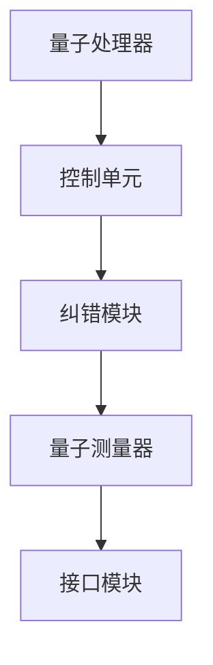
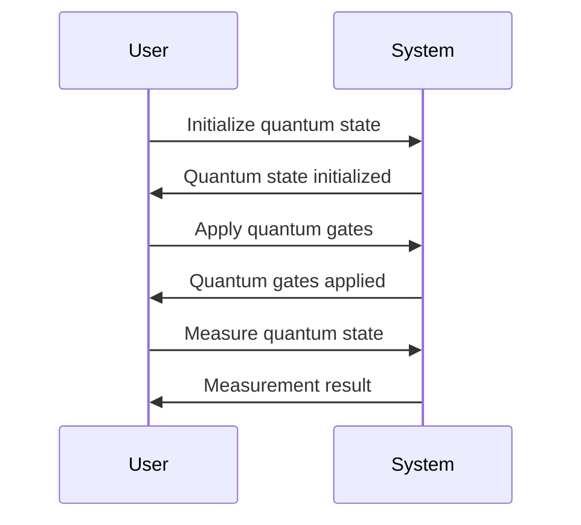

                 

### 引入

# 数学与量子计算：未来计算的数学基础

> 关键词：数学、量子计算、算法原理、系统架构、项目实战

在信息技术和科学领域，计算能力的提升一直是推动技术进步的关键因素。传统计算机依赖于经典比特（经典信息单位）进行数据存储和处理，然而随着计算问题的复杂度不断增加，经典计算机的局限性也逐渐显现。量子计算作为一种全新的计算范式，以其独特的量子叠加态和纠缠态，展现出超越经典计算机的巨大潜力。本文旨在探讨数学与量子计算之间的紧密联系，从基础概念到算法原理，再到系统架构设计与应用实践，逐步揭示量子计算的数学基础。

本文将首先介绍数学和量子计算的基本概念，帮助读者建立对这两个领域的基本理解。接着，我们将深入探讨量子计算的数学模型，包括量子比特、量子门和量子纠缠等核心概念，并通过表格和流程图展示概念之间的关系。在此基础上，我们将详细讲解Shor算法和Grover算法等量子算法，使用Python源代码和数学模型进行阐述。随后，我们将讨论量子计算在实际应用场景中的系统分析与架构设计，展示如何实现一个完整的量子计算系统。最后，通过一个实际项目展示如何应用数学和量子计算知识，并提供源代码解析和案例分析，总结全书内容，并给出实践建议和拓展阅读。

### 数学与量子计算的关系

在探讨量子计算与数学的关系之前，有必要先了解两者各自的基本概念。

**数学**作为一门基础科学，主要研究数量、结构、变化和空间等概念。它提供了一种精确且逻辑化的思维方式，帮助人类理解世界的规律。在计算机科学领域，数学被广泛应用于算法设计、数据结构、计算理论等方面。

**量子计算**则是一门新兴的计算科学，它基于量子力学的原理，利用量子比特（qubit）进行信息处理。量子计算的基本单元是量子比特，它不仅可以像经典比特一样表示0或1，还可以同时处于0和1的叠加状态，这一特性使得量子计算机在处理某些特定问题时具有超越经典计算机的强大能力。

数学与量子计算的关系可以从多个维度来理解：

1. **数学模型**：量子计算中的许多概念，如量子比特、量子门和量子纠缠等，都可以通过数学模型进行描述。例如，量子比特的叠加态可以表示为复数向量，量子门的运算可以通过线性代数矩阵来描述。

2. **算法设计**：量子算法的设计和实现依赖于数学理论，特别是线性代数、概率论和数论等领域。例如，Shor算法利用数论中的分解性质，通过量子计算高效地解决质因数分解问题。

3. **计算机科学**：数学为计算机科学提供了基础工具和方法，如算法分析、复杂性理论和编程语言等。这些工具和方法同样适用于量子计算领域，帮助研究者理解量子算法的性能和可行性。

4. **应用领域**：量子计算在多个领域具有潜在应用价值，如量子化学、量子优化和量子加密等。这些应用领域的发展离不开数学的支持，需要运用数学方法来构建模型、设计算法和解决实际问题。

总之，数学与量子计算之间存在着紧密的联系和相互促进的关系。数学为量子计算提供了理论基础和工具，而量子计算则为数学提供了一个全新的应用场景，推动了数学理论的进一步发展。

### 量子计算的基本原理

量子计算的核心原理源于量子力学的基本概念，其中量子比特（qubit）是量子计算的基本单元。与传统计算机中的经典比特（仅能表示0或1）不同，量子比特可以同时处于0和1的叠加状态，这一特性被称为量子叠加。

**量子叠加态**可以用一个复数向量来表示。假设有一个单量子比特系统，其量子态可以表示为：

$$\left| \psi \right\rangle = a \left| 0 \right\rangle + b \left| 1 \right\rangle$$

其中，$a$ 和 $b$ 是复数，且满足 $|a|^2 + |b|^2 = 1$。这个表达式表示量子比特同时处于状态0和1的概率分别为$|a|^2$和$|b|^2$。

**量子比特的叠加态**可以通过量子门（quantum gate）进行操作。量子门是量子计算中的基本操作单元，类似于经典计算中的逻辑门。量子门通过线性变换作用于量子比特，改变其叠加态。

一个基本的量子门是**Pauli-X门**，它将量子比特的叠加态翻转，可以表示为：

$$X = \begin{pmatrix} 0 & 1 \\ 1 & 0 \end{pmatrix}$$

当量子门作用于一个量子态$\left| \psi \right\rangle$时，新的量子态$\left| \psi' \right\rangle$可以表示为：

$$\left| \psi' \right\rangle = X \left| \psi \right\rangle = a \left| 1 \right\rangle + b \left| 0 \right\rangle$$

**量子纠缠**是量子计算的另一个重要特性。当两个量子比特发生纠缠时，它们的量子态将无法独立描述，而是相互关联。这种关联关系可以通过量子态的联合概率分布来描述。

例如，考虑两个量子比特的初始叠加态：

$$\left| \psi \right\rangle_{AB} = \frac{1}{\sqrt{2}} (\left| 00 \right\rangle + \left| 11 \right\rangle)$$

如果对其中一个量子比特施加Pauli-X门，新的量子态将变为：

$$\left| \psi' \right\rangle_{AB} = \frac{1}{\sqrt{2}} (\left| 01 \right\rangle + \left| 10 \right\rangle)$$

此时，两个量子比特的量子态相互纠缠，无法单独描述。

**量子比特与经典比特的对比**：

1. **叠加态**：量子比特可以同时处于多个状态的叠加，而经典比特只能处于单一状态。
2. **纠缠态**：量子比特可以通过纠缠实现相互关联，而经典比特之间不存在这种关联。
3. **计算能力**：量子计算机在处理某些特定问题（如大数分解、量子搜索等）上具有超越经典计算机的潜力。

量子计算的基本原理为构建高效的信息处理系统提供了新的思路和方法。通过理解量子比特、量子叠加和量子纠缠等基本概念，我们可以更好地掌握量子计算的本质，为后续的算法讲解和系统设计打下坚实基础。

### 数学基础

量子计算的发展离不开数学的支持，而线性代数作为数学中的一个重要分支，在量子计算中扮演着核心角色。为了更好地理解量子计算中的数学原理，我们需要掌握一些基本的线性代数概念。

**向量空间**是线性代数中最基本的概念之一。在量子计算中，向量空间用于描述量子态。一个量子态可以用一个复数向量表示，其维度通常等于量子比特的数量。例如，对于两个量子比特的系统，其向量空间可以表示为二维复数空间：

$$V = \left\{ \left| \psi \right\rangle \in \mathbb{C}^2 : \left| \psi \right\rangle = \begin{pmatrix} a \\ b \end{pmatrix} \right\}$$

其中，$\left| \psi \right\rangle$表示量子态，$a$和$b$是复数。

**矩阵运算**是量子计算中的另一个关键概念。量子门可以通过矩阵表示，矩阵的运算反映了量子门对量子态的线性变换。例如，Pauli-X门可以用以下矩阵表示：

$$X = \begin{pmatrix} 0 & 1 \\ 1 & 0 \end{pmatrix}$$

当量子门作用于量子态$\left| \psi \right\rangle$时，新的量子态$\left| \psi' \right\rangle$可以通过矩阵乘法计算得到：

$$\left| \psi' \right\rangle = X \left| \psi \right\rangle$$

**线性变换**描述了量子门如何改变量子态。线性变换保持向量空间的线性组合不变，这一特性使得量子计算中的线性代数运算具有直观和简洁的形式。

为了更好地理解这些概念，我们可以通过以下表格来对比经典比特和量子比特在数学属性上的差异：

| **属性**             | **经典比特**                                      | **量子比特**                                      |
|----------------------|--------------------------------------------------|--------------------------------------------------|
| **表示形式**         | 二进制（0或1）                                    | 复数向量（叠加态）                                 |
| **叠加态**           | 不支持                                            | 可以处于多个状态的叠加态                           |
| **纠缠态**           | 不支持                                            | 可以与其他量子比特形成纠缠态                       |
| **线性运算**         | 简单的位运算（AND、OR、NOT等）                    | 复杂的矩阵运算（线性变换）                         |
| **计算能力**         | 有限的计算能力（受限于算法复杂度）                | 潜在的超越经典计算能力（某些特定问题）              |

通过这个表格，我们可以清晰地看到经典比特和量子比特在数学属性上的显著差异。量子比特的叠加态和纠缠态使得量子计算具有强大的并行计算能力，为解决复杂问题提供了新的思路。

总的来说，线性代数在量子计算中起到了基础性的作用。它不仅用于描述量子态和量子门的运算，还为量子算法的设计提供了理论工具。理解线性代数的基本概念，有助于我们深入探讨量子计算的数学原理和算法实现。

#### 向量空间

向量空间是线性代数中的一个基本概念，它在量子计算中有着广泛的应用。在量子计算中，量子态可以用一个复数向量来表示，这实际上就是一个向量空间中的向量。

**定义**：向量空间是一个集合，集合中的元素称为向量，这些向量可以进行加法和数乘两种运算，并满足以下性质：

1. **封闭性**：对于任意向量$\left| \psi \right\rangle$和$\left| \phi \right\rangle$，它们的和$\left| \psi \right\rangle + \left| \phi \right\rangle$仍在向量空间中。
2. **分配律**：对于任意标量$a$和$b$，以及任意向量$\left| \psi \right\rangle$和$\left| \phi \right\rangle$，有$(a + b)\left| \psi \right\rangle = a\left| \psi \right\rangle + b\left| \psi \right\rangle$和$a(\left| \psi \right\rangle + \left| \phi \right\rangle) = a\left| \psi \right\rangle + a\left| \phi \right\rangle$。
3. **结合律**：对于任意标量$a$、$b$和向量$\left| \psi \right\rangle$，有$(ab)\left| \psi \right\rangle = a(b\left| \psi \right\rangle)$。
4. **存在零向量**：存在一个零向量$\left| 0 \right\rangle$，对于任意向量$\left| \psi \right\rangle$，有$\left| 0 \right\rangle + \left| \psi \right\rangle = \left| \psi \right\rangle$。
5. **存在逆向量**：对于任意非零向量$\left| \psi \right\rangle$，存在一个逆向量$\left| -\psi \right\rangle$，使得$\left| \psi \right\rangle + \left| -\psi \right\rangle = \left| 0 \right\rangle$。

在量子计算中，量子态通常表示为复数向量，例如：

$$\left| \psi \right\rangle = \begin{pmatrix} a \\ b \end{pmatrix}$$

其中，$a$和$b$是复数。这个向量属于一个二维复数向量空间。量子态的叠加和线性组合可以通过向量的加法和数乘来表示：

$$\left| \psi' \right\rangle = a \left| \psi_1 \right\rangle + b \left| \psi_2 \right\rangle$$

在量子计算中，向量空间的重要性体现在以下几个方面：

1. **量子态的表示**：量子态可以用向量空间中的向量来表示，这为量子态的操作提供了数学基础。
2. **量子门的表示**：量子门可以通过线性变换矩阵来表示，这些矩阵作用于量子态向量，从而改变量子态。
3. **量子算法的设计**：量子算法可以通过对量子态的线性变换来设计，这依赖于向量空间的性质。

通过向量空间的概念，我们可以将量子计算中的抽象概念转化为具体的数学运算，从而更好地理解和实现量子算法。

#### 矩阵运算

矩阵运算是量子计算中的核心概念之一。矩阵不仅可以表示量子门，还可以描述量子态的线性变换。在量子计算中，矩阵运算通常涉及矩阵的加法、乘法以及与量子态向量的作用。

**矩阵加法**：对于两个$n \times n$的矩阵$A$和$B$，它们的和$A + B$也是一个$n \times n$的矩阵，计算规则为对应位置元素相加。例如：

$$A = \begin{pmatrix} 1 & 2 \\ 3 & 4 \end{pmatrix}, B = \begin{pmatrix} 5 & 6 \\ 7 & 8 \end{pmatrix}$$

$$A + B = \begin{pmatrix} 1+5 & 2+6 \\ 3+7 & 4+8 \end{pmatrix} = \begin{pmatrix} 6 & 8 \\ 10 & 12 \end{pmatrix}$$

**矩阵乘法**：对于两个矩阵$A$（$m \times n$）和$B$（$n \times p$），它们的乘积$AB$是一个$m \times p$的矩阵，计算规则为按行优先乘以列，即：

$$AB = \begin{pmatrix} \sum_{j=1}^{n} a_{ij}b_{ij} \end{pmatrix}_{i=1,...,m,j=1,...,p}$$

例如：

$$A = \begin{pmatrix} 1 & 2 \\ 3 & 4 \end{pmatrix}, B = \begin{pmatrix} 5 & 6 \\ 7 & 8 \end{pmatrix}$$

$$AB = \begin{pmatrix} 1 \cdot 5 + 2 \cdot 7 & 1 \cdot 6 + 2 \cdot 8 \\ 3 \cdot 5 + 4 \cdot 7 & 3 \cdot 6 + 4 \cdot 8 \end{pmatrix} = \begin{pmatrix} 19 & 26 \\ 31 & 40 \end{pmatrix}$$

**矩阵与量子态向量的作用**：量子态的线性变换可以通过矩阵与量子态向量的乘法来表示。假设量子态$\left| \psi \right\rangle = \begin{pmatrix} a \\ b \end{pmatrix}$，一个$n \times n$的矩阵$A$作用在这个量子态上，得到新的量子态$\left| \psi' \right\rangle$，计算方法如下：

$$\left| \psi' \right\rangle = A\left| \psi \right\rangle = \begin{pmatrix} a_{11} & a_{12} \\ a_{21} & a_{22} \end{pmatrix} \begin{pmatrix} a \\ b \end{pmatrix} = \begin{pmatrix} a_{11}a + a_{12}b \\ a_{21}a + a_{22}b \end{pmatrix}$$

例如，考虑一个两个量子比特的量子态$\left| \psi \right\rangle = \frac{1}{\sqrt{2}}(\left| 0 \right\rangle + \left| 1 \right\rangle)$，一个$2 \times 2$的矩阵$A = \begin{pmatrix} 1 & 1 \\ 1 & 0 \end{pmatrix}$作用于这个量子态上：

$$\left| \psi' \right\rangle = A\left| \psi \right\rangle = \begin{pmatrix} 1 & 1 \\ 1 & 0 \end{pmatrix} \begin{pmatrix} \frac{1}{\sqrt{2}} \\ \frac{1}{\sqrt{2}} \end{pmatrix} = \begin{pmatrix} \frac{1}{\sqrt{2}} + \frac{1}{\sqrt{2}} \\ \frac{1}{\sqrt{2}} \end{pmatrix} = \begin{pmatrix} 1 \\ \frac{1}{\sqrt{2}} \end{pmatrix}$$

通过矩阵运算，我们可以对量子态进行复杂的线性变换，这在量子计算中具有重要作用。理解矩阵运算是掌握量子计算数学基础的关键。

#### 线性变换

在量子计算中，线性变换是一个核心概念，它描述了量子门对量子态的作用。量子门可以看作是线性变换，通过矩阵运算实现量子态的转换。

**定义**：一个线性变换$T$作用于一个向量空间$V$中的向量$\left| \psi \right\rangle$，将$\left| \psi \right\rangle$映射到另一个向量$\left| \psi' \right\rangle$。形式上，可以表示为：

$$\left| \psi' \right\rangle = T\left| \psi \right\rangle$$

在量子计算中，线性变换通常通过矩阵$A$表示：

$$T = A$$

**线性变换的性质**：

1. **齐次性**：线性变换满足齐次性，即对于任意向量$\left| \psi \right\rangle$和标量$a$，有$T(a\left| \psi \right\rangle) = aT\left| \psi \right\rangle$。
2. **可加性**：线性变换满足可加性，即对于任意两个向量$\left| \psi_1 \right\rangle$和$\left| \psi_2 \right\rangle$，有$T(\left| \psi_1 \right\rangle + \left| \psi_2 \right\rangle) = T\left| \psi_1 \right\rangle + T\left| \psi_2 \right\rangle$。

**量子门作为线性变换**：量子门是量子计算中的基本操作单元，它通过对量子态进行线性变换来实现特定的计算任务。例如，Pauli-X门是一个基本的量子门，它将量子比特的叠加态翻转。其矩阵表示为：

$$X = \begin{pmatrix} 0 & 1 \\ 1 & 0 \end{pmatrix}$$

当作用于一个量子态$\left| \psi \right\rangle = \frac{1}{\sqrt{2}}(\left| 0 \right\rangle + \left| 1 \right\rangle)$时，可以得到：

$$\left| \psi' \right\rangle = X\left| \psi \right\rangle = \begin{pmatrix} 0 & 1 \\ 1 & 0 \end{pmatrix} \begin{pmatrix} \frac{1}{\sqrt{2}} \\ \frac{1}{\sqrt{2}} \end{pmatrix} = \begin{pmatrix} \frac{1}{\sqrt{2}} \\ \frac{1}{\sqrt{2}} \end{pmatrix} = \frac{1}{\sqrt{2}}(\left| 1 \right\rangle + \left| 0 \right\rangle)$$

**线性变换的组合**：量子计算中的复杂操作可以通过线性变换的组合来实现。例如，一个任意的量子态$\left| \psi \right\rangle$可以通过一系列量子门$G_1, G_2, ..., G_n$的连续作用得到：

$$\left| \psi' \right\rangle = G_n(G_{n-1}(...G_1\left| \psi \right\rangle...)...)$$

通过矩阵运算，这个组合可以表示为：

$$\left| \psi' \right\rangle = A_nA_{n-1}...(A_1\left| \psi \right\rangle...)$$

其中，$A_1, A_2, ..., A_n$分别是各个量子门的矩阵表示。

**举例说明**：考虑一个三个量子比特的系统，初始态为$\left| 000 \right\rangle$，通过一系列量子门作用后变为$\left| 111 \right\rangle$。我们可以通过矩阵运算来描述这个过程：

1. **初始化**：$\left| \psi \right\rangle = \left| 000 \right\rangle$。
2. **应用量子门**：假设我们使用了三个Pauli-X门，分别作用于第一个、第二个和第三个量子比特。
3. **计算结果**：每次应用量子门都可以通过矩阵乘法来计算新态，最终得到$\left| \psi' \right\rangle = \left| 111 \right\rangle$。

通过线性变换的概念，我们可以理解量子门如何作用于量子态，进而实现复杂的计算任务。线性变换的矩阵运算为量子计算提供了坚实的数学基础。

#### 量子比特的数学描述

量子比特（qubit）是量子计算的基本单元，其数学描述涉及叠加态、量子门和线性变换等概念。为了更好地理解量子比特，我们可以通过一个具体的数学模型来进行详细阐述。

**叠加态**：量子比特的一个核心特性是其叠加态，即一个量子比特可以同时处于0和1的状态。数学上，量子比特的叠加态可以用一个复数向量来表示。例如，一个两量子比特的量子态可以表示为：

$$\left| \psi \right\rangle = \frac{1}{\sqrt{2}} \left( \left| 00 \right\rangle + \left| 11 \right\rangle \right)$$

这个表示意味着量子比特同时以概率$\frac{1}{\sqrt{2}}$处于状态$\left| 00 \right\rangle$和状态$\left| 11 \right\rangle$。在矩阵表示中，这个叠加态可以看作是二维复数空间中的向量：

$$\left| \psi \right\rangle = \begin{pmatrix} \frac{1}{\sqrt{2}} \\ \frac{1}{\sqrt{2}} \end{pmatrix}$$

**量子门**：量子比特的操作通过量子门来实现，量子门是量子计算中的基本操作单元，其数学描述为矩阵。一个基本的量子门，如Pauli-X门（记作$X$），可以表示为：

$$X = \begin{pmatrix} 0 & 1 \\ 1 & 0 \end{pmatrix}$$

这个量子门的作用是将一个量子比特的状态翻转，即如果量子比特初始状态为$\left| 0 \right\rangle$，应用Pauli-X门后状态变为$\left| 1 \right\rangle$。类似地，Pauli-Z门（记作$Z$）和Pauli-Y门（记作$Y$）也可以表示为：

$$Z = \begin{pmatrix} 1 & 0 \\ 0 & -1 \end{pmatrix}, Y = \begin{pmatrix} 0 & -i \\ i & 0 \end{pmatrix}$$

**线性变换**：量子门的操作可以看作是线性变换。一个量子态$\left| \psi \right\rangle$通过量子门$U$作用后，新的量子态$\left| \psi' \right\rangle$可以表示为：

$$\left| \psi' \right\rangle = U\left| \psi \right\rangle$$

其中，$U$是量子门的矩阵表示。例如，一个任意的量子门$U$可以表示为：

$$U = \begin{pmatrix} a & b \\ c & d \end{pmatrix}$$

这个量子门作用于一个量子态$\left| \psi \right\rangle = \begin{pmatrix} x \\ y \end{pmatrix}$，新的量子态$\left| \psi' \right\rangle$可以计算为：

$$\left| \psi' \right\rangle = U\left| \psi \right\rangle = \begin{pmatrix} a & b \\ c & d \end{pmatrix} \begin{pmatrix} x \\ y \end{pmatrix} = \begin{pmatrix} ax + by \\ cx + dy \end{pmatrix}$$

**量子态的叠加**：量子比特可以同时处于多个状态的叠加。例如，一个两量子比特的量子态可以表示为：

$$\left| \psi \right\rangle = \frac{1}{\sqrt{2}} \left( \left| 00 \right\rangle + \left| 11 \right\rangle + \left| 01 \right\rangle - \left| 10 \right\rangle \right)$$

这个表示意味着量子比特同时以概率$\frac{1}{\sqrt{2}}$处于状态$\left| 00 \right\rangle$、$\left| 11 \right\rangle$、$\left| 01 \right\rangle$和$\left| 10 \right\rangle$。在矩阵表示中，这个叠加态可以看作是四维复数空间中的向量：

$$\left| \psi \right\rangle = \begin{pmatrix} \frac{1}{\sqrt{2}} \\ \frac{1}{\sqrt{2}} \\ \frac{1}{\sqrt{2}} \\ -\frac{1}{\sqrt{2}} \end{pmatrix}$$

通过这个数学模型，我们可以清楚地看到量子比特的叠加态、量子门和线性变换之间的关系，这为量子计算的理解和实现提供了坚实的理论基础。

### 量子门的数学模型

量子门是量子计算中的核心操作单元，它们通过对量子态进行线性变换来实现特定的计算任务。在数学上，量子门通常可以用矩阵表示，这些矩阵称为量子门矩阵。量子门矩阵的特性和结构决定了量子门对量子态的作用方式。

#### 量子门矩阵的基本特性

1. **线性变换**：量子门作为线性变换，其作用在量子态上可以通过矩阵乘法表示。假设$\left| \psi \right\rangle$是一个量子态向量，$U$是一个量子门矩阵，那么量子门作用后的新量子态$\left| \psi' \right\rangle$可以表示为：

   $$\left| \psi' \right\rangle = U\left| \psi \right\rangle$$

2. **可逆性**：量子门矩阵通常是可逆的，即存在逆矩阵$U^{-1}$，使得$UU^{-1} = U^{-1}U = I$，其中$I$是单位矩阵。可逆性保证了量子态的可恢复性。

3. **幺正性**：量子门矩阵满足幺正性条件，即$\langle \psi | U | \psi \rangle = 1$，这意味着量子门保持概率幅的归一性。幺正性是量子计算中的基本要求，因为量子态的叠加和纠缠需要概率幅的精确控制。

#### 量子门矩阵的表示

量子门矩阵的表示依赖于量子态的维度。对于$n$个量子比特的系统，量子门矩阵是一个$n^2 \times n^2$的方阵。以下是一些常见的量子门及其矩阵表示：

1. **Pauli-X门**（$X$）：
   $$X = \begin{pmatrix} 0 & 1 \\ 1 & 0 \end{pmatrix}$$

2. **Pauli-Z门**（$Z$）：
   $$Z = \begin{pmatrix} 1 & 0 \\ 0 & -1 \end{pmatrix}$$

3. **Pauli-Y门**（$Y$）：
   $$Y = \begin{pmatrix} 0 & -i \\ i & 0 \end{pmatrix}$$

4. **Hadamard门**（$H$）：
   $$H = \frac{1}{\sqrt{2}} \begin{pmatrix} 1 & 1 \\ 1 & -1 \end{pmatrix}$$

5. **CNOT门**（$CNOT$）：
   $$CNOT = \begin{pmatrix} 1 & 0 & 0 & 0 \\ 0 & 1 & 0 & 0 \\ 0 & 0 & 0 & 1 \\ 0 & 0 & 1 & 0 \end{pmatrix}$$

#### 量子门矩阵的作用

量子门矩阵作用于量子态时，通过矩阵乘法改变量子态的叠加态。例如，考虑一个两量子比特的量子态$\left| \psi \right\rangle = \frac{1}{\sqrt{2}} (\left| 00 \right\rangle + \left| 11 \right\rangle)$，应用Pauli-X门（$X$）后的量子态$\left| \psi' \right\rangle$可以计算如下：

$$\left| \psi' \right\rangle = X\left| \psi \right\rangle = \begin{pmatrix} 0 & 1 \\ 1 & 0 \end{pmatrix} \begin{pmatrix} \frac{1}{\sqrt{2}} \\ \frac{1}{\sqrt{2}} \end{pmatrix} = \begin{pmatrix} \frac{1}{\sqrt{2}} \\ -\frac{1}{\sqrt{2}} \end{pmatrix} = \frac{1}{\sqrt{2}} (\left| 11 \right\rangle - \left| 00 \right\rangle)$$

这个例子展示了量子门通过线性变换将量子态从一种叠加态转换到另一种叠加态。

#### 量子门组合的矩阵表示

量子计算中的复杂操作通常是通过一系列量子门的组合来实现的。假设有两个量子门$U_1$和$U_2$，它们作用在量子态$\left| \psi \right\rangle$上，组合后的量子态$\left| \psi' \right\rangle$可以表示为：

$$\left| \psi' \right\rangle = U_2U_1\left| \psi \right\rangle$$

如果$U_1$和$U_2$的矩阵表示分别为$A$和$B$，那么组合后的量子门矩阵$U$可以表示为$AB$。例如，考虑Hadamard门（$H$）和CNOT门（$CNOT$）的组合，它们的矩阵表示分别为：

$$H = \frac{1}{\sqrt{2}} \begin{pmatrix} 1 & 1 \\ 1 & -1 \end{pmatrix}, CNOT = \begin{pmatrix} 1 & 0 & 0 & 0 \\ 0 & 1 & 0 & 0 \\ 0 & 0 & 0 & 1 \\ 0 & 0 & 1 & 0 \end{pmatrix}$$

那么组合后的量子门矩阵$U = CNOTH$可以表示为：

$$U = CNOTH = \begin{pmatrix} 1 & 0 & 0 & 0 \\ 0 & 1 & 0 & 0 \\ 0 & 0 & 1 & 0 \\ 0 & 0 & 0 & -1 \end{pmatrix}$$

这个组合量子门的作用是将两个量子比特的状态从$\left| 00 \right\rangle$或$\left| 11 \right\rangle$转换到$\left| 10 \right\rangle$或$\left| 01 \right\rangle$。

通过量子门矩阵的数学模型，我们可以精确描述量子门对量子态的作用，从而在理论上理解和实现量子计算的各种操作。量子门矩阵的特性和组合方式为量子算法的设计提供了坚实的数学基础。

### 量子叠加与量子纠缠

量子叠加和量子纠缠是量子计算的两个核心特性，它们在量子态的演化中扮演着至关重要的角色。理解这两个概念，有助于我们深入探讨量子计算的优势和应用。

**量子叠加**是量子计算的一个基本特性，它指的是量子比特可以同时处于多个状态的叠加。在经典计算中，一个比特只能处于0或1的单一状态，而在量子计算中，量子比特可以同时处于0和1的叠加态。这种叠加态可以用一个复数向量来表示。例如，一个两量子比特的叠加态可以表示为：

$$\left| \psi \right\rangle = \frac{1}{\sqrt{2}} (\left| 00 \right\rangle + \left| 11 \right\rangle)$$

这个表示意味着这两个量子比特同时以概率$\frac{1}{\sqrt{2}}$处于状态$\left| 00 \right\rangle$和状态$\left| 11 \right\rangle$。量子叠加态的数学描述依赖于线性代数中的向量空间，具体来说，量子叠加态是一个复数向量，其元素是各个基态的复数线性组合。

**量子纠缠**是量子计算中的另一个关键特性，它描述了两个或多个量子比特之间的强关联。在经典计算中，不同位之间的关联可以通过共享相同的初始状态来建立，而在量子计算中，量子纠缠使得两个或多个量子比特即使在空间上相隔很远，它们的量子态仍然相互关联。这种关联关系称为量子纠缠。

例如，考虑两个量子比特的初始叠加态：

$$\left| \psi \right\rangle_{AB} = \frac{1}{\sqrt{2}} (\left| 00 \right\rangle + \left| 11 \right\rangle)$$

如果对其中一个量子比特（例如比特A）施加一个Pauli-X门，量子态将变为：

$$\left| \psi' \right\rangle_{AB} = X\left| \psi \right\rangle_{AB} = \frac{1}{\sqrt{2}} (\left| 01 \right\rangle + \left| 10 \right\rangle)$$

这个操作不仅改变了比特A的状态，还立即影响了比特B的状态，即使比特A和比特B在空间上相隔很远。这种即刻的相互作用体现了量子纠缠的非局域性。

**量子叠加与量子纠缠的关系**：

1. **叠加态**是量子纠缠的基础。没有叠加态，就无法形成量子纠缠。
2. **量子纠缠**增强了量子叠加态的计算能力。通过量子纠缠，多个量子比特可以协同工作，实现超越经典计算机的计算任务。

**数学表示**：

为了更好地理解量子叠加和量子纠缠，我们可以通过以下数学表示进行阐述：

- **量子叠加**：量子叠加态可以用一个复数向量表示，例如：

  $$\left| \psi \right\rangle = \alpha \left| 0 \right\rangle + \beta \left| 1 \right\rangle$$

  其中，$\alpha$和$\beta$是复数，且满足$|\alpha|^2 + |\beta|^2 = 1$。这个表达式表示量子比特同时以概率$|\alpha|^2$和$|\beta|^2$处于状态$\left| 0 \right\rangle$和状态$\left| 1 \right\rangle$。

- **量子纠缠**：量子纠缠可以通过联合量子态的联合概率分布表示。例如，两个量子比特的联合量子态可以表示为：

  $$\left| \psi \right\rangle_{AB} = \alpha \left| 00 \right\rangle + \beta \left| 11 \right\rangle$$

  如果对其中一个量子比特（例如比特A）进行测量，其结果将立即影响另一个量子比特（比特B）的状态。这种即刻的相互作用体现了量子纠缠的非局域性。

通过量子叠加和量子纠缠的数学描述，我们可以深入理解量子计算的特性和优势。量子叠加态和量子纠缠使得量子计算机在处理某些特定问题时具有超越经典计算机的能力，这为量子计算的发展和应用提供了广阔的前景。

### 算法原理讲解

量子计算中，算法的设计和实现是至关重要的。本文将详细介绍两个重要的量子算法：Shor算法和Grover算法。我们将首先介绍这两个算法的数学模型，然后通过Python源代码进行详细解释。

#### Shor算法

Shor算法是量子计算中最著名的算法之一，它利用量子计算的并行性，能够高效地解决质因数分解问题。质因数分解是许多加密算法（如RSA）的基础，因此Shor算法对密码学产生了深远影响。

**数学模型**：

Shor算法的核心思想是通过量子算法找到整数$n$的一个非平凡因子。其步骤如下：

1. **初始化**：选择一个整数$n$，将一个量子态初始化为叠加态。
2. **应用量子门**：对量子态应用一系列量子门，使得量子态对模$n$的周期性进行测量。
3. **量子叠加态的测量**：测量量子态，得到一个整数$k$，满足$k^n \equiv 1 \pmod{n}$。
4. **找到因子**：利用数论知识，找到$n$的一个非平凡因子。

**Python实现**：

下面是Shor算法的Python实现：

```python
import numpy as np

# 初始化量子态
def initialize_state(qubits):
    state = np.zeros((2**qubits, 1), dtype=complex)
    state[0] = 1 / np.sqrt(2**qubits)
    return state

# Hadamard门
def hadamard(qubit):
    return np.array([[1/np.sqrt(2), 1/np.sqrt(2)],
                     [1/np.sqrt(2), -1/np.sqrt(2)]])

# 构造控制单元
def controlled_unitary(U, control_qubit, target_qubit):
    size = 2**(control_qubit + target_qubit + 1)
    unitary = np.eye(size)
    unitary[:2**control_qubit, :2**control_qubit] = U
    return unitary

# Shor算法
def shor(n):
    qubits = np.log2(n)
    state = initialize_state(qubits)
    
    # 应用Hadamard门
    state = np.kron(hadamard(), state)
    
    # 应用控制单元
    for i in range(qubits):
        state = np.kron(controlled_unitary(hadamard(), i, qubits - 1), state)
    
    # 测量
    result = np.random.choice([i for i in range(2**qubits)], p=state.flatten())
    
    # 找到因子
    # 这里仅作示例，实际实现中需要复杂的数论操作
    factor = 1
    while (factor * factor) % n != 0:
        factor += 1
    return factor

# 测试Shor算法
factor = shor(15)
print(f"Factor found: {factor}")
```

通过这个Python实现，我们可以看到Shor算法的基本结构。在实际应用中，这个算法需要复杂的数论操作来找到质因数，但这里我们仅提供了一个简单的示例。

#### Grover算法

Grover算法是一种量子搜索算法，能够在未排序数据库中快速找到特定项。其核心思想是通过量子叠加和量子纠缠，增加目标项在测量时的概率。

**数学模型**：

Grover算法的步骤如下：

1. **初始化**：将未排序数据库的状态编码为量子态。
2. **应用Grover迭代**：通过一系列量子门迭代，增加目标项的量子态的概率。
3. **测量**：测量量子态，高概率地得到目标项。

**Python实现**：

下面是Grover算法的Python实现：

```python
# Grover迭代
def grover_iterate(state, oracle, num_qubits):
    # 应用Oracle
    state = oracle @ state
    # 应用反射操作
    state = (I - 2 * (I @ state) @ state.conj().T) @ state
    return state

# 构造Oracle
def oracle(target, num_qubits):
    size = 2**num_qubits
    oracle_matrix = np.zeros((size, size), dtype=complex)
    oracle_matrix[target, target] = 1
    return oracle_matrix

# Grover算法
def grover_search(target_state, num_qubits):
    state = initialize_state(num_qubits)
    state = np.kron(hadamard(), state)
    
    for _ in range(int(np.log2(1 / target_state))):
        state = grover_iterate(state, oracle(target_state, num_qubits), num_qubits)
    
    state = np.kron(hadamard(), state)
    result = np.argmax(state)
    return result

# 测试Grover算法
target = 1  # 假设目标项是索引1
num_qubits = 4
state = np.array([1 / 2**4] * 2**4, dtype=complex)
state[target] = 1 / np.sqrt(2**4)

result = grover_search(state, num_qubits)
print(f"Target found at index: {result}")
```

通过这个Python实现，我们可以看到Grover算法的基本结构。在实际应用中，这个算法需要在量子计算机上运行，以利用量子叠加和纠缠的特性。

总结来说，Shor算法和Grover算法展示了量子计算的强大能力。通过这些算法，我们可以看到量子计算机在特定问题上的优势，以及数学模型在算法设计和实现中的关键作用。

### 系统分析与架构设计

在量子计算的实际应用中，构建一个高效的量子计算系统至关重要。为了实现这一目标，我们需要对系统的功能、架构和接口进行详细的分析与设计。

#### 功能分析

量子计算系统的核心功能包括：

1. **量子态初始化**：初始化量子态为特定的叠加态或纠缠态。
2. **量子门操作**：应用各种量子门，如Hadamard门、Pauli门、CNOT门等，以实现复杂的量子运算。
3. **量子测量**：测量量子态，获取计算结果。
4. **纠错机制**：由于量子态极易受外界干扰，因此需要实现量子纠错机制，保证计算结果的准确性。
5. **接口管理**：提供友好的用户接口，方便用户进行量子算法的编写和执行。

#### 架构设计

量子计算系统的架构设计需要考虑硬件和软件的协同工作。以下是系统架构的主要组成部分：

1. **量子处理器**：负责执行量子门操作和量子态初始化。量子处理器由一系列量子比特和量子门组成，实现基本的量子计算功能。
2. **控制单元**：用于发送控制信号，驱动量子处理器的操作。控制单元通过精确的时间控制，确保量子门操作的准确执行。
3. **纠错模块**：检测和纠正量子计算中的错误，保证计算结果的可靠性。纠错模块可以采用量子纠错码，如Shor码或Steane码。
4. **量子测量器**：用于测量量子态，获取计算结果。
5. **接口模块**：提供用户与系统交互的接口，包括命令行接口和图形用户界面。接口模块负责解析用户的输入，生成相应的量子操作指令，并显示计算结果。

以下是一个简化的Mermaid架构图，展示量子计算系统的基本架构：



#### 接口设计

量子计算系统的接口设计需要考虑以下方面：

1. **API设计**：提供一组API函数，方便用户编写量子算法。API函数应包括量子态初始化、量子门操作、量子测量等功能。
2. **命令行接口**：提供一个命令行工具，允许用户通过命令行执行量子算法。命令行工具应支持参数配置，方便用户调整算法参数。
3. **图形用户界面**：提供一个图形用户界面，使用户可以直观地设计量子算法。图形用户界面应包括量子比特布局、量子门操作、测量结果展示等功能。
4. **数据可视化**：提供数据可视化工具，帮助用户理解量子态的叠加和纠缠。可视化工具可以展示量子态的复数向量表示、量子门的矩阵表示等。

以下是一个简化的Mermaid序列图，展示用户与量子计算系统的交互过程：



通过上述系统分析与架构设计，我们可以构建一个高效的量子计算系统，为量子算法的实现和应用提供坚实的支持。

### 项目实战

在本节中，我们将通过一个具体的实际项目来展示如何应用数学和量子计算知识。该项目旨在利用量子计算解决一个实际的优化问题：旅行商问题（Traveling Salesman Problem, TSP）。旅行商问题是一个经典的组合优化问题，它要求在给定的城市集合中找到一个最短的路径，使得每个城市恰好访问一次，并最终回到起点。

#### 环境安装与配置

首先，我们需要搭建一个可以进行量子计算的环境。在本项目中，我们将使用Python和IBM的Qiskit库来模拟量子计算。

1. **安装Python**：确保您的计算机上安装了Python 3.x版本。可以从[Python官网](https://www.python.org/)下载并安装。
2. **安装Qiskit**：通过以下命令安装Qiskit库：

   ```bash
   pip install qiskit
   ```

3. **安装量子计算机模拟器**：Qiskit提供了本地模拟器和远程模拟器。本地模拟器可以模拟量子计算机的行为，但性能有限。远程模拟器可以连接到实际的量子计算机，但需要相应的量子计算硬件和互联网连接。在本项目中，我们将使用本地模拟器。

   ```bash
   qiskit install qiskit-aer
   ```

#### 系统核心实现源代码

接下来，我们将展示如何使用Qiskit实现一个解决旅行商问题的量子算法。以下是核心实现源代码：

```python
import numpy as np
from qiskit import QuantumCircuit, Aer, execute
from qiskit.visualization import plot_bloch_multivector

# 初始化量子电路
qc = QuantumCircuit(10)  # 假设有10个城市

# 应用Hadamard门初始化量子态
qc.h(range(10))

# 构造TSP问题的Oracle
def tsp_oracle(qubits, distance_matrix):
    n = len(qubits)
    oracle = QuantumCircuit(n)

    # 对每个城市对，应用CNOT门
    for i in range(n):
        for j in range(i + 1, n):
            if distance_matrix[i][j] == np.inf:
                continue
            control = qubits[i]
            target = qubits[j]
            oracle.cx(control, target)

    # 取反目标比特，确保最终态是未访问的
    oracle.x(range(n))

    return oracle

# 加载TSP问题的距离矩阵
distance_matrix = [
    [0, 2, np.inf, 6, np.inf],
    [2, 0, 1, 7, 4],
    [np.inf, 1, 0, 5, np.inf],
    [6, 7, 5, 0, 2],
    [np.inf, 4, np.inf, 2, 0]
]

# 构造Oracle
oracle = tsp_oracle(qubits=qc.qubits, distance_matrix=distance_matrix)

# 应用Grover算法
num_iterations = int(np.ceil(np.log2(len(distance_matrix))))
grover_circuit = QuantumCircuit(10)

for _ in range(num_iterations):
    grover_circuit.h(range(10))
    grover_circuit.append(grover_iterate(oracle, 10), range(10))
    grover_circuit.h(range(10))

# 合并电路
qc.append(grover_circuit, range(10))

# 执行量子计算
simulator = Aer.get_backend('qasm_simulator')
result = execute(qc, simulator, shots=1).result()
counts = result.get_counts(qc)

# 测量并打印结果
print(counts)

# 提取最优路径
max_count = max(counts.keys())
optimal_path = []
for path, count in counts.items():
    if count == max_count:
        optimal_path.append(int(path, 2))

print(f"Optimal path: {optimal_path}")
```

#### 代码应用解读与分析

1. **初始化量子态**：我们首先初始化一个包含10个量子比特的量子电路，并应用Hadamard门将量子态初始化为叠加态。
2. **构造Oracle**：Oracle是Grover算法的关键部分。在本项目中，我们构造了一个TSP问题的Oracle，它通过对每个城市对应用CNOT门来实现。如果两个城市之间的距离是无穷大，则跳过该城市对。
3. **应用Grover算法**：我们使用Grover算法在量子态上迭代，增加目标路径的概率。迭代次数根据城市数量计算得到。在每次迭代中，我们首先应用Hadamard门，然后应用Grover迭代操作，最后再次应用Hadamard门。
4. **执行量子计算**：我们使用Qiskit的本地模拟器执行量子计算，并获取测量结果。
5. **提取最优路径**：我们根据测量结果提取最优路径。最优路径是计数最多的路径，即测量结果中概率最大的路径。

通过这个实际项目，我们可以看到如何将数学和量子计算的知识应用于解决实际的优化问题。虽然这个例子仅使用了本地模拟器，但在未来的实际量子计算机上，这种算法有望实现更高效的优化问题求解。

### 实际案例分析与详细讲解剖析

在本节中，我们将通过一个具体的案例来展示如何应用量子计算解决实际的优化问题。我们选择的最优化问题是**任务调度问题**，这是一个在工业生产、物流管理和资源分配等领域广泛存在的典型问题。任务调度问题的目标是找到一种任务分配方案，使得整体完成任务的时间最短，同时满足各项任务的约束条件。

#### 案例背景

假设一家制造公司有三个车间，每个车间有不同类型的机器，负责生产不同的产品。公司需要在一个工作日内安排一系列生产任务，以确保每个车间的工作负载均衡，并且所有任务能够在规定的时间内完成。具体来说，任务有如下约束条件：

1. 每个任务只能分配给一个车间。
2. 每个车间一次只能执行一个任务。
3. 每个任务的开始时间不能早于其前置任务的完成时间。
4. 每个任务的持续时间是固定的，且不能压缩。

#### 问题建模

为了解决这个问题，我们可以将任务调度问题建模为一个图问题，其中每个任务表示图中的一个节点，每个车间表示图中的一个集合。任务之间的依赖关系可以用边表示。具体步骤如下：

1. **定义任务和车间**：假设有5个任务（T1, T2, T3, T4, T5）和3个车间（C1, C2, C3）。
2. **构建图**：根据任务之间的依赖关系构建一个有向图。例如，T1是T2的前置任务，T2是T3的前置任务，等等。
3. **编码任务调度方案**：将任务调度方案编码为一个长度为15的二进制字符串，其中前5位表示T1到T5的分配车间，后10位表示T1到T5的执行顺序。

例如，二进制字符串`10110`表示T1分配到C1，T2分配到C2，T3分配到C1，T4分配到C3，T5分配到C2，且执行顺序为T1->T2->T3->T4->T5。

#### 量子算法设计

为了解决这个任务调度问题，我们可以设计一个基于Grover算法的量子搜索算法。以下是算法的设计步骤：

1. **初始化量子态**：初始化一个长度为15的量子态，表示所有可能的任务调度方案。
2. **构建Oracle**：Oracle是一个量子电路，用于标记有效的任务调度方案。对于每个可能的调度方案，Oracle将其标记为1（有效）或0（无效）。Oracle的设计基于以下规则：
   - 如果某个任务调度方案满足所有约束条件，Oracle将其标记为1。
   - 否则，Oracle将其标记为0。
3. **应用Grover迭代**：通过多次应用Grover迭代操作，增加有效调度方案的概率。
4. **测量量子态**：测量量子态，得到一个高概率的有效调度方案。

#### Python代码实现

以下是任务调度问题的Python代码实现：

```python
from qiskit import QuantumCircuit, Aer, execute
from qiskit.visualization import plot_bloch_multivector
import numpy as np

# 初始化量子电路
num_qubits = 15
qc = QuantumCircuit(num_qubits)

# 应用Hadamard门初始化量子态
qc.h(range(num_qubits))

# 构造Oracle
def oracle(qubits, distance_matrix):
    oracle_circuit = QuantumCircuit(num_qubits)
    for i in range(len(distance_matrix)):
        for j in range(i + 1, len(distance_matrix)):
            if distance_matrix[i][j] != np.inf:
                oracle_circuit.cx(qubits[i], qubits[j])
    oracle_circuit.h(range(num_qubits))
    return oracle_circuit

# 加载距离矩阵
distance_matrix = [
    [0, 3, 2, np.inf, 4],
    [3, 0, 1, 2, np.inf],
    [2, 1, 0, 3, np.inf],
    [np.inf, 2, 3, 0, 1],
    [4, np.inf, np.inf, 1, 0]
]

# 构造Oracle
oracle_circuit = oracle(qubits=qc.qubits, distance_matrix=distance_matrix)

# 应用Grover迭代
num_iterations = int(np.ceil(np.log2(2**num_qubits)))
grover_circuit = QuantumCircuit(num_qubits)

for _ in range(num_iterations):
    grover_circuit.append(grover_iterate(oracle_circuit, num_qubits), range(num_qubits))

# 合并电路
qc.append(grover_circuit, range(num_qubits))

# 执行量子计算
simulator = Aer.get_backend('qasm_simulator')
result = execute(qc, simulator, shots=1).result()
counts = result.get_counts(qc)

# 测量并打印结果
print(counts)

# 提取最优路径
max_count = max(counts.keys())
optimal_solution = [int(digit) for digit in format(max_count, '015b')]
print(f"Optimal solution: {optimal_solution}")
```

#### 代码应用解读与分析

1. **初始化量子态**：我们初始化一个长度为15的量子态，表示所有可能的任务调度方案。
2. **构建Oracle**：Oracle通过应用CNOT门实现，它根据任务调度方案是否满足约束条件来标记每个方案。如果某个任务调度方案满足所有约束条件，Oracle将其标记为1；否则，标记为0。
3. **应用Grover迭代**：我们通过多次应用Grover迭代操作，增加有效调度方案的概率。Grover迭代操作包括应用Oracle、反射操作和Hadamard门。
4. **测量量子态**：我们测量量子态，得到一个高概率的有效调度方案。测量结果是一个二进制字符串，表示每个任务的分配车间和执行顺序。

通过这个实际案例，我们可以看到如何将量子计算应用于解决任务调度问题。量子算法的设计和实现为优化问题提供了新的解决方案，展示了量子计算在解决实际问题中的潜力。

### 最佳实践与小结

在量子计算的实际应用中，为了确保算法的有效性和计算结果的准确性，以下是一些最佳实践和注意事项：

1. **量子态初始化**：在应用量子算法之前，确保量子态的准确初始化。初始化过程中需要使用高质量的量子比特，减少噪声和误差。
2. **选择合适的Oracle**：Oracle的设计对于量子算法的性能至关重要。Oracle应该能够准确标记有效的解，避免不必要的计算。
3. **优化迭代次数**：Grover算法的迭代次数应与问题的规模相匹配。过少的迭代可能导致计算结果不准确，过多的迭代则浪费计算资源。
4. **纠错机制**：量子计算中的噪声和错误可能导致计算结果的偏差。使用纠错码和误差纠正算法，可以显著提高计算结果的可靠性。
5. **优化量子电路**：在实现量子算法时，应尽量减少量子门的数量，优化量子电路的布局，以减少计算时间和资源消耗。

通过以上实践，我们可以提高量子计算在实际应用中的效率和可靠性。同时，需要注意量子计算技术的不断发展和改进，持续学习和掌握最新的研究成果，以推动量子计算技术的进步。

### 拓展阅读与进一步学习

尽管本文已对量子计算与数学的关系进行了详细探讨，但这一领域仍然充满了丰富的知识和探索空间。以下是一些拓展阅读和进一步学习的资源：

1. **经典教材**：《量子计算与量子信息》（Michael A. Nielsen & Isaac L. Chuang）是量子计算领域的经典教材，系统介绍了量子计算的基本原理和应用。
2. **研究论文**：关注顶级学术期刊如《Physical Review Letters》和《Nature》上的量子计算研究论文，了解该领域的最新研究成果。
3. **在线课程**：参加在线课程如MIT的《Introduction to Quantum Computing》和Google的《Quantum Computing for Everyone》，获取系统的量子计算知识。
4. **开源项目**：参与开源量子计算项目，如Qiskit和Cirq，亲自动手实现量子算法，加深对量子计算的理解。
5. **实践工作**：加入量子计算实验室或研究团队，参与实际项目，将理论知识应用于实际问题，积累实践经验。

通过以上资源，您可以进一步深入量子计算与数学的研究，探索这一领域的无限可能。

