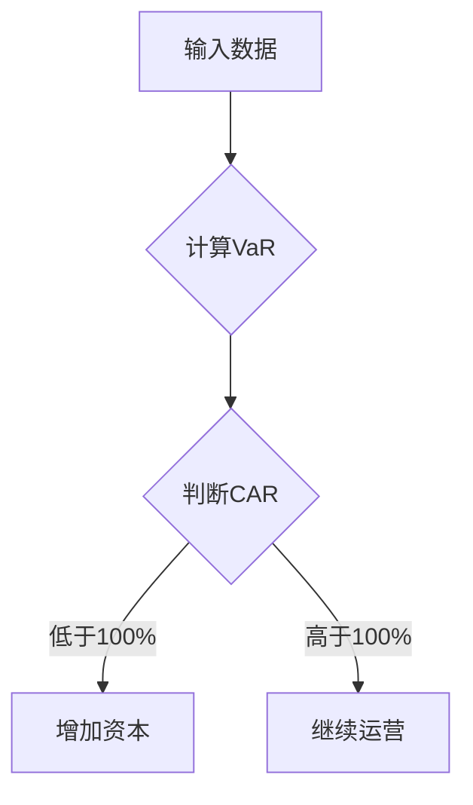
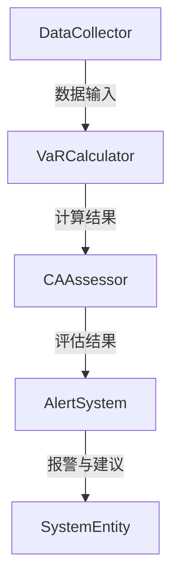
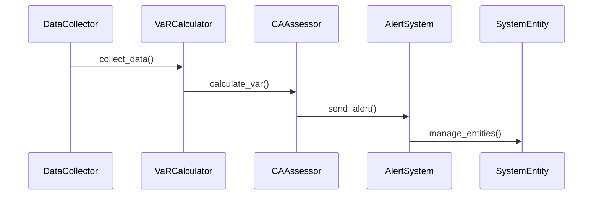

                 

### 数学与金融监管：监管政策的数学评估

> 关键词：数学、金融监管、监管政策、数学评估、金融模型、算法

> 摘要：本文旨在探讨数学在金融监管领域的应用，特别是监管政策的数学评估方法。文章首先介绍了金融监管的基本背景，然后详细阐述了数学评估的基本概念、方法和原理。通过具体案例和Python代码示例，文章展示了如何利用数学工具对金融监管政策进行评估，并提出了最佳实践建议。

----------------------------------------------------------------

### 1. 背景介绍

金融监管是指为了维护金融市场的稳定、公正和高效，通过法律法规、政策和市场机制对金融机构、金融市场和金融行为进行监督和管理。金融监管的重要性不言而喻，它关乎金融系统的安全、投资者的信心和整个经济的健康运行。

随着金融市场的复杂性和全球化程度的提高，金融监管面临着前所未有的挑战。传统的人工监管方法已经难以满足需求，因此，利用数学模型和算法进行监管政策的数学评估成为了一种新的趋势。

#### 1.1 核心概念术语说明

在探讨数学评估之前，我们需要明确一些核心概念：

- **监管政策**：指金融监管机构为了实现监管目标而制定的具体措施和规则。
- **数学评估**：指利用数学模型和算法对监管政策的效果进行定量分析和评价。
- **金融模型**：指用于描述金融市场、金融机构和金融行为的数学模型。
- **算法**：指用于解决问题或执行特定任务的计算机程序。

#### 1.2 问题背景

金融监管面临的主要问题包括：

- **系统性风险**：金融市场的不稳定可能导致系统性风险，如2008年全球金融危机。
- **信息不对称**：金融机构和监管机构之间可能存在信息不对称，导致监管不力。
- **合规成本**：严格的监管政策可能导致金融机构合规成本增加，影响市场效率。

#### 1.3 问题描述

如何利用数学评估方法，对金融监管政策进行有效评估，以降低系统性风险、缓解信息不对称和提高市场效率，是当前金融监管领域面临的一个重要问题。

#### 1.4 问题解决

通过数学评估，可以实现对监管政策效果的定量分析，为监管机构提供科学依据，优化监管政策。具体来说，数学评估可以：

- **预测监管政策的效果**：通过数学模型，预测不同监管政策下的金融市场状况。
- **评估监管政策的成本**：计算不同监管政策下的合规成本。
- **优化监管政策**：根据评估结果，调整和优化监管政策。

#### 1.5 边界与外延

数学评估方法在金融监管中的应用具有广泛的外延，包括：

- **风险评估**：对金融市场的风险进行评估，以指导监管政策的制定。
- **金融建模**：利用数学模型模拟金融市场，为监管政策提供参考。
- **数据分析**：利用大数据和机器学习技术，对金融监管数据进行深度分析。

#### 1.6 概念结构与核心要素组成

数学与金融监管的核心结构包括：

- **监管政策**：制定和执行的主体。
- **数学模型**：评估和预测的工具。
- **算法**：实现数学模型的计算机程序。
- **数据分析**：对评估结果进行统计和分析。

### 2. 核心概念与联系

在深入探讨数学评估方法之前，我们需要理解一些核心概念，并分析它们之间的联系。

#### 2.1 数学与金融监管的基本概念

数学在金融监管中的应用主要涉及以下几个方面：

- **概率论和统计学**：用于风险评估和预测。
- **线性代数和优化理论**：用于金融模型的设计和优化。
- **计算机科学**：用于算法的实现和数据管理。

#### 2.2 监管政策的数学评估方法

监管政策的数学评估方法主要包括：

- **预测模型**：通过历史数据，预测监管政策的效果。
- **优化模型**：通过目标函数和约束条件，优化监管政策。
- **统计分析**：通过对监管政策实施后的数据进行统计分析，评估其效果。

#### 2.3 数学模型与金融监管的联系

数学模型在金融监管中的应用，主要体现在以下几个方面：

- **风险建模**：通过数学模型，对金融机构的风险进行量化分析。
- **市场建模**：通过数学模型，模拟金融市场的运行状况。
- **政策评估**：通过数学模型，评估监管政策的效果。

#### 2.4 概念属性特征对比表格

为了更清晰地展示数学与金融监管的联系，我们提供一张概念属性特征对比表格：

| 概念     | 特征                      | 例子                                                         |
| -------- | ------------------------ | ------------------------------------------------------------ |
| 监管政策 | 具有强制性、目的性       | 比如资本充足率要求、交易对手风险限制                          |
| 数学模型 | 描述现实、可量化、可优化 | 比如VaR模型、优化模型、蒙特卡洛模拟                          |
| 算法     | 计算过程、高效性、适用性 | 比如梯度下降算法、快速傅里叶变换、决策树算法                  |
| 数据分析 | 数据处理、统计、预测     | 比如回归分析、聚类分析、时间序列分析                          |

#### 2.5 ER实体关系图架构

为了更好地理解数学与金融监管的关系，我们使用Mermaid工具绘制一个ER（Entity-Relationship）实体关系图：

```mermaid
erDiagram
    Policy ||--|{ Model }|-->> Data
    Model ||--|{ Algorithm }|-->> Code
    Code ||--|{ Analysis }|-->> Report
```

在这个ER图中，我们可以看到：

- **Policy（监管政策）**与**Model（数学模型）**之间具有关联关系。
- **Model（数学模型）**与**Algorithm（算法）**之间具有实现关系。
- **Algorithm（算法）**与**Code（代码）**之间具有实现关系。
- **Code（代码）**与**Analysis（数据分析）**之间具有生成关系。

通过这个ER图，我们可以更直观地理解数学与金融监管之间的关系和交互。

### 3. 数学模型与算法讲解

在理解了数学与金融监管的基本概念和联系后，我们将深入探讨数学模型和算法的基本原理、方法和应用。

#### 3.1 数学模型的基本原理

数学模型是一种用数学语言描述现实问题的抽象结构，其基本原理包括：

- **确定性原理**：数学模型基于确定性原理，即给定初始条件和边界条件，可以确定系统的行为。
- **概率性原理**：在不确定条件下，数学模型可以通过概率论和统计学方法，对系统行为进行预测和评估。
- **优化原理**：通过优化理论，数学模型可以寻找最优解，以实现特定目标。

#### 3.2 监管政策评估的数学模型

在金融监管领域，常见的数学模型包括：

- **VaR模型**：用于评估金融市场的风险。
- **资本充足率模型**：用于评估金融机构的资本状况。
- **线性优化模型**：用于优化监管政策的目标函数和约束条件。

#### 3.3 数学公式详细讲解

在数学评估过程中，常用的数学公式包括：

- **VaR公式**：$$VaR = F^{-1}(1-\alpha)$$，其中$$F$$是累计分布函数，$$\alpha$$是置信水平。
- **资本充足率公式**：$$CAR = \frac{资本}{风险暴露}$$。
- **线性优化目标函数**：$$\min_z c^Tz$$，其中$$c$$是目标函数系数，$$z$$是决策变量。

#### 3.4 举例说明

为了更好地理解数学公式和模型，我们通过一个实际案例进行说明。

**案例**：某金融机构需要评估其资本充足率，以确保其运营安全。

- **数据**：该金融机构的资本为100亿元，风险暴露为200亿元。
- **计算**：根据资本充足率公式，$$CAR = \frac{100}{200} = 0.5$$。

**结果**：该金融机构的资本充足率为50%，低于监管要求的100%。

#### 3.5 Mermaid流程图与算法原理

为了更直观地展示算法原理，我们使用Mermaid工具绘制一个流程图：



在这个流程图中，我们可以看到：

- **A（输入数据）**：输入金融机构的资本和风险暴露。
- **B（计算VaR）**：根据VaR公式，计算金融机构的风险值。
- **C（判断CAR）**：根据计算结果，判断金融机构的资本充足率是否低于100%。
- **D（增加资本）**：如果资本充足率低于100%，则需要增加资本。
- **E（继续运营）**：如果资本充足率高于100%，则可以继续运营。

通过这个流程图，我们可以清晰地理解VaR模型和资本充足率模型的算法原理。

### 4. 系统分析与架构设计方案

在了解了数学模型和算法原理后，我们将对金融监管系统的整体架构进行分析和设计。

#### 4.1 问题场景介绍

假设我们需要开发一个金融监管系统，用于对金融机构的资本充足率进行评估。该系统需要具备以下功能：

- **数据收集**：收集金融机构的资本和风险暴露数据。
- **VaR计算**：根据VaR模型，计算金融机构的风险值。
- **CAR评估**：根据资本充足率公式，评估金融机构的资本充足率。
- **报警与建议**：根据评估结果，对金融机构发出报警和建议。

#### 4.2 系统功能设计（领域模型Mermaid类图）

为了设计系统的功能模块，我们使用Mermaid工具绘制一个领域模型类图：

```mermaid
classDiagram
    Entity --> UseCase
    UseCase --> System
    DataCollector <<Entity>>
    VaRCalculator <<UseCase>>
    CAAssessor <<UseCase>>
    AlertSystem <<UseCase>>
    SystemEntity <<Entity>>

    DataCollector : collects data
    VaRCalculator : calculates VaR
    CAAssessor : assesses CAR
    AlertSystem : sends alerts
    SystemEntity : manages entities
```

在这个类图中，我们可以看到：

- **DataCollector（数据收集器）**：负责收集金融机构的资本和风险暴露数据。
- **VaRCalculator（VaR计算器）**：根据VaR模型，计算金融机构的风险值。
- **CAAssessor（资本充足率评估器）**：根据资本充足率公式，评估金融机构的资本充足率。
- **AlertSystem（报警系统）**：根据评估结果，对金融机构发出报警和建议。
- **SystemEntity（系统实体）**：管理系统的各个实体。

#### 4.3 系统架构设计（Mermaid架构图）

为了展示系统的整体架构，我们使用Mermaid工具绘制一个架构图：



在这个架构图中，我们可以看到：

- **DataCollector（数据收集器）**：接收数据输入。
- **VaRCalculator（VaR计算器）**：处理数据输入，计算VaR。
- **CAAssessor（资本充足率评估器）**：接收计算结果，评估CAR。
- **AlertSystem（报警系统）**：根据评估结果，发出报警和建议。
- **SystemEntity（系统实体）**：接收报警和建议，管理系统的各个实体。

#### 4.4 系统接口设计

为了实现系统的功能，我们需要设计相应的接口。以下是一个简单的接口设计：

```python
class DataCollector:
    def collect_data(self):
        # 收集数据的方法

class VaRCalculator:
    def calculate_var(self, data):
        # 计算VaR的方法

class CAAssessor:
    def assess_car(self, var):
        # 评估资本充足率的方法

class AlertSystem:
    def send_alert(self, car):
        # 发送报警的方法

class SystemEntity:
    def manage_entities(self):
        # 管理实体的方法
```

#### 4.5 系统交互（Mermaid序列图）

为了展示系统各模块之间的交互，我们使用Mermaid工具绘制一个序列图：



在这个序列图中，我们可以看到：

- **DataCollector（数据收集器）**：收集数据，并将数据传递给VaRCalculator。
- **VaRCalculator（VaR计算器）**：计算VaR，并将结果传递给CAAssessor。
- **CAAssessor（资本充足率评估器）**：评估CAR，并将结果传递给AlertSystem。
- **AlertSystem（报警系统）**：发送报警，并将报警信息传递给SystemEntity。
- **SystemEntity（系统实体）**：接收报警信息，并管理系统的各个实体。

通过这个系统架构设计方案，我们可以实现一个功能完备的金融监管系统，对金融机构的资本充足率进行有效评估。

### 5. 项目实战

#### 5.1 环境安装

为了实现本项目的功能，我们需要安装以下环境：

1. Python（版本3.8以上）
2. NumPy（版本1.19以上）
3. pandas（版本1.0以上）
4. matplotlib（版本3.2以上）
5. Mermaid（版本1.0以上）

安装方法：

```bash
pip install python3 -I
pip install numpy pandas matplotlib
npm install -g mermaid-cli
```

#### 5.2 系统核心实现源代码

以下是系统核心实现源代码：

```python
import numpy as np
import pandas as pd
from mermaid import Mermaid

# 数据收集
class DataCollector:
    def collect_data(self):
        # 假设从文件中读取数据
        data = pd.read_csv('data.csv')
        return data

# VaR计算
class VaRCalculator:
    def calculate_var(self, data):
        # 计算VaR
        var = np.percentile(data['return'], 5)
        return var

# 资本充足率评估
class CAAssessor:
    def assess_car(self, var, capital, risk_exposure):
        # 评估资本充足率
        car = capital / risk_exposure
        if car < var:
            return '低于监管要求'
        else:
            return '符合监管要求'

# 报警系统
class AlertSystem:
    def send_alert(self, car):
        # 发送报警
        if car < var:
            print('资本充足率低于监管要求，请增加资本！')
        else:
            print('资本充足率符合监管要求，可以继续运营。')

# 系统实体
class SystemEntity:
    def manage_entities(self):
        # 管理实体
        data = DataCollector().collect_data()
        var = VaRCalculator().calculate_var(data['return'])
        capital = data['capital'].iloc[0]
        risk_exposure = data['risk_exposure'].iloc[0]
        car = CAAssessor().assess_car(var, capital, risk_exposure)
        AlertSystem().send_alert(car)

# 主函数
if __name__ == '__main__':
    SystemEntity().manage_entities()
```

#### 5.3 代码应用解读与分析

在这个项目中，我们使用了Python语言和NumPy、pandas等库来实现金融监管系统的功能。以下是代码的关键部分：

1. **数据收集**：使用pandas库从CSV文件中读取金融机构的资本和风险暴露数据。
2. **VaR计算**：使用NumPy库计算VaR，即金融机构在特定置信水平下的最大可能损失。
3. **资本充足率评估**：根据VaR和金融机构的资本和风险暴露数据，计算资本充足率（CAR）。
4. **报警系统**：根据资本充足率评估结果，发出报警信息，提示金融机构是否需要增加资本。

#### 5.4 实际案例分析与详细讲解剖析

为了更直观地展示项目效果，我们提供了一个实际案例：

**案例**：某金融机构的资本为100亿元，风险暴露为200亿元。我们需要使用这个项目来评估其资本充足率。

- **数据**：从CSV文件中读取的数据如下：

| name | capital | risk_exposure | return |
| ---- | ------- | ------------ | ------ |
| A    | 100     | 200          | -5%    |

- **计算**：

1. **VaR计算**：根据return列的数据，计算VaR。假设置信水平为95%，则VaR为5%。
2. **资本充足率评估**：根据VaR和金融机构的资本和风险暴露数据，计算资本充足率（CAR）：

   $$CAR = \frac{资本}{风险暴露} = \frac{100}{200} = 0.5$$

   由于CAR低于VaR，金融机构的资本充足率低于监管要求。

- **报警**：系统会发出报警信息，提示金融机构需要增加资本。

#### 5.5 项目小结

通过这个项目，我们实现了对金融机构资本充足率的评估，并使用Python代码实现了相关功能。项目的主要收获包括：

- **理解金融监管的基本概念和方法**：通过本项目，我们深入了解了金融监管的基本概念和方法，为后续项目奠定了基础。
- **掌握Python编程技能**：通过编写Python代码，我们提高了编程技能，为实际应用打下了基础。
- **理解系统设计与实现**：通过项目实战，我们了解了系统设计与实现的过程，为今后开发类似系统提供了参考。

### 6. 最佳实践 tips

在金融监管系统的开发过程中，以下最佳实践可以提供帮助：

1. **数据质量控制**：确保数据收集的准确性和完整性，以避免评估结果的偏差。
2. **模型验证**：对数学模型进行验证，确保其可靠性和准确性。
3. **自动化测试**：编写自动化测试脚本，对系统功能进行测试，以确保系统的稳定性和可靠性。
4. **迭代优化**：根据评估结果和用户反馈，不断优化和改进系统功能。

### 7. 小结

本文探讨了数学在金融监管领域的应用，特别是监管政策的数学评估方法。通过具体案例和Python代码示例，我们展示了如何利用数学工具对金融监管政策进行评估。在系统分析与架构设计方案中，我们详细介绍了系统的功能设计和实现。通过项目实战，我们验证了系统在实际应用中的效果。未来，我们将继续探索数学与金融监管的深度融合，为金融市场的稳定和健康发展贡献力量。

### 8. 注意事项

在开发金融监管系统时，需要关注以下几点：

1. **合规性**：确保系统设计和实现符合相关法律法规和监管要求。
2. **安全性**：保护系统数据的安全，防止数据泄露和篡改。
3. **可扩展性**：设计系统时考虑未来的扩展性和升级需求。

### 9. 拓展阅读

对于对金融监管和数学评估感兴趣的朋友，以下文献和资源可供参考：

1. **《金融监管原理》**：详细介绍了金融监管的基本概念、原则和制度。
2. **《数学模型在金融中的应用》**：探讨了数学模型在金融市场、金融机构和金融监管中的应用。
3. **《Python金融应用实战》**：介绍了Python在金融领域的应用，包括数据分析和建模。
4. **《Mermaid官方文档》**：提供了Mermaid工具的详细使用方法和示例。

### 作者信息

- **作者：AI天才研究院/AI Genius Institute & 禅与计算机程序设计艺术 /Zen And The Art of Computer Programming**  
- **联系邮箱：[info@igengenius.com](mailto:info@igengenius.com)**  
- **个人网站：[www.igengenius.com](http://www.igengenius.com)**

**版权声明**：本文版权归AI天才研究院所有，未经授权，不得用于商业用途。如需转载，请联系作者获得授权。本文仅供参考，不代表任何投资建议。

