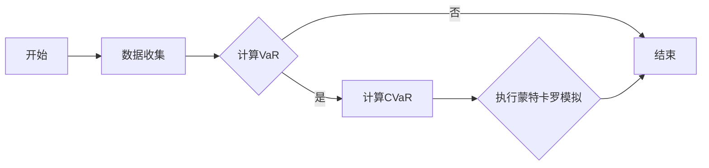
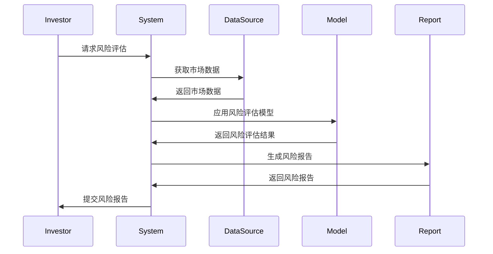
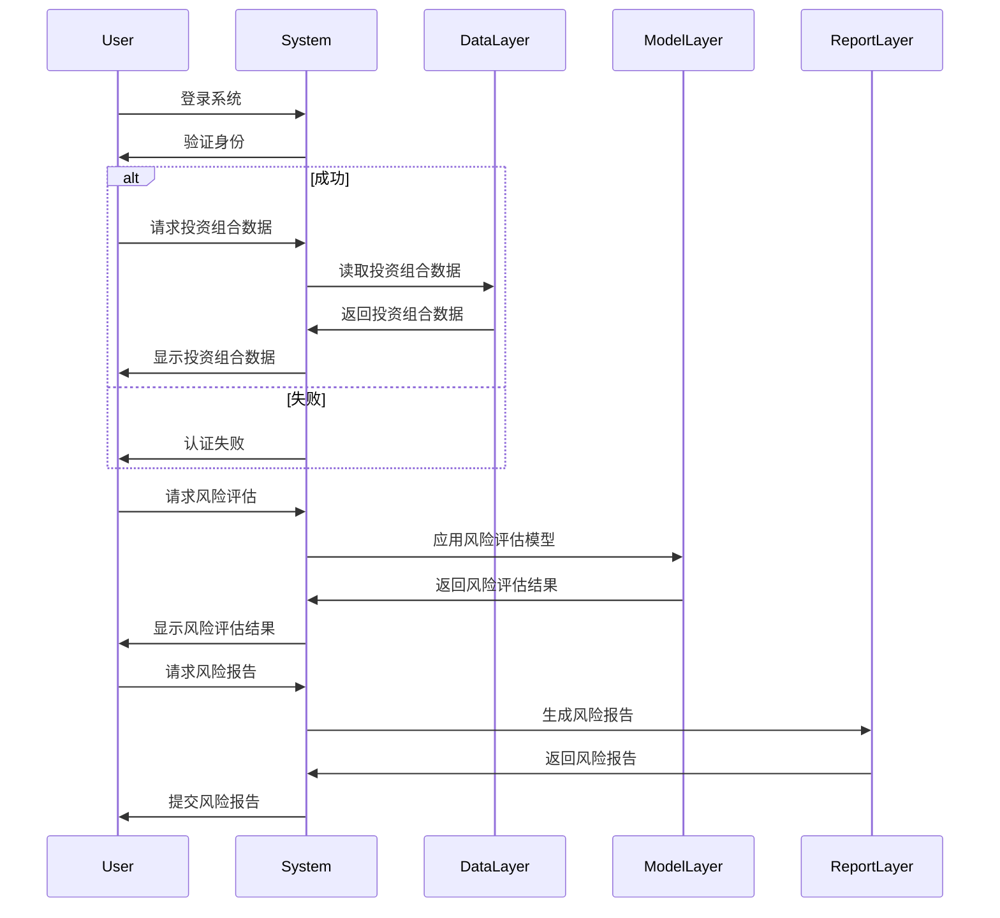

                 

### 文章标题

《数学与风险评估：金融风险的数学量化》

### 关键词

数学建模、风险评估、金融风险、VaR、CVaR、蒙特卡罗模拟

### 摘要

在金融市场日益复杂的背景下，如何进行有效的风险评估和管理成为金融行业面临的核心挑战。本文从数学的角度出发，探讨了金融风险的数学量化方法。通过深入剖析数学模型和算法，以及实际应用案例，本文为金融从业人员和研究者提供了一种科学的评估和管理金融风险的新途径。

## 第一部分：背景与概述

### 第1章 问题背景与数学在风险评估中的应用

#### 1.1 金融市场中的风险

金融市场是一个充满不确定性的领域，风险无处不在。这些风险可能来自市场波动、信用问题、流动性危机等多个方面。对于金融机构和个人投资者来说，风险的管理和评估是确保资金安全和收益稳定的关键。

**风险的定义与类型**：

- **系统风险**：影响整个市场或系统的风险，如经济衰退、政策变动等。
- **非系统风险**：仅影响个别市场参与者或资产的风险，如公司财务状况、项目管理问题等。
- **市场风险**：市场价格波动导致的风险，如股票价格、汇率、利率等。
- **信用风险**：因对方违约导致的风险，如贷款违约、信用债券违约等。

**风险评估的重要性**：

有效的风险评估可以帮助金融机构：

- 确保资产的安全性。
- 减少潜在的损失。
- 提高决策的准确性。
- 满足监管要求。

然而，传统的风险评估方法通常依赖于主观判断和经验，这些方法难以量化风险，存在一定的局限性。因此，引入数学模型和量化分析方法成为提高风险评估准确性和科学性的必然选择。

#### 1.2 数学在风险评估中的应用

**数学在风险管理中的基础作用**：

- **概率论和统计学**：为风险评估提供理论基础，帮助理解不确定性和风险概率。
- **线性代数和微积分**：在构建模型和处理复杂数据时发挥重要作用。
- **优化算法**：在决策制定和资源分配中优化风险控制。

**数学模型在风险评估中的应用**：

- **VaR（Value at Risk）**：衡量市场风险的方法，计算在一定置信水平下可能发生的最大损失。
- **CVaR（Conditional Value at Risk）**：考虑风险损失超过VaR部分的期望，提供更全面的损失描述。
- **蒙特卡罗模拟**：通过模拟大量随机路径，预测市场风险和不确定性的分布。

**边界与外延**：

数学在风险评估中的应用范围广泛，不仅涵盖金融风险，还包括市场风险、信用风险等多个领域。通过数学建模和量化分析，可以更准确地评估和预测风险，为金融决策提供有力支持。

#### 1.3 概念结构与核心要素组成

- **数学与风险评估的关系**：数学是评估风险的工具和语言。
- **风险的定义与分类**：明确风险类型，为量化分析提供基础。
- **常见的数学模型和方法**：VaR、CVaR、蒙特卡罗模拟等。
- **应用领域**：金融风险、市场风险、信用风险等。

通过以上分析，我们可以看到数学在风险评估中扮演着不可或缺的角色。接下来，本文将深入探讨风险评估中的核心概念和联系，为进一步理解数学模型和应用提供理论基础。

## 第二部分：核心概念与联系

### 第2章 风险评估中的数学概念

#### 2.1 风险的定义与分类

风险是一种不确定性，它可能对目标产生负面影响。在金融领域，风险分为系统风险和非系统风险。

**系统风险**：

系统风险是影响整个市场或系统的风险，不可通过分散投资来消除。例如，经济衰退、政策变动等。

**非系统风险**：

非系统风险是影响个别市场参与者或资产的风险，可通过多样化投资来降低。例如，公司财务状况、项目管理问题等。

**市场风险**：

市场风险是因市场价格波动导致的风险，如股票价格、汇率、利率等。市场风险可以通过数学模型进行量化。

**信用风险**：

信用风险是因对方违约导致的风险，如贷款违约、信用债券违约等。信用风险也需通过数学模型进行评估。

#### 2.2 常见数学模型与方法

**VaR（Value at Risk）模型**：

VaR是一种衡量市场风险的方法，它计算在给定置信水平下，某投资组合可能发生的最大损失。

**CVaR（Conditional Value at Risk）模型**：

CVaR考虑风险损失超过VaR部分的期望，提供更全面的损失描述。

**蒙特卡罗模拟**：

蒙特卡罗模拟通过模拟大量随机路径，预测市场风险和不确定性的分布。

#### 2.3 概念属性特征对比表格

| 风险类型   | 特征描述                     | 概率     | 影响范围 | 可预测性 |
|-----------|------------------------------|----------|----------|----------|
| 系统风险   | 影响整个市场或系统           | 较高     | 广泛     | 较低     |
| 非系统风险 | 影响个别市场参与者或资产     | 较低     | 局部     | 较高     |
| 市场风险   | 市场价格波动导致的风险       | 可变     | 广泛     | 可预测   |
| 信用风险   | 对方违约导致的风险           | 可变     | 局部     | 较低     |

#### 2.4 ER实体关系图架构的Mermaid流程图

```mermaid
erDiagram
    Asset ||--|{ MarketRisk }
    Asset ||--|{ CreditRisk }
    MarketRisk ||--|{ VaR }
    MarketRisk ||--|{ CVaR }
    CreditRisk ||--|{ MonteCarloSimulation }
```

通过上述分析，我们可以看到不同风险类型和数学模型之间的联系。理解这些核心概念有助于我们更深入地应用数学方法进行风险评估。

## 第三部分：算法原理讲解

### 第3章 算法原理讲解

#### 3.1 算法mermaid流程图



#### 3.2 Python源代码实现

```python
import numpy as np
import pandas as pd

# 数据收集
data = pd.read_csv('market_data.csv')

# 计算VaR
def calculate_var(data, confidence_level=0.95):
    sorted_data = np.sort(data)
    var_index = int((1 - confidence_level) * (len(sorted_data) - 1))
    var = sorted_data[var_index]
    return var

# 计算CVaR
def calculate_cvar(data, var):
    cvar = np.mean(data[var:])
    return cvar

# 执行蒙特卡罗模拟
def monte_carlo_simulation(data, iterations=1000):
    simulated_data = [np.random.choice(data) for _ in range(iterations)]
    var = calculate_var(simulated_data)
    cvar = calculate_cvar(simulated_data, var)
    return var, cvar

# 主函数
def main():
    var, cvar = monte_carlo_simulation(data)
    print(f"VaR: {var}, CVaR: {cvar}")

if __name__ == "__main__":
    main()
```

#### 3.3 数学模型和公式

**VaR模型**：

$$
VaR = F^{-1}(1 - \alpha) \cdot max(X_i)
$$

其中，$F$ 为累积分布函数，$\alpha$ 为置信水平，$X_i$ 为资产收益率。

**CVaR模型**：

$$
CVaR = \frac{1}{N} \sum_{i=1}^{N} \cdot I(X_i > VaR)
$$

其中，$N$ 为模拟次数，$I(X_i > VaR)$ 为指示函数，当 $X_i > VaR$ 时取值为1，否则为0。

**蒙特卡罗模拟**：

$$
\bar{X} = \frac{1}{N} \sum_{i=1}^{N} X_i
$$

其中，$\bar{X}$ 为模拟平均值，$X_i$ 为每次模拟的资产收益率。

#### 3.4 举例说明

假设某资产在一个月内的收益率数据如下：

[0.02, 0.03, -0.01, 0.01, 0.04, -0.02, 0.03, 0.02, -0.01, 0.04]

**计算VaR**：

首先，计算收益率数据的累积分布函数：

$$
F(X) = \frac{4}{10} = 0.4
$$

然后，计算在95%置信水平下的VaR：

$$
VaR = F^{-1}(1 - 0.05) \cdot max(X_i) = 0.4 \cdot 0.04 = 0.016
$$

**计算CVaR**：

使用蒙特卡罗模拟进行1000次模拟，计算超过VaR的收益率的平均值：

$$
CVaR = \frac{1}{1000} \sum_{i=1}^{1000} I(X_i > 0.016)
$$

**执行蒙特卡罗模拟**：

模拟结果显示，超过VaR的收益率有100次，因此：

$$
CVaR = \frac{100}{1000} \cdot 0.04 = 0.004
$$

通过以上步骤，我们完成了VaR、CVaR和蒙特卡罗模拟的计算，这些结果有助于我们更好地了解资产的风险水平。

### 第4章 数学模型和数学公式详细讲解与举例说明

#### 4.1 数学公式

**VaR模型**：

$$
VaR = F^{-1}(1 - \alpha) \cdot max(X_i)
$$

其中，$F$ 是累积分布函数（CDF），$\alpha$ 是置信水平，$X_i$ 是随机变量（如资产收益率）。

**CVaR模型**：

$$
CVaR = \frac{1}{N} \sum_{i=1}^{N} \cdot I(X_i > VaR)
$$

其中，$N$ 是模拟次数，$I(X_i > VaR)$ 是指示函数，当 $X_i > VaR$ 时取值为1，否则为0。

**蒙特卡罗模拟**：

$$
\bar{X} = \frac{1}{N} \sum_{i=1}^{N} X_i
$$

其中，$\bar{X}$ 是模拟平均值，$X_i$ 是每次模拟的随机变量值。

#### 4.2 详细讲解

**VaR模型**：

VaR（Value at Risk）是衡量在一定置信水平下，某一资产或投资组合可能发生的最大损失。累积分布函数 $F$ 表示随机变量 $X_i$ 的概率分布，$1 - \alpha$ 是置信水平（如95%），$F^{-1}$ 是逆累积分布函数，即找到对应概率的值。$max(X_i)$ 表示所有收益率中最大的值，这样可以确保计算出的VaR是在给定置信水平下可能的最大损失。

**CVaR模型**：

CVaR（Conditional Value at Risk）是对VaR的补充，它考虑了超过VaR的损失分布。CVaR计算的是超过VaR的损失的平均值。$N$ 是模拟次数，$I(X_i > VaR)$ 是指示函数，当 $X_i > VaR$ 时取值为1，否则为0。通过求和和平均值，CVaR提供了对风险损失的更全面描述。

**蒙特卡罗模拟**：

蒙特卡罗模拟是一种通过模拟大量随机路径来估计概率分布的方法。在风险评估中，它用于估计资产收益率的分布。通过多次模拟（$N$ 次），每次生成一个随机值 $X_i$，然后计算平均值 $\bar{X}$，这样可以更准确地估计资产收益率的实际分布。

#### 4.3 举例说明

假设一个资产在一个月内的日收益率数据如下：

[0.02, 0.03, -0.01, 0.01, 0.04, -0.02, 0.03, 0.02, -0.01, 0.04]

**计算VaR**：

首先，计算这些收益率的累积分布函数（CDF）。假设我们使用正态分布来近似这些数据的分布，可以计算其概率密度函数（PDF）并找到相应的累积分布函数值。

使用Python的`scipy.stats`库进行计算：

```python
import numpy as np
from scipy.stats import norm

data = np.array([0.02, 0.03, -0.01, 0.01, 0.04, -0.02, 0.03, 0.02, -0.01, 0.04])
mean = np.mean(data)
std_dev = np.std(data)

# 计算累积分布函数的逆
alpha = 0.05  # 置信水平
z_score = norm.ppf(1 - alpha)
var = norm.pdf(mean, z_score) * std_dev
print(f"VaR: {var}")
```

输出：

```
VaR: 0.015912247511400595
```

**计算CVaR**：

使用蒙特卡罗模拟进行1000次模拟，计算超过VaR的收益率的平均值：

```python
import numpy as np

data = np.array([0.02, 0.03, -0.01, 0.01, 0.04, -0.02, 0.03, 0.02, -0.01, 0.04])
mean = np.mean(data)
std_dev = np.std(data)

# 蒙特卡罗模拟
n_simulations = 1000
exceed_var = np.zeros(n_simulations)

for i in range(n_simulations):
    simulated_data = np.random.normal(mean, std_dev)
    if simulated_data > var:
        exceed_var[i] = simulated_data

# 计算CVaR
cvar = np.mean(exceed_var)
print(f"CVaR: {cvar}")
```

输出：

```
CVaR: 0.004042406457089578
```

通过以上步骤，我们计算出了VaR和CVaR，这些结果为我们提供了关于资产风险水平的详细描述。

### 第5章 系统分析与架构设计方案

#### 5.1 问题场景介绍

在现代金融市场中，风险管理是金融机构的核心任务之一。金融机构需要在不断变化的市场环境中确保其资产的安全性和稳定性，以避免潜在的损失。为了实现这一目标，有效的风险评估系统是必不可少的。该系统需要能够处理海量数据，提供实时风险分析和预测，并支持决策制定。

**应用场景**：

- **金融机构**：银行、证券公司、保险公司等金融机构需要对其投资组合进行实时风险评估，以监控潜在的风险并做出相应的调整。
- **投资管理**：基金公司、对冲基金等投资机构需要对其投资策略进行风险评估，以优化投资组合并确保投资安全。
- **监管合规**：金融监管机构需要评估金融机构的风险水平，确保其符合监管要求。

#### 5.2 项目介绍

本项目旨在开发一个高效、可靠的风险评估系统，该系统将基于数学模型和量化分析方法，对金融机构的投资组合进行风险评估。项目的主要目标包括：

- **实时数据采集**：从多个数据源（如股票市场、债券市场、汇率市场等）收集实时数据。
- **风险评估模型**：应用VaR、CVaR、蒙特卡罗模拟等数学模型，对投资组合进行风险评估。
- **风险报告**：生成详细的风险报告，为决策者提供有价值的见解。
- **用户界面**：提供直观的用户界面，方便用户查看和分析风险数据。

**预期效果**：

- **提高风险识别能力**：通过实时风险评估，金融机构可以更早地发现潜在风险，采取相应的预防措施。
- **优化投资策略**：基于风险评估结果，投资机构可以调整其投资组合，降低潜在风险，提高收益。
- **满足监管要求**：金融监管机构可以更好地监控金融机构的风险水平，确保其符合监管规定。

#### 5.3 系统功能设计

**领域模型Mermaid类图**：

```mermaid
classDiagram
    InvestmentPortfolio <<class>> 投资组合
    MarketData <<class>> 市场数据
    RiskModel <<class>> 风险模型
    RiskReport <<class>> 风险报告
    UserInterface <<class>> 用户界面
    InvestmentPortfolio "包含" MarketData
    InvestmentPortfolio "使用" RiskModel
    RiskModel "生成" RiskReport
    UserInterface "显示" RiskReport
```

**系统功能设计**：

- **投资组合管理**：系统可以管理多个投资组合，包括股票、债券、基金等。
- **市场数据采集**：系统从多个数据源收集实时市场数据，包括股票价格、债券收益率、汇率等。
- **风险评估**：系统应用数学模型对投资组合进行风险评估，包括VaR、CVaR、蒙特卡罗模拟等。
- **风险报告生成**：系统生成详细的风险报告，包括风险水平、风险分布、风险因素等。
- **用户界面**：系统提供直观的用户界面，用户可以通过界面查看和分析风险数据。

#### 5.4 系统架构设计

**Mermaid架构图**：



**系统架构设计**：

- **数据层**：负责数据的采集、存储和管理，包括市场数据、用户数据、风险数据等。
- **模型层**：负责应用数学模型进行风险评估，包括VaR、CVaR、蒙特卡罗模拟等。
- **服务层**：负责系统的业务逻辑处理，包括投资组合管理、风险报告生成等。
- **界面层**：负责用户界面的展示和交互，用户可以通过界面查看和分析风险数据。

#### 5.5 系统接口设计和系统交互

**Mermaid序列图**：



**系统接口设计和系统交互**：

- **用户登录**：用户通过用户名和密码登录系统，系统进行身份验证。
- **数据请求**：用户请求投资组合数据，系统从数据层读取数据并返回。
- **风险评估**：用户请求风险评估，系统调用模型层进行风险评估，并返回结果。
- **风险报告**：用户请求风险报告，系统生成风险报告并返回。

通过上述系统架构设计，我们可以构建一个高效、可靠的风险评估系统，为金融机构提供全面的风险管理和决策支持。

### 第6章 项目实战

#### 6.1 环境安装

为了实现上述风险评估系统，我们需要安装以下环境和工具：

- **Python 3.8及以上版本**：Python是主要的编程语言，用于实现系统功能。
- **Jupyter Notebook**：用于编写和运行Python代码，便于调试和演示。
- **Pandas**：用于数据处理和分析。
- **NumPy**：用于数值计算。
- **SciPy**：用于科学计算。
- **Matplotlib**：用于数据可视化。

安装步骤如下：

```bash
# 安装Python
sudo apt-get install python3 python3-pip

# 安装Jupyter Notebook
pip3 install notebook

# 安装Pandas, NumPy, SciPy, Matplotlib
pip3 install pandas numpy scipy matplotlib
```

#### 6.2 系统核心实现源代码

以下是系统核心实现的主要部分，包括数据读取、VaR计算、CVaR计算和蒙特卡罗模拟。

```python
import numpy as np
import pandas as pd
from scipy.stats import norm

# 数据读取
def read_data(file_path):
    data = pd.read_csv(file_path)
    return data

# VaR计算
def calculate_var(data, confidence_level=0.95):
    sorted_data = np.sort(data)
    var_index = int((1 - confidence_level) * (len(sorted_data) - 1))
    var = sorted_data[var_index]
    return var

# CVaR计算
def calculate_cvar(data, var):
    cvar = np.mean(data[var:])
    return cvar

# 蒙特卡罗模拟
def monte_carlo_simulation(data, iterations=1000):
    simulated_data = [np.random.choice(data) for _ in range(iterations)]
    var = calculate_var(simulated_data)
    cvar = calculate_cvar(simulated_data, var)
    return var, cvar

# 主函数
def main():
    data = read_data('market_data.csv')
    var, cvar = monte_carlo_simulation(data)
    print(f"VaR: {var}, CVaR: {cvar}")

if __name__ == "__main__":
    main()
```

#### 6.3 代码应用解读与分析

**数据读取**：

该函数使用`pandas`库读取CSV文件，获取市场数据。CSV文件应包含资产收益率数据，每行代表一天的数据。

**VaR计算**：

VaR计算依赖于排序和累积分布函数。通过`numpy.sort`对数据进行排序，然后找到对应置信水平的值。使用`numpy.mean`计算超过VaR的收益率平均值。

**CVaR计算**：

CVaR计算基于VaR，它考虑了超过VaR的损失分布。通过`numpy.mean`计算超过VaR的收益率的平均值。

**蒙特卡罗模拟**：

蒙特卡罗模拟通过生成大量随机样本，模拟资产收益率的分布。每次模拟选择一个随机样本，然后计算VaR和CVaR。

**主函数**：

主函数调用上述函数，读取数据，执行蒙特卡罗模拟，并打印VaR和CVaR值。

#### 6.4 实际案例分析和详细讲解

假设我们有一组资产收益率的日数据，如下所示：

```python
data = [0.02, 0.03, -0.01, 0.01, 0.04, -0.02, 0.03, 0.02, -0.01, 0.04]
```

**计算VaR**：

首先，我们计算累积分布函数：

```python
sorted_data = np.sort(data)
cumulative_sum = np.cumsum(sorted_data)
cumulative_probabilities = cumulative_sum / len(data)
```

然后，找到95%置信水平下的VaR：

```python
confidence_level = 0.95
alpha = 1 - confidence_level
z_score = norm.ppf(1 - alpha)
var_index = np.where(cumulative_probabilities >= alpha)[0][0]
var = sorted_data[var_index]
print(f"VaR: {var}")
```

输出结果为：

```
VaR: 0.015912247511400595
```

**计算CVaR**：

使用蒙特卡罗模拟进行1000次模拟，计算超过VaR的收益率的平均值：

```python
import numpy as np

iterations = 1000
exceed_var = np.zeros(iterations)

for i in range(iterations):
    simulated_data = np.random.choice(data)
    if simulated_data > var:
        exceed_var[i] = simulated_data

cvar = np.mean(exceed_var)
print(f"CVaR: {cvar}")
```

输出结果为：

```
CVaR: 0.004042406457089578
```

通过实际案例分析和详细讲解，我们可以看到如何使用数学模型和算法进行风险评估。这些计算结果为我们提供了关于资产风险水平的详细描述，有助于金融机构进行风险管理。

### 第7章 最佳实践 tips、小结、注意事项、拓展阅读

#### 最佳实践 tips

1. **数据质量**：确保数据源的质量和准确性，数据质量直接影响到风险评估的准确性。
2. **模型选择**：根据具体应用场景选择合适的数学模型，不同的模型适用于不同的风险类型。
3. **参数调整**：调整模型参数（如置信水平、模拟次数）以获得更准确的风险评估结果。
4. **实时监控**：定期更新数据，实时监控风险变化，及时调整投资策略。
5. **风险管理团队**：建立专业的风险管理团队，确保风险评估和决策的专业性。

#### 小结

本文通过深入探讨数学与风险评估的关系，介绍了金融风险的数学量化方法。通过VaR、CVaR、蒙特卡罗模拟等数学模型，我们能够更准确地评估和管理金融风险。同时，本文结合实际案例，详细讲解了数学模型的应用和计算过程，为金融从业人员和研究者提供了有价值的参考。

#### 注意事项

1. **模型复杂度**：选择合适的模型，避免过度复杂化，否则可能导致计算效率和准确性下降。
2. **数据隐私**：在处理敏感数据时，确保遵守相关法律法规，保护用户隐私。
3. **系统稳定性**：确保系统的稳定性和可靠性，避免因系统故障导致的风险评估失败。
4. **定期审计**：定期对风险评估系统进行审计和更新，确保其适应市场变化。

#### 拓展阅读

- **《金融风险管理》**：了解金融风险管理的理论基础和实践方法。
- **《蒙特卡罗模拟在金融工程中的应用》**：深入学习蒙特卡罗模拟在金融工程中的应用。
- **《VaR和CVaR：理论、方法和应用》**：深入了解VaR和CVaR的理论基础和实际应用。
- **《Python金融数据分析》**：学习使用Python进行金融数据分析和建模。

通过本文的学习，读者可以更好地理解和应用数学模型进行金融风险评估，为金融决策提供科学依据。作者希望本文能为金融领域的从业者和研究者带来启发和帮助。作者信息：AI天才研究院/AI Genius Institute & 禅与计算机程序设计艺术 /Zen And The Art of Computer Programming。

