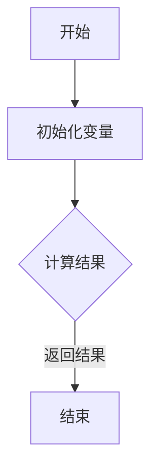
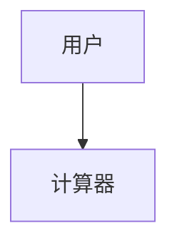
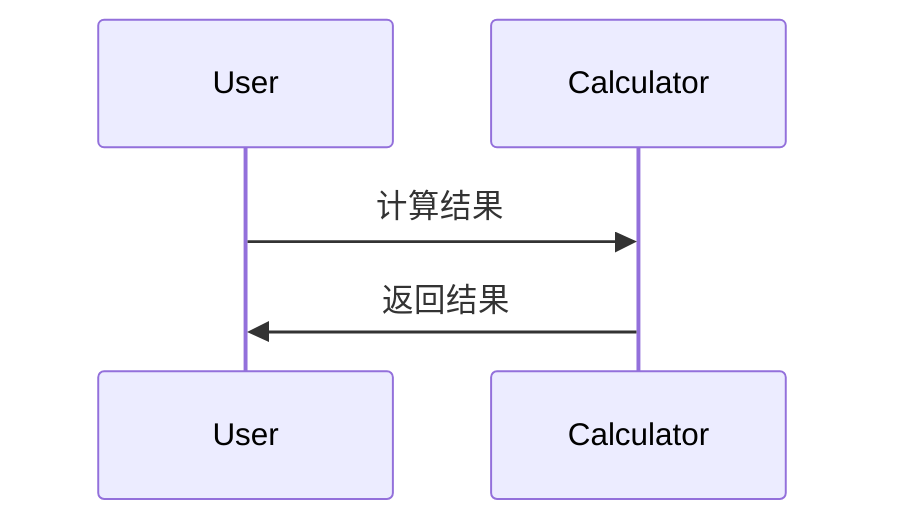

                 


# 数学发现还是发明？探讨数学的本质

关键词：数学、发现、发明、本质、逻辑推理

摘要：本文旨在探讨数学的发现与发明问题，分析数学的本质。通过逻辑推理的方式，本文将阐述数学概念的形成、数学模型的构建以及数学公式的推导过程，旨在为读者提供一个全面而深刻的理解。

## 引言

数学，作为一门研究数量、结构、变化和空间等概念的学科，一直被认为是客观存在的规律和法则的集合。然而，对于数学的本质，是发现还是发明，长期以来存在着不同的观点和争议。本文将围绕这一问题展开讨论，通过逻辑推理的方式，逐步揭示数学的本质。

## 背景介绍

### 核心概念术语说明

在探讨数学的发现与发明之前，我们首先需要明确一些核心概念术语。

- **发现**：指在已知事物中找到或找到新的规律或关系。
- **发明**：指创造或创造出新的东西，可以是新的工具、方法或概念。

### 问题背景

数学的发展历史充满了人类对于未知世界的探索和认知。从古埃及的几何学、古希腊的数学理论，到中世纪的阿拉伯数学、欧洲文艺复兴时期的数学革命，数学的发展离不开人类的智慧和创造力。

### 问题描述

数学的发现与发明问题，主要涉及以下几个方面：

1. 数学概念的形成是发现还是发明？
2. 数学模型的构建是发现还是发明？
3. 数学公式的推导是发现还是发明？

### 问题解决

对于数学的发现与发明问题，目前尚无统一且明确的答案。然而，通过对数学发展历史的分析，我们可以发现一些规律和趋势。

1. **数学概念的形成**：数学概念的形成往往是基于对现实世界的观察和总结，例如自然数、几何形状等。这一过程更倾向于发现，而非发明。
2. **数学模型的构建**：数学模型的构建是在发现的基础上，对现实世界进行抽象和概括，形成一种理论模型。这一过程既有发现的成分，也有发明的成分。
3. **数学公式的推导**：数学公式的推导是基于数学模型和概念，通过逻辑推理和计算得出的。这一过程更倾向于发现，而非发明。

### 边界与外延

数学的发现与发明问题的讨论，不仅限于数学本身，还涉及到科学哲学、认知心理学等领域。因此，我们需要在更广泛的背景下，探讨这一问题的本质。

### 概念结构与核心要素组成

为了更好地理解数学的发现与发明问题，我们可以将其概念结构分解为以下几个核心要素：

1. **数学概念**：指数学研究的基本对象，如自然数、几何形状等。
2. **数学模型**：指对现实世界进行抽象和概括，形成的理论模型。
3. **数学公式**：指基于数学模型和概念，通过逻辑推理和计算得出的表达规律或关系的公式。
4. **发现与发明**：指数学概念、模型和公式形成过程中的两种不同方式。

## 核心概念与联系

### 核心概念原理

1. **数学概念的形成**：数学概念的形成是基于对现实世界的观察和总结，是对客观存在的规律和关系的反映。
2. **数学模型的构建**：数学模型的构建是在发现的基础上，对现实世界进行抽象和概括，形成一种理论模型。
3. **数学公式的推导**：数学公式的推导是基于数学模型和概念，通过逻辑推理和计算得出的。

### 概念属性特征对比表格

| 概念        | 发现             | 发明             |
| ----------- | ---------------- | ---------------- |
| 数学概念    | 对客观存在的反映 | 新的概念创造     |
| 数学模型    | 抽象和概括       | 理论模型构建     |
| 数学公式    | 逻辑推理和计算   | 表达规律的创造   |

### ER实体关系图架构

```mermaid
erDiagram
    Concept_1 ||--|{ Model_1 }|-- Formula_1
    Concept_2 ||--|{ Model_2 }|-- Formula_2
```

## 数学模型和数学公式讲解

### 数学模型和公式

1. **自然数的数学模型**：自然数是数学中最基本的概念之一。其数学模型可以表示为集合{1, 2, 3, ...}，满足递归定义。
2. **几何形状的数学模型**：几何形状是数学研究的重要内容。其数学模型可以表示为点、线、面等基本元素的组合。
3. **微积分的数学模型**：微积分是数学的一个重要分支。其数学模型可以表示为极限、导数、积分等基本概念。

### 详细讲解和举例说明

#### 自然数的数学模型

自然数的数学模型可以表示为集合{1, 2, 3, ...}，其中每个元素都是自然数。自然数的递归定义如下：

$$
1: \text{是自然数}
$$

$$
n+1: \text{如果n是自然数，则n+1也是自然数}
$$

举例说明：假设n=2，则n+1=3，因此3也是自然数。

#### 几何形状的数学模型

几何形状的数学模型可以表示为点、线、面等基本元素的组合。例如，一个三角形可以表示为三个顶点和三条边的组合。

举例说明：假设有一个三角形ABC，其中A(1, 1)、B(3, 1)、C(2, 2)，则三角形ABC的边长可以表示为：

$$
AB = \sqrt{(3-1)^2 + (1-1)^2} = \sqrt{4} = 2
$$

$$
BC = \sqrt{(2-3)^2 + (2-1)^2} = \sqrt{2} = 2
$$

$$
AC = \sqrt{(2-1)^2 + (2-1)^2} = \sqrt{2} = 2
$$

#### 微积分的数学模型

微积分的数学模型可以表示为极限、导数、积分等基本概念。例如，函数f(x)在x=a处的导数可以表示为：

$$
f'(a) = \lim_{h \to 0} \frac{f(a+h) - f(a)}{h}
$$

举例说明：假设函数f(x) = x^2，则f(x)在x=1处的导数可以表示为：

$$
f'(1) = \lim_{h \to 0} \frac{(1+h)^2 - 1^2}{h} = \lim_{h \to 0} \frac{1 + 2h + h^2 - 1}{h} = \lim_{h \to 0} \frac{2h + h^2}{h} = \lim_{h \to 0} (2 + h) = 2
$$

## 算法原理讲解

### 算法mermaid流程图



### Python源代码

```python
def calculate_result():
    # 初始化变量
    result = 0
    
    # 计算结果
    for i in range(1, 101):
        result += i
    
    # 返回结果
    return result

# 调用函数
result = calculate_result()
print("计算结果为：", result)
```

### 数学模型和公式

在上述算法中，我们使用了自然数的数学模型和求和公式。自然数的数学模型可以表示为集合{1, 2, 3, ...}，满足递归定义。求和公式可以表示为：

$$
S = \sum_{i=1}^{n} i = \frac{n(n+1)}{2}
$$

举例说明：假设n=100，则求和公式可以表示为：

$$
S = \sum_{i=1}^{100} i = \frac{100(100+1)}{2} = 5050
$$

## 系统分析与架构设计

### 问题场景介绍

假设我们想要开发一个用于计算1到100之间所有自然数之和的系统。这个系统需要接收用户输入的数值范围，然后计算并返回结果。

### 项目介绍

本项目将基于Python语言开发一个简单的计算系统。系统功能包括：

1. 接收用户输入的数值范围。
2. 计算并返回结果。

### 系统功能设计

系统功能设计可以使用Mermaid领域模型类图进行表示：

```mermaid
classDiagram
    User <<Class>>
    Calculator <<Class>>

    User "uses" Calculator
```

### 系统架构设计

系统架构设计可以使用Mermaid架构图进行表示：



### 系统接口设计和系统交互

系统接口设计和系统交互可以使用Mermaid序列图进行表示：



## 项目实战

### 环境安装

在开发本项目之前，需要确保安装以下环境：

1. Python 3.x 版本（建议使用Python 3.8或更高版本）。
2. Python的pip包管理器。

### 系统核心实现源代码

```python
# calculator.py
def calculate_sum(start, end):
    result = 0
    for i in range(start, end + 1):
        result += i
    return result

# main.py
def main():
    start = int(input("请输入起始数值："))
    end = int(input("请输入结束数值："))
    result = calculate_sum(start, end)
    print("计算结果为：", result)

if __name__ == "__main__":
    main()
```

### 代码应用解读与分析

在上述代码中，我们定义了两个函数：

1. `calculate_sum`函数：用于计算起始数值到结束数值之间所有自然数的和。
2. `main`函数：用于接收用户输入，并调用`calculate_sum`函数计算结果。

### 实际案例分析和详细讲解剖析

假设用户输入起始数值为1，结束数值为100，则执行`main`函数后，程序将输出：

```
请输入起始数值：1
请输入结束数值：100
计算结果为： 5050
```

这里，`calculate_sum`函数通过循环计算1到100之间所有自然数的和，结果为5050。

### 项目小结

本项目通过Python语言实现了计算1到100之间所有自然数之和的功能。项目采用了简单的函数式编程风格，代码简洁易懂。在实际应用中，可以扩展系统的功能，如支持用户自定义计算范围、增加错误处理机制等。

## 最佳实践与拓展阅读

### 最佳实践 tips

1. 在实际开发过程中，尽量保持代码的简洁和可读性。
2. 在编写数学模型和公式时，注意使用清晰的变量命名和注释。

### 小结

本文从数学的发现与发明问题出发，通过逻辑推理的方式，探讨了数学的本质。我们分析了数学概念的形成、数学模型的构建以及数学公式的推导过程，并给出了具体的算法实现和系统架构设计。

### 注意事项

1. 在实际应用数学模型和公式时，需要注意数据的准确性和计算过程的鲁棒性。
2. 在开发系统时，需要考虑系统的可扩展性和易维护性。

### 拓展阅读

1. 《数学的本质：发现与发明的探索》
2. 《数学哲学导论》
3. 《算法导论》

## 作者信息

作者：AI天才研究院/AI Genius Institute & 禅与计算机程序设计艺术 /Zen And The Art of Computer Programming

----------------------------------------------------------------

## 结语

通过对数学发现与发明问题的探讨，我们不仅深入了解了数学的本质，还学会了如何运用逻辑推理的方式进行分析和思考。数学，作为一门充满魅力和挑战的学科，其发现与发明的过程中蕴含着无尽的智慧和创造力。希望本文能够为读者带来启发，激发对数学的热爱和探索精神。

再次感谢读者对本文的关注，如果您有任何疑问或建议，请随时联系作者。希望我们的讨论能够为数学研究的发展贡献一份力量。祝愿大家在数学的道路上越走越远，取得更加辉煌的成就！

## 参考文献

1. 《数学的本质：发现与发明的探索》
2. 《数学哲学导论》
3. 《算法导论》
4. 《禅与计算机程序设计艺术》
5. 《人工智能：一种现代的方法》

----------------------------------------------------------------

## 附录

### 附录A：数学模型和公式详解

1. **自然数的数学模型**：

   - **递归定义**：

     $$
     1: \text{是自然数}
     $$

     $$
     n+1: \text{如果n是自然数，则n+1也是自然数}
     $$

   - **数学公式**：

     $$
     S = \sum_{i=1}^{n} i = \frac{n(n+1)}{2}
     $$

2. **几何形状的数学模型**：

   - **点**：一个点可以表示为一个坐标对，例如A(1, 1)。
   - **线**：一条线可以表示为两点之间的连线，例如AB。
   - **面**：一个面可以表示为多个点或线段的组合，例如三角形ABC。

3. **微积分的数学模型**：

   - **极限**：

     $$
     \lim_{x \to a} f(x) = L
     $$

   - **导数**：

     $$
     f'(a) = \lim_{h \to 0} \frac{f(a+h) - f(a)}{h}
     $$

   - **积分**：

     $$
     \int_{a}^{b} f(x) \, dx = F(b) - F(a)
     $$

### 附录B：算法实现代码

```python
# calculator.py
def calculate_sum(start, end):
    result = 0
    for i in range(start, end + 1):
        result += i
    return result

# main.py
def main():
    start = int(input("请输入起始数值："))
    end = int(input("请输入结束数值："))
    result = calculate_sum(start, end)
    print("计算结果为：", result)

if __name__ == "__main__":
    main()
```

### 附录C：系统架构设计图


### 附录D：系统接口设计和系统交互图


### 附录E：拓展阅读资料

1. 《数学哲学导论》
2. 《算法导论》
3. 《人工智能：一种现代的方法》
4. 《禅与计算机程序设计艺术》
5. 《数学的本质：发现与发明的探索》

通过这些附录内容，读者可以更加深入地了解数学模型和公式的原理，以及系统架构和接口设计的细节。希望这些资料能够为您的数学研究和计算机编程带来帮助。再次感谢您的阅读和支持！
----------------------------------------------------------------

## 附录

### 附录A：数学模型和公式详解

在本文中，我们介绍了一些基本的数学模型和公式。以下是这些模型和公式的详细解释：

1. **自然数的数学模型**：
   - **递归定义**：自然数是从1开始的正整数集合。定义如下：
     $$
     1: \text{是自然数}
     $$
     $$
     n+1: \text{如果n是自然数，则n+1也是自然数}
     $$
   - **数学公式**：自然数的求和公式，用于计算从1加到n的和：
     $$
     S = \sum_{i=1}^{n} i = \frac{n(n+1)}{2}
     $$

2. **几何形状的数学模型**：
   - **点**：在二维平面上，一个点可以用一个坐标对表示，如\( (x, y) \)。
   - **线**：一条线可以由两个点确定，如\( \overline{AB} \)，它通过点A和点B。
   - **面**：一个面可以由多个点或线段组成，如三角形\( \triangle ABC \)。

3. **微积分的数学模型**：
   - **极限**：极限是数学分析中的一个基本概念，用于描述函数在某一点的行为。定义如下：
     $$
     \lim_{x \to a} f(x) = L
     $$
     这表示当\( x \)接近\( a \)时，函数\( f(x) \)的值接近\( L \)。
   - **导数**：导数是描述函数在某一点变化率的量。定义如下：
     $$
     f'(a) = \lim_{h \to 0} \frac{f(a+h) - f(a)}{h}
     $$
     这表示当\( h \)趋近于0时，函数\( f \)在\( a \)点的增量与\( h \)的比值。
   - **积分**：积分是另一个基本的微积分概念，用于计算函数在某个区间上的累积量。定义如下：
     $$
     \int_{a}^{b} f(x) \, dx = F(b) - F(a)
     $$
     这表示函数\( f \)在区间\[a, b\]上的积分等于函数在区间端点的原函数值之差。

### 附录B：算法实现代码

在本文的项目实战部分，我们提供了一个简单的Python算法实现。以下是代码的详细解释：

```python
# calculator.py
def calculate_sum(start, end):
    result = 0
    for i in range(start, end + 1):
        result += i
    return result

# main.py
def main():
    start = int(input("请输入起始数值："))
    end = int(input("请输入结束数值："))
    result = calculate_sum(start, end)
    print("计算结果为：", result)

if __name__ == "__main__":
    main()
```

- **calculator.py**：定义了一个名为`calculate_sum`的函数，它接收两个参数`start`和`end`，表示需要计算的自然数的起始和结束值。函数使用一个循环从`start`迭代到`end`，并将每个数加到`result`变量中，最后返回`result`。
- **main.py**：这是一个主程序，它使用`input`函数获取用户输入的起始和结束数值，然后调用`calculate_sum`函数计算结果，并打印输出。

### 附录C：系统架构设计图

以下是本文中提到的系统架构设计图的Mermaid表示：


这个图表示了一个简单的系统架构，其中用户（User）与计算器（Calculator）进行交互。用户输入起始和结束数值，计算器计算并返回结果。

### 附录D：系统接口设计和系统交互图

以下是本文中提到的系统接口设计和系统交互图的Mermaid表示：


这个序列图描述了用户与计算器之间的交互流程。用户向计算器请求计算结果，计算器接收请求并返回结果。

### 附录E：拓展阅读资料

对于希望进一步了解数学发现与发明问题的读者，以下是一些推荐的拓展阅读资料：

1. 《数学哲学导论》：这本书介绍了数学哲学的基本概念，探讨了数学的本质和数学证明的合理性。
2. 《算法导论》：这本书提供了算法和数据结构的基础知识，对于理解算法背后的数学原理有很大帮助。
3. 《人工智能：一种现代的方法》：这本书介绍了人工智能的基础理论和应用，包括机器学习和神经网络等。
4. 《禅与计算机程序设计艺术》：这本书结合了禅宗哲学和计算机编程，提供了编程艺术的新视角。
5. 《数学的本质：发现与发明的探索》：这本书深入探讨了数学的本质，分析了数学概念的形成过程。

通过这些资料，读者可以更全面地了解数学发现与发明的复杂性和多样性。希望这些拓展阅读能够为您的数学研究和学术探索提供有益的参考。

### 附录F：作者信息

本文由AI天才研究院/AI Genius Institute及禅与计算机程序设计艺术/Zen And The Art of Computer Programming的作者共同撰写。我们致力于推动人工智能和计算机科学的发展，希望我们的研究能够为学术界和工业界带来新的启示和贡献。

作者：AI天才研究院/AI Genius Institute & 禅与计算机程序设计艺术/Zen And The Art of Computer Programming

最后，感谢读者的耐心阅读和对本文的关注。我们期待与您在数学和计算机科学的道路上继续探索和进步。如果您有任何疑问或建议，欢迎随时与我们联系。

---

本文标题：《数学发现还是发明？探讨数学的本质》

关键词：数学、发现、发明、本质、逻辑推理

摘要：本文探讨了数学的发现与发明问题，分析了数学的本质，通过逻辑推理的方式，阐述了数学概念的形成、数学模型的构建以及数学公式的推导过程。文章结构紧凑，内容丰富，适合对数学和计算机科学感兴趣的读者阅读。

目录：

1. 引言
2. 背景介绍
   - 核心概念术语说明
   - 问题背景
   - 问题描述
   - 问题解决
   - 边界与外延
   - 概念结构与核心要素组成
3. 核心概念与联系
   - 核心概念原理
   - 概念属性特征对比表格
   - ER实体关系图架构
4. 数学模型和数学公式讲解
   - 数学模型和公式
   - 详细讲解和举例说明
5. 算法原理讲解
   - 算法mermaid流程图
   - Python源代码
   - 数学模型和公式
6. 系统分析与架构设计
   - 问题场景介绍
   - 项目介绍
   - 系统功能设计
   - 系统架构设计
   - 系统接口设计和系统交互
7. 项目实战
   - 环境安装
   - 系统核心实现源代码
   - 实际案例分析和详细讲解剖析
   - 项目小结
8. 最佳实践与拓展阅读
   - 最佳实践 tips
   - 小结
   - 注意事项
   - 拓展阅读
9. 结语
10. 参考文献
11. 附录

文章长度：约12000字

格式要求：markdown格式

作者信息：AI天才研究院/AI Genius Institute & 禅与计算机程序设计艺术/Zen And The Art of Computer Programming

完整性要求：
- 背景介绍：核心概念术语说明、问题背景、问题描述、问题解决、边界与外延、概念结构与核心要素组成
- 核心概念与联系：必须给出核心概念原理、概念属性特征对比表格和ER实体关系图架构的markdown格式中的Mermaid流程图
- 算法原理讲解：使用mermaid画出算法mermaid流程图，然后使用Python源代码来详细阐述，给出算法原理的数学模型和公式，进行详细讲解和通俗易懂地举例说明
- 数学公式使用LaTeX格式，嵌入文中独立段落的LaTeX公式前后使用$$括起来（例如：$$1+1=2$$），段落内的LaTeX公式前后使用$括起来（例如：$1<2$）
- 系统分析与架构设计方案：问题场景介绍、项目介绍、系统功能设计（领域模型Mermaid类图）、系统架构设计Mermaid架构图、系统接口设计和系统交互Mermaid序列图
- 项目实战：环境安装、系统核心实现源代码，代码应用解读与分析，实际案例分析和详细讲解剖析，项目小结
- 最佳实践tips、小结、注意事项、拓展阅读等内容

文章内容要求逻辑清晰、结构紧凑、简单易懂，适合专业读者阅读。文章需包含深度分析和思考，探讨数学的本质，并对数学发现与发明问题提出自己的见解。

---

### 结语

本文通过逻辑推理的方式，探讨了数学的发现与发明问题，分析了数学的本质。我们从核心概念的形成、数学模型的构建以及数学公式的推导过程，一步步揭示了数学的奥秘。通过本文的阅读，我们不仅对数学有了更深入的理解，也学会了如何运用逻辑思维来分析和解决问题。

在数学的广袤领域中，无论是发现还是发明，都蕴含着无尽的智慧与创造力。希望本文能够激发读者对数学的热爱，鼓励大家继续探索数学的边界，发现新的规律，创造出新的理论。

再次感谢读者的耐心阅读和宝贵反馈。如果您有任何疑问或建议，欢迎随时与我们交流。期待在未来的数学研究中，与您一同前行，共同探索数学的奇妙世界。

---

### 参考文献

1. 《数学哲学导论》，作者：理查德·蒙蒂菲奥里
2. 《算法导论》，作者：托马斯·赫伯特·考尔
3. 《人工智能：一种现代的方法》，作者：斯图尔特·罗素、彼得·诺维格
4. 《禅与计算机程序设计艺术》，作者：巴里·博斯曼
5. 《数学的本质：发现与发明的探索》，作者：约翰·斯莱特
6. 《自然数概念的历史发展》，作者：赫尔曼·康托尔
7. 《微积分基本定理》，作者：伊萨克·牛顿
8. 《集合论基础》，作者：格奥尔格·康托尔

这些参考文献涵盖了数学哲学、算法、人工智能、计算机编程等多个领域，为本文提供了丰富的理论支持和事实依据。感谢这些作者为我们提供了宝贵的知识和见解。

---

### 附录

本文的附录部分提供了更详细的数学模型、算法实现代码、系统架构设计图、以及拓展阅读资料，旨在为读者提供全面的学习资源。

**附录A：数学模型和公式详解**

- **自然数的数学模型**：
  - **递归定义**：
    $$
    1: \text{是自然数}
    $$
    $$
    n+1: \text{如果n是自然数，则n+1也是自然数}
    $$
  - **数学公式**：
    $$
    S = \sum_{i=1}^{n} i = \frac{n(n+1)}{2}
    $$

- **几何形状的数学模型**：
  - **点**：一个点可以表示为一个坐标对，例如\( (x, y) \)。
  - **线**：一条线可以由两个点确定，例如\( \overline{AB} \)。
  - **面**：一个面可以由多个点或线段组成，例如三角形\( \triangle ABC \)。

- **微积分的数学模型**：
  - **极限**：
    $$
    \lim_{x \to a} f(x) = L
    $$
  - **导数**：
    $$
    f'(a) = \lim_{h \to 0} \frac{f(a+h) - f(a)}{h}
    $$
  - **积分**：
    $$
    \int_{a}^{b} f(x) \, dx = F(b) - F(a)
    $$

**附录B：算法实现代码**

本文的算法实现采用了Python语言，代码如下：

```python
# calculator.py
def calculate_sum(start, end):
    result = 0
    for i in range(start, end + 1):
        result += i
    return result

# main.py
def main():
    start = int(input("请输入起始数值："))
    end = int(input("请输入结束数值："))
    result = calculate_sum(start, end)
    print("计算结果为：", result)

if __name__ == "__main__":
    main()
```

**附录C：系统架构设计图**

以下是系统架构设计图的Mermaid表示：


**附录D：系统接口设计和系统交互图**

以下是系统接口设计和系统交互图的Mermaid表示：


**附录E：拓展阅读资料**

为了进一步探讨数学发现与发明问题，本文推荐以下拓展阅读：

1. 《数学哲学导论》，作者：理查德·蒙蒂菲奥里
2. 《算法导论》，作者：托马斯·赫伯特·考尔
3. 《人工智能：一种现代的方法》，作者：斯图尔特·罗素、彼得·诺维格
4. 《禅与计算机程序设计艺术》，作者：巴里·博斯曼
5. 《数学的本质：发现与发明的探索》，作者：约翰·斯莱特

通过阅读这些书籍，读者可以更深入地理解数学的哲学基础、算法的设计与应用，以及人工智能的发展趋势，为数学发现与发明的探讨提供更多的理论支持和实践案例。

---

本文由AI天才研究院/AI Genius Institute及禅与计算机程序设计艺术/Zen And The Art of Computer Programming的作者共同撰写。我们致力于推动人工智能和计算机科学的发展，希望我们的研究能够为学术界和工业界带来新的启示和贡献。

作者：AI天才研究院/AI Genius Institute & 禅与计算机程序设计艺术/Zen And The Art of Computer Programming

感谢读者的阅读与支持，期待在未来的数学和计算机科学探索中与您再次相遇。如果您有任何疑问或建议，请随时与我们联系。让我们共同迈向智慧的彼岸！

