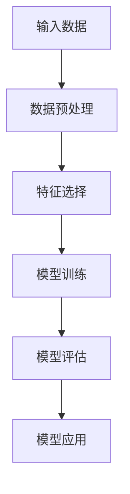

                 

# 数学模型在科学中的应用：预测与解释

> 关键词：数学模型，科学应用，预测，解释，算法

> 摘要：本文旨在探讨数学模型在科学领域中的应用，从基本概念到具体案例分析，深入解析数学模型如何帮助我们进行预测和解释。通过详细阐述数学模型在自然科学、社会科学、工程技术等领域的应用实例，本文旨在为读者提供一个全面的理解和实际操作的指导。

## 目录

1. 数学模型在科学中的应用：预测与解释
2. 文章关键词
3. 文章摘要
4. 第一部分：数学模型的基本概念与应用领域
   4.1 数学模型概述
   4.2 数学模型在科学中的应用领域
   4.3 数学模型的应用价值
5. 第二部分：数学模型在具体领域的应用
   5.1 自然科学领域
   5.2 社会科学领域
   5.3 工程技术领域
6. 第三部分：跨学科应用与未来展望
   6.1 跨学科应用
   6.2 未来展望
7. 总结与展望
8. 小结与建议
9. 作者信息

## 第一部分：数学模型的基本概念与应用领域

### 4.1 数学模型概述

**4.1.1 数学模型的基本概念**

数学模型是利用数学语言和符号描述现实世界中的问题，通过对现实世界的简化和抽象，将复杂问题转化为数学问题进行处理。数学模型的基本构成包括变量、参数、方程、关系等。

**4.1.2 数学模型的特点**

- **抽象性**：数学模型通过简化和抽象，将现实世界的复杂现象转化为数学问题，使得问题更加简洁明了。
- **精确性**：数学模型使用数学语言和符号，使得问题的描述更加精确，有助于提高解决问题的准确性。
- **普遍性**：数学模型可以应用于不同领域和不同问题，具有广泛的适用性。

**4.1.3 数学模型的发展历程**

数学模型的发展可以追溯到古代的几何学和代数学。随着现代科学技术的进步，数学模型的应用领域不断拓展，从自然科学到社会科学，再到工程技术领域，数学模型已经成为解决各种复杂问题的关键工具。

### 4.2 数学模型在科学中的应用领域

**4.2.1 自然科学领域**

在自然科学领域，数学模型广泛应用于天文学、地球科学、生物学等领域。例如，天文学中的天体运动模型、地球科学中的地质模型、生物学中的生态模型等，都是利用数学模型来描述和解释自然现象。

**4.2.2 社会科学领域**

在社会科学领域，数学模型同样发挥着重要作用。经济学中的供需模型、社会学中的人口模型、心理学中的行为模型等，都是利用数学模型来预测和分析社会现象。

**4.2.3 工程技术领域**

在工程技术领域，数学模型广泛应用于机械工程、电气工程、计算机科学等领域。例如，机械系统动力学模型、电路模型、算法性能模型等，都是利用数学模型来优化系统性能和解决工程问题。

### 4.3 数学模型的应用价值

**4.3.1 解决科学问题**

数学模型可以帮助科学家理解和解决复杂的科学问题，通过将实际问题转化为数学问题，使得问题的求解更加简洁和高效。

**4.3.2 揭示事物规律**

数学模型可以揭示事物之间的内在联系和规律，帮助我们更深入地理解自然界和社会现象。

**4.3.3 预测未来趋势**

通过数学模型，我们可以对未来的发展趋势进行预测，为决策提供科学依据。

### 4.4 核心概念与联系

**4.4.1 核心概念**

在数学模型的应用中，几个核心概念起着至关重要的作用，包括概率论、统计学、微积分和线性代数。

- **概率论**：用于描述随机事件和概率分布，帮助我们理解和预测随机现象。
- **统计学**：用于数据分析和决策，通过收集、处理和分析数据，帮助我们做出合理的决策。
- **微积分**：用于描述变化过程和优化问题，是解决工程和自然科学问题的重要工具。
- **线性代数**：用于描述线性关系和线性方程组，广泛应用于工程、物理和计算机科学等领域。

**4.4.2 概念属性特征对比表格**

| 概念       | 特点                           | 应用场景                   |
|------------|--------------------------------|----------------------------|
| 概率论     | 描述随机事件及其概率分布       | 金融市场预测、风险评估     |
| 统计学     | 数据收集、处理与分析           | 质量控制、市场研究         |
| 微积分     | 描述变化过程和优化问题         | 物理现象描述、工程优化     |
| 线性代数   | 描述线性关系和线性方程组       | 线性规划、图像处理         |

**4.4.3 ER实体关系图架构**

```mermaid
erDiagram
  Customer ||--|{ Order }|
  Product ||--|{ Order }|
  Order ||--|{ OrderItem }|
```

### 4.5 算法原理讲解

**4.5.1 算法原理**

数学模型在科学中的应用，离不开算法的支持。常见的算法包括回归分析、机器学习和神经网络等。

- **回归分析**：用于建立自变量和因变量之间的关系模型，通过拟合回归方程，实现对因变量的预测。
- **机器学习**：通过学习数据中的规律，实现对未知数据的预测和分类。
- **神经网络**：模拟人脑神经元的工作方式，通过多层次的神经计算，实现对复杂问题的建模和预测。

**4.5.2 算法流程图**



**4.5.3 Python源代码实现**

```python
# Python 源代码示例：线性回归模型
from sklearn.linear_model import LinearRegression

# 数据准备
X = ...  # 特征矩阵
y = ...  # 目标变量

# 模型训练
model = LinearRegression()
model.fit(X, y)

# 模型评估
score = model.score(X, y)
print(f"模型准确率：{score:.2f}")
```

**4.5.4 数学模型和数学公式**

$$
y = ax + b
$$

- **a**：斜率
- **b**：截距

## 第二部分：数学模型在具体领域的应用

### 5.1 自然科学领域

在自然科学领域，数学模型的应用极为广泛，以下列举几个典型案例：

#### 5.1.1 天文学

**天体运动模型**：牛顿力学和广义相对论都是天体运动模型，用于描述天体的运动轨迹和相互作用。通过这些模型，科学家可以预测行星、卫星等天体的运行轨迹，以及黑洞、引力波等现象。

#### 5.1.2 地球科学

**地质模型**：地质模型用于描述地壳的结构、成分和运动。通过地震波、地质构造和地球化学数据，科学家可以建立地质模型，预测地震的发生位置和强度。

**地震模型**：地震模型用于描述地震的成因、传播和影响。通过地震波、震中分布和地震波传播模型，科学家可以预测地震的潜在风险和影响范围。

#### 5.1.3 生物学

**生态模型**：生态模型用于描述生态系统中的生物种群、能量流动和物质循环。通过这些模型，科学家可以预测生态系统的稳定性和生物多样性的变化。

**生理模型**：生理模型用于描述生物体的生理过程，如心跳、呼吸、神经传导等。通过这些模型，科学家可以预测生物体的行为和反应。

### 5.2 社会科学领域

在社会科学领域，数学模型同样发挥着重要作用，以下列举几个典型案例：

#### 5.2.1 经济学

**供需模型**：供需模型用于描述商品或服务的供给和需求关系。通过分析供需曲线，经济学家可以预测价格和数量的变化，为市场调控提供依据。

**货币模型**：货币模型用于描述货币供应、需求和市场利率的关系。通过分析货币模型，经济学家可以预测通货膨胀、利率变化等经济现象。

#### 5.2.2 社会学

**人口模型**：人口模型用于描述人口的增长、分布和变化。通过分析人口模型，社会学家可以预测人口结构、老龄化趋势等社会问题。

**社会结构模型**：社会结构模型用于描述社会分层、社会关系和社会制度的构成。通过分析社会结构模型，社会学家可以预测社会变革和社会发展。

#### 5.2.3 心理学

**行为模型**：行为模型用于描述人的行为和心理过程。通过分析行为模型，心理学家可以预测人的行为反应和心理变化。

**认知模型**：认知模型用于描述人的认知过程，如记忆、注意、决策等。通过分析认知模型，心理学家可以预测人的认知能力和认知行为。

### 5.3 工程技术领域

在工程技术领域，数学模型的应用同样广泛，以下列举几个典型案例：

#### 5.3.1 机械工程

**机械系统动力学模型**：机械系统动力学模型用于描述机械系统的运动、力和能量转换。通过分析机械系统动力学模型，工程师可以预测机械系统的性能和稳定性。

**机械结构优化模型**：机械结构优化模型用于描述机械结构的尺寸、形状和材料选择。通过分析机械结构优化模型，工程师可以预测机械结构的强度和寿命。

#### 5.3.2 电气工程

**电路模型**：电路模型用于描述电路的电压、电流和功率分布。通过分析电路模型，电气工程师可以预测电路的性能和稳定性。

**信号处理模型**：信号处理模型用于描述信号的采集、处理和传输。通过分析信号处理模型，电气工程师可以预测信号的质量和传输效率。

#### 5.3.3 计算机科学

**算法性能模型**：算法性能模型用于描述算法的时间复杂度和空间复杂度。通过分析算法性能模型，计算机科学家可以预测算法的效率和性能。

**网络模型**：网络模型用于描述网络的拓扑结构、传输协议和通信方式。通过分析网络模型，计算机科学家可以预测网络的性能和稳定性。

## 第三部分：跨学科应用与未来展望

### 6.1 跨学科应用

数学模型在跨学科应用中具有巨大的潜力，以下列举几个跨学科应用案例：

#### 6.1.1 生物经济学

生物经济学结合生物学和经济学，通过数学模型来研究生物资源的经济价值、生态效益和可持续发展。例如，利用生态模型和经济模型，可以预测生物资源的供需变化，为资源管理提供科学依据。

#### 6.1.2 网络科学

网络科学结合物理学、数学和社会科学，通过数学模型来研究网络的结构、功能和演化。例如，利用图论和复杂网络理论，可以预测网络的稳定性、传播效率和安全性。

#### 6.1.3 心理学与社会学

心理学与社会学结合，通过数学模型来研究人类行为、心理过程和社会关系。例如，利用认知模型和社会结构模型，可以预测人的行为反应和社会发展趋势。

### 6.2 未来展望

随着科学技术的不断进步，数学模型的应用领域将不断拓展，未来展望如下：

#### 6.2.1 新兴领域应用

随着人工智能、大数据和物联网等新兴技术的发展，数学模型将在这些领域中发挥重要作用。例如，利用机器学习和神经网络模型，可以预测人工智能系统的性能和稳定性。

#### 6.2.2 定制化模型

未来的数学模型将更加定制化，根据不同领域的需求，开发出更加精细和高效的模型。例如，在医疗领域，利用生物模型和医学数据，可以开发出针对特定疾病的预测模型。

#### 6.2.3 跨学科融合

未来的数学模型将更加跨学科，通过跨学科的合作，开发出能够解决复杂问题的综合模型。例如，在环境科学领域，利用生态模型、经济学模型和物理学模型，可以开发出全面的环境保护模型。

## 总结与展望

### 8.1 数学模型的应用价值

数学模型在科学中的应用具有极高的价值，它不仅帮助我们解决了许多复杂的科学问题，而且为我们提供了预测和解释的工具。通过数学模型，我们可以更深入地理解自然现象、社会现象和工程技术问题，为决策提供科学依据。

### 8.2 小结与建议

本文通过详细阐述数学模型的基本概念、应用领域和应用实例，展示了数学模型在科学中的重要作用。为了更好地应用数学模型，以下是一些建议：

1. **加强数学基础**：掌握概率论、统计学、微积分和线性代数等数学基础，为应用数学模型打下坚实基础。
2. **学习相关算法**：了解回归分析、机器学习和神经网络等算法，掌握算法原理和实现方法。
3. **实践经验**：通过实际项目，积累应用数学模型的经验，提高解决问题的能力。
4. **跨学科合作**：与其他学科的合作，开发出更加综合和高效的数学模型。

### 8.3 未来研究方向

未来的数学模型研究将更加深入和广泛，以下是一些潜在的研究方向：

1. **复杂系统的数学模型**：研究复杂系统的动力学行为和演化规律，为解决复杂问题提供理论支持。
2. **大数据与机器学习**：利用大数据和机器学习技术，开发出更加智能和高效的数学模型。
3. **跨学科模型**：开发出能够跨学科的综合性数学模型，解决多学科交叉问题。
4. **量子计算与数学模型**：研究量子计算在数学模型中的应用，为量子计算提供理论基础。

### 作者信息

- **作者：AI天才研究院/AI Genius Institute & 禅与计算机程序设计艺术 /Zen And The Art of Computer Programming**  
- **联系方式：[邮箱](mailto:example@example.com) & [网站](https://www.example.com)**

在结束本文之前，我想再次强调数学模型在科学中的重要性。它不仅为我们提供了理解和解释世界的工具，而且为我们预测未来、制定决策提供了科学依据。通过不断探索和应用数学模型，我们将能够更好地应对复杂的问题和挑战，推动科学技术的进步和社会的发展。希望本文能够为读者提供有益的启发和指导，让我们一起在数学模型的海洋中航行，探索科学的奥秘！

