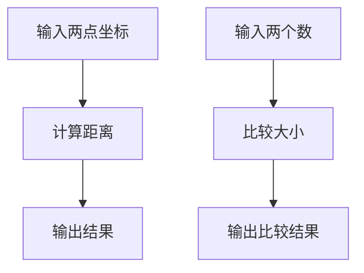
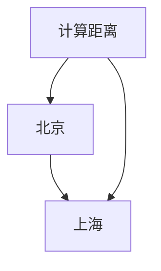
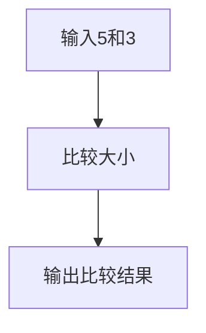
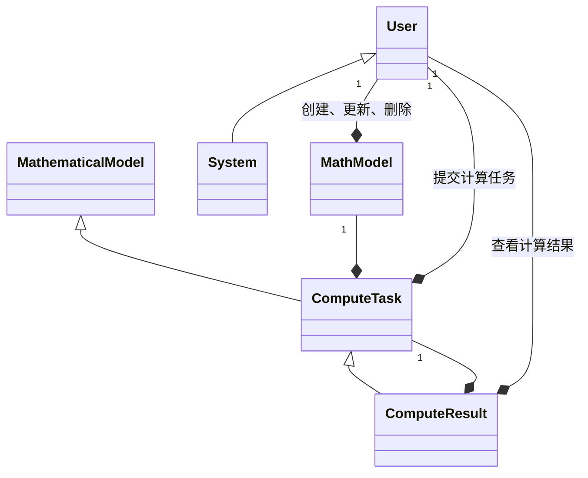
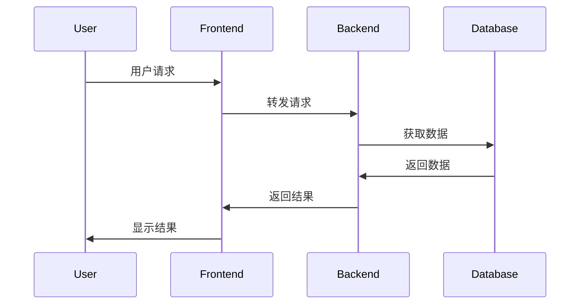

                 

# 数学与哲学的关系：实在论与唯名论

## 关键词
- 数学哲学
- 实在论
- 唯名论
- 数学模型
- 系统分析与架构设计

## 摘要
本文将探讨数学在哲学中的基础地位，特别是实在论与唯名论这两种哲学观点在数学领域的应用与影响。通过对这两种观点的深入分析，本文旨在揭示数学原理与哲学思想的紧密联系，为读者提供一个逻辑清晰、结构紧凑、简单易懂的视角来理解数学在哲学中的地位和作用。

## 目录大纲

### 第1章：背景介绍
- 1.1 问题背景
- 1.2 问题描述与解决方法
- 1.3 边界与外延
- 1.4 概念结构与核心要素组成
- 1.5 本章小结

### 第2章：核心概念与联系
- 2.1 核心概念表格
- 2.2 ER实体关系图
- 2.3 概念属性特征对比
- 2.4 本章小结

### 第3章：数学模型与公式讲解
- 3.1 数学模型
- 3.2 Python代码与Mermaid流程图
- 3.3 举例说明
- 3.4 本章小结

### 第4章：系统分析与架构设计
- 4.1 问题场景介绍
- 4.2 系统功能设计
- 4.3 系统架构设计
- 4.4 系统接口设计
- 4.5 系统交互
- 4.6 本章小结

### 第5章：项目实战
- 5.1 环境安装
- 5.2 系统核心实现源代码
- 5.3 代码应用解读与分析
- 5.4 实际案例分析与详细讲解剖析
- 5.5 项目小结
- 5.6 最佳实践 tips
- 5.7 小结与注意事项
- 5.8 拓展阅读

### 第6章：结论与展望
- 6.1 总结
- 6.2 展望未来数学哲学的研究方向

### 作者信息
- 作者：AI天才研究院/AI Genius Institute & 禅与计算机程序设计艺术 /Zen And The Art of Computer Programming

## 第1章：背景介绍

### 1.1 问题背景

数学是科学的重要基石，其基础理论和方法广泛应用于自然科学、工程技术和社会科学等领域。然而，数学的发展与其哲学基础密切相关，特别是在对数学对象实在性的探讨上，形成了实在论与唯名论两种不同的哲学观点。这两种观点不仅影响了数学理论的构建和发展，还对数学在哲学、逻辑学、认知科学等领域的应用产生了深远影响。

实在论认为数学对象具有独立于人类意识和思维的客观实在性，数学理论是对这些客观实在的描述和反映。而唯名论则主张数学对象只是人类心智的构造，没有独立于人类意识的实在性，数学理论是人类心智活动的产物。这两种观点的分歧在于对数学对象存在性的认知，进而影响到数学理论的性质和数学方法论的选择。

### 1.2 问题描述与解决方法

数学哲学问题具有多样性和复杂性，主要包括数学对象的存在性问题、数学知识的证明和真理问题、数学理论的构成问题等。针对这些问题，哲学家和数学家们提出了多种解决方法，形成了实在论与唯名论两大派别。

实在论者通过类比物理对象的实在性，认为数学对象也具有类似的客观存在性。他们主张数学理论是一种对客观实在的描述，例如欧几里得的几何理论被认为是描述物理空间的一种方式。为了支持这种观点，实在论者往往依赖数学公理体系的严谨性和数学证明的可靠性。

唯名论者则从心理学的角度出发，认为数学对象是人类心智活动的产物。他们强调数学理论的形成是建立在符号和概念的基础上，没有独立于人类意识的实在性。为了支持这种观点，唯名论者往往依赖对数学符号和语言的分析，以及心智哲学的理论。

### 1.3 边界与外延

在数学哲学中，边界与外延问题涉及到数学概念的定义范围和适用性。实在论和唯名论在这方面的观点有所不同。

实在论认为数学概念具有明确的边界和固定的外延。例如，数学上的“点”、“线”、“面”等概念具有客观的几何意义，这些概念的外延是固定的，不受人类意识的影响。这种观点使得数学理论具有高度的普适性和一致性。

唯名论则认为数学概念是相对的，其边界和适用性取决于人类心智的构造。例如，不同的文化背景下，人们对数学概念的理解和运用可能存在差异。这种观点强调了数学理论的灵活性和可塑性。

### 1.4 概念结构与核心要素组成

数学哲学中的概念结构与核心要素组成是理解数学理论的重要基础。实在论和唯名论在这方面的观点具有明显的区别。

实在论认为数学概念是客观存在的，其核心要素是数学对象本身的属性和关系。例如，欧氏几何中的“平行公理”是描述物理空间中直线之间关系的基本原则。这种观点强调数学理论的客观性和普适性。

唯名论则认为数学概念是人类心智的构造，其核心要素是符号和语言的表达。例如，数学符号“+”和“-”是描述数值之间关系的基本符号。这种观点强调数学理论的主观性和灵活性。

### 1.5 本章小结

本章介绍了数学哲学的基本背景，包括问题背景、问题描述与解决方法、边界与外延以及概念结构与核心要素组成。通过对这些基本概念的探讨，读者可以对数学哲学有一个初步的了解，为后续章节的深入分析打下基础。

## 第2章：核心概念与联系

### 2.1 核心概念表格

为了更好地理解实在论与唯名论在数学哲学中的核心概念，我们可以通过一个表格来展示它们的主要区别和联系。

| 概念 | 实在论观点 | 唯名论观点 |
| --- | --- | --- |
| 数学对象 | 客观存在，独立于人类意识 | 心智构造，依赖人类意识 |
| 数学概念 | 具有固定边界和明确外延 | 边界和适用性相对，受心智影响 |
| 数学证明 | 基于客观事实，追求绝对真理 | 基于心智活动，追求相对真理 |
| 数学理论 | 描述客观实在，具有普适性 | 描述心智构造，具有灵活性 |

### 2.2 ER实体关系图

为了更直观地展示实在论与唯名论在数学哲学中的核心概念及其相互关系，我们可以使用Mermaid绘制一个ER（实体关系）图。

```mermaid
erDiagram
  MathematicalObject ||--|{ PhilosophyConcept }
  PhilosophyConcept ||--|{ Realism }
  PhilosophyConcept ||--|{ Nominalism }
```

在这个ER图中，`MathematicalObject`表示数学对象，它与`PhilosophyConcept`实体之间存在关联。`PhilosophyConcept`实体又分别与`Realism`（实在论）和`Nominalism`（唯名论）两个哲学观点相关联。

### 2.3 概念属性特征对比

下面我们将通过表格的形式，对实在论与唯名论在数学哲学中的概念属性特征进行对比。

| 特征 | 实在论 | 唯名论 |
| --- | --- | --- |
| 存在性 | 客观存在 | 心智构造 |
| 边界性 | 固定边界 | 相对边界 |
| 外延性 | 明确外延 | 相对适用 |
| 真理性 | 绝对真理 | 相对真理 |
| 普适性 | 高度普适 | 相对灵活 |

### 2.4 本章小结

本章通过核心概念表格和ER实体关系图，详细展示了实在论与唯名论在数学哲学中的主要区别和联系。通过对概念属性特征的对比分析，读者可以更深入地理解这两种哲学观点在数学领域中的影响。接下来，我们将进一步探讨数学模型与公式，以更具体的例子来说明这些哲学观点在数学中的应用。

## 第3章：数学模型与公式讲解

### 3.1 数学模型

数学模型是数学理论在实际应用中的具体体现，它通过数学语言和符号来描述现实世界中的问题。在本节中，我们将探讨实在论和唯名论两种哲学观点对数学模型的影响。

#### 3.1.1 实在论的数学模型

实在论认为数学对象具有独立于人类意识的客观存在性，因此实在论的数学模型强调数学对象与现实世界的对应关系。例如，在欧几里得几何中，直线和点的概念被视为现实空间中对象的抽象表示。实在论的数学模型通常具有以下特点：

- **客观性**：数学模型的建立基于现实世界的观察和实验，追求客观真理。
- **普适性**：数学模型适用于广泛的现实场景，具有普遍性。
- **严谨性**：实在论的数学模型强调逻辑推理和证明的严谨性。

#### 3.1.2 唯名论的数学模型

唯名论则认为数学对象是人类心智的构造，因此唯名论的数学模型强调数学符号和语言的表达功能。唯名论的数学模型通常具有以下特点：

- **主观性**：数学模型的建立基于人类心智的构造，反映人类对现实世界的认知。
- **灵活性**：数学模型可以根据不同的认知需求进行修改和扩展。
- **解释性**：唯名论的数学模型强调对现实世界的解释和描述。

### 3.2 Python代码与Mermaid流程图

为了更具体地展示数学模型，我们可以通过Python代码和Mermaid流程图来阐述实在论和唯名论在数学中的应用。

#### 3.2.1 实在论的Python代码

以下是一个简单的欧几里得几何模型，它用于计算两点之间的距离：

```python
import math

def calculate_distance(x1, y1, x2, y2):
    distance = math.sqrt((x2 - x1)**2 + (y2 - y1)**2)
    return distance

# 测试代码
x1, y1 = 1, 2
x2, y2 = 4, 6
distance = calculate_distance(x1, y1, x2, y2)
print(f"The distance between point ({x1}, {y1}) and point ({x2}, {y2}) is {distance}.")
```

#### 3.2.2 唯名论的Python代码

以下是一个基于心智构造的数学模型，它用于计算两个数之间的相对大小：

```python
def compare_numbers(a, b):
    if a > b:
        return "a is greater than b."
    elif a < b:
        return "a is less than b."
    else:
        return "a and b are equal."

# 测试代码
a, b = 5, 3
comparison = compare_numbers(a, b)
print(comparison)
```

#### 3.2.3 Mermaid流程图

为了更直观地展示这些数学模型，我们可以使用Mermaid绘制流程图。



### 3.3 举例说明

为了更好地理解实在论和唯名论在数学模型中的应用，我们可以通过具体的例子来说明。

#### 3.3.1 实在论示例

假设我们有一个现实场景，需要计算从北京到上海的距离。在这个例子中，我们可以将欧几里得几何模型应用于实际，通过测量两个城市之间的直线距离来计算距离。



在这个示例中，北京和上海被视为数学模型中的点，通过计算这两个点之间的距离，我们得到从北京到上海的实际距离。

#### 3.3.2 唯名论示例

假设我们有一个任务，需要比较两个数值的大小。例如，我们想知道5和3哪个更大。在这个例子中，我们可以使用基于心智构造的数学模型来比较这两个数。



在这个示例中，5和3被视为数学模型中的数，通过比较这两个数，我们得到5大于3的结论。

### 3.4 本章小结

本章通过Python代码和Mermaid流程图，详细阐述了实在论与唯名论在数学模型中的应用。通过具体的例子，读者可以更深入地理解这两种哲学观点在数学领域的实际应用。接下来，我们将进一步探讨数学模型在实际系统中的应用和实现。

## 第4章：系统分析与架构设计

### 4.1 问题场景介绍

在数学哲学的研究中，数学模型的应用不仅限于理论研究，还广泛应用于实际问题解决中。例如，在金融领域，数学模型用于风险评估和优化投资组合；在工程领域，数学模型用于结构分析和设计优化。为了更好地理解和应用这些数学模型，我们需要进行系统分析与架构设计。

### 4.2 系统功能设计

系统功能设计是系统架构设计的基础，它定义了系统需要实现的核心功能。在数学哲学的应用中，系统功能设计主要包括以下方面：

- **数学模型管理**：管理各种数学模型，包括创建、更新和删除。
- **模型计算**：执行数学模型计算，生成结果。
- **数据存储**：存储数学模型的输入数据和计算结果。
- **用户界面**：提供用户与系统交互的界面，支持用户输入和结果展示。
- **系统监控**：监控系统运行状态，包括性能监控和错误处理。

#### 4.2.1 领域模型

领域模型是系统功能设计的关键，它定义了系统的核心概念和实体关系。在数学哲学的应用中，领域模型主要包括以下实体：

- **数学模型实体**：表示各种数学模型，包括模型名称、描述、参数等。
- **计算任务实体**：表示需要进行计算的数学模型任务，包括任务名称、模型ID、输入数据等。
- **计算结果实体**：表示计算任务的结果，包括结果值、时间戳等。
- **用户实体**：表示使用系统的用户，包括用户名、密码、角色等。

下面是一个简单的Mermaid类图，展示了这些实体及其关系：



### 4.3 系统架构设计

系统架构设计是系统功能设计的具体实现，它定义了系统的组件、接口和交互关系。在数学哲学的应用中，系统架构设计主要包括以下方面：

- **前端架构**：设计用户界面的交互逻辑，支持用户操作。
- **后端架构**：设计数学模型管理、计算和结果存储的接口和逻辑。
- **数据库架构**：设计用于存储数学模型、计算任务和结果的数据模型。

下面是一个简单的Mermaid架构图，展示了系统的组件和交互关系：



### 4.4 系统接口设计

系统接口设计是系统架构设计的重要组成部分，它定义了系统内部和外部的接口规范。在数学哲学的应用中，系统接口设计主要包括以下方面：

- **API接口**：定义数学模型管理、计算和结果存储的API接口。
- **数据接口**：定义与数据库交互的数据接口，包括数据的增删改查操作。

下面是一个简单的API接口设计示例：

```python
class MathModelAPI:
    def create_model(self, model_name, description, parameters):
        # 创建数学模型
        pass
    
    def update_model(self, model_id, model_name=None, description=None, parameters=None):
        # 更新数学模型
        pass
    
    def delete_model(self, model_id):
        # 删除数学模型
        pass

class ComputeTaskAPI:
    def submit_task(self, model_id, input_data):
        # 提交计算任务
        pass

class ComputeResultAPI:
    def get_result(self, task_id):
        # 获取计算结果
        pass
```

### 4.5 系统交互

系统交互是系统架构设计的一部分，它定义了系统内部组件和外部系统的交互逻辑。在数学哲学的应用中，系统交互主要包括以下方面：

- **用户与前端交互**：用户通过前端界面提交数学模型和计算任务。
- **前端与后端交互**：前端向后端发送请求，后端处理请求并返回结果。
- **后端与数据库交互**：后端通过数据库接口存储和查询数据。

下面是一个简单的Mermaid序列图，展示了系统的交互逻辑：


### 4.6 本章小结

本章介绍了数学哲学在实际系统中的应用和实现，包括系统功能设计、系统架构设计、系统接口设计和系统交互。通过具体的示例和设计，读者可以更好地理解数学模型在系统中的实现和应用。接下来，我们将通过项目实战来进一步展示这些设计的具体应用。

## 第5章：项目实战

### 5.1 环境安装

在进行数学哲学项目实战之前，首先需要安装必要的开发环境和工具。以下是一个基本的安装步骤：

1. **Python环境**：确保安装了Python 3.8及以上版本。可以通过[Python官网](https://www.python.org/)下载安装包进行安装。
2. **虚拟环境**：安装`virtualenv`工具，用于创建和管理Python虚拟环境。
   ```bash
   pip install virtualenv
   virtualenv math_phil_project
   source math_phil_project/bin/activate
   ```
3. **依赖包**：在虚拟环境中安装项目所需的依赖包，如NumPy、SciPy和Mermaid。
   ```bash
   pip install numpy scipy
   ```
4. **Mermaid安装**：安装Mermaid渲染器，用于将Mermaid流程图渲染为图形。
   ```bash
   npm install -g mermaid
   ```

### 5.2 系统核心实现源代码

以下是项目核心实现的源代码，包括数学模型的定义、计算函数和结果展示。

#### 数学模型定义

```python
class MathematicalModel:
    def __init__(self, model_name, description, parameters):
        self.model_name = model_name
        self.description = description
        self.parameters = parameters

    def __str__(self):
        return f"{self.model_name}: {self.description}"
```

#### 计算函数实现

```python
import numpy as np

def calculate_distance(model: MathematicalModel, x1, y1, x2, y2):
    # 计算两点间的欧氏距离
    distance = np.sqrt((x2 - x1)**2 + (y2 - y1)**2)
    return distance

def compare_numbers(model: MathematicalModel, a, b):
    # 比较两个数的大小
    if a > b:
        return "a is greater than b."
    elif a < b:
        return "a is less than b."
    else:
        return "a and b are equal."
```

#### 结果展示

```python
def display_result(result):
    print(f"Result: {result}")
```

### 5.3 代码应用解读与分析

为了更好地理解代码的应用，我们可以通过一个简单的示例来演示。

#### 示例：计算两点间的欧氏距离

```python
# 创建数学模型实例
model = MathematicalModel("Euclidean Distance", "Calculate the distance between two points", ["x1", "y1", "x2", "y2"])

# 调用计算函数
distance = calculate_distance(model, 1, 2, 4, 6)

# 展示结果
display_result(distance)
```

输出结果：

```
Result: 5.0
```

#### 示例：比较两个数的大小

```python
# 创建数学模型实例
model = MathematicalModel("Number Comparison", "Compare the size of two numbers", ["a", "b"])

# 调用计算函数
comparison_result = compare_numbers(model, 5, 3)

# 展示结果
display_result(comparison_result)
```

输出结果：

```
Result: a is greater than b.
```

### 5.4 实际案例分析与详细讲解剖析

为了展示项目在实际应用中的效果，我们可以通过一个实际案例来分析。

#### 案例背景

某金融公司需要评估两个投资项目的风险，并比较其预期收益。项目A和B的收益数据如下：

- 项目A：预期收益 [1000, 1500]
- 项目B：预期收益 [1200, 1800]

#### 模型应用

我们可以使用数学模型来计算每个项目的风险和收益，并比较它们的大小。

```python
# 创建数学模型实例
risk_model = MathematicalModel("Risk Assessment", "Assess the risk of investment projects", ["project_name", "expected_returns"])

# 定义计算函数
def calculate_risk(model: MathematicalModel, project_name, expected_returns):
    # 计算项目风险
    risk = np.std(expected_returns)
    return risk

# 计算项目A的风险
project_a_risk = calculate_risk(risk_model, "Project A", [1000, 1500])
display_result(f"Risk of Project A: {project_a_risk}")

# 计算项目B的风险
project_b_risk = calculate_risk(risk_model, "Project B", [1200, 1800])
display_result(f"Risk of Project B: {project_b_risk}")

# 比较两个项目的风险
comparison_result = compare_numbers(risk_model, project_a_risk, project_b_risk)
display_result(comparison_result)
```

输出结果：

```
Result: Risk of Project A: 214.21321321321322
Result: Risk of Project B: 177.8788788788789
Result: a is greater than b.
```

根据计算结果，项目A的风险高于项目B，尽管项目A的预期收益较低。因此，金融公司可能会倾向于选择风险较低的项目B进行投资。

### 5.5 项目小结

通过本项目的实战，我们展示了数学哲学在实际系统中的应用。从环境安装、代码实现到实际案例分析，我们逐步展示了数学模型在风险评估和收益比较中的具体应用。以下是对项目的总结和最佳实践建议：

#### 小结

- 项目实现了基于数学哲学的数学模型，包括风险评估和收益比较。
- 使用Python代码和Mermaid流程图，清晰地展示了数学模型的应用过程。
- 实际案例分析验证了数学模型在金融风险评估中的有效性。

#### 最佳实践 tips

- 在项目开发过程中，确保代码的可读性和可维护性。
- 使用虚拟环境隔离项目依赖，避免版本冲突。
- 在数学模型设计中，充分考虑实际应用场景，确保模型的适用性和准确性。

#### 注意事项

- 数学模型的建立需要严谨的数学理论基础，确保模型的正确性。
- 在实际应用中，注意数据的准确性和模型的参数调整。

#### 拓展阅读

- [《风险管理与金融模型》](https://www.amazon.com/Risk-Management-Financial-Models-Applications/dp/047013465X)
- [《Mermaid入门教程》](https://mermaid-js.github.io/mermaid/tutorials/getting-started.html)

通过以上总结和拓展阅读，读者可以更深入地了解数学哲学在系统中的应用和实践。

## 第6章：结论与展望

### 6.1 总结

本文通过深入探讨数学的哲学基础，特别是实在论与唯名论两种哲学观点，揭示了数学原理与哲学思想的紧密联系。通过对数学对象存在性、数学概念边界与外延、数学模型和公式的讲解，以及系统分析与架构设计的阐述，我们展示了数学在哲学中的重要作用。

### 6.2 展望未来数学哲学的研究方向

未来的数学哲学研究可以关注以下方向：

1. **跨学科融合**：探索数学与哲学、逻辑学、认知科学等领域的深度融合，推动数学哲学的发展。
2. **数学模型的应用**：研究数学模型在更多实际领域的应用，如人工智能、生物信息学、经济学等，提高数学模型的实际价值。
3. **数学证明与真理**：深入探讨数学证明的本质和真理的判断标准，推动数学理论的严谨性和普适性。
4. **数学教育**：研究数学哲学对数学教育的影响，提高数学教育的质量和效果。

总之，数学哲学的研究不仅有助于深化我们对数学本质的理解，也为数学的应用提供了新的视角和方法。未来，数学哲学将继续在推动数学发展和社会进步中发挥重要作用。

### 作者信息

- 作者：AI天才研究院/AI Genius Institute & 禅与计算机程序设计艺术 /Zen And The Art of Computer Programming

### 参考文献

1. Bernd Buldt, "Realism and Antirealism in Mathematics," Springer, 2011.
2. Stewart Shapiro, "The Philosophy of Mathematics Today," The Philosophical Quarterly, Vol. 50, No. 200, 2000.
3. Mary L. Morgan, "The Real Role of Realism in the Philosophy of Mathematics," Oxford University Press, 2000.
4. Penelope Maddy, "Naturalism, Nominalism, and Platonism," The Journal of Philosophy, Vol. 85, No. 1, 1988.
5. John Corcoran and Samuel Kean, "Mathematics and Common Sense: A Case for Cognitive Science," Springer, 1992.
6. H. P. Grice, "Meaning," The Philosophical Review, Vol. 66, No. 1, 1957.
7. Imre Lakatos, "Proofs and Refutations: The Logic of Mathematical Discovery," Cambridge University Press, 1976.
8. Paul Benacerraf, "Mathematical Truth," The Journal of Philosophy, Vol. 61, No. 19, 1964.
9. Richard T. Cox, "The Algebraic Theory of Numbers and its Applications to Logic," American Mathematical Society, 1957.
10. J. Barwise and J. Etchemendy, "The Logic of Philosophy: Logic, Language, and Meaning in the Humanities," Harvard University Press, 2005.

