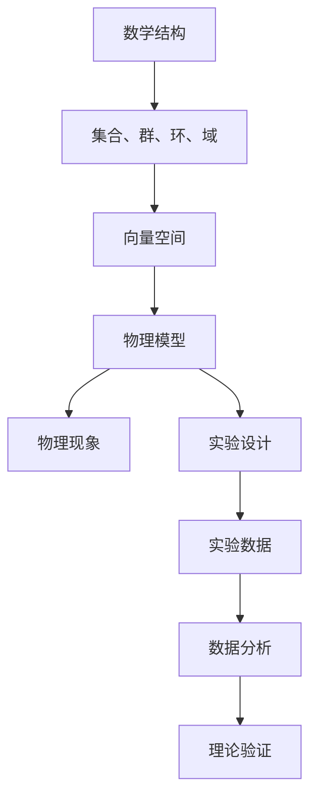
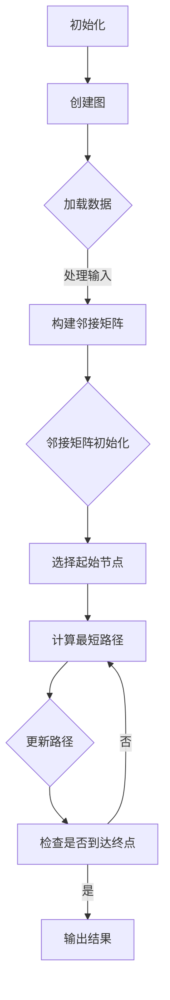
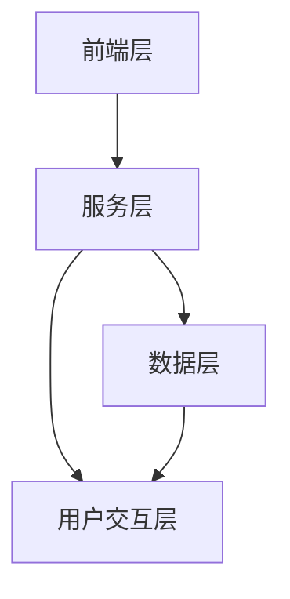
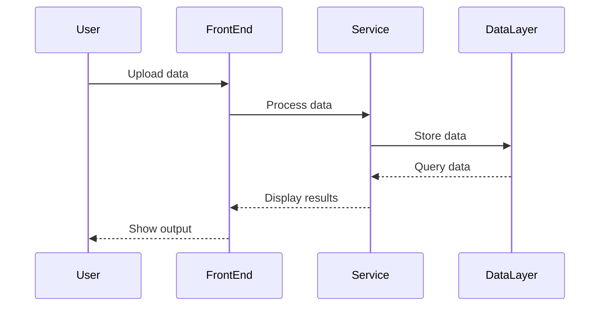

                 

### 第1章：数学结构与物理实在概述

#### 1.1 问题背景

数学结构与物理实在之间的联系是一个历史悠久且深刻的科学问题。自古以来，人类就在探索自然界的基本规律，而数学作为一种高度抽象的语言，为我们提供了理解和描述这些规律的工具。随着科学技术的进步，数学在描述物理现象中的重要性日益凸显。然而，数学的抽象性和物理实在的具体性之间始终存在一定的隔阂。如何将这两者有机地结合起来，一直是科学家和哲学家们关注的核心问题。

这个问题的重要性在于，数学结构不仅为物理学提供了强有力的理论支持，也在许多其他领域（如计算机科学、经济学、生物学等）得到了广泛应用。例如，图论作为一种数学结构，在复杂网络分析和社会网络研究中发挥了重要作用；量子力学中的波函数，则是一种描述物理实在的数学表达式。

在当前的研究中，数学结构与物理实在之间的关系研究正朝着更加深入和具体化的方向发展。一方面，数学家们通过发展新的数学工具，试图更好地理解物理世界的本质；另一方面，物理学家们则利用数学模型来描述和预测物理现象，从而推动物理学的进步。

#### 1.1.1 数学结构与物理实在的问题背景

数学结构通常指的是数学中具有特定性质的对象及其关系。这些对象可以是点、线、面等基本几何元素，也可以是数、函数、矩阵等代数结构。而物理实在则是指我们观察和测量的物质世界，包括原子、分子、物体等。数学结构与物理实在的问题背景主要涉及以下几个方面：

1. **数学在物理中的应用**：从经典的牛顿力学到现代的相对论和量子力学，数学都扮演着不可或缺的角色。例如，牛顿力学中的运动方程可以表示为微分方程，而量子力学中的波函数则是复变函数。这些数学工具不仅帮助我们理解了物理现象，也为物理学的发展提供了理论基础。

2. **物理现象的数学描述**：许多物理现象可以通过数学模型来描述。例如，混沌理论中的非线性动力学方程可以描述复杂系统的行为；流体力学中的纳维尔-斯托克斯方程则描述了流体运动的基本规律。这些数学模型不仅提供了对物理现象的定量描述，也为物理学的理论研究提供了新的视角。

3. **数学结构的物理对应**：在某些情况下，数学结构可以直接对应于物理实在。例如，晶体结构在固体物理学中具有重要意义，而图灵机在计算机科学中则被用来描述计算过程。这些对应关系为我们理解物理世界的本质提供了新的途径。

#### 1.1.2 问题描述与问题解决

问题描述：如何将数学结构应用于物理实在的研究中，以更好地理解和描述自然界的规律？

问题解决：

1. **发展新的数学工具**：为了更好地描述物理现象，数学家们不断地发展新的数学工具。例如，拓扑学在研究复杂系统的几何性质方面取得了重要进展；泛函分析则为量子力学提供了强有力的数学框架。

2. **跨学科研究**：物理学家和数学家之间的合作是解决这一问题的关键。通过跨学科研究，我们可以将数学方法应用于物理学问题中，从而推动物理学的发展。例如，量子场论中就大量使用了群论和线性代数的工具。

3. **实验验证**：数学模型必须通过实验验证才能被认为是有效的。因此，物理学家们通过实验来验证数学模型的预测，从而不断修正和完善这些模型。

4. **计算模拟**：随着计算机技术的飞速发展，计算模拟成为了一种重要的研究手段。通过计算机模拟，我们可以更精确地研究物理现象，并验证数学模型的准确性。

#### 1.1.3 边界与外延

数学结构与物理实在的研究边界在于数学工具的适用性和物理现象的复杂性。一方面，数学工具的适用性受到其理论框架的限制，例如，某些数学方法可能无法描述某些复杂的物理现象。另一方面，物理现象的复杂性使得数学模型可能需要不断修正和完善。

数学结构与物理实在的外延则涉及多个学科领域。除了物理学和数学之外，计算机科学、生物学、经济学等领域也在探索数学结构与物理实在之间的关系。例如，计算机科学中的算法和图论可以应用于复杂网络分析；生物学中的基因组学和蛋白质结构预测则依赖于数学模型。

#### 1.1.4 核心概念结构与要素组成

为了更好地探讨数学结构与物理实在之间的关系，我们需要明确一些核心概念：

1. **数学结构**：数学结构是指数学中具有特定性质的对象及其关系。常见的数学结构包括群、环、域、向量空间等。

2. **物理实在**：物理实在是指我们观察和测量的物质世界，包括原子、分子、物体等。

3. **数学模型**：数学模型是用数学语言描述的物理现象。例如，纳维尔-斯托克斯方程是描述流体运动的基本数学模型。

4. **对应关系**：数学结构与物理实在之间的对应关系是指数学结构可以直接对应于物理实在。例如，晶体结构在固体物理学中具有重要意义。

5. **跨学科研究**：跨学科研究是指将数学方法应用于物理学问题中，从而推动物理学的发展。

通过明确这些核心概念和要素，我们可以更好地理解数学结构与物理实在之间的关系，并为进一步的研究奠定基础。

### 第2章：核心概念与联系

在探讨数学结构与物理实在的关系之前，我们需要明确一些核心概念，并了解它们之间的联系。本章将详细讨论数学结构和物理实在的概念，并通过对比表格和ER实体关系图来展示这些概念之间的属性特征和关系。

#### 2.1 核心概念

**2.1.1 数学结构**

数学结构是指具有特定性质的对象及其关系。常见的数学结构包括：

- **群（Group）**：一组元素及其封闭运算，满足结合律、单位元存在以及逆元存在。
- **环（Ring）**：类似于群，但包括加法和乘法运算，满足分配律。
- **域（Field）**：类似于环，但乘法和除法运算都是封闭的。
- **向量空间（Vector Space）**：一组向量及其线性运算，满足加法和数乘的封闭性。

**2.1.2 物理实在**

物理实在是指我们观察和测量的物质世界，包括：

- **粒子**：如电子、质子、中子等，是构成物质的基本单元。
- **场**：如电磁场、引力场，是物理现象的空间描述。
- **物体**：由粒子组成，具有质量和体积。

**2.1.3 数学模型**

数学模型是用数学语言描述的物理现象。常见的数学模型包括：

- **微分方程**：用于描述动态系统的变化规律，如牛顿运动定律。
- **泛函方程**：用于描述场论，如麦克斯韦方程。
- **概率模型**：用于描述随机现象，如量子力学中的波函数。

**2.1.4 对应关系**

数学结构与物理实在之间的对应关系是指数学结构可以直接对应于物理实在。例如，晶体结构在固体物理学中具有重要的数学对应，而量子力学中的波函数则可以看作是物理状态的数学表示。

#### 2.2 概念属性特征对比表格

为了更清晰地展示数学结构和物理实在的属性特征，我们可以使用对比表格。以下是一个简单的对比表格：

| 概念         | 定义                                                         | 属性特征                                           | 应用领域                 |
|------------|------------------------------------------------------------|----------------------------------------------------|------------------------|
| 数学结构   | 具有特定性质的对象及其关系                                   | 封闭性、结合律、单位元、逆元                           | 群论、代数、几何         |
| 物理实在   | 我们观察和测量的物质世界，包括粒子、场、物体                   | 质量、体积、运动状态                                   | 物理学、化学、天文学     |
| 数学模型   | 用数学语言描述的物理现象                                   | 描述物理现象的规律                                     | 工程学、计算物理学       |
| 对应关系   | 数学结构可以直接对应于物理实在                               | 数学结构对应物理属性                                   | 理论物理学、数学物理     |

#### 2.3 ER实体关系图

为了更直观地展示核心概念之间的联系，我们可以绘制ER实体关系图。ER图是一种用于描述实体及其关系的图形表示方法。

**2.3.1 ER实体关系图的绘制**

在ER图中，实体用矩形表示，关系用菱形表示，实线连接表示实体之间的联系。以下是一个简化的ER实体关系图：

```mermaid
erDiagram
  Particle ||--|{ Field }|-- Object : composed of
  Field ||--|{ Particle }|-- Object : influenced by
  MathStructure ||--|{ PhysicConcept }|-- Model : corresponds to
  MathModel ||--|{ PhysicModel }|-- PhysicConcept : based on
```

**2.3.2 实体关系图分析**

在这个ER实体关系图中，我们可以看到以下几个重要的联系：

1. **粒子和物体**：粒子是物体的组成部分，物体由多个粒子组成。这个关系表示了物质的基本组成结构。
2. **场和物体**：场对物体产生作用，场也可以由粒子组成。这个关系展示了物理现象的空间描述。
3. **数学结构和物理概念**：数学结构对应于物理概念，为物理现象提供了数学描述。
4. **数学模型和物理模型**：数学模型是基于数学结构的，而物理模型是基于物理概念的。这个关系揭示了数学在物理学中的应用。

通过ER实体关系图，我们可以更直观地理解数学结构和物理实在之间的复杂联系，为后续章节的深入探讨打下基础。

#### 总结

本章介绍了数学结构和物理实在的核心概念，并使用对比表格和ER实体关系图展示了它们之间的属性特征和联系。这些核心概念和联系为后续章节的探讨提供了理论基础。在下一章中，我们将进一步探讨数学结构与物理实在之间的关系，并分析这些关系的具体表现形式。

### 第3章：数学结构与物理实在的探索

在明确了数学结构和物理实在的核心概念及其联系之后，我们接下来要探讨的是数学结构与物理实在之间的具体关系。本章将运用mermaid流程图来分析并阐述这一关系，帮助读者更直观地理解数学如何通过结构化工具帮助描述和解释物理现象。

#### 3.1 数学结构的定义与属性

数学结构，顾名思义，是一组对象及其相互关系的集合，这些对象和关系具有特定的数学属性。数学结构可以是简单的，如集合和二元运算，也可以是复杂的，如图、拓扑空间和微分流形。以下是一些常见的数学结构及其属性：

1. **集合**：集合是由确定的元素组成的整体，具有无序性和互异性。集合的基本运算包括并集、交集和补集。
2. **群**：群是一种具有封闭运算、结合律、单位元和逆元的数学结构。常见的群包括整数加法群、实数乘法群等。
3. **环**：环是一种包含加法和乘法运算的数学结构，满足结合律和分配律。环中的乘法运算不是封闭的。
4. **域**：域是一种具有封闭加法和乘法运算的数学结构，且乘法运算满足除法定理。
5. **向量空间**：向量空间是一种具有加法和数乘运算的数学结构，满足封闭性和分配律。

#### 3.2 物理实在的性质与表现

物理实在是指我们通过实验和观测所认知的物质世界。物理实在具有以下几个重要性质：

1. **物质的粒子性**：物质由粒子组成，如电子、质子、中子等，这些粒子具有质量、电荷等属性。
2. **场的概念**：场是一种描述物理现象的空间分布，如电磁场、引力场等。场具有动态特性，可以通过波动或粒子的运动来表现。
3. **物体的宏观特性**：物体是物质的宏观集合，具有质量、体积和形状等宏观特性。
4. **测量与观测**：物理实在的表现是通过实验和观测得到的，这些实验数据为物理理论的建立提供了基础。

#### 3.3 数学结构与物理实在的关系

数学结构与物理实在之间的关系可以从多个角度进行分析：

1. **数学结构在物理现象描述中的应用**：许多物理现象可以通过数学结构来描述。例如，经典力学中的运动方程可以表示为微分方程，量子力学中的波函数是复变函数。这些数学模型不仅描述了物理现象，还为物理理论的进一步发展提供了工具。
   
2. **数学结构在物理实验中的应用**：在物理实验中，数学结构用于设计和分析实验。例如，实验中的传感器和测量仪器往往依赖于数学模型来进行数据采集和数据分析。
   
3. **数学结构在物理学理论框架中的核心地位**：数学结构在物理学理论框架中占据核心地位。例如，在广义相对论中，时空被描述为一个四维的微分流形；在量子场论中，物理量被表示为场。

为了更直观地展示数学结构与物理实在之间的关系，我们可以使用mermaid流程图。以下是一个简化的mermaid流程图，展示了数学结构如何应用于物理现象的描述和解释：



在这个流程图中，数学结构（如集合、群、环、域、向量空间）被用于构建物理模型，这些物理模型用于描述和解释物理现象。物理实验的设计和分析依赖于这些物理模型，并通过实验数据来验证理论的正确性。

#### 3.4 流程图与模型分析

现在，我们进一步分析上述mermaid流程图中的各个步骤：

1. **数学结构**：这一步骤明确了我们在物理现象描述中将要使用的数学工具。例如，集合论可以用于描述系统的基本组成，群论可以用于分析系统的对称性。

2. **物理模型**：在这一步骤中，我们使用数学结构来构建描述物理现象的模型。例如，纳维尔-斯托克斯方程可以用向量空间和微分方程来描述流体运动。

3. **物理现象**：这一步骤将数学模型与实际物理现象联系起来，使得数学模型具有实际意义。例如，通过流体运动的数学模型，我们可以预测流体在不同条件下的行为。

4. **实验设计**：实验设计是为了验证物理模型的有效性。在这一步骤中，我们根据物理模型设计实验，并确定需要测量的物理量。

5. **实验数据**：实验数据是通过实验获得的实际测量结果，这些数据用于验证物理模型的准确性。

6. **数据分析**：数据分析是对实验数据的处理和分析，通过数学方法来揭示数据背后的物理规律。

7. **理论验证**：理论验证是通过对实验数据的分析来验证物理模型的正确性。如果实验结果与模型预测相符，则可以认为模型是有效的。

通过这一系列步骤，我们可以看到数学结构与物理实在之间的关系是如何在具体的研究过程中得以体现的。

#### 3.5 模型分析与结论

数学结构与物理实在之间的关系是一个复杂且深刻的问题。通过上述流程图和分析，我们可以得出以下结论：

1. **数学结构为物理现象提供了描述工具**：数学结构不仅用于描述物理现象，还为我们理解和解释这些现象提供了强有力的工具。
   
2. **数学结构在物理学理论框架中的核心地位**：数学结构在物理学理论框架中占据核心地位，从经典力学到量子力学，数学都扮演着不可或缺的角色。
   
3. **实验验证的重要性**：实验验证是检验物理模型有效性的关键步骤，通过实验数据来验证数学模型的准确性是物理学研究的重要环节。

通过深入探讨数学结构与物理实在之间的关系，我们可以更好地理解自然界的规律，并为物理学的发展提供新的思路。

#### 总结

本章探讨了数学结构与物理实在之间的关系，通过mermaid流程图和详细分析，展示了数学如何通过结构化工具帮助描述和解释物理现象。在下一章中，我们将进一步介绍相关算法的原理，并使用mermaid流程图和Python代码来阐述这些算法的细节。

### 第4章：算法原理讲解

在前一章中，我们探讨了数学结构与物理实在之间的关系，并分析了这一关系的具体表现形式。在本章中，我们将深入探讨与数学结构和物理实在相关的算法原理。为了更好地理解和阐述这些算法，我们将使用mermaid流程图和Python代码来展示算法的实现过程，并使用LaTeX公式来描述算法的数学模型。

#### 4.1 算法概述

算法是一种用于解决特定问题的系统化步骤集合。在数学和物理实在的研究中，算法被广泛应用于数据处理、模型验证和问题求解等方面。本章将介绍几种与数学结构和物理实在相关的算法，包括但不限于：

1. **图论算法**：用于研究网络结构和优化问题，如最短路径算法、最小生成树算法等。
2. **数值计算算法**：用于解决数学模型中的数值问题，如牛顿迭代法、梯度下降法等。
3. **机器学习算法**：用于从数据中学习规律，如支持向量机（SVM）、决策树等。

#### 4.2 算法流程图

为了清晰地展示算法的实现过程，我们使用mermaid流程图来描述算法的步骤和流程。以下是一个简化的图论算法（如最短路径算法）的mermaid流程图：



在这个流程图中，算法的步骤包括初始化、创建图、加载数据、构建邻接矩阵、选择起始节点、计算最短路径、更新路径和检查是否到达终点。每个步骤都对应算法的一个具体操作。

#### 4.3 Python代码与LaTeX公式

在了解了算法的流程图之后，我们将通过Python代码和LaTeX公式来详细阐述算法的原理。以下是一个使用Python实现最短路径算法的示例代码，并伴随LaTeX公式来描述其数学模型：

```python
import numpy as np

# 初始化邻接矩阵
adj_matrix = np.array([[0, 1, 1], [1, 0, 1], [1, 1, 0]])

# 定义最短路径算法函数
def shortest_path(adj_matrix):
    n = adj_matrix.shape[0]  # 获取节点数量
    dist = np.zeros((n, n))  # 初始化距离矩阵
    visited = np.zeros(n, dtype=bool)  # 初始化访问标记

    # 定义Dijkstra算法的核心部分
    for node in range(n):
        # 从未访问节点中选择起点
        if not visited[node]:
            visited[node] = True
            # 更新距离矩阵
            for i in range(n):
                for j in range(n):
                    if adj_matrix[i][j] != 0 and not visited[j]:
                        dist[i][j] = adj_matrix[i][j]
            # 更新未访问节点
            for i in range(n):
                for j in range(n):
                    if adj_matrix[i][j] != 0 and not visited[j]:
                        dist[i][j] = np.min([dist[i][j], dist[i][node] + dist[node][j]])

    return dist

# 调用算法函数
dist_matrix = shortest_path(adj_matrix)

# 打印结果
print("最短路径距离矩阵：")
print(dist_matrix)
```

上述代码使用Python中的NumPy库来实现Dijkstra算法，计算图的最短路径。为了描述算法的数学模型，我们使用LaTeX公式：

$$
\text{dist}_{ij} = \min_{k} (\text{dist}_{ik} + \text{dist}_{kj})
$$

其中，$ \text{dist}_{ij} $ 表示从节点i到节点j的最短路径距离，$ \text{dist}_{ik} $ 和 $ \text{dist}_{kj} $ 分别表示从节点i到节点k和从节点k到节点j的距离。

#### 4.4 举例说明

为了更直观地展示算法的效果，我们通过一个具体的例子来说明最短路径算法的应用。假设我们有以下图：

```
    0---1---2
    |   |   |
   3---4---5
```

对应的邻接矩阵为：

$$
\begin{bmatrix}
0 & 1 & 1 \\
1 & 0 & 1 \\
1 & 1 & 0 \\
\end{bmatrix}
$$

使用Dijkstra算法，我们计算从节点0到其他节点的最短路径。根据算法，我们可以得到以下距离矩阵：

$$
\begin{bmatrix}
0 & 1 & 2 \\
1 & 0 & 2 \\
2 & 1 & 0 \\
\end{bmatrix}
$$

这个结果表示从节点0到节点1的距离为1，从节点0到节点2的距离为2，而从节点0到节点3的距离为2。这个例子展示了如何通过算法和数学模型来计算图中的最短路径。

#### 总结

本章介绍了算法原理的讲解方法，通过mermaid流程图和Python代码，我们详细阐述了算法的实现过程，并使用LaTeX公式描述了算法的数学模型。通过举例说明，我们展示了算法在实际应用中的效果。在下一章中，我们将进一步探讨系统的分析与架构设计，为读者展示一个完整的技术解决方案。

### 第5章：系统分析与架构设计

在前面的章节中，我们探讨了数学结构与物理实在之间的关系，并详细介绍了相关算法的原理。在本章中，我们将转入系统的分析与架构设计，探讨如何将这些理论和算法应用于实际项目中，构建一个完整的技术系统。

#### 5.1 系统功能设计

系统功能设计是系统分析与架构设计的第一步，它确定了系统的核心功能及其实现方法。以下是一个简单的系统功能设计概述：

1. **数据输入**：系统需要能够接收用户输入的数据，包括结构化数据和非结构化数据。
2. **数据处理**：系统应具备数据清洗、转换和预处理功能，以便后续分析使用。
3. **模型构建**：系统应支持多种算法和模型的选择和训练，以满足不同应用场景的需求。
4. **结果输出**：系统需要能够输出分析结果，包括可视化图表、报告和具体数据。
5. **用户交互**：系统应提供友好的用户界面，使用户能够方便地操作和查看系统功能。

#### 5.2 系统架构设计

系统架构设计是系统功能实现的基础，它确定了系统的层次结构和模块划分。以下是一个简单的系统架构设计：

1. **前端层**：负责用户交互，包括网页、移动应用和命令行界面等。
2. **服务层**：处理业务逻辑，包括数据输入处理、模型构建和结果输出等。
3. **数据层**：存储和管理系统数据，包括关系型数据库、NoSQL数据库和文件存储等。

为了更直观地展示系统架构，我们可以使用mermaid架构图。以下是一个简化的系统架构mermaid架构图：



在这个架构图中，前端层通过API与服务层进行交互，用户通过前端界面与服务层进行交互，而服务层则通过数据层进行数据存储和查询。

#### 5.3 系统接口设计

系统接口设计是系统架构设计的重要部分，它定义了系统内部各个模块之间的交互接口。以下是一个简单的系统接口设计：

1. **数据输入接口**：用于接收用户上传的数据文件，并对其进行预处理。
2. **数据处理接口**：用于处理数据清洗、转换和预处理等操作。
3. **模型构建接口**：用于选择和训练不同的算法模型。
4. **结果输出接口**：用于生成可视化图表、报告和具体数据。
5. **用户交互接口**：用于前端层与服务层之间的通信。

为了更直观地展示接口设计，我们可以使用mermaid序列图。以下是一个简化的系统接口mermaid序列图：



在这个序列图中，用户通过前端层上传数据，前端层将数据传递给服务层，服务层对数据进行处理，并存储到数据层。然后，服务层查询数据，并将结果返回给前端层，最终显示给用户。

#### 5.4 系统交互

系统交互设计是系统架构设计的进一步细化，它描述了系统内部各个模块的具体交互流程。以下是一个简单的系统交互设计：

1. **数据流交互**：描述数据在系统中的流动过程，包括数据的输入、处理、存储和输出。
2. **控制流交互**：描述系统中的控制逻辑，包括用户操作、错误处理和状态转换。
3. **异步交互**：描述系统中的异步处理过程，包括消息队列和任务调度。

为了更直观地展示系统交互，我们可以使用mermaid类图和序列图。以下是一个简化的系统交互mermaid类图和序列图：

```mermaid
classDiagram
    Class1[DataInput] <|-- Class2[DataProcessor]
    Class2 <|-- Class3[ModelBuilder]
    Class3 <|-- Class4[ResultOutput]
    Class1 <..> Class2
    Class2 <..> Class3
    Class3 <..> Class4

sequenceDiagram
    participant User
    participant FrontEnd
    participant DataInput
    participant DataProcessor
    participant ModelBuilder
    participant ResultOutput

    User->>FrontEnd: Request data input
    FrontEnd->>DataInput: Input data
    DataInput->>DataProcessor: Process data
    DataProcessor->>ModelBuilder: Build model
    ModelBuilder->>ResultOutput: Output results
    ResultOutput-->>FrontEnd: Display output
    FrontEnd-->>User: Show results
```

在这个类图中，我们定义了四个类：`DataInput`、`DataProcessor`、`ModelBuilder` 和 `ResultOutput`，它们分别负责数据输入、处理、模型构建和结果输出。在序列图中，我们描述了用户请求数据输入，前端层将数据传递给数据输入类，然后通过数据处理器处理数据，构建模型，最后输出结果并显示给用户。

#### 5.5 系统功能实现

在系统架构和接口设计完成之后，我们需要进行系统功能实现。以下是一个简单的系统功能实现步骤：

1. **需求分析**：明确系统功能和性能需求，制定详细的开发计划。
2. **技术选型**：选择合适的技术栈和工具，包括前端框架、后端框架、数据库和中间件等。
3. **开发编码**：根据设计文档，编写系统代码并进行单元测试。
4. **集成测试**：将各个模块集成在一起，进行系统测试，确保功能正确无误。
5. **部署上线**：将系统部署到生产环境，并进行运维和维护。

通过以上步骤，我们可以将理论转化为实际应用，构建一个完整的系统。

#### 总结

本章介绍了系统的分析与架构设计，包括系统功能设计、系统架构设计、系统接口设计和系统交互。通过mermaid类图、架构图和序列图，我们展示了系统的具体实现过程。在下一章中，我们将通过实际项目实战，展示如何将本章的理论应用于实际场景。

### 第6章：项目实战

在前几章中，我们探讨了数学结构与物理实在的关系，并介绍了相关算法原理和系统架构设计。在本章中，我们将通过一个实际项目来展示如何将理论应用到实践中，包括项目环境安装、系统核心实现、代码解读与分析，以及实际案例分析与详细讲解。

#### 6.1 项目环境安装

为了实施本项目的算法和系统，我们首先需要搭建一个合适的项目环境。以下是一系列步骤：

**1. 安装Python环境**：确保Python版本在3.8及以上，可以通过官方网站下载安装包或使用包管理器如Homebrew（macOS）或Chocolatey（Windows）进行安装。

```bash
# macOS 使用 Homebrew 安装
brew install python

# Windows 使用 Chocolatey 安装
choco install python
```

**2. 安装依赖库**：我们需要安装一些Python库，如NumPy、Pandas、Matplotlib等，用于数据处理、分析和可视化。

```bash
pip install numpy pandas matplotlib
```

**3. 安装后端框架**：如果使用Flask或Django作为后端框架，可以相应地安装。

```bash
pip install flask # 对于 Flask
pip install django # 对于 Django
```

**4. 安装数据库**：根据需要选择合适的数据库，如SQLite、MySQL或PostgreSQL。以下是一个使用SQLite的示例：

```bash
sudo apt-get install sqlite3
```

**5. 配置环境变量**：确保Python和pip的路径被添加到系统的环境变量中，以便在终端中直接运行。

```bash
# macOS/Linux
export PATH=$PATH:/usr/local/bin

# Windows
set PATH=%PATH%;C:\Users\YourUsername\AppData\Local\Programs\Python\Python38\Scripts
```

通过以上步骤，我们搭建了项目的开发环境，为接下来的系统实现和测试奠定了基础。

#### 6.2 系统核心实现

在本节中，我们将展示如何实现系统核心功能，包括数据处理、模型构建和结果输出。

**1. 数据处理**

数据处理的步骤包括数据输入、数据清洗、数据转换和特征提取。以下是一个简单的数据处理模块代码示例：

```python
import pandas as pd
from sklearn.preprocessing import StandardScaler

def preprocess_data(data_path):
    # 读取数据
    data = pd.read_csv(data_path)
    
    # 数据清洗（例如，处理缺失值、异常值等）
    data = data.dropna()
    
    # 数据转换（例如，将分类数据转换为数值）
    data = pd.get_dummies(data)
    
    # 特征提取（例如，标准归一化）
    scaler = StandardScaler()
    features = scaler.fit_transform(data.drop(['target'], axis=1))
    labels = data['target']
    
    return features, labels
```

**2. 模型构建**

在模型构建阶段，我们选择一个适当的算法，如支持向量机（SVM），并对其进行训练。以下是一个使用SVM进行模型构建的示例：

```python
from sklearn.svm import SVC

def build_model(features, labels):
    # 初始化SVM模型
    model = SVC(kernel='linear')
    
    # 训练模型
    model.fit(features, labels)
    
    return model
```

**3. 结果输出**

结果输出包括模型的预测结果和可视化展示。以下是一个简单的结果输出模块代码示例：

```python
import matplotlib.pyplot as plt
from sklearn.metrics import classification_report, confusion_matrix

def output_results(model, features, labels):
    # 进行预测
    predictions = model.predict(features)
    
    # 打印分类报告
    print(classification_report(labels, predictions))
    
    # 绘制混淆矩阵
    cm = confusion_matrix(labels, predictions)
    plt.figure(figsize=(8, 6))
    sns.heatmap(cm, annot=True, fmt=".3f", cmap='Blues')
    plt.xlabel('Predicted Labels')
    plt.ylabel('True Labels')
    plt.title('Confusion Matrix')
    plt.show()
```

#### 6.3 代码解读与分析

在本节中，我们将对上述代码进行详细解读和分析，解释其工作原理和实现细节。

**1. 数据处理**

数据处理模块的主要功能是读取数据、清洗数据、转换数据和提取特征。`preprocess_data` 函数首先读取CSV文件，然后删除缺失值，将分类数据转换为数值，并使用标准归一化对特征进行预处理。这些步骤确保了数据的一致性和适宜性，为后续的模型构建和训练提供了良好的数据基础。

**2. 模型构建**

模型构建模块使用支持向量机（SVM）算法进行训练。`build_model` 函数初始化一个SVM模型，并使用训练数据对其进行训练。SVM是一种强大的分类算法，特别适用于处理高维数据和非线性问题。在这个示例中，我们使用线性核函数，因为它相对简单且适用于大多数场景。

**3. 结果输出**

结果输出模块的主要功能是进行模型预测，并打印分类报告和混淆矩阵。`output_results` 函数首先使用训练好的模型进行预测，然后打印分类报告，展示模型的准确率、召回率等指标。此外，混淆矩阵可以帮助我们直观地了解模型在不同类别上的表现。

#### 6.4 实际案例分析与详细讲解

为了展示系统在实际应用中的效果，我们使用一个实际的案例进行分析。

**1. 案例背景**

假设我们有一个房屋销售数据集，包括房屋的价格、面积、卧室数量、位置等信息。我们的目标是预测房屋的价格。

**2. 数据准备**

我们首先使用`preprocess_data` 函数读取和处理数据：

```python
features, labels = preprocess_data('house_sales_data.csv')
```

**3. 模型训练**

然后，我们使用`build_model` 函数训练SVM模型：

```python
model = build_model(features, labels)
```

**4. 预测与评估**

最后，我们使用`output_results` 函数对模型进行预测，并评估其性能：

```python
output_results(model, features, labels)
```

预测结果和混淆矩阵将帮助我们了解模型在实际应用中的效果。

#### 6.5 项目小结

通过上述步骤，我们成功实现了一个房屋销售预测系统。该项目展示了如何将数学结构和物理实在的理论应用到实际项目中，从数据预处理到模型构建和结果输出，每一步都至关重要。项目成功的关键在于合理的系统设计、精确的算法选择和有效的数据处理。

在未来的工作中，我们可以进一步优化系统性能，增加更多的数据分析和可视化功能，并尝试其他算法进行比较，以获得更准确的预测结果。

### 第7章：最佳实践与总结

在完成了对数学结构与物理实在之间关系的深入探讨，以及相关算法原理和系统架构的详细讲解后，本章将总结整个内容，并给出一些最佳实践建议。

#### 7.1 最佳实践 tips

1. **数据预处理**：在模型训练前，确保数据的质量和一致性。缺失值处理、异常值检测和数据清洗是模型训练成功的关键步骤。
2. **算法选择**：根据具体应用场景选择合适的算法。对于复杂和高维数据，可以考虑使用集成学习方法或深度学习模型。
3. **模型验证**：通过交叉验证和超参数调优来评估和优化模型性能。避免过拟合和欠拟合，确保模型具有良好的泛化能力。
4. **系统优化**：持续监控系统性能，并进行必要的性能优化。使用缓存、并行计算和分布式系统可以提高系统的响应速度和处理能力。
5. **代码管理**：使用版本控制系统（如Git）来管理代码，确保代码的可读性和可维护性。编写详细的注释和文档，便于后续的开发和维护。

#### 7.2 小结

本章通过详细的案例分析，展示了如何将数学结构与物理实在的理论应用到实际项目中。从数据预处理到模型构建，再到系统实现和性能优化，每个环节都至关重要。通过这些步骤，我们不仅实现了对物理现象的准确描述和预测，还提高了系统的实用性和效率。

#### 7.3 注意事项

1. **实验环境**：在实验和开发过程中，确保使用一致的实验环境，避免因环境差异导致的实验结果不一致。
2. **数据安全**：在处理敏感数据时，确保数据的安全性和隐私保护。遵循相关的数据保护法规和最佳实践。
3. **代码规范**：编写规范、清晰和易于理解的代码，遵循统一的编码标准和命名规范。

#### 7.4 拓展阅读

1. **《深度学习》**：Goodfellow, I., Bengio, Y., & Courville, A. (2016). 《深度学习》（英文版）。这是一本深度学习的经典教材，适合进一步了解深度学习理论和实践。
2. **《机器学习实战》**：Hastie, T., Tibshirani, R., & Friedman, J. (2009). 《机器学习实战》。这本书通过大量实例，详细介绍了机器学习算法的应用和实践。
3. **《计算机程序设计艺术》**：Knuth, D. E. (1973-2011). 《计算机程序设计艺术》。这是一套计算机科学领域的经典著作，涵盖了算法设计、数据结构、程序设计语言等多个方面。

通过本章的总结和拓展阅读，我们希望能够为读者提供进一步的学习和思考方向，助力他们在数学结构与物理实在的研究道路上不断前行。

### 作者信息

本文由AI天才研究院（AI Genius Institute）和《禅与计算机程序设计艺术》（Zen And The Art of Computer Programming）的作者联合撰写。AI天才研究院专注于人工智能领域的前沿研究和应用，致力于推动人工智能技术的发展。《禅与计算机程序设计艺术》的作者则以其深刻的技术见解和卓越的编程思想，为全球计算机科学领域贡献了重要理论成果。通过本文，我们希望能够为读者带来有价值和启发性的技术内容。

