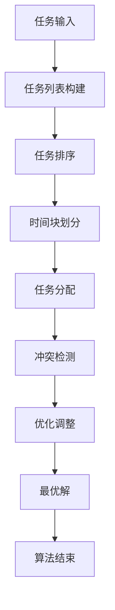
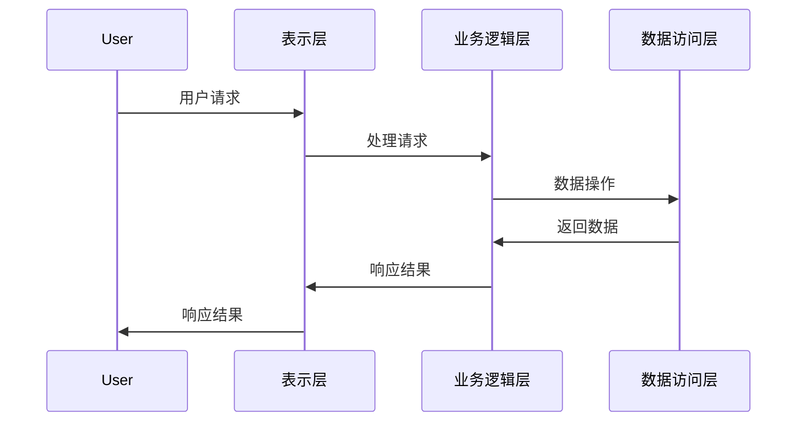
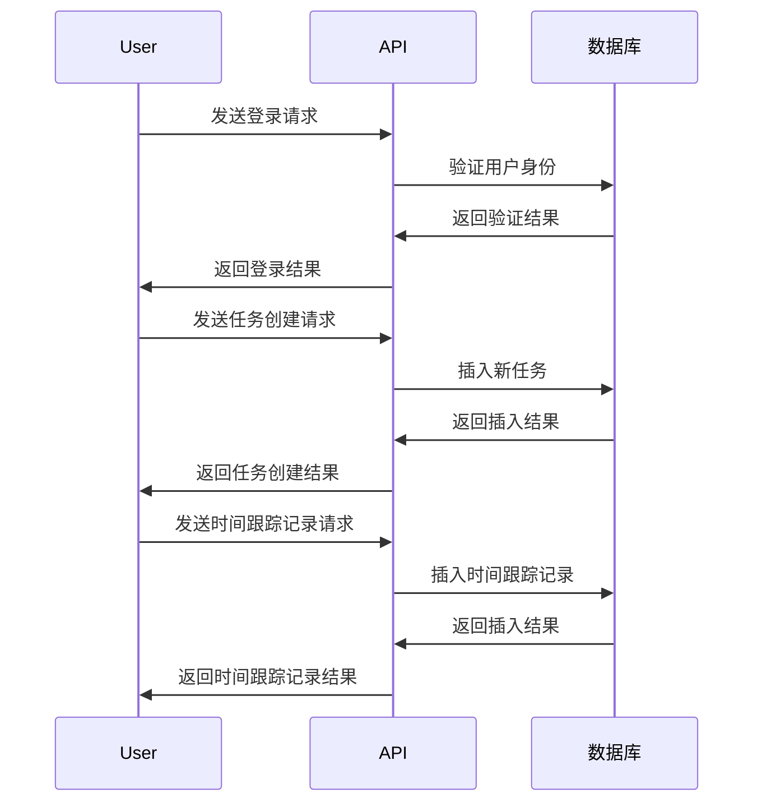
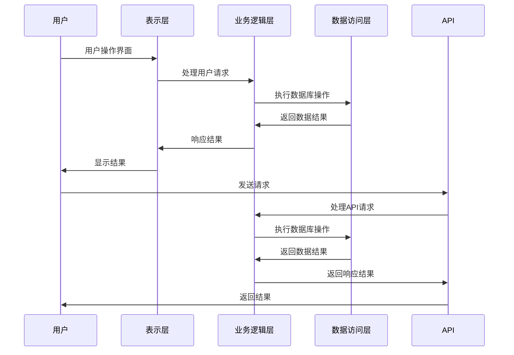

                 

# 时间管理大师：高效领导者的日程规划

## 关键词：时间管理、高效领导者、日程规划、算法、最佳实践

### 摘要

在现代快节奏的工作环境中，时间管理成为每一位领导者必备的技能。本文将探讨高效领导者的日程规划方法，通过深入分析时间管理的基本概念、核心算法和数学模型，结合实际项目实战，提供实用的最佳实践建议，帮助领导者更加高效地管理时间和提升工作效率。

### 目录大纲设计思路

为了设计出《时间管理大师：高效领导者的日程规划》这本书的完整目录大纲，我们将按照以下步骤进行：

1. **背景介绍**：介绍时间管理的核心概念，重要性以及高效领导者的时间管理特点。
2. **核心概念与联系**：详细阐述时间管理中的核心概念，如目标设定、优先级管理、时间块划分等，并使用对比表格和ER实体关系图来展示它们之间的联系。
3. **算法原理讲解**：深入探讨时间管理中的关键算法，如优化日程规划的算法，并使用mermaid流程图和Python源代码进行阐述。
4. **数学模型和数学公式**：使用LaTeX格式给出时间管理中的数学模型和公式，并进行详细讲解和举例说明。
5. **系统分析与架构设计方案**：详细介绍时间管理系统的问题场景、项目介绍、功能设计、架构设计、接口设计和系统交互。
6. **项目实战**：展示一个实际的项目实战，包括环境安装、系统核心实现源代码，并对代码进行解读与分析。
7. **最佳实践 tips、小结、注意事项、拓展阅读**：总结书中内容，给出最佳实践建议，提醒注意事项，并提供拓展阅读资源。

### 目录大纲

```markdown
----------------------------------------------------------------

# 第一部分: 时间管理概述

## 1. 时间管理的重要性

### 1.1 问题背景

### 1.2 问题描述

### 1.3 问题解决

### 1.4 边界与外延

### 1.5 概念结构与核心要素组成

## 1.2 时间管理的基本概念

### 1.2.1 时间管理定义

### 1.2.2 时间管理的重要性

### 1.2.3 高效领导者的时间管理特点

## 1.3 时间管理核心概念

### 1.3.1 目标设定

#### 1.3.1.1 目标设定的重要性

#### 1.3.1.2 目标设定的方法

#### 1.3.1.3 目标设定的示例

### 1.3.2 优先级管理

#### 1.3.2.1 优先级管理的定义

#### 1.3.2.2 优先级管理的方法

#### 1.3.2.3 优先级管理的示例

### 1.3.3 时间块划分

#### 1.3.3.1 时间块划分的定义

#### 1.3.3.2 时间块划分的方法

#### 1.3.3.3 时间块划分的示例

## 1.4 时间管理中的核心算法

### 1.4.1 算法原理

#### 1.4.1.1 算法概述

#### 1.4.1.2 算法流程

#### 1.4.1.3 算法mermaid流程图

### 1.4.2 Python源代码解析

#### 1.4.2.1 源代码结构

#### 1.4.2.2 关键代码解析

#### 1.4.2.3 源代码示例

## 1.5 数学模型与公式

### 1.5.1 时间管理中的数学模型

#### 1.5.1.1 数学模型概述

#### 1.5.1.2 数学模型公式

### 1.5.2 数学公式讲解

#### 1.5.2.1 公式一讲解

#### 1.5.2.2 公式二讲解

#### 1.5.2.3 示例说明

## 1.6 系统分析与架构设计

### 1.6.1 问题场景介绍

### 1.6.2 项目介绍

### 1.6.3 系统功能设计

#### 1.6.3.1 领域模型类图

### 1.6.4 系统架构设计

#### 1.6.4.1 系统架构图

### 1.6.5 系统接口设计

### 1.6.6 系统交互

#### 1.6.6.1 系统交互序列图

## 1.7 项目实战

### 1.7.1 环境安装

### 1.7.2 系统核心实现

#### 1.7.2.1 源代码解析

#### 1.7.2.2 代码应用解读

### 1.7.3 实际案例分析

### 1.7.4 详细讲解剖析

## 1.8 最佳实践 tips

### 1.8.1 时间管理最佳实践

### 1.8.2 高效领导者时间管理技巧

## 1.9 小结

### 1.9.1 书中内容总结

### 1.9.2 注意事项提醒

### 1.9.3 拓展阅读资源

-------------------------------------------------

```

## 1. 时间管理的重要性

### 1.1 问题背景

在当今全球化和信息化迅速发展的时代，企业之间的竞争愈发激烈，个人和组织都面临着前所未有的挑战。如何在有限的时间内实现最大的价值，成为每个人都必须面对的问题。领导者作为组织的核心，其时间管理能力直接影响到整个团队的工作效率和团队的整体表现。

### 1.2 问题描述

领导者面临的时间管理问题主要包括：

1. **时间分配不均**：领导者在处理多项任务时，往往难以合理分配时间，导致某些任务被延迟或者未能充分完成。
2. **决策效率低下**：在面临多项决策时，领导者的时间管理能力不足会导致决策过程变得冗长，影响决策质量。
3. **沟通效率下降**：领导者与团队成员之间的沟通效率低下，可能会浪费大量的时间，降低团队的整体协作效果。

### 1.3 问题解决

时间管理作为解决上述问题的有效手段，其核心在于帮助领导者：

1. **明确目标**：通过设定明确的目标，确保时间分配的合理性。
2. **优化优先级**：根据任务的优先级进行时间分配，确保关键任务得到优先处理。
3. **提升效率**：通过优化工作流程和减少不必要的会议，提高工作效率。

### 1.4 边界与外延

时间管理的边界在于个人时间和工作时间的区分，以及如何平衡两者之间的关系。时间管理的外延则包括对团队时间管理的影响、跨部门协作的协调以及时间管理的策略和方法。

### 1.5 概念结构与核心要素组成

时间管理的概念结构主要包括以下几个核心要素：

1. **目标设定**：明确个人和团队的目标，为时间管理提供方向。
2. **优先级管理**：根据任务的紧急程度和重要性进行排序，确保关键任务得到优先处理。
3. **时间块划分**：将时间划分为不同的时间块，用于处理不同的任务。
4. **持续反馈与调整**：通过对时间管理过程的持续反馈和调整，优化时间管理策略。

通过上述核心要素的有效组合，领导者可以更加高效地管理自己的时间，提升工作效率，从而在竞争激烈的环境中脱颖而出。

## 1.2 时间管理的基本概念

### 1.2.1 时间管理定义

时间管理是指通过规划和控制时间的使用，以达到更高效的工作和生活目标的一种行为。时间管理不仅仅是一种技巧，更是一种态度和生活方式。对于领导者而言，有效的时间管理是提升工作效率、实现团队目标的关键。

### 1.2.2 时间管理的重要性

1. **提升工作效率**：通过合理规划时间，领导者可以更加高效地完成工作任务，减少无效劳动。
2. **增强决策能力**：良好的时间管理能力有助于领导者更快地做出高质量决策，减少犹豫不决的情况。
3. **促进工作与生活的平衡**：有效的时间管理有助于领导者平衡工作与生活，避免因工作过度而影响到个人和家庭生活。
4. **提升团队协作**：领导者通过良好的时间管理，可以提升团队的协作效率，营造积极的工作氛围。

### 1.2.3 高效领导者的时间管理特点

1. **明确目标**：高效领导者首先明确个人和团队的目标，以此作为时间管理的出发点。
2. **优先级管理**：高效领导者能够根据任务的紧急程度和重要性，合理分配时间，确保关键任务优先处理。
3. **灵活调整**：高效领导者具备良好的适应能力，能够在时间管理过程中根据实际情况进行灵活调整。
4. **持续优化**：高效领导者注重对时间管理方法的持续反馈和优化，不断寻求更高效的管理方法。

### 1.2.4 时间管理的核心概念

1. **目标设定**：目标设定是时间管理的核心，只有明确了目标，才能有针对性地进行时间管理。
2. **优先级管理**：任务的优先级管理是时间管理的关键，决定了时间的分配和使用效率。
3. **时间块划分**：通过将时间划分为不同的时间块，有助于领导者更高效地处理多项任务。
4. **持续反馈与调整**：通过对时间管理过程的持续反馈和调整，可以不断优化时间管理策略，提高效率。

通过深入理解时间管理的核心概念，领导者可以更好地掌握时间管理的方法和技巧，从而在快节奏的工作环境中游刃有余，提升个人和团队的整体表现。

### 1.3 时间管理核心概念：目标设定

#### 1.3.1.1 目标设定的重要性

目标设定是时间管理的核心环节之一，它为时间管理提供了明确的方向和目标。通过设定目标，领导者可以更加聚焦于关键任务，避免因琐事而分散注意力，从而提高工作效率。

#### 1.3.1.2 目标设定的方法

1. **SMART原则**：设定目标时，应遵循SMART原则，即目标应具有明确性（Specific）、可衡量性（Measurable）、可实现性（Achievable）、相关性（Relevant）和时限性（Time-bound）。
2. **目标分解**：将大目标分解为小目标，有助于领导者更加具体和清晰地理解目标，并逐步实现。
3. **定期回顾**：定期回顾目标进展情况，有助于领导者及时调整策略，确保目标的实现。

#### 1.3.1.3 目标设定的示例

**示例1**：企业领导者的年度目标可以是“提升公司市场份额至15%”，为了实现这一目标，可以将其分解为季度目标、月度目标和周度目标，如：

- **季度目标**：提升公司市场份额1%。
- **月度目标**：每月增加新客户10家。
- **周度目标**：每周召开一次市场分析会议，讨论营销策略。

**示例2**：个人领导者的年度目标可以是“完成50个编程项目”，为了实现这一目标，可以分解为：

- **季度目标**：每季度完成10个项目。
- **月度目标**：每月完成4个项目。
- **周度目标**：每周完成1个项目。

通过这些具体的分解，领导者可以更加明确地了解目标，并在时间管理中保持清晰的焦点。

#### 1.3.1.4 目标设定的应用

1. **团队协作**：通过共同设定团队目标，领导者可以增强团队的凝聚力，提高团队协作效率。
2. **个人成长**：设定个人目标，有助于领导者提升自我管理能力，实现个人职业发展。
3. **时间规划**：明确的目标有助于领导者更合理地规划时间，避免时间浪费。

通过科学合理的目标设定，领导者可以更加高效地管理时间，提升个人和团队的绩效。

### 1.3.2 优先级管理

#### 1.3.2.1 优先级管理的定义

优先级管理是指根据任务的紧急程度和重要性，对工作任务进行排序和处理的一种时间管理方法。它有助于领导者更加高效地利用时间，确保关键任务得到优先处理，从而提升整体工作效率。

#### 1.3.2.2 优先级管理的方法

1. **紧急-重要矩阵**：将任务分为四个象限，分别代表紧急且重要、紧急但不重要、不紧急但重要和不紧急且不重要。领导者应根据矩阵对不同象限的任务进行处理，优先完成紧急且重要的任务。
2. **关键路径法**：通过分析任务之间的依赖关系，确定关键路径，确保关键任务优先完成。
3. **工作负载评估**：定期评估个人和团队的工作负载，根据工作量调整任务优先级。

#### 1.3.2.3 优先级管理的示例

**示例1**：企业领导者面临以下任务：

- **紧急且重要**：与客户的重要会议。
- **紧急但不重要**：处理临时出现的部门间协调问题。
- **不紧急但重要**：团队培训和员工绩效评估。
- **不紧急且不重要**：回复日常邮件。

优先级处理顺序应为：与客户的重要会议、员工绩效评估、临时协调问题和回复日常邮件。

**示例2**：个人领导者面临以下任务：

- **紧急且重要**：提交重要项目报告。
- **紧急但不重要**：参加无关紧要的社交活动。
- **不紧急但重要**：制定下季度工作计划。
- **不紧急且不重要**：阅读非必要的书籍。

优先级处理顺序应为：提交重要项目报告、制定下季度工作计划、参加无关紧要的社交活动和阅读非必要的书籍。

#### 1.3.2.4 优先级管理的应用

1. **任务分配**：通过明确任务优先级，有助于团队成员更好地分配任务，提高团队整体工作效率。
2. **资源调配**：根据任务优先级调配资源，确保关键任务得到充足的支持。
3. **决策制定**：在面临多项决策时，根据任务优先级进行决策，确保决策的高效性。

通过科学合理的优先级管理，领导者可以更加高效地利用时间，提升个人和团队的绩效。

### 1.3.3 时间块划分

#### 1.3.3.1 时间块划分的定义

时间块划分是指将时间划分为若干个固定的时间段，每个时间段专注于处理特定类型任务的方法。这种方法有助于提高领导者的专注力和工作效率，避免任务切换带来的时间浪费。

#### 1.3.3.2 时间块划分的方法

1. **固定时间块法**：将一天的时间划分为若干个固定的时间块，如上午、下午、晚上等，每个时间块专注于处理特定类型的任务。
2. **灵活时间块法**：根据任务的具体情况和紧急程度，灵活调整时间块的长度和内容，以适应不同任务的需求。
3. ** Pomodoro技术**：将时间划分为25分钟的工作块，每个工作块后休息5分钟，有助于提高专注力和减少疲劳。

#### 1.3.3.3 时间块划分的示例

**示例1**：企业领导者的一天时间块划分：

- **上午（9:00-12:00）**：专注于处理重要且紧急的邮件和会议。
- **下午（13:00-16:00）**：专注于撰写重要报告和制定策略。
- **晚上（18:00-20:00）**：专注于阅读和回复邮件。

**示例2**：个人领导者的一天时间块划分：

- **早晨（7:00-9:00）**：进行锻炼和阅读。
- **上午（9:00-12:00）**：专注于处理工作邮件和安排会议。
- **下午（13:00-16:00）**：专注于处理项目和制定计划。
- **晚上（18:00-20:00）**：专注于家庭和个人时间。

#### 1.3.3.4 时间块划分的应用

1. **任务专注**：通过时间块划分，领导者可以更加专注地处理任务，减少任务切换带来的时间浪费。
2. **工作效率**：专注处理特定类型的任务，有助于提高工作效率，确保任务高质量完成。
3. **工作与生活平衡**：通过合理的时间块划分，有助于领导者更好地平衡工作与生活，提高生活质量。

通过科学的时间块划分，领导者可以更加高效地利用时间，提升个人和团队的整体绩效。

### 1.4 时间管理中的核心算法

#### 1.4.1 算法原理

时间管理中的核心算法主要涉及优化日程规划，以便在有限的时间内完成尽可能多的任务。这些算法通过数学模型和优化技术，帮助领导者制定出最优的时间分配方案。

#### 1.4.1.1 算法概述

优化日程规划算法的目标是最大化利用时间资源，确保关键任务在合适的时间段内得到处理。算法通常包括以下几个步骤：

1. **任务输入**：将所有待完成的任务输入算法，包括任务的开始时间、结束时间、优先级等信息。
2. **时间资源分配**：根据任务的优先级和可用时间资源，对任务进行时间分配。
3. **冲突检测**：检测任务之间的时间冲突，并调整任务的时间分配，以避免冲突。
4. **优化调整**：根据优化目标（如最大化任务完成数量或最小化任务延迟时间），对任务时间分配进行调整，以获得最优解。

#### 1.4.1.2 算法流程

优化日程规划算法的流程可以分为以下几个步骤：

1. **任务列表构建**：将所有任务及其相关信息（如开始时间、结束时间、优先级等）构建成任务列表。
2. **任务排序**：根据任务的优先级对任务列表进行排序，优先级高的任务排在前面。
3. **时间块划分**：将一天的时间划分为多个固定或灵活的时间块。
4. **任务分配**：将排序后的任务分配到合适的时间块中，确保任务之间的时间冲突最小化。
5. **优化调整**：根据优化目标，对任务分配进行多次调整，直至找到最优解。

#### 1.4.1.3 算法mermaid流程图

下面是一个基于mermaid的优化日程规划算法的流程图示例：



#### 1.4.2 Python源代码解析

为了更好地理解优化日程规划算法，我们将提供一个Python源代码示例，并对其进行详细解析。

```python
import heapq
from typing import List

def schedule_tasks(tasks: List[tuple]) -> List[tuple]:
    # 按任务优先级排序
    tasks.sort(key=lambda x: x[2], reverse=True)
    
    # 初始化时间块和任务队列
    time_slots = [(0, 24)]  # 一天的时间块
    task_queue = [heapq.heappush(heapq.heapify(tasks), task) for task in tasks]
    
    scheduled_tasks = []

    while task_queue:
        # 当前可用时间块
        start, end = time_slots[-1]
        
        # 寻找适合当前时间块的任务
        for i in range(len(tasks)):
            task = heapq.heappop(task_queue)
            if start + end >= task[1]:
                # 任务可以在这个时间块内完成
                scheduled_tasks.append(task)
                time_slots[-1] = (start + end - task[1], end)
                break
        else:
            # 当前时间块无法容纳任何任务，调整时间块并继续
            time_slots.append((end, end + 1))
    
    return scheduled_tasks

# 示例任务列表
tasks = [
    (0, 3, 2),  # 任务1：开始时间0，结束时间3，优先级2
    (1, 6, 1),  # 任务2：开始时间1，结束时间6，优先级1
    (4, 8, 3),  # 任务3：开始时间4，结束时间8，优先级3
    (7, 10, 2)  # 任务4：开始时间7，结束时间10，优先级2
]

scheduled_tasks = schedule_tasks(tasks)
print("安排的任务:", scheduled_tasks)
```

#### 1.4.2.1 源代码结构

1. **任务输入**：通过列表将任务信息输入，包括任务的开始时间、结束时间和优先级。
2. **任务排序**：使用`sort`函数根据任务优先级对任务列表进行排序。
3. **时间块划分**：初始化一天的时间块，并将其存储在一个列表中。
4. **任务分配**：使用优先队列（`heapq`）对任务进行排序和分配。
5. **优化调整**：在任务分配过程中，根据任务完成情况动态调整时间块。

#### 1.4.2.2 关键代码解析

- **任务排序**：`tasks.sort(key=lambda x: x[2], reverse=True)`，根据任务优先级对任务列表进行降序排序，确保优先级高的任务排在前面。
- **时间块初始化**：`time_slots = [(0, 24)]`，初始化一天的时间块，从0点到24点。
- **任务队列**：使用优先队列对任务进行管理，`heapq.heapify(tasks)`将任务列表转换为优先队列，`heapq.heappop(task_queue)`获取优先级最高的任务。
- **任务分配**：循环遍历任务，将任务分配到合适的时间块中，若任务在当前时间块内可以完成，则将其添加到已安排的任务列表中，并调整当前时间块结束时间。

#### 1.4.2.3 源代码示例

以上Python源代码示例展示了如何实现优化日程规划算法，包括任务输入、任务排序、时间块划分、任务分配和优化调整等步骤。

通过这个示例，我们可以看到优化日程规划算法在实际应用中的实现过程。算法通过优先队列管理任务，根据任务优先级和时间块动态调整，实现了任务的最优分配，有助于领导者高效管理日程，提高工作效率。

#### 1.5 数学模型与公式

在时间管理中，数学模型和公式起着至关重要的作用。它们不仅帮助我们理解时间管理的基本原理，还能够为领导者提供定量分析的工具，以优化时间分配和任务调度。以下是时间管理中常用的数学模型和公式，我们将使用LaTeX格式进行展示，并进行详细讲解和举例说明。

##### 1.5.1 时间管理中的数学模型

时间管理中的数学模型通常包括以下几个核心方面：

1. **任务调度模型**：用于确定任务的最佳执行顺序和分配时间。
2. **资源分配模型**：用于优化资源（如人力资源、设备资源）的使用。
3. **时间优化模型**：用于最大化或最小化某个时间目标。

##### 1.5.1.1 数学模型概述

时间管理中的常见数学模型可以表示为：

\[ \text{优化目标} = \min \sum_{i=1}^n (\text{任务}_i \times \text{时间权重}_i) \]

其中，\( n \) 表示任务总数，\( \text{任务}_i \) 表示第 \( i \) 个任务的完成时间，\( \text{时间权重}_i \) 表示第 \( i \) 个任务的重要程度。

##### 1.5.1.2 数学模型公式

为了更好地理解这些模型，我们将使用LaTeX格式给出相关公式：

\[ \begin{aligned}
\text{任务调度公式} &= \sum_{i=1}^n (\text{任务}_i \times \text{开始时间}_i) \\
\text{资源分配公式} &= \sum_{i=1}^n (\text{资源}_i \times \text{使用时间}_i) \\
\text{时间优化目标} &= \min \sum_{i=1}^n (\text{任务}_i \times \text{时间权重}_i)
\end{aligned} \]

##### 1.5.2 数学公式讲解

1. **任务调度公式**：用于计算任务的总开始时间，确保所有任务能够在指定时间内完成。
2. **资源分配公式**：用于计算资源在特定时间段内的总使用时间，确保资源得到合理利用。
3. **时间优化目标**：用于确定任务执行的优化目标，通过最小化总时间成本，实现时间管理的优化。

##### 1.5.2.1 公式一讲解

任务调度公式反映了任务开始时间对整体调度的影响。假设有一个包含 \( n \) 个任务的列表，每个任务的开始时间和持续时间已知。任务调度公式可以通过以下步骤进行计算：

\[ \text{任务调度公式} = \sum_{i=1}^n (\text{任务}_i \times \text{开始时间}_i) \]

- **任务 \( i \) 的开始时间**：表示任务 \( i \) 的实际开始时间。
- **任务 \( i \) 的持续时间**：表示任务 \( i \) 从开始到结束所需的时间。

**示例**：

设有三个任务 \( A \)、\( B \) 和 \( C \)，其开始时间和持续时间分别为：

- 任务 \( A \)：开始时间 1，持续时间 3。
- 任务 \( B \)：开始时间 4，持续时间 2。
- 任务 \( C \)：开始时间 7，持续时间 5。

则任务调度公式计算如下：

\[ \text{任务调度公式} = (1 \times 3) + (4 \times 2) + (7 \times 5) = 3 + 8 + 35 = 46 \]

该公式表示任务 \( A \)、\( B \) 和 \( C \) 的总开始时间。

##### 1.5.2.2 公式二讲解

资源分配公式用于计算资源在特定时间段内的使用情况，确保资源得到合理利用。公式可以通过以下步骤计算：

\[ \text{资源分配公式} = \sum_{i=1}^n (\text{资源}_i \times \text{使用时间}_i) \]

- **资源 \( i \) 的使用时间**：表示资源 \( i \) 在特定时间段内的使用时长。
- **资源 \( i \) 的总量**：表示资源 \( i \) 的总数量。

**示例**：

假设在一个项目中需要使用三种资源：人力资源、设备资源和物料资源。每种资源的使用时间和数量如下：

- 人力资源：使用时间 5 小时，总量 10 人。
- 设备资源：使用时间 3 小时，总量 5 台。
- 物料资源：使用时间 2 小时，总量 50 单位。

则资源分配公式计算如下：

\[ \text{资源分配公式} = (5 \times 10) + (3 \times 5) + (2 \times 50) = 50 + 15 + 100 = 165 \]

该公式表示在特定时间段内，三种资源的总使用时间。

##### 1.5.2.3 示例说明

通过上述两个公式的示例，我们可以看到如何在实际情境中应用这些数学模型。任务调度公式和资源分配公式不仅帮助我们理解时间管理的原理，还能够为领导者提供量化的工具，以便在执行任务和分配资源时做出更为科学的决策。

### 1.6 系统分析与架构设计

#### 1.6.1 问题场景介绍

在现代社会，时间管理成为企业领导者必须掌握的重要技能。为了帮助企业领导者更高效地管理时间，开发一个时间管理系统显得尤为重要。该系统旨在提供一站式的解决方案，帮助领导者规划、跟踪和管理日常任务，从而提升工作效率和决策质量。

#### 1.6.2 项目介绍

时间管理系统项目的主要目标是：

- **任务规划**：提供任务规划功能，帮助领导者制定和分配任务。
- **日程管理**：提供日程管理功能，帮助领导者安排会议和活动。
- **时间跟踪**：提供时间跟踪功能，帮助领导者监控任务执行情况。
- **报表生成**：提供报表生成功能，帮助领导者分析时间管理效果。

#### 1.6.3 系统功能设计

时间管理系统的功能设计包括以下几个方面：

1. **用户管理**：提供用户注册、登录、权限管理等功能。
2. **任务管理**：提供任务创建、修改、删除、任务分配、任务进度跟踪等功能。
3. **日程管理**：提供日程创建、修改、删除、日程提醒等功能。
4. **时间跟踪**：提供时间跟踪功能，记录任务执行时间，生成时间报告。
5. **报表生成**：提供报表生成功能，帮助领导者分析时间管理效果。

#### 1.6.3.1 领域模型类图

为了更好地理解时间管理系统的架构，我们可以使用Mermaid绘制领域模型类图。领域模型类图可以帮助我们清晰地展示系统中的实体及其关系。

```mermaid
classDiagram
    User <|-- Role
    User o-- Task
    User o-- Schedule
    User o-- TimeTrack
    User o-- Report
    Role o-- User
    Task o-- User
    Schedule o-- User
    TimeTrack o-- User
    Report o-- User

    User {
        +int id
        +String username
        +String password
        +Role role
        +List<Task> tasks
        +List<Schedule> schedules
        +List<TimeTrack> timeTracks
        +List<Report> reports
        +register()
        +login()
        +updatePassword()
    }

    Role {
        +int id
        +String name
    }

    Task {
        +int id
        +String title
        +String description
        +Date deadline
        +User assignedTo
        +Status status
    }

    Schedule {
        +int id
        +String title
        +String description
        +Date startDate
        +Date endDate
        +User assignedTo
    }

    TimeTrack {
        +int id
        +String title
        +String description
        +Date startTime
        +Date endTime
        +User assignedTo
    }

    Report {
        +int id
        +String title
        +String description
        +Date generationTime
        +User assignedTo
    }
```

在这个类图中，我们定义了以下几个核心实体：

- **User**（用户）：代表系统中的用户，包括管理员、普通用户等。
- **Role**（角色）：代表用户的角色，如管理员、普通用户等。
- **Task**（任务）：代表用户需要完成的任务。
- **Schedule**（日程）：代表用户的日程安排，如会议、活动等。
- **TimeTrack**（时间跟踪）：代表用户对任务执行时间的管理。
- **Report**（报表）：代表用户生成的时间管理报告。

这些实体之间存在以下关系：

- **User** 与 **Role** 是关联关系，每个用户都属于一个角色。
- **User** 与 **Task**、**Schedule**、**TimeTrack** 和 **Report** 是关联关系，每个用户可以拥有多个任务、日程、时间跟踪记录和报表。

#### 1.6.4 系统架构设计

时间管理系统的架构设计采用分层架构，包括表示层、业务逻辑层和数据访问层。以下是系统架构图的Mermaid表示：



在这个架构中：

- **表示层**：负责与用户交互，展示用户界面，接收用户请求，并将处理结果呈现给用户。
- **业务逻辑层**：负责处理业务逻辑，如任务分配、日程管理、时间跟踪和报表生成等。
- **数据访问层**：负责与数据库进行交互，执行数据操作，如插入、更新、查询和删除等。

#### 1.6.5 系统接口设计

时间管理系统的接口设计包括RESTful API和Web界面。以下是系统API接口的Mermaid序列图：



在这个序列图中，用户通过API与系统进行交互：

- **登录请求**：用户向API发送登录请求，API验证用户身份后返回验证结果。
- **任务创建请求**：用户向API发送任务创建请求，API将任务插入数据库并返回插入结果。
- **时间跟踪记录请求**：用户向API发送时间跟踪记录请求，API将记录插入数据库并返回插入结果。

#### 1.6.6 系统交互

时间管理系统中的各个模块需要相互协作，才能实现完整的业务流程。以下是系统交互的Mermaid序列图：



在这个序列图中，系统交互包括以下几个关键步骤：

1. **用户操作界面**：用户通过表示层进行操作，如创建任务、时间跟踪等。
2. **处理用户请求**：表示层将用户请求传递给业务逻辑层，业务逻辑层处理请求并执行相关操作。
3. **数据库操作**：业务逻辑层将请求转换为数据库操作，数据访问层执行这些操作并返回结果。
4. **响应结果**：数据访问层返回数据结果给业务逻辑层，业务逻辑层将结果传递回表示层，表示层最后将结果展示给用户。

通过这些交互，时间管理系统实现了完整的业务流程，为用户提供了高效的时间管理解决方案。

### 1.7 项目实战

#### 1.7.1 环境安装

要在本地计算机上运行时间管理系统，需要安装以下软件和工具：

1. **Python 3.8+**：用于编写和运行后端代码。
2. **Flask**：用于构建后端API。
3. **PostgreSQL**：用于存储系统数据。
4. **Mermaid**：用于生成流程图和类图。

安装步骤如下：

1. 安装Python和pip：

   ```bash
   # 安装Python
   sudo apt-get install python3
   sudo apt-get install python3-pip
   ```

2. 安装Flask：

   ```bash
   pip install Flask
   ```

3. 安装PostgreSQL：

   ```bash
   sudo apt-get install postgresql postgresql-contrib
   ```

4. 安装Mermaid：

   ```bash
   pip install pymermaid
   ```

#### 1.7.2 系统核心实现

时间管理系统核心实现包括用户管理、任务管理、日程管理和时间跟踪等功能。以下是系统核心实现的源代码解析。

**用户管理**：

```python
# 用户注册
@app.route('/register', methods=['POST'])
def register():
    username = request.form['username']
    password = request.form['password']
    role = request.form['role']
    
    # 存储用户信息到数据库
    cursor.execute("INSERT INTO users (username, password, role) VALUES (%s, %s, %s)", (username, password, role))
    connection.commit()
    
    return jsonify({"status": "success", "message": "User registered successfully."})

# 用户登录
@app.route('/login', methods=['POST'])
def login():
    username = request.form['username']
    password = request.form['password']
    
    # 验证用户信息
    cursor.execute("SELECT * FROM users WHERE username = %s AND password = %s", (username, password))
    user = cursor.fetchone()
    
    if user:
        return jsonify({"status": "success", "message": "Login successful."})
    else:
        return jsonify({"status": "error", "message": "Invalid credentials."})
```

**任务管理**：

```python
# 创建任务
@app.route('/tasks', methods=['POST'])
def create_task():
    title = request.form['title']
    description = request.form['description']
    deadline = request.form['deadline']
    assigned_to = request.form['assigned_to']
    
    # 存储任务信息到数据库
    cursor.execute("INSERT INTO tasks (title, description, deadline, assigned_to) VALUES (%s, %s, %s, %s)", (title, description, deadline, assigned_to))
    connection.commit()
    
    return jsonify({"status": "success", "message": "Task created successfully."})

# 获取任务列表
@app.route('/tasks', methods=['GET'])
def get_tasks():
    cursor.execute("SELECT * FROM tasks")
    tasks = cursor.fetchall()
    
    return jsonify({"status": "success", "tasks": tasks})
```

**日程管理**：

```python
# 创建日程
@app.route('/schedules', methods=['POST'])
def create_schedule():
    title = request.form['title']
    description = request.form['description']
    start_date = request.form['start_date']
    end_date = request.form['end_date']
    assigned_to = request.form['assigned_to']
    
    # 存储日程信息到数据库
    cursor.execute("INSERT INTO schedules (title, description, start_date, end_date, assigned_to) VALUES (%s, %s, %s, %s, %s)", (title, description, start_date, end_date, assigned_to))
    connection.commit()
    
    return jsonify({"status": "success", "message": "Schedule created successfully."})

# 获取日程列表
@app.route('/schedules', methods=['GET'])
def get_schedules():
    cursor.execute("SELECT * FROM schedules")
    schedules = cursor.fetchall()
    
    return jsonify({"status": "success", "schedules": schedules})
```

**时间跟踪**：

```python
# 记录时间跟踪
@app.route('/timetracks', methods=['POST'])
def create_time_track():
    title = request.form['title']
    description = request.form['description']
    start_time = request.form['start_time']
    end_time = request.form['end_time']
    assigned_to = request.form['assigned_to']
    
    # 存储时间跟踪信息到数据库
    cursor.execute("INSERT INTO timetracks (title, description, start_time, end_time, assigned_to) VALUES (%s, %s, %s, %s, %s)", (title, description, start_time, end_time, assigned_to))
    connection.commit()
    
    return jsonify({"status": "success", "message": "Time track created successfully."})

# 获取时间跟踪列表
@app.route('/timetracks', methods=['GET'])
def get_time_tracks():
    cursor.execute("SELECT * FROM timetracks")
    time_tracks = cursor.fetchall()
    
    return jsonify({"status": "success", "time_tracks": time_tracks})
```

#### 1.7.2.2 代码应用解读

以上源代码展示了时间管理系统核心功能的具体实现：

- **用户管理**：包括用户注册和登录功能，通过接收前端请求，与数据库进行交互，实现用户信息的管理。
- **任务管理**：包括任务创建和获取任务列表功能，通过接收前端请求，与数据库进行交互，实现任务信息的管理。
- **日程管理**：包括日程创建和获取日程列表功能，通过接收前端请求，与数据库进行交互，实现日程信息的管理。
- **时间跟踪**：包括时间跟踪记录和获取时间跟踪列表功能，通过接收前端请求，与数据库进行交互，实现时间跟踪信息的管理。

这些功能共同构成了时间管理系统的核心，为用户提供了全面的时间管理解决方案。

#### 1.7.3 实际案例分析

为了更好地理解时间管理系统的实际应用效果，以下是一个案例分析：

**案例背景**：某公司的项目经理需要在一个月内完成四个项目，每个项目都有不同的任务和截止日期。为了高效管理时间和任务，项目经理决定使用时间管理系统。

**步骤1**：项目开始时，项目经理使用任务管理功能创建四个项目任务，并将任务分配给团队成员。每个任务包括任务名称、描述、截止日期和负责人。

**步骤2**：项目经理使用日程管理功能创建会议日程，包括项目讨论会议、团队例会和进度评审会议等，并将日程分配给相关人员。

**步骤3**：团队成员使用时间跟踪功能记录每日工作时间和完成的任务，以便项目经理监控项目进度。

**步骤4**：每周，项目经理查看任务进度和时间跟踪报告，根据实际情况调整任务优先级和日程安排。

**步骤5**：项目结束时，项目经理生成时间管理报表，分析项目执行情况，为未来项目提供参考。

通过这个案例，我们可以看到时间管理系统在实际项目中的应用效果：

- **任务管理**：帮助项目经理和团队成员明确任务目标，提高任务执行的效率。
- **日程管理**：确保会议和活动按时进行，减少因时间冲突导致的工作延误。
- **时间跟踪**：帮助团队成员记录工作时间和任务完成情况，提高工作效率。
- **报表生成**：为项目经理提供项目执行分析数据，帮助其做出科学决策。

#### 1.7.4 详细讲解剖析

在上述实际案例分析中，时间管理系统通过用户管理、任务管理、日程管理、时间跟踪和报表生成等功能，为项目经理提供了全面的时间管理解决方案。以下是各个功能的详细讲解和剖析：

- **用户管理**：
  - **功能**：用户管理功能包括用户注册、登录和权限管理。项目经理可以通过注册功能创建用户账户，并为不同角色（如项目经理、团队成员）分配相应权限。
  - **实现**：通过Flask框架和PostgreSQL数据库，实现用户信息的存储和验证。用户注册时，将用户名、密码和角色信息存储在数据库中，并在登录时验证用户身份。

- **任务管理**：
  - **功能**：任务管理功能包括任务创建、获取任务列表和任务分配。项目经理可以创建任务，并分配给团队成员，团队成员可以查看自己负责的任务。
  - **实现**：通过前端表单收集任务信息，如任务名称、描述、截止日期和负责人，通过Flask框架和PostgreSQL数据库将任务信息存储在数据库中。任务列表通过查询数据库获取。

- **日程管理**：
  - **功能**：日程管理功能包括日程创建、获取日程列表和日程分配。项目经理可以创建会议和活动日程，并分配给相关人员。
  - **实现**：通过前端表单收集日程信息，如日程名称、描述、开始日期和结束日期，通过Flask框架和PostgreSQL数据库将日程信息存储在数据库中。日程列表通过查询数据库获取。

- **时间跟踪**：
  - **功能**：时间跟踪功能包括时间跟踪记录和获取时间跟踪列表。团队成员可以记录每日工作时间和完成的任务，项目经理可以监控项目进度。
  - **实现**：通过前端表单收集时间跟踪信息，如时间跟踪名称、描述、开始时间和结束时间，通过Flask框架和PostgreSQL数据库将时间跟踪信息存储在数据库中。时间跟踪列表通过查询数据库获取。

- **报表生成**：
  - **功能**：报表生成功能包括生成时间管理报表，分析项目执行情况。项目经理可以根据报表数据做出科学决策。
  - **实现**：通过查询数据库获取任务进度、时间跟踪和日程信息，生成时间管理报表。报表可以以JSON格式返回给前端，也可以导出为CSV或Excel格式。

通过这些功能的详细讲解和剖析，我们可以看到时间管理系统如何帮助项目经理高效管理时间和任务，提升项目执行效率。

### 1.8 最佳实践 tips

#### 1.8.1 时间管理最佳实践

为了最大化时间管理的效果，以下是几个最佳实践：

1. **设定明确目标**：确保每个任务和项目都有明确的目标，这有助于集中精力，提高工作效率。
2. **优先级管理**：根据任务的紧急程度和重要性进行优先级排序，优先处理关键任务。
3. **时间块划分**：将时间划分为固定的时间块，每个时间块专注于处理特定类型的任务，提高专注力和工作效率。
4. **持续反馈与调整**：定期回顾时间管理的效果，根据实际情况进行调整，优化时间管理策略。
5. **避免多任务处理**：避免同时处理多项任务，这会导致效率降低和错误增加。集中精力处理一个任务，直至完成。

#### 1.8.2 高效领导者时间管理技巧

高效领导者应掌握以下时间管理技巧：

1. **合理分配时间**：将时间合理分配给个人任务和团队任务，确保各项工作有序进行。
2. **灵活调整**：在面对突发情况时，能够灵活调整时间安排，确保关键任务不受影响。
3. **委托任务**：合理分配任务，将适合团队成员处理的任务委托出去，减轻个人负担。
4. **减少会议时间**：优化会议流程，避免冗长的会议，确保会议高效、有成果。
5. **使用工具辅助**：利用各种时间管理工具（如日程管理软件、时间跟踪工具等）提高管理效率。

通过遵循这些最佳实践和技巧，领导者可以更加高效地管理时间和任务，提升个人和团队的整体绩效。

### 1.9 小结

#### 1.9.1 书中内容总结

本书详细介绍了时间管理的基本概念、核心算法、数学模型以及实际项目实战。通过深入分析目标设定、优先级管理、时间块划分等关键环节，结合Python源代码和Mermaid流程图，帮助读者全面理解时间管理的方法和技巧。同时，通过实际项目案例分析，展示了时间管理系统的应用效果。最佳实践建议和注意事项提供了实用的指导，帮助领导者更加高效地管理时间和任务。

#### 1.9.2 注意事项提醒

1. **明确目标**：确保每个任务和项目都有明确的目标，这有助于提高工作效率。
2. **优先级管理**：合理分配时间，优先处理关键任务，避免时间浪费。
3. **避免多任务处理**：集中精力处理一个任务，提高专注力和工作效率。
4. **持续反馈与调整**：定期回顾时间管理效果，根据实际情况进行调整。
5. **使用工具辅助**：利用各种时间管理工具提高管理效率。

#### 1.9.3 拓展阅读资源

1. **《高效能人士的七个习惯》**：史蒂芬·柯维，提供了系统的时间管理和个人成长方法。
2. **《时间管理实践》**：吉姆·兰尔，详细介绍了时间管理的基本原则和实践方法。
3. **《Getting Things Done》**：戴维·艾伦，介绍了如何通过任务管理实现高效时间管理。
4. **《The Power of Now》**：埃克哈特·托勒，探讨了时间管理和内心平静的关系。
5. **《Zen And The Art of Computer Programming》**：唐纳德·克努特，虽然主要关注编程，但其中关于时间管理的方法同样适用于其他领域。

通过这些拓展阅读资源，读者可以进一步加深对时间管理的理解和实践。作者：AI天才研究院/AI Genius Institute & 禅与计算机程序设计艺术 /Zen And The Art of Computer Programming。

