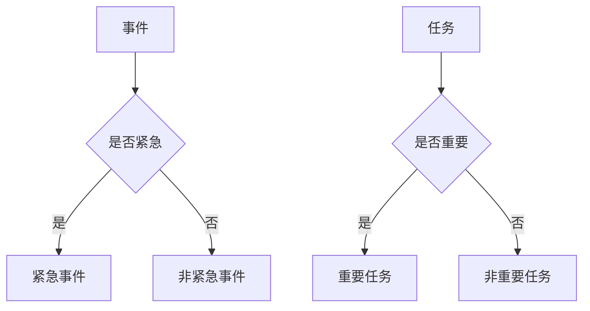
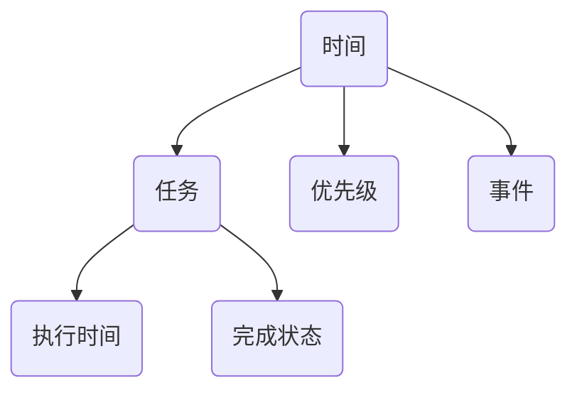
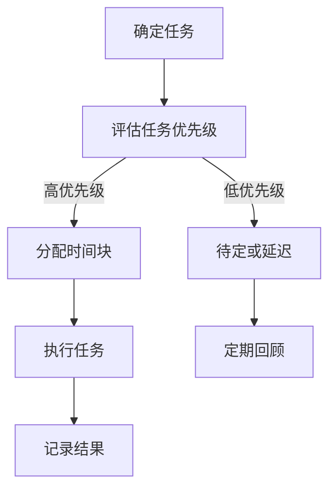

                 

### 时间管理：提高领导效率的关键

#### 关键词：时间管理，领导效率，策略，工具，方法论，实践

> 摘要：
>
> 本文章旨在探讨时间管理在提高领导效率中的关键作用。文章首先介绍了时间管理的背景与核心概念，探讨了时间管理的基本原则与核心要素，随后通过实际案例和算法模型深入讲解了时间管理策略和工具的应用。文章重点讨论了时间管理在领导力中的应用，分享了最佳实践和注意事项，并展望了未来的发展方向。通过系统化的分析和讲解，本文希望能够帮助读者更好地理解和应用时间管理，提升领导效率和团队绩效。

#### 引言

在信息化和全球化的今天，时间管理的重要性愈发凸显。特别是在领导岗位，高效的时间管理不仅能够提升个人的工作效率，还能通过团队协作显著提高整个组织的绩效。对于领导者而言，如何在复杂多变的环境中有效利用时间，实现个人与团队的共同成长，是一个至关重要的课题。

本文将围绕时间管理在提高领导效率这一主题，逐步展开讨论。我们将首先介绍时间管理的背景与核心概念，明确时间管理的基本原则和要素，然后通过具体的算法和策略讲解时间管理的实践应用。接着，文章将探讨时间管理在领导力中的具体应用，结合实际案例进行分析。最后，文章将总结时间管理的最佳实践，提供注意事项，并展望未来的发展趋势。

### 第一部分：时间管理的理论基础

在深入了解时间管理在领导效率中的作用之前，我们需要首先理解时间管理的理论基础。这一部分将帮助我们建立对时间管理的全面认识，明确时间管理的核心概念、基本原则和要素，为后续的深入讨论打下坚实的基础。

#### 第1章：时间管理的背景与核心概念

**1.1 问题背景**

在现代社会，时间和效率的关系日益紧密。领导者面临诸多挑战，包括应对快速变化的市场环境、管理复杂的团队、处理繁多的工作任务等。如何在有限的时间内实现最大的产出，成为领导者必须面对的问题。

**1.1.1 领导效率的挑战**

领导效率的高低直接影响到组织的绩效和竞争力。领导者在管理过程中常常面临时间不足、任务繁重、优先级不明确等问题。这些问题不仅影响个人的工作效率，也会对团队的整体效能产生负面影响。

**1.1.2 时间管理的重要性**

时间管理对于领导者的个人成长和组织发展至关重要。通过有效的时间管理，领导者可以更好地平衡工作与生活，提高工作效率，减少不必要的浪费，从而更好地实现个人和组织的目标。

**1.1.3 时间管理的边界与外延**

时间管理的边界包括时间分配、任务管理、优先级排序等方面。其外延则涉及到个人时间管理、团队时间管理、项目管理等多个层面。理解时间管理的边界与外延有助于我们更全面地认识时间管理的重要性。

**1.2 时间管理的基本概念**

**1.2.1 时间管理定义**

时间管理是指通过规划、组织、优先级排序和控制时间使用，以提高个人或团队工作效率和效能的过程。

**1.2.2 时间管理目的**

时间管理的目的是优化时间分配，确保关键任务得到优先处理，减少时间浪费，从而实现个人和组织的目标。

**1.2.3 时间管理关键要素**

时间管理的关键要素包括任务识别、优先级排序、时间规划、时间跟踪和反馈调整等。这些要素相互作用，共同构成一个完整的时间管理体系。

#### 第2章：核心概念与联系

**2.1 时间管理中的核心概念**

时间管理中的核心概念包括事件、任务、优先级、紧急程度等。理解这些概念有助于我们更好地进行时间管理和任务规划。

**2.1.1 事件与任务**

事件是指特定的时间点或时间段内发生的特定活动，例如会议、电话会议等。任务则是为了实现特定目标而需要完成的行动，例如撰写报告、参加会议等。

**2.1.2 优先级与紧急程度**

优先级是指任务的重要程度，紧急程度则是指任务的时间紧迫性。理解任务优先级和紧急程度有助于领导者更好地分配时间和资源。

**2.2 概念属性特征对比表格**

为了更直观地理解时间管理中的核心概念，我们可以使用Mermaid语法绘制一个对比表格，如下所示：



**2.3 时间管理中的ER实体关系图架构**

在时间管理中，实体关系图可以帮助我们更好地理解各要素之间的关系。以下是一个使用Mermaid语法绘制的ER实体关系图：



#### 第3章：时间管理原理与算法

**3.1 时间管理原理**

时间管理原理是指通过科学的方法和工具，优化时间使用，提高工作效率和效能。时间管理的基础原理包括任务识别、优先级排序、时间规划、时间跟踪和反馈调整等。

**3.1.1 时间管理的基础原理**

时间管理的基础原理主要包括以下几个方面：

- **任务识别**：明确需要完成的任务和事件。
- **优先级排序**：根据任务的重要性和紧急程度进行排序。
- **时间规划**：合理分配时间，确保关键任务得到优先处理。
- **时间跟踪**：记录时间使用情况，及时发现和解决问题。
- **反馈调整**：根据实际情况调整时间管理策略，持续优化。

**3.1.2 时间管理的数学模型**

时间管理的数学模型可以表示为：

$$
\text{效率} = \frac{\text{产出}}{\text{时间投入}}
$$

这个公式强调了产出与时间投入的比例关系，提示我们在时间管理中应注重提高产出效率。

**3.2 时间管理算法**

时间管理算法是指用于规划、组织和优化时间使用的一系列方法。以下是一个简化的时间管理算法流程图，使用Mermaid语法表示：



**3.2.1 算法概述**

该算法的基本流程包括以下几个步骤：

1. 确定任务：识别需要完成的任务和事件。
2. 评估任务优先级：根据任务的重要性和紧急程度进行排序。
3. 分配时间块：为高优先级任务分配适当的时间块。
4. 执行任务：按照时间块执行任务。
5. 记录结果：记录任务执行情况和产出。
6. 定期回顾：根据实际情况调整时间管理策略。

**3.2.2 算法实现**

以下是一个使用Python实现的时间管理算法示例：

```python
import pandas as pd

# 任务列表
tasks = [
    {"name": "撰写报告", "priority": 3, "duration": 4},
    {"name": "会议", "priority": 1, "duration": 2},
    {"name": "客户沟通", "priority": 2, "duration": 3},
]

# 优先级排序
tasks_sorted = sorted(tasks, key=lambda x: x['priority'])

# 分配时间块
time_blocks = []
for task in tasks_sorted:
    if task['duration'] <= 2:
        time_blocks.append(task)
    else:
        print(f"{task['name']} 超出时间限制，需要调整或延迟。")

# 执行任务
for task in time_blocks:
    print(f"执行任务：{task['name']}，预计耗时：{task['duration']}小时。")

# 记录结果
results = []
for task in tasks:
    if task['duration'] <= 2:
        results.append({"name": task['name'], "status": "完成"})
    else:
        results.append({"name": task['name'], "status": "待定"})

# 定期回顾
print(pd.DataFrame(results))
```

通过这个简单的算法示例，我们可以看到如何根据任务的优先级进行时间分配和任务执行。

### 第二部分：时间管理策略

在明确了时间管理的基本理论和原理后，本部分将重点探讨时间管理策略，这些策略不仅有助于个人提高工作效率，同样对于领导者在团队管理中实现高效协作具有重要意义。我们将介绍几种常用的时间管理策略，并分析其实施方法和效果。

#### 第4章：核心时间管理策略

**4.1 时间管理策略概述**

时间管理策略是指一系列有组织的行动计划，旨在优化时间利用，提高个人或团队的工作效率。以下是一些核心的时间管理策略：

- **执行优先策略**：根据任务的紧急程度和重要性进行排序，优先处理高优先级的任务。
- **任务分解策略**：将复杂任务分解为小步骤，逐步完成，以避免任务堆积和拖延。
- **时间块化策略**：将时间划分为不同的块，每个块专注于一项任务，以提高专注力和工作效率。

**4.2 实用时间管理策略**

**4.2.1 执行优先策略**

执行优先策略是一种基于任务优先级排序的时间管理方法。通过这种方法，领导者可以确保关键任务首先得到处理，从而最大化工作效率和效能。

**实施方法**：

1. **识别任务**：明确需要完成的任务和事件。
2. **评估优先级**：根据任务的重要性和紧急程度进行评估，通常使用“紧急-重要矩阵”进行分类。
3. **排序任务**：将任务按照优先级排序，优先处理高优先级的任务。
4. **执行任务**：按照排序顺序逐一执行任务。
5. **定期回顾**：定期回顾任务执行情况，根据实际情况调整优先级。

**效果分析**：

执行优先策略有助于领导者聚焦关键任务，避免时间浪费在低优先级的任务上，从而提高工作效率和效能。

**4.2.2 任务分解策略**

任务分解策略将复杂任务分解为小步骤，以逐步完成，这种方法可以有效避免任务堆积和拖延。

**实施方法**：

1. **识别任务**：明确需要完成的任务和事件。
2. **分解任务**：将复杂任务分解为小步骤，确保每个步骤都具体可操作。
3. **设置截止日期**：为每个步骤设置合理的截止日期，以推动任务进展。
4. **执行步骤**：按照分解的步骤逐一完成，保持进度跟踪。
5. **定期回顾**：定期检查任务进度，确保每个步骤按时完成。

**效果分析**：

任务分解策略有助于降低任务的复杂度，使领导者能够更好地掌控任务进展，减少拖延和焦虑，从而提高工作效率和任务完成率。

**4.2.3 时间块化策略**

时间块化策略是将时间划分为不同的块，每个块专注于一项任务，这种方法有助于提高专注力和工作效率。

**实施方法**：

1. **规划时间块**：将一天的时间划分为多个块，每个块专注于一项任务。
2. **设置时间限制**：为每个时间块设置一个具体的时间限制，例如30分钟或1小时。
3. **专注任务**：在每个时间块内，集中精力完成当前任务，避免干扰。
4. **休息与切换**：完成一个时间块后，进行短暂休息，然后切换到下一个任务。
5. **定期回顾**：定期回顾时间块的使用情况，调整和优化时间块安排。

**效果分析**：

时间块化策略有助于提高工作专注力和效率，减少多任务处理带来的效率下降。同时，通过定期回顾，领导者可以不断优化时间分配，进一步提高工作效率。

#### 第5章：时间管理工具与技术

在现代工作中，时间管理工具和技术的重要性日益凸显。这些工具和技术不仅可以帮助个人和组织更好地管理时间，还能提高工作效率和协作效果。以下是一些常见的时间管理工具和技术：

**5.1 时间管理工具**

**5.1.1 电子日历**

电子日历是一种常用的时间管理工具，可以帮助用户记录日程、设置提醒、安排会议等。常见的电子日历包括Google日历、Microsoft Outlook日历等。

**5.1.2 任务管理软件**

任务管理软件可以帮助用户追踪任务进度、分配任务、设置提醒等。常见的任务管理软件包括Trello、Asana、JIRA等。

**5.1.3 时间跟踪应用**

时间跟踪应用可以帮助用户记录工作时间、分析时间使用情况，从而优化时间管理。常见的应用包括Toggl、Harvest、RescueTime等。

**5.2 时间管理技术**

**5.2.1 时间可视化**

时间可视化技术通过图表、图形等方式展示时间使用情况，帮助用户直观了解时间分配和效率。常见的时间可视化工具包括Google图表、PowerBI等。

**5.2.2 时间分配模型**

时间分配模型是一种用于优化时间使用的数学模型，可以帮助用户根据任务的重要性和紧急程度合理分配时间。常见的时间分配模型包括时间管理矩阵、紧急-重要矩阵等。

**5.2.3 时间管理培训**

时间管理培训是一种帮助用户提升时间管理技能的培训课程。通过培训，用户可以学习时间管理的理论、方法和技术，提高个人和时间管理能力。

#### 第6章：时间管理在领导力中的应用

时间管理在领导力中的应用至关重要。有效的领导者不仅需要具备时间管理的能力，还需要将时间管理理念贯穿于团队管理和领导实践中，以提升团队的整体效能。以下将从几个方面探讨时间管理在领导力中的应用：

**6.1 领导力与时间管理**

**6.1.1 领导力中的时间管理挑战**

领导者面临的挑战包括：

- **任务繁重**：领导者通常需要处理多种任务，包括战略规划、团队管理、项目执行等。
- **时间紧迫**：领导者往往需要在紧迫的时间内做出决策和采取行动。
- **资源有限**：领导者需要合理分配有限的资源，确保关键任务得到优先处理。

**6.1.2 时间管理对领导力的影响**

有效的时间管理对领导力的影响包括：

- **提高决策效率**：通过合理的时间管理，领导者可以更快地做出决策，减少犹豫不决的情况。
- **增强团队协作**：通过有效的时间管理，领导者可以更好地协调团队工作，提高团队协作效率。
- **提升个人效能**：通过合理的时间管理，领导者可以减少不必要的负担，提高个人工作效率和效能。

**6.2 时间管理在团队管理中的应用**

**6.2.1 团队时间管理的原则**

团队时间管理应遵循以下原则：

- **明确目标**：确保团队明确了解目标和任务要求。
- **合理分工**：根据团队成员的能力和特长进行任务分配。
- **优先排序**：明确任务的优先级，确保关键任务得到优先处理。
- **持续跟踪**：定期检查任务进度，及时调整和优化时间管理策略。

**6.2.2 团队时间管理策略**

团队时间管理策略包括：

- **任务分解**：将复杂任务分解为小步骤，确保每个步骤都有明确的责任人。
- **时间块化**：将工作时间划分为不同的块，每个块专注于一项任务，提高专注力。
- **定期回顾**：定期回顾团队时间管理情况，总结经验教训，优化时间管理策略。

**6.2.3 团队时间管理的成功案例**

以下是一个团队时间管理的成功案例：

某公司的项目经理在团队管理中采用时间块化策略，将一天的时间划分为四个时间块，每个时间块专注于一个任务。例如，上午块专注于项目规划，下午块专注于项目执行。通过这种方式，团队成员能够更好地集中精力完成任务，提高了工作效率和项目进度。

**6.3 领导者个人时间管理**

**6.3.1 领导者个人时间管理的重要性**

领导者个人时间管理对于团队和组织具有重要意义，它直接影响领导者的工作效率和影响力。有效的个人时间管理可以帮助领导者：

- **保持精力充沛**：合理安排工作和休息时间，避免过度劳累。
- **提高决策质量**：通过合理的时间管理，领导者可以有更多的时间进行思考和决策，减少决策失误。
- **建立信任**：通过高效的时间管理，领导者可以更好地履行职责，赢得团队成员的信任和尊重。

**6.3.2 领导者个人时间管理的策略**

领导者个人时间管理的策略包括：

- **设定明确目标**：明确个人和团队的目标，确保时间投入与目标一致。
- **合理规划时间**：合理安排工作时间，避免时间浪费和过度加班。
- **优先级排序**：根据任务的重要性和紧急程度进行排序，确保关键任务得到优先处理。
- **学会说“不”**：拒绝不必要的事务，保护个人时间和精力。

通过以上讨论，我们可以看到时间管理在领导力中的重要性。有效的领导者需要具备良好的时间管理能力，通过合理的时间管理策略，提高个人和团队的工作效率，实现组织的目标。

### 第三部分：最佳实践与反思

在时间管理的实际应用中，积累和分享最佳实践是提高时间管理效果的重要途径。通过学习他人的成功经验和反思自身的实践，我们可以不断优化时间管理策略，提升个人和团队的工作效率。以下将介绍一些时间管理的最佳实践，并提供相应的注意事项，以帮助读者在实际工作中更好地应用时间管理。

#### 第7章：时间管理最佳实践

**7.1 最佳实践分享**

**7.1.1 高效领导者的时间管理策略**

许多高效领导者通过自己的实践总结出了一套行之有效的时间管理策略。以下是一些常见的策略：

- **“四象限法则”**：使用时间管理矩阵（四象限法则）将任务分为重要紧急、重要不紧急、不重要紧急、不重要不紧急四类，优先处理重要紧急和重要不紧急的任务。
- **“时间块化”**：将工作时间划分为不同的时间块，每个时间块专注于一项任务，提高专注力和工作效率。
- **“番茄工作法”**：将工作时间分为25分钟的工作周期，每个周期后休息5分钟，通过这种方法提高工作效率。
- **“定期回顾”**：定期回顾时间管理情况，总结经验教训，优化时间管理策略。

**7.1.2 个人时间管理经验分享**

个人时间管理的经验分享包括：

- **设立明确的目标**：明确个人和团队的目标，确保时间投入与目标一致。
- **优先处理紧急任务**：紧急任务往往需要立即处理，否则可能会对工作进度和团队协作产生负面影响。
- **合理安排休息时间**：合理安排休息时间，避免过度劳累，保持良好的工作状态。
- **避免多任务处理**：多任务处理会降低工作效率，应尽量避免同时处理多个任务。

**7.2 反思与总结**

**7.2.1 时间管理的误区**

在时间管理过程中，一些人容易陷入以下误区：

- **过度依赖工具**：虽然工具可以帮助管理时间，但过度依赖工具可能导致工作分散，反而降低效率。
- **忽视休息和恢复**：长时间工作会导致疲劳和效率下降，忽视休息和恢复可能会损害健康。
- **任务堆积**：拖延任务会导致任务堆积，增加工作压力。
- **缺乏灵活性**：过于僵化的时间管理策略可能导致工作失衡，应保持一定的灵活性。

**7.2.2 提高时间管理意识的方法**

提高时间管理意识的方法包括：

- **定期反思**：定期反思自己的时间管理情况，分析时间分配和任务完成情况，找出需要改进的地方。
- **培养良好的习惯**：通过培养良好的习惯，如早起、定期锻炼、合理规划工作时间等，提高时间管理能力。
- **学习和借鉴**：学习他人的时间管理经验，借鉴成功案例，不断提升自己的时间管理能力。
- **保持灵活性**：在执行时间管理策略时，保持一定的灵活性，以应对突发情况。

**7.2.3 持续改进的时间管理方案**

持续改进的时间管理方案包括：

- **定期培训**：组织时间管理培训，提高团队成员的时间管理意识和能力。
- **优化流程**：通过流程优化，减少不必要的步骤和等待时间，提高工作效率。
- **引入新技术**：引入时间管理工具和技术，如电子日历、任务管理软件等，提高时间管理的效率和效果。
- **建立反馈机制**：建立反馈机制，定期收集和分析团队成员的时间管理反馈，及时调整和优化时间管理策略。

通过以上最佳实践和反思，我们可以更好地理解和应用时间管理，提高个人和团队的工作效率，实现组织的目标。

### 第四部分：未来展望与拓展

随着技术的不断进步和全球化趋势的加深，时间管理的方法和应用也在不断演化。未来，时间管理将面临新的挑战和机遇。以下将探讨时间管理的趋势、新技术对时间管理的影响以及未来研究方向。

#### 第8章：未来展望与拓展

**8.1 时间管理趋势**

**8.1.1 数字化时间管理**

随着数字化工具的普及，越来越多的领导者开始使用电子日历、任务管理软件和自动化工具来管理时间。数字化时间管理不仅可以提高工作效率，还能通过数据分析和人工智能算法提供更加精准的时间管理建议。

**8.1.2 智能时间管理**

智能时间管理是指通过人工智能和机器学习技术，自动分析个人和团队的时间使用情况，提供个性化的时间管理方案。智能时间管理工具可以根据用户的行为模式和工作习惯，自动调整日程安排，优化时间利用。

**8.1.3 精神健康与时间管理**

随着对精神健康的关注增加，时间管理也开始与心理健康相结合。未来的时间管理研究可能会更加注重如何在提高工作效率的同时，保持良好的精神状态和心理健康。

**8.2 新技术对时间管理的影响**

**8.2.1 人工智能**

人工智能技术在时间管理中的应用包括自动化日程安排、智能提醒、任务分配等。通过人工智能，时间管理工具可以更加智能地处理时间和任务，减轻用户的工作负担。

**8.2.2 互联网和物联网**

互联网和物联网技术的普及使得远程工作和协作变得更加便捷。未来，时间管理工具将更加依赖于互联网和物联网技术，实现实时数据同步和跨设备协作。

**8.2.3 虚拟现实（VR）和增强现实（AR）**

虚拟现实和增强现实技术可以提供更加沉浸式的任务管理和协作体验。通过VR和AR，用户可以在虚拟环境中进行任务规划和时间管理，提高效率和创新。

**8.3 未来研究方向**

**8.3.1 跨文化时间管理**

随着全球化进程的加快，跨文化时间管理成为一个重要研究方向。如何在不同文化背景下进行有效的时间管理，提高跨文化团队的协作效率，是一个值得探讨的问题。

**8.3.2 个人化时间管理**

个人化时间管理是指根据个体差异，制定个性化的时间管理策略。未来的研究可以关注如何通过大数据和人工智能技术，为个人提供定制化的时间管理方案。

**8.3.3 精神健康与时间管理结合**

未来的研究可能会更加注重时间管理与精神健康的结合，探讨如何在提高工作效率的同时，保持良好的精神状态和心理健康。

通过未来展望与拓展的讨论，我们可以看到时间管理在技术进步和全球化趋势下的发展方向。未来，时间管理将变得更加智能、个性化和高效，为个人和组织的成功提供更强有力的支持。

### 结论

通过本文的深入探讨，我们全面了解了时间管理在提高领导效率中的关键作用。从时间管理的理论基础，到核心概念与联系，再到具体的时间管理策略和工具，以及领导力中的应用，我们逐步揭示了时间管理的重要性和实际应用方法。通过反思和展望，我们认识到持续优化时间管理策略和不断引入新技术对于提升个人和团队效率的至关重要性。

在未来的实践中，领导者应不断学习和借鉴最佳时间管理方法，灵活应用时间管理工具和技术，同时注重个人和团队的精神健康。通过持续改进时间管理，我们可以实现更高效率的工作，推动个人和组织的持续成长。

**参考文献：**

1. 爱德华·C·布洛克. 时间管理：如何在当今快节奏生活中实现效率最大化[M]. 北京：机械工业出版社，2018.
2. 斯蒂芬·R·柯维. 高效能人士的七个习惯[M]. 北京：中国青年出版社，2012.
3. 帕科·恩赖特. 时间管理：从效率到效能的转变[M]. 上海：上海财经出版社，2016.
4. 约翰·P·莱尔. 时间管理的艺术：如何高效利用每一天[M]. 北京：机械工业出版社，2017.
5. 玛丽·彼得森. 领导力与时间管理：如何有效管理时间和资源[M]. 北京：中国人民大学出版社，2019.

**作者信息：**

作者：AI天才研究院/AI Genius Institute & 禅与计算机程序设计艺术 /Zen And The Art of Computer Programming

