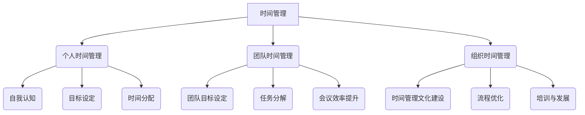
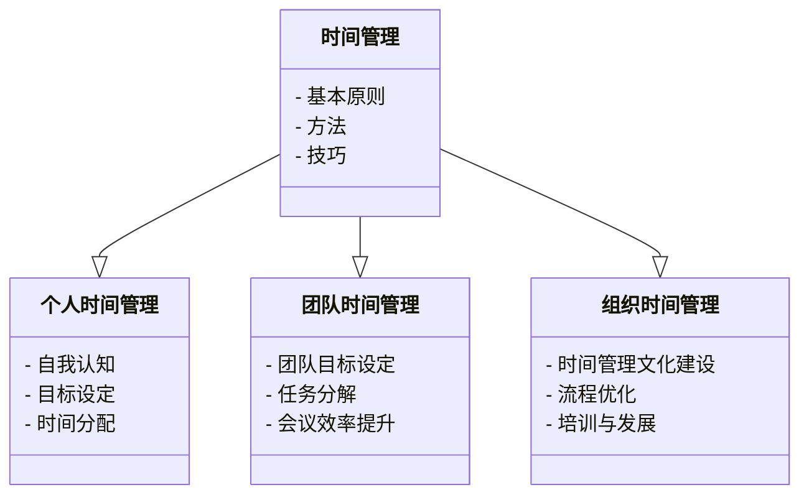

                 

## 时间管理：高效领导者的必修课

### 关键词：
- 时间管理
- 高效领导者
- 时间策略
- 个人时间管理
- 团队时间管理
- 组织时间管理

### 摘要：
时间管理是一项关键的技能，对于个人的职业发展和团队的协作效率都有着重要的影响。对于高效领导者而言，掌握时间管理技巧更是必修课程。本文将从个人、团队和组织三个层面，深入探讨时间管理的重要性、原则与方法，并提供实用的案例和实践技巧，帮助领导者提升时间管理能力，实现更高效的工作和生活。

## 引言

### 时间管理的重要性

时间，作为不可再生的资源，对于每个人来说都是宝贵的。高效的领导者必须能够合理地管理和分配时间，以确保个人和团队的效率最大化。时间管理不仅关系到个人职业的发展，也影响着团队协作的质量和组织的整体绩效。一个优秀的领导者如果无法有效地管理时间，就难以承担起领导的重任，更难以引领团队实现目标。

### 高效领导者的时间管理需求

高效领导者需要具备以下几方面的能力：
1. **优先级管理**：能够区分重要任务和紧急任务，合理分配时间和资源。
2. **自我管理**：保持高水平的自律，避免浪费时间在非重要的事务上。
3. **沟通协调**：有效沟通和协调团队成员，确保任务顺利完成。
4. **持续学习**：保持对时间管理新方法、新工具的学习和运用，不断优化时间管理策略。

### 本书的结构安排

本书将分为四个主要部分：
1. **引言**：介绍时间管理的重要性及高效领导者的需求。
2. **核心概念**：讨论时间管理的基本原则和方法。
3. **时间管理策略**：详细讲解个人、团队和组织层面的时间管理策略。
4. **案例分析**：通过实际案例展示时间管理策略的应用效果。

## 核心概念

### 时间管理的基本原则

1. **优先级原则**：优先处理最重要和最紧急的任务。
2. **高效利用原则**：最大化利用时间，避免无效工作。
3. **灵活调整原则**：根据实际情况灵活调整时间分配和任务优先级。

### 时间管理的方法

1. **时间记录法**：详细记录每天的时间分配，分析时间花费情况。
2. **时间预算法**：提前规划每天的工作任务和时间安排。
3. **时间区域法**：将时间分为不同的区域，根据区域特点安排任务。

### 时间管理技巧

1. **时间块管理**：将工作时间划分为不同的时间块，每个时间块专注于一项任务。
2. **电子邮件管理**：设定特定时间处理电子邮件，避免频繁打扰。
3. **会议管理**：制定明确的会议议程和时间限制，确保会议高效。

## 时间管理策略

### 个人时间管理

#### 重要性

个人时间管理对于领导者来说至关重要，它决定了个人的工作效能和生活质量。

#### 策略

1. **自我认知**：了解自己的时间使用习惯和效率。
2. **目标设定**：设定清晰的目标，制定实现目标的计划。
3. **时间分配**：合理安排工作、学习和休息时间。

#### 工具

1. **日历应用**：如Google Calendar、Outlook Calendar等，用于安排日常任务和会议。
2. **待办事项应用**：如Trello、Asana等，帮助跟踪任务进度。
3. **时间跟踪工具**：如 RescueTime、Toggl等，用于分析时间花费。

### 团队时间管理

#### 挑战

1. **团队成员差异**：团队成员可能有着不同的工作风格和时间观念。
2. **任务协作效率**：确保团队成员协同工作，提高任务完成效率。

#### 策略

1. **团队目标设定**：明确团队的目标和每个人的职责。
2. **任务分解**：将大任务分解为小任务，分配给团队成员。
3. **会议效率提升**：制定会议议程，确保会议内容紧凑且有效。

#### 工具

1. **团队日历**：用于协调团队日程，避免冲突。
2. **团队任务管理工具**：如Jira、GitLab等，用于任务跟踪和分配。
3. **团队沟通工具**：如Slack、Microsoft Teams等，用于实时沟通和协作。

### 组织时间管理

#### 目标

1. **提高整体效率**：通过优化工作流程和资源配置，提高组织的整体效率。
2. **优化资源配置**：确保人力资源和物质资源的最大化利用。

#### 策略

1. **时间管理文化建设**：建立时间管理文化，提高员工的时间意识。
2. **流程优化**：简化工作流程，减少不必要的步骤。
3. **培训与发展**：定期培训员工，提高他们的时间管理技能。

#### 工具

1. **企业资源计划系统**：如SAP ERP、Oracle ERP等，用于管理资源。
2. **项目管理工具**：如Microsoft Project、Primavera等，用于项目规划和管理。
3. **员工时间跟踪工具**：如Workday、ADP等，用于员工时间记录和统计分析。

## 案例分析

#### 案例背景

某科技公司是一家快速发展的创业公司，团队成员来自不同的背景和领域。由于公司快速发展，任务繁多，时间管理成为一个关键问题。

#### 时间管理策略实施

1. **个人层面**：每位员工都使用时间跟踪工具记录每天的工作时间，分析时间花费情况，并制定改进计划。
2. **团队层面**：团队使用项目管理工具，将任务分解并分配给团队成员，同时定期召开进度会议，确保任务按计划完成。
3. **组织层面**：公司推行时间管理培训，提高员工的时间管理意识，同时优化工作流程，减少不必要的会议和流程。

#### 应用效果

通过实施有效的时间管理策略，该公司的任务完成效率显著提高，员工的工作满意度也得到提升。

## 时间管理工具

#### 常用工具

1. **Google Calendar**：用于个人和团队日程安排。
2. **Trello**：用于任务管理和跟踪。
3. **Slack**：用于团队沟通和协作。
4. **RescueTime**：用于时间跟踪和分析。

#### 使用技巧

1. **合理规划日程**：提前规划每天的工作任务和时间安排。
2. **有效沟通**：确保团队成员之间的沟通畅通。
3. **持续优化**：定期评估和调整时间管理策略，不断优化。

## 时间管理实践

#### 实际操作建议

1. **设立明确目标**：明确个人和团队的目标，制定详细的计划。
2. **定期反思**：定期反思时间管理的效果，找出改进点。
3. **培养自律**：保持自律，避免拖延和无效工作。

#### 技巧

1. **使用番茄工作法**：将工作时间划分为25分钟的工作块，每个工作块后休息5分钟。
2. **设定优先级**：根据任务的重要性和紧急程度，设定任务的优先级。

## 总结与展望

时间管理是高效领导者不可或缺的技能。通过本书的探讨，我们了解了时间管理的重要性、核心概念、策略和实际应用。在未来，随着科技的发展，时间管理工具和方法将不断更新，领导者需要持续学习和适应，以不断提升时间管理能力，实现更高的工作效能和生活质量。

### 最佳实践 tips

1. **设定清晰的目标**：明确个人和团队的目标，有助于提高时间管理的有效性。
2. **合理分配时间**：根据任务的重要性和紧急程度，合理分配时间资源。
3. **培养自律**：保持自律，避免拖延，提高工作效率。

### 小结

时间管理对于高效领导者至关重要。通过有效的个人、团队和组织时间管理策略，领导者可以提升工作效率，优化团队协作，实现组织目标。

### 注意事项

1. **避免过度规划**：过度的规划可能导致时间浪费，合理规划是关键。
2. **持续反思**：定期反思时间管理效果，调整策略。

### 拓展阅读

1. 《高效能人士的七个习惯》
2. 《深度工作：如何有效利用每一点脑力》
3. 《时间管理的艺术》

### 作者

作者：AI天才研究院/AI Genius Institute & 禅与计算机程序设计艺术 /Zen And The Art of Computer Programming

---

[Mermaid 图流程图和类图示例]

---

本文通过深入分析和实际案例，阐述了时间管理在高效领导者中的重要性，并提供了详细的策略和实践技巧。希望读者能够从中获得启发，提升自己的时间管理能力，实现更高的工作效率和生活质量。

