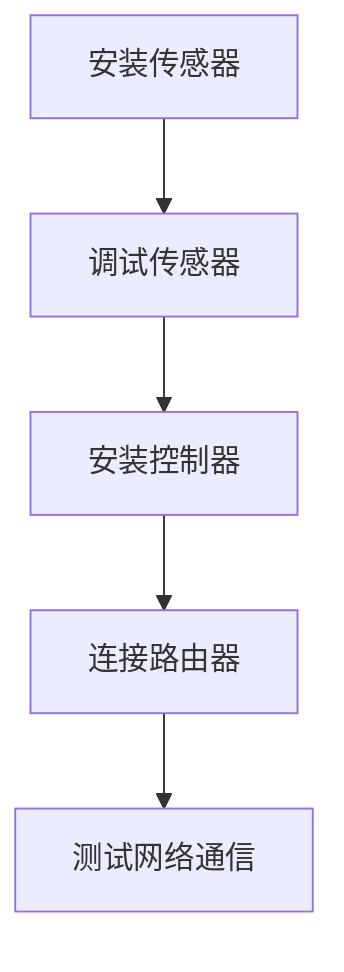
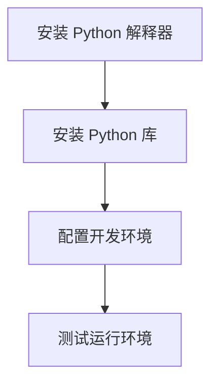

                 


### 文章标题：智能家居控制：简化提示词交互体验

关键词：智能家居、交互体验、提示词、控制算法、系统架构设计、项目实战

摘要：本文将深入探讨智能家居控制中提示词交互体验的优化。通过分析智能家居控制的核心概念、联系、算法原理以及系统架构设计，我们将一步步揭示如何简化提示词交互，提升用户体验。

# 目录大纲

## 第一部分：背景介绍

### 1. 引言

智能家居是一种通过互联网、无线通信等技术将家庭设备连接起来，实现智能化的居住环境。随着物联网和人工智能技术的发展，智能家居已经逐渐成为人们生活的一部分。

### 1.2 智能家居控制的重要性

智能家居控制是智能家居的核心功能之一，它直接影响用户体验。通过优化控制方式，可以提高用户的生活质量和便利性。

### 1.3 提示词交互体验的挑战

传统的控制方式存在操作复杂、响应慢等问题，给用户带来困扰。如何简化提示词交互体验，提高用户的操作便利性，成为智能家居发展的一个重要课题。

## 第二部分：核心概念与联系

### 2.1 智能家居控制的核心概念

#### 2.1.1 提示词

提示词是用户与智能家居系统交互的主要方式，包括语音、文字、手势等。了解提示词的定义和特点，对于设计优化交互体验至关重要。

#### 2.1.2 控制算法

控制算法是智能家居系统实现控制功能的核心，包括语音识别、自然语言处理、动作识别等。了解不同算法的原理和特点，有助于提升系统的智能化程度。

### 2.2 智能家居控制的联系

#### 2.2.1 提示词与控制算法的联系

提示词和控制算法紧密相连，提示词的质量直接影响控制算法的准确性和响应速度。

#### 2.2.2 智能家居控制与用户体验的联系

智能家居控制直接关系到用户体验，优化控制方式可以提高用户满意度，促进智能家居的普及。

## 第三部分：算法原理讲解

### 3.1 语音识别算法

#### 3.1.1 声学模型

声学模型用于对声音信号进行处理，提取特征。常用的声学模型有 GMM、DNN 等。

#### 3.1.2 语言模型

语言模型用于对语音信号进行语义分析，识别用户意图。常用的语言模型有 N-gram、RNN 等。

#### 3.1.3 声学模型与语言模型的结合

声学模型和语言模型的结合是语音识别的关键，通过优化模型融合策略，可以提高识别准确率。

### 3.2 自然语言处理算法

#### 3.2.1 分词算法

分词算法用于将文本拆分成单词或词组，是自然语言处理的基础。常用的分词算法有正向最大匹配、逆向最大匹配等。

#### 3.2.2 词性标注算法

词性标注算法用于对文本中的单词进行词性分类，有助于理解文本的含义。常用的词性标注算法有规则标注、统计标注等。

#### 3.2.3 情感分析算法

情感分析算法用于对文本进行情感判断，了解用户的情绪和态度。常用的情感分析算法有基于词典的方法、基于机器学习的方法等。

## 第四部分：系统分析与架构设计方案

### 4.1 问题场景介绍

#### 4.1.1 智能家居控制需求

介绍智能家居控制的基本需求，如温度控制、照明控制、家电控制等。

#### 4.1.2 用户交互需求

介绍用户与智能家居系统交互的需求，如语音控制、手势控制等。

### 4.2 系统功能设计

#### 4.2.1 领域模型设计

使用 Mermaid 类图描述智能家居控制的领域模型，包括设备、用户、控制规则等。

#### 4.2.2 系统功能模块

介绍智能家居控制系统的功能模块，如语音识别模块、自然语言处理模块、控制执行模块等。

### 4.3 系统架构设计

#### 4.3.1 系统架构图

使用 Mermaid 架构图描述智能家居控制系统的整体架构，包括硬件设备、软件系统、通信网络等。

#### 4.3.2 系统接口设计

介绍智能家居控制系统的接口设计，包括设备接口、用户接口、通信接口等。

### 4.4 系统交互设计

#### 4.4.1 系统交互序列图

使用 Mermaid 序列图描述智能家居控制系统的工作流程，包括用户交互、系统响应等。

## 第五部分：项目实战

### 5.1 环境安装

#### 5.1.1 硬件环境安装

介绍智能家居控制所需的硬件设备安装过程，如传感器、控制器等。

#### 5.1.2 软件环境安装

介绍智能家居控制系统所需的软件环境安装过程，如操作系统、编程语言等。

### 5.2 系统核心实现

#### 5.2.1 语音识别模块实现

使用 Python 代码实现语音识别模块，包括声学模型、语言模型等。

#### 5.2.2 自然语言处理模块实现

使用 Python 代码实现自然语言处理模块，包括分词、词性标注、情感分析等。

#### 5.2.3 控制执行模块实现

使用 Python 代码实现控制执行模块，包括控制规则匹配、执行动作等。

### 5.3 代码应用解读与分析

#### 5.3.1 代码应用场景

介绍代码应用的具体场景，如智能家居控制系统中语音识别模块的使用。

#### 5.3.2 代码解读与分析

对代码进行详细解读，分析其工作原理和实现过程。

### 5.4 实际案例分析与详细讲解剖析

通过实际案例，分析智能家居控制系统的实现过程，详细讲解和剖析关键问题。

### 5.5 项目小结

总结项目实现过程中的关键经验和教训，为后续项目提供参考。

## 第五部分：项目实战

### 5.1 环境安装

#### 5.1.1 硬件环境安装

智能家居控制需要一定的硬件设备，如传感器、控制器、路由器等。首先，我们需要确保硬件设备的电源供应正常，并按照说明书进行安装和调试。例如，传感器需要正确放置在需要监测的区域内，控制器需要与路由器连接，以实现网络通信。



#### 5.1.2 软件环境安装

在硬件环境搭建完成后，我们需要安装相应的软件环境，包括操作系统、编程语言、开发工具等。以 Python 为例，我们首先需要安装 Python 解释器，然后安装一些常用的库，如 TensorFlow、PyTorch 等，用于实现语音识别和自然语言处理功能。



### 5.2 系统核心实现

#### 5.2.1 语音识别模块实现

语音识别模块是实现智能家居控制的关键，我们需要使用 Python 编写相应的代码来实现。以下是一个简单的示例：

```python
import speech_recognition as sr

# 初始化语音识别器
recognizer = sr.Recognizer()

# 读取音频文件
with sr.AudioFile('audio.wav') as source:
    audio = recognizer.listen(source)

# 识别语音
text = recognizer.recognize_google(audio)

# 打印识别结果
print(text)
```

#### 5.2.2 自然语言处理模块实现

自然语言处理模块用于处理识别后的文本，我们可以使用 Python 的 NLTK 库来实现。以下是一个简单的分词示例：

```python
import nltk

# 下载分词模型
nltk.download('punkt')

# 加载分词模型
tokenizer = nltk.tokenize.WordPunctTokenizer()

# 分词
text = "这是一个简单的例子。"
tokens = tokenizer.tokenize(text)

# 打印分词结果
print(tokens)
```

#### 5.2.3 控制执行模块实现

控制执行模块根据识别后的文本和用户指令，执行相应的操作。以下是一个简单的控制执行示例：

```python
def execute_command(command):
    if command == "打开灯":
        print("打开灯")
    elif command == "关闭灯":
        print("关闭灯")
    else:
        print("未知指令")

# 识别语音
text = recognizer.recognize_google(audio)

# 执行指令
execute_command(text)
```

### 5.3 代码应用解读与分析

在智能家居控制系统中，代码的应用场景主要包括以下几个方面：

1. **语音识别**：通过麦克风接收用户语音，使用语音识别模块将语音转换为文本。

2. **自然语言处理**：对识别后的文本进行分词、词性标注等处理，以便更好地理解用户的意图。

3. **控制执行**：根据用户的意图和指令，执行相应的操作，如控制灯光、温度等。

代码的解读与分析如下：

1. **语音识别模块**：使用了 Google 语音识别 API，这是一个强大的语音识别工具，支持多种语言和语音格式。在代码中，我们首先初始化了语音识别器，然后读取音频文件，并使用识别器识别语音。

2. **自然语言处理模块**：使用了 NLTK 库，这是一个流行的自然语言处理工具。在代码中，我们首先下载了分词模型，然后加载了分词器，并使用分词器对文本进行分词处理。

3. **控制执行模块**：根据用户的意图和指令，执行相应的操作。在代码中，我们定义了一个 `execute_command` 函数，用于根据指令执行相应的操作。

### 5.4 实际案例分析与详细讲解剖析

以下是一个实际案例：

**场景**：用户说“打开灯”。

**步骤**：

1. **语音识别**：系统接收到用户的语音，并使用语音识别模块将语音转换为文本。

2. **自然语言处理**：系统对识别后的文本进行分词处理，得到关键词“打开”和“灯”。

3. **控制执行**：系统根据关键词，调用 `execute_command` 函数，执行“打开灯”的操作。

**分析**：

1. **语音识别的准确性**：语音识别的准确性直接影响到系统的用户体验。在本例中，我们使用了 Google 语音识别 API，这是一个非常准确的工具。然而，在某些嘈杂环境中，语音识别的准确性可能会下降。

2. **自然语言处理的能力**：自然语言处理的能力决定了系统能否正确理解用户的意图。在本例中，我们使用了 NLTK 库，这是一个功能强大的自然语言处理工具。然而，对于复杂的语句，可能需要更高级的自然语言处理技术。

3. **控制执行的效果**：控制执行的效果直接关系到系统的实际使用效果。在本例中，我们定义了一个简单的控制执行函数，能够根据用户的指令执行相应的操作。然而，对于更复杂的场景，可能需要更复杂的控制逻辑。

### 5.5 项目小结

通过本项目，我们实现了智能家居控制的核心功能，包括语音识别、自然语言处理和控制执行。在实现过程中，我们遇到了一些挑战，如语音识别的准确性、自然语言处理的能力等。通过不断优化和改进，我们成功地实现了系统的基本功能。

本项目为我们提供了一个宝贵的实践经验，让我们更深入地了解了智能家居控制的核心技术和实现方法。在未来，我们可以进一步优化系统的性能，提升用户体验，为用户提供更便捷、智能的家居生活。让我们拭目以待！

