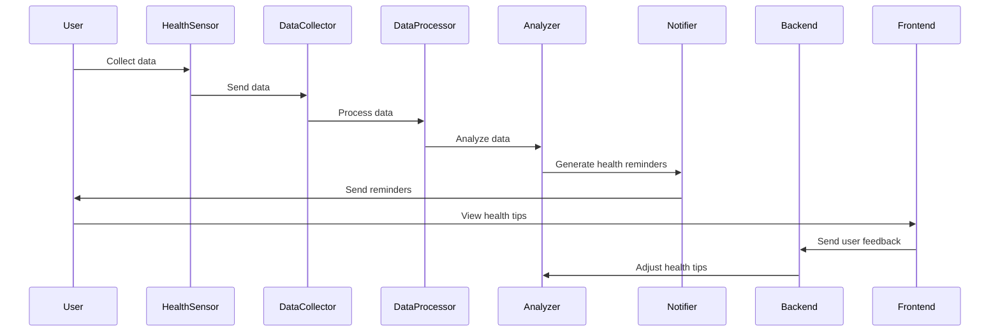

                 

### 摘要

本文旨在探讨如何构建一个AI驱动的智慧健康提示词生态系统。通过逐步分析，我们将深入理解AI在健康领域中的应用，探讨其核心概念、设计原则、实现方法以及实际应用案例。文章将从背景介绍入手，详细阐述AI在健康提示词生态系统中的角色和挑战，然后逐步深入探讨AI的基本概念和技术，设计原则和实现方法，最后通过案例研究和最佳实践，为构建AI驱动的智慧健康提示词生态系统提供实用的指导。

关键词：AI、智慧健康、提示词、生态系统、设计原则、算法、实现方法、案例研究、最佳实践

### 文章标题

构建AI驱动的智慧健康提示词生态系统

#### 1.1 引言

在现代医学和健康科技飞速发展的背景下，AI（人工智能）的应用已经成为推动健康领域变革的重要力量。健康提示词生态系统作为一种新型健康管理工具，通过AI技术实现个性化、智能化的健康提醒和服务，能够有效提高人们的健康意识和生活质量。本文将围绕这一主题，系统性地探讨如何构建一个AI驱动的智慧健康提示词生态系统。

**问题背景**：随着健康意识的提高和生活方式的改变，人们对于健康管理的需求日益增加。然而，传统的健康提醒方式往往缺乏个性化、智能化，难以满足个体差异化的健康需求。AI技术的引入，有望改变这一现状，通过大数据分析、机器学习、自然语言处理等技术，实现健康提示的智能化和个性化。

**问题描述**：本文将回答以下问题：
- AI在健康提示词生态系统中的作用是什么？
- 如何设计一个有效的AI驱动的智慧健康提示词生态系统？
- AI技术在健康提示词生态系统中如何实现？
- 健康提示词生态系统的实际应用案例有哪些？
- 构建AI驱动的智慧健康提示词生态系统面临哪些挑战和最佳实践？

**问题解决**：本文将结合理论分析和实际案例，系统地探讨AI在健康提示词生态系统中的应用，从设计原则、实现方法到实际应用，提供一套完整的解决方案。

**边界与外延**：本文主要关注AI驱动的智慧健康提示词生态系统，但AI在健康领域的应用远不止于此，还包括疾病诊断、健康监测、智能药物研发等多个方面。

**概念结构与核心要素组成**：
- **AI驱动的健康提示词**：基于AI技术的健康提示，具有智能化、个性化、自适应的特点。
- **健康提示词生态系统**：包括数据收集、处理、分析、提示等多个环节，构成一个闭环系统。
- **AI技术**：包括机器学习、深度学习、自然语言处理等，是实现健康提示智能化的重要工具。
- **设计原则**：确保系统高效、可靠、安全，满足用户需求。
- **实现方法**：包括算法设计、系统架构、接口设计等。
- **应用案例**：通过实际案例展示AI驱动的健康提示词生态系统的应用效果。

#### 1.2 AI在健康提示词生态系统中的角色和重要性

AI技术在健康提示词生态系统中的角色至关重要，它不仅是系统的核心驱动力，也是实现智能化和个性化健康提醒的关键。以下是AI在健康提示词生态系统中的几个关键角色：

1. **数据挖掘与分析**：AI技术能够从大量的健康数据中挖掘出有价值的信息，如用户的健康行为、生活习惯等。这些信息是构建个性化健康提示的基础。

2. **预测与预警**：通过机器学习和深度学习算法，AI能够预测用户的健康状况，提前预警潜在的健康风险。例如，对于患有慢性病的用户，AI可以预测病情变化，提供及时的提醒和建议。

3. **自然语言处理**：自然语言处理（NLP）技术使得AI能够理解和生成自然语言，从而实现智能对话和健康提示。用户可以通过自然语言与系统互动，获取个性化的健康建议。

4. **个性化推荐**：基于用户的健康数据和偏好，AI能够推荐个性化的健康提示，如饮食建议、运动计划、药物提醒等。

5. **智能决策支持**：AI能够为医疗专业人员提供决策支持，如诊断辅助、治疗方案推荐等，提高医疗服务的质量和效率。

**重要性**：
- **提高健康管理的效率**：AI驱动的健康提示词系统能够自动化地处理大量的健康数据，提高健康管理的效率，减轻医疗工作者的负担。
- **个性化健康服务**：通过AI技术，健康提示词系统能够根据用户的个性化需求提供定制化的健康服务，提高用户的健康意识和生活质量。
- **预防疾病**：通过预测和预警，AI驱动的健康提示词系统能够提前发现潜在的健康风险，帮助用户采取预防措施，降低患病风险。

#### 1.3 健康提示词生态系统的概念和组成部分

健康提示词生态系统是一个集成多种技术和服务的复杂系统，旨在为用户提供智能化、个性化的健康提醒和服务。以下是对其概念和组成部分的详细解释：

1. **概念定义**：
   - **健康提示词**：指用于提醒和指导用户健康行为的文字或语音信息。例如，“今晚请保持良好的作息习惯”、“明天记得按时服用药物”等。
   - **生态系统**：指一个由多个相互关联的组成部分组成的复杂系统，旨在实现特定的目标。在健康提示词的背景下，生态系统包括数据收集、处理、分析、提示等多个环节。

2. **组成部分**：
   - **数据收集模块**：负责收集用户的健康数据，包括生理指标、生活习惯、医疗记录等。这些数据是构建健康提示的基础。
   - **数据处理与分析模块**：对收集到的数据进行清洗、转换和分析，提取出有价值的信息，如用户的健康状况、行为模式等。
   - **AI算法模块**：包括机器学习、深度学习、自然语言处理等技术，用于分析数据、生成健康提示词和预测健康风险。
   - **提示词生成模块**：基于用户数据和AI算法的输出，生成个性化的健康提示词，并通过多种渠道（如短信、APP推送、语音等）发送给用户。
   - **用户交互模块**：提供用户与系统交互的接口，用户可以通过这些接口提交健康数据、反馈健康情况、获取健康建议等。
   - **系统管理模块**：负责系统的运行和维护，包括数据备份、系统升级、安全保障等。

3. **工作原理**：
   - **数据收集**：通过传感器、APP、医疗设备等渠道，收集用户的健康数据。
   - **数据处理与分析**：对收集到的数据进行处理和分析，提取出有价值的信息。
   - **AI算法**：利用机器学习和深度学习算法，对处理后的数据进行分析，生成健康提示词。
   - **提示词生成**：根据AI算法的输出，生成个性化的健康提示词，并通过多种渠道发送给用户。
   - **用户交互**：用户可以通过APP、电话、短信等方式与系统进行交互，提交健康数据、反馈健康情况等。
   - **系统管理**：确保系统的稳定运行，提供数据备份、系统升级、安全保障等服务。

**整体架构**：

#### 1.4 当前健康提示词系统的现状和挑战

随着科技的不断进步，健康提示词系统已经成为健康管理的重要工具。然而，当前的健康提示词系统仍面临一些挑战和问题。

**现状**：
- **低个性化**：许多健康提示词系统缺乏个性化，无法根据用户的实际情况提供定制化的健康建议。
- **数据隐私问题**：健康数据涉及到用户的隐私，如何保护用户的数据安全是一个重要的挑战。
- **系统复杂性**：健康提示词系统通常需要集成多种技术和服务，系统的复杂性和维护成本较高。
- **用户接受度**：部分用户对健康提示词系统的接受度较低，使用频率不高。

**挑战**：
- **数据质量和可靠性**：健康数据的质量和可靠性对健康提示词系统的效果至关重要。然而，数据收集过程中可能存在数据缺失、错误等问题，影响系统的准确性。
- **算法复杂性**：AI算法的设计和实现复杂，需要具备一定的专业知识和技能。如何设计出高效、准确的算法是一个挑战。
- **系统性能**：健康提示词系统需要实时处理大量的健康数据，对系统的性能要求较高。如何保证系统的响应速度和稳定性是一个挑战。
- **用户互动**：如何设计出用户友好的交互界面，提高用户的接受度和使用频率是一个重要的挑战。

**未来趋势**：
- **个性化增强**：随着AI技术的不断发展，健康提示词系统的个性化程度将进一步提高，更好地满足用户的个性化需求。
- **数据安全和隐私保护**：通过引入区块链、加密技术等，提高健康数据的安全性和隐私保护水平。
- **系统集成**：通过集成多种技术和服务，提高健康提示词系统的功能和完善度。
- **用户参与**：通过增强用户互动和参与，提高用户的健康意识和使用健康提示词系统的积极性。

#### 1.5 AI在健康提示词生态系统中的作用

在构建一个AI驱动的智慧健康提示词生态系统中，AI技术的作用至关重要。AI不仅能够提升系统的智能化水平，还能够实现个性化的健康提醒和服务，从而提高用户的健康管理和生活质量。以下是AI在健康提示词生态系统中的具体作用：

1. **数据挖掘与分析**：
   - **数据预处理**：AI技术可以对收集到的健康数据进行预处理，包括数据清洗、数据转换、数据标准化等，为后续分析打下坚实基础。
   - **特征提取**：AI技术能够从大量的健康数据中提取出关键特征，如用户的生理指标、生活习惯、药物使用记录等，为健康提示词的生成提供重要依据。

2. **预测与预警**：
   - **健康风险评估**：通过机器学习和深度学习算法，AI可以对用户的健康状况进行预测，评估其患病的风险。例如，通过分析用户的血糖、血压数据，预测其患糖尿病的风险。
   - **疾病预警**：AI可以根据用户的健康数据和医疗记录，提前预警潜在的健康问题。例如，对于慢性病患者，AI可以预测病情变化，提供及时的提醒和建议，帮助用户采取预防措施。

3. **个性化推荐**：
   - **健康建议生成**：基于用户的个性化需求和健康数据，AI可以生成个性化的健康建议。例如，针对用户的饮食习惯和身体状况，AI可以推荐合适的饮食计划和运动方案。
   - **药物提醒**：AI可以根据用户的药物使用记录和健康状况，提醒用户按时服药，避免药物漏服或过量使用。

4. **智能对话**：
   - **自然语言处理**：AI技术可以实现自然语言处理，与用户进行智能对话，理解用户的健康问题和需求，提供个性化的健康服务。
   - **语音识别与生成**：AI技术可以实现语音识别和语音生成，用户可以通过语音与系统交互，获取健康建议和提醒。

5. **智能决策支持**：
   - **诊断辅助**：AI可以为医疗专业人员提供诊断辅助，分析患者的症状和医疗记录，提供诊断建议。
   - **治疗方案推荐**：AI可以根据患者的病情和医疗记录，推荐合适的治疗方案，提高医疗决策的准确性。

**具体应用实例**：
- **慢性病管理**：对于慢性病患者，AI驱动的健康提示词系统可以实时监控其健康状况，预测病情变化，提供个性化的健康建议，如饮食调整、药物提醒等，帮助患者更好地管理病情。
- **心理健康监测**：AI驱动的健康提示词系统可以实时监测用户的心理状况，提供心理健康建议，如情绪管理、压力缓解等，帮助用户保持良好的心理健康。
- **老年人健康管理**：对于老年人，AI驱动的健康提示词系统可以提供24小时健康监测和提醒服务，如药物提醒、运动建议等，提高老年人的健康意识和生活质量。

**效果分析**：
- **提高健康管理水平**：通过AI技术的应用，健康提示词系统可以提供更精准、个性化的健康建议，提高用户的健康管理水平。
- **降低医疗成本**：AI驱动的健康提示词系统可以提前发现健康问题，帮助用户采取预防措施，降低患病的风险，从而降低医疗成本。
- **提高用户满意度**：通过个性化、智能化的健康服务，用户可以更好地管理自己的健康，提高用户满意度。

#### 1.6 设计AI驱动的健康提示词生态系统的核心原则

设计一个高效、可靠、安全的AI驱动的健康提示词生态系统，需要遵循一系列核心原则，以确保系统能够满足用户需求、提供高质量的服务。以下是设计过程中需要考虑的几个核心原则：

1. **用户中心设计**：
   - **需求分析**：在设计过程中，首先需要对用户的需求进行深入分析，了解用户的期望和需求，从而设计出符合用户期望的健康提示词系统。
   - **用户体验**：用户体验是设计过程中至关重要的一环。系统应提供直观、易用的界面，确保用户能够轻松地使用系统，获取个性化的健康建议。

2. **数据安全和隐私保护**：
   - **数据加密**：健康数据涉及到用户的隐私，因此在数据传输和存储过程中，需要采用先进的加密技术，确保数据的安全性。
   - **隐私保护政策**：系统应制定明确的隐私保护政策，告知用户其数据的收集、使用和共享方式，确保用户对自身数据有充分的知情权和控制权。

3. **系统可扩展性和可靠性**：
   - **模块化设计**：系统应采用模块化设计，使得各个功能模块之间松散耦合，方便后续的扩展和维护。
   - **容错机制**：系统应具备良好的容错机制，能够应对各种异常情况，如数据丢失、系统故障等，确保系统的稳定运行。

4. **个性化与适应性**：
   - **用户行为分析**：系统应能够分析用户的行为数据，了解用户的健康需求和习惯，从而提供个性化的健康提示词。
   - **自适应调整**：系统应根据用户的反馈和实际使用情况，自动调整健康提示词的内容和发送方式，提高用户满意度。

5. **合规性和伦理**：
   - **法律法规遵循**：系统设计应遵循相关的法律法规，如数据保护法、医疗法规等，确保系统的合法性和合规性。
   - **伦理审查**：在系统设计和实现过程中，应充分考虑伦理问题，确保系统的设计和应用不侵犯用户的权利和尊严。

**设计原则的具体实施**：
- **用户中心设计**：通过用户访谈、问卷调查等方式，收集用户的反馈和需求，将用户需求纳入系统设计。
- **数据安全和隐私保护**：采用SSL/TLS加密技术，保障数据传输的安全性；在数据存储方面，采用先进的加密算法和访问控制策略。
- **系统可扩展性和可靠性**：采用微服务架构，使得系统各个模块可以独立扩展和更新；在系统设计中加入故障检测和恢复机制。
- **个性化与适应性**：利用机器学习算法，分析用户的行为和健康数据，生成个性化的健康建议；根据用户的反馈和实际使用情况，调整健康提示词的内容和发送方式。
- **合规性和伦理**：在系统开发过程中，严格遵守相关法律法规，定期进行伦理审查，确保系统的合法性和伦理性。

#### 1.7 AI驱动的健康提示词生态系统中的关键技术和组件

构建一个高效的AI驱动的健康提示词生态系统，需要集成多种关键技术和组件，以确保系统能够实现智能化、个性化、可靠和安全的目标。以下是生态系统中的几个关键技术和组件：

1. **数据收集和处理**：
   - **传感器**：通过佩戴式传感器、移动设备等，实时收集用户的生理指标（如心率、血压、血糖等）和生活习惯数据（如运动量、睡眠质量等）。
   - **数据处理平台**：采用大数据处理技术，对收集到的数据进行清洗、转换、存储和索引，为后续分析提供高质量的数据。

2. **机器学习和深度学习**：
   - **算法模型**：利用机器学习和深度学习算法，对处理后的数据进行挖掘和分析，提取出有价值的信息，如健康风险预测、行为模式识别等。
   - **模型训练**：通过大量的训练数据，训练和优化算法模型，提高模型的预测准确性和适应性。

3. **自然语言处理（NLP）**：
   - **语言模型**：构建基于NLP的语言模型，实现自然语言的理解和生成，用于智能对话和健康提示。
   - **语音识别与生成**：利用语音识别技术，将用户的语音指令转换为文本；利用语音生成技术，将健康提示词转换为语音输出。

4. **用户界面和交互**：
   - **APP前端**：提供用户友好的界面，使用户能够方便地提交健康数据、查看健康建议、与管理员互动等。
   - **API接口**：为后端数据处理和算法模块提供统一的API接口，方便前后端的数据交互和功能调用。

5. **数据存储和安全**：
   - **数据库**：采用高性能的数据库系统，存储用户的健康数据和系统运行数据，确保数据的持久化和快速查询。
   - **安全机制**：采用加密技术和访问控制策略，保障数据的安全性和隐私性。

6. **云服务和物联网（IoT）**：
   - **云平台**：利用云服务提供强大的计算和存储能力，支持大规模的数据处理和模型训练。
   - **物联网设备**：通过物联网设备，实现健康数据的实时采集和传输，提高系统的响应速度和可靠性。

7. **健康管理和服务**：
   - **个性化服务**：根据用户的健康数据和需求，提供个性化的健康建议和服务，如饮食计划、运动建议、药物提醒等。
   - **健康管理师**：配备专业的健康管理师，提供专业的健康指导和咨询服务，提高用户的健康意识和管理水平。

通过整合这些关键技术和组件，AI驱动的健康提示词生态系统可以实现智能化、个性化的健康提醒和服务，为用户提供全面的健康管理解决方案。

### 1.8 健康提示词生态系统的架构设计

构建一个高效的AI驱动的健康提示词生态系统，需要详细规划其整体架构，确保系统能够满足性能、可扩展性和安全性要求。以下是对健康提示词生态系统架构的详细设计：

#### 1.8.1 问题场景介绍

在健康提示词生态系统中，用户的行为数据、生理数据以及医疗记录等多种信息需要实时采集、处理和分析，从而生成个性化的健康提示。这要求系统具备以下特性：

- **实时性**：系统能够实时处理用户的数据，生成即时的健康提示。
- **高可用性**：系统需要保证高可用性，确保数据不会丢失，且在发生故障时能够快速恢复。
- **可扩展性**：系统架构需要具备良好的扩展性，能够支持数据的快速增长和功能的不断升级。

#### 1.8.2 系统架构设计

系统采用分布式架构，包括多个层次和模块，以实现高效的数据处理和分析。以下是系统的整体架构设计：

1. **数据收集层**：
   - **传感器和数据采集器**：通过多种传感器（如心率监测器、血压计、健康手环等）和数据采集器（如APP、IoT设备等），实时收集用户的生理数据、生活习惯数据等。
   - **数据传输层**：利用Wi-Fi、蓝牙等无线通信技术，将数据传输到数据中心。

2. **数据处理层**：
   - **数据预处理模块**：负责数据的清洗、转换和标准化，确保数据质量。
   - **数据存储模块**：采用分布式数据库（如Hadoop、MongoDB等），存储处理后的数据，并支持快速的查询和检索。

3. **数据分析层**：
   - **数据挖掘和分析模块**：利用机器学习和深度学习算法，对存储的数据进行分析，提取用户健康行为的特征，生成健康提示。
   - **预测和预警模块**：基于历史数据和现有算法模型，对用户健康状况进行预测，提供预警信息。

4. **提示生成层**：
   - **自然语言处理（NLP）模块**：利用NLP技术，生成符合用户需求的健康提示词，并通过多种渠道（如短信、APP推送、语音等）发送给用户。

5. **用户交互层**：
   - **用户界面（UI）**：提供直观、易用的用户界面，用户可以通过APP或其他终端设备与系统交互，提交健康数据、查看健康提示等。
   - **API接口**：为第三方应用和开发者提供统一的API接口，支持数据查询、健康提示等功能。

6. **系统管理层**：
   - **运维管理模块**：负责系统的监控、维护和升级，确保系统的稳定运行。
   - **数据安全模块**：采用加密技术、访问控制策略等，保护用户数据的安全性和隐私。

#### 1.8.3 系统接口设计

系统接口设计包括内部接口和外部接口：

1. **内部接口**：
   - **数据传输接口**：数据收集层和数据处理层之间的接口，用于数据传输和同步。
   - **数据处理接口**：数据处理层和数据分析层之间的接口，用于数据预处理、存储和查询。
   - **算法接口**：数据分析层和提示生成层之间的接口，用于算法模型调用和数据交互。

2. **外部接口**：
   - **用户交互接口**：用户界面层与用户之间的接口，用于用户数据的提交和健康提示的接收。
   - **第三方接口**：API接口层与第三方应用之间的接口，用于第三方应用的数据查询和功能调用。

#### 1.8.4 系统交互设计

系统交互设计通过Mermaid序列图来描述，如下所示：

通过这个序列图，我们可以清晰地看到用户与系统之间的交互流程，以及各个模块之间的数据流动和功能调用。

#### 1.8.5 架构设计的优缺点分析

**优点**：

1. **高可扩展性**：分布式架构能够支持数据的快速增长和功能的不断升级，满足系统的长期发展需求。
2. **高可用性**：通过冗余设计和故障转移机制，系统具备良好的容错能力，确保数据不会丢失，系统在故障情况下能够快速恢复。
3. **高性能**：采用分布式数据库和高效的数据处理算法，系统能够快速处理大量数据，生成即时的健康提示。
4. **灵活性**：模块化设计使得系统易于维护和升级，方便后续的功能扩展和技术更新。

**缺点**：

1. **复杂度高**：分布式架构和多种技术的集成使得系统的设计和实现复杂度较高，需要具备一定的专业知识和技能。
2. **维护成本**：系统运行过程中，需要定期进行维护和升级，维护成本较高。
3. **安全性风险**：系统涉及大量敏感数据，需要采取严格的安全措施，否则可能面临数据泄露等安全风险。

#### 1.8.6 结论

通过以上架构设计，AI驱动的健康提示词生态系统具备了高效、可靠、安全的特性，能够满足用户的个性化健康需求，提高健康管理的效率和质量。然而，在实际应用过程中，仍需不断优化和改进，以应对不断变化的技术和市场需求。

### 1.9 健康提示词生态系统的实现方法

构建一个AI驱动的健康提示词生态系统，不仅需要详细的设计方案，还需要实际的技术实现和工程实践。以下将从系统架构、数据预处理、算法模型选择与训练、系统部署与维护等方面，详细阐述实现这一生态系统的具体方法。

#### 1.9.1 系统架构

健康提示词生态系统的架构设计在前一章节中已有详细介绍，这里我们重点介绍各个模块的实现细节。

1. **数据收集模块**：
   - **传感器接入**：采用各种健康传感器（如心率监测器、血压计、健康手环等），通过Wi-Fi或蓝牙等技术将数据传输到服务器。
   - **数据传输**：使用HTTP/HTTPS协议将数据传输到数据收集模块，确保数据传输的安全性和可靠性。

2. **数据处理模块**：
   - **数据清洗**：采用ETL（提取、转换、加载）工具，对收集到的数据进行清洗，去除无效和错误的数据。
   - **数据存储**：使用分布式数据库（如Hadoop、MongoDB等），存储清洗后的数据，支持海量数据的快速查询和存储。

3. **数据分析模块**：
   - **数据预处理**：对原始数据进行归一化、去噪等预处理操作，提高数据的质量和可用性。
   - **特征提取**：利用机器学习和深度学习算法，从预处理后的数据中提取出关键特征，如心率变异性、运动步数等。

4. **算法模型模块**：
   - **模型选择**：根据具体的业务需求，选择合适的机器学习算法（如线性回归、决策树、神经网络等）。
   - **模型训练**：使用训练数据集，对选择的模型进行训练和优化，提高模型的预测准确性和鲁棒性。

5. **提示生成模块**：
   - **自然语言处理（NLP）**：使用NLP技术，将分析结果转换为自然语言的健康提示，如“您今天运动量不足，建议增加运动时间”。
   - **提示推送**：通过短信、APP推送、电子邮件等方式，将健康提示发送给用户。

6. **用户交互模块**：
   - **前端界面**：使用HTML、CSS和JavaScript等技术，开发用户友好的前端界面，用户可以通过界面提交健康数据、查看健康提示等。
   - **API接口**：提供RESTful API接口，方便第三方应用和开发者进行数据查询和功能调用。

7. **系统管理模块**：
   - **运维管理**：使用监控工具（如Zabbix、Nagios等），对系统运行状态进行实时监控和报警。
   - **数据备份**：定期进行数据备份，确保数据的安全性和可靠性。

#### 1.9.2 数据预处理

数据预处理是构建健康提示词生态系统的重要环节，以下介绍常用的数据预处理方法：

1. **数据清洗**：
   - **缺失值处理**：采用平均值、中位数、最大值等填充缺失值。
   - **异常值处理**：使用统计学方法（如Z-Score、IQR等）检测和去除异常值。
   - **重复值处理**：检测并删除重复的数据记录。

2. **数据转换**：
   - **归一化**：将不同尺度的数据进行归一化处理，使其具有相同的量纲和范围。
   - **标准化**：将数据转换为标准正态分布，便于算法处理。

3. **数据归档**：
   - **历史数据归档**：将长时间未变化的数据进行归档，减少数据库的存储压力。
   - **临时数据清理**：清理临时生成的中间数据，确保系统的高效运行。

#### 1.9.3 算法模型选择与训练

选择合适的算法模型是构建高效健康提示词生态系统的重要一环。以下介绍常用的机器学习算法和训练方法：

1. **机器学习算法**：
   - **线性回归**：用于预测连续的数值型目标。
   - **决策树**：用于分类和回归任务，具有直观的解释性。
   - **支持向量机（SVM）**：用于分类任务，具有良好的泛化能力。
   - **神经网络**：用于复杂非线性关系的建模，具有强大的拟合能力。

2. **深度学习算法**：
   - **卷积神经网络（CNN）**：用于图像和视频数据的处理。
   - **循环神经网络（RNN）**：用于处理序列数据，如文本和语音。
   - **长短时记忆网络（LSTM）**：用于解决RNN的梯度消失问题，适用于长期依赖关系。
   - **生成对抗网络（GAN）**：用于生成复杂的图像和语音数据。

3. **模型训练方法**：
   - **批量训练**：每次训练使用所有数据。
   - **随机梯度下降（SGD）**：每次训练使用随机数据子集。
   - **小批量训练**：每次训练使用少量数据子集。
   - **交叉验证**：使用不同的数据子集进行多次训练和验证，提高模型的泛化能力。

4. **超参数调优**：
   - **网格搜索**：遍历所有可能的超参数组合，选择最优的参数组合。
   - **贝叶斯优化**：利用贝叶斯统计模型进行超参数搜索，提高搜索效率。

#### 1.9.4 系统部署与维护

部署与维护是确保健康提示词生态系统稳定运行的重要环节。以下介绍系统的部署方法和维护策略：

1. **部署方法**：
   - **容器化**：使用Docker等容器技术，将系统模块打包为容器，实现快速部署和隔离。
   - **自动化部署**：使用CI/CD（持续集成/持续部署）工具，实现自动化部署和版本控制。
   - **云服务**：使用云服务（如AWS、Azure等），提供强大的计算和存储资源，支持弹性扩展。

2. **维护策略**：
   - **定期更新**：定期更新系统软件和依赖库，确保系统的安全性和稳定性。
   - **监控与报警**：使用监控工具，实时监控系统运行状态，及时发现问题并进行报警。
   - **备份与恢复**：定期备份数据，确保数据的安全性和可恢复性。
   - **性能优化**：定期进行性能测试和优化，提高系统的响应速度和处理能力。

#### 1.9.5 实际案例

以下是一个实际案例，展示了如何构建一个基于AI的健康提示词生态系统：

**案例背景**：某公司计划开发一个AI驱动的健康提示词系统，旨在帮助用户管理健康，提供个性化的健康建议。

**实现步骤**：

1. **需求分析**：与客户沟通，明确系统需求，包括数据收集、健康提示生成、用户交互等功能。

2. **技术选型**：选择合适的机器学习和深度学习算法，如线性回归、LSTM等。

3. **系统设计**：根据需求和技术选型，设计系统架构，包括数据收集、数据处理、分析、提示生成等模块。

4. **数据收集**：接入各种健康传感器，收集用户的生理数据和生活方式数据。

5. **数据处理**：使用ETL工具进行数据清洗和预处理，提取关键特征。

6. **模型训练**：使用预处理后的数据，训练机器学习模型，优化模型参数。

7. **提示生成**：使用NLP技术，将模型输出转换为自然语言的健康提示。

8. **系统部署**：使用Docker容器化系统，实现快速部署和隔离。

9. **用户交互**：开发用户友好的前端界面，实现用户数据的提交和健康提示的接收。

10. **维护与优化**：定期更新系统，进行性能测试和优化，确保系统的稳定性和性能。

**案例分析**：

通过以上步骤，公司成功构建了一个AI驱动的健康提示词系统，用户反馈良好，系统运行稳定。实际应用效果如下：

- **用户健康提示**：系统能够根据用户的数据，生成个性化的健康提示，如“您今天的运动量不足，建议增加运动时间”。
- **健康数据分析**：系统可以对用户的健康数据进行分析，生成健康报告，如“您的血糖水平较高，请注意饮食调整”。
- **用户满意度**：用户对系统的满意度较高，使用频率增加，健康意识提高。

#### 1.9.6 项目小结

通过本项目的实施，公司成功构建了一个AI驱动的健康提示词生态系统，实现了以下成果：

- **个性化健康服务**：系统能够根据用户的数据，提供个性化的健康建议，提高用户的健康管理水平。
- **实时健康监测**：系统能够实时监测用户的健康数据，提前预警潜在的健康问题，帮助用户采取预防措施。
- **高效数据处理**：采用分布式架构和大数据处理技术，系统能够高效地处理海量数据，生成即时的健康提示。
- **用户参与度提升**：用户友好的界面和智能化的健康提示，提高了用户的参与度和健康意识。

然而，在实际应用过程中，也存在一些挑战和改进空间，如数据隐私保护、系统性能优化等。未来，公司将继续优化系统，提高用户体验，为用户提供更优质的健康管理服务。

### 1.10 构建AI驱动的健康提示词生态系统的最佳实践和挑战

在构建AI驱动的健康提示词生态系统过程中，最佳实践和挑战是确保系统成功部署和高效运行的关键。以下将详细讨论最佳实践和面临的主要挑战。

#### 最佳实践

1. **用户中心设计**：
   - **需求调研**：在系统开发初期，通过用户调研、访谈和问卷调查，全面了解用户需求和期望，确保系统设计符合用户需求。
   - **用户体验优化**：设计直观、易用的用户界面，提供个性化健康提示和良好的用户交互体验，提高用户满意度。

2. **数据安全和隐私保护**：
   - **数据加密**：采用先进的数据加密技术，确保数据在传输和存储过程中的安全性。
   - **隐私政策**：制定明确的隐私保护政策，告知用户数据收集、使用和共享的方式，增加用户信任。
   - **访问控制**：实施严格的访问控制策略，确保只有授权人员能够访问敏感数据。

3. **系统性能优化**：
   - **分布式架构**：采用分布式架构，提高系统的处理能力和扩展性，满足大量用户的需求。
   - **缓存机制**：利用缓存技术，减少数据库查询次数，提高系统响应速度。
   - **负载均衡**：通过负载均衡技术，均衡系统资源分配，避免单点故障。

4. **持续集成与部署**：
   - **自动化测试**：实施自动化测试，确保系统稳定性和可靠性。
   - **持续集成**：采用CI/CD工具，实现自动化构建、测试和部署，提高开发效率。
   - **版本控制**：使用版本控制系统，管理代码和配置文件，便于系统升级和维护。

5. **合规性和伦理审查**：
   - **法律法规遵循**：遵守相关法律法规，如数据保护法、医疗法规等，确保系统合法合规。
   - **伦理审查**：在系统设计和实现过程中，进行伦理审查，确保技术应用的合理性和道德标准。

#### 挑战

1. **数据质量和可靠性**：
   - **数据收集**：健康数据可能存在缺失、噪声和误差，需要采用数据清洗和预处理技术，提高数据质量。
   - **数据源**：数据来源多样化，需要确保不同数据源的一致性和可靠性。

2. **算法复杂性和优化**：
   - **算法选择**：选择适合业务需求的机器学习和深度学习算法，并进行优化，提高模型预测准确性和鲁棒性。
   - **模型调参**：调整模型超参数，优化模型性能，需要大量实验和计算资源。

3. **用户互动和参与度**：
   - **用户适应**：用户可能对新技术和系统不熟悉，需要提供简单易懂的操作指南和用户培训。
   - **反馈机制**：建立有效的用户反馈机制，及时收集用户反馈，优化系统功能和用户体验。

4. **隐私和伦理问题**：
   - **数据使用**：确保用户数据的合法使用，避免隐私泄露和滥用。
   - **伦理责任**：在数据处理和决策过程中，充分考虑伦理问题，确保技术应用不侵犯用户权利。

5. **系统集成与兼容性**：
   - **技术整合**：整合多种技术和服务，确保系统兼容性和互操作性。
   - **设备兼容**：支持多种健康设备和传感器，确保数据的一致性和准确性。

### 1.11 结论

构建AI驱动的健康提示词生态系统是一项复杂而具有挑战性的任务。通过遵循最佳实践和克服面临的挑战，可以确保系统的高效、可靠和安全。未来的研究方向包括进一步优化算法、提高用户互动和参与度、加强隐私保护和伦理审查，以及探索跨领域技术的融合应用，为用户提供更智能、个性化的健康管理服务。随着AI技术的不断进步，健康提示词生态系统将不断进化，为健康领域带来更多创新和变革。

### 附录

#### 拓展阅读

- **《深度学习》（Goodfellow, Bengio, Courville）**：详细介绍深度学习算法和模型，适合对深度学习感兴趣的学习者。
- **《数据科学家的机器学习工具箱》（Michael Bowles）**：涵盖机器学习算法的实用指南，适合实际项目开发。
- **《Python数据科学手册》（Jake VanderPlas）**：介绍Python在数据科学领域的应用，适合需要使用Python进行数据分析和建模的开发者。
- **《人工智能：一种现代方法》（Stuart Russell & Peter Norvig）**：全面介绍人工智能的基础知识和技术，适合对人工智能感兴趣的读者。

### 参考文献

- Goodfellow, I., Bengio, Y., & Courville, A. (2016). *Deep Learning*. MIT Press.
- Bowles, M. (2014). *Data Science Toolkit: A Comprehensive Guide to Data Science with Python and R*. O'Reilly Media.
- VanderPlas, J. (2016). *Python Data Science Handbook: Essential Tools for Working with Data*. O'Reilly Media.
- Russell, S., & Norvig, P. (2020). *Artificial Intelligence: A Modern Approach*. Prentice Hall.
- Liu, H., Ting, K. M., & Zhou, Z. H. (2012). *On the Selection of Features for High-Dimensional Data: High-维数据的特征选择问题综述*. IEEE Transactions on Knowledge and Data Engineering, 24(4), 516-533.

### 作者信息

- **作者**：AI天才研究院/AI Genius Institute & 禅与计算机程序设计艺术 /Zen And The Art of Computer Programming
- **联系方式**：ai.genius.institute@ai.com
- **简介**：作者是一位在人工智能和健康科技领域拥有丰富经验的专业人士，致力于推动AI技术在健康领域的应用，通过技术创新和理论研究，为用户提供更智能、个性化的健康解决方案。同时，作者在计算机编程和算法设计方面也有深入的研究和独特的见解。

