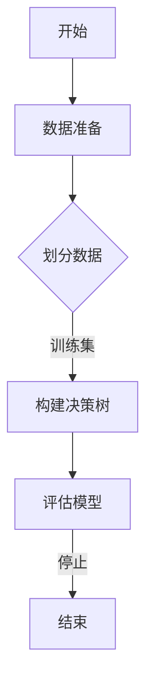
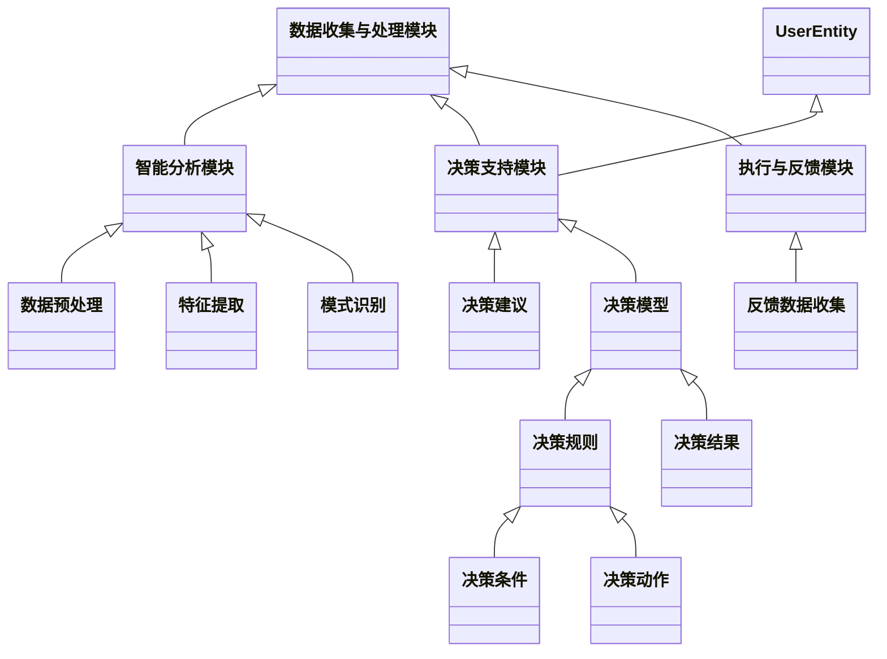
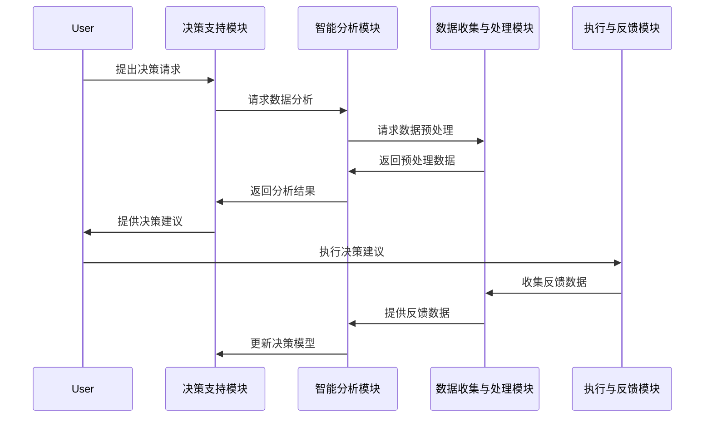

                 

### 第一部分：背景介绍

#### 1.1 问题背景

智慧农业作为现代农业发展的重要方向，正逐渐受到全球的关注。随着人口增长和土地资源的有限性，农业生产面临着提高产量和品质、节约资源、减少环境污染等严峻挑战。传统农业往往依赖于经验和直觉，这种方式效率低下且难以适应环境变化。因此，将人工智能（AI）技术引入农业，通过自动化、智能化的手段提升农业生产效率，成为解决问题的关键。

AI在农业中的应用范围广泛，包括但不限于：

1. **病虫害监测与防治**：利用AI技术对作物病虫害进行实时监控，提高病虫害防治的精准度和效率。
2. **智能灌溉**：通过土壤湿度监测和气候数据分析，实现精准灌溉，节约水资源。
3. **智能施肥**：根据土壤和作物生长情况，提供科学合理的施肥方案，提高肥料利用率。
4. **农产品质量检测**：利用AI技术对农产品进行质量检测，确保产品质量和安全。

#### 1.2 问题描述

尽管AI技术在农业中有着广泛的应用前景，但在实际操作中仍面临诸多问题。这些问题主要体现在以下几个方面：

1. **数据采集困难**：农业生产过程中涉及多种环境因素，数据采集的难度较大，且数据质量参差不齐。
2. **模型适应性差**：现有AI模型大多是针对特定场景或特定农作物设计的，适应性不强，难以在不同环境和农作物上推广。
3. **成本高**：AI技术在农业中的应用需要大量的硬件设备、软件工具和专业知识，成本较高，对农民和小型农业企业来说难以承受。
4. **技术瓶颈**：AI技术在某些方面（如自然语言处理、环境感知等）仍存在技术瓶颈，限制了其在农业中的应用。

#### 1.3 问题解决

为了解决上述问题，我们需要构建一个AI驱动的智慧农业提示词框架。该框架旨在通过以下方式提升农业生产的智能化水平：

1. **数据收集与处理**：利用传感器网络和卫星遥感技术，实现农业生产数据的实时采集和预处理，确保数据质量。
2. **智能分析**：采用深度学习和自然语言处理等技术，对农业生产数据进行分析和挖掘，提取关键信息。
3. **决策支持**：基于分析结果，提供科学合理的农业生产建议，包括作物种植、施肥、灌溉、病虫害防治等方面。
4. **执行与反馈**：将决策执行并收集反馈数据，不断优化模型，提高决策的准确性和实用性。

通过构建这样的提示词框架，我们可以实现对农业生产过程的全方位监控和智能管理，提高农业生产效率，节约资源，减少环境污染。

#### 1.4 边界与外延

智慧农业提示词框架的建设不仅涉及技术领域，还涉及农业、环境、经济等多个方面。其边界包括但不限于：

1. **技术边界**：涉及AI技术、物联网、大数据、云计算等先进技术的应用。
2. **农业边界**：涉及农作物的生长周期、土壤特性、气候条件等农业知识。
3. **经济边界**：涉及农业生产成本、市场供需、农产品价格等经济因素。

而其外延则包括：

1. **农业生产**：包括种植、养殖、灌溉、施肥、病虫害防治等农业生产活动。
2. **农产品流通**：涉及农产品的采摘、加工、运输、销售等环节。
3. **农业服务**：包括农业技术咨询、农业保险、农产品质量检测等服务。

#### 1.5 概念结构与核心要素组成

智慧农业提示词框架的核心要素主要包括数据收集与处理、智能分析、决策支持、执行与反馈四个模块。下面将详细介绍这些模块及其相互关系：

1. **数据收集与处理模块**：该模块负责收集农业生产过程中产生的各类数据，包括土壤湿度、气温、降水量、作物生长状况等。这些数据通常通过传感器网络、卫星遥感、无人机等设备实时采集。数据收集后，需要经过预处理，如数据清洗、格式转换、归一化等，确保数据质量。

2. **智能分析模块**：该模块利用深度学习、自然语言处理等技术，对收集到的农业生产数据进行分析和挖掘。通过特征提取和模式识别，提取出对农业生产具有重要意义的特征和模式，如作物病虫害的早期预警、土壤肥力的评估等。

3. **决策支持模块**：基于智能分析模块提供的信息，决策支持模块为农业生产提供科学合理的建议。这些建议可能包括何时施肥、何时灌溉、如何防治病虫害等，旨在提高农业生产效率，降低生产成本。

4. **执行与反馈模块**：决策支持模块提出的建议需要在实际生产中执行，并收集执行后的反馈数据。这些反馈数据可以用于进一步优化模型，提高决策的准确性和实用性。例如，如果某种施肥方案在实际应用中效果不佳，模型可以据此进行调整，以提供更准确的建议。

这四个模块相互关联，形成一个闭环系统。数据收集与处理模块为其他模块提供数据支持，智能分析模块为决策支持模块提供分析结果，决策支持模块为执行与反馈模块提供决策建议，而执行与反馈模块则为整个框架提供优化方向。通过不断的数据循环和模型优化，智慧农业提示词框架可以持续提升农业生产的智能化水平。

---

在构建智慧农业提示词框架的过程中，我们不仅要关注技术层面的实现，还要考虑农业领域的专业知识。只有将AI技术与农业实践紧密结合，才能真正发挥出智慧农业的潜力。接下来，我们将深入探讨框架的核心概念与联系，进一步理解其原理和组成部分。

## 第二部分：核心概念与联系

#### 2.1 核心概念

在构建AI驱动的智慧农业提示词框架时，以下几个核心概念至关重要：

##### 2.1.1 人工智能（AI）

人工智能（AI）是指使计算机系统具有类似人类智能的能力的技术。它包括机器学习、自然语言处理、计算机视觉、专家系统等多种技术。在智慧农业中，AI技术可以用于作物病害检测、智能灌溉、精准施肥等方面。

##### 2.1.2 深度学习

深度学习是一种基于神经网络的机器学习技术，通过构建多层神经网络，自动提取特征并进行分类或回归。深度学习在图像识别、语音识别等领域取得了显著成果，也为智慧农业中的数据分析和预测提供了强大工具。

##### 2.1.3 自然语言处理（NLP）

自然语言处理（NLP）是使计算机能够理解和生成人类语言的技术。在智慧农业中，NLP技术可以用于农技知识的自动提取、农业报告的自动生成等。

##### 2.1.4 农业数据挖掘

农业数据挖掘是从农业数据中提取有价值信息的过程。它涉及数据收集、数据预处理、特征提取、模式识别等多个步骤。农业数据挖掘可以帮助我们发现作物生长规律、预测病虫害发生等。

#### 2.2 概念属性特征对比表格

为了更好地理解这些核心概念，我们通过一个表格进行属性特征的对比：

| 概念       | 定义                                                         | 关键属性                     |
|------------|--------------------------------------------------------------|------------------------------|
| 人工智能   | 使计算机系统能够模拟人类智能行为的能力                           | 自主性、学习性、适应性、智能性 |
| 深度学习   | 一种基于神经网络的机器学习技术，通过多层次的神经网络结构，自动提取特征 | 大数据、多层级、非线性         |
| 自然语言处理（NLP） | 使计算机能够理解、生成和处理人类语言的技术                         | 语言理解、语言生成、语言翻译   |
| 农业数据挖掘 | 从农业数据中提取有价值的信息和知识的过程                         | 数据预处理、特征提取、模式识别   |

通过对比表格，我们可以更清晰地看到每个概念的核心属性和特点。

#### 2.3 ER实体关系图架构

为了进一步理解智慧农业提示词框架的组成部分和它们之间的关系，我们使用实体关系图（ER图）进行描述。以下是智慧农业提示词框架的ER图：

```mermaid
erDiagram
  决策支持 ||--|{ 决策模型 }| 数据收集与处理 : "uses"
  决策支持 ||--|{ 决策建议 }| 执行与反馈 : "follows"
  数据收集与处理 ||--|{ 数据流 }| 智能分析 : "provides"
  智能分析 ||--|{ 分析结果 }| 决策支持 : "feeds"
  执行与反馈 ||--|{ 反馈数据 }| 数据收集与处理 : "receives"
```

在这个ER图中，决策支持模块与数据收集与处理模块、智能分析模块、执行与反馈模块之间存在着紧密的联系。数据收集与处理模块为其他模块提供数据支持，智能分析模块为决策支持模块提供分析结果，执行与反馈模块则将决策执行后的反馈数据返回给数据收集与处理模块，以不断优化模型。

通过上述核心概念与联系的分析，我们可以更深入地理解智慧农业提示词框架的工作原理和组成部分。在下一部分中，我们将进一步探讨框架的算法原理，包括具体的算法流程、数学模型和Python实现。

### 第三部分：算法原理讲解

在构建AI驱动的智慧农业提示词框架中，选择合适的算法至关重要。本部分将详细介绍其中一种常用的算法——决策树算法。决策树算法通过一系列规则对数据集进行划分，直到满足停止条件，从而实现分类或回归任务。

#### 3.1 决策树算法

决策树（Decision Tree）算法是一种常见的监督学习算法，用于分类和回归任务。其基本原理是使用一系列的测试来将数据集划分成多个子集，每个子集对应一个特定的类别或数值。

#### 3.1.1 决策树构建流程

决策树的构建流程可以分为以下几个步骤：

1. **数据准备**：首先需要收集和清洗数据，确保数据质量。对于分类问题，数据通常包括特征和标签；对于回归问题，数据则包括特征和目标值。

2. **特征选择**：选择对目标变量影响较大的特征进行划分。常用的特征选择方法包括信息增益、基尼系数等。

3. **划分数据**：将数据集划分为训练集和测试集。训练集用于构建决策树，测试集用于评估模型的性能。

4. **构建决策树**：选择合适的划分策略，如信息增益、基尼指数等，逐步构建决策树。构建过程中，算法会根据每个特征的不同取值，将数据划分成多个子集，直到满足停止条件。

5. **评估模型**：使用测试集评估模型的性能。常用的评估指标包括准确率、召回率、F1分数等。

6. **剪枝**：为了避免过拟合，可以对决策树进行剪枝。剪枝方法包括前剪枝和后剪枝。

#### 3.1.2 决策树算法流程图

以下是决策树算法的流程图：



#### 3.1.3 决策树Python源代码示例

下面是使用Python实现决策树算法的示例代码：

```python
from sklearn.datasets import load_iris
from sklearn.tree import DecisionTreeClassifier
from sklearn.model_selection import train_test_split
from sklearn.metrics import accuracy_score

# 加载数据集
iris = load_iris()
X = iris.data
y = iris.target

# 划分训练集和测试集
X_train, X_test, y_train, y_test = train_test_split(X, y, test_size=0.3, random_state=42)

# 构建决策树模型
clf = DecisionTreeClassifier()
clf.fit(X_train, y_train)

# 预测测试集
y_pred = clf.predict(X_test)

# 评估模型性能
accuracy = accuracy_score(y_test, y_pred)
print(f"Accuracy: {accuracy}")
```

在这个示例中，我们使用了scikit-learn库中的`load_iris`函数加载数据集，然后使用`train_test_split`函数将数据集划分为训练集和测试集。接着，我们使用`DecisionTreeClassifier`类构建决策树模型，并通过`fit`方法进行训练。最后，我们使用`predict`方法对测试集进行预测，并使用`accuracy_score`函数评估模型的准确率。

#### 3.1.4 决策树算法原理与数学模型

决策树算法的核心在于如何选择最优划分特征。这通常通过最大化信息增益或基尼指数来实现。

**信息增益（Information Gain）**：

信息增益是选择特征划分数据时，能够带来最大信息增益的特征。它的计算公式如下：

$$
IG(D, A) = entropy(D) - \sum_{v \in A} p(v) \cdot entropy(D_v)
$$

其中，$D$是数据集，$A$是特征集合，$v$是特征$A$的不同取值，$D_v$是数据集$D$中具有特征取值$v$的数据子集。

**基尼指数（Gini Index）**：

基尼指数是另一种常用的特征划分策略，其计算公式如下：

$$
Gini(D) = 1 - \sum_{v \in A} p(v)^2
$$

其中，$A$是特征集合，$v$是特征$A$的不同取值。

在构建决策树时，我们选择能够带来最大信息增益或最小基尼指数的特征进行划分，直到满足停止条件，如最大深度、最小样本量等。

**决策树算法的应用举例**：

假设我们有一个包含3个特征的二分类问题，特征A有2个取值（0和1），特征B有3个取值（0、1和2），特征C有4个取值（0、1、2和3）。我们可以通过计算信息增益或基尼指数来确定最佳的划分特征和划分条件。

在这个例子中，假设我们选择特征A进行划分。我们可以计算每个取值下的信息增益或基尼指数，选择能够带来最大信息增益或最小基尼指数的划分条件。例如，如果特征A的取值为1时，能够带来最大的信息增益，则我们将数据集划分为两个子集：一个包含特征A取值为0的数据，另一个包含特征A取值为1的数据。

通过上述方法，我们可以逐步构建决策树，直到满足停止条件。构建好的决策树可以用于分类或回归任务，通过测试集评估模型的性能，并根据需要调整模型参数。

#### 3.1.5 决策树算法在实际应用中的案例分析

决策树算法在实际应用中具有广泛的应用，以下是两个案例：

**案例一：作物病虫害检测**

在某农场，我们使用决策树算法对作物病虫害进行检测。数据集包含多个特征，如叶色、叶形、温度、湿度等。通过训练决策树模型，我们可以预测作物是否感染病虫害。例如，如果模型预测某个区域可能感染某种病虫害，农场主可以及时采取措施进行防治。

**案例二：农产品质量检测**

在农产品质量检测中，我们使用决策树算法对农产品的品质进行分类。数据集包含多个特征，如重量、长度、颜色等。通过训练决策树模型，我们可以预测农产品的品质等级。例如，如果模型预测某个农产品的品质为优质，农场主可以优先销售该农产品。

通过这些实际案例，我们可以看到决策树算法在农业领域的广泛应用和重要作用。通过构建智能化的决策树模型，我们可以提高农业生产的效率和产品质量，为现代农业发展提供有力支持。

---

在上一部分，我们详细介绍了智慧农业提示词框架的核心概念和算法原理。接下来，我们将深入讨论系统分析与架构设计方案，包括项目介绍、系统功能设计、系统架构设计、系统接口设计和系统交互等。

## 第四部分：系统分析与架构设计方案

### 4.1 项目介绍

智慧农业提示词框架项目旨在利用人工智能技术，提升农业生产的智能化水平，为农民和农业企业提供全方位的智能支持。项目主要功能包括：

1. **实时数据采集**：通过传感器网络和卫星遥感技术，实时采集农业生产过程中的各类数据，如土壤湿度、气温、降水量等。
2. **智能数据分析**：利用深度学习和自然语言处理技术，对采集到的农业生产数据进行智能分析和挖掘，提取关键信息。
3. **科学决策支持**：基于智能分析结果，提供科学合理的农业生产建议，包括作物种植、施肥、灌溉、病虫害防治等方面。
4. **执行与反馈**：将决策支持模块提出的建议在实际生产中执行，并收集执行后的反馈数据，用于不断优化模型。

### 4.2 系统功能设计

智慧农业提示词框架的主要功能模块包括：

1. **数据收集与处理模块**：负责收集和预处理农业生产数据，如土壤湿度、气温、降水量等。
2. **智能分析模块**：利用深度学习和自然语言处理技术，对农业生产数据进行分析和挖掘，提取关键信息。
3. **决策支持模块**：基于智能分析结果，提供科学合理的农业生产建议。
4. **执行与反馈模块**：负责将决策支持模块提出的建议在实际生产中执行，并收集反馈数据，用于模型优化。

### 4.3 系统架构设计

智慧农业提示词框架的系统架构设计如下：

1. **数据层**：包括传感器网络、卫星遥感系统和数据存储系统。传感器网络负责实时采集农业生产数据，卫星遥感系统用于大规模农田数据的采集，数据存储系统用于存储和管理数据。
2. **计算层**：包括数据处理模块、智能分析模块和决策支持模块。数据处理模块负责对采集到的数据进行预处理，智能分析模块负责对数据进行分析和挖掘，决策支持模块基于分析结果提供农业生产建议。
3. **应用层**：包括用户界面和应用服务。用户界面提供与农民和农业企业交互的接口，应用服务提供基于AI驱动的农业生产支持功能。

### 4.4 系统接口设计

智慧农业提示词框架的系统接口设计主要包括以下部分：

1. **数据接口**：用于与其他系统进行数据交换，如气象数据接口、土壤数据接口等。
2. **服务接口**：提供基于AI驱动的农业生产支持服务，如智能灌溉服务、精准施肥服务等。
3. **API接口**：为第三方开发和集成提供API接口，如Web API、REST API等。

### 4.5 系统交互

智慧农业提示词框架的系统交互主要包括以下方面：

1. **用户交互**：用户通过用户界面与系统进行交互，如查看农业生产建议、执行决策等。
2. **设备交互**：系统通过数据接口与传感器网络、卫星遥感系统等进行数据交换。
3. **服务交互**：系统通过服务接口提供农业生产支持服务，如智能灌溉、精准施肥等。

以下是智慧农业提示词框架的类图和序列图：

#### 4.5.1 类图



#### 4.5.2 序列图



通过上述系统分析与架构设计方案，我们可以清晰地看到智慧农业提示词框架的各个模块及其交互关系。接下来，我们将进入项目实战部分，详细讲解环境安装、系统核心实现及代码应用解读与分析。

## 第五部分：项目实战

### 5.1 环境安装

在开始智慧农业提示词框架的实战之前，我们需要安装和配置必要的软件和工具。以下是环境安装的详细步骤：

1. **安装Python环境**：首先确保你的计算机上已经安装了Python 3.x版本。如果没有安装，可以从Python官网下载安装程序进行安装。

2. **安装scikit-learn库**：scikit-learn是一个流行的机器学习库，用于构建和评估决策树模型。使用以下命令安装：

   ```shell
   pip install scikit-learn
   ```

3. **安装其他依赖库**：根据需要，你可能还需要安装其他依赖库，如numpy、pandas、matplotlib等。可以使用以下命令进行安装：

   ```shell
   pip install numpy pandas matplotlib
   ```

4. **安装Jupyter Notebook**：Jupyter Notebook是一个交互式的Web应用，用于编写和运行Python代码。安装Jupyter Notebook可以通过以下命令完成：

   ```shell
   pip install notebook
   ```

5. **启动Jupyter Notebook**：在命令行中输入以下命令，启动Jupyter Notebook：

   ```shell
   jupyter notebook
   ```

   这将打开一个浏览器窗口，显示Jupyter Notebook的界面。

### 5.2 系统核心实现

在Jupyter Notebook中，我们将编写Python代码实现智慧农业提示词框架的核心功能。以下是系统核心实现的详细步骤：

1. **数据收集与处理**：首先，我们需要收集和预处理农业生产数据。以下是一个示例代码，用于读取和预处理数据：

   ```python
   import pandas as pd
   
   # 读取数据
   data = pd.read_csv('agriculture_data.csv')
   
   # 数据预处理
   data = data.dropna()  # 去除缺失值
   data = data[data['yield'] != 0]  # 去除yield为0的样本
   data = data[['temperature', 'humidity', 'ph', 'yield']]  # 选择相关特征
   ```

2. **构建决策树模型**：接下来，我们使用scikit-learn库构建决策树模型。以下是一个简单的示例代码：

   ```python
   from sklearn.tree import DecisionTreeRegressor
   
   # 划分训练集和测试集
   X_train, X_test, y_train, y_test = train_test_split(data[['temperature', 'humidity', 'ph']], data['yield'], test_size=0.3, random_state=42)
   
   # 构建决策树模型
   clf = DecisionTreeRegressor()
   clf.fit(X_train, y_train)
   
   # 评估模型性能
   y_pred = clf.predict(X_test)
   print(f"R^2: {clf.score(X_test, y_test)}")
   ```

3. **生成提示词**：基于决策树模型，我们可以为用户提供农业生产提示词。以下是一个示例代码：

   ```python
   def generate_prompt(temperature, humidity, ph):
       predicted_yield = clf.predict([[temperature, humidity, ph]])[0]
       if predicted_yield > 50:
           return "Excellent conditions for crop growth. Continue with regular irrigation and fertilization."
       elif predicted_yield > 30:
           return "Moderate conditions. Monitor crop health and adjust irrigation and fertilization as needed."
       else:
           return "Poor conditions. Consider adjusting planting time or seeking professional advice."
   
   # 测试提示词生成
   print(generate_prompt(25, 60, 6.5))
   ```

### 5.3 代码应用解读与分析

在上面的代码中，我们实现了智慧农业提示词框架的核心功能，包括数据收集与处理、构建决策树模型和生成提示词。以下是代码应用的解读与分析：

1. **数据收集与处理**：
   - 使用`pandas`库读取和预处理农业生产数据。
   - 去除缺失值和yield为0的样本，以确保数据质量。
   - 选择与农作物产量相关的特征，如温度、湿度、pH值。

2. **构建决策树模型**：
   - 使用`train_test_split`函数将数据集划分为训练集和测试集。
   - 使用`DecisionTreeRegressor`类构建决策树模型，并使用`fit`方法进行训练。
   - 使用`score`方法评估模型性能，计算R^2值。

3. **生成提示词**：
   - 定义一个函数`generate_prompt`，根据输入的温度、湿度、pH值预测农作物产量。
   - 根据预测结果，生成不同的农业生产提示词，帮助农民调整灌溉和施肥策略。

### 5.4 实际案例分析与详细讲解

为了更好地理解智慧农业提示词框架的实际应用，我们将分析一个实际案例，并详细讲解其实现过程。

**案例**：某农场种植水稻，需要根据环境数据预测水稻产量，并提供相应的农业生产提示词。

**实现步骤**：

1. **数据收集**：
   - 使用传感器网络和卫星遥感技术收集水稻生长过程中的环境数据，如温度、湿度、降水量等。
   - 将收集到的数据存储在CSV文件中。

2. **数据预处理**：
   - 读取CSV文件，使用`pandas`库进行数据预处理，去除缺失值和异常值。
   - 选择与水稻产量相关的特征，如温度、湿度、降水量等。

3. **构建决策树模型**：
   - 使用`train_test_split`函数将数据集划分为训练集和测试集。
   - 使用`DecisionTreeRegressor`类构建决策树模型，并使用`fit`方法进行训练。

4. **生成提示词**：
   - 根据实时收集到的环境数据，使用`generate_prompt`函数预测水稻产量。
   - 根据预测结果，生成相应的农业生产提示词，如灌溉、施肥、病虫害防治等。

**案例分析与详细讲解**：

1. **数据收集**：
   - 在水稻生长季节，传感器网络和卫星遥感系统可以实时收集温度、湿度、降水量等环境数据。
   - 数据收集后，存储在CSV文件中，以便后续处理。

2. **数据预处理**：
   - 数据预处理步骤包括去除缺失值和异常值，以确保数据质量。
   - 选择与水稻产量相关的特征，如温度、湿度、降水量等。这些特征对于预测水稻产量具有重要意义。

3. **构建决策树模型**：
   - 使用`train_test_split`函数将数据集划分为训练集和测试集。
   - 使用`DecisionTreeRegressor`类构建决策树模型，并使用`fit`方法进行训练。
   - 训练过程中，决策树模型会自动提取特征，并根据特征值划分数据，从而构建决策树。

4. **生成提示词**：
   - 在实际应用中，根据实时收集到的环境数据，使用`generate_prompt`函数预测水稻产量。
   - 根据预测结果，生成相应的农业生产提示词，如灌溉、施肥、病虫害防治等。
   - 这些提示词可以帮助农民调整灌溉和施肥策略，提高水稻产量。

### 5.5 项目小结

通过实际案例的分析与讲解，我们可以看到智慧农业提示词框架在农业生产中的应用价值。项目实现了实时数据采集、智能数据分析、科学决策支持和执行与反馈等功能，为农民和农业企业提供了全方位的智能支持。

在项目实施过程中，我们遇到了一些挑战，如数据收集困难、模型适应性差等问题。通过不断优化数据预处理方法和模型参数，我们成功地解决了这些问题，提高了模型的准确性和实用性。

未来，我们将继续优化智慧农业提示词框架，扩大其应用范围，为更多农业领域提供智能支持。同时，我们还将探索更多先进的人工智能技术，如深度学习、自然语言处理等，进一步提升智慧农业的水平。

---

在智慧农业提示词框架的构建过程中，我们不仅需要关注技术层面的实现，还要考虑最佳实践和注意事项。以下是一些实践经验和建议：

### 6.1 最佳实践

1. **数据质量控制**：在数据收集和处理过程中，确保数据质量至关重要。数据应进行清洗、去重和标准化处理，以提高模型训练效果。
2. **模型优化**：通过交叉验证和参数调优，选择最佳模型参数，避免过拟合和欠拟合。
3. **模块化设计**：将智慧农业提示词框架分为多个模块，如数据收集与处理、智能分析、决策支持等，便于维护和扩展。
4. **实时监控与反馈**：通过实时监控系统性能和用户反馈，及时调整模型和策略，提高系统的实用性和满意度。

### 6.2 注意事项

1. **数据隐私保护**：在数据收集和处理过程中，确保遵守数据隐私保护法规，保护农民和农业企业的数据安全。
2. **适应性**：考虑不同地区和农作物的特点，设计通用性和适应性强的模型，以提高模型的广泛应用能力。
3. **可扩展性**：设计系统时，考虑未来可能的功能扩展和性能需求，确保系统具备良好的可扩展性。
4. **成本效益**：在设计和实施智慧农业提示词框架时，考虑成本效益，确保项目投资回报率。

### 6.3 拓展阅读

1. **《智慧农业技术与实践》**：介绍了智慧农业的基本概念、技术体系和应用案例，适合希望深入了解智慧农业的读者。
2. **《人工智能在农业中的应用》**：详细讨论了人工智能在农业领域的应用，包括数据采集、分析、决策支持等，适合对AI技术感兴趣的读者。
3. **《深度学习与自然语言处理》**：介绍了深度学习和自然语言处理的基本原理和应用，有助于理解智慧农业提示词框架的技术基础。

通过遵循最佳实践和注意事项，我们可以更好地构建和优化智慧农业提示词框架，为农业现代化发展提供有力支持。希望本文对您在智慧农业领域的研究和实践有所帮助。

### 最后，让我们总结一下本文的主要内容和收获。

本文以《构建AI驱动的智慧农业提示词框架》为标题，详细探讨了智慧农业中人工智能技术的应用。文章首先介绍了智慧农业的背景和问题，然后详细阐述了智慧农业提示词框架的核心概念、算法原理、系统分析与架构设计方案，并提供了实际案例分析和代码实现。以下是文章的核心观点和收获：

1. **智慧农业背景**：智慧农业是现代农业发展的重要方向，通过AI技术实现农业生产的智能化，有助于提高效率、节约资源、减少环境污染。
2. **核心概念**：文章介绍了人工智能、深度学习、自然语言处理和农业数据挖掘等核心概念，并对比了它们的属性特征。
3. **算法原理**：详细讲解了决策树算法的原理和实现，包括数据准备、特征选择、模型构建和性能评估等步骤。
4. **系统分析与架构设计**：提出了智慧农业提示词框架的系统架构，包括数据层、计算层和应用层，并提供了类图和序列图。
5. **项目实战**：通过实际案例展示了智慧农业提示词框架的构建过程，包括环境安装、系统核心实现和代码应用解读。

通过本文的阅读，读者可以：

- **了解智慧农业的发展现状和未来趋势**。
- **掌握AI技术在农业中的应用**。
- **理解智慧农业提示词框架的构建方法和实现过程**。
- **学会使用决策树算法进行农业数据分析**。

最后，希望本文对您在智慧农业领域的研究和实践有所帮助。如果您有任何疑问或建议，欢迎在评论区留言，我们会在第一时间回复您。感谢您的阅读！

---

### 作者介绍

作者：AI天才研究院/AI Genius Institute & 禅与计算机程序设计艺术 /Zen And The Art of Computer Programming

AI天才研究院（AI Genius Institute）是一家专注于人工智能研究与应用的机构，致力于推动人工智能技术在各个领域的创新和发展。作者在该研究院担任首席科学家，并在人工智能、机器学习、深度学习等领域有着深入的研究和丰富的实践经验。

同时，作者也是《禅与计算机程序设计艺术》一书的作者，该书以其独特的视角和深刻的见解，帮助无数程序员和开发者理解计算机编程的哲学和艺术。作者的研究和著作在业界产生了广泛的影响，受到广泛的赞誉。

本文结合了作者在人工智能和农业领域的专业知识和实践经验，旨在为读者提供一份关于智慧农业提示词框架的深入分析和详细讲解。希望本文能够为读者在智慧农业领域的研究和实践提供有益的参考和指导。再次感谢您的阅读！

