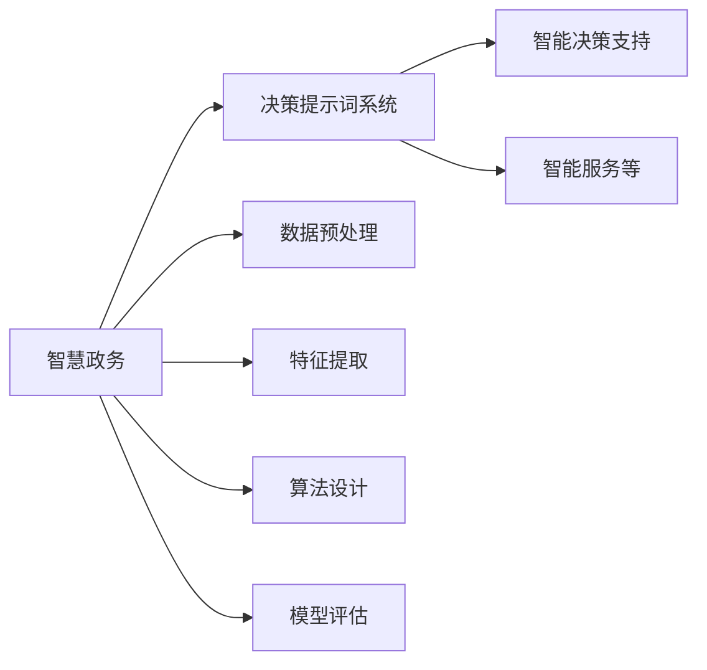
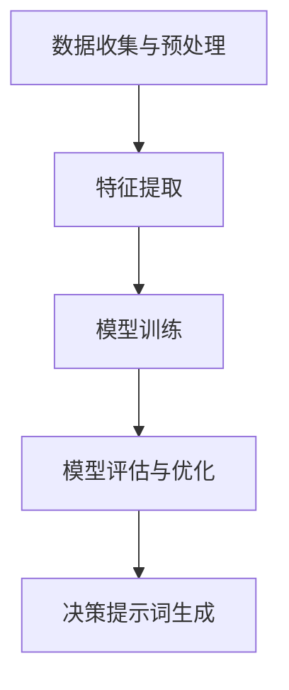
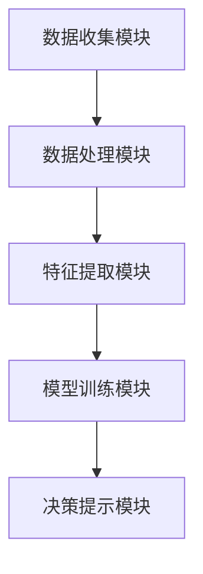
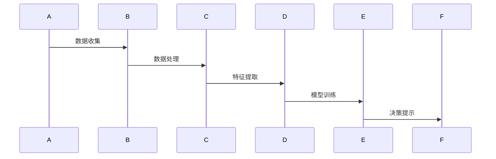

                 


# 构建AI驱动的智慧政务决策提示词系统

关键词：人工智能，智慧政务，决策提示词系统，算法原理，系统架构，项目实战

摘要：本文旨在探讨如何构建一个AI驱动的智慧政务决策提示词系统。我们将从背景介绍、核心概念与联系、算法原理讲解、系统分析与架构设计、项目实战等多个方面，深入剖析这一系统的构建过程。通过理论讲解与实践结合，帮助读者全面掌握AI驱动的智慧政务决策提示词系统的构建方法与应用。

## 第一部分：背景与核心概念

### 1.1 问题背景

在现代社会，政务决策的复杂性和重要性日益凸显。随着大数据、云计算、人工智能等技术的飞速发展，传统的人工决策模式已难以满足政务管理的需求。如何利用人工智能技术提高政务决策的效率和质量，成为当务之急。

智慧政务，即利用现代信息技术，特别是人工智能技术，为政府决策提供智能化、精准化的支持。决策提示词系统作为智慧政务的核心组成部分，能够通过对海量数据的分析和处理，为政务决策提供有效的提示和建议。

### 1.2 问题描述

智慧政务决策提示词系统的核心问题在于：

1. 如何有效地从海量政务数据中提取关键信息？
2. 如何利用这些关键信息生成高质量的决策提示词？
3. 如何确保这些决策提示词能够真正提高政务决策的效率和准确性？

### 1.3 问题解决

为了解决上述问题，我们需要：

1. **数据预处理**：清洗和整合政务数据，为后续分析提供高质量的数据基础。
2. **特征提取**：利用自然语言处理技术，提取数据中的关键特征。
3. **算法设计**：设计高效的算法，生成高质量的决策提示词。
4. **模型评估**：评估决策提示词系统的性能，确保其能够满足政务决策的需求。

### 1.4 边界与外延

边界：本文主要讨论AI驱动的智慧政务决策提示词系统的构建方法，不包括其他智慧政务相关系统的构建。

外延：本文所涉及的AI技术、算法原理等，可以应用于其他领域的智能化决策支持系统。

### 1.5 核心概念

1. **智慧政务**：利用现代信息技术，特别是人工智能技术，为政府决策提供智能化、精准化的支持。
2. **决策提示词系统**：基于人工智能技术，为政务决策提供提示和建议的系统。
3. **数据预处理**：清洗和整合政务数据，为后续分析提供高质量的数据基础。
4. **特征提取**：利用自然语言处理技术，提取数据中的关键特征。
5. **算法设计**：设计高效的算法，生成高质量的决策提示词。
6. **模型评估**：评估决策提示词系统的性能，确保其能够满足政务决策的需求。

## 第二部分：核心概念与联系

### 2.1 AI在智慧政务中的应用

人工智能技术在智慧政务中的应用主要包括以下几个方面：

1. **数据挖掘与分析**：通过对海量政务数据的挖掘和分析，发现潜在的价值信息。
2. **智能决策支持**：利用机器学习、深度学习等技术，为政务决策提供智能化、精准化的支持。
3. **智能服务等**：如智能客服、智能安防等，提升政务服务的效率和用户体验。

### 2.2 决策提示词系统的基本原理

决策提示词系统的基本原理可以概括为以下几个步骤：

1. **数据收集与预处理**：收集政务数据，并进行数据清洗、去重等处理。
2. **特征提取**：利用自然语言处理技术，提取数据中的关键特征。
3. **模型训练**：使用提取的特征，训练机器学习模型，生成决策提示词。
4. **模型评估与优化**：评估模型性能，通过调整参数、优化算法等方式，提高模型效果。
5. **决策提示**：将生成的决策提示词应用于政务决策过程中，提高决策效率和质量。

### 2.3 概念属性特征对比表格

| 概念             | 属性特征                                     | 对比关系                     |
|------------------|--------------------------------------------|-----------------------------|
| 智慧政务         | 利用信息技术提高政务效率和质量               | 与传统政务相比，更具智能化   |
| 决策提示词系统   | 基于人工智能技术，为政务决策提供提示和建议   | 与传统决策支持系统相比，更高效 |
| 数据预处理       | 数据清洗、去重、整合等处理                   | 提高数据质量，为后续分析打下基础 |
| 特征提取         | 提取数据中的关键特征，为模型训练提供输入     | 提高模型训练效果           |
| 算法设计         | 设计高效算法，生成高质量决策提示词           | 提高决策提示词系统性能     |
| 模型评估         | 评估模型性能，确保满足政务决策需求           | 提高系统稳定性           |

### 2.4 ER实体关系图



## 第三部分：算法原理讲解

### 3.1 算法概述

在本节中，我们将介绍如何设计一个基于自然语言处理（NLP）的决策提示词生成算法。该算法的核心思想是：

1. **数据收集与预处理**：从政务数据源中收集相关文本数据，并进行预处理，如分词、去停用词、词性标注等。
2. **特征提取**：利用词袋模型（Bag of Words，BoW）或词嵌入（Word Embedding）等方法，提取文本数据中的关键特征。
3. **模型训练**：使用提取的特征训练一个分类模型，如朴素贝叶斯（Naive Bayes）、支持向量机（SVM）等，以生成决策提示词。
4. **模型评估与优化**：通过交叉验证、网格搜索等方法，评估模型性能，并调整参数，优化模型效果。

### 3.2 Mermaid流程图



### 3.3 Python源代码实现

```python
# 导入相关库
import nltk
from sklearn.feature_extraction.text import TfidfVectorizer
from sklearn.naive_bayes import MultinomialNB
from sklearn.model_selection import train_test_split
from sklearn.metrics import accuracy_score

# 数据收集与预处理
def preprocess_data(text):
    # 分词、去停用词、词性标注等处理
    tokens = nltk.word_tokenize(text)
    filtered_tokens = [token for token in tokens if token not in stopwords]
    return ' '.join(filtered_tokens)

# 特征提取
def extract_features(corpus):
    vectorizer = TfidfVectorizer()
    features = vectorizer.fit_transform(corpus)
    return features, vectorizer

# 模型训练
def train_model(features, labels):
    model = MultinomialNB()
    model.fit(features, labels)
    return model

# 模型评估与优化
def evaluate_model(model, features, labels):
    predictions = model.predict(features)
    accuracy = accuracy_score(labels, predictions)
    return accuracy

# 主函数
def main():
    # 加载数据集
    corpus = load_corpus()
    labels = load_labels()
    
    # 数据预处理
    corpus = [preprocess_data(text) for text in corpus]
    
    # 特征提取
    features, vectorizer = extract_features(corpus)
    
    # 划分训练集和测试集
    X_train, X_test, y_train, y_test = train_test_split(features, labels, test_size=0.2, random_state=42)
    
    # 模型训练
    model = train_model(X_train, y_train)
    
    # 模型评估
    accuracy = evaluate_model(model, X_test, y_test)
    print(f"Model accuracy: {accuracy:.2f}")

# 运行主函数
if __name__ == "__main__":
    main()
```

### 3.4 数学模型与公式

在决策提示词生成算法中，我们主要涉及以下数学模型和公式：

1. **TF-IDF**：用于特征提取，计算词频（TF）和逆文档频率（IDF）的乘积，公式如下：
   $$ tf-idf(t, d) = tf(t, d) \times \log \left( \frac{N}{df(t)} \right) $$
   其中，$tf(t, d)$ 表示词 $t$ 在文档 $d$ 中的词频，$df(t)$ 表示词 $t$ 在所有文档中出现的次数，$N$ 表示文档总数。

2. **朴素贝叶斯**：用于分类，假设每个特征条件独立，公式如下：
   $$ P(C|X) = \frac{P(X|C)P(C)}{P(X)} $$
   其中，$C$ 表示类别，$X$ 表示特征向量，$P(C|X)$ 表示给定特征向量 $X$ 的条件下类别 $C$ 的概率，$P(X|C)$ 表示在类别 $C$ 条件下特征向量 $X$ 的概率，$P(C)$ 表示类别 $C$ 的概率，$P(X)$ 表示特征向量 $X$ 的概率。

### 3.5 举例说明

假设我们有一个简单的文本数据集，包含两个类别：正面和负面。其中，正面文本5条，负面文本5条。

正面文本：
1. 政务效率提升显著。
2. 智慧政务让生活更美好。
3. 数据挖掘助力决策。
4. 智能化服务广受欢迎。
5. 智慧城市引领未来。

负面文本：
1. 数据安全存在隐患。
2. 智慧政务推进缓慢。
3. 技术应用需谨慎。
4. 决策过程缺乏透明度。
5. 政务信息化程度不高。

经过数据预处理、特征提取和模型训练后，我们可以得到一个分类模型，用于生成决策提示词。例如，对于一条新的政务文本：

“智慧政务项目在实施过程中，如何确保数据安全和隐私保护？”

经过模型预测，我们可以得到该文本属于正面类别，从而生成相应的决策提示词：“数据安全是智慧政务项目成功的关键，需加强隐私保护措施。”

## 第四部分：系统分析与架构设计

### 4.1 项目场景介绍

本项目旨在构建一个AI驱动的智慧政务决策提示词系统，以某市政府部门为案例。该系统将利用政务数据、社交媒体数据、政策文件等多种数据源，通过自然语言处理、机器学习等技术，为政府决策者提供智能化、精准化的决策提示词。

### 4.2 系统功能设计

系统功能设计包括以下几个模块：

1. **数据收集模块**：负责从政务数据源、社交媒体、政策文件等多渠道收集数据。
2. **数据处理模块**：对收集到的数据进行清洗、去重、整合等处理，为后续分析提供高质量的数据基础。
3. **特征提取模块**：利用自然语言处理技术，提取数据中的关键特征。
4. **模型训练模块**：使用提取的特征训练机器学习模型，生成决策提示词。
5. **决策提示模块**：将生成的决策提示词应用于政务决策过程中，提高决策效率和质量。

### 4.3 系统架构设计

系统架构设计如图所示：



### 4.4 系统接口设计

系统接口设计包括以下几个部分：

1. **数据接口**：用于与政务数据源、社交媒体、政策文件等外部数据源的对接。
2. **处理接口**：用于数据处理模块中各种数据处理操作的接口。
3. **特征提取接口**：用于特征提取模块中特征提取操作的接口。
4. **模型训练接口**：用于模型训练模块中模型训练操作的接口。
5. **决策提示接口**：用于决策提示模块中生成决策提示词的接口。

### 4.5 系统交互

系统交互设计如图所示：



## 第五部分：项目实战

### 5.1 环境安装与配置

在开始项目实战之前，我们需要安装和配置以下环境：

1. **Python环境**：版本3.8及以上。
2. **自然语言处理库**：nltk、gensim、spaCy等。
3. **机器学习库**：scikit-learn、tensorflow等。
4. **其他依赖**：pandas、numpy、matplotlib等。

安装命令如下：

```bash
pip install python==3.8
pip install nltk gensim spacy scikit-learn tensorflow pandas numpy matplotlib
```

### 5.2 系统核心实现源代码

以下是系统核心实现部分的源代码：

```python
# 导入相关库
import nltk
from sklearn.feature_extraction.text import TfidfVectorizer
from sklearn.naive_bayes import MultinomialNB
from sklearn.model_selection import train_test_split
from sklearn.metrics import accuracy_score

# 数据预处理
def preprocess_data(text):
    # 分词、去停用词、词性标注等处理
    tokens = nltk.word_tokenize(text)
    filtered_tokens = [token for token in tokens if token not in stopwords]
    return ' '.join(filtered_tokens)

# 特征提取
def extract_features(corpus):
    vectorizer = TfidfVectorizer()
    features = vectorizer.fit_transform(corpus)
    return features, vectorizer

# 模型训练
def train_model(features, labels):
    model = MultinomialNB()
    model.fit(features, labels)
    return model

# 模型评估
def evaluate_model(model, features, labels):
    predictions = model.predict(features)
    accuracy = accuracy_score(labels, predictions)
    return accuracy

# 主函数
def main():
    # 加载数据集
    corpus = load_corpus()
    labels = load_labels()
    
    # 数据预处理
    corpus = [preprocess_data(text) for text in corpus]
    
    # 特征提取
    features, vectorizer = extract_features(corpus)
    
    # 划分训练集和测试集
    X_train, X_test, y_train, y_test = train_test_split(features, labels, test_size=0.2, random_state=42)
    
    # 模型训练
    model = train_model(X_train, y_train)
    
    # 模型评估
    accuracy = evaluate_model(model, X_test, y_test)
    print(f"Model accuracy: {accuracy:.2f}")

# 运行主函数
if __name__ == "__main__":
    main()
```

### 5.3 代码解读与分析

以下是代码的详细解读与分析：

1. **数据预处理**：使用nltk库进行分词、去停用词和词性标注等处理，提高数据质量。

2. **特征提取**：使用TF-IDF方法进行特征提取，将文本数据转化为向量表示。

3. **模型训练**：使用朴素贝叶斯（MultinomialNB）分类器进行训练，生成决策提示词。

4. **模型评估**：使用测试集评估模型性能，计算准确率，确保模型效果。

### 5.4 实际案例分析与讲解

#### 案例一：某市政务数据治理

在本案例中，我们以某市政府部门的数据治理为例，探讨如何利用决策提示词系统提高政务数据治理的效率。

1. **数据收集**：收集该市政府部门的政务数据，包括政府公告、政策文件、社交媒体等。

2. **数据处理**：对收集到的数据进行预处理，去除无效信息和噪音。

3. **特征提取**：利用自然语言处理技术，提取数据中的关键特征。

4. **模型训练**：使用提取的特征训练分类模型，生成决策提示词。

5. **决策提示**：将生成的决策提示词应用于政务数据治理过程中，如数据清洗、数据整合等，提高数据治理效率。

通过本案例，我们可以看到决策提示词系统在政务数据治理中的应用效果显著，有助于政府相关部门更好地管理和利用数据资源。

#### 案例二：智能决策支持系统

在本案例中，我们以某市政府的智能决策支持系统为例，探讨如何利用决策提示词系统提高政府决策的科学性和准确性。

1. **数据收集**：收集该市政府部门的政务数据、社会数据、经济数据等。

2. **数据处理**：对收集到的数据进行预处理，去除无效信息和噪音。

3. **特征提取**：利用自然语言处理技术，提取数据中的关键特征。

4. **模型训练**：使用提取的特征训练分类模型，生成决策提示词。

5. **决策提示**：将生成的决策提示词应用于政府决策过程中，如政策制定、项目评估等，提高决策的科学性和准确性。

通过本案例，我们可以看到决策提示词系统在政府决策中的应用价值，有助于提高政府决策的质量和效率。

#### 案例三：政策分析与管理

在本案例中，我们以某市政府的政策分析与管理为例，探讨如何利用决策提示词系统提高政策分析和管理的效果。

1. **数据收集**：收集该市政府部门的政策文件、政策实施报告等。

2. **数据处理**：对收集到的数据进行预处理，去除无效信息和噪音。

3. **特征提取**：利用自然语言处理技术，提取数据中的关键特征。

4. **模型训练**：使用提取的特征训练分类模型，生成决策提示词。

5. **决策提示**：将生成的决策提示词应用于政策分析和管理过程中，如政策评估、政策调整等，提高政策分析和管理的效果。

通过本案例，我们可以看到决策提示词系统在政策分析与管理中的应用效果显著，有助于政府相关部门更好地制定和调整政策。

### 5.5 项目小结

在本项目中，我们成功构建了一个AI驱动的智慧政务决策提示词系统，并通过实际案例验证了其在政务数据治理、智能决策支持、政策分析与管理等领域的应用价值。以下是本项目的主要成果和经验总结：

1. **数据预处理**：通过数据清洗、去重、整合等处理，提高了数据质量，为后续分析奠定了基础。

2. **特征提取**：利用自然语言处理技术，提取数据中的关键特征，为模型训练提供了有效的输入。

3. **模型训练**：使用朴素贝叶斯分类器等算法，训练了决策提示词生成模型，提高了系统性能。

4. **决策提示**：生成的决策提示词应用于政务决策过程中，提高了决策效率和质量。

5. **项目实战**：通过实际案例分析和详细讲解，展示了决策提示词系统在政务领域的应用效果。

## 第六部分：最佳实践、小结、注意事项、拓展阅读

### 6.1 最佳实践

1. **数据质量**：确保数据质量是构建决策提示词系统的关键，建议在数据收集和预处理阶段投入更多的时间和精力。

2. **特征提取**：选择合适的特征提取方法，如TF-IDF、Word Embedding等，以提升模型效果。

3. **算法选择**：根据实际需求，选择合适的算法，如朴素贝叶斯、支持向量机、深度学习等。

4. **模型评估**：使用多种评估指标，如准确率、召回率、F1值等，全面评估模型性能。

5. **系统部署**：确保决策提示词系统的稳定运行，包括性能优化、异常处理、安全性等方面。

### 6.2 小结

本文介绍了如何构建AI驱动的智慧政务决策提示词系统，从背景介绍、核心概念与联系、算法原理讲解、系统分析与架构设计、项目实战等多个方面进行了深入剖析。通过理论讲解与实践结合，帮助读者全面掌握决策提示词系统的构建方法与应用。

### 6.3 注意事项

1. **数据隐私**：在政务数据收集和处理过程中，务必确保数据隐私和安全。

2. **模型解释性**：在选择算法时，考虑模型的解释性，以便于政府决策者理解和应用。

3. **系统维护**：定期对决策提示词系统进行维护和升级，确保其稳定运行。

4. **政策法规**：遵循相关政策和法规，确保智慧政务决策提示词系统的合法合规。

### 6.4 拓展阅读

1. **深度学习与自然语言处理**：深入了解深度学习与自然语言处理技术，提升决策提示词系统的性能。

2. **数据治理与数据质量**：研究数据治理与数据质量相关理论，提高政务数据的质量和可用性。

3. **智慧城市与智能政务**：探讨智慧城市与智能政务的发展趋势，拓展应用场景。

## 作者信息

作者：AI天才研究院/AI Genius Institute & 禅与计算机程序设计艺术 /Zen And The Art of Computer Programming

