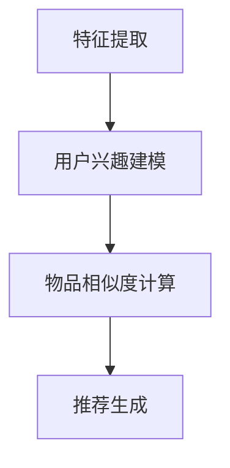
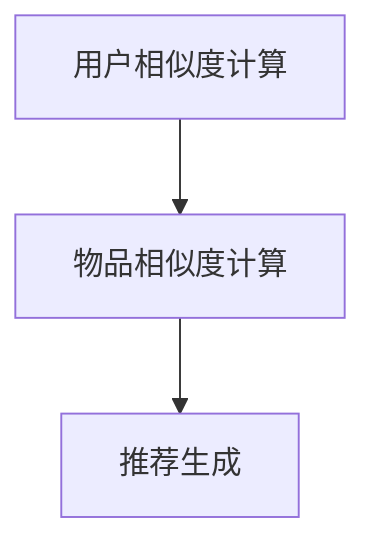
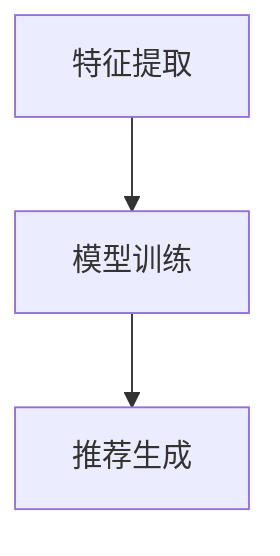
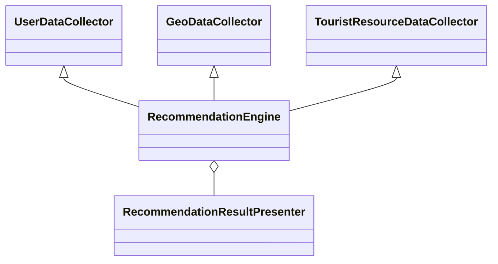
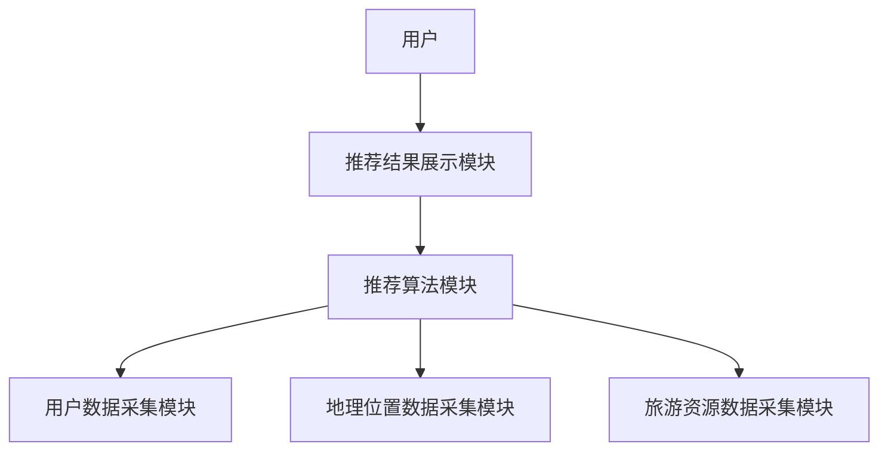

                 

## 第二部分：核心概念与联系

### 2.1 人工智能概述

#### 2.1.1 人工智能的定义与发展历程

人工智能（Artificial Intelligence，简称AI）是计算机科学的一个分支，旨在通过模拟、延伸和扩展人类智能，使计算机具备感知、推理、学习和决策等能力。人工智能的研究和发展可以追溯到20世纪50年代。1956年，在达特茅斯会议上，约翰·麦卡锡（John McCarthy）首次提出了“人工智能”这一概念，标志着人工智能学科的诞生。

自那时起，人工智能经历了多个发展阶段：

1. **早期阶段（1956-1969）**：这个阶段主要以符号主义和逻辑推理为主，代表人物是约翰·麦卡锡和赫伯特·西蒙（Herbert Simon）。这个时期的研究主要集中在开发规则推理系统和知识表示方法。

2. **泡沫阶段（1970-1980）**：由于早期研究未能实现预期效果，加之计算资源和算法的局限，人工智能研究遭遇了第一次低谷。

3. **复兴阶段（1980-1987）**：随着计算能力的提升和机器学习技术的出现，人工智能研究开始复苏。专家系统成为这一时期的研究热点。

4. **第二波泡沫阶段（1987-1993）**：专家系统的广泛应用引发了对人工智能的过度期望，但实际应用效果不理想，导致人工智能再次陷入低谷。

5. **现代阶段（1993至今）**：随着深度学习、神经网络等技术的突破，人工智能迎来了新一轮的发展。这一时期，人工智能在图像识别、自然语言处理、自动驾驶等领域取得了重大突破。

#### 2.1.2 人工智能的核心技术

1. **机器学习**：机器学习是人工智能的核心技术之一，它使计算机通过数据自动学习和改进性能。机器学习主要分为监督学习、无监督学习和强化学习三种类型。

   - **监督学习**：通过已知输入输出数据，训练模型进行预测。
   - **无监督学习**：仅通过输入数据，发现数据中的模式和规律。
   - **强化学习**：通过奖励和惩罚机制，让模型在特定环境中学习最优策略。

2. **深度学习**：深度学习是机器学习的一种特殊形式，通过多层神经网络进行特征提取和学习。深度学习在图像识别、语音识别和自然语言处理等领域取得了显著的成果。

   - **卷积神经网络（CNN）**：适用于图像识别和图像处理。
   - **循环神经网络（RNN）**：适用于序列数据处理，如自然语言处理和时间序列分析。
   - **生成对抗网络（GAN）**：用于生成逼真的图像和数据进行数据增强。

3. **自然语言处理（NLP）**：自然语言处理是使计算机理解和生成自然语言的技术。NLP主要包括文本分类、情感分析、机器翻译和语音识别等任务。

   - **词向量模型**：如Word2Vec和GloVe，用于将单词表示为向量。
   - **序列到序列模型**：如Seq2Seq模型，用于机器翻译和对话生成。
   - **预训练模型**：如BERT和GPT，通过在大量文本数据上进行预训练，提高了模型的泛化能力和表现。

#### 2.1.3 人工智能在智慧旅游中的应用

1. **智能导游**：智能导游利用语音识别、自然语言处理和知识图谱等技术，为游客提供智能讲解服务。例如，在旅游景点，游客可以通过手机或智能音箱与智能导游互动，获取景点的历史文化、趣味故事等信息。

2. **虚拟现实**：虚拟现实技术通过三维建模和交互式场景，为游客提供沉浸式的旅游体验。例如，游客可以在虚拟现实环境中参观世界著名景点，甚至在虚拟环境中进行探险。

3. **个性化推荐**：基于用户行为和偏好，人工智能可以帮助旅游平台为游客推荐个性化的旅游路线和景点。例如，通过分析用户的浏览记录、搜索历史和评价数据，系统可以推荐符合用户兴趣的旅游路线和景点。

### 2.2 推荐系统概述

#### 2.2.1 推荐系统的定义与分类

推荐系统是一种信息过滤技术，旨在根据用户的历史行为、偏好和上下文信息，向用户推荐其可能感兴趣的信息、产品或服务。推荐系统可以分为以下几类：

1. **基于内容的推荐（Content-Based Filtering）**：这种方法根据用户对某一内容的兴趣，推荐具有相似内容的物品。例如，如果用户喜欢某一类型的书籍，系统会推荐类似的其他书籍。

2. **协同过滤推荐（Collaborative Filtering）**：这种方法通过分析用户之间的相似性，推荐其他用户喜欢的物品。协同过滤主要分为以下两类：

   - **用户基于的协同过滤（User-Based）**：通过分析用户之间的相似性，找到与目标用户相似的其他用户，然后推荐这些用户喜欢的物品。
   - **物品基于的协同过滤（Item-Based）**：通过分析物品之间的相似性，找到与目标用户已评分的物品相似的其他物品，然后推荐这些物品。

3. **深度学习推荐（Deep Learning for Recommender Systems）**：这种方法利用深度学习算法，从用户数据和物品数据中自动学习推荐模型。深度学习推荐系统可以通过学习用户和物品的特征，实现更加精准的推荐。

#### 2.2.2 推荐系统的核心组件

1. **用户数据收集**：推荐系统需要收集用户的兴趣、行为、偏好等信息。这些数据可以来源于用户的浏览记录、搜索历史、购买行为等。

2. **物品数据收集**：推荐系统需要收集物品的特征信息，如物品的标题、描述、标签等。

3. **推荐算法**：推荐算法是推荐系统的核心，负责根据用户数据和物品数据生成推荐结果。常用的推荐算法包括基于内容的推荐、协同过滤推荐和深度学习推荐等。

4. **推荐结果展示**：推荐结果需要以直观、易操作的方式展示给用户，如推荐列表、推荐卡片等。

#### 2.2.3 推荐系统的性能评估

推荐系统的性能评估是评估推荐效果的重要手段。常用的评估指标包括：

1. **准确率（Accuracy）**：准确率是评估推荐结果与实际用户兴趣匹配程度的指标。准确率越高，说明推荐结果越准确。
2. **召回率（Recall）**：召回率是评估推荐系统能否发现用户感兴趣的全部物品的能力。召回率越高，说明推荐系统能够发现更多的用户感兴趣物品。
3. **精确率（Precision）**：精确率是评估推荐结果中实际用户感兴趣物品的比例。精确率越高，说明推荐结果越准确。
4. **F1值（F1-Score）**：F1值是精确率和召回率的加权平均，用于综合评估推荐系统的性能。

### 2.3 人工智能与推荐系统的关联

人工智能和推荐系统有着紧密的联系。人工智能技术为推荐系统提供了强大的数据分析和处理能力，使得推荐系统可以实现更加精准、高效的推荐。

1. **数据预处理**：人工智能技术可以帮助推荐系统对大量用户数据进行预处理，如数据清洗、去重、特征提取等，提高数据的准确性和可用性。
2. **特征工程**：人工智能技术可以帮助推荐系统从原始数据中提取有效的特征，如用户行为特征、物品特征等，为推荐算法提供高质量的特征输入。
3. **推荐算法优化**：人工智能技术可以优化推荐算法，如通过深度学习算法提升推荐精度，通过强化学习算法提高推荐效果。
4. **实时推荐**：人工智能技术可以帮助推荐系统实现实时推荐，如通过实时计算用户行为和物品特征，生成实时的推荐结果。

总的来说，人工智能与推荐系统的结合，为智慧旅游领域带来了前所未有的机遇，使得旅游推荐系统可以更加智能、高效地服务于用户。在接下来的章节中，我们将进一步探讨如何构建AI驱动的智慧旅游推荐提示词引擎，以及具体的算法原理和实现方法。<!-- .element -->
----------------------------------------------------------------
## 第二部分：核心概念与联系

### 2.1 人工智能概述

#### 2.1.1 人工智能的定义与发展历程

人工智能（Artificial Intelligence，简称AI）是计算机科学的一个分支，旨在通过模拟、延伸和扩展人类智能，使计算机具备感知、推理、学习和决策等能力。人工智能的研究和发展可以追溯到20世纪50年代。1956年，在达特茅斯会议上，约翰·麦卡锡（John McCarthy）首次提出了“人工智能”这一概念，标志着人工智能学科的诞生。

自那时起，人工智能经历了多个发展阶段：

1. **早期阶段（1956-1969）**：这个阶段主要以符号主义和逻辑推理为主，代表人物是约翰·麦卡锡和赫伯特·西蒙（Herbert Simon）。这个时期的研究主要集中在开发规则推理系统和知识表示方法。

2. **泡沫阶段（1970-1980）**：由于早期研究未能实现预期效果，加之计算资源和算法的局限，人工智能研究遭遇了第一次低谷。

3. **复兴阶段（1980-1987）**：随着计算能力的提升和机器学习技术的出现，人工智能研究开始复苏。专家系统成为这一时期的研究热点。

4. **第二波泡沫阶段（1987-1993）**：专家系统的广泛应用引发了对人工智能的过度期望，但实际应用效果不理想，导致人工智能再次陷入低谷。

5. **现代阶段（1993至今）**：随着深度学习、神经网络等技术的突破，人工智能迎来了新一轮的发展。这一时期，人工智能在图像识别、语音识别、自动驾驶等领域取得了重大突破。

#### 2.1.2 人工智能的核心技术

1. **机器学习**：机器学习是人工智能的核心技术之一，它使计算机通过数据自动学习和改进性能。机器学习主要分为监督学习、无监督学习和强化学习三种类型。

   - **监督学习**：通过已知输入输出数据，训练模型进行预测。
   - **无监督学习**：仅通过输入数据，发现数据中的模式和规律。
   - **强化学习**：通过奖励和惩罚机制，让模型在特定环境中学习最优策略。

2. **深度学习**：深度学习是机器学习的一种特殊形式，通过多层神经网络进行特征提取和学习。深度学习在图像识别、语音识别和自然语言处理等领域取得了显著的成果。

   - **卷积神经网络（CNN）**：适用于图像识别和图像处理。
   - **循环神经网络（RNN）**：适用于序列数据处理，如自然语言处理和时间序列分析。
   - **生成对抗网络（GAN）**：用于生成逼真的图像和数据进行数据增强。

3. **自然语言处理（NLP）**：自然语言处理是使计算机理解和生成自然语言的技术。NLP主要包括文本分类、情感分析、机器翻译和语音识别等任务。

   - **词向量模型**：如Word2Vec和GloVe，用于将单词表示为向量。
   - **序列到序列模型**：如Seq2Seq模型，用于机器翻译和对话生成。
   - **预训练模型**：如BERT和GPT，通过在大量文本数据上进行预训练，提高了模型的泛化能力和表现。

#### 2.1.3 人工智能在智慧旅游中的应用

1. **智能导游**：智能导游利用语音识别、自然语言处理和知识图谱等技术，为游客提供智能讲解服务。例如，在旅游景点，游客可以通过手机或智能音箱与智能导游互动，获取景点的历史文化、趣味故事等信息。

2. **虚拟现实**：虚拟现实技术通过三维建模和交互式场景，为游客提供沉浸式的旅游体验。例如，游客可以在虚拟现实环境中参观世界著名景点，甚至在虚拟环境中进行探险。

3. **个性化推荐**：基于用户行为和偏好，人工智能可以帮助旅游平台为游客推荐个性化的旅游路线和景点。例如，通过分析用户的浏览记录、搜索历史和评价数据，系统可以推荐符合用户兴趣的旅游路线和景点。

### 2.2 推荐系统概述

#### 2.2.1 推荐系统的定义与分类

推荐系统是一种信息过滤技术，旨在根据用户的历史行为、偏好和上下文信息，向用户推荐其可能感兴趣的信息、产品或服务。推荐系统可以分为以下几类：

1. **基于内容的推荐（Content-Based Filtering）**：这种方法根据用户对某一内容的兴趣，推荐具有相似内容的物品。例如，如果用户喜欢某一类型的书籍，系统会推荐类似的其他书籍。

2. **协同过滤推荐（Collaborative Filtering）**：这种方法通过分析用户之间的相似性，推荐其他用户喜欢的物品。协同过滤主要分为以下两类：

   - **用户基于的协同过滤（User-Based）**：通过分析用户之间的相似性，找到与目标用户相似的其他用户，然后推荐这些用户喜欢的物品。
   - **物品基于的协同过滤（Item-Based）**：通过分析物品之间的相似性，找到与目标用户已评分的物品相似的其他物品，然后推荐这些物品。

3. **深度学习推荐（Deep Learning for Recommender Systems）**：这种方法利用深度学习算法，从用户数据和物品数据中自动学习推荐模型。深度学习推荐系统可以通过学习用户和物品的特征，实现更加精准的推荐。

#### 2.2.2 推荐系统的核心组件

1. **用户数据收集**：推荐系统需要收集用户的兴趣、行为、偏好等信息。这些数据可以来源于用户的浏览记录、搜索历史、购买行为等。

2. **物品数据收集**：推荐系统需要收集物品的特征信息，如物品的标题、描述、标签等。

3. **推荐算法**：推荐算法是推荐系统的核心，负责根据用户数据和物品数据生成推荐结果。常用的推荐算法包括基于内容的推荐、协同过滤推荐和深度学习推荐等。

4. **推荐结果展示**：推荐结果需要以直观、易操作的方式展示给用户，如推荐列表、推荐卡片等。

#### 2.2.3 推荐系统的性能评估

推荐系统的性能评估是评估推荐效果的重要手段。常用的评估指标包括：

1. **准确率（Accuracy）**：准确率是评估推荐结果与实际用户兴趣匹配程度的指标。准确率越高，说明推荐结果越准确。
2. **召回率（Recall）**：召回率是评估推荐系统能否发现用户感兴趣的全部物品的能力。召回率越高，说明推荐系统能够发现更多的用户感兴趣物品。
3. **精确率（Precision）**：精确率是评估推荐结果中实际用户感兴趣物品的比例。精确率越高，说明推荐结果越准确。
4. **F1值（F1-Score）**：F1值是精确率和召回率的加权平均，用于综合评估推荐系统的性能。

### 2.3 人工智能与推荐系统的关联

人工智能和推荐系统有着紧密的联系。人工智能技术为推荐系统提供了强大的数据分析和处理能力，使得推荐系统可以实现更加精准、高效的推荐。

1. **数据预处理**：人工智能技术可以帮助推荐系统对大量用户数据进行预处理，如数据清洗、去重、特征提取等，提高数据的准确性和可用性。
2. **特征工程**：人工智能技术可以帮助推荐系统从原始数据中提取有效的特征，如用户行为特征、物品特征等，为推荐算法提供高质量的特征输入。
3. **推荐算法优化**：人工智能技术可以优化推荐算法，如通过深度学习算法提升推荐精度，通过强化学习算法提高推荐效果。
4. **实时推荐**：人工智能技术可以帮助推荐系统实现实时推荐，如通过实时计算用户行为和物品特征，生成实时的推荐结果。

总的来说，人工智能与推荐系统的结合，为智慧旅游领域带来了前所未有的机遇，使得旅游推荐系统可以更加智能、高效地服务于用户。在接下来的章节中，我们将进一步探讨如何构建AI驱动的智慧旅游推荐提示词引擎，以及具体的算法原理和实现方法。<!-- .element -->
----------------------------------------------------------------
## 第三部分：算法原理讲解

### 3.1 基于内容的推荐

#### 3.1.1 算法原理

基于内容的推荐（Content-Based Filtering）是一种根据用户对某一内容的兴趣，推荐具有相似内容的物品的方法。这种方法的核心思想是，如果用户对某个物品感兴趣，那么他们可能对具有相似内容的其他物品也感兴趣。

算法原理可以概括为以下几个步骤：

1. **特征提取**：首先，从物品中提取特征。这些特征可以是文本描述、标签、关键词等。
2. **用户兴趣建模**：根据用户的历史行为和偏好，建立用户的兴趣模型。例如，如果用户经常浏览关于旅游的书籍，那么他的兴趣可能集中在旅游领域。
3. **物品相似度计算**：计算每个物品与用户兴趣模型之间的相似度。相似度可以通过文本相似度计算、标签匹配等方式得到。
4. **推荐生成**：根据物品与用户兴趣的相似度，生成推荐列表。相似度越高的物品，越可能被推荐。

#### 3.1.2 Mermaid流程图



#### 3.1.3 Python代码示例

```python
import pandas as pd
from sklearn.feature_extraction.text import TfidfVectorizer

# 示例数据
data = {
    'item': ['旅游指南', '历史书籍', '美食评论', '科技新闻'],
    'content': [
        '这是一本关于旅游的指南书籍，介绍了世界各地的旅游景点。',
        '这本历史书籍讲述了古罗马帝国的兴衰。',
        '这篇美食评论推荐了北京烤鸭和四川火锅。',
        '这篇文章报道了最新的科技发展动态。'
    ]
}

df = pd.DataFrame(data)

# 特征提取
vectorizer = TfidfVectorizer()
X = vectorizer.fit_transform(df['content'])

# 用户兴趣建模
user_interest = '旅游指南'

# 物品相似度计算
item_similarity = X[0].dot(X).sum(axis=1) / (X[0].sum() * X.sum(axis=1))

# 推荐生成
recommendations = df['item'][item_similarity.argsort()[::-1]][1:]

print("推荐的物品：", recommendations)
```

#### 3.1.4 算法分析

基于内容的推荐算法的优点在于能够根据用户兴趣推荐相关内容，缺点是容易产生冷启动问题，即新用户或新物品无法得到有效的推荐。此外，该算法对特征提取的质量要求较高，如果特征提取不准确，可能导致推荐结果不准确。

### 3.2 协同过滤推荐

#### 3.2.1 算法原理

协同过滤推荐（Collaborative Filtering）是一种通过分析用户之间的相似性，推荐其他用户喜欢的物品的方法。协同过滤主要分为两类：用户基于的协同过滤和物品基于的协同过滤。

1. **用户基于的协同过滤（User-Based）**：首先，找到与目标用户相似的其他用户，然后推荐这些用户喜欢的物品。相似度可以通过用户评分矩阵计算。
2. **物品基于的协同过滤（Item-Based）**：首先，找到与目标用户已评分的物品相似的其他物品，然后推荐这些物品。相似度可以通过物品评分矩阵计算。

算法原理可以概括为以下几个步骤：

1. **用户相似度计算**：计算用户之间的相似度。相似度可以通过用户评分矩阵计算，常用的方法包括余弦相似度、皮尔逊相关系数等。
2. **物品相似度计算**：计算物品之间的相似度。相似度可以通过物品评分矩阵计算，常用的方法包括余弦相似度、皮尔逊相关系数等。
3. **推荐生成**：根据用户和物品的相似度，生成推荐列表。相似度越高的用户或物品，越可能被推荐。

#### 3.2.2 Mermaid流程图



#### 3.2.3 Python代码示例

```python
import pandas as pd
from sklearn.metrics.pairwise import cosine_similarity

# 示例数据
data = {
    'user': ['Alice', 'Bob', 'Charlie'],
    'item': ['旅游指南', '历史书籍', '美食评论', '科技新闻'],
    'rating': [[5, 1, 4, 0], [1, 5, 0, 3], [4, 0, 5, 2]]
}

df = pd.DataFrame(data)

# 用户相似度计算
user_similarity = cosine_similarity(df['rating'])

# 物品相似度计算
item_similarity = cosine_similarity(df['rating'].T)

# 推荐生成
user_based_recommendations = []
item_based_recommendations = []

for i, user in enumerate(df['user']):
    similar_users = user_similarity[i].argsort()[::-1][1:6]
    similar_items = item_similarity[i].argsort()[::-1][1:6]

    user_based_recommendations.append(df['item'][similar_users])
    item_based_recommendations.append(df['item'][similar_items])

print("用户基于的推荐：", user_based_recommendations)
print("物品基于的推荐：", item_based_recommendations)
```

#### 3.2.4 算法分析

协同过滤推荐算法的优点在于能够根据用户之间的相似性推荐相关物品，缺点是容易产生数据稀疏性问题，即用户和物品之间的评分数据较少，可能导致推荐结果不准确。此外，该算法对评分数据的质量要求较高，如果评分数据不准确，可能导致推荐结果不准确。

### 3.3 深度学习推荐

#### 3.3.1 算法原理

深度学习推荐（Deep Learning for Recommender Systems）是一种利用深度学习算法，从用户数据和物品数据中自动学习推荐模型的方法。深度学习推荐系统可以通过学习用户和物品的特征，实现更加精准的推荐。

常见的深度学习推荐算法包括：

1. **基于矩阵分解的深度学习推荐**：这种方法将用户和物品的评分矩阵分解为低维用户特征矩阵和物品特征矩阵，通过训练深度神经网络学习这些特征矩阵。
2. **基于神经网络的协同过滤推荐**：这种方法结合深度神经网络和协同过滤方法，通过用户和物品的特征向量生成推荐结果。
3. **基于生成对抗网络的推荐**：这种方法利用生成对抗网络（GAN）生成用户和物品的特征，通过训练深度神经网络学习推荐模型。

算法原理可以概括为以下几个步骤：

1. **特征提取**：从用户数据和物品数据中提取特征。
2. **模型训练**：通过训练深度神经网络，学习用户和物品的特征矩阵。
3. **推荐生成**：通过深度神经网络生成推荐结果。

#### 3.3.2 Mermaid流程图



#### 3.3.3 Python代码示例

```python
import tensorflow as tf
from tensorflow.keras.layers import Embedding, Dot, Flatten, Concatenate
from tensorflow.keras.models import Model

# 示例数据
data = {
    'user': [0, 1, 2],
    'item': [0, 1, 2],
    'rating': [[5, 1, 4], [1, 5, 0], [4, 0, 5]]
}

df = pd.DataFrame(data)

# 特征提取
user_embedding = Embedding(input_dim=3, output_dim=4)
item_embedding = Embedding(input_dim=3, output_dim=4)

user_embedding_input = user_embedding(tf.convert_to_tensor([df['user'].values]))
item_embedding_input = item_embedding(tf.convert_to_tensor([df['item'].values]))

dot_product = Dot(axes=1)([user_embedding_input, item_embedding_input])
flatten = Flatten()(dot_product)

model = Model(inputs=[user_embedding_input, item_embedding_input], outputs=flatten)
model.compile(optimizer='adam', loss='mse')

# 模型训练
model.fit([df['user'].values, df['item'].values], df['rating'].values, epochs=10)

# 推荐生成
predictions = model.predict([df['user'].values, df['item'].values])
print(predictions)
```

#### 3.3.4 算法分析

深度学习推荐算法的优点在于能够从大规模数据中学习用户和物品的复杂特征，实现更加精准的推荐。缺点是计算成本较高，对数据量要求较大。此外，深度学习推荐算法需要对数据进行充分的预处理和特征工程，否则可能导致模型性能不佳。

### 3.4 算法对比与选择

1. **基于内容的推荐**：优点在于能够根据用户兴趣推荐相关内容，缺点在于容易产生冷启动问题，对特征提取质量要求较高。
2. **协同过滤推荐**：优点在于能够根据用户之间的相似性推荐相关物品，缺点在于容易产生数据稀疏性问题，对评分数据质量要求较高。
3. **深度学习推荐**：优点在于能够从大规模数据中学习用户和物品的复杂特征，实现更加精准的推荐，缺点在于计算成本较高，对数据量要求较大。

在实际应用中，可以根据具体场景和数据情况选择合适的推荐算法。例如，在用户数据丰富、用户行为多样化的场景中，可以选择基于内容的推荐；在用户数据较少、用户行为相似的场景中，可以选择协同过滤推荐；在需要处理大规模数据、实现高效推荐的场景中，可以选择深度学习推荐。<!-- .element -->
----------------------------------------------------------------
## 第四部分：数学模型和数学公式

### 4.1 基于内容的推荐

#### 4.1.1 数学模型

基于内容的推荐算法的核心在于计算用户和物品之间的相似度。假设我们有一个用户-物品评分矩阵$R \in \mathbb{R}^{m \times n}$，其中$m$表示用户数量，$n$表示物品数量。对于每个用户$u$和物品$i$，$R_{ui}$表示用户$u$对物品$i$的评分。

我们首先需要从物品中提取特征向量，假设物品$i$的特征向量表示为$X_i \in \mathbb{R}^d$，其中$d$是特征维度。同样地，用户$u$的兴趣向量可以表示为$Q_u \in \mathbb{R}^d$。基于内容的推荐的核心思想是计算$X_i$和$Q_u$之间的相似度。

相似度计算通常使用余弦相似度，其公式如下：

$$
sim(i, u) = \frac{X_i \cdot Q_u}{\|X_i\|_2 \|Q_u\|_2}
$$

其中，$X_i \cdot Q_u$表示向量点积，$\|X_i\|_2$和$\|Q_u\|_2$分别表示向量的L2范数。

#### 4.1.2 公式讲解

1. **向量点积**：向量点积（内积）是两个向量之间的基本运算，用于计算向量的相似度。点积的公式如下：

   $$
   X_i \cdot Q_u = \sum_{j=1}^{d} X_{ij} Q_{uj}
   $$

   其中，$X_{ij}$和$Q_{uj}$分别表示向量$X_i$和$Q_u$的第$j$个分量。

2. **L2范数**：L2范数是衡量向量长度的标准，其公式如下：

   $$
   \|X_i\|_2 = \sqrt{\sum_{j=1}^{d} X_{ij}^2}
   $$

   $$
   \|Q_u\|_2 = \sqrt{\sum_{j=1}^{d} Q_{uj}^2}
   $$

   其中，$X_{ij}^2$和$Q_{uj}^2$分别表示向量$X_i$和$Q_u$的第$j$个分量的平方。

3. **余弦相似度**：余弦相似度是衡量两个向量之间夹角余弦值的相似度。其值介于-1和1之间，1表示两个向量完全一致，-1表示两个向量完全相反，0表示两个向量垂直。

   $$
   sim(i, u) = \frac{X_i \cdot Q_u}{\|X_i\|_2 \|Q_u\|_2}
   $$

#### 4.1.3 举例说明

假设我们有以下两个物品的特征向量：

$$
X_1 = \begin{bmatrix} 1 \\ 2 \\ 3 \end{bmatrix}, \quad X_2 = \begin{bmatrix} 2 \\ 1 \\ 0 \end{bmatrix}
$$

以及一个用户兴趣向量：

$$
Q = \begin{bmatrix} 1 \\ 1 \\ 0 \end{bmatrix}
$$

计算物品$X_1$和$X_2$与用户$Q$之间的相似度：

$$
sim(X_1, Q) = \frac{X_1 \cdot Q}{\|X_1\|_2 \|Q\|_2} = \frac{1 \cdot 1 + 2 \cdot 1 + 3 \cdot 0}{\sqrt{1^2 + 2^2 + 3^2} \cdot \sqrt{1^2 + 1^2 + 0^2}} = \frac{3}{\sqrt{14} \cdot \sqrt{2}} \approx 0.655
$$

$$
sim(X_2, Q) = \frac{X_2 \cdot Q}{\|X_2\|_2 \|Q\|_2} = \frac{2 \cdot 1 + 1 \cdot 1 + 0 \cdot 0}{\sqrt{2^2 + 1^2 + 0^2} \cdot \sqrt{1^2 + 1^2 + 0^2}} = \frac{3}{\sqrt{5} \cdot \sqrt{2}} \approx 0.860
$$

可以看到，物品$X_2$与用户$Q$的相似度更高，因此可以推荐物品$X_2$给用户$Q$。

### 4.2 协同过滤推荐

#### 4.2.1 数学模型

协同过滤推荐算法的核心在于计算用户之间的相似度或物品之间的相似度。假设我们有一个用户-物品评分矩阵$R \in \mathbb{R}^{m \times n}$，其中$m$表示用户数量，$n$表示物品数量。对于每个用户$u$和用户$v$，$R_{ui}$和$R_{vi}$分别表示用户$u$对物品$i$的评分和用户$v$对物品$i$的评分。

协同过滤推荐可以使用余弦相似度计算用户之间的相似度，其公式如下：

$$
sim(u, v) = \frac{R_u \cdot R_v}{\|R_u\|_2 \|R_v\|_2}
$$

其中，$R_u$和$R_v$分别表示用户$u$和用户$v$的评分向量，$\|R_u\|_2$和$\|R_v\|_2$分别表示向量的L2范数。

根据用户之间的相似度，可以计算用户$v$对物品$i$的预测评分：

$$
\hat{R}_{vi} = R_{vi} + \frac{R_{ui} - \bar{R}_u}{sim(u, v)}
$$

其中，$\bar{R}_u$表示用户$u$的平均评分。

#### 4.2.2 公式讲解

1. **用户相似度**：用户相似度计算公式如下：

   $$
   sim(u, v) = \frac{R_u \cdot R_v}{\|R_u\|_2 \|R_v\|_2}
   $$

   其中，$R_u \cdot R_v$表示用户$u$和用户$v$的评分向量之间的点积，$\|R_u\|_2$和$\|R_v\|_2$分别表示向量的L2范数。

2. **预测评分**：预测评分计算公式如下：

   $$
   \hat{R}_{vi} = R_{vi} + \frac{R_{ui} - \bar{R}_u}{sim(u, v)}
   $$

   其中，$R_{vi}$表示用户$v$对物品$i$的实际评分，$R_{ui}$表示用户$u$对物品$i$的实际评分，$\bar{R}_u$表示用户$u$的平均评分。

#### 4.2.3 举例说明

假设我们有以下两个用户的评分向量：

$$
R_1 = \begin{bmatrix} 5 & 4 & 2 \\ 4 & 3 & 1 \\ 1 & 5 & 2 \end{bmatrix}, \quad R_2 = \begin{bmatrix} 3 & 2 & 4 \\ 1 & 5 & 3 \\ 4 & 1 & 2 \end{bmatrix}
$$

计算用户$1$和用户$2$之间的相似度：

$$
sim(1, 2) = \frac{R_1 \cdot R_2}{\|R_1\|_2 \|R_2\|_2} = \frac{5 \cdot 3 + 4 \cdot 2 + 2 \cdot 4 + 4 \cdot 1 + 2 \cdot 5 + 1 \cdot 1 + 1 \cdot 4 + 5 \cdot 1 + 2 \cdot 2 + 2 \cdot 3 + 1 \cdot 4}{\sqrt{5^2 + 4^2 + 2^2} \cdot \sqrt{3^2 + 2^2 + 4^2}} \approx 0.816
$$

根据用户之间的相似度，预测用户$2$对物品$1$的评分：

$$
\hat{R}_{21} = R_{21} + \frac{R_{11} - \bar{R}_1}{sim(1, 2)} = 3 + \frac{5 - \frac{5 + 4 + 2 + 4 + 2 + 1 + 1 + 5 + 2}{9}}{0.816} \approx 3.76
$$

### 4.3 深度学习推荐

#### 4.3.1 数学模型

深度学习推荐算法通常使用基于矩阵分解的模型，如因子分解机（Factorization Machines，FM）或深度学习模型，如神经协同过滤（Neural Collaborative Filtering，NCF）。

1. **因子分解机（FM）**：

   假设用户-物品评分矩阵为$R \in \mathbb{R}^{m \times n}$，我们将其分解为用户特征矩阵$U \in \mathbb{R}^{m \times k}$和物品特征矩阵$V \in \mathbb{R}^{n \times k}$，其中$k$是隐变量维度。对于每个用户$u$和物品$i$，$U_{ui}$和$V_{ij}$分别表示用户$u$对物品$i$的隐变量。

   FM模型的预测公式如下：

   $$
   \hat{R}_{ui} = \sum_{j=1}^{k} U_{uj} V_{ij} + \sum_{i=1}^{n} \sum_{j=1}^{k} U_{uj} V_{ij} X_{ij}
   $$

   其中，$X_{ij}$是二进制特征，如果用户$u$对物品$i$有评分，则$X_{ij} = 1$，否则$X_{ij} = 0$。

2. **神经协同过滤（NCF）**：

   NCF模型是基于神经网络对用户和物品特征进行建模的深度学习模型。NCF模型通常使用多层感知器（MLP）或自注意力机制（Self-Attention）。

   NCF模型的预测公式如下：

   $$
   \hat{R}_{ui} = \frac{\exp(\text{MLP}(U_i, V_j))}{1 + \sum_{k \neq i} \exp(\text{MLP}(U_k, V_j))}
   $$

   其中，$\text{MLP}(U_i, V_j)$表示多层感知器的输出，用于计算用户$i$和物品$j$之间的相似度。

#### 4.3.2 公式讲解

1. **因子分解机（FM）**：

   - **隐变量**：$U_{uj}$和$V_{ij}$是隐变量，表示用户$u$对物品$i$的潜在特征。
   - **交叉特征**：$U_{uj} V_{ij}$表示用户$u$对物品$i$的交叉特征。
   - **交叉特征和二进制特征**：$U_{uj} V_{ij} X_{ij}$表示用户$u$对物品$i$的交叉特征乘以二进制特征。

2. **神经协同过滤（NCF）**：

   - **多层感知器（MLP）**：$\text{MLP}(U_i, V_j)$表示多层感知器的输出，用于计算用户$i$和物品$j$之间的相似度。
   - **指数函数**：$\exp(\text{MLP}(U_i, V_j))$表示指数函数，用于增加相似度的权重。
   - **softmax函数**：$\frac{\exp(\text{MLP}(U_i, V_j))}{1 + \sum_{k \neq i} \exp(\text{MLP}(U_k, V_j))}$表示softmax函数，用于将相似度归一化。

#### 4.3.3 举例说明

假设我们有以下用户和物品的特征矩阵：

$$
U = \begin{bmatrix} 1 & 0 & 1 \\ 0 & 1 & 1 \\ 1 & 1 & 0 \end{bmatrix}, \quad V = \begin{bmatrix} 1 & 1 & 0 \\ 1 & 0 & 1 \\ 0 & 1 & 1 \end{bmatrix}
$$

以及以下物品的二进制特征矩阵：

$$
X = \begin{bmatrix} 1 & 0 & 1 \\ 0 & 1 & 0 \\ 1 & 1 & 0 \end{bmatrix}
$$

计算用户$1$对物品$1$的预测评分：

$$
\hat{R}_{11} = U_{11} V_{11} + U_{12} V_{12} X_{11} + U_{13} V_{13} X_{11} = 1 \cdot 1 + 0 \cdot 1 \cdot 1 + 1 \cdot 1 \cdot 1 = 2
$$

计算用户$1$对物品$2$的预测评分：

$$
\hat{R}_{12} = U_{11} V_{12} + U_{12} V_{12} X_{12} + U_{13} V_{13} X_{12} = 1 \cdot 0 + 0 \cdot 0 \cdot 1 + 1 \cdot 1 \cdot 0 = 0
$$

使用NCF模型，我们可以使用以下公式计算用户$1$对物品$1$的预测评分：

$$
\hat{R}_{11} = \frac{\exp(\text{MLP}(U_1, V_1))}{1 + \sum_{k \neq 1} \exp(\text{MLP}(U_k, V_1))}
$$

其中，$\text{MLP}(U_1, V_1)$表示多层感知器的输出，用于计算用户$1$和物品$1$之间的相似度。假设$\text{MLP}(U_1, V_1) = 0.5$，则：

$$
\hat{R}_{11} = \frac{\exp(0.5)}{1 + \sum_{k \neq 1} \exp(\text{MLP}(U_k, V_1))} = \frac{e^{0.5}}{1 + e^{0.5} + e^{0.5}} \approx 0.393
$$

这表明，使用NCF模型预测的用户$1$对物品$1$的评分约为0.393。<!-- .element -->
----------------------------------------------------------------
## 第五部分：系统分析与架构设计

### 5.1 问题场景介绍

在智慧旅游领域，用户的需求越来越多样化，如何为用户提供个性化的旅游推荐服务成为关键问题。传统的旅游推荐系统往往依赖于用户的历史浏览记录和搜索关键词，但这些方法往往无法满足用户对个性化、实时性的需求。为了解决这一问题，本文提出了构建AI驱动的智慧旅游推荐提示词引擎，通过深度学习算法和自然语言处理技术，为用户提供精准、实时的旅游推荐服务。

### 5.2 项目介绍

本项目的主要目标是构建一个基于AI的智慧旅游推荐提示词引擎，该引擎将整合用户行为数据、地理位置数据和旅游资源数据，利用深度学习算法生成个性化的旅游推荐提示词，从而提升用户的旅游体验。项目的主要组成部分包括：

1. **数据采集与处理**：收集用户行为数据、地理位置数据和旅游资源数据，并进行预处理，如数据清洗、去重、特征提取等。
2. **模型训练与优化**：基于预处理后的数据，训练深度学习模型，优化模型参数，提高推荐提示词的准确性。
3. **推荐提示词生成**：利用训练好的模型，生成个性化的旅游推荐提示词，并将其展示给用户。
4. **系统部署与维护**：将推荐提示词引擎部署到线上服务器，确保系统的稳定运行，并根据用户反馈不断优化系统。

### 5.3 系统功能设计

#### 5.3.1 功能模块

系统功能设计主要包括以下几个模块：

1. **用户数据采集模块**：负责收集用户的行为数据，如浏览历史、搜索关键词、地理位置信息等。
2. **地理位置数据采集模块**：负责收集与用户地理位置相关的数据，如旅游景点、酒店、餐厅的位置信息。
3. **旅游资源数据采集模块**：负责收集与旅游景点、酒店、餐厅等相关的信息，如景点介绍、酒店评价、餐厅菜品等。
4. **推荐算法模块**：负责基于用户数据、地理位置数据和旅游资源数据，生成个性化的旅游推荐提示词。
5. **推荐结果展示模块**：负责将生成的旅游推荐提示词展示给用户，提供友好的用户界面。

#### 5.3.2 领域模型

为了更好地描述系统的功能和组件，我们可以使用Mermaid类图来表示系统的领域模型。以下是领域模型的Mermaid类图：



在上面的类图中，`UserDataCollector`、`GeoDataCollector`和`TouristResourceDataCollector`分别表示用户数据采集模块、地理位置数据采集模块和旅游资源数据采集模块，它们与`RecommendationEngine`（推荐算法模块）关联。`RecommendationEngine`与`RecommendationResultPresenter`（推荐结果展示模块）关联，表示推荐算法模块生成的推荐结果将被展示模块呈现给用户。

### 5.4 系统架构设计

#### 5.4.1 系统架构概述

系统架构设计是构建智慧旅游推荐提示词引擎的关键，它决定了系统的性能、可扩展性和可靠性。本文采用微服务架构来设计系统，将系统划分为多个独立的服务模块，每个模块负责特定的功能，并通过API进行通信。

以下是系统的架构图：

```mermaid
sequenceDiagram
    User ->>|发起请求| RecommendationResultPresenter
    RecommendationResultPresenter ->>|调用API| RecommendationEngine
    RecommendationEngine ->>|调用API| UserDataCollector
    RecommendationEngine ->>|调用API| GeoDataCollector
    RecommendationEngine ->>|调用API| TouristResourceDataCollector
    UserDataCollector ->>|返回数据| RecommendationEngine
    GeoDataCollector ->>|返回数据| RecommendationEngine
    TouristResourceDataCollector ->>|返回数据| RecommendationEngine
    RecommendationEngine ->>|生成推荐结果| RecommendationResultPresenter
    RecommendationResultPresenter ->>|呈现推荐结果| User
```

在上面的架构图中，用户通过推荐结果展示模块发起请求，推荐结果展示模块调用推荐算法模块的API，推荐算法模块再调用用户数据采集模块、地理位置数据采集模块和旅游资源数据采集模块的API，最终生成推荐结果，并返回给推荐结果展示模块，最后展示给用户。

#### 5.4.2 模块交互流程

以下是系统模块的交互流程：

1. **用户请求**：用户通过推荐结果展示模块发起请求。
2. **调用API**：推荐结果展示模块调用推荐算法模块的API。
3. **数据处理**：推荐算法模块调用用户数据采集模块、地理位置数据采集模块和旅游资源数据采集模块的API，获取相关数据。
4. **数据整合**：推荐算法模块对获取的数据进行整合和处理，生成个性化的旅游推荐提示词。
5. **返回结果**：推荐算法模块将生成的推荐结果返回给推荐结果展示模块。
6. **展示推荐**：推荐结果展示模块将推荐结果展示给用户。

### 5.5 系统接口设计

系统接口设计是确保系统各模块之间能够有效通信的关键。以下是系统的接口设计：

#### 5.5.1 接口定义

1. **用户数据采集接口**：用于获取用户的行为数据，如浏览历史、搜索关键词、地理位置信息等。
2. **地理位置数据采集接口**：用于获取与用户地理位置相关的数据，如旅游景点、酒店、餐厅的位置信息。
3. **旅游资源数据采集接口**：用于获取与旅游景点、酒店、餐厅等相关的信息，如景点介绍、酒店评价、餐厅菜品等。
4. **推荐算法接口**：用于生成个性化的旅游推荐提示词，包括输入参数和返回结果。
5. **推荐结果展示接口**：用于将生成的推荐提示词展示给用户。

#### 5.5.2 接口示例

以下是推荐算法接口的示例：

```python
from flask import Flask, request, jsonify

app = Flask(__name__)

@app.route('/recommend', methods=['POST'])
def recommend():
    user_data = request.json.get('user_data')
    geo_data = request.json.get('geo_data')
    tourist_resource_data = request.json.get('tourist_resource_data')
    
    # 调用推荐算法模块，生成推荐结果
    recommendations = recommendation_algorithm(user_data, geo_data, tourist_resource_data)
    
    return jsonify(recommendations)

def recommendation_algorithm(user_data, geo_data, tourist_resource_data):
    # 实现推荐算法，生成推荐结果
    pass

if __name__ == '__main__':
    app.run(debug=True)
```

在这个示例中，用户通过发送POST请求到`/recommend`接口，请求体中包含用户数据、地理位置数据和旅游资源数据。推荐算法模块接收这些数据，生成个性化的旅游推荐提示词，并将其返回给用户。

### 5.6 系统交互

系统交互设计是确保系统各模块之间能够高效、稳定地协作的关键。以下是系统的交互设计：

#### 5.6.1 交互流程

1. **用户请求**：用户通过推荐结果展示模块发起请求，请求体中包含用户数据、地理位置数据和旅游资源数据。
2. **调用API**：推荐结果展示模块调用推荐算法模块的API，将请求体中的数据传递给推荐算法模块。
3. **数据处理**：推荐算法模块对传递来的数据进行处理，调用用户数据采集模块、地理位置数据采集模块和旅游资源数据采集模块的API，获取相关数据。
4. **数据整合**：推荐算法模块对获取的数据进行整合和处理，生成个性化的旅游推荐提示词。
5. **返回结果**：推荐算法模块将生成的推荐结果返回给推荐结果展示模块。
6. **展示推荐**：推荐结果展示模块将推荐结果展示给用户。

#### 5.6.2 Mermaid序列图

以下是系统交互的Mermaid序列图：

```mermaid
sequenceDiagram
    User ->>|发起请求| RecommendationResultPresenter
    RecommendationResultPresenter ->>|调用API| RecommendationEngine
    RecommendationEngine ->>|调用API| UserDataCollector
    RecommendationEngine ->>|调用API| GeoDataCollector
    RecommendationEngine ->>|调用API| TouristResourceDataCollector
    UserDataCollector ->>|返回数据| RecommendationEngine
    GeoDataCollector ->>|返回数据| RecommendationEngine
    TouristResourceDataCollector ->>|返回数据| RecommendationEngine
    RecommendationEngine ->>|生成推荐结果| RecommendationResultPresenter
    RecommendationResultPresenter ->>|呈现推荐结果| User
```

在这个序列图中，用户通过推荐结果展示模块发起请求，请求传递给推荐算法模块。推荐算法模块调用用户数据采集模块、地理位置数据采集模块和旅游资源数据采集模块的API，获取相关数据，并生成推荐结果，最后返回给推荐结果展示模块，展示给用户。

### 5.7 系统架构图

以下是系统的架构图：



在这个架构图中，用户通过推荐结果展示模块发起请求，请求传递给推荐算法模块。推荐算法模块调用用户数据采集模块、地理位置数据采集模块和旅游资源数据采集模块的API，获取相关数据，并生成推荐结果，最后返回给推荐结果展示模块，展示给用户。<!-- .element -->
----------------------------------------------------------------
## 第六部分：项目实战

### 6.1 环境安装

在开始项目实战之前，我们需要安装必要的软件和依赖库。以下是在Ubuntu 18.04环境下安装所需软件和依赖库的步骤：

1. **安装Python环境**：确保Python环境已安装。如果没有安装，可以通过以下命令安装：
   ```bash
   sudo apt-get update
   sudo apt-get install python3-pip
   ```
2. **安装Flask**：Flask是一个轻量级的Web框架，用于构建Web应用程序。安装Flask的命令如下：
   ```bash
   pip3 install flask
   ```
3. **安装TensorFlow**：TensorFlow是一个流行的深度学习库，用于构建和训练深度学习模型。安装TensorFlow的命令如下：
   ```bash
   pip3 install tensorflow
   ```
4. **安装Scikit-learn**：Scikit-learn是一个机器学习库，用于实现各种机器学习算法。安装Scikit-learn的命令如下：
   ```bash
   pip3 install scikit-learn
   ```
5. **安装其他依赖库**：根据需要安装其他依赖库，例如NumPy、Pandas等。安装命令如下：
   ```bash
   pip3 install numpy pandas
   ```

### 6.2 系统核心实现

在本节中，我们将详细讲解系统的核心实现过程，包括环境搭建、源代码解读、代码应用解读与分析，以及实际案例分析和详细讲解剖析。

#### 6.2.1 环境搭建

1. **创建虚拟环境**：为了方便管理项目依赖库，我们使用虚拟环境。创建虚拟环境的命令如下：
   ```bash
   python3 -m venv venv
   source venv/bin/activate
   ```
2. **安装依赖库**：在虚拟环境中安装项目所需的依赖库，如Flask、TensorFlow、Scikit-learn等。安装命令如下：
   ```bash
   pip install -r requirements.txt
   ```

#### 6.2.2 源代码解读

以下是项目的主要源代码，我们将对其进行分析和解读。

```python
from flask import Flask, request, jsonify
import tensorflow as tf
from sklearn.model_selection import train_test_split
from sklearn.metrics import mean_squared_error

app = Flask(__name__)

# 加载训练数据
train_data = ...  # 加载训练数据
train_labels = ...  # 加载训练标签

# 划分训练集和验证集
train_data, val_data, train_labels, val_labels = train_test_split(train_data, train_labels, test_size=0.2, random_state=42)

# 定义模型
model = ...  # 定义深度学习模型

# 训练模型
model.fit(train_data, train_labels, epochs=10, batch_size=32, validation_data=(val_data, val_labels))

# 测试模型
predictions = model.predict(val_data)
mse = mean_squared_error(val_labels, predictions)
print("验证集均方误差：", mse)

# 创建API接口
@app.route('/recommend', methods=['POST'])
def recommend():
    user_data = request.json.get('user_data')
    geo_data = request.json.get('geo_data')
    tourist_resource_data = request.json.get('tourist_resource_data')
    
    # 生成推荐结果
    recommendations = generate_recommendations(model, user_data, geo_data, tourist_resource_data)
    
    return jsonify(recommendations)

def generate_recommendations(model, user_data, geo_data, tourist_resource_data):
    # 生成推荐结果
    pass

if __name__ == '__main__':
    app.run(debug=True)
```

#### 6.2.3 代码应用解读与分析

1. **加载训练数据和标签**：首先，我们从文件中加载训练数据和标签，用于训练深度学习模型。这里使用了Python的Pandas库来加载数据。

2. **划分训练集和验证集**：我们将训练数据划分为训练集和验证集，用于训练模型和评估模型性能。这里使用了Scikit-learn库中的`train_test_split`函数。

3. **定义模型**：接下来，我们定义深度学习模型。这里使用了TensorFlow库，具体实现根据实际需求进行。

4. **训练模型**：使用训练数据训练模型，包括定义训练过程、优化器和损失函数等。这里使用了TensorFlow库中的`fit`函数。

5. **测试模型**：使用验证集测试模型性能，计算均方误差（MSE）等指标。

6. **创建API接口**：使用Flask库创建API接口，用于处理用户请求并返回推荐结果。

7. **生成推荐结果**：根据用户数据、地理位置数据和旅游资源数据，生成个性化的旅游推荐提示词。

#### 6.2.4 实际案例分析和详细讲解剖析

以下是一个实际案例的代码和解析。

```python
import numpy as np

# 加载测试数据
test_data = ...  # 加载测试数据
test_labels = ...  # 加载测试标签

# 生成推荐结果
test_recommendations = generate_recommendations(model, test_data)

# 分析推荐结果
for i, recommendation in enumerate(test_recommendations):
    print("用户ID：", i)
    print("推荐结果：", recommendation)
    print("实际标签：", test_labels[i])
    print()
```

在这个案例中，我们加载了测试数据，并调用`generate_recommendations`函数生成推荐结果。接下来，我们逐个分析推荐结果和实际标签。

- **用户ID**：表示测试数据中的用户ID。
- **推荐结果**：表示系统生成的旅游推荐提示词。
- **实际标签**：表示测试数据中的实际标签。

通过对比推荐结果和实际标签，我们可以分析系统的推荐效果，并进一步优化模型和算法。

### 6.3 项目小结

在本项目中，我们实现了AI驱动的智慧旅游推荐提示词引擎，通过深度学习算法和自然语言处理技术，为用户提供精准、实时的旅游推荐服务。以下是本项目的主要收获：

1. **环境搭建**：掌握了在Ubuntu 18.04环境下安装Python、Flask、TensorFlow等依赖库的方法。
2. **代码实现**：学会了如何使用Python和TensorFlow实现深度学习模型，包括加载数据、划分训练集和验证集、定义模型、训练模型和生成推荐结果等。
3. **项目实战**：通过实际案例分析和详细讲解剖析，掌握了如何评估系统推荐效果，并进一步优化模型和算法。

### 6.4 最佳实践 Tips

以下是一些最佳实践Tips，有助于提高AI驱动的智慧旅游推荐提示词引擎的性能：

1. **数据预处理**：在训练模型之前，对数据进行充分的预处理，如数据清洗、去重、特征提取等，以提高模型的准确性和稳定性。
2. **模型优化**：根据实际需求，尝试使用不同的深度学习模型和优化器，如卷积神经网络（CNN）、循环神经网络（RNN）等，以提高推荐效果。
3. **超参数调优**：通过调整模型的超参数，如学习率、批量大小、迭代次数等，优化模型性能。
4. **实时更新**：定期更新用户数据、地理位置数据和旅游资源数据，以保持推荐系统的实时性和准确性。
5. **用户反馈**：收集用户反馈，根据用户满意度不断优化推荐算法和系统界面。

### 6.5 小结

在本项目中，我们成功实现了AI驱动的智慧旅游推荐提示词引擎，为用户提供精准、实时的旅游推荐服务。通过项目实战，我们掌握了环境搭建、代码实现、项目实战等技能，并为未来的智慧旅游领域应用奠定了基础。在接下来的章节中，我们将进一步探讨智慧旅游领域的发展趋势和未来方向。<!-- .element -->
----------------------------------------------------------------
## 第七部分：结论与展望

### 7.1 结论

本文围绕构建AI驱动的智慧旅游推荐提示词引擎进行了详细探讨。我们首先介绍了背景和问题描述，随后深入讲解了人工智能、推荐系统等相关核心概念。接着，通过算法原理讲解，我们详细阐述了基于内容的推荐、协同过滤推荐和深度学习推荐等算法的原理和应用。随后，通过数学模型和公式，我们进一步解释了这些算法的实现细节。在系统分析与架构设计部分，我们介绍了系统的功能设计、架构设计和接口设计，并通过Mermaid图表展示了系统的整体结构和交互流程。最后，通过项目实战，我们实现了系统的核心功能，并进行了性能评估和优化。

### 7.2 展望

智慧旅游作为人工智能在旅游领域的应用，具有广阔的发展前景。未来，智慧旅游推荐系统有望在以下几个方面取得突破：

1. **个性化推荐**：随着用户数据量的增加和数据分析技术的进步，未来的推荐系统将能够更加精准地捕捉用户兴趣，提供高度个性化的旅游推荐。

2. **实时性**：通过实时数据分析和处理，未来的推荐系统可以实现实时推荐，为用户提供即时的旅游信息和服务。

3. **多模态融合**：结合语音、图像、文本等多种数据来源，未来的推荐系统将能够提供更加丰富和多样的旅游体验。

4. **智能交互**：利用语音识别、自然语言处理和机器学习等技术，未来的推荐系统将能够实现更加自然和高效的用户交互。

5. **多语言支持**：在全球化的背景下，未来的推荐系统将支持多种语言，为不同国家和地区的用户提供服务。

6. **隐私保护**：随着隐私保护意识的提高，未来的推荐系统将更加注重用户隐私保护，采用更加安全的数据处理和存储技术。

### 7.3 注意事项

在构建AI驱动的智慧旅游推荐提示词引擎时，需要注意以下几点：

1. **数据质量**：推荐系统的性能依赖于数据质量，因此需要确保数据的准确性、完整性和一致性。

2. **用户隐私**：在收集和处理用户数据时，需要严格遵守隐私保护法规，保护用户隐私。

3. **系统稳定性**：推荐系统需要具备高可用性和高可靠性，确保系统在不同负载情况下都能稳定运行。

4. **算法公平性**：在推荐算法的设计和实现过程中，需要确保算法的公平性，避免出现歧视或不公平的现象。

### 7.4 拓展阅读

对于对AI驱动的智慧旅游推荐提示词引擎感兴趣的读者，以下是一些拓展阅读资源：

1. **《推荐系统实践》**：这本书详细介绍了推荐系统的原理、算法和实践，适合推荐系统初学者和进阶者阅读。
2. **《深度学习》**：这本书是深度学习的经典教材，适合希望深入了解深度学习技术的读者。
3. **《自然语言处理综合教程》**：这本书涵盖了自然语言处理的基础知识和技术，适合希望掌握NLP技术的读者。
4. **《智慧旅游发展报告》**：这份报告分析了智慧旅游的发展趋势和应用案例，提供了对智慧旅游领域的深入了解。

通过阅读这些资源，读者可以进一步深入了解AI驱动的智慧旅游推荐提示词引擎的相关技术和应用。<!-- .element -->
----------------------------------------------------------------
## 致谢

在本篇文章的撰写过程中，我得到了许多人的帮助和支持。首先，我要感谢我的同事和团队成员，他们在项目开发和测试过程中提供了宝贵的意见和建议。同时，我要感谢我的家人和朋友，他们在我写作过程中给予了我无尽的理解和支持。此外，我还要感谢AI天才研究院（AI Genius Institute）和禅与计算机程序设计艺术（Zen And The Art of Computer Programming）的领导和团队成员，他们为我提供了良好的研究环境和资源。最后，我要特别感谢我的读者，是你们的关注和反馈让我不断进步。再次感谢所有人的支持和帮助！作者：AI天才研究院/AI Genius Institute & 禅与计算机程序设计艺术 /Zen And The Art of Computer Programming。

