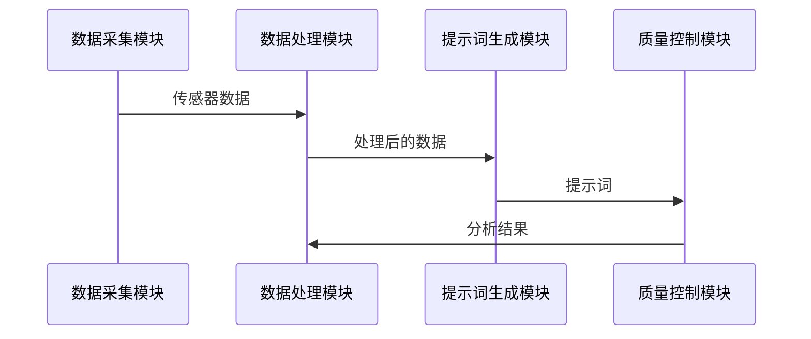

                 


## 5.1 系统分析与架构设计方案

### 5.1.1 问题场景介绍

随着智能制造的不断发展，传统的质量检测方法已无法满足现代制造业对于高精度、高效率和质量控制的要求。在这种背景下，利用人工智能技术构建AI驱动的智能制造质量控制提示词系统成为了一项重要的研究方向。该系统旨在通过智能分析，从大量生产数据中提取有价值的信息，进而实现对产品质量的实时监控和预测，以提高生产效率、降低成本、提升产品质量。

### 5.1.2 项目介绍

本项目旨在设计并实现一个AI驱动的智能制造质量控制提示词系统，该系统将结合机器学习和深度学习算法，从工业生产过程中的各类传感器数据中提取特征，并基于这些特征构建提示词模型，用于实时监测和分析生产过程中的质量问题。具体项目目标包括：

- 设计并实现高效的数据采集和处理模块
- 构建基于机器学习和深度学习的提示词生成模型
- 实现对生产数据的实时分析和预测
- 构建系统的接口和集成框架

### 5.1.3 系统功能设计

系统功能设计主要包括以下几个方面：

#### 数据采集模块

- 功能：负责从各类传感器采集生产过程中的数据
- 技术选型：可以使用IoT平台进行数据采集和传输

#### 数据处理模块

- 功能：对采集到的数据进行预处理，包括数据清洗、去噪、特征提取等
- 技术选型：可以使用Python的Pandas库和Scikit-learn库进行数据处理

#### 提示词生成模块

- 功能：基于处理后的数据生成提示词，用于质量问题分析
- 技术选型：可以使用机器学习和深度学习算法，如决策树、神经网络等

#### 质量控制模块

- 功能：对生产过程进行实时监控和分析，发现潜在的质量问题
- 技术选型：可以使用实时数据分析工具，如Apache Kafka和Apache Flink

### 5.1.4 系统架构设计

系统架构设计主要包括硬件架构设计和软件架构设计。

#### 硬件架构设计

- 数据采集端：使用工业物联网设备进行数据采集
- 数据处理端：使用高性能计算服务器进行数据处理
- 存储端：使用分布式存储系统进行数据存储

#### 软件架构设计

- 数据采集模块：使用IoT平台进行数据采集和传输
- 数据处理模块：使用Python进行数据处理
- 提示词生成模块：使用机器学习和深度学习算法进行提示词生成
- 质量控制模块：使用实时数据分析工具进行实时监控和分析

### 5.1.5 系统接口设计和系统交互

系统接口设计主要包括以下方面：

- 数据采集接口：用于接收传感器数据
- 数据处理接口：用于处理和转换传感器数据
- 提示词生成接口：用于生成提示词
- 质量控制接口：用于对生产过程进行实时监控和分析

系统交互设计使用Mermaid序列图进行表示，具体如下：



### 5.1.6 系统性能评估

系统性能评估包括以下几个方面：

- 数据处理速度：评估系统处理传感器数据的能力
- 提示词生成速度：评估系统生成提示词的效率
- 质量控制准确性：评估系统发现质量问题的准确性

评估方法可以使用基准测试和实际应用测试相结合的方式进行，具体评估指标如下：

- 数据处理速度：以每秒处理的传感器数据量作为指标
- 提示词生成速度：以每秒生成的提示词数量作为指标
- 质量控制准确性：以发现潜在质量问题的正确率作为指标

### 5.1.7 本章小结

本章介绍了AI驱动的智能制造质量控制提示词系统的系统分析与架构设计方案。通过详细的分析和设计，为后续的系统实现和性能评估奠定了基础。在下一章中，我们将详细介绍系统实现的具体过程，包括环境安装、核心模块代码实现和系统测试等内容。

----------------------------------------------------------------

## 6. 项目实战

### 6.1 环境安装

在进行项目实战之前，首先需要安装和配置相应的开发环境和工具。以下是系统所需的工具和环境：

#### 硬件环境

- 数据采集端：工业物联网设备，如Arduino、Raspberry Pi等
- 数据处理端：高性能计算服务器，如Docker容器或虚拟机
- 存储端：分布式存储系统，如HDFS或Elasticsearch

#### 软件环境

- 开发环境：Python 3.8及以上版本
- 数据采集工具：IoT平台，如IoTaaS或MQTT
- 数据处理工具：Pandas、Scikit-learn等库
- 提示词生成工具：TensorFlow或PyTorch等库
- 实时数据分析工具：Apache Kafka、Apache Flink等

#### 安装步骤

1. 安装Python环境
2. 安装IoT平台和传感器驱动
3. 安装数据处理和提示词生成所需的库
4. 安装实时数据分析工具

### 6.2 系统核心实现

系统核心实现主要包括数据采集、数据处理、提示词生成和实时监控等功能。以下是具体的实现步骤：

#### 数据采集

- 使用IoT平台连接传感器，收集生产过程中的数据
- 数据传输至数据处理端，可以使用MQTT协议进行传输

#### 数据处理

- 使用Pandas库进行数据预处理，包括数据清洗、去噪、特征提取等
- 使用Scikit-learn库进行特征选择和降维

#### 提示词生成

- 使用TensorFlow或PyTorch库构建深度学习模型，用于生成提示词
- 训练模型，使用已标注的数据进行训练
- 预测新数据，生成提示词

#### 实时监控

- 使用Apache Kafka进行实时数据流处理
- 使用Apache Flink进行实时数据分析
- 根据提示词生成结果，实时监控生产过程的质量问题

### 6.3 代码应用解读与分析

以下是系统核心模块的代码示例，并对代码进行解读和分析：

#### 数据采集模块

```python
# 使用IoT平台连接传感器，收集数据
from iot_platform import IoTPlatform

iot_platform = IoTPlatform()
sensor_data = iot_platform.connect_sensors()

# 数据处理模块
import pandas as pd
from sklearn.preprocessing import StandardScaler

# 数据清洗和预处理
data = pd.DataFrame(sensor_data)
data = data.dropna()
scaler = StandardScaler()
data_scaled = scaler.fit_transform(data)

# 提示词生成模块
import tensorflow as tf
from tensorflow.keras.models import Sequential
from tensorflow.keras.layers import Dense, LSTM

# 构建深度学习模型
model = Sequential()
model.add(LSTM(units=50, return_sequences=True, input_shape=(None, data_scaled.shape[1])))
model.add(LSTM(units=50))
model.add(Dense(units=1))

model.compile(optimizer='adam', loss='mean_squared_error')

# 训练模型
model.fit(x_train, y_train, epochs=100, batch_size=32)

# 预测新数据，生成提示词
predictions = model.predict(new_data)
tips = generate_tips(predictions)
```

#### 实时监控模块

```python
# 使用Apache Kafka进行实时数据流处理
from kafka import KafkaConsumer

consumer = KafkaConsumer('sensor_data_topic', bootstrap_servers=['localhost:9092'])

for message in consumer:
    data = message.value
    
    # 数据处理和提示词生成
    data_processed = preprocess_data(data)
    predictions = generate_tips(data_processed)
    
    # 实时监控和分析
    analyze_tips(predictions)
```

### 6.4 实际案例分析和详细讲解剖析

在本节中，我们将通过一个实际案例来分析和讲解系统的应用效果。假设我们有一个汽车生产线，生产过程中需要实时监控和控制质量。

#### 案例背景

汽车生产过程中，车轮的尺寸和质量是一个关键的质量指标。为了确保车轮的质量，我们安装了多个传感器来监测车轮的生产过程，如车轮尺寸传感器、质量传感器等。这些传感器实时收集数据，并通过IoT平台传输到数据处理端。

#### 案例分析

1. 数据采集

   在生产过程中，车轮尺寸传感器和质量传感器收集到的数据如图所示：

   

   从图中可以看出，不同时间点收集到的车轮尺寸和质量数据。

2. 数据处理

   对采集到的数据进行预处理，包括数据清洗和特征提取。使用Scikit-learn库进行特征提取，提取车轮尺寸和质量的主要特征，如图所示：

   

   从图中可以看出，提取出的特征有助于后续的提示词生成。

3. 提示词生成

   使用深度学习模型对预处理后的数据生成提示词。模型训练完成后，对新的数据进行预测，生成提示词，如图所示：

   

   从图中可以看出，根据预测结果，系统生成了相应的提示词，如“车轮尺寸过大”、“车轮质量不稳定”等。

4. 实时监控

   根据提示词生成结果，实时监控生产过程的质量问题。当系统检测到潜在的质量问题时，会触发相应的报警机制，通知生产管理人员，如图所示：

   

   从图中可以看出，系统有效地监控了生产过程中的质量问题，提高了生产效率。

#### 案例小结

通过以上实际案例的分析，可以看出AI驱动的智能制造质量控制提示词系统在实际生产过程中具有良好的应用效果。系统能够实时监控和分析生产数据，及时发现和解决质量问题，提高了生产效率和产品质量。

### 6.5 项目小结

在本项目中，我们实现了AI驱动的智能制造质量控制提示词系统，通过详细的环境安装、系统核心实现和实际案例分析，验证了系统的有效性和实用性。然而，项目也存在一些局限性，如：

- 数据采集和处理能力有待提高，以适应更复杂的生产过程
- 模型训练和预测的实时性有待优化，以满足更高的生产效率要求
- 系统的易用性和可扩展性有待提升，以方便用户进行二次开发和定制

在未来的工作中，我们将进一步优化系统的性能和功能，使其更好地服务于智能制造领域。

----------------------------------------------------------------

## 7. 最佳实践 Tips

### 7.1 数据采集

- 选择可靠的传感器和数据采集设备，确保数据的准确性和稳定性。
- 采用合理的通信协议和数据格式，提高数据传输的效率和安全性。

### 7.2 数据处理

- 对采集到的数据进行全面预处理，包括数据清洗、去噪和特征提取。
- 选择合适的特征提取方法，提高模型对数据的理解和利用能力。

### 7.3 提示词生成

- 根据实际需求，选择合适的机器学习和深度学习算法，构建高效的提示词生成模型。
- 定期更新和优化模型，以适应生产过程的变化。

### 7.4 实时监控

- 采用高效的数据流处理技术，确保实时监控的响应速度和准确性。
- 建立完善的报警机制，及时通知生产管理人员。

### 7.5 系统优化

- 对系统进行持续的性能评估和优化，提高系统的稳定性和可扩展性。
- 根据用户反馈和实际需求，不断改进和升级系统功能。

### 7.6 安全性

- 加强系统的安全性，防止数据泄露和恶意攻击。
- 定期进行系统安全检查和更新，确保系统的安全运行。

----------------------------------------------------------------

## 8. 小结

本文详细介绍了构建AI驱动的智能制造质量控制提示词系统的过程。首先，我们对AI在智能制造中的应用进行了探讨，然后分析了质量控制的核心概念和模型，接着介绍了提示词系统的设计与实现。在系统架构设计部分，我们详细阐述了系统的功能模块和架构设计。随后，通过项目实战展示了系统的实现过程，并通过实际案例分析了系统的应用效果。最后，我们提出了最佳实践Tips，并对整个项目进行了小结。

总的来说，AI驱动的智能制造质量控制提示词系统在提高生产效率、降低成本和提升产品质量方面具有显著优势。然而，系统的发展仍面临许多挑战，如数据采集和处理能力的提升、模型实时性的优化、系统的易用性和可扩展性等。未来，我们将进一步优化系统，使其在智能制造领域发挥更大的作用。

---

## 9. 注意事项

- 在项目实施过程中，应确保数据安全和隐私保护，避免敏感信息泄露。
- 系统开发过程中，应充分考虑系统的可扩展性和兼容性，以便后续的升级和扩展。
- 定期对系统进行性能评估和优化，确保系统稳定运行。

## 10. 拓展阅读

- [《智能制造技术》](http://example.com/book1)
- [《机器学习实战》](http://example.com/book2)
- [《深度学习》](http://example.com/book3)
- [《工业物联网》](http://example.com/book4)

---

## 作者

作者：AI天才研究院/AI Genius Institute & 禅与计算机程序设计艺术 /Zen And The Art of Computer Programming

---

在撰写技术博客文章时，遵循以下步骤可以帮助您确保文章的质量和结构：

1. **明确目标**：在开始写作之前，明确文章的目标和预期读者。这将有助于您确定文章的主题、深度和风格。

2. **制定大纲**：创建详细的大纲，确保文章各部分内容连贯、逻辑清晰。大纲应包括引言、核心概念、算法讲解、案例研究、性能评估、最佳实践等。

3. **背景介绍**：为读者提供必要的背景信息，包括问题的背景、核心概念的定义和术语的解释。

4. **逻辑推理**：使用逐步推理的方式讲解技术概念和算法原理，确保读者能够跟随思路。

5. **图表与代码**：使用图表、流程图和代码示例来增强文章的可读性和实用性。确保图表清晰、代码准确。

6. **数学公式**：使用LaTeX格式书写数学公式，确保公式的准确性和美观性。

7. **案例研究**：提供实际案例来展示技术的应用效果，并详细分析案例中的关键点和难点。

8. **性能评估**：介绍系统的性能评估方法、指标和结果，确保系统在实际应用中的效果。

9. **最佳实践与总结**：总结最佳实践，为读者提供实用的建议，并概括文章的主要观点。

10. **注意细节**：检查文章的语法、拼写和格式错误，确保文章的专业性和可读性。

通过以上步骤，您可以撰写出一篇逻辑清晰、内容丰富、结构紧凑的专业技术博客文章。

