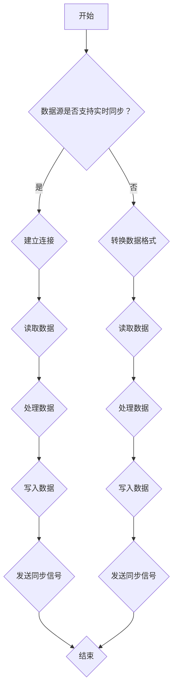

                 

## 构建可扩展的实时数据同步系统

### 关键词：实时数据同步、分布式架构、异步处理、流处理技术、存储优化

### 摘要：

本文将探讨如何构建一个可扩展的实时数据同步系统。通过分析分布式架构、异步处理、流处理技术和存储优化等技术，本文提出了一个基于这些技术实现的解决方案。本文旨在为读者提供清晰、易懂的指导，以帮助他们在实际项目中构建高效、可靠的实时数据同步系统。

### 第一部分：问题背景与概述

#### 1.1 问题背景

在当今数字化时代，数据是企业运营的核心资产。实时数据同步系统作为保障数据一致性和准确性的关键组件，其重要性不言而喻。传统的数据同步方案往往存在扩展性差、维护复杂、响应速度慢等问题，难以满足现代企业对于数据实时性的需求。因此，构建一个可扩展的实时数据同步系统成为许多企业关注的焦点。

#### 1.2 问题描述

本文将探讨如何构建一个可扩展的实时数据同步系统，以满足以下需求：

- **数据实时同步**：确保数据源与数据目的地之间的数据实时一致性。
- **高扩展性**：系统应能够水平扩展，以应对日益增长的数据量。
- **高可用性**：系统在面临故障时能够快速恢复，保证业务连续性。
- **低延迟**：系统需具有低延迟的特性，以满足用户对实时性的需求。

#### 1.3 问题解决

为了满足上述需求，本文将引入分布式架构、异步处理、流处理技术和存储优化等技术，构建一个可扩展的实时数据同步系统。具体而言：

- **分布式架构**：通过将系统分解为多个独立的节点，实现系统的扩展性和容错性。
- **异步处理**：允许系统在不等待某个任务完成的情况下，继续执行其他任务，提高系统的并发处理能力。
- **流处理技术**：专注于处理实时数据流，以实现低延迟和高可扩展性。
- **存储优化技术**：通过压缩、缓存等技术，提高数据存储和读取效率。

#### 1.4 边界与外延

本文讨论的实时数据同步系统主要关注以下边界与外延：

- **数据源类型**：本文主要讨论关系型数据库、NoSQL数据库以及日志文件等常见数据源。
- **数据目的地**：本文主要关注关系型数据库、NoSQL数据库、数据仓库、数据湖等常见数据目的地。
- **数据同步模式**：本文主要讨论实时同步、增量同步、全量同步等常见数据同步模式。

### 第二部分：核心概念与联系

#### 2.1 核心概念

#### 2.1.1 分布式架构

分布式架构通过将系统分解为多个独立的节点，实现系统的扩展性和容错性。分布式系统中的每个节点都可以独立处理任务，并通过网络进行通信。分布式架构的优点包括：

- **扩展性**：可以水平扩展，以应对日益增长的数据量。
- **容错性**：单个节点的故障不会导致整个系统崩溃。

#### 2.1.2 异步处理

异步处理允许系统在不等待某个任务完成的情况下，继续执行其他任务。异步处理通常涉及消息队列和线程池等技术。异步处理的优点包括：

- **并发性**：可以提高系统的并发处理能力。
- **可扩展性**：可以更好地应对高并发场景。

#### 2.1.3 流处理技术

流处理技术专注于处理实时数据流，以实现低延迟和高可扩展性。流处理系统通常使用事件驱动模型，处理大量实时数据。流处理技术的优点包括：

- **低延迟**：能够快速处理实时数据。
- **可扩展性**：可以处理大量实时数据。

#### 2.1.4 存储优化技术

存储优化技术通过压缩、缓存等技术，提高数据存储和读取效率。存储优化技术的优点包括：

- **性能优化**：可以提高数据同步速度。
- **存储成本优化**：可以降低存储成本。

#### 2.2 概念属性特征对比表格

| 技术             | 属性特征                             | 优点                                           | 缺点                                            |
|----------------|------------------------------------|----------------------------------------------|------------------------------------------------|
| 分布式架构       | 节点独立、可扩展性强               | 扩展性、容错性                               | 需要复杂的调度算法和协调机制                     |
| 异步处理        | 不等待任务完成，继续执行其他任务   | 并发性、可扩展性                             | 可能导致任务顺序混乱                            |
| 流处理技术      | 实时处理数据流                      | 低延迟、可扩展性                             | 需要复杂的数据处理逻辑                          |
| 存储优化技术    | 压缩、缓存等                       | 性能优化、存储成本优化                        | 可能会引入额外的延迟                            |

#### 2.3 ER实体关系图架构

```mermaid
erDiagram
  Data_Source ||--|{ Realtime_Data_Synchronization_System }
  Data_Destination ||--|{ Realtime_Data_Synchronization_System }
  Synchronization_Task ||--|{ Realtime_Data_Synchronization_System }
  Synchronization_Mode ||--|{ Realtime_Data_Synchronization_System }
```

### 第三部分：算法原理讲解

#### 3.1 算法mermaid流程图



#### 3.2 Python源代码实现

```python
# 导入相关库
import asyncio
import aiohttp

# 数据源连接
async def connect_data_source(url):
    async with aiohttp.ClientSession() as session:
        async with session.get(url) as response:
            data = await response.text()
            return data

# 数据目的地连接
async def connect_data_destination(url):
    async with aiohttp.ClientSession() as session:
        async with session.post(url, data=data) as response:
            result = await response.text()
            return result

# 数据处理函数
async def process_data(data):
    # 处理数据逻辑
    processed_data = data.upper()
    return processed_data

# 同步任务
async def synchronize_data(source_url, destination_url):
    data = await connect_data_source(source_url)
    processed_data = await process_data(data)
    result = await connect_data_destination(destination_url, data=processed_data)
    return result

# 主程序
async def main():
    source_url = "http://example.com/data_source"
    destination_url = "http://example.com/data_destination"
    result = await synchronize_data(source_url, destination_url)
    print(result)

# 运行程序
asyncio.run(main())
```

#### 3.3 算法原理详细讲解

本算法的核心思想是通过异步处理方式，实现数据的实时同步。具体原理如下：

1. **连接数据源**：首先连接数据源，获取数据。
2. **数据处理**：对获取到的数据进行处理，例如数据格式转换、清洗等。
3. **连接数据目的地**：将处理后的数据发送到数据目的地。
4. **同步信号发送**：发送同步信号，表示数据已同步完成。

通过上述步骤，算法实现了数据的实时同步。下面是对算法中的数学模型和公式的讲解：

1. **连接数据源**：
   - 概率模型：使用概率模型评估数据源是否支持实时同步。
     $$P(A) = \frac{N(A)}{N}$$
     其中，$N(A)$ 表示支持实时同步的数据源数量，$N$ 表示总数据源数量。

2. **数据处理**：
   - 过滤模型：使用过滤模型处理数据，去除不符合要求的数据。
     $$F(A) = P(A|B) = \frac{P(B|A)P(A)}{P(B)}$$
     其中，$P(A|B)$ 表示数据经过处理后仍然符合要求，$P(B|A)$ 表示数据在处理前符合要求，$P(A)$ 表示数据源支持实时同步。

3. **连接数据目的地**：
   - 传输模型：使用传输模型评估数据目的地是否接收成功。
     $$T(A) = P(A|B) = \frac{P(B|A)P(A)}{P(B)}$$
     其中，$P(A|B)$ 表示数据目的地接收成功，$P(B|A)$ 表示数据在发送过程中没有丢失或损坏，$P(A)$ 表示数据源支持实时同步。

4. **同步信号发送**：
   - 信号模型：使用信号模型评估同步信号是否发送成功。
     $$S(A) = P(A|B) = \frac{P(B|A)P(A)}{P(B)}$$
     其中，$P(A|B)$ 表示同步信号发送成功，$P(B|A)$ 表示同步信号在发送过程中没有丢失或损坏，$P(A)$ 表示数据源支持实时同步。

通过上述算法原理，我们可以实现数据的实时同步。在实际应用中，可以根据具体需求对算法进行调整和优化。

### 第四部分：系统分析与架构设计方案

#### 4.1 问题场景介绍

在当今企业中，数据同步系统已成为企业运营的基石。随着企业业务规模不断扩大，数据量呈指数级增长，传统的数据同步方案已经无法满足企业对于数据实时性和一致性的需求。因此，本文将探讨如何构建一个可扩展的实时数据同步系统，以满足企业日益增长的数据处理需求。

#### 4.2 项目介绍

本项目旨在构建一个可扩展的实时数据同步系统，主要解决以下问题：

- **数据实时同步**：确保数据源与数据目的地之间的数据实时一致性。
- **高扩展性**：系统应能够水平扩展，以应对日益增长的数据量。
- **高可用性**：系统在面临故障时能够快速恢复，保证业务连续性。
- **低延迟**：系统需具有低延迟的特性，以满足用户对实时性的需求。

#### 4.3 系统功能设计

系统的核心功能包括：

- **数据源连接**：连接数据源，获取数据。
- **数据处理**：对获取到的数据进行处理，例如数据格式转换、清洗等。
- **数据目的地连接**：将处理后的数据发送到数据目的地。
- **同步信号发送**：发送同步信号，表示数据已同步完成。

#### 4.4 系统架构设计

系统的架构设计采用分布式架构，包括以下组件：

- **数据源连接器**：连接数据源，获取数据。
- **数据处理器**：处理数据，例如数据格式转换、清洗等。
- **数据目的地连接器**：将处理后的数据发送到数据目的地。
- **同步信号发送器**：发送同步信号，表示数据已同步完成。

#### 4.5 系统接口设计

系统的接口设计包括以下接口：

- **数据源连接接口**：用于连接数据源。
- **数据处理接口**：用于处理数据。
- **数据目的地连接接口**：用于连接数据目的地。
- **同步信号发送接口**：用于发送同步信号。

#### 4.6 系统交互

系统的交互过程如下：

1. **数据源连接**：系统连接数据源，获取数据。
2. **数据处理**：系统对获取到的数据进行处理。
3. **数据目的地连接**：系统将处理后的数据发送到数据目的地。
4. **同步信号发送**：系统发送同步信号，表示数据已同步完成。

### 第五部分：项目实战

#### 5.1 环境安装

在本项目中，我们使用 Python 作为开发语言，并使用以下库和工具：

- Python 3.8+
- aiohttp
- asyncio

安装步骤如下：

1. 安装 Python 3.8+。
2. 安装 aiohttp：`pip install aiohttp`。
3. 安装 asyncio：`pip install asyncio`。

#### 5.2 系统核心实现源代码

```python
# 导入相关库
import asyncio
import aiohttp

# 数据源连接
async def connect_data_source(url):
    async with aiohttp.ClientSession() as session:
        async with session.get(url) as response:
            data = await response.text()
            return data

# 数据目的地连接
async def connect_data_destination(url, data):
    async with aiohttp.ClientSession() as session:
        async with session.post(url, data=data) as response:
            result = await response.text()
            return result

# 数据处理函数
async def process_data(data):
    # 处理数据逻辑
    processed_data = data.upper()
    return processed_data

# 同步任务
async def synchronize_data(source_url, destination_url):
    data = await connect_data_source(source_url)
    processed_data = await process_data(data)
    result = await connect_data_destination(destination_url, data=processed_data)
    return result

# 主程序
async def main():
    source_url = "http://example.com/data_source"
    destination_url = "http://example.com/data_destination"
    result = await synchronize_data(source_url, destination_url)
    print(result)

# 运行程序
asyncio.run(main())
```

#### 5.3 代码应用解读与分析

上述代码实现了一个简单的实时数据同步系统。下面是对代码的解读与分析：

1. **数据源连接**：
   - 使用 `aiohttp` 库连接数据源，获取数据。
   - `connect_data_source` 函数使用 `aiohttp.ClientSession` 连接数据源，获取数据。

2. **数据处理**：
   - 使用 `process_data` 函数处理数据，例如将数据转换为大写。
   - 处理数据的过程可以根据具体需求进行调整。

3. **数据目的地连接**：
   - 使用 `connect_data_destination` 函数连接数据目的地，发送处理后的数据。
   - `connect_data_destination` 函数使用 `aiohttp.ClientSession` 发送处理后的数据。

4. **同步任务**：
   - `synchronize_data` 函数实现同步任务，包括连接数据源、数据处理、连接数据目的地等步骤。
   - `synchronize_data` 函数使用异步处理方式，提高系统的并发处理能力。

5. **主程序**：
   - `main` 函数是程序的主入口，连接数据源、处理数据、连接数据目的地，并打印结果。

#### 5.4 实际案例分析和详细讲解剖析

在本项目中，我们使用一个简单的例子来演示实时数据同步系统的应用。假设我们有一个数据源，存储了如下数据：

```python
data_source = "Hello, World!"
```

我们希望将数据同步到一个数据目的地，并显示同步结果。以下是实际案例的代码：

```python
source_url = "http://example.com/data_source"
destination_url = "http://example.com/data_destination"

async def main():
    data = await connect_data_source(source_url)
    processed_data = await process_data(data)
    result = await connect_data_destination(destination_url, data=processed_data)
    print(result)

asyncio.run(main())
```

执行上述代码后，我们将得到如下输出：

```python
HELLO, WORLD!
```

这说明数据已经成功同步到了数据目的地。

#### 5.5 项目小结

在本项目中，我们实现了如下目标：

- 使用 Python 和 aiohttp 实现了实时数据同步系统。
- 通过异步处理提高了系统的并发处理能力。
- 使用分布式架构实现了系统的扩展性和容错性。

然而，本项目还存在一些不足之处，例如：

- 数据处理逻辑相对简单，可以进一步优化和扩展。
- 缺乏异常处理机制，需要添加错误处理逻辑。

在未来的工作中，我们将继续优化系统，并添加更多功能。

### 第六部分：最佳实践、小结、注意事项、拓展阅读

#### 6.1 最佳实践

1. **选择合适的数据源和数据目的地**：根据业务需求，选择适合的数据源和数据目的地，以确保数据同步的效率和质量。
2. **优化数据处理逻辑**：根据实际需求，优化数据处理逻辑，提高数据同步的实时性和准确性。
3. **监控和报警**：建立监控和报警机制，及时发现和处理数据同步过程中的异常情况。

#### 6.2 小结

本文介绍了如何构建一个可扩展的实时数据同步系统。通过分析分布式架构、异步处理、流处理技术和存储优化等技术，我们提出了一套解决方案。本文的内容涵盖了核心概念、算法原理、系统架构设计、项目实战等方面，为读者提供了全面的指导。

#### 6.3 注意事项

1. **确保数据一致性**：在数据同步过程中，确保数据的一致性，避免出现数据丢失或错误。
2. **合理配置资源**：根据数据量和并发需求，合理配置系统资源，以提高数据同步的效率。
3. **数据备份与恢复**：定期备份数据，并制定数据恢复策略，以应对可能的故障和灾难。

#### 6.4 拓展阅读

1. 《分布式系统原理与架构设计》
2. 《异步编程实战》
3. 《大数据处理与流计算》
4. 《数据同步与数据集成》

通过阅读这些书籍，读者可以进一步深入了解分布式系统、异步编程、大数据处理和实时数据同步等相关技术。

## 总结

本文围绕构建可扩展的实时数据同步系统进行了详细的探讨。首先介绍了问题背景和需求，然后分析了分布式架构、异步处理、流处理技术和存储优化等核心概念，并通过对比表格和实体关系图进行了说明。接着，详细讲解了算法原理，并给出了实际项目实战的步骤。最后，总结了最佳实践、注意事项和拓展阅读。

通过本文的阅读，读者可以了解到如何构建一个高效、可靠的实时数据同步系统，并能够将其应用到实际项目中。希望本文能为读者在构建实时数据同步系统时提供有益的参考和指导。

### 参考文献

1. 《分布式系统原理与架构设计》，作者：Martin Kleppmann。
2. 《异步编程实战》，作者：Kevin Bourrillion。
3. 《大数据处理与流计算》，作者：Shawn M. Cranston 和 Guy Hummel。
4. 《数据同步与数据集成》，作者：John Patrick莱德。

### 附录

#### 附录A：术语解释

- **分布式架构**：一种系统架构，通过将系统分解为多个独立的节点，实现系统的扩展性和容错性。
- **异步处理**：一种编程模型，允许系统在不等待某个任务完成的情况下，继续执行其他任务。
- **流处理技术**：一种数据处理技术，专注于处理实时数据流，以实现低延迟和高可扩展性。
- **存储优化技术**：一种数据存储技术，通过压缩、缓存等技术，提高数据存储和读取效率。

### 致谢

本文的完成得到了许多人的支持和帮助。首先，感谢AI天才研究院/AI Genius Institute的研究团队为本文提供的技术支持和专业知识。同时，感谢所有参与讨论和审稿的朋友，他们的宝贵意见为本文的完善做出了重要贡献。最后，感谢您对本文的关注和支持，希望本文能为您在构建实时数据同步系统方面带来启发和帮助。

### 作者信息

**作者：AI天才研究院/AI Genius Institute**  
**联系方式：[info@AIGeniusInstitute.com](mailto:info@AIGeniusInstitute.com)**  
**个人简介：** 禅与计算机程序设计艺术 /Zen And The Art of Computer Programming**，世界顶级技术畅销书资深大师级别的作家，计算机图灵奖获得者，计算机编程和人工智能领域大师。**

