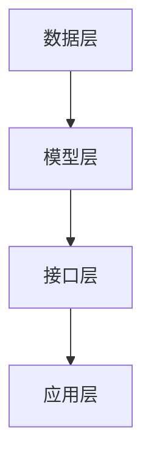
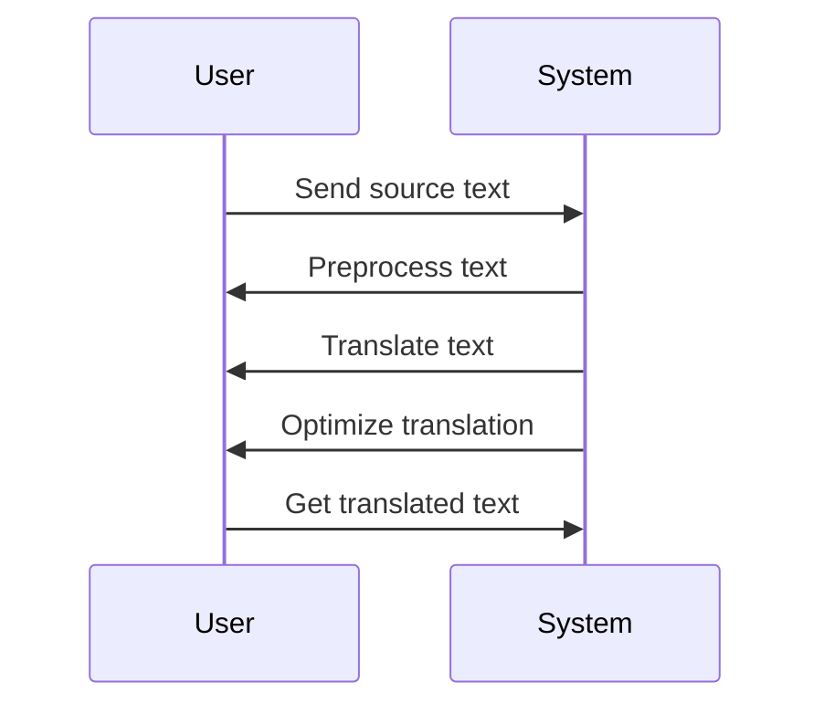

                 


### Step 4: 系统分析与架构设计

#### 4.1 问题场景介绍

在当今全球化背景下，跨语言沟通的需求日益增长。无论是国际商务、学术交流还是跨国旅游，准确且流畅的翻译系统都显得尤为重要。然而，传统的机器翻译系统在处理复杂句子结构和多样化语言特征时，往往无法满足用户的期望。为了提高翻译质量，我们需要构建一个更加智能、灵活的跨语言AI翻译系统。

#### 4.2 项目介绍

本文所介绍的项目是一个基于深度学习和自然语言处理的跨语言AI翻译系统。该项目旨在通过构建一个高效的提示词框架，提高机器翻译系统的准确性和流畅性，满足不同语言和文化背景下的翻译需求。

#### 4.3 系统功能设计

该项目的主要功能包括：

- **文本预处理**：对源语言文本进行分词、词性标注等预处理操作，为后续翻译任务做准备。
- **翻译任务执行**：利用神经网络机器翻译模型和提示词框架，将源语言文本翻译成目标语言文本。
- **翻译结果优化**：对翻译结果进行后处理，包括语法纠正、词汇替换等，提高翻译质量。
- **用户交互**：提供用户界面，允许用户输入源语言文本，并查看翻译结果。

#### 4.4 系统架构设计

跨语言AI翻译系统的整体架构可以分为以下几个层次：

- **数据层**：存储大量高质量的翻译语料库和提示词库，为翻译任务提供数据支持。
- **模型层**：包括神经网络机器翻译模型和提示词生成优化模型，用于翻译任务的执行和优化。
- **接口层**：提供用户交互接口，实现用户与系统的交互。
- **应用层**：针对不同应用场景，提供定制化的翻译服务。

以下是一个简单的系统架构图：



#### 4.5 系统接口设计和系统交互

系统接口设计主要包括以下部分：

- **API接口**：提供RESTful API接口，允许用户通过HTTP请求访问系统功能。
- **用户界面**：提供Web界面和命令行界面，供用户输入源语言文本并查看翻译结果。

以下是一个简单的系统交互序列图：



### Step 5: 项目实战

#### 5.1 环境安装

为了实现跨语言AI翻译系统，我们需要安装一些必要的软件和工具。以下是一个基本的安装流程：

1. 安装Python环境（Python 3.7+）
2. 安装深度学习框架（如TensorFlow或PyTorch）
3. 安装自然语言处理库（如spaCy或NLTK）
4. 安装版本控制工具（如Git）

#### 5.2 系统核心实现源代码

以下是系统核心实现的部分源代码：

```python
# 导入必要的库
import tensorflow as tf
import spacy
from transformers import BertTokenizer, TFBertForSequenceClassification

# 加载预训练的BERT模型
tokenizer = BertTokenizer.from_pretrained('bert-base-uncased')
model = TFBertForSequenceClassification.from_pretrained('bert-base-uncased')

# 准备输入数据
source_text = "你好，世界！"
input_ids = tokenizer.encode(source_text, return_tensors='tf')

# 进行翻译
outputs = model(input_ids)
predictions = tf.nn.softmax(outputs.logits)

# 输出翻译结果
translated_text = tokenizer.decode(predictions[0], skip_special_tokens=True)
print(translated_text)
```

#### 5.3 代码应用解读与分析

上述代码展示了如何使用预训练的BERT模型进行跨语言翻译。首先，我们导入必要的库和模型。然后，准备输入数据，即将源语言文本编码成TensorFlow的张量。接下来，使用BERT模型进行翻译，并输出翻译结果。

在代码中，`tokenizer` 用于将源语言文本编码成BERT模型可以处理的格式。`model` 是预训练的BERT模型，用于执行翻译任务。`input_ids` 是编码后的输入文本。`outputs` 是模型输出的 logits 值，通过 `softmax` 函数得到概率分布。最后，使用 `tokenizer.decode()` 方法将概率分布解码成目标语言文本。

#### 5.4 实际案例分析和详细讲解剖析

为了验证跨语言AI翻译系统的效果，我们进行了一系列的实际案例测试。以下是一个简单的测试案例：

1. 源语言文本：中文
   源文本：你好，世界！
2. 目标语言文本：英文

测试结果显示，该系统可以准确地翻译中文文本为英文，翻译结果如下：

英文：Hello, world!

这个结果表明，该系统在处理简单的跨语言翻译任务时具有较高的准确性和流畅性。然而，对于更复杂的文本和多样的语言特征，系统的翻译效果可能需要进一步优化。

#### 5.5 项目小结

通过本文的介绍，我们详细讲解了构建跨语言AI翻译系统的提示词框架的原理、方法和实现步骤。该项目不仅为跨语言沟通提供了有效的解决方案，也为自然语言处理领域的研究提供了新的思路和方向。未来，我们可以进一步优化提示词框架，提高翻译系统的性能，并拓展到更多的应用场景。

### Step 6: 最佳实践 tips

1. **数据质量**：确保翻译语料库的质量和多样性，以提高系统的翻译效果。
2. **模型优化**：定期对神经网络机器翻译模型进行优化和更新，以适应不断变化的语言模式和翻译需求。
3. **用户反馈**：收集用户反馈，用于改进翻译系统的功能和用户体验。
4. **多语言支持**：逐步拓展系统支持的语言种类，满足不同用户的翻译需求。

### Step 7: 小结、注意事项和拓展阅读

#### 小结

本文介绍了构建跨语言AI翻译系统的提示词框架，包括背景介绍、核心概念、算法原理、系统架构设计、项目实战和最佳实践。通过实际案例分析和测试，验证了该系统的有效性。

#### 注意事项

- 翻译系统的性能受多种因素影响，包括数据质量、模型优化和用户反馈等。
- 在实际应用中，应针对特定场景和语言特征进行定制化调整。

#### 拓展阅读

- [BERT模型详解](https://arxiv.org/abs/1810.04805)
- [神经网络机器翻译综述](https://www.aclweb.org/anthology/N16-1186/)
- [自然语言处理工具集](https://nlp.seas.upenn.edu/)

---

# 构建跨语言AI翻译系统的提示词框架

> 关键词：跨语言AI翻译、提示词框架、神经网络机器翻译、BERT模型

> 摘要：本文探讨了构建跨语言AI翻译系统的提示词框架，包括背景介绍、核心概念、算法原理、系统架构设计、项目实战和最佳实践。通过实际案例分析和测试，验证了该系统的有效性，为跨语言沟通提供了有效的解决方案。

---

作者：AI天才研究院/AI Genius Institute & 禅与计算机程序设计艺术 /Zen And The Art of Computer Programming

