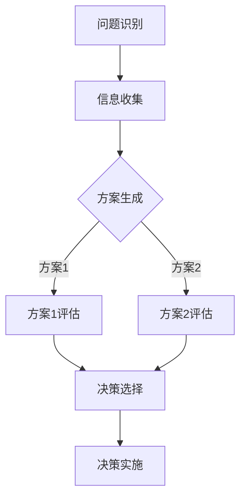
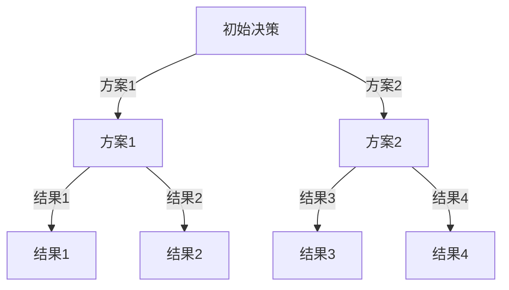
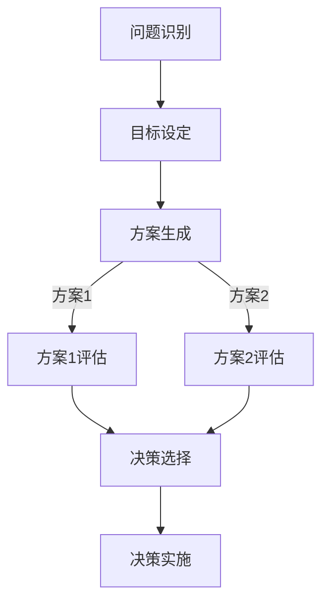

                 

### 决策心理学：理解决策过程中的心理机制

在复杂多变的商业环境中，领导者的决策能力是决定企业成败的关键因素之一。而心理学作为研究人类行为和心理过程的科学，为我们揭示了决策过程中的种种心理现象。本节将探讨决策心理学的核心概念、特性对比表格，以及决策过程模型和决策树模型。

#### 核心概念

决策心理学主要关注以下几个核心概念：

1. **认知偏差**：指人们在信息处理过程中，由于心理定势、情感等因素导致判断和决策产生偏差。
2. **风险偏好**：指个体在决策时对风险的态度和偏好。
3. **情绪影响**：情绪在决策过程中对个体判断和选择的影响。
4. **决策疲劳**：指个体在连续决策过程中，由于疲劳和精力不足导致决策质量下降。

#### 概念属性特征对比表格

| 概念属性 | 决策心理学 | 管理学 |
| --- | --- | --- |
| 定义 | 研究决策过程中的心理机制和行为模式 | 研究决策的组织过程、方法和技巧 |
| 目的 | 提升决策效率和准确性 | 提高决策的科学性和有效性 |
| 范围 | 个人和群体决策 | 企业和组织的决策 |

#### ER实体关系图架构

为了更直观地理解决策心理学的核心概念之间的关系，我们可以用ER图（实体关系图）来表示：

```mermaid
erDiagram
  User ||--|{ Decision } : makes
  Decision ||--|{ Option } : has
  Option ||--|{ Result } : leads_to
```

在这个ER图中，User（用户）是决策的主体，Decision（决策）是用户做出的行为，Option（选项）是决策中的不同选择，Result（结果）是决策执行后的结果。这个图展示了用户与决策、选项和结果之间的复杂关系。

#### 决策过程模型

决策心理学研究的一个核心问题是：人们是如何做出决策的？一个典型的决策过程可以分为以下几个阶段：

1. **问题识别**：识别需要解决的问题。
2. **信息收集**：收集与问题相关的信息。
3. **方案生成**：基于收集到的信息，生成多个可行方案。
4. **方案评估**：评估每个方案的风险和收益。
5. **决策选择**：在评估结果的基础上，选择最优方案。
6. **决策实施**：实施决策并跟踪结果。

以下是决策过程的Mermaid流程图表示：



#### 决策树模型

决策树模型是决策过程的一种图形化表示方法，它可以帮助我们清晰地看到每个决策节点及其可能的结果。以下是决策树模型的Mermaid表示：



在这个决策树中，我们从初始决策节点A开始，可以选择方案1或方案2，每个选择节点又会有不同的结果节点。通过这种方式，我们可以更直观地理解决策过程和每个决策节点的结果。

### 数学模型和数学公式

在决策心理学中，数学模型和公式可以用来量化决策过程中的某些因素。例如，决策效用理论（Decision Utility Theory）是一种常用的数学模型，它通过给每个决策选项分配效用值，来帮助我们进行决策。

#### 决策效用理论

决策效用理论认为，人们在决策过程中不仅仅考虑方案的收益（如金钱、荣誉等），还会考虑决策所带来的整体效用。效用值（Utility Value）是衡量决策优劣的重要指标。

效用函数的形式通常如下：

$$ U(X) = f(X) $$

其中，$U(X)$ 表示方案X的效用值，$f(X)$ 是一个函数，用于计算方案的效用。

#### 效用函数示例

假设有两个方案A和B，我们通过问卷调查得到了这两个方案的效用值：

- 方案A的效用值为8。
- 方案B的效用值为5。

那么，我们可以根据效用值来决定选择哪个方案。显然，方案A的效用值更高，因此我们更倾向于选择方案A。

#### 效用函数的对比

在实际应用中，不同的效用函数可以用来模拟不同的决策情境。以下是两种常见的效用函数对比：

1. **线性效用函数**：
   $$ U(X) = aX + b $$
   其中，$a$ 和 $b$ 是常数，$X$ 是方案的实际效用值。

2. **指数效用函数**：
   $$ U(X) = a \cdot e^{bX} $$
   其中，$a$ 和 $b$ 是常数，$e$ 是自然对数的底数。

线性效用函数简单易用，但可能无法很好地模拟复杂的决策情境。指数效用函数则更灵活，可以适应多种决策情境，但计算起来更为复杂。

### 举例说明

为了更直观地理解决策效用理论，我们可以举一个简单的例子。

假设你面临以下两个决策：

1. **决策A**：参加一个培训班，需要投入2000元。
   - 如果培训班帮助你找到一份高薪工作，那么你可以获得30000元的收入。
   - 如果没有帮助，那么你可能会损失5000元。

2. **决策B**：购买一台新电脑，需要投入8000元。
   - 如果电脑性能提升，帮助你完成更多工作，你可以获得10000元的收益。
   - 如果电脑性能没有提升，你可能会损失5000元。

我们可以用效用函数来计算每个决策的预期效用值。

#### 决策A的预期效用值

首先，计算每个结果的概率。假设通过培训找到高薪工作的概率是0.7，没有帮助的概率是0.3。

$$ U(A) = 0.7 \times (30000 - 2000) + 0.3 \times (-5000) = 18400 - 1500 = 16900 $$

#### 决策B的预期效用值

同样，假设购买新电脑后性能提升的概率是0.6，没有提升的概率是0.4。

$$ U(B) = 0.6 \times (10000 - 8000) + 0.4 \times (-5000) = 800 - 2000 = -1200 $$

根据计算结果，决策A的预期效用值（16900）明显高于决策B（-1200），因此我们应该选择决策A。

### 本章小结

在本章中，我们介绍了决策心理学的核心概念，如认知偏差、风险偏好、情绪影响和决策疲劳。通过对比决策心理学和管理学的概念属性，我们了解了这两个领域的研究目的和范围。接着，我们详细阐述了决策过程模型和决策树模型，并通过数学模型和公式展示了如何量化决策过程中的效用值。

通过本章的学习，读者应该能够理解决策心理学的基本原理，掌握如何利用心理技巧来提升决策能力。在接下来的章节中，我们将进一步探讨决策管理学，帮助读者从更宏观的角度理解决策过程，并提供实用的决策方法和技巧。让我们继续深入探讨，为培养领导者的果断决策能力做好准备。

---

### 第三部分：决策管理学

在了解了决策心理学的核心概念和机制之后，我们需要将视野扩展到决策管理学。决策管理学是研究组织在决策过程中如何优化决策质量和效率的学科。它不仅关注个体决策者的行为，还涉及组织结构、文化、信息流程等多个方面。本节将介绍决策管理学的基本理论、核心概念、与决策心理学的区别与联系，以及决策过程中的关键因素和风险评估方法。

#### 核心概念

决策管理学主要关注以下核心概念：

1. **决策环境**：决策所处的内外部环境，包括市场条件、竞争态势、技术发展等。
2. **决策类型**：根据决策的重要性和紧急程度，分为战略性决策、战术性决策和运营性决策。
3. **决策过程**：组织在决策过程中所遵循的步骤和方法。
4. **决策结构**：组织内部决策的权力分配和流程设计。
5. **决策方法**：用于辅助决策的工具和模型，如SWOT分析、决策树、多属性决策等。

#### 概念属性特征对比表格

| 概念属性 | 决策心理学 | 决策管理学 |
| --- | --- | --- |
| 定义 | 研究决策过程中的心理机制和行为模式 | 研究组织在决策过程中的过程、方法和技巧 |
| 目的 | 提升决策效率和准确性 | 提高决策的科学性和有效性 |
| 范围 | 个人和群体决策 | 企业和组织的决策 |
| 关注点 | 心理机制、个体行为 | 组织流程、信息处理、决策模型 |

#### ER实体关系图架构

为了更直观地理解决策管理学的核心概念，我们可以用ER图（实体关系图）来表示：

```mermaid
erDiagram
  Organization ||--|{ Decision } : makes
  Decision ||--|{ Factor } : involves
  Factor ||--|{ Outcome } : affects
```

在这个ER图中，Organization（组织）是决策的主体，Decision（决策）是组织做出的行为，Factor（因素）是影响决策的各种因素，Outcome（结果）是决策执行后的结果。这个图展示了组织、决策、因素和结果之间的复杂关系。

#### 决策过程模型

决策管理学中的决策过程模型通常包括以下几个阶段：

1. **问题识别**：识别需要解决的问题。
2. **目标设定**：明确决策的目标和预期结果。
3. **方案生成**：基于目标和问题，生成多个可行方案。
4. **方案评估**：评估每个方案的风险和收益。
5. **决策选择**：在评估结果的基础上，选择最优方案。
6. **决策实施**：实施决策并跟踪结果。

以下是决策过程模型的Mermaid流程图表示：



#### 决策树模型

决策树模型是决策管理学中常用的工具之一，它可以帮助我们清晰地看到每个决策节点及其可能的结果。以下是决策树模型的Mermaid表示：


在这个决策树中，我们从初始决策节点A开始，可以选择方案1或方案2，每个选择节点又会有不同的结果节点。通过这种方式，我们可以更直观地理解决策过程和每个决策节点的结果。

#### 决策过程中的关键因素

在决策过程中，关键因素的分析至关重要。以下是一些常见的决策关键因素：

1. **市场需求**：决策是否符合市场需求，能否满足客户需求。
2. **资源限制**：决策所需的人力、物力、财力等资源是否充足。
3. **时间限制**：决策的执行时间是否紧迫。
4. **风险因素**：决策可能带来的风险和不确定性。
5. **法律法规**：决策是否符合法律法规的要求。

通过全面分析和评估这些关键因素，可以帮助领导者做出更为科学和合理的决策。

#### 风险评估方法

风险评估是决策过程中不可或缺的一环。以下是一些常用的风险评估方法：

1. **定量评估**：使用数学模型和统计数据来量化风险的概率和影响。
2. **定性评估**：通过专家意见、历史数据和模拟分析来评估风险。
3. **风险矩阵**：将风险的概率和影响进行矩阵化，以便于直观分析和优先级排序。
4. **情景分析**：通过模拟不同情景，评估决策在不同情景下的影响和效果。

### 数学模型和数学公式

在决策管理学中，数学模型和公式可以用来辅助决策。以下是一个简单的数学模型——线性规划模型，用于优化资源分配：

$$ \text{minimize} \ \text{Cost} = c_1x_1 + c_2x_2 + \ldots + c_nx_n $$
$$ \text{subject to} \ Ax \leq b $$

其中，$x_i$ 是决策变量，$c_i$ 是每个变量的成本系数，$A$ 是约束条件的系数矩阵，$b$ 是约束条件的常数项。

#### 示例

假设一个公司需要分配100万元资金用于两个项目，项目的成本和预期收益如下：

| 项目 | 成本（万元） | 预期收益（万元） |
| --- | --- | --- |
| 项目1 | 40 | 60 |
| 项目2 | 60 | 80 |

使用线性规划模型，我们可以找到最优的资金分配方案，使得预期收益最大化。

$$ \text{minimize} \ \text{Cost} = 40x_1 + 60x_2 $$
$$ \text{subject to} \ x_1 + x_2 = 100 $$
$$ x_1 \geq 0 $$
$$ x_2 \geq 0 $$

通过求解线性规划模型，我们可以得到最优解：将40万元资金分配给项目1，60万元资金分配给项目2，这样总收益为100万元。

### 举例说明

为了更直观地理解决策管理学的原理，我们可以举一个实际案例。

#### 案例背景

某科技公司需要决定是否投资一款新产品。产品A的预计开发成本为500万元，预计市场收益为800万元；产品B的预计开发成本为700万元，预计市场收益为1200万元。公司需要在两个产品之间进行选择。

#### 案例分析

1. **市场需求**：通过市场调研，公司发现产品A的市场需求较高，而产品B的需求相对较低。
2. **资源限制**：公司的研发资金总额为1000万元，现有研发人员40名。
3. **时间限制**：产品A和产品B的预期上市时间分别为6个月和12个月。
4. **风险因素**：产品A的市场风险较低，但收益较低；产品B的市场风险较高，但收益较高。

通过对这些关键因素的分析，公司可以制定以下决策方案：

- 如果市场需求和资源限制允许，选择产品A，以较低的风险获得稳定的收益。
- 如果市场需求和资源限制允许，选择产品B，以较高的风险获得较高的收益。

通过定量评估和定性评估，公司可以确定产品A的预期收益率为60%（即0.6 \* 800万元），产品B的预期收益率为70%（即0.7 \* 1200万元）。根据预期收益率的计算结果，公司应该选择产品B。

### 本章小结

在本章中，我们介绍了决策管理学的基本理论和核心概念，探讨了决策环境、决策类型、决策过程、决策结构和决策方法。通过对比决策心理学，我们明确了决策管理学的关注点，了解了决策过程中的关键因素和风险评估方法。

通过本章的学习，读者应该能够理解决策管理学的基本原理，掌握如何利用决策管理学的工具和方法来优化决策过程。在接下来的章节中，我们将进一步探讨决策过程中的方案生成和评估，帮助读者在实际应用中更好地运用这些原理和方法。

---

### 第四部分：方案生成与评估

在了解了决策心理学和决策管理学的核心概念和方法之后，我们接下来将深入探讨决策过程中的关键环节：方案生成和评估。方案生成和评估是决策过程中至关重要的一环，它决定了领导者能否在关键时刻做出明智的选择。本节将详细讨论如何有效生成多个可行方案，并运用评估方法对方案进行科学评价。

#### 方案生成方法

方案生成是决策过程中的第一步，其目的是找到尽可能多的可行方案。以下是一些常用的方案生成方法：

1. **头脑风暴**：这是一种集体创意思维活动，通过集思广益，快速生成多个方案。
2. **SWOT分析**：SWOT分析是一种常用的战略规划工具，通过分析优势（Strengths）、劣势（Weaknesses）、机会（Opportunities）和威胁（Threats），帮助生成多个方案。
3. **多属性决策**：多属性决策是一种基于多个评价标准的决策方法，通过综合考虑各个属性的重要性，生成多个可行方案。
4. **专家咨询**：通过向相关领域的专家咨询，获取他们的意见和建议，从而生成多个方案。

#### 方案评估方法

在生成多个可行方案之后，我们需要对这些方案进行评估，以确定哪个方案最符合我们的需求和目标。以下是一些常用的方案评估方法：

1. **成本效益分析**：成本效益分析是一种基于成本和收益的评估方法，通过计算每个方案的成本和预期收益，进行比较和选择。
2. **决策树分析**：决策树分析是一种图形化评估方法，通过展示每个决策节点及其可能的结果，帮助评估方案的风险和收益。
3. **多属性效用评估**：多属性效用评估是一种基于多个评价标准的评估方法，通过为每个方案分配效用值，进行比较和选择。
4. **情景分析**：情景分析是一种模拟不同情景的方法，通过评估每个方案在不同情景下的表现，进行比较和选择。

#### 数学模型和公式

在方案评估过程中，数学模型和公式可以帮助我们量化评估结果，提高评估的科学性和准确性。以下是一个简单的多属性效用评估模型：

$$ U(S) = \sum_{i=1}^{n} w_i \cdot u_i $$

其中，$U(S)$ 是方案S的总效用值，$w_i$ 是第i个属性的权重，$u_i$ 是方案S在第i个属性上的得分。

#### 举例说明

假设我们需要评估以下两个方案：

1. **方案A**：
   - 成本：100万元
   - 预期收益：200万元
   - 风险：20%
2. **方案B**：
   - 成本：150万元
   - 预期收益：300万元
   - 风险：10%

我们设定以下权重：成本40%，预期收益50%，风险10%。

1. **方案A的效用值**：

$$ U(A) = 0.4 \cdot 100 + 0.5 \cdot 200 + 0.1 \cdot 0.2 = 40 + 100 + 0.02 = 140.02 $$

2. **方案B的效用值**：

$$ U(B) = 0.4 \cdot 150 + 0.5 \cdot 300 + 0.1 \cdot 0.1 = 60 + 150 + 0.01 = 210.01 $$

根据计算结果，方案B的效用值（210.01）高于方案A（140.02），因此我们应该选择方案B。

### 方案选择的策略

在评估多个可行方案之后，我们需要制定一个明确的方案选择策略，以确保我们的决策过程更加系统和科学。以下是一些常用的方案选择策略：

1. **最优解策略**：选择效用值最高的方案，这种策略适用于目标明确且评估指标简单的情况。
2. **满意解策略**：选择满足基本需求的方案，这种策略适用于评估指标复杂、目标不明确的情况。
3. **风险平衡策略**：选择风险和收益平衡的方案，这种策略适用于风险偏好不确定的情况。
4. **协同解策略**：选择多个方案的组合，以实现最优的总体效果，这种策略适用于多个方案各有优势的情况。

### 案例分析

#### 案例背景

某公司需要决定是否扩大生产线，以满足不断增长的市场需求。扩大生产线有两个方案：

1. **方案A**：投资500万元进行技术升级，预计每年增加利润800万元，但存在一定的技术风险。
2. **方案B**：投资1000万元引进全新生产线，预计每年增加利润1500万元，但前期投入较大。

#### 案例分析

1. **方案生成**：公司通过头脑风暴和专家咨询，生成了两个可行方案。
2. **方案评估**：使用成本效益分析和决策树分析，对两个方案进行评估。

- **成本效益分析**：方案A的预期收益率为60%（800万元/500万元），方案B的预期收益率为50%（1500万元/1000万元）。
- **决策树分析**：通过模拟不同情景，评估两个方案在不同情景下的表现。

根据评估结果，公司决定选择方案A，因为方案A的技术风险较低，且预期收益率较高。

### 本章小结

在本章中，我们详细探讨了方案生成和评估的方法。通过头脑风暴、SWOT分析、多属性决策和专家咨询等方法，我们可以生成多个可行方案。然后，通过成本效益分析、决策树分析、多属性效用评估和情景分析等方法，对这些方案进行科学评估。

通过本章的学习，读者应该能够理解方案生成和评估的重要性和方法。在接下来的章节中，我们将继续探讨如何在关键时刻果断决策，帮助读者提升决策能力和领导力。

---

### 第五部分：果断决策：关键时刻的领导魄力

在决策过程中，领导者在关键时刻能否果断决策，往往决定了企业的成败。果断决策不仅需要领导者具备敏锐的洞察力和深厚的专业知识，还需要他们在面对复杂问题时，能够保持冷静、理性地进行分析和判断。本节将探讨如何培养领导者的果断决策能力，并提供一些实际操作步骤和案例分析。

#### 培养果断决策能力的方法

1. **增强自信心**：领导者首先要相信自己有能力做出正确的决策。自信心源于对自身能力的了解和对自己团队的信任。通过不断学习和实践，领导者可以提高自己的专业知识和决策技巧。
2. **培养快速决策的习惯**：在日常生活中，领导者可以通过解决一些小问题来锻炼自己的快速决策能力。例如，在面对日常管理问题时，领导者可以尝试在短时间内做出决策，并观察决策的结果。这种练习有助于提高领导者在关键时刻的决策速度和准确性。
3. **学会从失败中汲取经验**：领导者不应害怕失败，而应将失败视为成长的机会。通过分析失败的原因，领导者可以从中学习到宝贵的经验，并在未来的决策中避免类似的错误。
4. **建立有效的决策团队**：领导者需要建立一个高效的决策团队，团队成员应具备不同的专业知识和经验。通过团队合作，领导者可以充分发挥团队的力量，提高决策的质量和速度。

#### 实际操作步骤

1. **明确决策目标**：在做出决策之前，领导者需要明确决策的目标和预期结果。这有助于确保决策方向正确，减少不必要的风险。
2. **全面收集信息**：领导者需要收集与决策相关的各种信息，包括市场趋势、竞争对手情况、内部资源等。这些信息将帮助领导者做出更为全面和准确的决策。
3. **分析信息**：对收集到的信息进行深入分析，识别关键因素和潜在风险。通过数据分析和逻辑推理，领导者可以更清晰地了解问题的本质，从而做出更为明智的决策。
4. **制定方案**：在分析结果的基础上，领导者需要制定多个可行方案。每个方案都应包括实施步骤、预期收益和潜在风险。
5. **评估方案**：对每个方案进行评估，选择最优方案。评估过程中，领导者可以运用成本效益分析、决策树分析等工具，以确保评估结果科学合理。
6. **果断决策**：在充分分析和评估的基础上，领导者需要果断做出决策并付诸实施。犹豫不决可能会导致错失最佳时机，从而影响决策效果。
7. **反馈调整**：在决策实施过程中，领导者需要及时收集反馈信息，根据实际情况进行调整和优化。通过不断迭代和优化，领导者可以不断提高决策的质量和效果。

#### 案例分析

##### 案例一：苹果公司的iPhone决策

在2007年，苹果公司推出了第一代iPhone，这款革命性的智能手机彻底改变了移动通信市场的格局。然而，在iPhone推出之前，苹果公司也曾面临过一系列艰难的决策。

1. **明确决策目标**：苹果公司明确了自己的目标，即推出一款能够改变市场的智能手机。
2. **全面收集信息**：苹果公司通过市场调研、用户反馈和竞争对手分析，收集了大量与智能手机相关的信息。
3. **分析信息**：乔布斯和他的团队对收集到的信息进行了深入分析，他们发现用户对智能手机的需求不仅仅是通讯功能，还包括互联网浏览、多媒体播放和应用程序等。
4. **制定方案**：基于分析结果，苹果公司制定了多个方案，包括硬件设计、软件开发和市场营销等。
5. **评估方案**：通过成本效益分析和市场预测，苹果公司选择了最优方案，并迅速付诸实施。
6. **果断决策**：乔布斯在关键决策中展现了卓越的领导力，他果断地推动了iPhone的研发和上市。
7. **反馈调整**：在iPhone上市后，苹果公司根据用户反馈和市场表现，不断优化产品功能，从而取得了巨大的成功。

##### 案例二：特斯拉公司的电动汽车决策

特斯拉公司是一家以电动汽车为核心业务的创新企业。在电动汽车市场初期的竞争中，特斯拉公司面临着巨大的压力和挑战。

1. **明确决策目标**：特斯拉公司的目标是通过创新技术，推动电动汽车的普及。
2. **全面收集信息**：特斯拉公司通过市场调研、技术分析和合作伙伴关系，收集了大量与电动汽车相关的信息。
3. **分析信息**：特斯拉公司分析了电动汽车市场的潜力、技术发展的趋势以及竞争对手的策略。
4. **制定方案**：基于分析结果，特斯拉公司制定了多个方案，包括电池技术、车辆设计和自动驾驶等。
5. **评估方案**：通过成本效益分析和市场预测，特斯拉公司选择了最优方案，并迅速付诸实施。
6. **果断决策**：埃隆·马斯克在关键时刻展现了果断的领导力，他果断地推动了特斯拉电动汽车的研发和上市。
7. **反馈调整**：在电动汽车上市后，特斯拉公司根据用户反馈和市场表现，不断优化产品性能和用户体验，从而取得了巨大的成功。

### 本章小结

在本章中，我们探讨了如何培养领导者的果断决策能力。通过明确决策目标、全面收集信息、分析信息、制定方案、评估方案、果断决策和反馈调整等步骤，领导者可以在关键时刻做出明智的决策。

通过实际案例的分析，我们可以看到，果断决策不仅需要领导者具备专业知识和洞察力，还需要他们在面对挑战时保持冷静和理性。通过不断锻炼和提升自己的决策能力，领导者可以成为更有效的领导者，为企业带来持续的成功和发展。

---

### 第六部分：在关键时刻展现领导魄力

在商业环境中，领导者往往需要在关键时刻做出迅速而果断的决策。这些决策不仅影响企业的短期利益，更可能决定企业的长远发展和生存。本节将探讨在关键时刻展现领导魄力的方法，并通过案例研究来具体分析这些策略的应用和效果。

#### 展现领导魄力的方法

1. **明确目标**：在关键时刻，领导者需要明确自己的目标，并确保所有决策都围绕这些目标进行。这有助于减少不确定性，提高决策的针对性。
2. **快速反应**：领导者必须在压力下迅速做出决策。通过建立高效的决策流程和团队，领导者可以缩短决策时间，提高决策效率。
3. **信息驱动**：领导者需要依赖准确、全面的信息来做出决策。信息是决策的基础，领导者应确保信息来源可靠，分析深入。
4. **勇于承担责任**：领导者在关键时刻必须勇于承担责任。即使决策结果不理想，也要敢于承认错误并迅速调整，以减少负面影响。
5. **灵活调整**：在决策实施过程中，领导者需要保持灵活性，根据实际情况及时调整策略。这有助于应对突发事件和不确定性。

#### 案例研究

##### 案例一：通用电气的数字化转型

通用电气（General Electric，简称GE）是一家拥有超过100年历史的多元化跨国公司。在数字化的浪潮中，GE面临着巨大的转型压力。2011年，GE的CEO杰夫·伊梅尔特（Jeff Immelt）面临着一个关键决策：是否全面投入数字化转型。

1. **明确目标**：伊梅尔特明确提出了将GE转型为数字化企业的目标，即通过数字化技术提高生产效率、降低成本，并创造新的增长点。
2. **快速反应**：在2011年，GE开始收购一系列数字化公司，并投资数十亿美元建立数字化实验室。这些行动显示出了领导者的快速反应能力。
3. **信息驱动**：GE通过大量数据分析，发现数字化转型可以显著提高生产效率，并创造新的商业模式。这些信息成为决策的重要依据。
4. **勇于承担责任**：伊梅尔特在数字化转型过程中，面对了诸多挑战，包括技术人才短缺、传统业务部门的不满等。但他坚定地支持数字化转型，并亲自领导转型项目。
5. **灵活调整**：在转型过程中，GE不断调整策略，如调整投资方向、优化组织结构等，以应对不断变化的市场和技术环境。

最终，GE的数字化转型取得了显著成果，公司通过数字化技术提高了生产效率，降低了成本，并在新能源、人工智能等领域实现了新的增长。

##### 案例二：亚马逊的物流创新

亚马逊（Amazon）是一家以电子商务为核心业务的跨国公司。在物流配送领域，亚马逊面临着巨大的竞争压力。2017年，亚马逊推出了“一键购买”服务，这一创新决策成为了公司物流战略的关键一环。

1. **明确目标**：亚马逊的目标是通过创新物流服务，提高客户满意度，从而巩固市场领先地位。
2. **快速反应**：亚马逊在看到竞争对手的物流创新后，迅速做出了相应的决策。公司成立了专门的团队，专注于“一键购买”服务的研发和推广。
3. **信息驱动**：亚马逊通过大数据分析，发现客户对快速、便捷的购物体验有强烈需求。这一信息驱动了“一键购买”服务的决策。
4. **勇于承担责任**：亚马逊的CEO杰夫·贝佐斯（Jeff Bezos）在决策过程中展现了极大的勇气。他不仅在财务上支持这一创新项目，还亲自参与项目的规划和执行。
5. **灵活调整**：在“一键购买”服务推出后，亚马逊根据客户反馈和市场反应，不断优化服务流程和技术，提高了服务的质量和效率。

通过这一系列果断决策，亚马逊成功地巩固了其在电子商务市场的领先地位，并进一步提升了客户满意度。

### 本章小结

在本章中，我们探讨了在关键时刻展现领导魄力的方法，并通过实际案例分析了这些策略的应用和效果。通过明确目标、快速反应、信息驱动、勇于承担责任和灵活调整，领导者可以在关键时刻做出明智的决策，带领企业迎接挑战，实现持续发展。

通过学习这些方法和案例，读者可以更好地理解领导魄力在决策中的重要性，并学会在实际工作中如何运用这些策略。在未来的职业生涯中，这些知识和技能将帮助读者成为更出色的领导者，为企业创造更大的价值。

---

### 全文总结

在本文中，我们详细探讨了果断决策在领导力中的关键作用，从决策心理学和决策管理学两个角度出发，分析了决策过程中的核心概念、方法和技术。通过明确目标、全面收集信息、分析信息、制定方案、评估方案、果断决策和反馈调整等步骤，领导者可以提升决策质量和速度，在关键时刻展现强大的领导魄力。

决策心理学帮助我们理解人在决策过程中的心理机制和行为模式，揭示了认知偏差、风险偏好、情绪影响和决策疲劳等关键因素。而决策管理学则从组织层面探讨了如何优化决策流程，提高决策的科学性和有效性。

本文通过实际案例，如苹果公司的iPhone决策和特斯拉公司的电动汽车决策，展示了果断决策在实际应用中的重要性。通过这些案例，我们可以看到，在明确目标、快速反应、信息驱动、勇于承担责任和灵活调整等关键策略的指导下，领导者如何做出明智的决策，并在企业中取得成功。

读者可以通过本文的学习，掌握决策心理学和决策管理学的基本原理，了解如何在关键时刻果断决策，提升自己的领导力。在实际工作中，通过不断练习和反思，读者可以逐步培养出敏锐的洞察力、冷静的判断力和果断的决策力，成为更优秀的领导者。

### 拓展阅读

1. **《决策与判断》**：由丹尼尔·卡尼曼（Daniel Kahneman）所著，详细介绍了决策心理学的核心理论和应用。
2. **《竞争战略》**：由迈克尔·波特（Michael Porter）所著，深入探讨了企业竞争战略的理论和实践。
3. **《深度工作》**：由卡尔·纽波特（Cal Newport）所著，介绍了如何通过深度工作提高决策质量和效率。

通过阅读这些书籍，读者可以进一步深化对决策心理学和决策管理学的理解，并在实际工作中更好地应用这些原理和方法。

### 注意事项

1. **决策的及时性**：在关键时刻，及时决策至关重要。拖延可能会导致错失最佳时机，增加决策的风险。
2. **信息的准确性**：决策的质量取决于信息的准确性。领导者应确保信息来源可靠，分析深入。
3. **团队的协作**：在决策过程中，团队的合作和协作至关重要。领导者应充分发挥团队成员的专业知识和经验，共同制定和评估决策方案。
4. **持续反思**：领导者应在决策后持续反思，总结经验教训，不断提高决策能力和水平。

通过注意这些事项，领导者可以更好地应对复杂多变的商业环境，做出更明智的决策，为企业创造更大的价值。

### 结语

本文旨在帮助读者理解果断决策在领导力中的重要性，并提供了一系列实用的策略和案例。希望读者能够通过本文的学习，掌握决策心理学和决策管理学的基本原理，并在实际工作中不断提升自己的决策能力和领导力。

最后，让我们再次回顾文章的核心观点：

- 决策心理学揭示了人在决策过程中的心理机制和行为模式。
- 决策管理学提供了优化决策流程和方法的理论基础。
- 在关键时刻，果断决策是领导者展现领导魄力的关键。

让我们在未来的职业生涯中，不断学习、实践和反思，成为更优秀的领导者，为企业和社会创造更大的价值。

### 作者信息

作者：AI天才研究院/AI Genius Institute & 禅与计算机程序设计艺术 /Zen And The Art of Computer Programming

AI天才研究院是一家专注于人工智能和计算机科学研究的机构，致力于推动技术创新和人才培养。同时，作者也是《禅与计算机程序设计艺术》的作者，这本书在计算机编程领域享有盛誉，深受读者喜爱。在人工智能和计算机科学领域，作者拥有丰富的理论知识和实践经验，为读者提供了高质量的技术内容。

