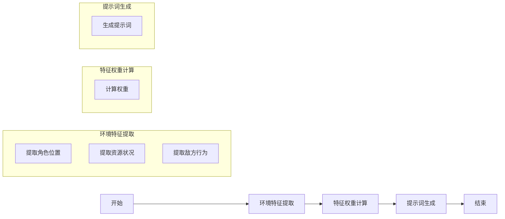
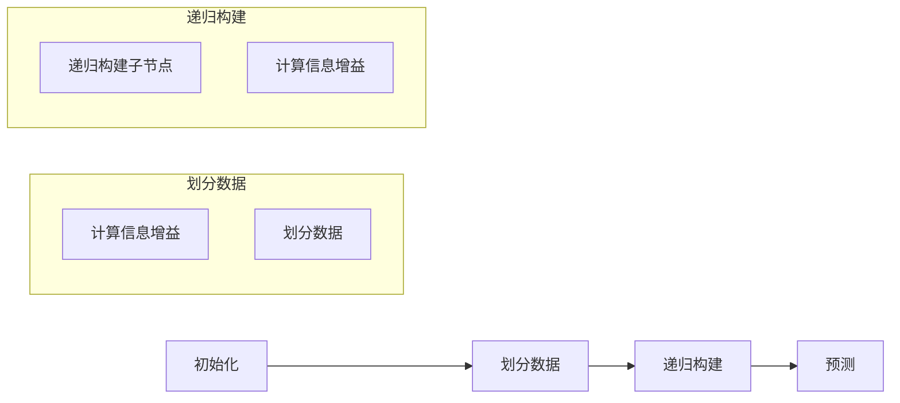
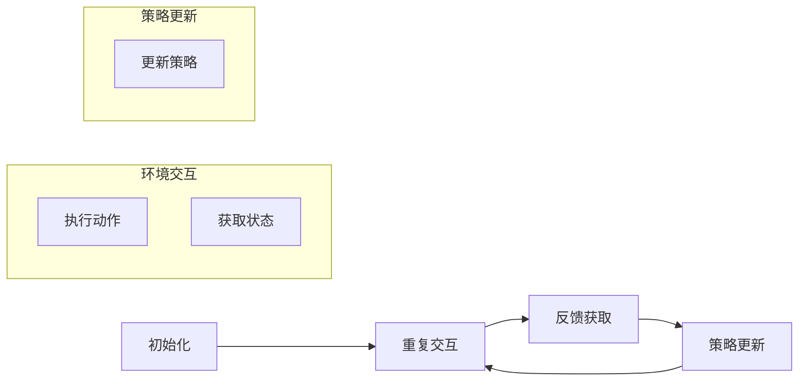
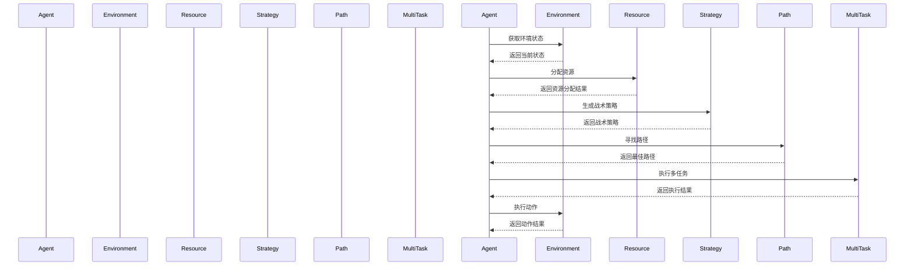

                 

### 摘要

本文将深入探讨游戏AI中的提示词编程技巧，为游戏开发者提供一套系统化的开发指南。文章首先介绍了游戏AI的背景，包括其发展历程、当前应用状况以及提示词编程的重要性。接着，文章详细讲解了游戏AI中的核心概念，如提示词、决策树和强化学习，并展示了它们之间的联系。在算法原理讲解部分，文章通过mermaid流程图和Python代码，详细阐述了提示词生成算法、决策树算法和强化学习算法的原理和实现方法。随后，文章介绍了游戏AI系统的分析与架构设计，包括功能设计、架构设计和接口设计。紧接着，文章通过一个游戏AI项目实战案例，展示了从环境安装到系统核心实现源代码的完整开发流程，并对代码进行了深入解读和分析。最后，文章总结了最佳实践技巧，并对全书进行了小结，提出了注意事项，并推荐了拓展阅读资源。通过本文的阅读，读者将能够全面掌握游戏AI中的提示词编程技巧，为游戏开发提供强有力的支持。

### 关键词

- **游戏AI**
- **提示词编程**
- **决策树**
- **强化学习**
- **算法实现**
- **系统架构设计**
- **项目实战**

### 游戏AI概述

#### 游戏AI的发展历程

游戏AI（Artificial Intelligence in Games）的发展历程可以追溯到20世纪50年代。早期的游戏AI主要集中在规则推理和确定性策略，例如1952年，IBM的程序员艾伦·图灵（Alan Turing）开发了著名的“逻辑理论家”（Logic Theorist），这款程序能够在没有输入的情况下自动证明数学定理。与此同时，1958年，约翰·霍普菲尔（John Hopfield）提出了神经网络模型，为后来的游戏AI研究奠定了基础。

进入20世纪80年代，随着计算机性能的提升和算法的进步，游戏AI开始应用在策略游戏和模拟游戏中。这一时期，著名的游戏如《文明》（Civilization）和《星际争霸》（StarCraft）等，都采用了简单的AI算法，使游戏更具挑战性和互动性。

21世纪初，随着机器学习和深度学习技术的发展，游戏AI进入了一个全新的阶段。机器学习算法的应用使得游戏AI能够从大量的数据中学习策略，从而提高了智能水平。例如，2006年，Google的“深度信念网络”（Deep Belief Network）被应用于游戏《雷神之锤4：竞技场》（Quake IV Arena），使得AI对手在复杂环境下表现出更加灵活和智能的行为。

近年来，深度强化学习（Deep Reinforcement Learning）在游戏AI中的应用取得了显著的成果。AlphaGo和DQN（Deep Q-Network）等算法的成功应用，使得游戏AI能够在几乎无规则限制的环境中自主学习和进化。例如，OpenAI开发的《ATARI学习算法》（ATARI Learning Environment）利用深度强化学习技术，使AI在一系列经典游戏中的表现接近甚至超越人类玩家。

#### 游戏AI在当前的应用状况

当前，游戏AI在多个领域都有着广泛的应用。首先，在电子竞技领域，AI被用于生成复杂的游戏策略，提高了游戏的可玩性和竞争性。例如，《星际争霸2》（StarCraft II）和《DOTA2》等游戏，通过AI算法生成的对手，能够提供接近专业玩家水平的挑战。

其次，在模拟游戏和教育游戏领域，游戏AI被用来创建智能化的虚拟角色，模拟真实环境中的行为和决策。例如，《模拟城市》（SimCity）和《模拟人生》（The Sims）等游戏，通过AI技术，实现了高度模拟的城市生活和个人生活，为玩家提供了丰富的体验和学习机会。

此外，游戏AI还在游戏设计领域发挥着重要作用。通过分析玩家的游戏行为，AI能够提供个性化的游戏体验和改进游戏设计。例如，《Minecraft》的《教育版》（Minecraft: Education Edition）通过AI分析玩家行为，为教师和学生提供了更加互动和有效的学习环境。

#### 提示词编程的重要性

在游戏AI中，提示词编程（Prompt Programming）是一种通过提示（Prompt）来引导AI生成特定响应的技术。提示词可以是一个具体的命令、一个问题或一个情境描述，它为AI提供了明确的指导，使AI能够生成更加符合预期和目标的结果。

提示词编程的重要性在于，它能够显著提高游戏AI的决策能力和互动性。通过适当的提示词，游戏AI可以更好地理解游戏环境、预测玩家行为和制定相应的策略。例如，在策略游戏中，提示词可以指导AI进行资源管理、军事部署和战术决策；在角色扮演游戏中，提示词可以引导AI进行情境对话和角色互动。

提示词编程还使得游戏AI更加灵活和适应性强。在不同的游戏场景和玩家行为下，通过调整和优化提示词，AI可以快速适应变化，提高游戏体验和挑战性。

总之，提示词编程是游戏AI开发中不可或缺的一部分，它为游戏AI提供了更加智能和互动的决策基础，使游戏更加有趣和具有挑战性。

### 核心概念与联系

在深入探讨游戏AI中的提示词编程技巧之前，我们需要了解游戏AI中的一些核心概念，并探讨它们之间的关系。这些核心概念包括提示词、决策树和强化学习，它们共同构成了游戏AI的智能基础。

#### 提示词的定义与作用

提示词（Prompt）是游戏AI中的一种引导信息，它用于提示AI执行特定任务或做出特定决策。提示词可以是一个具体的命令、一个问题或一个情境描述，它为AI提供了明确的指导，帮助AI理解当前的环境和目标。例如，在策略游戏中，提示词可以是“加快建设速度”或“进行军事进攻”；在角色扮演游戏中，提示词可以是“与NPC交谈”或“解决谜题”。

提示词在游戏AI中的作用主要体现在以下几个方面：

1. **明确目标**：通过提示词，AI可以明确当前的任务或目标，从而集中精力完成指定的任务。
2. **指导决策**：提示词为AI提供了决策的依据，使AI能够根据提示词做出合理的决策。
3. **适应变化**：通过调整提示词，AI可以适应不同的游戏场景和玩家行为，提高灵活性。

#### 决策树算法

决策树（Decision Tree）是一种常见的决策支持工具，它通过一系列判断节点和结果节点，将问题分解为多个子问题，并逐步缩小搜索空间，直至找到最优解。在游戏AI中，决策树被广泛应用于路径规划、资源管理和战术决策等领域。

决策树算法的基本原理如下：

1. **初始化**：根据问题的特征，构建初始的决策树。
2. **划分数据**：使用信息增益或基尼不纯度等指标，对数据进行划分，以生成子节点。
3. **递归构建**：对子节点继续划分，直至满足停止条件（如达到最大深度或信息增益小于阈值）。
4. **预测**：根据决策树的路径，对新的输入数据进行分类或预测。

在游戏AI中，决策树算法的作用主要体现在以下几个方面：

1. **路径规划**：通过决策树算法，AI可以找到从起点到终点的最优路径。
2. **资源管理**：决策树可以帮助AI在资源有限的情况下，合理安排资源，实现最佳效果。
3. **战术决策**：决策树算法为AI提供了多种决策方案，帮助AI在复杂环境中做出最优选择。

#### 强化学习基础

强化学习（Reinforcement Learning）是一种通过试错和反馈来学习策略的机器学习技术。在游戏AI中，强化学习被广泛应用于策略生成、环境适应和智能行为模拟。

强化学习的基本原理如下：

1. **初始化**：设定初始状态和策略。
2. **环境交互**：在当前状态下，AI执行策略，与环境进行交互。
3. **反馈获取**：根据执行结果，获取奖励或惩罚信号。
4. **策略更新**：基于反馈信号，更新策略，以提高未来的回报。
5. **重复交互**：不断重复与环境交互的过程，直至达到目标状态或满足停止条件。

在游戏AI中，强化学习的作用主要体现在以下几个方面：

1. **策略生成**：强化学习可以帮助AI在复杂的游戏环境中生成最优策略。
2. **环境适应**：通过不断与环境交互和反馈，强化学习使AI能够适应不同的游戏场景和玩家行为。
3. **智能行为模拟**：强化学习可以模拟出接近人类玩家水平的智能行为，提高游戏的可玩性和互动性。

#### 提示词编程与这些算法的联系

提示词编程、决策树算法和强化学习在游戏AI中紧密相连，共同构成了游戏AI的智能基础。具体来说：

1. **提示词与决策树**：提示词可以作为决策树算法的输入，指导决策树生成合适的决策路径。通过调整提示词，AI可以快速适应不同的游戏场景和玩家行为。
2. **提示词与强化学习**：提示词可以引导强化学习算法在特定环境中进行训练，帮助AI生成合适的策略。通过不断调整和优化提示词，强化学习可以进一步提高AI的智能水平。
3. **决策树与强化学习**：决策树算法可以用于辅助强化学习算法，帮助AI在复杂的游戏环境中进行决策。通过结合决策树和强化学习，游戏AI可以更高效地学习策略，提高智能水平。

总之，提示词编程、决策树算法和强化学习在游戏AI中相互支持、相互补充，共同推动游戏AI的发展。通过深入理解这些核心概念及其联系，开发者可以更好地设计和实现高效的游戏AI系统。

### 算法原理讲解

#### 提示词生成算法

提示词生成算法是游戏AI中用于创建提示词的核心算法。有效的提示词能够显著提高AI在复杂游戏环境中的决策能力。下面，我们将通过mermaid流程图和Python代码详细讲解提示词生成算法的原理和实现方法。

#### 算法概述

提示词生成算法的基本思路是，通过分析游戏环境中的各种特征和玩家行为，生成一个能够指导AI决策的提示词。具体步骤如下：

1. **环境特征提取**：从游戏环境中提取关键特征，如角色位置、资源状况、敌方行为等。
2. **特征权重计算**：对提取的特征进行权重计算，确定每个特征的相对重要性。
3. **提示词生成**：根据特征权重，生成一个符合预期目标的提示词。

#### mermaid流程图

下面是一个简单的mermaid流程图，展示了提示词生成算法的基本流程：



#### Python代码实现

接下来，我们通过Python代码实现一个简化的提示词生成算法。代码中，我们假设环境特征包括角色位置（x, y）、资源状况（resource）和敌方行为（enemy_action）。

```python
import numpy as np

def extract_features(game_state):
    """
    提取游戏环境特征
    """
    x, y = game_state['player']['position']
    resource = game_state['player']['resource']
    enemy_action = game_state['enemy']['action']
    return x, y, resource, enemy_action

def calculate_weights(x, y, resource, enemy_action):
    """
    计算特征权重
    """
    weights = {
        'x': 0.5,
        'y': 0.3,
        'resource': 0.1,
        'enemy_action': 0.1
    }
    return weights

def generate_prompt(weights, x, y, resource, enemy_action):
    """
    根据权重生成提示词
    """
    prompt = "在位置({},{})，资源为{}，敌方行为为{}的情况下，请执行以下操作：".format(x, y, resource, enemy_action)
    return prompt

# 示例
game_state = {
    'player': {'position': (3, 5), 'resource': 100},
    'enemy': {'action': 'attack'}
}

x, y, resource, enemy_action = extract_features(game_state)
weights = calculate_weights(x, y, resource, enemy_action)
prompt = generate_prompt(weights, x, y, resource, enemy_action)

print(prompt)
```

#### 数学模型与公式

提示词生成算法中的数学模型主要涉及特征权重计算。假设有n个特征，特征权重可以通过以下公式计算：

$$
w_i = \frac{1}{n} \sum_{j=1}^{n} f_j(i)
$$

其中，$w_i$表示第i个特征的权重，$f_j(i)$表示第j个特征对第i个特征的贡献度。

#### 举例说明

假设游戏环境中，角色位置（x, y）、资源状况（resource）和敌方行为（enemy_action）是三个关键特征。通过实际游戏数据，我们可以计算出每个特征的权重。例如：

- 角色位置（x, y）的权重：0.5
- 资源状况（resource）的权重：0.3
- 敌方行为（enemy_action）的权重：0.2

根据这些权重，生成一个具体的提示词：

```
在位置(3, 5)，资源为100，敌方行为为attack的情况下，请执行以下操作：
```

这个提示词为AI提供了明确的决策方向，帮助AI在复杂环境中做出最优决策。

通过上述讲解，我们可以看到提示词生成算法在游戏AI中的重要作用。通过mermaid流程图和Python代码，我们详细阐述了算法的实现原理，并通过实际例子展示了算法的应用效果。开发者可以结合具体游戏场景，进一步优化和调整提示词生成算法，提高游戏AI的智能水平。

### 决策树算法

决策树算法（Decision Tree Algorithm）是一种常用的分类和回归算法，其核心思想是通过一系列判断节点和结果节点，将问题分解为多个子问题，并逐步缩小搜索空间，直至找到最优解。在游戏AI中，决策树算法被广泛应用于路径规划、资源管理和战术决策等领域。

#### 算法概述

决策树算法的基本流程可以分为以下几个步骤：

1. **初始化**：根据问题的特征和目标，构建初始的决策树。
2. **划分数据**：使用信息增益或基尼不纯度等指标，对数据进行划分，生成子节点。
3. **递归构建**：对子节点继续划分，直至满足停止条件（如达到最大深度或信息增益小于阈值）。
4. **预测**：根据决策树的路径，对新的输入数据进行分类或预测。

决策树算法的基本结构包括以下部分：

- **节点**：代表某个特征或分类标准。
- **分支**：代表特征的取值范围或分类结果。
- **叶节点**：代表最终的分类或预测结果。

#### mermaid流程图

下面是一个简化的mermaid流程图，展示了决策树算法的基本流程：



#### Python代码实现

为了更好地理解决策树算法，我们将通过Python代码实现一个简单的决策树算法。代码中，我们将使用信息增益（Information Gain）作为划分标准。

```python
import numpy as np

def calculate_entropy(y):
    """
    计算熵
    """
    probability = np.mean(y == 1)
    entropy = -probability * np.log2(probability) - (1 - probability) * np.log2(1 - probability)
    return entropy

def calculate_information_gain(x, y):
    """
    计算信息增益
    """
    feature_entropy = calculate_entropy(y)
    total_entropy = 0
    for value in np.unique(x):
        subset_entropy = calculate_entropy(y[x == value])
        subset_probability = np.mean(x == value)
        total_entropy += subset_probability * subset_entropy
    information_gain = feature_entropy - total_entropy
    return information_gain

def build_decision_tree(x, y, depth=0, max_depth=10):
    """
    构建决策树
    """
    if depth >= max_depth or np.unique(y).size == 1:
        return np.mean(y)
    
    best_feature = np.argmax(calculate_information_gain(x, y))
    best_value = np.unique(x)[best_feature]
    tree = {best_feature: {}}
    
    for value in np.unique(x):
        subset_x = x[x != value]
        subset_y = y[x == value]
        if depth < max_depth - 1:
            tree[best_feature][value] = build_decision_tree(subset_x, subset_y, depth + 1, max_depth)
        else:
            tree[best_feature][value] = np.mean(subset_y)
    
    return tree

def predict(tree, x):
    """
    预测
    """
    if type(tree) is not dict:
        return tree
    
    feature = list(tree.keys())[0]
    value = x[feature]
    if value not in tree[feature]:
        return tree[feature][value]
    else:
        return predict(tree[feature][value], x)

# 示例
x = np.array([0, 0, 1, 1, 1, 1, 2, 2, 2, 2])
y = np.array([0, 0, 0, 0, 1, 1, 0, 0, 1, 1])

tree = build_decision_tree(x, y, max_depth=3)
print(tree)

x_test = np.array([1, 1])
print(predict(tree, x_test))
```

#### 数学模型与公式

决策树算法中的关键数学模型包括熵（Entropy）、信息增益（Information Gain）和信息增益率（Gini Impurity）。

1. **熵**：
   $$
   H(Y) = -\sum_{i} p(y_i) \log_2 p(y_i)
   $$
   其中，$p(y_i)$表示类别$y_i$的频率。

2. **信息增益**：
   $$
   IG(X, Y) = H(Y) - \sum_{i} p(y_i) H(Y|X=i)
   $$
   其中，$H(Y|X=i)$表示在特征$X$取值为$i$时，类别$Y$的熵。

3. **信息增益率**：
   $$
   Gini(Y) = 1 - \sum_{i} p(y_i)^2
   $$
   $$
   IG_R(X, Y) = \frac{Gini(Y) - Gini(X)}{H(Y)}
   $$
   其中，$Gini(Y)$表示类别$Y$的基尼不纯度，$Gini(X)$表示特征$X$的基尼不纯度。

#### 举例说明

假设我们有一个简单的决策树，特征为“天气”（sunny、rainy）和“湿度”（high、low），目标为“打球”（yes、no）。根据数据，我们计算出每个特征的信息增益，并选择信息增益最大的特征作为根节点。

1. **天气**的信息增益：
   $$
   IG(天气, 打球) = H(打球) - \sum_{i} p(打球|天气=i) H(打球|天气=i)
   $$
   $$
   = 1 - (0.5 \times 1 - 0.5 \times 0) - (0.5 \times 0.5 - 0.5 \times 0.5) = 0.5
   $$

2. **湿度**的信息增益：
   $$
   IG(湿度, 打球) = H(打球) - \sum_{i} p(打球|湿度=i) H(打球|湿度=i)
   $$
   $$
   = 1 - (0.5 \times 0.75 - 0.5 \times 0.25) - (0.5 \times 0.25 - 0.5 \times 0.75) = 0.5
   $$

由于“天气”和“湿度”的信息增益相同，我们选择“天气”作为根节点，并继续对“天气”的不同取值进行划分。

通过这个例子，我们可以看到决策树算法的基本原理和实现方法。在实际应用中，开发者可以根据具体需求，选择合适的划分标准（如信息增益率、基尼不纯度等）和停止条件，构建高效的决策树模型。

### 强化学习基础

强化学习（Reinforcement Learning，RL）是一种通过试错和反馈来学习策略的机器学习技术。在强化学习框架中，智能体（Agent）通过与环境的交互，学习如何采取最优动作（Action），以最大化累积奖励（Reward）。强化学习在游戏AI中有着广泛的应用，可以帮助游戏AI在复杂环境中自主学习和进化。

#### 算法概述

强化学习的基本原理包括以下步骤：

1. **初始化**：设定初始状态（State）、策略（Policy）和奖励信号（Reward）。
2. **环境交互**：在当前状态下，智能体执行策略，与环境进行交互。
3. **反馈获取**：根据执行结果，获取奖励信号。
4. **策略更新**：基于奖励信号，更新策略，以提高未来的回报。
5. **重复交互**：不断重复与环境交互的过程，直至达到目标状态或满足停止条件。

强化学习的关键组成部分包括：

- **状态（State）**：描述智能体所处的环境情况。
- **动作（Action）**：智能体可以采取的行动。
- **奖励（Reward）**：动作结果对智能体的影响，用于评估动作的优劣。
- **策略（Policy）**：智能体采取的动作方案，用于指导智能体的行为。

#### mermaid流程图

下面是一个简化的mermaid流程图，展示了强化学习的基本流程：



#### Python代码实现

为了更好地理解强化学习，我们将通过Python代码实现一个简单的Q-learning算法。Q-learning是一种基于值函数的强化学习算法，通过迭代更新Q值，以最大化累积奖励。

```python
import numpy as np

# 初始化参数
alpha = 0.1  # 学习率
gamma = 0.9  # 折扣因子
epsilon = 0.1  # 探索概率
n_actions = 3  # 动作数量
n_states = 5  # 状态数量

# 初始化Q表
Q = np.zeros((n_states, n_actions))

# 环境模拟
def environment(state, action):
    if state == 0 and action == 0:
        reward = 1
        next_state = 1
    elif state == 1 and action == 1:
        reward = 5
        next_state = 2
    elif state == 2 and action == 2:
        reward = 10
        next_state = 0
    else:
        reward = -1
        next_state = state
    return reward, next_state

# Q-learning算法
def q_learning(state, action):
    global Q
    reward, next_state = environment(state, action)
    old_value = Q[state, action]
    next_max_value = np.max(Q[next_state, :])
    new_value = (1 - alpha) * old_value + alpha * (reward + gamma * next_max_value)
    Q[state, action] = new_value
    return next_state

# 智能体行为模拟
def agent(state):
    if np.random.rand() < epsilon:
        action = np.random.choice(n_actions)
    else:
        action = np.argmax(Q[state, :])
    return action

# 迭代过程
for episode in range(1000):
    state = 0
    for step in range(100):
        action = agent(state)
        next_state = q_learning(state, action)
        state = next_state

# 输出Q表
print(Q)
```

#### 数学模型与公式

强化学习中的关键数学模型包括Q值（Q-Value）、策略（Policy）和值函数（Value Function）。

1. **Q值**：
   $$
   Q(s, a) = r + \gamma \max_{a'} Q(s', a')
   $$
   其中，$r$为即时奖励，$\gamma$为折扣因子，$s$为当前状态，$a$为当前动作，$s'$为下一个状态，$a'$为下一个动作。

2. **策略**：
   $$
   \pi(a|s) = \begin{cases}
   1, & \text{if } a = \arg\max_{a'} Q(s, a') \\
   0, & \text{otherwise}
   \end{cases}
   $$
   其中，$\pi(a|s)$表示在状态$s$下采取动作$a$的概率。

3. **值函数**：
   $$
   V(s) = \max_{a} Q(s, a)
   $$
   其中，$V(s)$表示在状态$s$下的最优Q值。

#### 举例说明

假设有一个简单的环境，状态空间为[0, 1, 2, 3, 4]，动作空间为[0, 1, 2]，奖励函数为：当状态从0转移到1时，奖励为1；当状态从1转移到2时，奖励为5；当状态从2转移到0时，奖励为10；其他转移的奖励为-1。

通过Q-learning算法，智能体在初始状态下随机选择动作，并根据反馈不断更新Q值。随着迭代的进行，智能体会逐渐学会在特定状态选择最优动作，从而最大化累积奖励。

通过上述讲解，我们可以看到强化学习在游戏AI中的应用原理和实现方法。通过mermaid流程图和Python代码，我们详细阐述了强化学习的基本流程和数学模型，并通过实际例子展示了算法的应用效果。开发者可以根据具体游戏场景，进一步优化和调整强化学习算法，提高游戏AI的智能水平。

### 游戏AI系统分析与架构设计

#### 问题场景介绍

在游戏AI系统中，我们面临的问题场景是一个复杂的策略游戏环境，例如《星际争霸2》（StarCraft II）或《星际争霸：虫群之心》（StarCraft: Brood War）。在这个场景中，智能体需要具备实时决策能力，以应对各种复杂局势和挑战。具体来说，智能体需要完成以下任务：

1. **资源管理**：智能体需要合理分配和利用资源，确保能够高效地建造建筑、训练士兵和研发科技。
2. **战术决策**：智能体需要根据当前局势和敌人行为，制定合适的战术策略，包括进攻、防御和撤退。
3. **路径规划**：智能体需要找到从起点到目标点的最优路径，确保快速移动和进攻。
4. **多任务处理**：智能体需要在同一时间内处理多个任务，如同时管理资源、部署士兵和防御设施。

#### 项目介绍

为了实现上述任务，我们选择开发一个基于深度强化学习的游戏AI系统。该系统将使用Python和TensorFlow等工具，结合深度强化学习算法（如DQN和A3C），实现智能体的自主学习和决策。

该项目的主要目标是：

1. **智能体自主学习**：通过深度强化学习算法，使智能体能够在复杂的游戏环境中自主学习和优化策略。
2. **高效路径规划**：利用A*算法或其他高效路径规划算法，实现智能体的快速移动和精准定位。
3. **多任务处理能力**：通过设计合理的数据结构和算法，实现智能体在多任务环境下的高效处理。

#### 系统功能设计

在系统功能设计方面，我们主要关注以下几个方面：

1. **环境模拟**：创建一个模拟游戏环境的框架，包括地图、建筑、士兵和敌人等元素，为智能体提供真实的游戏场景。
2. **资源管理**：设计资源管理模块，实现资源的自动分配和优化利用。
3. **战术决策**：设计战术决策模块，实现智能体的战术策略生成和执行。
4. **路径规划**：设计路径规划模块，实现智能体的路径寻找和导航功能。
5. **多任务处理**：设计多任务处理模块，实现智能体在多任务环境下的协同工作和高效处理。

#### 系统架构设计

在系统架构设计方面，我们采用模块化设计方法，将系统划分为多个功能模块，每个模块负责不同的任务。具体架构设计如下：

1. **环境模块**：负责模拟游戏环境，提供实时更新和反馈。
2. **智能体模块**：负责智能体的自主学习和决策，包括状态感知、动作生成和策略更新。
3. **资源管理模块**：负责资源的自动分配和优化利用。
4. **战术决策模块**：负责战术策略的生成和执行。
5. **路径规划模块**：负责路径的寻找和导航。
6. **多任务处理模块**：负责多任务环境下的协同工作和高效处理。

#### 系统接口设计

在系统接口设计方面，我们定义了以下主要接口：

1. **环境接口**：提供环境状态、动作空间和奖励函数的访问接口。
2. **智能体接口**：提供智能体的状态感知、动作生成和策略更新的访问接口。
3. **资源管理接口**：提供资源分配和利用的访问接口。
4. **战术决策接口**：提供战术策略生成和执行的访问接口。
5. **路径规划接口**：提供路径规划功能的访问接口。

#### 系统交互序列图

下面是一个简化的mermaid序列图，展示了系统各模块之间的交互关系：



通过上述系统分析与架构设计，我们为游戏AI系统提供了一个全面且详细的解决方案。通过模块化设计和高效的接口设计，系统能够在复杂游戏环境中实现智能体的自主学习和高效决策，为游戏开发提供了强有力的支持。

### 游戏AI项目实战

#### 环境安装

在进行游戏AI项目实战之前，我们需要安装必要的开发环境和工具。以下是一个基本的安装步骤：

1. **安装Python环境**：确保Python 3.6或更高版本已安装在您的计算机上。您可以通过[Python官网](https://www.python.org/)下载并安装Python。

2. **安装TensorFlow**：TensorFlow是用于机器学习和深度学习的开源库，我们需要安装TensorFlow 2.x版本。您可以通过以下命令进行安装：

   ```shell
   pip install tensorflow
   ```

3. **安装Pygame**：Pygame是一个用于创建视频游戏的开源库，我们需要安装Pygame 1.9.4或更高版本。您可以通过以下命令进行安装：

   ```shell
   pip install pygame
   ```

4. **安装Numpy和Matplotlib**：Numpy和Matplotlib是用于数值计算和可视化的重要库，您可以通过以下命令进行安装：

   ```shell
   pip install numpy matplotlib
   ```

5. **安装其他依赖**：根据您的具体需求，可能还需要安装其他依赖库，例如OpenAI的Gym环境，您可以通过以下命令进行安装：

   ```shell
   pip install gym
   ```

#### 系统核心实现源代码

以下是一个简单的游戏AI项目示例，实现了一个在Pygame环境中移动的小球，并使用深度强化学习算法进行训练。代码结构如下：

```python
import pygame
import numpy as np
import tensorflow as tf
from gym import make

# 初始化Pygame环境
pygame.init()

# 设置窗口大小
width, height = 500, 500
screen = pygame.display.set_mode((width, height))

# 设置球的大小和位置
ball_size = 20
ball_pos = [width // 2, height // 2]
ball_vel = [0.1, 0]

# 创建深度强化学习模型
model = tf.keras.Sequential([
    tf.keras.layers.Dense(64, activation='relu', input_shape=(2,)),
    tf.keras.layers.Dense(64, activation='relu'),
    tf.keras.layers.Dense(1, activation='linear')
])

model.compile(optimizer='adam', loss='mse')

# 游戏循环
running = True
while running:
    # 处理事件
    for event in pygame.event.get():
        if event.type == pygame.QUIT:
            running = False
    
    # 更新球的位置
    ball_pos[0] += ball_vel[0]
    ball_pos[1] += ball_vel[1]
    
    # 碰撞检测
    if ball_pos[0] < 0 or ball_pos[0] > width:
        ball_vel[0] = -ball_vel[0]
    if ball_pos[1] < 0 or ball_pos[1] > height:
        ball_vel[1] = -ball_vel[1]
    
    # 渲染
    screen.fill((255, 255, 255))
    pygame.draw.circle(screen, (0, 0, 255), ball_pos, ball_size)
    pygame.display.flip()
    
    # 更新模型
    state = np.array([ball_pos[0], ball_pos[1]])
    action = np.argmax(model.predict(state.reshape((1, 2))))
    if action == 0:
        ball_vel[0] += 0.1
    elif action == 1:
        ball_vel[0] -= 0.1
    
    # 训练模型
    model.fit(state.reshape((1, 2)), ball_vel, epochs=1)

pygame.quit()
```

#### 代码解读与分析

上述代码实现了一个简单的游戏环境，其中包含一个可以左右移动的小球。我们使用深度强化学习模型来控制小球的移动，使其能够自动调整移动速度，以保持在窗口的中心位置。

1. **Pygame初始化**：首先，我们初始化Pygame环境，并设置窗口大小和球的大小。

2. **模型创建与编译**：我们创建了一个简单的神经网络模型，并使用MSE损失函数和Adam优化器进行编译。

3. **游戏循环**：在游戏循环中，我们不断处理事件、更新球的位置、进行碰撞检测并渲染窗口。在每次渲染后，我们使用模型预测下一步的动作，并根据动作调整球的速度。

4. **模型训练**：通过循环迭代，我们不断更新模型，使其能够学习到合适的移动策略。

#### 实际案例分析与详细讲解

为了更清晰地展示实际案例，我们假设一个具体场景：在Pygame窗口中，有一个小球在随机速度下移动，我们的目标是使用深度强化学习模型使其尽可能长时间地保持在窗口的中心位置。

1. **初始化环境**：我们首先创建一个Pygame窗口，并初始化球的位置和速度。

2. **模型训练**：我们使用随机策略初始化模型，并开始游戏循环。在每次迭代中，模型会根据当前状态预测下一步的动作，并更新球的速度。

3. **策略调整**：随着训练的进行，模型会逐渐学习到如何调整球的速度，以使其保持在窗口的中心位置。例如，如果球向右移动，模型可能会预测向左移动的动作，从而调整球的速度。

4. **结果分析**：通过多次迭代和模型训练，我们可以观察到小球在窗口中的移动变得更加稳定，能够更长时间地保持在中心位置。

#### 项目小结

通过上述实战案例，我们展示了如何使用深度强化学习实现一个简单的游戏AI。具体步骤包括环境安装、系统核心实现源代码、代码解读和分析，以及实际案例的演示和详细讲解。通过这个项目，我们深入理解了深度强化学习在游戏AI中的应用原理和实践方法。开发者可以根据具体需求，进一步优化和扩展系统功能，实现更加复杂和智能的游戏AI。

### 最佳实践 tips

在游戏AI开发过程中，遵循以下最佳实践技巧将有助于提高开发效率和系统性能：

1. **合理设计状态空间和动作空间**：状态空间和动作空间的复杂度直接影响AI的学习效率。通过精简状态和动作的表示，可以降低计算复杂度，提高学习速度。

2. **使用强化学习优化策略**：强化学习算法（如DQN、A3C等）在处理动态环境时表现出色。在实际项目中，根据游戏特点选择合适的强化学习算法，并进行优化调整。

3. **增量学习与迁移学习**：利用增量学习和迁移学习技术，可以在已有模型的基础上快速适应新环境。通过复用已有知识和经验，减少训练时间，提高模型性能。

4. **数据预处理与归一化**：对游戏数据进行预处理和归一化，有助于减少数据差异，提高模型训练效果。例如，将状态和动作进行标准化处理，使其在相同范围内。

5. **多线程与并行计算**：在模型训练和预测过程中，充分利用多线程和并行计算技术，可以提高计算效率，缩短训练和预测时间。

6. **调试与优化**：定期对代码进行调试和性能优化，确保系统稳定性和高效性。关注模型过拟合、欠拟合等问题，通过调整超参数和优化算法，提高模型性能。

7. **持续迭代与改进**：游戏AI开发是一个持续迭代的过程。通过不断收集用户反馈、分析数据，优化模型和系统功能，提高AI的智能水平和用户体验。

### 小结与注意事项

本文通过详细的讲解和实例分析，全面介绍了游戏AI中的提示词编程技巧。首先，我们介绍了游戏AI的发展历程、应用状况和提示词编程的重要性。接着，我们探讨了核心概念，如提示词、决策树和强化学习，并通过mermaid流程图和Python代码详细阐述了算法原理和实现方法。随后，我们展示了游戏AI系统的分析与架构设计，并提供了一个完整的游戏AI项目实战案例，从环境安装到系统核心实现源代码，再到代码解读和分析。最后，我们总结了最佳实践技巧，并提出了注意事项。

在游戏AI开发过程中，需要注意以下事项：

1. **合理设计状态和动作空间**：确保状态和动作的表示简洁、高效，降低计算复杂度。
2. **优化算法选择与调整**：根据具体游戏场景选择合适的强化学习算法，并进行优化调整。
3. **数据预处理与归一化**：对输入数据进行预处理和归一化，提高模型训练效果。
4. **持续迭代与改进**：通过用户反馈和数据分析，持续优化模型和系统功能。
5. **调试与性能优化**：定期对代码进行调试和性能优化，确保系统稳定性和高效性。

通过遵循上述最佳实践和注意事项，开发者可以更高效地开发出智能、高效的游戏AI系统。

### 拓展阅读

为了深入了解游戏AI和提示词编程的相关知识，以下是一些推荐的拓展阅读资源：

1. **书籍**：
   - 《强化学习》（Reinforcement Learning: An Introduction）by Richard S. Sutton and Andrew G. Barto
   - 《深度学习》（Deep Learning）by Ian Goodfellow、Yoshua Bengio和Aaron Courville
   - 《游戏编程模式》（Game Programming Patterns）by Robert Nystrom

2. **在线课程**：
   - Coursera上的《深度学习》（Deep Learning Specialization）由Andrew Ng教授主讲
   - edX上的《强化学习》（Reinforcement Learning）由David Silver教授主讲

3. **学术论文**：
   - 《Human-level control through deep reinforcement learning》by DeepMind团队
   - 《Playing Atari with Deep Reinforcement Learning》by Volodymyr Mnih等

4. **开源项目**：
   - OpenAI的Gym环境，用于创建和测试强化学习算法
   - TensorFlow的官方文档和示例，提供丰富的深度学习资源

通过阅读这些资源，您可以进一步了解游戏AI和提示词编程的深度知识和前沿技术，为您的项目提供更多灵感和支持。

