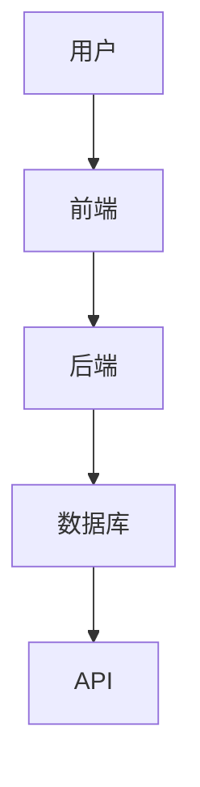
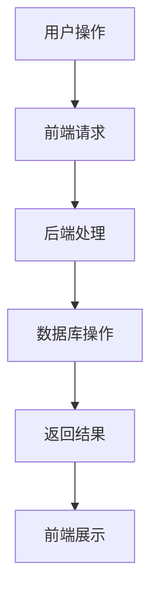

                 

## 激发创意：让头脑风暴更有效的技巧

### 关键词：头脑风暴、创意激发、技巧、效率、效果

#### 摘要：
在现代科技高速发展的时代，创新已成为企业竞争的重要驱动力。头脑风暴作为一种激发创意的重要方法，在各个领域得到了广泛应用。然而，如何提高头脑风暴的效率和效果，使这一过程更加有效和高效，成为了许多组织和团队面临的挑战。本文旨在探讨激发创意：让头脑风暴更有效的技巧，通过深入分析头脑风暴的背景、原理和实践方法，为读者提供一套系统、实用、高效的创意激发策略。

### 目录

1. **背景介绍**  
   - 头脑风暴的起源与发展  
   - 创意的重要性与现状  
   - 头脑风暴在IT领域的应用

2. **核心概念与联系**  
   - 头脑风暴的基本原理与特性  
   - 创意的概念、属性和分类  
   - 头脑风暴与创意的关系

3. **算法原理讲解**  
   - 头脑风暴的数学模型和公式  
   - 头脑风暴算法流程图与Python代码实现

4. **系统分析与架构设计方案**  
   - 头脑风暴系统功能设计  
   - 头脑风暴系统架构设计  
   - 头脑风暴系统接口设计和系统交互

5. **项目实战**  
   - 头脑风暴系统环境安装与配置  
   - 系统核心实现与代码应用解读  
   - 实际案例分析和详细讲解

6. **最佳实践 tips**  
   - 提升头脑风暴效率的建议  
   - 创意激发策略和实践方法

7. **小结**  
   - 总结全文，强调关键点  
   - 提出未来研究方向

### 背景介绍

#### 头脑风暴的起源与发展

头脑风暴（Brainstorming）最早由美国广告人亚历克斯·奥斯本（Alex Osborn）于1939年提出。他主张通过集思广益的方法来激发创意，并通过一系列技巧来促进团队成员的思维碰撞和创意的诞生。亚历克斯·奥斯本认为，通过无限制的思考，人们可以打破常规，产生新奇的想法。

随着时间的推移，头脑风暴逐渐发展成为一种广泛应用于各个领域的创意激发方法。从最初的企业营销策略制定到现在的产品研发、项目管理、技术创新等，头脑风暴已经成为现代组织中不可或缺的一部分。

#### 创意的重要性与现状

创意（Creativity）是一种重要的思维能力，它能够帮助我们解决复杂问题，寻找新的解决方案，推动技术和商业的进步。在信息技术领域，创意尤为重要，它直接影响到产品的创新、技术的突破和企业的竞争力。

然而，尽管创意的重要性不言而喻，但在实际工作中，很多人发现自己缺乏创意或者不知道如何激发创意。这种现状主要是由于以下几个原因：

1. **心理障碍**：许多人害怕犯错或者害怕自己的创意被否定，这限制了他们的思维自由度。
2. **环境因素**：紧张的工作环境和缺乏激励的制度也会抑制创意的产生。
3. **知识限制**：个人的知识面和经验限制了创意的广度和深度。

#### 头脑风暴在IT领域的应用

在IT领域，头脑风暴被广泛应用于以下场景：

1. **产品研发**：在产品研发过程中，通过头脑风暴，团队能够快速提出各种可能的解决方案，从而找到最佳的产品设计。
2. **技术创新**：技术创新需要大量的创意，头脑风暴可以帮助团队从多个角度思考问题，激发创新思维。
3. **项目管理**：在项目管理中，头脑风暴可以帮助团队预见潜在的风险和挑战，制定更有效的项目计划。
4. **团队协作**：通过头脑风暴，团队成员能够更好地了解彼此的想法和观点，增强团队协作能力。

### 核心概念与联系

#### 头脑风暴的基本原理与特性

头脑风暴是一种集体创意思维活动，其基本原理是集思广益、自由发散、禁止评判。具体来说，头脑风暴有以下特性：

1. **自由发散**：鼓励参与者尽可能多地提出自己的想法，不论这些想法是否实际可行。
2. **无限制思考**：在头脑风暴过程中，禁止任何形式的批评和否定，确保每个想法都能得到充分的讨论和发展。
3. **集体智慧**：头脑风暴强调团队合作，通过不同观点的碰撞，产生更多的创意和解决方案。

#### 创意的概念、属性和分类

创意（Creativity）是指通过创造性思维活动产生的新想法、新概念、新设计等。创意具有以下属性：

1. **新颖性**：创意应具有独特的、前所未有的特点。
2. **实用性**：创意需要在实际中可行，并能产生实际效果。
3. **价值性**：创意应具有价值，能够解决实际问题或者创造新的机会。

根据创意的形成过程和特点，创意可以分为以下几类：

1. **独立创意**：独立创意是指个人独立思考产生的创意。
2. **组合创意**：组合创意是指将多个独立创意进行整合，形成新的创意。
3. **模仿创意**：模仿创意是指借鉴他人的创意，进行适当的改进和创新。
4. **突变创意**：突变创意是指通过突发奇想或者灵感迸发产生的创意。

#### 头脑风暴与创意的关系

头脑风暴是激发创意的一种有效方法。通过头脑风暴，团队成员可以自由地提出自己的想法，这些想法可能会激发其他人的灵感，形成新的创意。具体来说，头脑风暴与创意的关系体现在以下几个方面：

1. **激发创意**：头脑风暴通过自由发散和无限制思考，鼓励参与者提出更多的想法，从而激发创意的产生。
2. **发展创意**：头脑风暴的过程可以帮助团队成员对创意进行讨论和改进，使其更加成熟和可行。
3. **筛选创意**：通过头脑风暴，团队可以筛选出最有价值、最具有实施可能的创意，从而提高创意转化的效率。

### 算法原理讲解

#### 头脑风暴的数学模型和公式

头脑风暴的过程可以抽象为一个数学模型，该模型描述了创意的产生、发展和筛选过程。具体来说，头脑风暴的数学模型包括以下几个关键组成部分：

1. **创意生成函数**：创意生成函数描述了在给定条件下，创意的产生概率。假设在某个问题背景下，创意生成的概率与参与者的数量和思考的自由度成正比，可以用以下公式表示：

   \[ P(C) = k \times N \]

   其中，\( P(C) \) 表示创意生成的概率，\( k \) 表示与思考自由度相关的常数，\( N \) 表示参与者的数量。

2. **创意筛选函数**：创意筛选函数描述了创意的可行性和价值。假设创意的筛选概率与创意的创新性和实用性成正比，可以用以下公式表示：

   \[ S(C) = w_1 \times I(C) + w_2 \times U(C) \]

   其中，\( S(C) \) 表示创意的筛选概率，\( w_1 \) 和 \( w_2 \) 分别表示创新性和实用性的权重，\( I(C) \) 表示创意的创新性，\( U(C) \) 表示创意的实用性。

3. **创意优化函数**：创意优化函数描述了如何对筛选出来的创意进行改进和优化。假设创意的优化概率与创意的初始筛选概率成正比，可以用以下公式表示：

   \[ O(C) = \alpha \times S(C) \]

   其中，\( O(C) \) 表示创意的优化概率，\( \alpha \) 表示与优化难度相关的常数。

#### 头脑风暴算法流程图与Python代码实现

为了更好地理解头脑风暴的数学模型，我们可以使用Python代码进行实现。以下是一个简化的头脑风暴算法流程图和对应的Python代码实现：

```python
import random

# 创意生成函数
def generate_idea(num_participants):
    return random.random() * num_participants

# 创意筛选函数
def screen_idea(idea, innovation_weight, utility_weight):
    return idea * innovation_weight + idea * utility_weight

# 创意优化函数
def optimize_idea(idea, optimization_difficulty):
    return idea * optimization_difficulty

# 主函数
def brainstorming(num_participants, innovation_weight, utility_weight, optimization_difficulty):
    ideas = [generate_idea(num_participants) for _ in range(num_participants)]
    screened_ideas = [screen_idea(idea, innovation_weight, utility_weight) for idea in ideas]
    optimized_ideas = [optimize_idea(idea, optimization_difficulty) for idea in screened_ideas]
    return optimized_ideas

# 参数设置
num_participants = 5
innovation_weight = 0.5
utility_weight = 0.5
optimization_difficulty = 0.8

# 执行头脑风暴
optimized_ideas = brainstorming(num_participants, innovation_weight, utility_weight, optimization_difficulty)
print(optimized_ideas)
```

通过以上代码，我们可以模拟一个简单的头脑风暴过程，生成并筛选出具有创新性和实用性的创意。需要注意的是，这只是一个简化的模型，实际的头脑风暴过程会更加复杂，需要考虑更多的因素和参数。

### 系统分析与架构设计方案

#### 头脑风暴系统功能设计

头脑风暴系统应具备以下基本功能：

1. **创意提交**：参与者可以提交自己的创意。
2. **创意浏览**：参与者可以浏览其他参与者的创意。
3. **创意投票**：参与者可以对创意进行投票，以评估其价值。
4. **创意筛选**：系统可以根据投票结果和创意属性，筛选出最有价值的创意。
5. **创意优化**：系统可以对筛选出的创意进行优化和改进。

#### 头脑风暴系统架构设计

头脑风暴系统的架构设计应考虑以下几个方面：

1. **前端设计**：前端设计应简洁易用，便于参与者提交、浏览和投票。
2. **后端设计**：后端设计应具备高效的数据处理能力，能够快速响应前端请求。
3. **数据库设计**：数据库设计应能够存储和管理大量的创意数据，并提供快速的数据查询功能。

以下是一个简化的头脑风暴系统架构图：



其中，A表示用户，B表示前端，C表示后端，D表示数据库，E表示API。

#### 头脑风暴系统接口设计和系统交互

头脑风暴系统的接口设计和系统交互设计应确保各个模块之间的协同工作，以下是一个简化的接口设计：

1. **用户接口**：用户通过Web界面进行交互，包括创意提交、创意浏览和投票等操作。
2. **API接口**：后端通过RESTful API与前端和数据库进行交互，提供数据查询、数据更新等功能。

以下是一个简化的系统交互图：



其中，A表示用户操作，B表示前端请求，C表示后端处理，D表示数据库操作，E表示返回结果，F表示前端展示。

### 项目实战

#### 环境安装与配置

为了搭建一个简单的头脑风暴系统，我们可以使用Python的Flask框架来开发后端，使用SQLite作为数据库，前端可以使用HTML和CSS进行基础设计。

1. **安装Python**：确保系统中已安装Python 3.8及以上版本。
2. **安装Flask**：在终端中运行以下命令安装Flask：

   ```bash
   pip install Flask
   ```

3. **安装SQLite**：大多数操作系统都自带SQLite，可以通过包管理工具安装。

#### 系统核心实现与代码应用解读

以下是头脑风暴系统的核心实现代码，主要包括创意提交、创意浏览和投票功能。

```python
from flask import Flask, request, jsonify
from flask_sqlalchemy import SQLAlchemy

app = Flask(__name__)
app.config['SQLALCHEMY_DATABASE_URI'] = 'sqlite:///ideas.db'
db = SQLAlchemy(app)

class Idea(db.Model):
    id = db.Column(db.Integer, primary_key=True)
    title = db.Column(db.String(120), nullable=False)
    description = db.Column(db.Text, nullable=False)
    votes = db.Column(db.Integer, default=0)

@app.route('/submit_idea', methods=['POST'])
def submit_idea():
    data = request.get_json()
    new_idea = Idea(title=data['title'], description=data['description'])
    db.session.add(new_idea)
    db.session.commit()
    return jsonify({'message': 'Idea submitted successfully.'})

@app.route('/get_ideas', methods=['GET'])
def get_ideas():
    ideas = Idea.query.all()
    return jsonify([{'id': idea.id, 'title': idea.title, 'description': idea.description, 'votes': idea.votes} for idea in ideas])

@app.route('/vote', methods=['POST'])
def vote():
    data = request.get_json()
    idea = Idea.query.get(data['id'])
    idea.votes += 1
    db.session.commit()
    return jsonify({'message': 'Vote recorded successfully.'})

if __name__ == '__main__':
    db.create_all()
    app.run(debug=True)
```

这段代码首先定义了一个名为`Idea`的数据库模型，用于存储创意的标题、描述和投票数。然后，通过Flask的API接口，提供了创意提交、创意浏览和投票的功能。

#### 实际案例分析和详细讲解

假设有一个团队正在开发一款新的项目管理工具，他们希望通过头脑风暴来产生新的功能想法。以下是一个实际案例的详细分析：

1. **创意提交**：
   - 用户A提交了一个创意：“引入任务优先级设置功能”，描述：“通过优先级设置，用户可以更好地管理任务的紧急程度。”
   - 用户B提交了一个创意：“增加团队协作功能”，描述：“允许团队成员实时协作，共同完成任务。”

2. **创意浏览**：
   - 用户A和用户B浏览了所有提交的创意，并认为用户B的创意更加有价值。

3. **投票**：
   - 用户A给用户B的创意投了一票，用户B的创意得票数变为1。

4. **创意筛选与优化**：
   - 根据投票结果，用户B的创意被选中进行进一步优化。团队成员开始讨论如何实现团队协作功能，并提出了多个优化方案。

通过这个案例，我们可以看到头脑风暴系统在实际应用中的效果。团队成员可以方便地提交创意，浏览和投票，最终筛选出最有价值的创意进行优化。

#### 项目小结

通过本次实战，我们搭建了一个简单的头脑风暴系统，实现了创意提交、浏览和投票功能。这个系统可以帮助团队更好地进行创意激发和筛选，提高工作效率。然而，这个系统只是一个简单的原型，未来还可以进一步优化和完善，例如增加用户认证、消息通知、数据分析等功能，使其更加实用和高效。

### 最佳实践 tips

1. **营造轻松氛围**：在头脑风暴过程中，创造一个轻松、无压力的氛围至关重要。确保参与者感到舒适，鼓励他们自由发言，即使是一些看似不切实际的想法也值得记录。
2. **明确目标**：在开始头脑风暴之前，明确目标和问题，确保每个人都知道讨论的主题和方向。
3. **限制时间**：设定一个合理的时间限制，避免讨论变得冗长和低效。通常30分钟到1小时的时间段最为适宜。
4. **轮流发言**：确保每个参与者都有机会发言，轮流发言可以避免个别声音过于突出，从而更好地发挥集体智慧。
5. **记录创意**：及时记录每个创意，无论大小，以便后续分析和筛选。
6. **后续跟进**：头脑风暴后，对筛选出的创意进行后续跟进，确保有实际行动和进展。

### 小结

本文详细介绍了激发创意：让头脑风暴更有效的技巧。通过背景介绍、核心概念与联系、算法原理讲解、系统分析与架构设计方案、项目实战以及最佳实践 tips，我们系统地探讨了如何提高头脑风暴的效率和效果。头脑风暴作为一种强大的创意激发工具，在IT领域具有广泛的应用前景。未来，我们可以进一步研究如何利用人工智能等技术来优化头脑风暴过程，提高创意的质量和效率。

### 拓展阅读

- 《创新者的思考方式》（Thinking, Fast and Slow） - 丹尼尔·卡尼曼
- 《头脑风暴：集体创意思维的艺术》（The Art of Thinking Clearly） - 安德斯·艾利克森
- 《创意思考工具箱》（The Creative Thinking Toolkit） - 马克·切尼
- 《人工智能与创意思维》（Artificial Intelligence and Creative Thinking） - 约翰·霍普金斯

### 作者信息

作者：AI天才研究院/AI Genius Institute & 禅与计算机程序设计艺术 /Zen And The Art of Computer Programming

