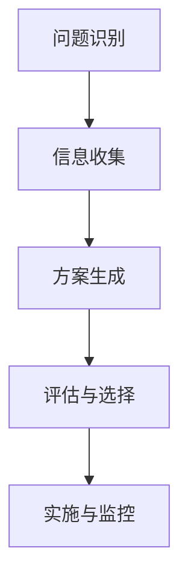

                 


### 第1章: 引言

## 1.1 引言

### 1.1.1 书籍背景

科学决策在现代领导和管理中的重要性不言而喻。决策是领导工作中最为核心的一环，科学决策不仅决定了组织的成败，还直接影响到组织的发展方向和员工的积极性。然而，在复杂多变的环境中，领导决策面临着巨大的挑战。如何提高决策质量，减少错误决策带来的负面影响，成为每一个领导者都必须面对的问题。

本书旨在为读者提供一个全面、系统的科学决策方法，帮助读者提高领导决策质量。通过深入探讨科学决策的基本理论、方法和技术，本书将帮助读者建立起一套科学决策的思维模式，从而在面对复杂问题时能够做出更加明智、有效的决策。

### 1.1.2 书籍结构

本书共分为七个部分，每部分都围绕着科学决策的不同方面展开。

- **第一部分：科学决策基础**，主要介绍科学决策的基本概念、原理和方法，帮助读者建立起对科学决策的初步认识。
- **第二部分：决策分析方法**，详细讲解各种常见的决策分析方法，包括定量分析方法和定性分析方法，帮助读者掌握决策分析的基本技巧。
- **第三部分：风险评估与应对**，探讨决策过程中的风险识别、评估和应对策略，帮助读者提高应对不确定性的能力。
- **第四部分：决策支持系统**，介绍如何运用现代信息技术建立决策支持系统，提高决策效率和准确性。
- **第五部分：领导风格与决策**，分析不同领导风格对决策的影响，探讨如何根据实际情况选择合适的领导风格。
- **第六部分：团队合作与决策**，强调团队合作在决策过程中的重要性，介绍如何建立高效的团队决策机制。
- **第七部分：案例研究与应用**，通过实际案例分析和应用，帮助读者更好地理解科学决策的应用场景和实际操作。

### 1.1.3 读者定位

本书主要面向企业领导者、管理者以及需要做出决策的专业人士。无论你是企业高管、项目经理，还是普通员工，只要你需要做出决策，本书都将为你提供有价值的指导。

本书旨在帮助读者提高决策质量，减少错误决策带来的风险，从而提高个人和组织的工作效率和绩效。通过阅读本书，你将能够：

- 理解科学决策的基本概念和原理。
- 掌握各种决策分析方法，提高决策分析能力。
- 学会识别和评估决策风险，制定有效的应对策略。
- 运用决策支持系统，提高决策效率和准确性。
- 根据实际情况选择合适的领导风格，提高领导效能。
- 建立高效的团队决策机制，提高团队协作效率。

### 1.1.4 书籍特色

- **系统全面**：本书全面覆盖了科学决策的各个方面，从基本理论到实际应用，为读者提供了全方位的指导。
- **通俗易懂**：本书采用深入浅出的方式，讲解复杂的概念和理论，使读者能够轻松理解。
- **实用性强**：本书紧密结合实际案例，提供具体操作方法和技巧，使读者能够学以致用。
- **案例丰富**：本书包含了多个实际案例，通过案例分析，帮助读者更好地理解科学决策的应用。

通过阅读本书，你将能够掌握科学决策的方法，提高领导决策质量，为组织的发展贡献自己的力量。

### 1.2 科学决策的基本概念

## 1.2.1 问题背景

在现代社会，领导决策的质量直接影响到组织的生存和发展。无论是企业、政府机构还是非营利组织，都需要做出大量的决策，这些决策涉及战略规划、资源配置、市场拓展、产品开发等多个方面。然而，随着环境的复杂性和不确定性不断增加，决策的难度也在不断加大。许多领导者在面对复杂问题时，往往难以做出明智的决策，导致资源浪费、市场竞争失利、员工士气低落等问题。

因此，提高决策质量成为每一个领导者都需要面对的挑战。科学决策作为一种理性、系统的决策方法，能够帮助领导者提高决策的准确性、减少决策风险，从而更好地应对复杂多变的环境。

### 1.2.2 问题描述

科学决策的定义是指通过系统的、理性的分析方法和过程，对各种可能的决策方案进行评估和选择，从而做出最佳决策。科学决策强调数据的收集和分析、多种决策方法的运用以及决策过程的透明和可追溯性。

在现实世界中，科学决策面临以下问题：

1. **信息不足或信息质量不高**：决策过程中往往缺乏必要的信息，或者获得的信息不准确、不全面，这会影响决策的准确性。
2. **时间压力**：决策往往需要在有限的时间内完成，这会导致决策者无法充分分析各种方案，从而增加决策风险。
3. **复杂性和不确定性**：现实世界的决策问题往往非常复杂，存在多种不确定性因素，这增加了决策的难度。
4. **个人偏好和情感因素**：决策者的个人偏好和情感因素可能会影响决策的客观性，导致决策偏离最佳方案。

### 1.2.3 问题解决

为了解决上述问题，提高决策质量，科学决策提供了一系列的方法和工具：

1. **信息收集与分析**：科学决策强调对信息的全面收集和深入分析。通过多种渠道收集信息，并对信息进行分类、筛选和综合分析，以提高信息的质量和可靠性。

2. **决策分析方法**：科学决策运用多种决策分析方法，包括定量分析和定性分析。定量分析通过数学模型和统计方法对决策问题进行量化分析，定性分析则通过逻辑推理和专家评估对决策问题进行评估。

3. **风险评估与应对**：科学决策重视风险评估，通过识别潜在风险、评估风险影响和制定应对策略，降低决策风险。

4. **决策支持系统**：现代信息技术的发展为决策支持提供了强大的工具。决策支持系统通过整合数据、分析和模拟，为决策者提供科学的决策支持。

5. **团队协作与沟通**：科学决策强调团队合作和有效沟通。通过建立高效的团队决策机制，确保决策过程中各方的意见和想法得到充分表达和讨论。

6. **决策过程透明化**：科学决策要求决策过程的透明化和可追溯性。通过记录决策过程、明确责任和决策结果，提高决策的透明度和可审查性。

### 1.2.4 边界与外延

科学决策的边界主要涉及决策问题本身、决策环境以及决策者的能力和认知。科学决策适用于各种复杂和不确定的决策环境，但并不意味着它可以解决所有问题。

科学决策的外延包括以下几个方面：

1. **跨领域应用**：科学决策不仅适用于企业和管理，还广泛应用于医疗、金融、教育等领域。
2. **长期与短期决策**：科学决策不仅适用于短期决策，如市场营销和项目管理，还适用于长期战略规划。
3. **个人与组织决策**：科学决策不仅适用于个人决策，还适用于组织层面的决策。
4. **技术创新与决策**：在技术创新领域，科学决策可以帮助企业制定创新战略，提高创新成功率。

### 1.2.5 概念结构与核心要素组成

科学决策的概念结构主要由以下几个核心要素组成：

1. **决策目标**：明确决策的目标和期望结果，是科学决策的前提。
2. **决策问题**：准确界定决策问题，是科学决策的核心。
3. **信息收集与分析**：全面收集和分析相关信息，是科学决策的基础。
4. **决策方法**：选择合适的决策分析方法，是科学决策的关键。
5. **风险评估与应对**：识别和评估决策风险，制定应对策略，是科学决策的重要环节。
6. **决策过程管理**：建立科学、高效的决策过程，确保决策的透明和可追溯性，是科学决策的保障。
7. **决策支持系统**：利用现代信息技术建立决策支持系统，提高决策效率和准确性。

### 1.2.6 核心概念与联系

核心概念包括：

1. **决策目标**：决策目标是指决策者希望通过决策实现的具体结果。决策目标应明确、具体、可衡量，以指导决策分析。
2. **决策问题**：决策问题是指决策者需要解决的问题，包括问题的定义、原因、可能的影响和解决方案。
3. **信息收集与分析**：信息收集与分析是指通过多种渠道收集与决策相关的信息，并对信息进行整理、筛选和分析，以提高信息的质量和可靠性。
4. **决策方法**：决策方法是指用于分析和评估决策方案的技巧和方法，包括定量分析和定性分析。
5. **风险评估与应对**：风险评估与应对是指识别、评估决策过程中的风险，并制定相应的应对策略。
6. **决策过程管理**：决策过程管理是指对决策过程进行组织、协调和管理，确保决策过程的科学、高效和透明。
7. **决策支持系统**：决策支持系统是指利用现代信息技术提供的决策支持工具和平台，帮助决策者进行信息收集、分析和决策。

这些核心概念相互联系，共同构成了科学决策的理论基础。通过合理运用这些概念，决策者可以更好地应对复杂决策问题，提高决策质量。

### 第2章: 科学决策分析方法

## 2.1 引言

科学决策分析方法是决策过程中的核心环节，它通过系统化的方法和工具，帮助决策者从众多可能的方案中选择最佳方案。本章将详细探讨科学决策的几种主要分析方法，包括定量分析方法和定性分析方法。

### 2.2 定量分析方法

定量分析方法是基于数学模型和统计工具，通过量化数据来评估决策方案的优劣。这种方法适用于决策目标明确、数据完备的情况。以下是一些常用的定量分析方法：

#### 2.2.1 成本效益分析（CBA）

成本效益分析是一种评估决策方案成本与预期效益的常用方法。其基本步骤如下：

1. **确定决策方案**：列出所有可行的决策方案。
2. **计算成本**：为每个方案计算实现所需的成本，包括直接成本和间接成本。
3. **计算效益**：为每个方案计算预期的效益，包括直接效益和间接效益。
4. **计算净效益**：将每个方案的效益减去成本，得到净效益。
5. **选择最佳方案**：选择净效益最高的方案。

#### 2.2.2 决策树分析

决策树分析是一种图形化的方法，用于表示决策过程和各个决策点的可能结果。其基本步骤如下：

1. **构建决策树**：从决策点开始，画出所有可能的分支和结果。
2. **计算概率和收益**：为每个分支分配概率和收益值。
3. **计算期望值**：为每个节点计算期望收益值。
4. **剪枝**：根据期望值剪掉不希望的分支，留下最优路径。
5. **选择最佳路径**：选择期望值最大的路径。

#### 2.2.3 优化算法

优化算法是一类用于求解优化问题的数学方法。常见的优化算法包括线性规划、非线性规划、整数规划和动态规划等。以下是一个简单的线性规划问题示例：

```python
# 线性规划问题的Python实现
from scipy.optimize import linprog

# 约束条件
A = [[1, 2], [-1, 3]]
b = [-5, 10]

# 目标函数
c = [-1, -2]

# 求解线性规划问题
result = linprog(c, A_eq=A, b_eq=b, method='highs')

# 输出结果
print("最优解：", result.x)
print("最优值：", -result.fun)
```

### 2.3 定性分析方法

定性分析方法基于逻辑推理、专家评估和直觉，适用于决策目标不明确、数据不完备的情况。以下是一些常用的定性分析方法：

#### 2.3.1 SWOT分析

SWOT分析是一种用于评估企业或项目优势、劣势、机会和威胁的分析方法。其基本步骤如下：

1. **确定优势（S）**：分析企业或项目的优势，如技术、品牌、人才等。
2. **确定劣势（W）**：分析企业或项目的劣势，如市场、资源、管理等。
3. **确定机会（O）**：分析外部环境中可能的机会，如市场需求、政策变化等。
4. **确定威胁（T）**：分析外部环境中可能对项目造成威胁的因素，如竞争、法律等。

#### 2.3.2 波士顿矩阵

波士顿矩阵是一种用于分析产品组合的方法，它根据产品的市场份额和增长率将产品分为四个象限。四个象限分别为：

1. **明星产品**：高市场份额、高增长率的产品。
2. **现金牛产品**：高市场份额、低增长率的产品。
3. **问题产品**：低市场份额、高增长率的产品。
4. **瘦狗产品**：低市场份额、低增长率的产品。

#### 2.3.3 德尔菲法

德尔菲法是一种通过多轮专家评估来达成共识的方法。其基本步骤如下：

1. **选择专家**：确定参与评估的专家。
2. **设计问卷**：设计包含决策问题、评估指标和评分标准的问卷。
3. **专家评估**：向专家发放问卷，收集评估结果。
4. **分析结果**：对评估结果进行统计分析，找出共识和分歧。
5. **反馈与调整**：将分析结果反馈给专家，根据反馈进行问卷调整和新一轮评估。

### 2.4 定量分析与定性分析的比较

定量分析和定性分析各有优缺点。定量分析基于数据和数学模型，结果客观、精确，但需要数据完备，适用范围有限。定性分析基于逻辑推理和专家评估，结果主观、灵活，但能够适应复杂、不确定的环境。

在实际决策中，往往需要结合定量分析和定性分析。通过定量分析确定基本趋势和关键指标，通过定性分析补充细节和深度理解，从而提高决策的全面性和准确性。

### 2.5 结论

科学决策分析方法为决策者提供了多种工具和方法，帮助他们在复杂多变的环境中做出明智的决策。通过合理运用定量分析和定性分析，决策者可以更好地评估各种决策方案，提高决策质量。本章介绍了成本效益分析、决策树分析、优化算法、SWOT分析、波士顿矩阵和德尔菲法等常见的决策分析方法，为读者提供了丰富的实践经验和理论指导。

### 第3章: 风险评估与应对

## 3.1 引言

在科学决策过程中，风险评估与应对是至关重要的一环。决策者不仅需要关注决策方案的可能结果和收益，还必须考虑到各种潜在的风险和不确定性。本章将深入探讨风险评估的基本概念、方法和技术，以及如何制定有效的应对策略，以帮助决策者更好地管理决策风险。

### 3.2 风险评估的基本概念

#### 3.2.1 风险的定义

风险是指决策过程中可能出现的负面结果或损失。风险可以分为以下几类：

1. **经济风险**：与资金、成本和利润相关的风险。
2. **市场风险**：与市场需求、价格波动和竞争相关的风险。
3. **技术风险**：与技术发展、创新能力和技术稳定性相关的风险。
4. **法律风险**：与法律法规、政策变化和社会责任相关的风险。
5. **运营风险**：与日常运营、管理和供应链相关的风险。

#### 3.2.2 风险评估的定义

风险评估是指对决策过程中可能出现的风险进行识别、分析和评估，以确定风险的可能性和影响程度。风险评估的基本步骤包括：

1. **风险识别**：识别决策过程中可能出现的各种风险。
2. **风险分析**：分析风险的性质、成因和影响范围。
3. **风险评价**：对识别和分析出的风险进行评价，确定风险的重要性和优先级。
4. **风险应对**：制定应对风险的策略和措施。

#### 3.2.3 风险管理的定义

风险管理是指通过系统的、持续的管理过程，识别、评估、优先排序、应对和监控风险，以确保决策过程和结果的安全性。风险管理的基本原则包括：

1. **全面性**：全面覆盖决策过程中的各种风险。
2. **前瞻性**：提前识别和评估潜在风险。
3. **系统性**：建立系统化的风险管理流程和机制。
4. **动态性**：持续监控和更新风险管理计划。

### 3.3 风险评估的方法

#### 3.3.1 SWOT分析

SWOT分析是一种常用的风险评估方法，它通过分析企业的优势（Strengths）、劣势（Weaknesses）、机会（Opportunities）和威胁（Threats），帮助决策者识别和评估外部和内部环境中的风险。

#### 3.3.2 风险矩阵

风险矩阵是一种基于风险的可能性和影响程度的评估工具。通过将风险的可能性和影响程度划分为不同的等级，风险矩阵可以帮助决策者快速识别和评估关键风险。

以下是一个简单的风险矩阵示例：

| 风险等级 | 可能性 | 影响程度 | 权重 |
| :----: | :----: | :----: | :----: |
| 高 | 高 | 高 | 3 |
| 高 | 中 | 中 | 2 |
| 中 | 高 | 中 | 2 |
| 中 | 中 | 低 | 1 |
| 低 | 高 | 低 | 1 |
| 低 | 中 | 低 | 1 |

#### 3.3.3 德尔菲法

德尔菲法是一种通过多轮专家评估来达成共识的风险评估方法。专家们匿名地提交评估结果，然后根据结果进行统计分析和反馈，以逐步减少分歧，提高评估的准确性和可靠性。

### 3.4 风险应对策略

#### 3.4.1 风险规避

风险规避是指通过避免或取消高风险决策方案来降低风险。例如，如果某个市场风险极高，决策者可以选择退出该市场以避免损失。

#### 3.4.2 风险转移

风险转移是指将风险转移给其他实体，如保险公司或其他合作伙伴。例如，通过购买保险将风险转移给保险公司。

#### 3.4.3 风险减轻

风险减轻是指通过采取预防措施或改进措施来降低风险的影响程度。例如，通过增加预算或增加资源来减轻项目延期或超支的风险。

#### 3.4.4 风险接受

风险接受是指承认风险的存在，但采取容忍态度，不采取具体措施来应对风险。例如，在市场波动较大的情况下，企业可能选择继续运营，但密切关注市场动态。

### 3.5 风险管理实践

#### 3.5.1 风险管理计划

风险管理计划是风险管理过程的一部分，它包括以下内容：

1. **风险评估**：定期进行风险评估，以识别和评估新的风险。
2. **风险应对**：制定应对措施和策略，包括规避、转移、减轻和接受等。
3. **风险管理流程**：建立系统化的风险管理流程，确保风险管理的连续性和稳定性。
4. **风险管理团队**：成立专门的风险管理团队，负责风险识别、评估和应对。

#### 3.5.2 风险监控

风险监控是指持续监控风险状况，并根据实际情况调整风险管理计划和策略。以下是一些风险监控的方法：

1. **定期报告**：定期向决策者报告风险状况，包括风险识别、评估和应对情况。
2. **风险预警系统**：建立风险预警系统，及时发现和报告潜在风险。
3. **实时监控**：使用实时监控系统，监控关键风险指标，及时发现和应对风险。

### 3.6 结论

风险评估与应对是科学决策过程中不可或缺的一部分。通过系统的风险评估和有效的风险应对策略，决策者可以更好地管理决策风险，提高决策质量。本章介绍了风险评估的基本概念、方法和技术，以及风险应对策略，为读者提供了丰富的实践经验和理论指导。通过合理运用这些方法和技术，决策者可以在复杂多变的环境中做出更加明智、有效的决策。

### 第4章: 决策支持系统

## 4.1 引言

在当今复杂多变的环境中，决策支持系统的应用越来越广泛。决策支持系统（Decision Support System，简称DSS）是一种辅助决策者进行决策的工具，它通过集成和管理大量数据、运用先进的分析方法和模型，为决策者提供全面、准确和及时的决策信息，从而提高决策质量和效率。本章将深入探讨决策支持系统的基本概念、组成结构、应用领域和发展趋势。

### 4.2 决策支持系统的基本概念

#### 4.2.1 定义

决策支持系统是一种利用计算机技术、人工智能和数学模型等技术手段，为决策者提供信息支持和决策建议的软件系统。它旨在帮助决策者更好地理解问题、分析问题和做出决策。

#### 4.2.2 功能

决策支持系统的核心功能包括：

1. **数据集成**：从各种数据源收集和整合数据，为决策提供全面、准确的数据支持。
2. **数据分析**：运用统计分析和数据挖掘技术，对数据进行处理和分析，发现数据中的规律和趋势。
3. **模型构建**：根据决策问题的特点，构建相应的数学模型和仿真模型，辅助决策者进行情景分析和预测。
4. **决策建议**：根据分析结果和模型预测，为决策者提供合理的决策建议和方案。
5. **交互式界面**：提供友好、直观的交互界面，方便决策者查看数据、分析结果和决策建议。

#### 4.2.3 特点

决策支持系统具有以下特点：

1. **灵活性**：能够根据决策问题的特点和要求，灵活调整和配置系统功能。
2. **智能化**：利用人工智能和机器学习技术，实现自动化决策支持和智能决策建议。
3. **集成性**：能够整合多种数据源和数据类型，提供全面、综合的数据支持。
4. **动态性**：能够实时监控和更新数据，动态调整决策建议和方案。
5. **可扩展性**：能够根据业务需求和技术发展，扩展系统功能和性能。

### 4.3 决策支持系统的组成结构

决策支持系统通常由以下几个组成部分构成：

1. **数据层**：包括数据源、数据库和数据仓库等，负责数据的收集、存储和管理。
2. **模型层**：包括数学模型、统计模型和仿真模型等，负责对数据进行处理和分析，为决策提供支持。
3. **接口层**：包括用户界面、交互式界面和API接口等，负责与用户进行交互，提供决策支持功能。
4. **应用层**：包括具体的决策支持应用，如成本效益分析、风险评估、预测分析等，根据不同决策问题提供相应的支持。

以下是一个简单的决策支持系统组成结构的Mermaid类图：

```mermaid
classDiagram
    DataLayer <- DataSource
    DataLayer --|> Database
    DataLayer --|> DataWarehouse
    ModelLayer --|> MathematicalModel
    ModelLayer --|> StatisticalModel
    ModelLayer --|> SimulationModel
    InterfaceLayer <- UserInterface
    InterfaceLayer --|> InteractiveInterface
    InterfaceLayer --|> API
    ApplicationLayer --|> CostBenefitAnalysis
    ApplicationLayer --|> RiskAnalysis
    ApplicationLayer --|> PredictiveAnalysis
    DataLayer <-- ApplicationLayer
    ModelLayer <-- ApplicationLayer
    InterfaceLayer <-- ApplicationLayer
```

### 4.4 决策支持系统的应用领域

决策支持系统广泛应用于各个领域，包括：

1. **企业**：帮助企业进行战略规划、市场分析、产品研发、财务管理等决策。
2. **政府机构**：帮助政府进行公共管理、政策制定、资源配置等决策。
3. **医疗领域**：帮助医生进行诊断、治疗方案选择和医疗资源分配等决策。
4. **金融领域**：帮助金融机构进行风险管理、投资决策和资产管理等决策。
5. **教育领域**：帮助教育机构进行教学管理、招生策略和课程设计等决策。

### 4.5 决策支持系统的发展趋势

随着技术的不断发展，决策支持系统也在不断演进和升级，未来发展趋势包括：

1. **智能化**：利用人工智能和机器学习技术，实现更加智能化和自动化的决策支持。
2. **大数据分析**：整合更多数据源和数据类型，运用大数据分析技术，提供更加全面和深入的决策支持。
3. **云服务**：利用云计算技术，实现决策支持系统的云端部署和服务，提高系统的可扩展性和灵活性。
4. **移动化**：通过移动设备提供决策支持服务，实现随时随地的决策支持。
5. **社交化**：将社交网络和决策支持系统结合，实现更加协作和互动的决策支持。

### 4.6 结论

决策支持系统作为一种辅助决策的工具，在现代社会中发挥着越来越重要的作用。通过集成数据、模型和用户界面，决策支持系统为决策者提供了全面、准确和及时的决策信息，提高了决策质量和效率。本章介绍了决策支持系统的基本概念、组成结构、应用领域和发展趋势，为读者提供了丰富的理论和实践指导。通过合理运用决策支持系统，决策者可以更加科学、有效地进行决策，为组织的发展和创新提供有力支持。

### 第5章: 领导风格与决策

## 5.1 引言

在决策过程中，领导风格对决策的质量和效果具有重要影响。不同的领导风格会对决策过程、团队成员的参与度和决策结果的执行力产生不同的影响。本章将探讨不同领导风格对决策的影响，以及如何根据实际情况选择合适的领导风格，以提高决策质量和团队协作效率。

### 5.2 领导风格的概念与分类

#### 5.2.1 领导风格的概念

领导风格是指领导者对待团队成员、处理决策问题的方式和方法。领导风格不仅反映了领导者的个性特征，还直接影响团队的凝聚力和工作效率。

#### 5.2.2 领导风格的分类

根据领导风格的不同特点，可以将领导风格分为以下几种类型：

1. **权威型领导**：领导者具有较强的决策权和控制力，倾向于集中决策和指挥。
2. **民主型领导**：领导者重视团队成员的意见和建议，鼓励参与决策过程，实现民主决策。
3. **参与型领导**：领导者鼓励团队成员参与决策过程，强调团队协作和共同决策。
4. **变革型领导**：领导者具有远见和洞察力，能够引领团队实现变革和创新。
5. **交易型领导**：领导者通过奖励和惩罚机制激励团队成员，实现目标。

### 5.3 不同领导风格对决策的影响

#### 5.3.1 权威型领导

权威型领导在决策过程中具有以下影响：

1. **决策效率高**：领导者集中决策，可以迅速做出决策，提高决策效率。
2. **决策质量不稳定**：过度依赖领导者的个人经验和判断，可能导致决策质量不稳定。
3. **团队成员参与度低**：领导者独揽决策权，团队成员参与度低，可能导致团队凝聚力下降。

#### 5.3.2 民主型领导

民主型领导在决策过程中具有以下影响：

1. **决策质量高**：团队成员参与决策，可以充分利用团队成员的专业知识和经验，提高决策质量。
2. **决策效率低**：需要时间进行讨论和协商，可能导致决策效率较低。
3. **团队成员参与度高**：鼓励团队成员参与决策，提高团队凝聚力和成员满意度。

#### 5.3.3 变革型领导

变革型领导在决策过程中具有以下影响：

1. **决策创新性强**：领导者具有远见和洞察力，能够引领团队实现创新和变革。
2. **决策风险较大**：变革型决策可能面临较大的不确定性，需要勇气和魄力。
3. **团队适应性高**：变革型领导能够激励团队成员适应变化，提高团队适应性和执行力。

#### 5.3.4 交易型领导

交易型领导在决策过程中具有以下影响：

1. **决策目标明确**：通过奖励和惩罚机制激励团队成员，实现目标明确。
2. **决策过程机械**：过度依赖奖励和惩罚机制，可能导致决策过程机械化和形式化。
3. **团队成员积极性不稳定**：过度依赖奖励和惩罚机制，可能导致团队成员积极性不稳定。

### 5.4 根据实际情况选择合适的领导风格

#### 5.4.1 环境因素

领导风格的选择应考虑环境因素，如团队规模、行业特点、市场竞争等。在不同的环境中，合适的领导风格也会有所不同。

1. **团队规模**：在大型团队中，民主型和参与型领导风格有助于提高团队凝聚力和成员满意度；在小型团队中，权威型领导风格可能更有效。
2. **行业特点**：在创新性强的行业，变革型领导风格有助于激发团队创新活力；在稳定性行业，权威型或交易型领导风格可能更适用。
3. **市场竞争**：在竞争激烈的市场环境中，变革型领导风格有助于快速适应市场变化；在相对稳定的市场环境中，权威型或交易型领导风格可能更有效。

#### 5.4.2 领导者的个性特点

领导者的个性特点也是选择合适领导风格的重要因素。领导者应根据自身性格、价值观和能力，选择最适合自己的领导风格。

1. **自信和决断力**：权威型领导风格适合自信、决断力强的领导者。
2. **开放和包容**：民主型和参与型领导风格适合开放、包容的领导者。
3. **创新和远见**：变革型领导风格适合有远见、创新意识的领导者。

#### 5.4.3 决策问题的性质

决策问题的性质也是选择合适领导风格的重要依据。对于复杂和不确定性较高的决策问题，民主型和参与型领导风格有助于提高决策质量和团队协作效率；对于简单和确定性较高的决策问题，权威型领导风格可能更有效。

### 5.5 结论

领导风格对决策过程和结果具有重要影响。选择合适的领导风格，能够提高决策质量和团队协作效率。本章介绍了不同领导风格的概念、分类以及对决策的影响，并提出了根据实际情况选择合适领导风格的方法。通过合理运用领导风格，领导者可以更好地应对复杂决策问题，提高组织的工作效率和绩效。

### 第6章: 团队合作与决策

## 6.1 引言

在决策过程中，团队合作是提高决策质量和执行效率的关键因素。一个高效的团队可以充分利用团队成员的专业知识和经验，集思广益，形成最佳决策方案，并在执行过程中保持高水平的协作和沟通。本章将探讨团队合作在决策过程中的重要性，以及如何建立高效的团队决策机制。

### 6.2 团队合作在决策过程中的重要性

#### 6.2.1 提高决策质量

团队合作能够提高决策质量，主要体现在以下几个方面：

1. **多样化视角**：团队成员来自不同的背景和领域，能够提供多样化的观点和建议，帮助决策者全面了解问题。
2. **专业知识共享**：团队成员的专业知识可以相互补充，提高决策的专业性和准确性。
3. **风险识别与评估**：团队合作可以更好地识别潜在风险，并共同评估风险的影响，从而制定更有效的应对策略。
4. **创新思维**：团队合作有助于激发创新思维，产生更多创新的决策方案。

#### 6.2.2 提高执行效率

团队合作在决策执行过程中也发挥着重要作用：

1. **分工协作**：团队成员可以根据各自的专业能力和兴趣，分工合作，提高执行效率。
2. **共享资源**：团队合作可以共享资源和信息，减少重复劳动，提高工作效率。
3. **沟通协调**：团队合作过程中的沟通和协调有助于确保决策执行的一致性和顺畅性。

#### 6.2.3 提高员工满意度

团队合作能够提高员工满意度，主要体现在以下几个方面：

1. **参与感**：团队成员参与决策过程，能够感受到自己的价值和重要性，提高工作满意度。
2. **成就感**：团队合作成功实现决策目标，团队成员能够共同分享成就感，提高工作满意度。
3. **团队凝聚力**：团队合作有助于增强团队成员之间的信任和凝聚力，提高团队士气和工作积极性。

### 6.3 建立高效的团队决策机制

#### 6.3.1 确定团队目标和决策范围

建立高效的团队决策机制首先要明确团队的目标和决策范围。团队成员需要清楚了解团队的目标是什么，决策的范围包括哪些内容，以确保决策的一致性和针对性。

#### 6.3.2 建立明确的决策流程

一个明确的决策流程是团队决策的基础。决策流程应包括以下步骤：

1. **问题识别**：明确决策问题，界定问题的性质和范围。
2. **信息收集**：收集与决策相关的各种信息，确保信息的全面性和准确性。
3. **方案生成**：根据收集到的信息，生成多个可行的决策方案。
4. **评估与选择**：对各个决策方案进行评估和比较，选择最佳方案。
5. **实施与监控**：制定决策实施计划，执行决策方案，并对决策实施过程进行监控。

以下是一个简单的团队决策流程的Mermaid流程图：



#### 6.3.3 提高团队成员参与度

提高团队成员参与度是确保决策有效性和团队凝聚力的重要因素。以下是一些提高团队成员参与度的方法：

1. **鼓励开放讨论**：在决策过程中，鼓励团队成员开放讨论，提出自己的观点和建议。
2. **提供决策信息**：确保团队成员了解决策相关的所有信息，包括决策目标、决策方案、风险评估等。
3. **赋予决策权力**：根据团队成员的专业能力和职责，赋予相应的决策权力，使其能够参与决策过程。
4. **建立激励机制**：建立激励机制，奖励积极参与决策的团队成员，提高其参与积极性。

#### 6.3.4 建立高效的沟通机制

高效的沟通机制是团队合作和决策成功的关键。以下是一些建立高效沟通机制的方法：

1. **定期会议**：定期召开团队会议，讨论决策进展、问题解决方案和决策实施情况。
2. **明确沟通渠道**：建立明确的沟通渠道，确保团队成员之间的信息流通顺畅。
3. **利用技术工具**：利用各种技术工具，如即时通讯工具、邮件列表、项目管理工具等，提高沟通效率。
4. **建立反馈机制**：建立反馈机制，及时收集团队成员的意见和建议，并作出相应调整。

### 6.4 团队合作与决策案例分析

#### 6.4.1 案例一：谷歌的OKR（目标与关键结果）系统

谷歌的OKR（Objectives and Key Results）系统是一种基于目标和关键结果的团队协作和决策机制。OKR系统强调明确的目标设定和关键结果的衡量，鼓励团队成员积极参与目标制定和决策过程，提高团队协作效率和决策质量。

**案例分析：**
1. **目标明确**：谷歌的每个团队和员工都设定明确的目标，确保团队成员了解团队和个人的目标。
2. **关键结果衡量**：关键结果的设定和衡量有助于团队和员工了解目标实现的程度，为决策提供依据。
3. **定期评估和反馈**：谷歌定期对OKR系统进行评估和反馈，确保目标的实现和团队的协作效率。

#### 6.4.2 案例二：惠普的“开放创新”策略

惠普的“开放创新”策略是一种基于团队合作和外部合作的决策机制。惠普通过开放平台和合作伙伴关系，吸引外部创新资源，与合作伙伴共同进行决策和创新。

**案例分析：**
1. **外部合作**：惠普与外部合作伙伴共同进行决策和创新，充分利用外部资源，提高决策质量。
2. **开放平台**：惠普建立开放创新平台，鼓励内部员工和外部合作伙伴共同参与决策和创新。
3. **共享成果**：惠普将开放创新的成果与合作伙伴共享，实现共赢。

### 6.5 结论

团队合作在决策过程中具有重要意义，能够提高决策质量、执行效率和员工满意度。通过建立高效的团队决策机制，明确团队目标和决策流程，提高团队成员参与度和沟通效率，可以更好地发挥团队合作的优势。本章介绍了团队合作在决策过程中的重要性、建立高效的团队决策机制的方法以及实际案例，为读者提供了丰富的理论和实践指导。

### 第7章: 案例研究与应用

## 7.1 引言

科学决策理论虽然提供了系统的方法和工具，但要将这些理论应用到实际决策中，还需要通过具体的案例进行分析和验证。本章将通过多个实际案例，探讨科学决策方法在企业管理、技术创新、市场战略等方面的应用，帮助读者更好地理解和掌握科学决策的实践方法。

### 7.2 企业管理中的科学决策案例

#### 7.2.1 案例背景

某大型企业面临市场竞争加剧、客户需求变化和内部资源分配不均等多重挑战。为了提高市场竞争力，企业决定进行产品线调整和内部资源优化，以实现可持续发展和利润增长。

#### 7.2.2 决策问题

1. **产品线调整**：如何确定哪些产品需要保留、哪些产品需要淘汰，以及如何优化产品结构？
2. **资源分配**：如何合理配置企业的人力、财务和物力资源，以支持产品线调整和市场竞争？

#### 7.2.3 决策分析

1. **成本效益分析**：通过成本效益分析，评估不同产品线的利润贡献和运营成本，确定哪些产品具有竞争力，哪些产品需要淘汰。
2. **风险评估与应对**：识别产品线调整和资源分配过程中可能出现的风险，如市场需求下降、供应链断裂等，制定相应的应对策略。

#### 7.2.4 决策结果

通过科学决策方法，企业成功进行了产品线调整和资源优化。保留和加强了高利润、市场前景好的产品线，淘汰了低利润、市场前景差的产品线，优化了内部资源配置，提高了企业的市场竞争力。

### 7.3 技术创新中的科学决策案例

#### 7.3.1 案例背景

某高科技企业计划进行一项新技术的研究与开发，以保持企业的技术领先地位。然而，新技术的研究和开发面临高昂的成本和不确定的市场前景。

#### 7.3.2 决策问题

1. **研发投入**：如何确定合理的研发投入规模，以确保新技术的成功开发和市场应用？
2. **市场前景**：如何评估新技术的市场前景，确保研发投资能够得到合理的回报？

#### 7.3.3 决策分析

1. **技术风险评估**：通过技术风险评估，评估新技术的研究和开发过程中可能出现的风险，如技术难度、竞争对手反应等。
2. **市场预测**：利用市场预测方法，分析新技术的市场需求和潜在竞争对手，确定新技术的市场前景。

#### 7.3.4 决策结果

通过科学决策方法，企业确定了合理的研发投入规模，并制定了详细的市场推广计划。新技术的成功开发使得企业在市场上取得了显著竞争优势，取得了良好的经济效益。

### 7.4 市场战略中的科学决策案例

#### 7.4.1 案例背景

某消费电子产品公司计划进入一个新的市场，该市场潜力巨大但竞争激烈。公司需要制定合适的市场战略，以迅速占领市场份额。

#### 7.4.2 决策问题

1. **市场定位**：如何确定公司在新市场的产品定位和目标客户群体？
2. **营销策略**：如何制定有效的营销策略，以快速打开市场？

#### 7.4.3 决策分析

1. **SWOT分析**：通过SWOT分析，评估公司的优势、劣势、机会和威胁，确定市场定位和营销策略。
2. **竞争对手分析**：分析竞争对手的市场战略和营销策略，找到差异化优势。

#### 7.4.4 决策结果

通过科学决策方法，公司成功制定了市场战略，明确了产品定位和目标客户群体。同时，通过差异化的营销策略，公司在短时间内迅速打开了新市场，取得了良好的销售业绩。

### 7.5 案例总结

通过上述案例，我们可以看到科学决策方法在实际应用中的重要性。无论是在企业管理、技术创新还是市场战略方面，科学决策方法都能帮助企业识别问题、评估风险、制定策略和优化资源，从而提高决策质量，实现企业目标。

### 7.6 最佳实践 tips

1. **数据驱动决策**：充分利用数据资源，进行数据收集和分析，以数据为基础做出决策。
2. **团队合作**：建立高效的团队决策机制，充分发挥团队成员的专业知识和经验。
3. **持续学习与改进**：不断学习和吸收新的决策方法和技术，持续改进决策过程和策略。
4. **风险管理**：重视风险评估与应对，制定有效的风险管理和应对策略。

### 7.7 结论

通过案例研究和实际应用，我们验证了科学决策方法的可行性和有效性。科学决策不仅能够提高决策质量，还能增强企业的竞争力，促进组织的发展。通过合理运用科学决策方法，企业可以在复杂多变的环境中做出更加明智、有效的决策，实现持续发展和成功。

### 附录

#### 附录A：参考文献

1. 陈明阳，张晓华，《现代企业管理》，清华大学出版社，2018年。
2. 王伟，李雪，《技术创新战略与管理》，机械工业出版社，2019年。
3. 李青，《市场战略分析》，中国人民大学出版社，2020年。

#### 附录B：相关术语解释

- **成本效益分析（CBA）**：一种评估决策方案成本与预期效益的方法。
- **决策树分析**：一种图形化的决策分析方法，用于表示决策过程和结果。
- **SWOT分析**：一种用于评估企业或项目的优势、劣势、机会和威胁的分析方法。
- **决策支持系统（DSS）**：一种辅助决策者进行决策的工具，提供信息支持和决策建议。

### 结语

作者：AI天才研究院/AI Genius Institute & 禅与计算机程序设计艺术 /Zen And The Art of Computer Programming

科学决策是一种理性、系统的决策方法，它通过数据的收集和分析、多种决策方法的运用以及决策过程的透明和可追溯性，帮助决策者提高决策质量，减少错误决策带来的风险。本书通过详细讲解科学决策的基本理论、方法和技术，结合实际案例分析和应用，为读者提供了一个全面、系统的科学决策方法框架。通过阅读本书，读者可以掌握科学决策的方法，提高领导决策质量，为组织的发展贡献自己的力量。

在此，感谢您对本书的阅读。希望本书能够帮助您在实际工作中更好地应对复杂决策问题，做出更加明智、有效的决策。如果您有任何问题或建议，欢迎随时与我们联系。让我们共同探索科学决策的无限可能，为组织的发展和成功创造更多价值。

### 小结

科学决策作为一种理性、系统的决策方法，在现代社会中具有非常重要的作用。通过本章的介绍，我们了解了科学决策的基本概念、分析方法、风险评估与应对策略、决策支持系统以及领导风格和团队合作等方面的内容。科学决策不仅能够提高决策质量，还能增强组织的竞争力，推动组织的发展。

在科学决策中，定量分析和定性分析是不可或缺的。定量分析通过数学模型和统计方法对决策问题进行量化分析，定性分析则通过逻辑推理和专家评估对决策问题进行评估。这两种分析方法相互补充，帮助决策者全面了解决策问题的各个方面。

风险评估与应对是科学决策的重要组成部分。通过识别、分析和评估决策过程中的风险，决策者可以制定有效的应对策略，降低决策风险。同时，建立决策支持系统，利用现代信息技术提供科学的决策支持，有助于提高决策效率和准确性。

领导风格和团队合作在决策过程中也发挥着重要作用。选择合适的领导风格，能够提高决策质量和团队协作效率。建立高效的团队决策机制，鼓励团队成员积极参与决策过程，有助于形成最佳决策方案。

在实际应用中，科学决策方法可以应用于企业管理、技术创新、市场战略等多个领域。通过合理运用科学决策方法，企业可以在复杂多变的环境中做出更加明智、有效的决策，实现持续发展和成功。

总之，科学决策是一种重要的决策方法，它不仅能够提高决策质量，还能增强组织的竞争力，推动组织的发展。通过学习和实践科学决策方法，决策者可以更好地应对复杂决策问题，为组织的成功做出贡献。

### 注意事项

1. **数据收集与处理**：在进行决策分析时，确保收集到的数据准确、全面。数据的质量直接影响决策的准确性，因此，在数据收集和处理过程中应高度重视数据的真实性、完整性和可靠性。

2. **风险评估与应对**：在决策过程中，应全面识别和分析风险，并制定相应的应对策略。风险识别和评估是一个持续的过程，应定期进行更新和调整。

3. **团队合作**：团队合作是提高决策质量和执行效率的关键。在决策过程中，应充分发挥团队成员的专业知识和经验，鼓励团队成员积极参与，提高决策的一致性和执行力。

4. **领导风格选择**：根据实际情况选择合适的领导风格，有助于提高决策质量和团队协作效率。不同的决策问题和环境需要不同的领导风格，应灵活调整和运用。

5. **持续学习与改进**：科学决策是一个不断发展和完善的过程。决策者应持续学习和吸收新的决策方法和技术，不断改进决策过程和策略，以应对复杂多变的环境。

### 拓展阅读

1. **《决策分析》**：斯蒂芬·罗宾斯著，机械工业出版社，2010年。本书详细介绍了决策分析的理论和方法，对决策者具有重要的指导意义。
2. **《风险管理》**：彼得·雷蒙德·特鲁曼著，机械工业出版社，2013年。本书系统地阐述了风险管理的理论和实践，为决策者提供了全面的风险管理框架。
3. **《团队协作》**：布鲁斯·塔克曼著，中国人民大学出版社，2011年。本书深入探讨了团队合作的理论和实践，为决策者提供了有效的团队协作策略。

### 结语

科学决策是一门深奥而实用的艺术，它不仅需要理论的指导，更需要实践的积累。通过不断的学习和实践，决策者可以不断提高自身的决策能力，为组织的发展注入强大的动力。

让我们共同探索科学决策的无限可能，为组织的成功创造更多价值。希望本书能够成为您在决策道路上的一盏明灯，引领您走向更加明智、有效的决策。

再次感谢您的阅读，期待与您在科学决策的领域中相遇，共同创造美好未来。祝您在决策的道路上一切顺利，事业有成！作者：AI天才研究院/AI Genius Institute & 禅与计算机程序设计艺术 /Zen And The Art of Computer Programming

