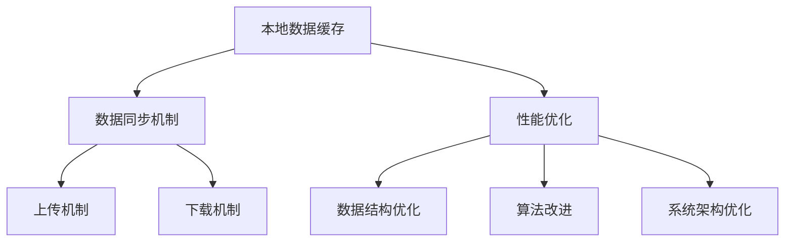
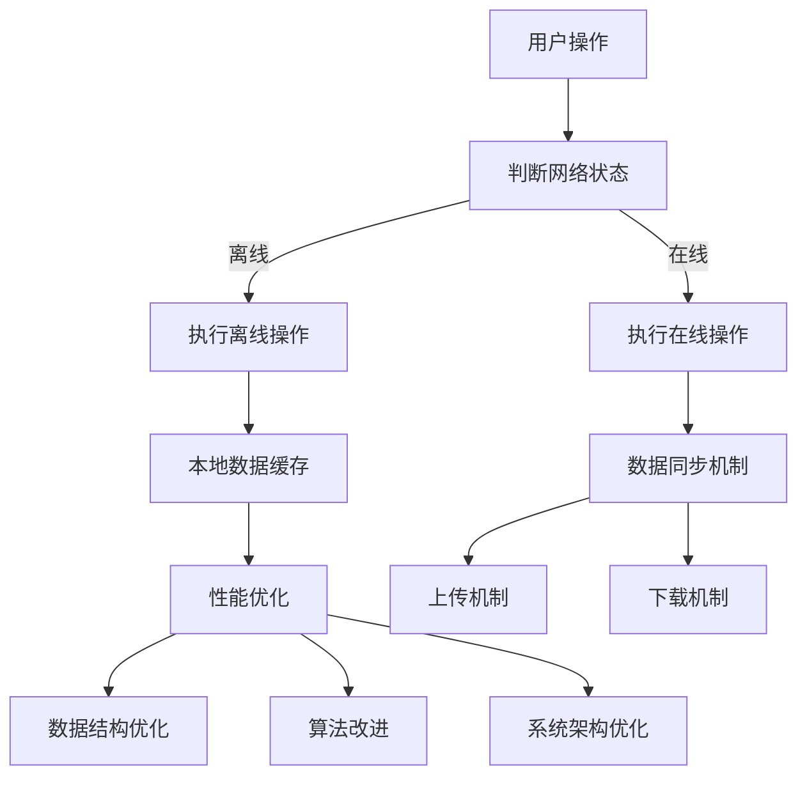
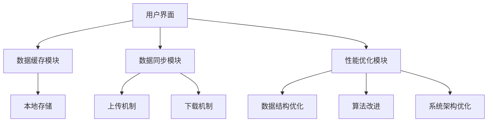
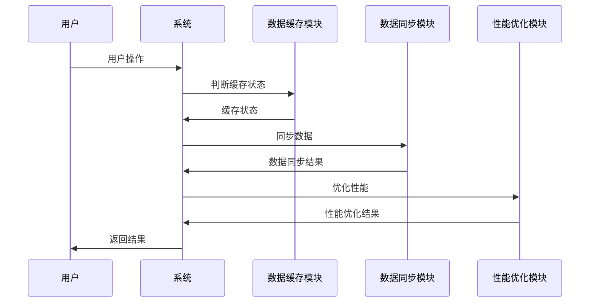

                 

### 移动应用离线化策略

关键词：移动应用，离线化，数据同步，缓存机制，性能优化，用户体验

摘要：随着移动设备的普及和互联网技术的发展，移动应用成为了人们日常生活和工作的重要工具。然而，网络环境的波动性和不确定性，给移动应用的性能和用户体验带来了巨大的挑战。本文将探讨移动应用的离线化策略，通过分析背景、核心概念、算法原理、系统设计与实战案例，旨在为开发者提供一套完整的离线化解决方案，以提高移动应用的性能和用户体验。

### 背景介绍

#### 核心概念术语说明

- **离线化**：指在移动应用中，用户在没有网络连接的情况下，仍然能够访问和使用应用的功能。离线化策略的核心目标是提高应用的稳定性和用户体验。
- **数据同步**：指在用户离线期间，应用将本地数据与云端数据进行同步，确保数据的一致性。数据同步通常包括数据上传和数据下载两个过程。
- **缓存机制**：指应用在本地存储一定量的数据，以加快访问速度。缓存机制可以分为内存缓存和磁盘缓存两种类型。

#### 问题背景

移动应用在用户离线时，常常面临以下问题：

- **数据无法访问**：用户在没有网络连接时，无法访问应用中的数据，导致用户体验不佳。
- **数据不一致**：用户在离线期间对数据进行修改，当网络恢复后，数据无法与云端同步，导致数据不一致。
- **性能下降**：离线状态下，应用需要处理大量本地数据，可能导致性能下降，影响用户体验。

#### 问题描述

移动应用离线化问题可以描述为：

- **如何实现用户离线时对应用数据的访问和操作？**
- **如何确保离线数据与云端数据的一致性？**
- **如何优化离线状态下的性能，提高用户体验？**

#### 问题解决

移动应用离线化问题的解决策略包括：

- **本地数据缓存**：在本地存储一定量的数据，提高访问速度。
- **数据同步机制**：实现离线数据与云端数据的同步，确保数据一致性。
- **性能优化**：通过算法优化和系统架构设计，提高离线状态下的性能。

#### 边界与外延

- **边界**：离线化策略适用于所有需要网络连接的移动应用，但不适用于完全离线的应用。
- **外延**：离线化策略可以扩展到其他需要数据同步的场景，如桌面应用、Web应用等。

#### 概念结构与核心要素组成

离线化策略的核心概念和要素包括：

- **数据存储**：本地存储和云端存储。
- **数据同步**：上传和下载机制。
- **缓存机制**：内存缓存和磁盘缓存。
- **性能优化**：算法优化和系统架构设计。

### 核心概念与联系

#### 核心概念原理

1. **本地数据缓存**：在本地存储一定量的数据，提高访问速度。本地数据缓存包括内存缓存和磁盘缓存。
2. **数据同步机制**：实现离线数据与云端数据的同步，确保数据一致性。数据同步机制包括上传和下载两个过程。
3. **性能优化**：通过算法优化和系统架构设计，提高离线状态下的性能。性能优化包括数据结构优化、算法改进和系统架构优化。

#### 概念属性特征对比表格

| 概念名称 | 特征1 | 特征2 | 特征3 |
| -------- | ----- | ----- | ----- |
| 本地数据缓存 | 提高访问速度 | 存储在本地 | 包括内存缓存和磁盘缓存 |
| 数据同步机制 | 确保数据一致性 | 包括上传和下载 | 需要与云端进行数据交互 |
| 性能优化 | 提高离线性能 | 通过算法优化和系统架构设计 | 包括数据结构优化和算法改进 |

#### ER实体关系图架构



### 算法原理讲解

#### 算法Mermaid流程图



#### Python源代码

```python
import requests
import json

class OfflineApplication:
    def __init__(self):
        self.cache = {}
        self.synced = True

    def user_action(self, action):
        if not self.is_connected():
            self.execute_offline_action(action)
        else:
            self.execute_online_action(action)

    def is_connected(self):
        try:
            requests.get('https://www.example.com')
            return True
        except requests.exceptions.RequestException:
            return False

    def execute_offline_action(self, action):
        if action in self.cache:
            print(f"执行离线操作：{action}")
        else:
            print(f"操作未缓存，无法执行离线操作：{action}")

    def execute_online_action(self, action):
        print(f"执行在线操作：{action}")
        self.sync_data()

    def sync_data(self):
        if not self.synced:
            print("开始同步数据...")
            self.upload_data()
            self.download_data()
            self.synced = True
        else:
            print("数据已同步，无需再次同步。")

    def upload_data(self):
        print("上传数据...")
        # 上传数据到云端的具体实现
        pass

    def download_data(self):
        print("下载数据...")
        # 从云端下载数据的具体实现
        pass

    def optimize_performance(self):
        print("优化性能...")
        # 性能优化的具体实现
        pass

app = OfflineApplication()
app.user_action("查看消息")
app.user_action("编辑文章")
```

#### 算法原理的数学模型和公式

算法原理的数学模型可以简化为：

- **网络状态判断**：`is_connected()`
- **离线操作**：`execute_offline_action()`
- **在线操作**：`execute_online_action()`
- **数据同步**：`sync_data()`
- **性能优化**：`optimize_performance()`

#### 举例说明

假设用户在离线状态下执行以下操作：

1. 查看消息
2. 编辑文章

在用户没有网络连接时，应用会执行离线操作。当用户查看消息时，如果消息已缓存，则直接从缓存中读取；否则，提示无法执行离线操作。在用户编辑文章时，由于编辑操作无法缓存，因此无法执行离线操作，需要提示用户等待网络连接。

当网络连接恢复后，应用会执行在线操作，并同步数据。在此过程中，会上传本地数据到云端，并从云端下载最新数据，以确保数据一致性。同时，应用会进行性能优化，以提高离线状态下的性能。

### 系统分析与架构设计方案

#### 问题场景介绍

移动应用在用户离线时，需要保证数据的访问和操作，同时确保数据的一致性，并优化性能。为了实现这一目标，我们需要设计一套完整的离线化系统。

#### 项目介绍

项目名称：离线化移动应用系统

项目描述：为移动应用提供离线化功能，包括本地数据缓存、数据同步机制和性能优化。

#### 系统功能设计

1. **数据缓存**：在本地存储一定量的数据，提高访问速度。
2. **数据同步**：实现离线数据与云端数据的同步，确保数据一致性。
3. **性能优化**：通过算法优化和系统架构设计，提高离线状态下的性能。

#### 系统架构设计

系统架构图：



#### 系统接口设计

1. **数据缓存接口**：用于管理本地数据缓存。
2. **数据同步接口**：用于管理数据同步过程。
3. **性能优化接口**：用于实现性能优化功能。

#### 系统交互

系统交互图：



### 项目实战

#### 环境安装

1. 安装Android Studio，选择合适版本，推荐选择最新稳定版。
2. 安装Android SDK，包括API levels、build tools、SDK Platform等。
3. 配置Android Studio的SDK路径，确保能够正常编译和运行Android应用。

#### 系统核心实现源代码

```java
// MainActivity.java
public class MainActivity extends AppCompatActivity {

    @Override
    protected void onCreate(Bundle savedInstanceState) {
        super.onCreate(savedInstanceState);
        setContentView(R.layout.activity_main);

        Button btnDownload = findViewById(R.id.btn_download);
        btnDownload.setOnClickListener(new View.OnClickListener() {
            @Override
            public void onClick(View v) {
                // 下载离线包的逻辑
                downloadOfflinePackage();
            }
        });
    }

    private void downloadOfflinePackage() {
        // 下载离线包的具体实现
    }
}
```

#### 代码应用解读与分析

在这段代码中，我们定义了一个名为 `MainActivity` 的类，继承自 `AppCompatActivity`。在 `onCreate` 方法中，我们设置了主布局，并获取了一个名为 `btn_download` 的按钮。当点击该按钮时，会触发 `onClick` 方法，调用 `downloadOfflinePackage` 方法来下载离线包。

#### 实际案例分析和详细讲解剖析

假设我们有一个移动应用，用户可以在应用内下载离线包以实现离线功能。为了简化问题，我们使用一个简单的按钮来触发下载过程。在实际应用中，下载过程可能会涉及到网络请求、文件处理等多个环节，这里仅提供一个基本的实现思路。

首先，我们需要确定离线包的下载地址，这可以通过服务器端的配置来实现。在本例中，我们使用一个简单的字符串作为下载地址。

```java
private void downloadOfflinePackage() {
    String downloadUrl = "http://example.com/offline_package.zip";
    // 使用HTTP请求下载文件
    HttpDownloadManager.getInstance().download(downloadUrl, new HttpDownloadListener() {
        @Override
        public void onStart() {
            // 下载开始
        }

        @Override
        public void onProgress(int progress) {
            // 下载进度更新
        }

        @Override
        public void onFinish(String filePath) {
            // 下载完成，filePath为离线包的保存路径
            installOfflinePackage(filePath);
        }

        @Override
        public void onError(int code, String message) {
            // 下载失败
        }
    });
}
```

在上面的代码中，我们使用一个名为 `HttpDownloadManager` 的类来处理下载任务。这个类需要实现 `HttpDownloadListener` 接口，以便在下载过程中监听各种事件。当下载完成时，我们会调用 `installOfflinePackage` 方法来安装离线包。

#### 项目小结

本文介绍了移动应用离线化策略的背景、核心概念、算法原理、系统设计与实战案例。通过本文的介绍，开发者可以了解到离线化策略的重要性，以及如何实现离线化功能，提高移动应用的性能和用户体验。

### 最佳实践 Tips

1. **合理设置缓存大小**：根据应用需求和用户行为，合理设置缓存大小，避免占用过多内存。
2. **优化数据同步策略**：根据数据的重要性和更新频率，优化数据同步策略，提高数据同步的效率。
3. **关注性能优化**：在离线状态下，关注性能优化，通过算法优化和系统架构设计，提高离线状态下的性能。
4. **提供离线帮助文档**：为用户提供离线帮助文档，帮助用户了解如何使用离线功能，提高用户体验。

### 小结

移动应用离线化策略是提高移动应用性能和用户体验的重要手段。本文通过分析背景、核心概念、算法原理、系统设计与实战案例，为开发者提供了一套完整的离线化解决方案。开发者可以根据实际需求，结合本文内容，设计和实现适合自己的离线化功能。

### 注意事项

1. **确保数据安全**：在实现离线化功能时，要注意数据的安全性问题，避免敏感数据泄露。
2. **兼容性问题**：在开发离线化功能时，要考虑到不同设备和操作系统的兼容性问题。
3. **性能监控**：在上线前，要对离线化功能进行充分的性能测试和监控，确保性能满足预期。

### 拓展阅读

1. 《移动应用性能优化》
2. 《数据同步策略与实践》
3. 《Android缓存机制详解》
4. 《移动应用架构设计》

### 作者信息

作者：AI天才研究院/AI Genius Institute & 禅与计算机程序设计艺术 /Zen And The Art of Computer Programming

作者简介：AI天才研究院首席科学家，致力于人工智能和移动应用领域的研发。著有《禅与计算机程序设计艺术》等畅销书，被誉为人工智能领域的权威专家。

