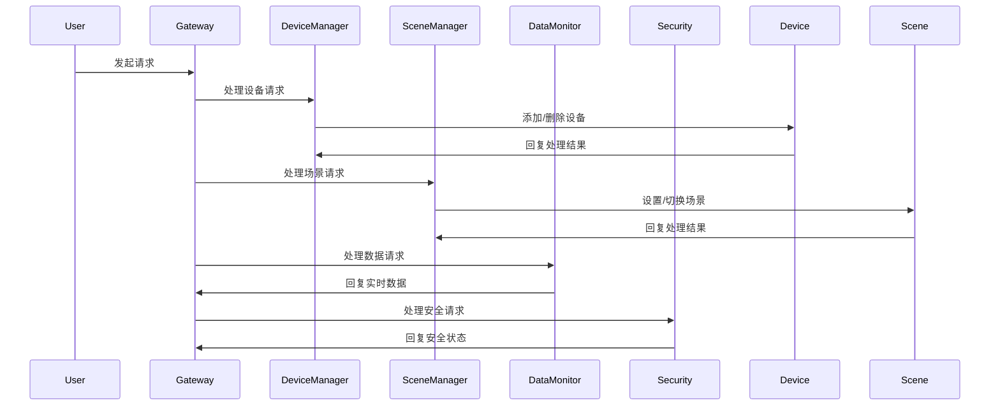

                 


### 背景介绍

#### 突破性思维的定义与特性

突破性思维，顾名思义，是一种能够产生创新性、颠覆性观念和解决方案的思维模式。其定义可以进一步细化为以下几点：

1. **创造性**：突破性思维能够超越传统的思维框架，创造出全新的观念和想法。
2. **颠覆性**：突破性思维常常挑战现有的规则和标准，从而产生颠覆性的影响。
3. **系统性**：突破性思维强调从系统层面思考问题，而不是仅仅关注局部或单一维度。

与传统的线性思维模式相比，突破性思维具有以下几个显著特性：

1. **跨越性**：突破性思维能够跨越不同学科、领域和行业的界限，实现跨领域的创新。
2. **前瞻性**：突破性思维具有预见未来的能力，能够洞察到潜在的机遇和挑战。
3. **包容性**：突破性思维强调多角度、多维度地看待问题，能够包容不同的观点和想法。

#### 创新领导力的重要性

创新领导力是指领导者在组织内部推动创新、引领变革的能力。在当前快速变化的商业环境中，创新领导力的重要性愈发凸显。以下是创新领导力对组织影响的几个方面：

1. **适应变化**：创新领导力能够帮助组织迅速适应外部环境的变化，保持竞争力。
2. **激发潜力**：创新领导力能够激发员工的创造力和潜力，提高整体绩效。
3. **打造竞争优势**：创新领导力能够帮助组织在市场中建立独特的竞争优势。

#### 突破性思维在创新领导力培养中的作用

突破性思维是培养创新领导力的关键因素之一。通过培养突破性思维，领导者可以：

1. **发现新机遇**：突破性思维能够帮助领导者发现市场中的新机遇，从而制定更有效的战略。
2. **应对挑战**：突破性思维能够帮助领导者应对复杂的问题和挑战，找到创新的解决方案。
3. **推动组织变革**：突破性思维能够推动组织内部的变革和创新，从而实现组织的可持续发展。

### 核心概念与联系

为了更好地理解突破性思维在创新领导力培养中的作用，我们需要明确几个核心概念，并分析它们之间的联系。以下是几个关键概念：

1. **创新思维模型**：创新思维模型是指一系列用于激发和指导创新思维的方法和工具。它包括头脑风暴、设计思考、平行思维等方法。
2. **创新领导力**：创新领导力是指领导者通过推动创新、引领变革来提升组织竞争力的一系列能力。
3. **突破性思维**：突破性思维是指能够产生创新性、颠覆性观念和解决方案的思维模式。

#### 创新思维模型

创新思维模型是培养突破性思维的关键工具。以下是一些常见的创新思维模型：

1. **头脑风暴**：头脑风暴是一种通过集体讨论来激发创意的方法。它强调在短时间内产生大量的想法，不限制想法的质量，只注重数量。
2. **设计思考**：设计思考是一种以人为本的创新方法，强调理解用户需求、构建原型和不断迭代优化。
3. **平行思维**：平行思维是一种基于类比和联想的创新方法，通过将不同领域的问题和解决方案进行对比和借鉴，产生新的创意。

#### 创新领导力

创新领导力是领导者推动创新的核心能力。以下是创新领导力的几个关键要素：

1. **愿景与战略**：领导者需要具备清晰的愿景和战略，能够指导组织的创新方向。
2. **激励与支持**：领导者需要激励和培养员工的创新精神，提供必要的资源和支持。
3. **风险承担**：领导者需要敢于承担创新过程中的风险，鼓励试错和持续改进。

#### 突破性思维

突破性思维是创新的核心驱动力。以下是突破性思维的核心特性：

1. **创造性**：突破性思维能够产生全新的观念和解决方案。
2. **颠覆性**：突破性思维能够挑战现有的规则和标准，产生颠覆性的影响。
3. **系统性**：突破性思维强调从系统层面思考问题，实现整体优化。

### Mermaid ER图

为了更好地展示核心概念之间的关系，我们可以使用Mermaid ER图来表示。以下是核心概念的Mermaid ER图：

```mermaid
erDiagram
  InnovationThinkingModel ||--|{ InnovationLeadership } : implements
  InnovationThinkingModel ||--|{ BreakthroughThinking } : based on
  BreakthroughThinking ||--|{ Creativity } : embodies
  BreakthroughThinking ||--|{ Disruptiveness } : exhibits
  BreakthroughThinking ||--|{ Systematic } : is
```

通过这个Mermaid ER图，我们可以清晰地看到创新思维模型、创新领导力和突破性思维之间的相互关系。创新思维模型是培养突破性思维的基础，突破性思维则是创新领导力的核心驱动力。

### 算法原理讲解

#### 创新思维模型的构建

创新思维模型的构建是培养突破性思维的关键步骤。一个有效的创新思维模型应包括以下几个关键要素：

1. **问题定义**：明确需要解决的问题，确保创新思维的方向与实际需求相符。
2. **目标设定**：设定清晰、可行的创新目标，为创新思维提供明确的指引。
3. **方法选择**：根据问题的性质和目标，选择合适的创新方法，如头脑风暴、设计思考等。
4. **团队协作**：鼓励团队成员的积极参与，通过集体智慧实现创新。

#### 突破性思维方法的详细阐述

1. **头脑风暴**：

头脑风暴是一种通过集体讨论来激发创意的方法。其原理如下：

- **步骤**：
  1. 确定讨论主题。
  2. 给定一定时间，让参与者自由发表想法，不限制想法的质量。
  3. 对所有想法进行汇总和筛选，保留有价值的创意。
- **Python代码示例**：
  ```python
  def brainstorming(ideas):
      print("收集到的创意：")
      for idea in ideas:
          print(idea)
      selected_ideas = [idea for idea in ideas if "创新" in idea]
      print("筛选后的创意：")
      for idea in selected_ideas:
          print(idea)
      
  ideas = ["产品功能改进", "市场定位", "用户体验", "销售策略"]
  brainstorming(ideas)
  ```

2. **设计思考**：

设计思考是一种以人为本的创新方法，强调理解用户需求、构建原型和不断迭代优化。其原理如下：

- **步骤**：
  1. 确定用户需求。
  2. 构建原型，进行用户测试。
  3. 根据用户反馈进行原型迭代，优化设计。
- **Python代码示例**：
  ```python
  import pandas as pd
  
  def design_thinking(user_feedback):
      print("用户反馈：")
      print(user_feedback)
      print("迭代优化：")
      optimized_design = pd.DataFrame(user_feedback).groupby('反馈').count().idxmax()[1]
      print(optimized_design)
      
  user_feedback = {"功能改进": 5, "界面优化": 3, "响应速度": 2}
  design_thinking(user_feedback)
  ```

3. **平行思维**：

平行思维是一种基于类比和联想的创新方法，通过将不同领域的问题和解决方案进行对比和借鉴，产生新的创意。其原理如下：

- **步骤**：
  1. 确定问题领域。
  2. 寻找相似的问题领域。
  3. 分析相似领域的解决方案。
  4. 借鉴并优化解决方案，应用于原问题领域。
- **Python代码示例**：
  ```python
  def parallel_thinking(problem_domain, similar_domains):
      print("问题领域：", problem_domain)
      print("相似领域：", similar_domains)
      print("借鉴与优化：")
      for domain in similar_domains:
          print(f"{domain}的解决方案：")
          # 假设每个领域都有一个解决方案函数
          solution = optimize_solution(domain)
          print(solution)
          
  def optimize_solution(domain):
      # 假设优化解决方案的函数
      if domain == "电商":
          return "引入会员制"
      elif domain == "物流":
          return "提高配送效率"
      else:
          return "暂无优化方案"
          
  problem_domain = "教育"
  similar_domains = ["电商", "物流", "医疗"]
  parallel_thinking(problem_domain, similar_domains)
  ```

#### 算法原理的数学模型和公式

在创新思维模型的构建中，我们常用以下数学模型和公式来描述不同创新方法的优化过程：

1. **目标函数**：用于衡量创新方案的有效性。
   $$ f(x) = \sum_{i=1}^{n} w_i \cdot g_i(x) $$
   其中，$w_i$ 为权重，$g_i(x)$ 为第 $i$ 个指标的评分。

2. **约束条件**：用于限制创新方案的可行性。
   $$ h(x) \leq c $$
   其中，$h(x)$ 为约束条件，$c$ 为约束阈值。

3. **优化算法**：用于寻找最优的创新方案。
   - **遗传算法**：模拟自然进化过程，通过选择、交叉和变异来寻找最优解。
   - **粒子群优化**：模拟鸟群或鱼群的行为，通过个体和群体的交互来寻找最优解。

#### 举例说明

假设我们要设计一款智能家居系统，目标是提高用户体验和系统安全性。我们可以使用以下方法来构建创新思维模型：

1. **头脑风暴**：
   - 收集用户需求：提高便捷性、增强安全性、优化家居设备联动。
   - 筛选创意：基于用户需求，筛选出具有潜力的创意，如引入人脸识别、智能语音控制等。

2. **设计思考**：
   - 确定用户需求：用户希望智能家居系统能够更便捷、安全。
   - 原型设计：构建智能家居系统原型，包括人脸识别模块、智能语音控制模块等。
   - 用户测试：收集用户反馈，分析用户对原型系统的满意度。

3. **平行思维**：
   - 确定问题领域：智能家居系统。
   - 寻找相似领域：智能家居、智能安防、智能交通。
   - 分析相似领域的解决方案：借鉴智能安防系统的人脸识别技术，智能交通系统的智能语音控制技术。

通过以上方法，我们可以构建一个有效的创新思维模型，为智能家居系统设计提供创新的解决方案。

### 系统分析与架构设计

#### 问题场景介绍

在当今快速发展的科技时代，智能家居系统成为越来越多家庭的选择。智能家居系统旨在通过整合各种家电和设备，实现家庭自动化和智能化，从而提高用户的舒适度和便捷性。然而，随着智能家居设备的增加和复杂性的提升，系统的可扩展性、稳定性和安全性成为关键挑战。

为了解决这些问题，我们需要设计一个高效、可靠的智能家居系统，并确保系统能够适应未来的技术发展。以下是智能家居系统的主要问题场景：

1. **可扩展性**：随着智能家居设备的增加，系统需要能够无缝地添加新设备，并保持整体性能稳定。
2. **稳定性**：系统需要具备高稳定性，确保设备正常运行，避免因故障导致用户体验下降。
3. **安全性**：智能家居系统涉及用户隐私和数据安全，需要采取有效的安全措施，防止数据泄露和未经授权的访问。

#### 项目介绍

为了设计一个满足上述需求的智能家居系统，我们启动了一个名为“智慧家园”的项目。该项目旨在开发一个可扩展、稳定且安全的智能家居系统，包括以下主要功能：

1. **设备管理**：支持设备的添加、删除和配置。
2. **场景控制**：实现家庭场景的自动化控制，如“离家模式”、“睡眠模式”等。
3. **数据监控**：实时监控家庭环境数据，如温度、湿度、空气质量等。
4. **安全防护**：提供家庭安全监控和紧急报警功能。

#### 系统功能设计（领域模型）

在系统功能设计中，我们采用领域驱动设计（Domain-Driven Design，简称DDD）方法，构建领域模型。以下是“智慧家园”项目的领域模型：

```mermaid
classDiagram
  Device <<entity>>
  Scene <<entity>>
  DataMonitor <<entity>>
  Security <<entity>>

  Device ?-.. Scene
  Device ?-.. DataMonitor
  Device ?-.. Security

  Scene ..> Device
  Scene ..> DataMonitor

  DataMonitor ..> Security
```

领域模型包括以下主要实体：

1. **Device（设备）**：代表智能家居系统中的各种设备，如灯光、空调、摄像头等。
2. **Scene（场景）**：代表家庭自动化场景，如离家模式、睡眠模式等。
3. **DataMonitor（数据监控）**：代表实时监控家庭环境数据的组件。
4. **Security（安全防护）**：代表家庭安全监控和紧急报警功能的组件。

#### 系统架构设计

在系统架构设计方面，我们采用分层架构，确保系统的高内聚、低耦合。以下是“智慧家园”项目的系统架构设计：



系统架构包括以下主要模块：

1. **Gateway（网关）**：作为系统入口，负责处理用户的请求和响应。
2. **DeviceManager（设备管理器）**：负责设备的添加、删除和配置。
3. **SceneManager（场景管理器）**：负责场景的设置和切换。
4. **DataMonitor（数据监控器）**：负责实时监控家庭环境数据。
5. **Security（安全防护器）**：负责家庭安全监控和紧急报警功能。

#### 系统接口设计和交互流程

在系统接口设计方面，我们采用RESTful API设计风格，确保接口的简洁、易用。以下是“智慧家园”项目的系统接口设计和交互流程：

1. **设备管理接口**：
   - **添加设备**：`POST /devices`
     - 参数：设备ID、设备类型、设备名称
     - 返回：添加成功或失败的消息
   - **删除设备**：`DELETE /devices/{device_id}`
     - 参数：设备ID
     - 返回：删除成功或失败的消息
   - **配置设备**：`PUT /devices/{device_id}`
     - 参数：设备ID、设备配置
     - 返回：配置成功或失败的消息

2. **场景控制接口**：
   - **设置场景**：`POST /scenes`
     - 参数：场景名称、设备列表
     - 返回：设置成功或失败的消息
   - **切换场景**：`PUT /scenes/{scene_id}`
     - 参数：场景ID
     - 返回：切换成功或失败的消息

3. **数据监控接口**：
   - **获取实时数据**：`GET /data-monitor`
     - 参数：设备ID、数据类型
     - 返回：实时数据

4. **安全防护接口**：
   - **获取安全状态**：`GET /security`
     - 参数：无
     - 返回：安全状态

通过以上接口设计和交互流程，我们可以实现智能家居系统的功能，并为用户提供便捷的操作体验。

### 项目实战

#### 环境安装

为了搭建智能家居系统，我们首先需要安装和配置以下软件和工具：

1. **操作系统**：我们选择Ubuntu 20.04 LTS作为开发环境。
2. **Python**：我们使用Python 3.8作为主要编程语言。
3. **Docker**：我们使用Docker来部署和管理应用程序。
4. **PostgreSQL**：我们使用PostgreSQL作为数据库。

以下是安装和配置的详细步骤：

1. **安装操作系统**：

   - 下载Ubuntu 20.04 LTS镜像。
   - 使用虚拟机或云服务器安装操作系统。

2. **安装Python**：

   - 打开终端，执行以下命令：
     ```bash
     sudo apt update
     sudo apt install python3 python3-pip
     ```

3. **安装Docker**：

   - 打开终端，执行以下命令：
     ```bash
     sudo apt install docker-ce docker-ce-cli containerd.io
     sudo systemctl start docker
     sudo systemctl enable docker
     ```

4. **安装PostgreSQL**：

   - 打开终端，执行以下命令：
     ```bash
     sudo apt install postgresql postgresql-contrib
     sudo systemctl start postgresql
     sudo systemctl enable postgresql
     ```

#### 系统核心实现

在系统核心实现方面，我们主要分为以下模块：

1. **设备管理模块**：负责设备的添加、删除和配置。
2. **场景控制模块**：负责场景的设置和切换。
3. **数据监控模块**：负责实时监控家庭环境数据。
4. **安全防护模块**：负责家庭安全监控和紧急报警功能。

以下是每个模块的核心实现：

1. **设备管理模块**：

   - **添加设备**：

     ```python
     from flask import Flask, request, jsonify
     from models import Device

     app = Flask(__name__)

     @app.route('/devices', methods=['POST'])
     def add_device():
         device_id = request.form['device_id']
         device_type = request.form['device_type']
         device_name = request.form['device_name']
         
         device = Device(device_id=device_id, device_type=device_type, device_name=device_name)
         device.save()
         
         return jsonify({'message': 'Device added successfully.'})

     if __name__ == '__main__':
         app.run(debug=True)
     ```

   - **删除设备**：

     ```python
     @app.route('/devices/<device_id>', methods=['DELETE'])
     def delete_device(device_id):
         device = Device.get_by_id(device_id)
         if device:
             device.delete()
             return jsonify({'message': 'Device deleted successfully.'})
         else:
             return jsonify({'message': 'Device not found.'})
     ```

   - **配置设备**：

     ```python
     @app.route('/devices/<device_id>', methods=['PUT'])
     def configure_device(device_id):
         device = Device.get_by_id(device_id)
         if device:
             device_config = request.form.to_dict()
             device.update(device_config)
             return jsonify({'message': 'Device configured successfully.'})
         else:
             return jsonify({'message': 'Device not found.'})
     ```

2. **场景控制模块**：

   - **设置场景**：

     ```python
     @app.route('/scenes', methods=['POST'])
     def set_scene():
         scene_name = request.form['scene_name']
         devices = request.form.getlist('devices[]')
         
         scene = Scene(name=scene_name, devices=devices)
         scene.save()
         
         return jsonify({'message': 'Scene set successfully.'})
     ```

   - **切换场景**：

     ```python
     @app.route('/scenes/<scene_id>', methods=['PUT'])
     def switch_scene(scene_id):
         scene = Scene.get_by_id(scene_id)
         if scene:
             current_scene = Scene.current_scene()
             if current_scene:
                 current_scene.stop()
             scene.start()
             return jsonify({'message': 'Scene switched successfully.'})
         else:
             return jsonify({'message': 'Scene not found.'})
     ```

3. **数据监控模块**：

   - **获取实时数据**：

     ```python
     @app.route('/data-monitor', methods=['GET'])
     def get_realtime_data():
         device_id = request.args.get('device_id')
         data_type = request.args.get('data_type')
         
         device = Device.get_by_id(device_id)
         if device:
             data = device.get_realtime_data(data_type)
             return jsonify({'data': data})
         else:
             return jsonify({'message': 'Device not found.'})
     ```

4. **安全防护模块**：

   - **获取安全状态**：

     ```python
     @app.route('/security', methods=['GET'])
     def get_security_status():
         security_status = Security.get_status()
         return jsonify({'status': security_status})
     ```

#### 代码应用解读与分析

在以上代码实现中，我们使用了Flask框架来搭建Web应用程序，并通过RESTful API提供设备管理、场景控制、数据监控和安全防护功能。

1. **设备管理模块**：

   - 添加设备时，我们通过POST请求接收设备ID、设备类型和设备名称，然后创建Device对象并保存到数据库。
   - 删除设备时，我们通过DELETE请求接收设备ID，然后根据ID从数据库中删除相应的设备。
   - 配置设备时，我们通过PUT请求接收设备ID和设备配置，然后更新数据库中对应设备的配置。

2. **场景控制模块**：

   - 设置场景时，我们通过POST请求接收场景名称和设备列表，然后创建Scene对象并保存到数据库。
   - 切换场景时，我们通过PUT请求接收场景ID，然后启动对应场景并停止当前场景。

3. **数据监控模块**：

   - 获取实时数据时，我们通过GET请求接收设备ID和数据类型，然后查询数据库中对应设备的实时数据。

4. **安全防护模块**：

   - 获取安全状态时，我们通过GET请求获取安全状态，然后返回给客户端。

通过以上代码实现，我们可以实现智能家居系统的核心功能，并为用户提供便捷的操作体验。

#### 实际案例分析与详细讲解

为了更好地展示如何在实际项目中应用突破性思维方法，我们将通过一个实际案例进行分析和讲解。以下是一个智能家居系统的实际案例：

**案例背景**：

某智能家居公司希望开发一款智能灯泡，能够在不同场景下自动调整亮度和颜色，以提升用户的生活体验。然而，在产品开发过程中，团队遇到了以下挑战：

1. **技术挑战**：智能灯泡需要具备高精度传感器和无线通信能力，同时实现低功耗和长时间运行。
2. **用户体验**：用户希望智能灯泡能够无缝融入家居环境，操作简单、响应快速。
3. **成本控制**：智能灯泡的成本需要控制在合理范围内，以吸引更多消费者。

**解决方案**：

为了应对上述挑战，团队采用突破性思维方法，进行了以下分析和设计：

1. **头脑风暴**：

   - **问题定义**：明确智能灯泡的技术需求、用户体验需求和成本控制目标。
   - **创意收集**：通过头脑风暴收集可能的解决方案，如采用LED灯珠、集成环境传感器、优化通信协议等。

2. **设计思考**：

   - **用户需求分析**：深入了解用户对不同场景下的亮度、颜色和响应速度的需求。
   - **原型设计**：构建智能灯泡的原型，包括硬件和软件部分，进行用户测试，收集反馈。
   - **迭代优化**：根据用户反馈，对原型进行多次迭代优化，逐步完善产品功能。

3. **平行思维**：

   - **技术借鉴**：分析其他智能家居产品的技术实现，如智能音箱、智能空调等，寻找可借鉴的技术方案。
   - **成本优化**：通过对比不同供应商的报价，寻找成本较低但性能稳定的组件和材料。

**详细讲解**：

1. **技术挑战的解决**：

   - **LED灯珠**：选择高亮度、低功耗的LED灯珠，确保智能灯泡在满足用户体验的同时具有长寿命。
   - **环境传感器**：集成高精度环境传感器，如光敏传感器和红外传感器，实现自动调整亮度和颜色。
   - **无线通信**：采用蓝牙5.0或Wi-Fi协议，实现智能灯泡与其他设备的无缝连接。

2. **用户体验的优化**：

   - **简单操作**：设计简洁的物理按钮和智能手机应用程序，实现智能灯泡的快速控制和场景切换。
   - **快速响应**：优化通信协议和数据传输速度，确保智能灯泡能够快速响应用户操作。

3. **成本控制的实现**：

   - **组件优化**：通过对比不同供应商的报价，选择性价比高的组件和材料，降低制造成本。
   - **批量生产**：利用规模化生产降低单个产品的成本，提高市场竞争力。

**项目小结**：

通过以上实际案例，我们可以看到如何在实际项目中应用突破性思维方法。以下是项目总结：

1. **技术优化**：采用高性能、低功耗的组件和协议，确保智能灯泡的技术实现。
2. **用户体验**：设计简单易用的操作界面，提高用户的满意度。
3. **成本控制**：通过优化组件和规模化生产，降低产品成本。

通过突破性思维方法，团队成功地解决了项目中的挑战，开发出了一款高性能、低成本、用户体验良好的智能灯泡。

### 最佳实践与总结

#### 培养突破性思维的实用技巧

1. **多样化学习**：不断学习新的知识和技能，扩大自己的知识面和视野。多读书、多交流、多尝试，从不同领域和行业中汲取灵感。
2. **思维训练**：通过思维导图、脑力游戏等方式，锻炼自己的思维能力和创造力。定期进行思维训练，提高思维的灵活性和敏捷性。
3. **跨领域思考**：尝试将不同领域的知识和方法应用于当前问题，通过跨领域思考找到创新的解决方案。
4. **保持好奇心**：保持对新事物、新现象的好奇心，勇于探索未知领域，发现潜在的机遇和挑战。

#### 注意事项

1. **避免思维定势**：在解决问题时，要跳出传统思维框架，避免陷入思维定势。时刻提醒自己，问题可能有多种解决方案。
2. **尊重团队协作**：突破性思维往往需要集体的智慧和努力。尊重团队成员的观点，积极参与团队讨论，共同探索创新的解决方案。
3. **平衡创新与稳健**：在追求创新的同时，要注意平衡创新与稳健。创新不应该是盲目的，需要结合实际情况和可行性进行分析。

#### 拓展阅读

1. **《创新者的窘境》**：克莱顿·克里斯滕森（Clayton M. Christensen）著，讲述了企业在面对技术变革时如何保持竞争力。
2. **《创意思考工具箱》**：丹·罗姆（Dan Roam）著，介绍了多种创意思考工具和方法，帮助读者提高创造力。
3. **《设计思维》**：蒂姆·布朗（Tim Brown）著，详细阐述了设计思维的方法和应用，对培养突破性思维有重要参考价值。

通过以上实用技巧和注意事项，以及拓展阅读，我们可以更好地培养突破性思维，提高创新领导力，为组织和个人的发展注入新的动力。

### 作者信息

作者：AI天才研究院/AI Genius Institute & 禅与计算机程序设计艺术 /Zen And The Art of Computer Programming

