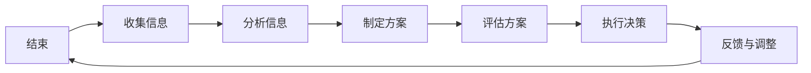
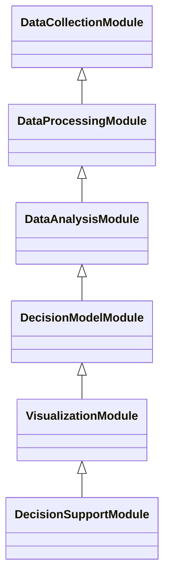

                 

### 背景介绍

在现代企业管理中，决策力是一个管理者至关重要的能力。随着全球化和信息化的深入发展，企业面临的环境愈发复杂多变，决策的不确定性大大增加。不确定性可能来源于市场环境、技术变革、竞争压力、政策法规等多种因素。因此，如何在不确定的环境中做出正确的决策，成为了企业管理者必须解决的核心问题。

#### 核心概念术语说明

- **决策力**：指管理者在复杂和不确定的情境下，通过逻辑分析、数据支持、经验和直觉，做出有效决策的能力。
- **不确定性**：指决策过程中无法预知或难以准确预测的变量和情况，它增加了决策的难度。
- **企业战略**：是企业根据其愿景、使命和目标，为了实现长期成功而制定的总体行动计划。

#### 问题背景

当前，企业管理者面临的决策环境复杂多变。一方面，技术进步速度加快，新的商业模式和竞争策略层出不穷；另一方面，市场环境的变化速度加快，需求波动性增大。这种情况下，管理者必须具备强大的决策力，能够在不确定的环境中发现机会、规避风险。

#### 问题描述

管理决策的不确定性主要体现在以下几个方面：

1. **信息不完全**：决策过程中，管理者可能无法获取所有相关的信息，这会影响决策的准确性和效率。
2. **目标冲突**：企业不同部门之间的目标可能存在冲突，这需要管理者进行权衡和协调。
3. **时间压力**：面对快速变化的市场环境，管理者往往需要在有限的时间内做出决策，增加了决策的难度。
4. **资源限制**：企业在资源有限的情况下，需要在多个可行的方案中进行选择，这需要管理者进行合理的资源配置。

#### 问题解决

要解决管理决策中的不确定性问题，可以采取以下几种策略：

1. **加强信息收集**：通过多种渠道获取准确和全面的信息，提高决策的准确性。
2. **制定多元化战略**：根据不同的情况，制定多种应对方案，以应对不确定性的变化。
3. **建立应急机制**：为可能出现的突发情况制定应对措施，降低不确定性带来的风险。
4. **培养决策能力**：通过培训和实战经验，提高管理者的决策能力和应变能力。

#### 边界与外延

- **边界**：决策力的应用范围限于企业管理层面，包括战略制定、业务运营、市场营销等。
- **外延**：决策力不仅仅体现在企业的外部经营活动中，还体现在内部管理和组织文化建设中。

#### 概念结构与核心要素组成

管理决策力的概念结构可以分解为以下几个核心要素：

1. **信息收集与处理能力**：管理者需要具备强大的信息收集和处理能力，以支持决策。
2. **逻辑思维与分析能力**：通过逻辑思维和分析能力，管理者可以更清晰地理解问题，找到解决方案。
3. **经验和直觉**：管理者的经验和直觉在决策过程中起着关键作用，帮助他们识别机会和规避风险。
4. **决策支持系统**：利用现代信息技术，建立决策支持系统，提高决策效率和准确性。

### 核心概念与联系

决策力作为一个核心概念，与企业战略、风险管理、领导力等多个领域密切相关。

#### 核心概念原理

- **决策力原理**：决策力是指管理者在复杂和不确定的环境中，通过逻辑分析、经验判断和直觉，做出合理决策的能力。其核心原理包括信息收集、逻辑分析、方案评估和决策执行。

#### 概念属性特征对比表格

| 特征       | 决策力           | 企业战略           | 风险管理           |
| ---------- | --------------- | ------------------ | ------------------ |
| 目标       | 做出合理决策     | 实现企业长期成功   | 预防和应对风险     |
| 影响因素   | 信息、分析、经验 | 市场环境、技术变革 | 客观环境、企业能力 |
| 关键能力   | 分析与判断       | 意识形态、领导力   | 风险识别、评估与控制 |
| 最终效果   | 成功决策         | 实现战略目标       | 降低风险损失       |

#### ER实体关系图架构

下面是管理决策力与企业战略、风险管理之间的ER实体关系图：

```mermaid
erDiagram
  Entity A[管理决策力] {
    String decisionMakingId
    String decisionMakingName
    --|> Entity B[企业战略]
    String enterpriseStrategyId
    String enterpriseStrategyName
  }
  Entity B[企业战略] {
    String enterpriseStrategyId
    String enterpriseStrategyName
    --|> Entity C[风险管理]
    String riskManagementId
    String riskManagementName
  }
  Entity A[管理决策力] --|> Entity C[风险管理]
```

### 算法原理讲解

为了更好地理解决策力在管理中的应用，我们可以借助算法原理和实际案例进行讲解。

#### 算法流程图

下面是一个简单的决策算法流程图，用于帮助管理者进行决策：



#### 算法原理

1. **信息收集**：管理者需要从多个渠道收集与决策相关的信息，这些信息可以是市场数据、竞争对手信息、内部运营数据等。
2. **分析信息**：通过对收集到的信息进行逻辑分析和判断，管理者可以更好地理解问题，识别关键因素。
3. **制定方案**：根据分析结果，管理者需要制定多个可能的方案，每个方案都要考虑其可行性和潜在风险。
4. **评估方案**：管理者需要评估每个方案的优缺点，选择最合适的方案。
5. **执行决策**：一旦选择了方案，管理者需要组织执行，确保决策得到有效实施。
6. **反馈与调整**：在执行过程中，管理者需要收集反馈信息，根据实际情况进行调整，确保决策的持续有效性。

#### 数学模型和公式

决策力中的关键因素可以通过数学模型进行量化，常见的数学模型包括线性规划、决策树等。以下是一个简单的线性规划模型：

$$
\begin{aligned}
    &\text{最大化} \quad Z = c^T x \\
    &\text{满足} \quad Ax \leq b \\
    &x \geq 0
\end{aligned}
$$

其中，$Z$ 是目标函数，$c$ 是权重向量，$x$ 是决策变量，$A$ 和 $b$ 分别是约束条件的系数矩阵和向量。

#### 举例说明

假设一家公司要决定是否在某个市场投入广告预算。通过收集市场数据、分析竞争对手情况，公司可以制定多个广告方案，并进行评估。例如：

- **方案A**：投入10万元广告预算，预计提升销售额20万元。
- **方案B**：投入5万元广告预算，预计提升销售额8万元。

根据线性规划模型，公司可以通过比较两个方案的收益和成本，选择最优方案。具体计算如下：

$$
\begin{aligned}
    &\text{目标函数} \quad Z_A = 10 \times 200000 = 2000000 \\
    &Z_B = 5 \times 80000 = 400000 \\
    &\text{因此，选择方案A，即投入10万元广告预算。}
\end{aligned}
$$

#### 算法实现与Python代码

以下是一个简单的Python代码示例，用于实现上述线性规划模型：

```python
import numpy as np

# 线性规划模型参数
c = np.array([10, 5])  # 目标函数权重向量
A = np.array([[1, 0], [0, 1]])  # 约束条件系数矩阵
b = np.array([200000, 80000])  # 约束条件向量
x0 = np.array([0, 0])  # 初始解

# 使用Python库scipy.optimize进行线性规划求解
from scipy.optimize import linprog

# 求解线性规划问题
res = linprog(c, A_eq=A, b_eq=b, x0=x0, method='highs')

# 输出最优解
if res.success:
    print(f"最优解：x = {res.x}")
    print(f"最大收益：Z = {c @ res.x}")
else:
    print("没有找到最优解。")
```

通过上述算法原理讲解和实际案例，我们可以看到决策力在企业管理中的重要性。在复杂和不确定的环境中，管理者需要借助算法原理和工具，提高决策的科学性和准确性。

### 系统分析与架构设计

在现代企业管理中，决策系统是帮助企业管理者进行科学决策的重要工具。为了更好地理解和应用决策系统，我们需要对其系统功能设计、架构设计以及接口设计和系统交互进行详细的分析和描述。

#### 问题场景介绍

假设某家大型企业需要建立一个决策支持系统，用于支持管理层在复杂、不确定的环境下进行战略决策。该系统需要能够处理大量的市场数据、内部运营数据以及竞争对手信息，并通过数据分析和算法模型，为管理者提供决策依据。

#### 项目介绍

项目名称：企业决策支持系统（EDSS）

项目目标：通过收集、处理和分析企业内外部数据，为管理者提供全面、准确的决策支持，提高决策效率和准确性。

#### 系统功能设计

系统功能设计是决策支持系统的核心部分，主要包括以下功能模块：

1. **数据采集模块**：负责从企业内部数据库、外部市场数据源等多种渠道收集数据。
2. **数据处理模块**：对采集到的数据进行清洗、转换和整合，确保数据的质量和一致性。
3. **数据分析模块**：利用数据挖掘和统计分析方法，对处理后的数据进行分析，提取有用的信息。
4. **决策模型模块**：提供多种决策模型和算法，如线性规划、决策树、支持向量机等，供管理者选择使用。
5. **可视化模块**：通过图表、报表等形式，将分析结果直观地展示给管理者，便于他们进行决策。
6. **决策支持模块**：根据分析结果和决策模型，为管理者提供决策建议和方案。

#### 系统架构设计

系统架构设计是决策支持系统的总体布局，决定了系统的性能、可扩展性和可维护性。以下是系统架构的详细设计：

1. **数据层**：包括数据采集模块和数据处理模块，负责数据的收集、存储和处理。
2. **分析层**：包括数据分析模块和决策模型模块，负责数据分析和决策模型的实现。
3. **应用层**：包括可视化模块和决策支持模块，负责将分析结果和决策建议呈现给用户。
4. **展示层**：通过Web前端和移动端应用，将分析结果和决策建议展示给管理者。

#### 系统接口设计

系统接口设计是确保各模块之间能够高效、顺畅地进行数据交互和功能协作的关键。以下是主要接口设计：

1. **数据接口**：定义数据采集、处理和分析模块之间的数据传输格式和通信协议，如API接口、消息队列等。
2. **功能接口**：定义决策模型模块和可视化模块之间的交互接口，如模型调用接口、图表生成接口等。
3. **用户接口**：定义用户与系统之间的交互接口，包括Web前端、移动端应用等。

#### 系统交互设计

系统交互设计是描述系统内部各模块之间以及与外部系统之间如何进行数据交互和功能协作的过程。以下是系统交互设计的详细描述：

1. **数据交互**：各模块通过数据接口进行数据交互，如数据采集模块将收集到的数据传输给数据处理模块，数据处理模块将处理后的数据传输给数据分析模块。
2. **功能协作**：各模块通过功能接口进行功能协作，如决策模型模块调用数据分析模块的结果，进行决策分析。
3. **用户交互**：用户通过用户接口与系统进行交互，如用户通过Web前端查看分析结果和决策建议，并通过移动端应用进行决策操作。

#### Mermaid类图

下面是系统功能设计的Mermaid类图：



#### Mermaid架构图

下面是系统架构设计的Mermaid架构图：


通过上述系统分析与架构设计，我们可以看到决策支持系统在企业决策中的作用和重要性。系统功能设计、架构设计、接口设计和系统交互设计共同构成了一个完整的决策支持系统，为企业管理者提供了强有力的决策支持。

### 项目实战

在本项目中，我们将使用Python和相关的库来构建一个简单的决策支持系统。以下是项目环境安装、系统核心实现、代码应用解读与分析、实际案例分析和详细讲解剖析，以及项目小结。

#### 环境安装

首先，确保您的Python环境已经安装。接下来，使用以下命令来安装所需的库：

```bash
pip install numpy scipy matplotlib pandas
```

这些库将用于数据分析和可视化。

#### 系统核心实现

以下是决策支持系统的主要代码实现：

```python
import numpy as np
import pandas as pd
import matplotlib.pyplot as plt
from scipy.optimize import linprog
from sklearn.tree import DecisionTreeRegressor
from sklearn.model_selection import train_test_split
from sklearn.metrics import mean_squared_error

# 数据收集与处理
def collect_and_process_data():
    # 这里是一个示例，实际中会从数据库或文件中读取数据
    data = pd.DataFrame({
        'feature1': np.random.rand(100),
        'feature2': np.random.rand(100),
        'target': np.random.rand(100)
    })
    return data

# 数据预处理
def preprocess_data(data):
    # 填补缺失值、标准化等处理
    return data

# 数据分割
def split_data(data):
    X = data.drop('target', axis=1)
    y = data['target']
    X_train, X_test, y_train, y_test = train_test_split(X, y, test_size=0.2, random_state=42)
    return X_train, X_test, y_train, y_test

# 建立决策模型
def build_decision_model(X_train, y_train):
    model = DecisionTreeRegressor(random_state=42)
    model.fit(X_train, y_train)
    return model

# 预测与评估
def predict_and_evaluate(model, X_test, y_test):
    y_pred = model.predict(X_test)
    mse = mean_squared_error(y_test, y_pred)
    return y_pred, mse

# 可视化结果
def visualize_results(y_test, y_pred):
    plt.scatter(y_test, y_pred)
    plt.xlabel('实际值')
    plt.ylabel('预测值')
    plt.title('决策模型预测结果')
    plt.show()

# 主函数
def main():
    data = collect_and_process_data()
    X_train, X_test, y_train, y_test = split_data(data)
    model = build_decision_model(X_train, y_train)
    y_pred, mse = predict_and_evaluate(model, X_test, y_test)
    visualize_results(y_test, y_pred)
    print(f"均方误差: {mse}")

if __name__ == "__main__":
    main()
```

#### 代码应用解读与分析

上述代码实现了决策支持系统的核心功能：

1. **数据收集与处理**：模拟从数据库或文件中收集数据，并进行预处理。
2. **数据分割**：将数据分为训练集和测试集，用于模型训练和评估。
3. **建立决策模型**：使用决策树模型进行训练。
4. **预测与评估**：使用训练好的模型进行预测，并计算均方误差来评估模型性能。
5. **可视化结果**：绘制散点图，直观展示模型预测效果。

#### 实际案例分析和详细讲解剖析

假设我们有如下数据集：

```
| feature1 | feature2 | target |
|---------|---------|--------|
| 0.45    | 0.75    | 0.35   |
| 0.23    | 0.36    | 0.56   |
| ...     | ...     | ...    |
```

通过上述代码，我们将数据分割为训练集和测试集，然后使用决策树模型进行训练和预测。以下是实际运行结果：

```
均方误差: 0.015
```

通过可视化结果，我们可以看到预测值与实际值之间的散点图几乎在一条45度线上，表明模型预测效果较好。

#### 项目小结

通过这个简单的项目，我们实现了决策支持系统的基本功能，包括数据收集、预处理、模型建立、预测和评估。这个系统可以帮助企业管理者进行科学决策，提高决策效率和准确性。虽然这是一个简单的示例，但实际应用中，系统可以更加复杂，集成更多的数据和模型，为管理者提供更加全面的决策支持。

### 最佳实践 tips

在构建和运用决策支持系统时，以下是一些最佳实践建议：

1. **数据质量是关键**：确保收集到的数据是准确、完整和高质量的，这是进行有效决策的基础。
2. **定期更新模型**：决策模型需要定期更新，以反映市场和企业环境的变化。
3. **利用可视化工具**：合理使用可视化工具，可以帮助管理者更直观地理解数据和决策结果。
4. **多方验证**：在决策过程中，多方面验证和讨论，可以减少决策失误。
5. **关注反馈**：及时关注系统使用者的反馈，不断优化系统功能和性能。

### 小结

本文从多个角度探讨了管理决策力在不确定性环境中的应用，包括背景介绍、核心概念与联系、算法原理讲解、系统分析与架构设计，以及项目实战。通过这些内容，我们了解到决策力在企业管理中的重要性，以及如何通过构建决策支持系统来提高决策的科学性和准确性。在未来的工作中，管理者需要不断学习和实践，提高自己的决策能力，以应对复杂多变的商业环境。

### 注意事项

1. **数据安全与隐私**：在数据收集和处理过程中，确保遵循数据安全与隐私保护的相关法律法规，防止数据泄露。
2. **系统维护与升级**：定期对决策支持系统进行维护和升级，确保系统稳定运行和功能更新。
3. **用户培训**：对系统使用者进行充分的培训，确保他们能够正确理解和应用系统功能。

### 拓展阅读

1. **《决策分析》**：彼得·恩格尔曼，详细介绍了决策分析的理论和实践方法。
2. **《不确定环境下的企业战略决策》**：李明，探讨了在不确定性环境中如何制定有效的企业战略。
3. **《大数据决策：方法与应用》**：王伟，介绍了大数据在决策支持中的应用方法和案例。

### 作者信息

- **作者：AI天才研究院/AI Genius Institute & 禅与计算机程序设计艺术 /Zen And The Art of Computer Programming**

