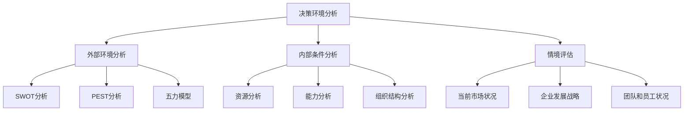

                 

## 管理者决策框架：科学决策的方法论

### 关键词：决策框架、科学决策、方法论、企业管理、管理实践

> **摘要**：本文将深入探讨管理者在复杂商业环境中如何构建和运用科学的决策框架。通过解析决策的核心概念、介绍决策方法论的基础和实际应用，以及展望决策方法论的未来发展趋势，本文旨在为管理者提供一套全面而实用的决策指南，帮助他们在面临各种挑战时做出更加明智和有效的决策。

### 目录

1. **引言**  
   1.1 背景介绍  
   1.2 核心概念与联系  
   1.3 本书结构

2. **决策方法论基础**  
   2.1 决策思维模式  
   2.2 决策环境分析  
   2.3 决策过程管理

3. **决策方法论应用**  
   3.1 定量决策方法  
   3.2 定性决策方法  
   3.3 混合决策方法

4. **决策方法论实践**  
   4.1 决策方法论实施  
   4.2 决策案例分析  
   4.3 决策方法论优化

5. **决策方法论前瞻**  
   5.1 决策方法论发展趋势  
   5.2 创新与应用

6. **附录**  
   6.1 常用工具与资源  
   6.2 小结与拓展阅读

---

### 第一部分：引言

#### 1.1 背景介绍

在当今快速变化的商业环境中，管理者面临着越来越多的复杂决策问题。这些决策不仅关系到企业的短期利益，更影响到企业的长期发展和竞争力。科学决策的重要性因此日益凸显。传统的经验决策方式已经难以适应复杂多变的市场环境，管理者需要一套科学的决策框架来帮助他们更加高效、准确地做出决策。

#### 1.2 核心概念与联系

决策（Decision Making）：决策是指从多个可选方案中选择最佳方案的过程。决策过程包括信息收集、方案评估和选择实施。

方法论（Methodology）：方法论是指解决某一问题的系统方法和步骤。在决策过程中，方法论提供了科学、规范的决策流程和工具，帮助管理者提高决策质量和效率。

#### 1.3 本书结构

本书旨在为管理者提供一套科学的决策方法论，包括基础理论、应用实践和未来展望。具体结构如下：

- **第一部分：引言**：介绍决策框架的背景和核心概念。
- **第二部分：决策方法论基础**：解析决策思维模式、决策环境分析和决策过程管理。
- **第三部分：决策方法论应用**：介绍定量决策方法、定性决策方法和混合决策方法。
- **第四部分：决策方法论实践**：详细描述决策方法论的实践步骤和案例分析。
- **第五部分：决策方法论前瞻**：探讨决策方法论的未来发展趋势和创新应用。
- **第六部分：附录**：提供决策方法论的常用工具和资源，以及拓展阅读建议。

通过本书的系统学习和实践，读者将能够掌握科学决策的方法论，提高决策能力，为企业的发展提供强有力的支持。

---

### 第二部分：决策方法论基础

#### 2.1 决策思维模式

决策思维模式是指管理者在决策过程中所采用的思维方式。不同的思维模式适用于不同的决策情景，能够帮助管理者更全面、准确地分析和解决问题。

**1. 分析性思维模式**：这种思维模式强调逻辑推理和分析，通过对问题的全面分析和数据驱动的方法来做出决策。它适用于结构化、信息充分的情况。

**2. 创造性思维模式**：这种思维模式注重创新和想象力，通过新颖的想法和解决方案来应对复杂和不确定的问题。它适用于需要创新和突破的情况。

**3. 系统性思维模式**：这种思维模式强调从整体的角度来看待问题，考虑各个部分之间的相互关系和影响。它适用于需要全局规划和协调的情况。

**4. 情境性思维模式**：这种思维模式根据具体的情境和背景来做出决策，强调灵活性和适应性。它适用于情境多变和不确定的情况。

#### 2.2 决策环境分析

决策环境分析是指对决策所处的外部环境和内部条件进行系统性评估和分析，以确定决策的可行性和影响。

**1. 外部环境分析**：包括市场环境、竞争态势、政策法规等外部因素。通过SWOT分析（优势、劣势、机会、威胁）等方法，评估外部环境对决策的影响。

**2. 内部条件分析**：包括企业的资源、能力、组织结构等内部因素。通过内部资源评估和优势识别，确定企业内部支持决策的条件。

**3. 情境评估**：结合外部环境和内部条件，评估决策的具体情境，确定决策的优先级和可行性。

#### 2.3 决策过程管理

决策过程管理是指对决策全过程进行系统管理和控制，确保决策的科学性和有效性。

**1. 信息收集**：通过调研、数据分析等方法，收集与决策相关的各种信息，确保信息的准确性和完整性。

**2. 方案评估**：对不同的决策方案进行评估和比较，使用决策分析工具和方法，如成本效益分析、风险评估等，确定最佳方案。

**3. 决策选择**：根据评估结果，选择最佳决策方案，并制定详细的实施方案。

**4. 实施监控**：在决策实施过程中，监控决策效果，及时调整和优化决策方案，确保决策目标的实现。

**5. 反馈与改进**：对决策结果进行评估和反馈，总结经验教训，为未来的决策提供参考和改进。

### 2.2.1 决策思维模式：定义与特点

决策思维模式是指管理者在决策过程中所采用的思维方式，这些思维方式有助于管理者更全面、准确地分析和解决问题。以下是几种常见的决策思维模式及其特点：

1. **分析性思维模式**：这种思维模式强调逻辑推理和分析，通过对问题的全面分析和数据驱动的方法来做出决策。它适用于结构化、信息充分的情况。分析性思维模式的特点包括：
   - **逻辑性**：注重逻辑推理和因果关系，确保决策基于可靠的数据和事实。
   - **系统性**：考虑问题的各个方面和潜在影响，避免片面和短视的决策。
   - **可验证性**：通过数据验证和分析结果，提高决策的准确性和可靠性。

2. **创造性思维模式**：这种思维模式注重创新和想象力，通过新颖的想法和解决方案来应对复杂和不确定的问题。它适用于需要创新和突破的情况。创造性思维模式的特点包括：
   - **开放性**：鼓励多样性和创新思维，不拘泥于传统和常规方法。
   - **灵活性**：适应不同情境和变化，快速提出和探索新的解决方案。
   - **探索性**：通过广泛的思考和尝试，发现潜在的机会和创意。

3. **系统性思维模式**：这种思维模式强调从整体的角度来看待问题，考虑各个部分之间的相互关系和影响。它适用于需要全局规划和协调的情况。系统性思维模式的特点包括：
   - **全局性**：考虑问题的整体和长期影响，确保决策与整体战略一致。
   - **整合性**：协调不同部门、团队和利益相关者的需求和期望，实现资源优化。
   - **预见性**：提前识别潜在问题和风险，制定预防和应对措施。

4. **情境性思维模式**：这种思维模式根据具体的情境和背景来做出决策，强调灵活性和适应性。它适用于情境多变和不确定的情况。情境性思维模式的特点包括：
   - **适应性**：根据不同的情境和变化，调整决策策略和方法。
   - **应变性**：迅速响应突发事件和变化，保持决策的灵活性和敏捷性。
   - **情境感知**：通过感知和分析情境因素，做出更加适合当前情况的决定。

每种决策思维模式都有其独特的优势和应用场景，管理者需要根据具体情况选择合适的思维模式，以提高决策质量和效果。

### 2.2.2 决策环境分析：概念与框架

决策环境分析是指对决策所处的外部环境和内部条件进行系统性评估和分析，以确定决策的可行性和影响。这是决策过程中至关重要的一步，因为只有充分了解和把握决策环境，管理者才能做出更加科学和合理的决策。

#### 概念

1. **外部环境分析**：外部环境分析主要关注决策过程中所面临的市场环境、竞争态势、政策法规等外部因素。这些因素可能直接影响企业的运营和发展，需要管理者进行深入研究和分析。

2. **内部条件分析**：内部条件分析主要关注企业的资源、能力、组织结构等内部因素。这些因素是决策的基础，决定了企业能否顺利执行决策方案。

3. **情境评估**：情境评估是将外部环境和内部条件结合起来，评估决策的具体情境，包括当前的市场状况、企业的发展阶段、团队和员工的状况等。

#### 框架

1. **SWOT分析**：SWOT分析是一种常用的决策环境分析方法，用于评估企业的优势、劣势、机会和威胁。这种方法可以帮助管理者全面了解企业的内外部环境，为决策提供依据。

   - **优势（Strengths）**：企业内部的优势资源、能力和核心竞争力。
   - **劣势（Weaknesses）**：企业内部存在的不足、短板和潜在风险。
   - **机会（Opportunities）**：外部环境中的潜在机会和发展空间。
   - **威胁（Threats）**：外部环境中的潜在风险和挑战。

2. **PEST分析**：PEST分析是另一种常用的外部环境分析方法，用于评估决策过程中的政治（Political）、经济（Economic）、社会（Social）和技术（Technological）因素。这种方法可以帮助管理者了解外部环境的变化趋势和影响。

   - **政治因素**：政策法规、政府支持、政治稳定性等。
   - **经济因素**：经济增长、通货膨胀、货币政策等。
   - **社会因素**：人口结构、消费习惯、文化背景等。
   - **技术因素**：技术发展、技术创新、技术普及等。

3. **五力模型**：五力模型是用于分析市场竞争环境的一种框架，由迈克尔·波特提出。它包括供应商、客户、潜在竞争者、替代品和现有竞争者五个方面。

   - **供应商**：供应商的议价能力、供应稳定性等。
   - **客户**：客户的议价能力、需求变化等。
   - **潜在竞争者**：潜在竞争者的进入威胁和竞争优势。
   - **替代品**：替代品的竞争力和市场渗透率。
   - **现有竞争者**：现有竞争者的市场份额、竞争策略等。

通过这些分析框架和方法，管理者可以全面、系统地了解决策环境，为决策提供科学依据。以下是一个简化的决策环境分析框架的Mermaid流程图：

通过这个框架，管理者可以系统地开展决策环境分析，确保决策的可行性和有效性。

### 2.2.3 决策过程管理：决策流程与风险管理

决策过程管理是确保决策质量和效果的重要环节，它涵盖了从信息收集、方案评估到决策选择和实施的整个决策流程。同时，风险管理也是决策过程管理的重要组成部分，旨在识别、评估和管理决策过程中的潜在风险，以确保决策的稳定性和可靠性。

#### 决策流程

1. **信息收集**：这是决策过程的起点，管理者需要通过各种渠道收集与决策相关的信息，包括市场数据、竞争情报、内部报表等。信息收集的准确性和完整性直接影响决策的质量。

2. **方案评估**：在收集到充分的信息后，管理者需要对不同的决策方案进行评估。评估过程包括对方案的成本、效益、风险等方面进行综合分析，以便选择最佳方案。

3. **决策选择**：在评估的基础上，管理者需要选择一个或多个决策方案，并制定详细的实施方案。决策选择应考虑整体战略目标、资源约束、市场环境等多方面因素。

4. **实施方案**：在决策选择后，管理者需要制定具体的实施计划，明确执行步骤、责任分工、时间表等，确保决策方案能够顺利执行。

5. **监控与调整**：在决策实施过程中，管理者需要持续监控决策的效果，及时发现问题和调整决策方案。这有助于确保决策目标的实现和优化决策效果。

#### 风险管理

1. **风险识别**：在决策过程中，管理者需要识别可能出现的各种风险，包括市场风险、技术风险、财务风险等。风险识别可以通过历史数据、专家判断、情景分析等方法进行。

2. **风险评估**：在识别风险后，管理者需要对风险的性质、可能性和影响进行评估。风险评估可以采用定量分析（如概率和损失估计）和定性分析（如风险矩阵）等方法。

3. **风险应对**：根据风险评估的结果，管理者需要制定相应的风险应对策略。常见的风险应对策略包括风险规避、风险转移、风险缓解等。

4. **风险监控**：在决策实施过程中，管理者需要持续监控风险的变化，及时调整风险应对措施，确保风险在可控范围内。

通过有效的决策过程管理和风险管理，管理者可以确保决策的稳定性和可靠性，提高决策质量和效果。

### 第三部分：决策方法论应用

#### 3.1 定量决策方法

定量决策方法是指通过数学模型和统计分析工具，对决策方案进行定量分析和评估的一种方法。这种方法在处理复杂和大规模问题时具有明显的优势，可以帮助管理者更科学、更准确地做出决策。

**1. 定义与特点**

定量决策方法主要包括以下几种：

- **成本效益分析（Cost-Benefit Analysis）**：通过比较决策方案的成本和收益，评估其经济效益。

- **线性规划（Linear Programming）**：通过线性方程组求解最优解，确定资源的最优分配。

- **决策树（Decision Tree）**：通过树形图展示决策过程和不同决策路径的收益和风险。

- **蒙特卡罗模拟（Monte Carlo Simulation）**：通过随机模拟，评估决策方案的概率分布和预期结果。

定量决策方法的特点包括：

- **客观性**：基于数据和模型，减少主观判断的影响。

- **精确性**：通过数学和统计分析，提供精确的决策依据。

- **适用性**：适用于处理复杂和大规模的决策问题。

**2. 案例分析**

**案例**：某公司面临是否扩大生产线的决策，通过成本效益分析进行评估。

**分析过程**：

- **成本分析**：计算扩大生产线所需的初始投资、运营成本和潜在收益。

- **收益分析**：预测扩大生产线后，销售额的增加和利润的提升。

- **经济效益计算**：计算净现值（NPV）和内部收益率（IRR），评估决策的经济效益。

- **风险分析**：考虑市场波动、技术风险等因素，评估决策的风险水平。

**结论**：通过成本效益分析，公司确定了扩大生产线的可行性，并制定了详细的实施计划。

**3. 应用效果**

定量决策方法的应用可以提高决策的准确性和科学性，减少决策失误的风险，为企业的发展提供有力支持。

#### 3.2 定性决策方法

定性决策方法是指通过主观判断、经验和直觉来做出决策的一种方法。这种方法在处理复杂、不确定和创造性问题时具有独特的优势，可以帮助管理者从不同的角度思考和解决问题。

**1. 定义与特点**

定性决策方法主要包括以下几种：

- **专家咨询（Expert Consultation）**：通过咨询行业专家和经验丰富的团队成员，获取专业意见和建议。

- **头脑风暴（Brainstorming）**：通过集体讨论和创意思维，产生新的想法和解决方案。

- **情景规划（Scenario Planning）**：通过设定不同的情景，预测未来可能的发展趋势和决策影响。

- **利益相关者分析（Stakeholder Analysis）**：识别和分析决策过程中涉及的各种利益相关者，确保决策的全面性和公平性。

定性决策方法的特点包括：

- **灵活性**：适用于处理复杂、不确定和创造性问题。

- **创造性**：通过多种角度和观点，激发创新思维和解决问题的灵感。

- **适应性**：能够快速调整和适应变化的环境和条件。

**2. 案例分析**

**案例**：某公司在制定新产品开发策略时，通过头脑风暴和利益相关者分析进行决策。

**分析过程**：

- **头脑风暴**：组织团队成员和外部专家，开展头脑风暴会议，收集关于新产品开发的各种想法和创意。

- **利益相关者分析**：识别和分析不同利益相关者的需求和期望，确保新产品开发策略的全面性和适应性。

- **情景规划**：设定不同的未来情景，分析不同情景下新产品开发的可行性和潜在收益。

**结论**：通过定性决策方法，公司制定了创新性、适应性强的新产品开发策略，为企业的持续发展奠定了基础。

**3. 应用效果**

定性决策方法的应用可以激发团队创造力，提高决策的灵活性和适应性，促进企业创新和变革。

#### 3.3 混合决策方法

混合决策方法是指将定量决策方法和定性决策方法结合使用，以发挥各自优势，提高决策质量和效果的一种方法。这种方法在处理复杂、多变和不确定的决策问题时具有显著的优势，可以提供更加全面和科学的决策支持。

**1. 定义与特点**

混合决策方法的核心思想是综合利用定量和定性分析工具，实现优势互补。其特点包括：

- **全面性**：结合定量和定性分析方法，从多个角度对决策问题进行全面分析。

- **科学性**：通过数学模型和统计分析，提高决策的精确性和可靠性。

- **灵活性**：适用于处理各种复杂和不确定的决策问题。

- **创造性**：通过定性分析方法，激发创新思维和解决方案。

**2. 案例分析**

**案例**：某公司在制定市场营销策略时，采用混合决策方法进行评估。

**分析过程**：

- **定量分析**：通过市场调研和数据分析，评估不同市场营销策略的成本、效益和潜在风险。

- **定性分析**：组织专家团队和市场销售人员，进行头脑风暴和情景分析，评估不同策略的市场接受度和执行可行性。

- **综合评估**：结合定量和定性分析结果，制定最优的市场营销策略。

**结论**：通过混合决策方法，公司确定了最具市场潜力和可行性的营销策略，提高了市场营销效果。

**3. 应用效果**

混合决策方法的应用可以提供更全面的决策支持，提高决策的科学性和准确性，降低决策风险，为企业的发展提供有力保障。

### 第四部分：决策方法论实践

#### 4.1 决策方法论实施：步骤与策略

在决策过程中，实施决策方法论是确保决策成功的关键环节。以下将详细描述决策方法论实施的步骤与策略，并提供实践指南。

**1. 确定决策目标**

在实施决策方法论之前，首先需要明确决策的目标。决策目标应具体、明确，并与企业的整体战略目标一致。例如，是增加市场份额，提高产品质量，还是降低成本。

**2. 收集信息**

信息是决策的基础，管理者需要通过各种渠道收集与决策相关的信息，包括市场数据、竞争情报、内部报表等。确保信息的准确性和完整性，为后续分析提供可靠依据。

**3. 分析外部环境**

通过对市场环境、竞争态势、政策法规等外部因素进行系统性评估，确定外部环境对决策的影响。使用SWOT分析、PEST分析等方法，全面了解企业的优势、劣势、机会和威胁。

**4. 分析内部条件**

评估企业的资源、能力、组织结构等内部条件，确定企业内部支持决策的条件。了解企业的资源状况、团队结构、技术水平等，为制定决策方案提供依据。

**5. 制定决策方案**

在充分分析外部环境和内部条件后，管理者需要制定多个备选决策方案。每个方案应考虑不同的策略和执行路径，以确保方案的全面性和可行性。

**6. 评估决策方案**

对各个决策方案进行详细评估，包括成本、效益、风险等方面。使用定量分析方法（如成本效益分析、决策树）和定性分析方法（如专家咨询、头脑风暴），确保评估的全面性和准确性。

**7. 选择最佳方案**

根据评估结果，选择最佳决策方案。决策选择应综合考虑方案的经济效益、风险水平、执行可行性等因素，确保决策的科学性和合理性。

**8. 制定实施方案**

在决策选择后，管理者需要制定详细的实施方案，明确执行步骤、责任分工、时间表等。确保决策方案能够顺利执行，实现决策目标。

**9. 实施监控与调整**

在决策实施过程中，管理者需要持续监控决策的效果，及时发现问题和调整决策方案。通过定期评估和反馈，确保决策目标的实现和优化。

**实践指南**：

- **建立决策团队**：组建一个跨部门、多专业的决策团队，确保决策的全面性和专业性。

- **制定详细的决策流程**：明确决策的各个环节和责任，确保流程的规范和效率。

- **利用信息技术**：运用信息化工具和系统，提高决策的数据处理和分析能力，提高决策的效率和准确性。

#### 4.2 决策案例分析

为了更好地理解决策方法在实际中的应用，本节将介绍几个典型的决策案例分析。

**案例一：某公司的市场扩展决策**

**背景**：某公司是一家专注于高端消费市场的电子产品制造商，面临是否进入新兴市场的决策。

**决策过程**：

1. **确定决策目标**：公司决定进入新兴市场，以扩大市场份额和提高品牌影响力。

2. **收集信息**：通过市场调研，收集新兴市场的消费趋势、竞争态势、政策法规等信息。

3. **分析外部环境**：通过SWOT分析，评估新兴市场的机会和挑战，确定市场进入的可行性。

4. **分析内部条件**：评估公司的资源、能力、组织结构等内部条件，确保市场进入具备可行性。

5. **制定决策方案**：制定多个市场进入方案，包括直接投资、合作建厂、代理销售等。

6. **评估决策方案**：通过成本效益分析和专家咨询，评估各个决策方案的经济效益和风险水平。

7. **选择最佳方案**：综合考虑各方案的优势和劣势，选择直接投资方案，以实现长期战略目标。

8. **制定实施方案**：明确市场进入的步骤、责任分工和时间表，确保方案顺利执行。

**结果**：通过科学决策，公司成功进入新兴市场，实现了市场份额和品牌影响力的显著提升。

**案例二：某公司的产品创新决策**

**背景**：某公司是一家科技公司，面临是否推出新产品线的决策。

**决策过程**：

1. **确定决策目标**：公司决定推出新产品线，以满足市场需求和提升竞争力。

2. **收集信息**：通过市场调研和竞争分析，收集消费者需求、市场趋势、竞争对手等信息。

3. **分析外部环境**：通过PEST分析，评估外部环境对产品创新的影响。

4. **分析内部条件**：评估公司的技术能力、研发资源、市场渠道等内部条件。

5. **制定决策方案**：制定多个产品创新方案，包括自主研发、联合开发、外包开发等。

6. **评估决策方案**：通过专家咨询和情景规划，评估各方案的创新潜力、市场前景和风险水平。

7. **选择最佳方案**：综合考虑各方案的创新性和可行性，选择自主研发方案，以保持技术领先地位。

8. **制定实施方案**：明确产品创新的步骤、责任分工和时间表，确保方案顺利执行。

**结果**：通过科学决策，公司成功推出了新产品线，获得了市场的广泛认可和良好的经济效益。

**案例三：某公司的投资决策**

**背景**：某公司面临是否投资一个新兴行业领域的决策。

**决策过程**：

1. **确定决策目标**：公司决定投资新兴行业，以实现多元化发展和长期盈利。

2. **收集信息**：通过市场调研和行业分析，收集新兴行业的发展趋势、市场规模、竞争态势等信息。

3. **分析外部环境**：通过五力模型，评估新兴行业的竞争环境和发展潜力。

4. **分析内部条件**：评估公司的资金实力、技术储备、市场渠道等内部条件。

5. **制定决策方案**：制定多个投资方案，包括直接投资、风险投资、战略联盟等。

6. **评估决策方案**：通过成本效益分析和风险分析，评估各方案的经济效益和风险水平。

7. **选择最佳方案**：综合考虑各方案的投资回报和风险水平，选择直接投资方案，以实现长期战略目标。

8. **制定实施方案**：明确投资步骤、责任分工和时间表，确保方案顺利执行。

**结果**：通过科学决策，公司成功投资新兴行业，实现了多元化发展和市场拓展。

这些决策案例展示了科学决策方法在实际应用中的效果，通过系统的决策过程和全面的分析评估，公司能够做出更加明智和有效的决策，实现长期发展和市场竞争力。

#### 4.3 决策方法论优化：评估与反馈、持续改进

在决策方法论的实施过程中，评估和反馈是优化决策的关键环节。通过系统的评估和持续的反馈，管理者可以识别决策中的不足，进行有效的改进，从而提高决策的质量和效果。

**1. 评估与反馈**

**评估**：评估是决策方法论优化的重要步骤，旨在对决策过程和结果进行系统性分析。评估可以从以下几个方面进行：

- **决策过程评估**：评估决策过程的各个环节，包括信息收集、方案评估、决策选择和实施等，确保流程的规范性和效率。

- **决策结果评估**：评估决策实施后的效果，包括目标达成度、经济效益、风险控制等，判断决策的准确性和有效性。

- **反馈机制评估**：评估反馈机制的建立和运行情况，确保决策过程中能够及时获取和利用各方意见和反馈。

**反馈**：反馈是决策优化的基础，管理者需要建立有效的反馈机制，确保以下方面的反馈：

- **内部反馈**：从决策团队内部获取反馈，包括决策过程中的意见、建议和改进措施。

- **外部反馈**：从外部利益相关者获取反馈，包括客户、供应商、合作伙伴等对决策的评价和建议。

**2. 持续改进**

在评估和反馈的基础上，管理者需要持续改进决策方法论，以提高决策的质量和效果。以下是一些具体的改进策略：

- **流程优化**：根据评估结果，对决策流程进行优化，消除冗余和低效环节，提高决策效率。

- **工具和方法升级**：引入新的决策工具和方法，如先进的数据分析技术、决策支持系统等，提高决策的准确性和科学性。

- **培训和提升**：加强对决策团队的培训，提高团队成员的决策能力和素质，确保决策团队的整体水平提升。

- **案例学习**：通过学习成功和失败的决策案例，总结经验和教训，为未来的决策提供参考。

- **创新机制**：鼓励创新思维和实验，探索新的决策方法和技术，不断推动决策方法论的创新和发展。

通过系统的评估和持续的反馈，以及积极的改进措施，管理者可以不断优化决策方法论，提高决策的科学性和有效性，为企业的持续发展和市场竞争力提供有力支持。

### 第五部分：决策方法论前瞻

#### 5.1 决策方法论发展趋势

随着技术的不断进步和商业环境的变化，决策方法论也在不断演变和发展。以下将探讨当前决策方法论的发展趋势。

**1. 大数据和人工智能的应用**

大数据和人工智能技术为决策方法论带来了新的机遇。通过大数据分析和机器学习算法，管理者可以更准确地预测市场趋势、评估风险和优化决策。人工智能技术，如自然语言处理、计算机视觉等，可以帮助管理者从大量的非结构化数据中提取有价值的信息，提高决策的效率和准确性。

**2. 决策支持的智能化**

随着人工智能技术的应用，决策支持系统（DSS）正在向智能化方向发展。智能决策支持系统能够根据实时数据和分析结果，自动生成决策建议，帮助管理者快速做出决策。这种智能化决策支持系统不仅提高了决策的效率，还减少了人为错误，提高了决策的准确性。

**3. 系统思维和复杂性科学的应用**

在复杂多变的商业环境中，管理者需要具备系统思维，考虑各个部分之间的相互关系和整体影响。复杂性科学，如系统动力学、复杂网络等，为管理者提供了新的工具和方法，帮助他们更好地理解和应对复杂问题。

**4. 互动式和协作式决策**

随着互联网和社交媒体的发展，互动式和协作式决策正在成为趋势。通过在线平台和协作工具，管理者可以与团队成员、利益相关者进行实时沟通和协作，共同制定决策。这种互动式和协作式决策方式能够充分利用各方智慧和资源，提高决策的质量和效果。

**5. 伦理和可持续性考量**

随着社会和环境的关注不断增加，决策方法论也需要考虑伦理和可持续性。管理者在制定决策时，需要平衡经济效益、社会责任和环境保护，确保决策的可持续发展。伦理和可持续性考量已经成为决策方法论的重要组成部分。

#### 5.2 创新与应用

**1. 创新决策方法的应用**

在科技和商业领域，创新决策方法的应用正在不断扩展。例如，设计思维（Design Thinking）是一种创新的决策方法，通过用户研究和迭代设计，帮助企业更好地满足用户需求。敏捷开发（Agile Development）则是一种创新的软件开发方法，通过快速迭代和反馈，提高软件开发的效率和灵活性。

**2. 跨学科决策方法的融合**

随着不同领域的交叉和融合，跨学科决策方法的应用越来越广泛。例如，将心理学、社会学和经济学等领域的理论与决策方法论相结合，可以帮助管理者更全面地理解和应对复杂问题。

**3. 企业内外的合作**

在快速变化的商业环境中，企业需要与外部合作伙伴建立紧密的合作关系，共同应对市场挑战。通过合作和共享资源，企业可以获取更多的信息和知识，提高决策的准确性和有效性。

**4. 社会责任和可持续发展**

随着社会责任和可持续发展的关注度不断提高，企业在制定决策时需要考虑社会和环境因素。通过制定可持续发展战略，企业不仅能够实现长期盈利，还能为社会和环境做出积极贡献。

#### 5.3 未来展望

未来，决策方法论将继续向智能化、系统化和协作化方向发展。随着人工智能和大数据技术的普及，决策支持系统将更加智能化，能够提供更加精准和高效的决策建议。同时，跨学科决策方法的融合和互动式协作将推动决策方法论的创新和发展。

管理者需要不断学习和更新自己的决策能力，适应未来的发展趋势。通过系统的决策方法论和持续的学习与改进，管理者将能够更好地应对复杂多变的商业环境，实现企业的长期发展和竞争力。

### 第六部分：附录

#### 6.1 常用工具与资源

为了帮助读者更好地理解和应用决策方法论，以下介绍一些常用的工具和资源。

**1. 决策支持工具**

- **Excel**：用于数据分析和报表生成，适用于简单的定量分析。

- **Power BI**：用于数据可视化，能够帮助管理者更直观地理解数据分析结果。

- **Tableau**：一款强大的数据可视化工具，适用于复杂的数据分析和报表生成。

**2. 决策方法论相关书籍**

- **《决策分析：决策者指南》**：详细介绍了决策分析的方法和工具，适合初学者。

- **《决策与判断》**：探讨了人类决策过程中的心理和行为因素，有助于提升决策能力。

- **《系统思考》**：介绍了一种系统性的决策思维模式，适用于复杂问题的分析。

**3. 决策方法论在线资源**

- **Coursera**：提供各种关于决策方法论的课程，适合不同层次的读者。

- **edX**：另一个在线学习平台，提供丰富的决策方法论课程和资源。

- **PMI**：项目管理协会，提供关于决策过程管理的专业知识和资源。

#### 6.2 小结与拓展阅读

**小结**

本文从决策框架的构建和科学决策的方法论出发，详细介绍了决策思维模式、决策环境分析、决策过程管理以及定量决策方法、定性决策方法和混合决策方法的应用。通过案例分析，展示了决策方法论在实际管理实践中的应用效果。同时，本文还探讨了决策方法论的发展趋势和未来展望。

**拓展阅读**

- **《管理者决策手册》**：深入探讨管理者在决策过程中的角色和责任。

- **《复杂系统与决策》**：介绍复杂系统的决策方法，适用于处理复杂问题。

- **《创新决策》**：探讨创新思维在决策中的应用，激发管理者的创造力。

**作者信息**

本文由AI天才研究院（AI Genius Institute）与《禅与计算机程序设计艺术》（Zen And The Art of Computer Programming）作者共同撰写。两位作者在人工智能和计算机科学领域具有丰富的经验和深厚的理论功底，致力于为读者提供高质量的技术博客和专业知识。

