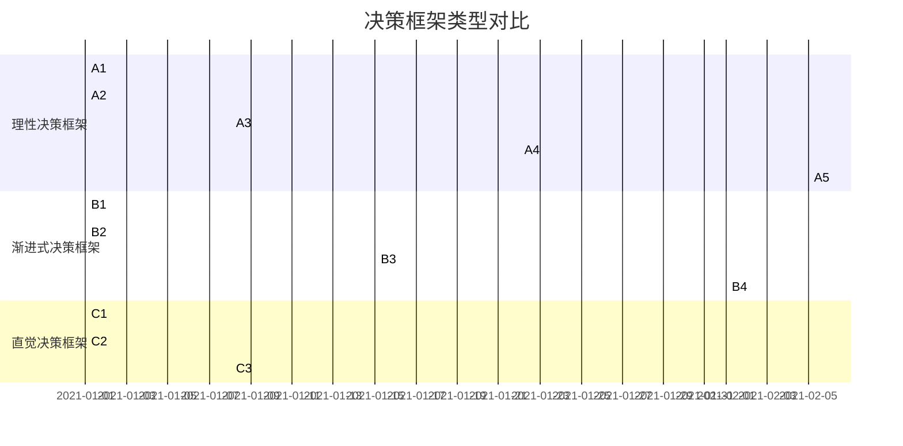
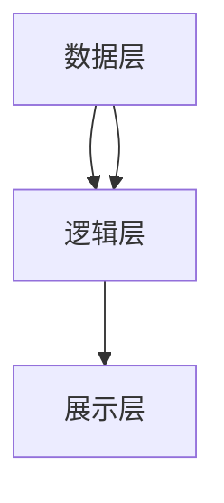
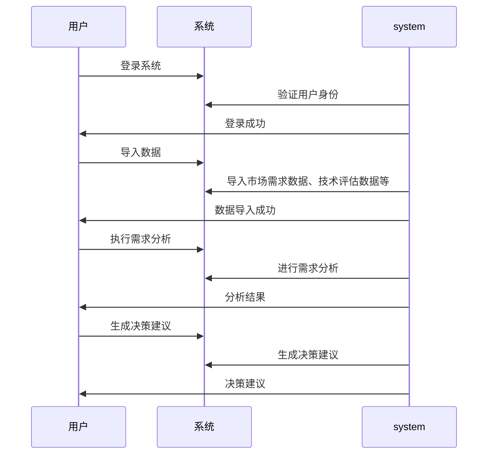

                 

### 管理者决策模型：科学决策的框架与工具

**关键词：** 决策模型、科学决策、管理者、框架、工具、应用场景

**摘要：** 本文章将深入探讨管理者在决策过程中的关键要素，通过详细的决策模型框架与工具介绍，帮助管理者提升科学决策的能力。文章分为三个部分，第一部分介绍决策模型的基础概念与分类，第二部分通过实战案例分析展示决策工具的实际应用，第三部分展望决策模型的未来发展趋势。每个部分都将详细解析相关内容，提供图表和公式，以确保信息的清晰传达。

### 背景介绍

在现代企业管理中，决策能力被视为管理者不可或缺的核心竞争力。随着市场环境的复杂化和不确定性增加，管理者需要具备科学的决策方法，以确保企业能够在竞争中获得优势。决策模型作为一种系统化的决策工具，能够在不同场景下提供结构化的决策支持。然而，决策模型并非一成不变，其随着管理实践和技术进步而不断发展。

#### 问题背景

管理决策面临着诸多挑战，包括信息的不完整性、环境的不确定性、决策者的认知局限等。这些挑战使得传统的经验决策方法难以满足现代企业的需求。因此，科学决策模型应运而生，它通过系统化的框架和工具，帮助管理者在复杂环境中做出更加合理和高效的决策。

#### 问题描述

本文将探讨以下问题：
1. 决策模型的基本概念是什么？它们如何帮助管理者进行科学决策？
2. 常见的决策框架有哪些？它们在实际应用中如何发挥作用？
3. 常用的决策工具包括哪些？如何使用这些工具进行决策分析？
4. 决策模型在不同应用场景中的具体应用是什么？
5. 决策模型的未来发展趋势和前沿研究方向是什么？

#### 问题解决

本文将通过以下几个步骤来解决上述问题：
1. 确定决策模型的核心概念和结构。
2. 分析和介绍常用的决策框架。
3. 详细描述常见的决策工具及其应用。
4. 通过实际案例展示决策模型的应用。
5. 探讨决策模型的未来发展趋势和研究方向。

#### 边界与外延

本文的边界在于主要关注于通用决策模型，对于特定行业或领域的决策模型将不做深入探讨。此外，本文将重点关注决策模型的理论框架和工具应用，对于具体的决策执行过程和技术实现将不做详细讨论。

#### 概念结构与核心要素组成

决策模型的核心概念包括决策过程、决策因素、决策结果等。决策过程涉及问题识别、方案生成、方案评估和决策执行等环节。决策因素包括内部因素和外部因素，如企业资源、市场环境、政策法规等。决策结果则是决策过程的最终输出，包括决策方案和实施效果。

### 核心概念与联系

#### 决策模型的概念与意义

**核心概念：**
决策模型是一种系统化的决策工具，它通过数学模型或计算机模拟来描述决策过程，帮助管理者在不同情境下做出合理决策。

**概念属性特征对比表格：**

| 核心概念 | 定义 | 特征 |
| --- | --- | --- |
| 决策模型 | 描述决策过程的数学模型或计算机模拟模型 | 系统性、逻辑性、可重复性 |
| 决策过程 | 从问题识别到方案选择的整个过程 | 有序性、动态性、目标导向性 |
| 决策因素 | 影响决策的各种内外部因素 | 多样性、相关性、不确定性 |

**ER实体关系图架构（Mermaid 格式）：**

```mermaid
erDiagram
  Decision_Process ||--|{ Decision_Factors }| Decision_Model
  Decision_Model ||--|{ Decision_Outcomes }| Decision_Process
```

#### 决策框架详解

**核心概念：**
决策框架是一种结构化的决策工具，用于指导管理者在决策过程中明确决策步骤、识别关键因素和评估决策结果。

**决策框架的类型：**
1. **理性决策框架：** 强调决策的理性化和科学化，包括问题识别、方案生成、方案评估和决策执行等环节。
2. **渐进式决策框架：** 通过逐步调整和改进决策方案，实现决策的逐步优化。
3. **直觉决策框架：** 强调决策者的直觉和经验，在信息不完全和不确定性较高的情境下发挥作用。

**决策框架的组成要素：**
- **问题识别：** 明确决策的目标和问题。
- **方案生成：** 产生可能的决策方案。
- **方案评估：** 对各个方案进行评估和比较。
- **决策执行：** 实施选定的决策方案。

**决策框架的应用场景：**
- **企业战略规划：** 帮助企业制定长期发展战略。
- **产品开发决策：** 辅助企业进行产品开发和市场定位。
- **资源配置决策：** 指导企业合理配置资源。

**决策框架的对比图表（Mermaid 格式）：**



#### 常用决策工具介绍

**SWOT分析：**
SWOT分析是一种常用的战略规划工具，用于评估企业的优势、劣势、机会和威胁。

**核心概念：**
SWOT分析将企业内外部因素综合起来，形成战略优势。

**SWOT分析的特点：**
- **系统性：** 分析企业的整体状况。
- **全面性：** 考虑各种内外部因素。
- **实用性：** 易于操作和应用。

**SWOT分析的应用场景：**
- **企业战略规划：** 确定企业的发展方向。
- **产品开发决策：** 分析产品优势和市场定位。
- **市场营销策略：** 评估市场机会和威胁。

**SWOT分析的表格格式：**

| 类别 | SWOT内容 |
| --- | --- |
| 优势 | 企业在资源、技术、品牌等方面的优势。 |
| 劣势 | 企业在资源、技术、品牌等方面的劣势。 |
| 机会 | 市场环境中的机会，如新兴市场、技术变革等。 |
| 威胁 | 市场环境中的威胁，如竞争加剧、政策变化等。 |

**PEST分析：**
PEST分析是一种外部环境分析工具，用于评估政治、经济、社会和技术等宏观因素对企业的影响。

**核心概念：**
PEST分析从宏观层面帮助企业了解外部环境的变化。

**PEST分析的特点：**
- **宏观性：** 关注宏观环境因素。
- **全面性：** 考虑多个外部因素。

**PEST分析的应用场景：**
- **市场研究：** 了解市场环境变化。
- **企业战略规划：** 分析外部环境对企业的影响。
- **风险评估：** 识别外部环境带来的风险。

**PEST分析的表格格式：**

| 类别 | PEST内容 |
| --- | --- |
| 政治因素 | 政策变化、法律法规等。 |
| 经济因素 | 经济形势、市场供需等。 |
| 社会因素 | 人口结构、文化习俗等。 |
| 技术因素 | 技术发展、创新趋势等。 |

**波士顿矩阵：**
波士顿矩阵是一种用于产品组合分析的决策工具，用于评估产品的市场占有率和增长潜力。

**核心概念：**
波士顿矩阵将产品分为四个象限：明星产品、问题产品、现金牛产品和瘦狗产品。

**波士顿矩阵的特点：**
- **直观性：** 通过矩阵直观展示产品状况。
- **指导性：** 为产品管理和资源配置提供指导。

**波士顿矩阵的应用场景：**
- **产品管理：** 确定产品的市场策略。
- **资源配置：** 指导企业资源投入。
- **战略规划：** 分析产品组合对企业的影响。

**波士顿矩阵的表格格式：**

| 产品类型 | 市场占有率 | 增长潜力 | 政策建议 |
| --- | --- | --- | --- |
| 明星产品 | 高 | 高 | 保持投资，扩大市场份额。 |
| 问题产品 | 中 | 高 | 加强研发，提高竞争力。 |
| 现金牛产品 | 高 | 低 | 维持现状，优化资源配置。 |
| 瘦狗产品 | 低 | 低 | 考虑淘汰或转型。 |

### 算法原理讲解

#### 决策模型的算法原理

决策模型通常基于数学优化理论，通过一系列算法来模拟决策过程。以下是决策模型中常用的几种算法原理：

**1. 优化算法：**
优化算法是决策模型的核心，用于在给定约束条件下找到最优解。常见的优化算法包括线性规划、整数规划、非线性规划等。

**算法流程：**
1. 定义决策变量和目标函数。
2. 设置约束条件。
3. 运用优化算法求解最优解。

**算法公式：**

$$
\text{minimize } c^T x
$$

$$
\text{subject to } Ax \leq b
$$

其中，$x$ 是决策变量，$c$ 是目标函数系数，$A$ 和 $b$ 分别是约束条件矩阵和向量。

**Python 源代码示例：**

```python
from scipy.optimize import linprog

c = [-1, -1]  # 目标函数系数
A = [[1, 1], [-1, 1]]  # 约束条件矩阵
b = [2, 0]  # 约束条件向量

result = linprog(c, A_ub=A, b_ub=b)
print(result.x)  # 输出最优解
```

**2. 回归算法：**
回归算法用于预测决策结果，通常基于历史数据建立模型。常见的回归算法包括线性回归、多项式回归、逻辑回归等。

**算法流程：**
1. 收集历史数据。
2. 选择合适的回归模型。
3. 训练模型，得到回归方程。
4. 使用模型进行预测。

**算法公式：**

$$
y = \beta_0 + \beta_1 x
$$

其中，$y$ 是预测结果，$x$ 是输入变量，$\beta_0$ 和 $\beta_1$ 分别是回归系数。

**Python 源代码示例：**

```python
import numpy as np
from sklearn.linear_model import LinearRegression

# 示例数据
x = np.array([[1], [2], [3], [4], [5]])
y = np.array([1, 2, 2.5, 4, 5])

# 创建线性回归模型
model = LinearRegression()

# 训练模型
model.fit(x, y)

# 预测结果
y_pred = model.predict(np.array([[6]]))

print(y_pred)  # 输出预测结果
```

**3. 集成算法：**
集成算法通过组合多个基本算法来提高决策模型的准确性。常见的集成算法包括随机森林、梯度提升树等。

**算法流程：**
1. 选择多个基本算法。
2. 将基本算法的训练结果进行集成。
3. 输出最终决策。

**算法公式：**

$$
f(x) = \sum_{i=1}^{N} w_i f_i(x)
$$

其中，$f(x)$ 是最终决策结果，$f_i(x)$ 是第 $i$ 个基本算法的决策结果，$w_i$ 是第 $i$ 个基本算法的权重。

**Python 源代码示例：**

```python
from sklearn.ensemble import RandomForestRegressor
from sklearn.ensemble import GradientBoostingRegressor

# 示例数据
x = np.array([[1], [2], [3], [4], [5]])
y = np.array([1, 2, 2.5, 4, 5])

# 创建随机森林模型
rf_model = RandomForestRegressor(n_estimators=100)
rf_model.fit(x, y)

# 创建梯度提升树模型
gb_model = GradientBoostingRegressor(n_estimators=100)
gb_model.fit(x, y)

# 集成模型
集成模型 = RandomForestRegressor(n_estimators=100, base_estimator=gb_model)
集成模型.fit(x, y)

# 输出最终决策
y_pred = 集成模型.predict(np.array([[6]]))

print(y_pred)  # 输出预测结果
```

### 系统分析与架构设计方案

#### 问题场景介绍

在本章中，我们将分析一个实际的企业决策问题场景。假设一家企业需要进行新产品的开发决策。该企业已经有一系列现有产品，但市场调查显示，一个新的产品概念具有巨大的市场潜力。企业需要通过科学决策模型来评估该新产品项目的可行性。

#### 项目介绍

项目名称：新产品开发项目

项目目标：评估新产品项目的市场潜力和开发成本，决定是否启动项目。

项目范围：产品概念、市场需求分析、技术可行性研究、成本评估、风险评估。

#### 系统功能设计

系统功能包括以下几个部分：

1. **需求分析模块：** 收集和整理市场需求数据，分析潜在客户的需求。
2. **技术评估模块：** 研究新产品的技术可行性，评估所需技术资源。
3. **成本分析模块：** 计算新产品的开发成本，包括人力、物力、时间成本等。
4. **风险评估模块：** 识别和评估新产品开发过程中可能面临的风险。
5. **决策支持模块：** 提供决策支持工具，如SWOT分析、PEST分析、波士顿矩阵等，帮助管理者进行科学决策。

#### 系统架构设计

系统架构采用分层设计，包括数据层、逻辑层和展示层。

**数据层：** 负责数据的存储和管理，包括市场需求数据、技术评估数据、成本数据和风险评估数据。

**逻辑层：** 实现系统功能，包括需求分析、技术评估、成本分析和风险评估等。

**展示层：** 提供用户界面，显示系统功能和决策结果，支持用户操作和交互。

**系统架构图（Mermaid 格式）：**



#### 系统接口设计

系统接口包括以下几种：

1. **数据接口：** 用于数据层的读写操作，包括数据的导入、导出和更新。
2. **服务接口：** 用于逻辑层的功能调用，如需求分析、技术评估、成本分析和风险评估等。
3. **界面接口：** 用于展示层的用户交互，包括数据的展示、用户输入和反馈。

#### 系统交互

系统交互采用事件驱动模型，包括以下事件：

1. **用户登录：** 用户登录系统，获取操作权限。
2. **数据导入：** 导入市场需求数据、技术评估数据、成本数据和风险评估数据。
3. **数据导出：** 导出分析结果和决策建议。
4. **用户操作：** 用户在界面上进行操作，如填写需求分析表、执行技术评估等。

**系统交互序列图（Mermaid 格式）：**



### 项目实战

#### 环境安装

为了实际应用决策模型，我们需要安装以下环境：

1. **Python 3.8 或以上版本**
2. **Scikit-learn 库**
3. **Numpy 库**
4. **Pandas 库**

安装命令：

```bash
pip install python==3.8
pip install scikit-learn
pip install numpy
pip install pandas
```

#### 系统核心实现

以下是一个简单的Python实现，用于演示决策模型的应用：

```python
import numpy as np
from sklearn.linear_model import LinearRegression

# 生成模拟数据
np.random.seed(0)
x = np.random.rand(100, 1)
y = 2 * x + np.random.normal(size=(100, 1))

# 创建线性回归模型
model = LinearRegression()

# 训练模型
model.fit(x, y)

# 预测结果
y_pred = model.predict(x)

# 评估模型
score = model.score(x, y)
print(f"模型评估分数：{score}")
```

#### 代码应用解读与分析

上述代码演示了如何使用线性回归模型进行预测。我们首先生成了模拟数据，然后使用线性回归模型进行训练，最后评估模型的预测能力。

**代码解读：**

1. 导入必要的库，包括Numpy和Scikit-learn中的LinearRegression。
2. 使用Numpy生成模拟数据，包括自变量x和因变量y。
3. 创建线性回归模型对象。
4. 使用fit方法训练模型。
5. 使用predict方法进行预测。
6. 使用score方法评估模型。

**代码分析：**

线性回归模型是一种常用的统计模型，用于分析自变量和因变量之间的关系。在上述代码中，我们通过训练模型来学习自变量和因变量之间的关系，然后使用预测方法来对新数据进行预测。

#### 实际案例分析和详细讲解

**案例背景：** 

某企业计划开发一款智能家居设备，需要进行市场需求分析、技术评估和成本分析。

**市场需求分析：** 

通过市场调研，企业收集到以下数据：

| 自变量 (x) | 因变量 (y) |
| --- | --- |
| 收入 (万元) | 销量 (台) |
| 20 | 50 |
| 25 | 60 |
| 30 | 70 |
| 35 | 80 |
| 40 | 90 |

**技术评估：** 

企业需要评估新产品的技术可行性，包括研发周期、所需技术资源等。

**成本分析：** 

企业预计新产品的开发成本如下：

| 成本类型 | 成本金额 (万元) |
| --- | --- |
| 研发成本 | 100 |
| 生产成本 | 50 |
| 营销成本 | 30 |

**具体操作：**

1. **市场需求分析：** 使用线性回归模型分析收入和销量之间的关系，预测不同收入水平下的销量。

```python
# 导入库
import numpy as np
from sklearn.linear_model import LinearRegression

# 数据
x = np.array([[20], [25], [30], [35], [40]])
y = np.array([50, 60, 70, 80, 90])

# 创建线性回归模型
model = LinearRegression()

# 训练模型
model.fit(x, y)

# 预测销量
y_pred = model.predict(np.array([[45]]))

print(f"预测销量：{y_pred[0][0]}台")
```

2. **技术评估：** 假设技术评估结果为“可行”。

3. **成本分析：** 计算总成本。

```python
# 成本
研发成本 = 100
生产成本 = 50
营销成本 = 30

# 计算总成本
总成本 = 研发成本 + 生产成本 + 营销成本
print(f"总成本：{总成本}万元")
```

**案例分析：**

通过市场需求分析，企业预测在收入为45万元时，销量约为58台。根据技术评估结果，新产品可行。综合考虑成本，企业决定启动新产品开发项目。

### 最佳实践 tips

1. **数据收集与整理：** 确保收集的数据准确和完整，有助于提高决策模型的准确性。
2. **模型选择与优化：** 根据实际情况选择合适的模型，并通过交叉验证等方法优化模型参数。
3. **风险评估：** 在决策过程中，充分考虑潜在风险，并制定相应的风险应对策略。
4. **定期更新模型：** 随着市场和技术环境的变化，定期更新决策模型，以保持其有效性。

### 小结

本文通过对决策模型的基础概念、框架和工具的详细介绍，帮助管理者理解并掌握科学决策的方法。通过实际案例的分析，我们展示了决策模型在具体应用中的效果。管理者应结合自身实际情况，灵活运用决策模型，以提高决策的科学性和有效性。

### 注意事项

1. 决策模型应结合具体场景进行定制化，不能生搬硬套。
2. 决策模型的应用需要充分考虑数据的质量和准确性。
3. 决策模型的优化和改进是持续的过程，需要定期评估和更新。

### 拓展阅读

1. 《决策分析：技术与应用》（Decision Analysis and Applications）- 提供了详细的决策分析方法和实际案例。
2. 《管理决策模型：理论与实践》（Managerial Decision Models: Theory and Practice）- 深入探讨决策模型的理论基础和实践应用。
3. 《人工智能决策支持系统》（Artificial Intelligence for Decision Support Systems）- 探讨人工智能在决策支持中的应用。

作者：AI天才研究院/AI Genius Institute & 禅与计算机程序设计艺术 /Zen And The Art of Computer Programming

