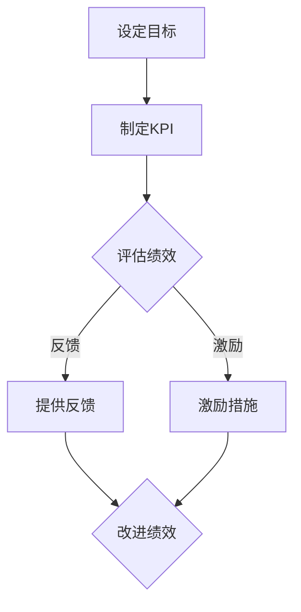
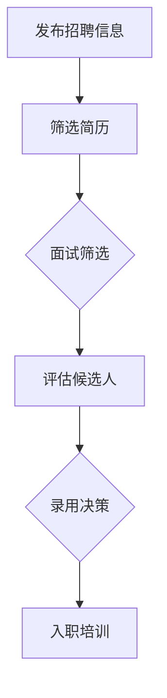

                 

# 管理者如何有效管理人员：人力资源管理技巧

> 关键词：管理者、人力资源、管理技巧、人员管理、绩效评估

> 摘要：本文将深入探讨管理者如何通过人力资源管理技巧，有效地进行人员管理。我们将从管理的定义、人力资源的角色、招聘策略、面试技巧、绩效管理等各个方面，一步步分析并阐述如何提升管理者的管理能力，进而提升整个组织的绩效。

## 引言

在当今快速发展的商业环境中，管理者扮演着至关重要的角色。他们的职责不仅是确保日常运营的顺利进行，更重要的是要激发员工的潜力，推动组织的创新和发展。然而，如何有效地管理人力资源，实现人员与组织目标的最佳匹配，是一个长期的挑战。本文将围绕这一主题，通过一系列的逻辑分析和案例研究，为管理者提供实用的人力资源管理技巧。

### 了解管理

在探讨人力资源管理之前，首先需要明确管理的概念。管理可以被视为一系列活动，通过这些活动，管理者能够指导和协调团队的工作，以达到组织的既定目标。

#### 定义和角色

管理不仅仅是下达命令，它还涉及到规划、组织、领导、控制等一系列复杂的活动。管理者需要具备以下几个核心角色：

- **规划者**：设定组织的目标，制定实现这些目标的策略和计划。
- **组织者**：分配资源和任务，确保团队的工作能够高效进行。
- **领导者**：激励和引导员工，发挥他们的潜能，推动团队向前发展。
- **控制者**：监控和评估团队的工作绩效，确保目标的实现。

#### 管理的核心原则

- **目标导向**：所有管理活动都应该围绕组织的总体目标进行。
- **效率优先**：通过优化流程和资源分配，提高工作效率。
- **灵活性**：能够快速适应变化，灵活调整策略和计划。
- **团队协作**：鼓励团队协作，共同实现组织目标。

#### 管理在现代社会的重要性

在现代社会，管理的重要性越来越凸显。随着全球化的推进，商业环境变化迅速，组织需要具备高度的适应性和创新能力。管理者作为组织的中坚力量，他们不仅要确保组织的日常运营，还需要引领组织不断创新，以应对外部环境的挑战。

### 人力资源的角色

在管理活动中，人力资源（HR）扮演着至关重要的角色。HR不仅仅是负责招聘和员工福利的部门，它还是组织战略的重要组成部分。

#### HR的主要职能

- **招聘与选拔**：通过有效的招聘策略，吸引和选拔适合组织的人才。
- **培训与发展**：为员工提供培训机会，提升他们的技能和职业素养。
- **绩效管理**：建立科学的绩效评估体系，激励员工提升绩效。
- **薪酬与福利**：设计合理的薪酬和福利体系，吸引和留住优秀人才。
- **员工关系**：维护良好的员工关系，提高员工的满意度和忠诚度。

#### 人力资源管理的演变

人力资源管理的概念和实践经历了长期的演变。在过去，HR主要关注的是员工的福利和薪酬，而现代HR则更注重员工的职业发展和组织目标的实现。这种转变反映了HR角色从行政支持到战略合作伙伴的转变。

### 招聘与选拔

招聘与选拔是人力资源管理的重要环节。一个优秀的招聘策略可以为企业吸引到合适的人才，为组织的长期发展奠定基础。

#### 招聘策略

- **品牌建设**：建立良好的雇主品牌，提升企业在求职者中的吸引力。
- **渠道多样化**：通过多种渠道发布招聘信息，扩大招聘范围。
- **精准定位**：根据职位需求，精准定位目标候选人。
- **数据分析**：利用数据分析，优化招聘流程和策略。

#### 面试技巧

面试是选拔过程中至关重要的一环。有效的面试技巧可以帮助管理者更好地评估候选人的能力和潜力。

- **结构性面试**：通过一系列标准化的问题，系统评估候选人的能力。
- **行为面试**：通过询问候选人过去的经历，评估其行为模式和应对能力。
- **情境面试**：设置模拟工作场景，评估候选人在实际工作情境中的表现。

#### 选拔标准

选拔标准是评估候选人的关键依据。管理者需要根据职位的要求，制定科学的选拔标准，以确保选拔到最适合的人才。

- **技能与经验**：评估候选人是否具备职位所需的技能和经验。
- **潜力与适应性**：评估候选人的学习能力和适应新环境的能力。
- **文化契合度**：评估候选人与组织文化的契合度，确保其能够融入团队。

### 员工培训与发展

员工培训与发展是提高员工技能和职业素养的重要途径。有效的培训计划可以提升员工的绩效，增强组织的竞争力。

#### 培训计划

- **需求分析**：根据员工和组织的实际需求，制定有针对性的培训计划。
- **内容设计**：确保培训内容贴近实际工作，具有实用性和针对性。
- **形式多样**：采用多样化的培训形式，如在线学习、工作坊、研讨会等。
- **反馈机制**：建立反馈机制，收集员工对培训效果的反馈，不断优化培训计划。

#### 发展计划

发展计划旨在提升员工的职业素养和领导力，为其未来的职业发展奠定基础。

- **晋升通道**：建立清晰的晋升通道，为员工提供职业发展的机会。
- **领导力培训**：为有潜力的员工提供领导力培训，提升其管理能力。
- **跨部门交流**：鼓励员工跨部门交流，拓展其视野和经验。

### 绩效管理

绩效管理是人力资源管理的重要组成部分。通过科学的绩效评估，管理者可以激励员工提升绩效，同时发现和解决问题。

#### 绩效管理体系

- **目标设定**：设定明确的绩效目标，确保员工了解组织对他们的期望。
- **关键绩效指标（KPI）**：制定合理的KPI，量化员工的绩效表现。
- **定期评估**：定期对员工的绩效进行评估，提供反馈和建议。
- **激励制度**：建立激励制度，奖励绩效优秀的员工。

#### 绩效沟通

绩效沟通是绩效管理的重要环节。管理者需要与员工进行有效的沟通，确保他们了解自己的绩效表现，同时获得改进的机会。

- **反馈机制**：建立反馈机制，及时向员工提供反馈，帮助他们了解自己的优点和不足。
- **面谈**：定期与员工进行一对一的面谈，讨论他们的绩效表现和职业发展。
- **激励与支持**：对表现优秀的员工给予激励和认可，同时为表现不佳的员工提供支持。

### 案例研究

以下是一个案例研究，展示了某科技公司如何通过有效的人力资源管理技巧提升管理者的管理能力，进而提高整个组织的绩效。

#### 案例背景

某科技公司是一家高速发展的科技企业，员工人数超过1000人。随着公司规模的不断扩大，管理者面临了一系列挑战，包括如何高效地管理团队、激励员工、提升绩效等。为了解决这些问题，公司决定实施一系列的人力资源管理措施。

#### 案例措施

1. **招聘与选拔**：公司通过品牌建设，提升雇主品牌，吸引了一批优秀的候选人。同时，采用多样化的招聘渠道，如在线招聘平台、专业猎头、校园招聘等，扩大了招聘范围。在面试过程中，公司采用了结构性面试和行为面试相结合的方法，全面评估候选人的能力和潜力。

2. **员工培训与发展**：公司制定了全面的培训计划，包括新员工入职培训、专业技能培训、领导力培训等。通过在线学习平台和内部工作坊，公司为员工提供了多种学习机会，提高了员工的技能和职业素养。

3. **绩效管理**：公司建立了科学的绩效评估体系，包括目标设定、关键绩效指标（KPI）制定、定期评估等。通过绩效评估，公司能够及时发现和解决员工在绩效方面的问题，激励员工提升绩效。

4. **激励与支持**：公司建立了激励制度，对绩效优秀的员工给予奖金、晋升等激励措施。同时，公司为表现不佳的员工提供了一对一的职业发展指导，帮助他们提升技能和绩效。

#### 案例效果

通过实施上述措施，公司的管理水平得到了显著提升。员工满意度提高，离职率下降，公司整体绩效也有了显著提升。此外，公司还培养了一批具有领导力的管理人才，为公司的长期发展奠定了坚实的基础。

### 总结

本文通过一系列的逻辑分析和案例研究，探讨了管理者如何通过人力资源管理技巧，有效地进行人员管理。从招聘与选拔、员工培训与发展、绩效管理等方面，管理者可以采取一系列措施，提升管理能力，进而提高整个组织的绩效。然而，人力资源管理是一个长期而复杂的过程，需要管理者持续关注和优化。只有不断改进管理技巧，才能在激烈的市场竞争中立于不败之地。

### 作者信息

作者：AI天才研究院/AI Genius Institute & 禅与计算机程序设计艺术 /Zen And The Art of Computer Programming

### 最佳实践 Tips

- **建立明确的绩效目标**：确保员工了解组织的期望，从而有针对性地提升绩效。
- **采用多样化的培训形式**：结合在线学习、工作坊、研讨会等多种形式，提高培训效果。
- **定期进行绩效评估**：及时发现问题，提供反馈，帮助员工改进。
- **激励与支持并重**：奖励表现优秀的员工，同时为表现不佳的员工提供支持。
- **关注员工发展**：为员工提供晋升和发展机会，激发他们的潜力。

### 小结

通过本文的探讨，我们了解到人力资源管理对于管理者的重要性。有效的招聘、培训和发展、绩效管理等措施，不仅能够提升管理者的管理能力，还能提高整个组织的绩效。然而，人力资源管理是一个长期而复杂的过程，需要管理者不断学习和改进。只有持续关注和优化管理技巧，才能在竞争激烈的市场环境中取得成功。

### 注意事项

- 在实施人力资源管理措施时，要充分考虑员工的个人差异和需求，避免“一刀切”的做法。
- 激励制度要合理，避免过度激励导致员工产生依赖心理。
- 绩效评估要客观公正，避免主观偏见和歧视现象。

### 拓展阅读

- 《人力资源管理学》（Robbins，Stephen P. & Judge，Timothy A.）
- 《绩效管理：系统与方法》（汪建伟）
- 《人力资源管理实践》（Stephen P. Robbins & Timothy A. Judge）

### 附录

附录中可以包括以下内容：

- **术语表**：列出本文中使用的专业术语及其解释。
- **参考文献**：列出本文引用的参考文献，格式按照学术规范。
- **图示**：包括本文中使用的各类图示，如流程图、架构图等。

### 附录

#### 术语表

1. **绩效管理**：指管理者通过设定目标、制定评估标准、提供反馈和激励等措施，来提高员工工作表现的过程。
2. **关键绩效指标（KPI）**：衡量员工工作绩效的核心指标，用于评估员工在关键业务领域的表现。
3. **招聘策略**：指企业在招聘过程中采用的方法和手段，以吸引和选拔适合的人才。
4. **员工培训**：指企业为提高员工技能和职业素养而进行的系统教育和培训。
5. **雇主品牌**：指企业在求职者心中的形象和声誉，包括企业的价值观、文化、工作环境等。

#### 参考文献

1. Robbins，Stephen P. & Judge，Timothy A. (2020). **Human Resource Management.** Pearson.
2. 汪建伟. (2018). **绩效管理：系统与方法.** 北京大学出版社.
3. Stephen P. Robbins & Timothy A. Judge. (2017). **Human Resource Management Practices.** Sage Publications.

#### 图示

**绩效管理流程图**

**招聘流程图**

通过这些图示和参考文献，读者可以更直观地理解本文中的核心概念和实践方法。附录的内容不仅丰富了文章的信息量，也为读者提供了进一步学习和研究的资源。

