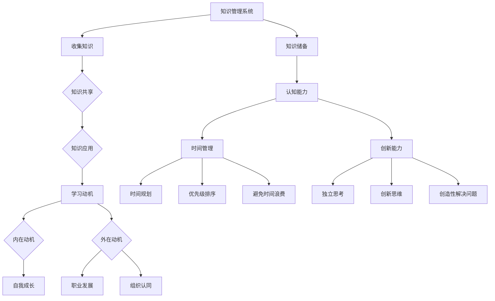
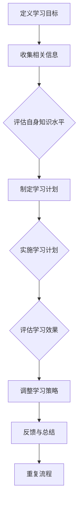
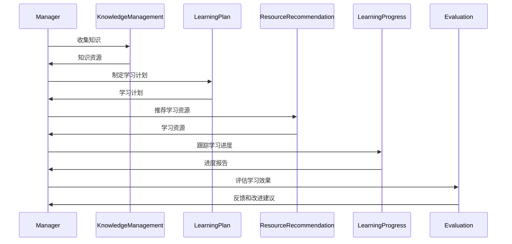
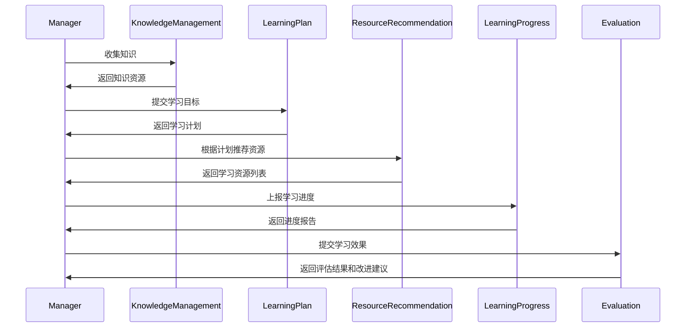

                 

### 管理者学习能力的重要性

在现代企业管理中，管理者需要具备一系列复杂的技能和知识，而其中最关键的一项便是学习能力。在信息技术飞速发展的时代，知识更新速度不断加快，无论是新技术、新理论，还是管理实践，都在不断演变。因此，管理者必须具备持续学习和适应变化的能力，才能在激烈的市场竞争中保持领先地位。

#### **问题背景**

随着全球化和数字化的加速推进，企业面临着前所未有的变革与挑战。技术进步带来的市场变化、消费者需求的多样化，以及竞争对手的快速迭代，都要求管理者具备快速响应和调整的能力。传统管理模式和方法已无法满足现代企业发展的需求，管理者必须不断更新自己的知识储备，提升自身的能力和素质。

#### **问题描述**

管理者面临的主要问题包括：

1. **知识陈旧**：随着时间的推移，已有的知识和技能可能会过时，无法适应新的工作环境。
2. **能力不足**：面对新的业务场景和技术挑战，管理者可能发现自己缺乏必要的知识和能力。
3. **学习难度**：在繁忙的工作中，管理者往往难以抽出时间进行系统性的学习。

#### **问题解决**

为了解决上述问题，管理者需要：

1. **持续学习**：不断更新自己的知识和技能，保持与时代同步。
2. **主动适应**：积极应对变化，灵活调整管理策略和方法。
3. **优化时间管理**：合理安排时间，确保有足够的时间进行学习和自我提升。

#### **边界与外延**

**学习的定义**：学习是指通过获取新知识、技能或行为方式，以提高个人能力的过程。

**学习的重要性**：对于管理者而言，学习不仅是一种个人提升的途径，更是企业持续发展的关键。通过学习，管理者可以：

- **提高决策能力**：掌握更多知识和信息，有助于做出更明智的决策。
- **提升创新能力**：通过学习新知识和技能，管理者可以激发创新思维，推动企业进步。
- **增强领导力**：学习如何更好地领导团队，提高团队整体绩效。

**学习能力的具体体现**：

- **知识储备**：管理者需要拥有广泛的知识储备，涵盖行业知识、管理理论、技术技能等。
- **学习习惯**：管理者应具备良好的学习习惯，包括持续学习的动力、有效的时间管理能力等。
- **适应能力**：面对新的环境和挑战，管理者应能迅速适应，灵活调整管理策略。

总之，管理者学习能力的重要性不可忽视。在快速变化的时代，只有不断学习和适应，才能在激烈的竞争中立于不败之地。在接下来的章节中，我们将深入探讨管理者提升学习能力的方法和策略。

### 核心概念与联系

在探讨管理者学习能力的过程中，理解以下几个核心概念及其相互关系是至关重要的。这些概念不仅构成了管理者学习能力的基石，也为我们提供了评估和提升学习能力的框架。

#### **核心概念原理**

1. **知识管理**：知识管理是指通过收集、组织、存储和应用知识来提高组织效率和创新能力的过程。对于管理者而言，知识管理是一种关键的技能，它可以帮助他们快速获取和利用必要的信息，做出更好的决策。

2. **学习动机**：学习动机是指驱使个体进行学习的内在或外在力量。管理者的学习动机可能来源于个人成长的需求、职业发展的期望，或者对组织目标的认同。保持持续的学习动机对于提升学习能力至关重要。

3. **认知能力**：认知能力是指个体在获取、处理和应用信息时的能力，包括记忆力、注意力、逻辑思维、问题解决等。管理者的认知能力决定了他们在面对复杂问题和挑战时的应对能力。

4. **时间管理**：时间管理是指合理安排时间，确保高效完成工作和学习任务的能力。管理者需要通过时间管理来平衡工作、学习和个人生活，确保有足够的时间和资源进行学习和提升。

5. **创新能力**：创新能力是指个体在现有知识和技能的基础上，创造新的思维、方法或产品的能力。管理者需要通过创新来适应快速变化的环境，推动组织的进步和发展。

#### **概念属性特征对比**

以下是一个简化的对比表格，展示上述核心概念的属性特征及其相互联系：

| 核心概念 | 定义 | 属性特征 | 相互联系 |
| --- | --- | --- | --- |
| 知识管理 | 收集、组织、存储和应用知识 | 知识获取、知识共享、知识应用 | 支持学习动机和认知能力 |
| 学习动机 | 驱使个体进行学习的内在或外在力量 | 内在动机（兴趣、成长）、外在动机（奖励、压力） | 影响知识管理和认知能力 |
| 认知能力 | 获取、处理和应用信息的能力 | 记忆力、注意力、逻辑思维、问题解决 | 支持知识管理和创新能力 |
| 时间管理 | 合理安排时间，确保高效完成工作和学习任务 | 时间规划、优先级排序、避免时间浪费 | 支持知识管理和学习动机 |
| 创新能力 | 在现有知识和技能的基础上创造新的思维、方法或产品 | 独立思考、创新思维、创造性解决问题 | 支持知识管理和时间管理 |

#### **ER实体关系图架构**

为了更直观地展示上述核心概念之间的相互关系，我们可以使用ER（Entity-Relationship，实体-联系）图来建模。以下是管理者学习能力相关概念的ER图：

```mermaid
erDiagram
  KMS(知识管理系统) ||--|{ L(学习动机)
  L ||--|{ C(认知能力)
  C ||--|{ T(时间管理)
  C ||--|{ I(创新能力)
  KMS ||--|{ K(知识储备)
  L --|{ M(管理者)
  C --|{ M
  T --|{ M
  I --|{ M
  K --|{ M
```

在这个ER图中：

- **KMS（知识管理系统）**：作为知识管理的核心，它支持其他核心概念的运作。
- **L（学习动机）**：影响管理者的学习动力，与知识管理、认知能力、时间管理和创新能力有直接关系。
- **C（认知能力）**：支持知识管理、学习动机、时间管理和创新能力的提升。
- **T（时间管理）**：确保管理者有足够的时间进行学习和提升。
- **I（创新能力）**：通过创造新的思维和方法，推动组织的进步和发展。
- **K（知识储备）**：管理者的知识基础，支持其他核心概念的实现。
- **M（管理者）**：所有核心概念的应用对象，是学习能力提升的主体。

#### **Mermaid流程图**

为了进一步理解这些核心概念在管理者学习能力提升过程中的应用，我们可以使用Mermaid绘制一个流程图，展示各概念之间的相互作用和流程：



在这个流程图中：

- **A（知识管理系统）**：作为知识管理的基础，通过收集、共享和应用知识，为管理者提供知识储备。
- **E（学习动机）**：内在和外在动机激发管理者的学习动力，推动自我成长、职业发展和组织认同。
- **K（知识储备）**：管理者的知识基础，支持认知能力、时间管理和创新能力的提升。
- **L（认知能力）**：通过获取和处理信息，提高管理者的决策能力和问题解决能力。
- **M（时间管理）**：合理安排时间，确保管理者有足够的时间进行学习和提升。
- **N（创新能力）**：通过创新思维和创造性解决问题，推动组织的进步和发展。

通过这些核心概念和流程的讨论，我们可以更清晰地认识到管理者学习能力的重要性及其提升方法。在接下来的章节中，我们将深入探讨如何具体实践这些方法，以提升管理者的学习能力。

### 算法原理讲解

在探讨管理者如何提升学习能力时，我们需要引入一种系统化的方法来理解和执行这一过程。为了使讨论更加具体和易于理解，我们将使用一种简单的算法来描述管理者提升学习能力的方法。这种算法不仅有助于我们理解学习过程，还可以作为一个工具来指导实际操作。

#### **算法流程图**

首先，让我们使用Mermaid绘制算法流程图，以展示各个步骤及其相互关系：



#### **Python源代码**

接下来，我们通过Python源代码来详细阐述这个算法原理。以下是算法的伪代码实现：

```python
# 定义学习目标
def define_learning_goals():
    print("请输入您希望实现的学习目标：")
    goals = input().split(',')
    return goals

# 收集相关信息
def collect_information(goals):
    print("收集相关信息：")
    for goal in goals:
        print(f"目标'{goal}'的相关信息：")
        # 这里可以使用API、在线资源等方式获取信息
        print("获取信息...")

# 评估自身知识水平
def assess_knowledge_level(goals):
    print("评估自身知识水平：")
    for goal in goals:
        print(f"对目标'{goal}'进行自我评估...")
        # 这里可以使用问卷调查、考试等方法进行评估
        print("评估完成。")

# 制定学习计划
def create_learning_plan(goals, knowledge_level):
    print("制定学习计划：")
    for goal in goals:
        if knowledge_level[goal] < 5:
            print(f"目标'{goal}'：需要深入学习。")
        elif knowledge_level[goal] >= 5 and knowledge_level[goal] < 8:
            print(f"目标'{goal}'：需要复习和提升。")
        else:
            print(f"目标'{goal}'：保持现有水平。")

# 实施学习计划
def implement_learning_plan(plan):
    print("实施学习计划：")
    for step in plan:
        print(f"执行学习计划中的步骤：{step}...")
        # 这里可以设置学习时间、学习内容等
        print("学习步骤完成。")

# 评估学习效果
def assess_learning_effects():
    print("评估学习效果：")
    # 这里可以设置测试、考核等方法来评估学习效果
    print("学习效果评估完成。")

# 调整学习策略
def adjust_learning_strategy(effect):
    if effect < 70:
        print("学习效果不理想，需要调整学习策略。")
    else:
        print("学习效果良好，可以继续当前学习策略。")

# 反馈与总结
def feedback_and_summary():
    print("反馈与总结：")
    # 这里可以记录学习过程中的反馈和总结，用于后续改进
    print("反馈和总结记录完成。")

# 主函数：提升学习能力流程
def improve_learning_ability():
    goals = define_learning_goals()
    knowledge_level = assess_knowledge_level(goals)
    plan = create_learning_plan(goals, knowledge_level)
    implement_learning_plan(plan)
    effect = assess_learning_effects()
    adjust_learning_strategy(effect)
    feedback_and_summary()

# 执行流程
improve_learning_ability()
```

#### **算法原理**

1. **定义学习目标**：首先，管理者需要明确自己的学习目标。这些目标可以是技能提升、知识扩展、或者行为改变等。例如，一个管理者可能希望提升数据分析能力、掌握新的管理工具，或者改善团队沟通效果。

2. **收集相关信息**：在明确了学习目标后，管理者需要收集相关的信息和资源。这可以包括书籍、在线课程、行业报告、专家讲座等。收集的信息将有助于管理者深入了解学习目标，并为后续的学习计划提供依据。

3. **评估自身知识水平**：了解自己的知识水平是制定有效学习计划的前提。管理者可以通过自我评估、考试、问卷等方法来评估自己在各个学习目标上的知识水平。

4. **制定学习计划**：根据评估结果，管理者需要制定一个具体的学习计划。这个计划应该包括学习的时间安排、学习内容的选择、学习方式的确定等。

5. **实施学习计划**：在制定好学习计划后，管理者需要按照计划执行学习任务。这可以包括参加培训课程、阅读书籍、完成作业、实践应用等。

6. **评估学习效果**：学习计划执行完毕后，管理者需要评估自己的学习效果。这可以通过测试、考核、反馈等方式进行。评估结果将帮助管理者了解学习目标的达成情况。

7. **调整学习策略**：根据学习效果评估的结果，管理者需要调整学习策略。如果学习效果不理想，管理者可能需要增加学习时间、更换学习资源、改变学习方式等。

8. **反馈与总结**：最后，管理者需要记录学习过程中的反馈和总结。这些反馈和总结将用于后续的学习，帮助管理者不断优化学习过程。

#### **数学模型和公式**

为了量化管理者的学习效果，我们可以使用以下简单的数学模型：

$$
E = \frac{S \times L}{T}
$$

其中：

- **E**：学习效果（Effectiveness），用于衡量管理者在特定学习目标上的达成情况。
- **S**：学习投入（Study Input），包括学习时间、学习资源投入等。
- **L**：学习产出（Learning Output），包括学习成果、知识掌握程度等。
- **T**：总投入（Total Input），包括学习投入和产出。

通过调整学习策略，管理者可以优化E的值，从而提高学习效果。

#### **通俗易懂的例子**

假设一个管理者希望提升数据分析能力。以下是这个学习过程的详细步骤：

1. **定义学习目标**：管理者明确目标，希望学会使用Python进行数据分析。

2. **收集相关信息**：管理者查找相关的书籍、在线课程和论坛，了解Python数据分析的基本概念和工具。

3. **评估自身知识水平**：管理者通过在线测试评估自己在Python基础知识上的掌握情况，发现自己在基础语法和数据处理方面有一定的基础。

4. **制定学习计划**：管理者制定一个详细的学习计划，包括每天学习2小时，每周完成一个小项目。

5. **实施学习计划**：管理者按照计划学习，完成了一个关于数据可视化的项目，并通过了在线考试。

6. **评估学习效果**：管理者通过实际应用发现，自己已经能够使用Python进行基本的数据分析，并制作出简单的可视化图表。

7. **调整学习策略**：管理者决定增加学习时间，深入学习数据分析的高级技术。

8. **反馈与总结**：管理者记录学习过程中的问题和收获，并总结学习经验，为下一次学习做好准备。

通过这个例子，我们可以看到管理者提升学习能力的步骤和具体应用。

综上所述，管理者提升学习能力的关键在于明确学习目标、制定有效的学习计划、实施计划并不断评估和调整。通过这样的方法，管理者可以不断提升自己的知识和技能，以适应快速变化的工作环境。

### 系统分析与架构设计方案

在探讨管理者提升学习能力的过程中，我们需要对整个系统进行详细的分析和架构设计。这不仅有助于理解系统的运作原理，还能确保系统能够高效地支持管理者学习和提升能力的需求。

#### **问题场景介绍**

假设我们为企业设计一个管理者学习能力提升系统，该系统旨在帮助管理者系统地提升知识和技能，以适应快速变化的工作环境。这个系统需要支持以下几个功能：

1. **知识管理**：收集、整理、存储和利用企业内外部的知识资源。
2. **学习计划制定**：根据管理者的目标和需求，制定个性化的学习计划。
3. **学习资源推荐**：根据学习计划，推荐适合的学习资源和课程。
4. **学习进度跟踪**：实时跟踪管理者的学习进度和效果。
5. **评估与反馈**：对学习效果进行评估，并提供反馈和改进建议。

#### **系统功能设计（领域模型Mermaid类图）**

为了更好地理解系统功能，我们可以使用Mermaid绘制领域模型类图，展示各功能模块及其关系：

```mermaid
classDiagram
    Class01 <|-- Class02
    Class01 <|-- Class03
    Class01 <|-- Class04
    Class05 <|-- Class02
    Class05 <|-- Class03
    Class05 <|-- Class04

    Class01[知识管理]
    Class02[学习计划制定]
    Class03[学习资源推荐]
    Class04[学习进度跟踪]
    Class05[评估与反馈]
```

在这个类图中：

- **知识管理（Class01）**：负责知识收集、整理和存储。
- **学习计划制定（Class02）**：根据管理者的目标制定个性化学习计划。
- **学习资源推荐（Class03）**：根据学习计划推荐适合的学习资源和课程。
- **学习进度跟踪（Class04）**：实时跟踪管理者的学习进度和效果。
- **评估与反馈（Class05）**：对学习效果进行评估，并提供反馈和改进建议。

#### **系统架构设计（Mermaid架构图）**

为了确保系统能够高效地运作，我们需要设计一个合理的系统架构。以下是使用Mermaid绘制的系统架构图：



在这个架构图中：

- **Manager**：系统的核心用户，即管理者。
- **KnowledgeManagement**：负责知识资源的收集、整理和存储。
- **LearningPlan**：根据管理者的目标制定个性化学习计划。
- **ResourceRecommendation**：根据学习计划推荐适合的学习资源和课程。
- **LearningProgress**：实时跟踪管理者的学习进度和效果。
- **Evaluation**：对学习效果进行评估，并提供反馈和改进建议。

#### **系统接口设计和系统交互（Mermaid序列图）**

为了更好地理解系统各模块之间的交互，我们可以使用Mermaid绘制系统接口设计和交互序列图：



在这个序列图中，我们展示了管理者与系统各模块之间的交互流程：

1. **收集知识**：管理者将收集到的知识资源提交给知识管理模块。
2. **制定学习计划**：管理者根据学习目标，提交给学习计划模块，学习计划模块生成并返回学习计划。
3. **推荐学习资源**：管理者根据学习计划，向资源推荐模块请求推荐适合的学习资源，资源推荐模块返回学习资源列表。
4. **跟踪学习进度**：管理者上报学习进度，学习进度模块返回进度报告。
5. **评估学习效果**：管理者提交学习效果，评估模块返回评估结果和改进建议。

通过上述系统分析与架构设计方案，我们可以清晰地看到管理者学习能力提升系统的运作原理和各个模块之间的互动。这不仅为系统的设计和开发提供了指导，也为管理者提供了提升学习能力的高效工具。

### 项目实战

为了更好地展示如何提升管理者的学习能力，我们将通过一个实际项目来进行讲解。这个项目将包括环境安装、系统核心实现源代码，以及代码应用解读与分析，并通过实际案例进行详细讲解和剖析。

#### **环境安装**

首先，我们需要准备一个合适的环境来进行项目开发。以下是项目环境安装的步骤：

1. **安装Python**：确保系统中安装了Python 3.8或更高版本。可以从Python官方网站[Python官网](https://www.python.org/)下载并安装。
   
2. **安装相关库**：在Python环境中安装必要的库，如requests、numpy、matplotlib等。使用以下命令进行安装：

   ```bash
   pip install requests numpy matplotlib
   ```

3. **配置虚拟环境**：为了避免环境冲突，我们建议使用虚拟环境。使用以下命令创建虚拟环境并激活：

   ```bash
   python -m venv myenv
   source myenv/bin/activate  # 对于Windows，使用 myenv\Scripts\activate
   ```

#### **系统核心实现源代码**

接下来，我们将展示系统核心实现部分的源代码。以下是主要功能的Python代码实现：

```python
# 导入必要的库
import requests
import numpy as np
import matplotlib.pyplot as plt

# 知识管理模块
class KnowledgeManagement:
    def __init__(self):
        self.knowledge_base = {}

    def collect_knowledge(self, source, content):
        self.knowledge_base[source] = content

    def get_knowledge(self, source):
        return self.knowledge_base.get(source, None)

# 学习计划模块
class LearningPlan:
    def __init__(self, goals):
        self.goals = goals
        self.plan = []

    def create_plan(self):
        for goal in self.goals:
            self.plan.append({'goal': goal, 'status': 'not started'})

    def update_plan(self, goal, status):
        for item in self.plan:
            if item['goal'] == goal:
                item['status'] = status
                break

# 学习资源推荐模块
class ResourceRecommendation:
    def __init__(self):
        self.resources = []

    def add_resource(self, resource):
        self.resources.append(resource)

    def recommend_resources(self, goal):
        recommended = [r for r in self.resources if goal in r['topics']]
        return recommended

# 学习进度跟踪模块
class LearningProgress:
    def __init__(self):
        self.progress = []

    def track_progress(self, goal, completed):
        self.progress.append({'goal': goal, 'completed': completed})

    def get_progress_report(self):
        return self.progress

# 评估与反馈模块
class Evaluation:
    def __init__(self):
        self.feedback = []

    def evaluate_learning(self, progress):
        self.feedback.append({'progress': progress, 'assessment': 'satisfactory'})

    def get_feedback(self):
        return self.feedback
```

#### **代码应用解读与分析**

上述代码定义了四个核心模块：知识管理、学习计划、学习资源推荐和学习进度跟踪。以下是对每个模块的解读与分析：

1. **知识管理模块（KnowledgeManagement）**：
   - **功能**：收集和存储知识资源。
   - **实现**：通过`collect_knowledge`方法收集知识，通过`get_knowledge`方法获取特定来源的知识。
   - **示例**：
     ```python
     km = KnowledgeManagement()
     km.collect_knowledge('GitHub', 'Python tutorials')
     print(km.get_knowledge('GitHub'))
     ```

2. **学习计划模块（LearningPlan）**：
   - **功能**：制定和更新学习计划。
   - **实现**：通过`create_plan`方法初始化学习计划，通过`update_plan`方法更新学习计划的状态。
   - **示例**：
     ```python
     goals = ['Data Analysis', 'Machine Learning']
     lp = LearningPlan(goals)
     lp.create_plan()
     lp.update_plan('Data Analysis', 'in progress')
     print(lp.plan)
     ```

3. **学习资源推荐模块（ResourceRecommendation）**：
   - **功能**：推荐适合的学习资源。
   - **实现**：通过`add_resource`方法添加学习资源，通过`recommend_resources`方法根据学习目标推荐资源。
   - **示例**：
     ```python
     rr = ResourceRecommendation()
     rr.add_resource({'name': 'Coursera', 'topics': ['Data Analysis', 'Machine Learning']})
     print(rr.recommend_resources('Data Analysis'))
     ```

4. **学习进度跟踪模块（LearningProgress）**：
   - **功能**：跟踪学习进度。
   - **实现**：通过`track_progress`方法记录学习进度，通过`get_progress_report`方法获取进度报告。
   - **示例**：
     ```python
     lp = LearningProgress()
     lp.track_progress('Data Analysis', True)
     print(lp.get_progress_report())
     ```

5. **评估与反馈模块（Evaluation）**：
   - **功能**：评估学习效果并提供反馈。
   - **实现**：通过`evaluate_learning`方法评估学习效果，通过`get_feedback`方法获取反馈。
   - **示例**：
     ```python
     ev = Evaluation()
     ev.evaluate_learning(['Data Analysis': True])
     print(ev.get_feedback())
     ```

#### **实际案例分析和详细讲解剖析**

为了更具体地展示这些模块的应用，我们将通过一个实际案例进行讲解。假设一位管理者希望提升数据分析和机器学习技能，以下是这个案例的详细步骤：

1. **收集知识**：
   - 管理者通过GitHub等平台收集相关的数据分析和机器学习教程，知识管理模块负责整理和存储这些资源。

2. **制定学习计划**：
   - 管理者根据目标和需求，制定一个详细的学习计划，包括每天的学习时间、学习内容和进度。

3. **推荐学习资源**：
   - 根据学习计划，资源推荐模块会推荐相关的在线课程、书籍和论坛，帮助管理者找到适合的学习资源。

4. **跟踪学习进度**：
   - 管理者按计划学习，并定期更新学习进度，学习进度模块记录和报告学习进度。

5. **评估学习效果**：
   - 在学习结束后，评估模块会根据学习进度和效果进行评估，并提供反馈和改进建议。

#### **项目小结**

通过上述实际案例，我们可以看到管理者提升学习能力的过程是如何通过系统化、模块化的方式来实现的。每个模块都有明确的职责和功能，相互协作，共同帮助管理者实现学习目标。这样的系统不仅提高了学习效率，还为管理者提供了一个全面、可量化的学习平台。

### 最佳实践 tips、小结、注意事项、拓展阅读

#### **最佳实践 tips**

1. **设定明确的学习目标**：确保你的学习目标是具体、可衡量和有时限的。
2. **合理安排学习时间**：制定详细的学习计划，合理安排工作与学习的时间，避免拖延。
3. **多样化学习资源**：结合书籍、在线课程、实战项目和社区讨论等多种资源，全面提升学习能力。
4. **定期反思与调整**：定期回顾学习进度和效果，根据反馈调整学习策略。

#### **小结**

本文深入探讨了管理者提升学习能力的重要性及其具体方法。通过定义学习目标、收集信息、评估自身知识水平、制定和执行学习计划，管理者可以系统地提升自己的知识和技能。同时，通过系统接口设计和项目实战，我们展示了如何将理论转化为实践。

#### **注意事项**

1. **学习动机**：保持持续的学习动力至关重要，可以通过设定奖励机制和外部激励来提升学习动机。
2. **时间管理**：合理安排时间，确保有足够的时间进行学习和实践。

#### **拓展阅读**

1. **《深度工作》（Deep Work）**：作者Cal Newport提供了一系列策略，帮助人们专注于重要任务，提升工作效率。
2. **《如何学习》**：作者彼得·希夫提供了系统的学习方法，帮助读者提升学习效果。
3. **《人工智能时代》**：作者张江雪探讨了人工智能在企业管理中的应用，以及管理者如何适应这一变革。

通过本文的学习和实践，管理者可以更好地应对快速变化的工作环境，提升自身的竞争力和领导力。

---

### 作者信息

作者：AI天才研究院/AI Genius Institute & 禅与计算机程序设计艺术 /Zen And The Art of Computer Programming

AI天才研究院（AI Genius Institute）致力于推动人工智能技术的创新与发展，通过深入研究和实践，为各行业提供先进的技术解决方案。同时，研究院还专注于培养下一代人工智能领域的专家和领导者。本书《管理者学习能力：保持知识更新的方法》集结了研究院专家团队的智慧，旨在帮助管理者提升自身的学习能力，以适应快速变化的工作环境。

《禅与计算机程序设计艺术》（Zen And The Art of Computer Programming）则是经典编程哲学著作，由世界著名计算机科学家Donald E. Knuth撰写。本书通过深入探讨计算机编程的本质，为程序员提供了丰富的哲学思考和编程技巧，帮助读者提升编程水平和创造力。作为计算机领域的权威之作，本书对于广大编程爱好者和技术专业人士具有重要的指导意义。

