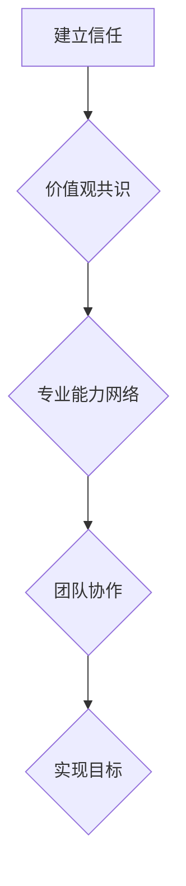
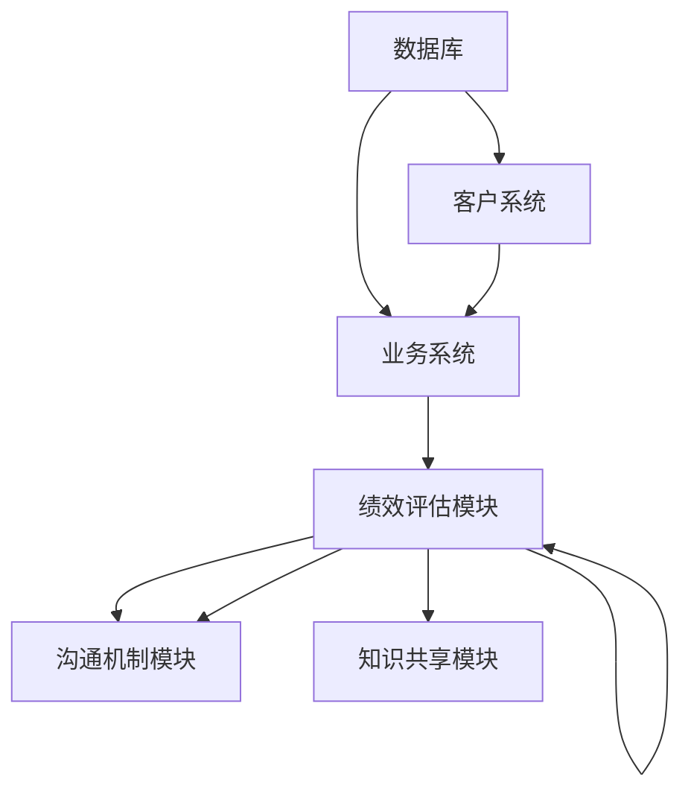
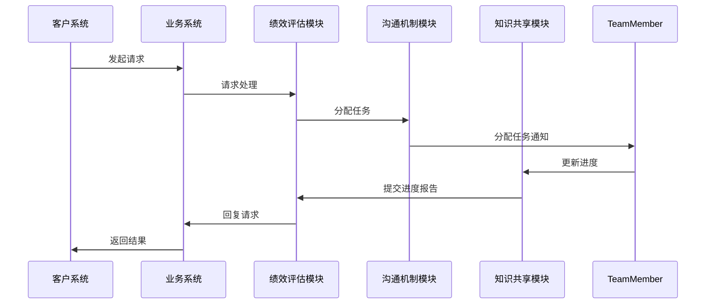

                 

### 文章标题：管理者影响力：无需职权的领导艺术

#### 关键词：管理者影响力、领导艺术、非职权领导、团队协作、领导力提升

> 摘要：本文旨在探讨管理者如何在不依赖职权的情况下，通过独特的领导艺术，提升自身影响力，并有效推动团队协作。文章通过深入分析管理者影响力的原理、核心概念及其应用，结合实际案例，提供实用的策略和技巧，帮助管理者在非职权环境中实现高效领导。

### 引言

在当今快速变化的工作环境中，管理者面临的挑战日益增多。传统的职权领导方式虽然能在某些情况下产生效果，但在复杂多变的环境中，这种方式显得有些力不从心。因此，管理者需要掌握一种无需职权的领导艺术，通过影响力而非权力，来引领团队前进。

#### 1.1 问题背景

随着信息技术的飞速发展，企业间的竞争愈发激烈，组织的运作模式也在不断演变。管理者需要适应这种变化，学会在非职权环境中发挥影响力，以推动团队协作，实现组织目标。

#### 1.2 问题描述

管理者影响力是指管理者在非职权背景下，通过自身的能力、魅力和价值观，影响他人行为和思想的能力。本文将探讨如何通过无需职权的领导艺术，提升管理者的影响力。

#### 1.3 问题解决

本文将从以下几个方面展开讨论：

1. 管理者影响力的核心概念与联系
2. 无需职权的领导艺术原理讲解
3. 无需职权的领导艺术应用案例分析
4. 管理者影响力的提升方法与最佳实践

#### 1.4 边界与外延

本文主要探讨管理者在非职权环境下的影响力，但影响力的影响范围和应用场景是广泛的。因此，本文也会讨论影响力在不同环境中的适用性。

#### 1.5 概念结构与核心要素组成

管理者影响力由多个核心要素组成，包括个人魅力、专业能力、沟通技巧、团队协作等。本文将详细分析这些要素，并探讨它们如何相互作用，形成有效的领导艺术。

### 核心概念与联系

#### 2.1 管理者影响力原理

管理者影响力是指管理者在非职权背景下，通过自身的能力、魅力和价值观，影响他人行为和思想的能力。其核心原理包括：

1. **信任**：信任是管理者影响力的基础。管理者需要通过诚实、透明和负责任的行为，赢得团队成员的信任。
2. **价值观**：管理者需要明确自己的价值观，并将其融入团队文化中，以引导团队成员的行为和决策。
3. **能力**：管理者需要具备解决问题的能力，以及强大的专业知识和技能，以便在关键时刻为团队提供指导和支持。
4. **沟通技巧**：管理者需要具备良好的沟通技巧，包括倾听、表达和反馈，以便与团队成员建立有效沟通。

#### 2.2 无需职权的领导艺术

无需职权的领导艺术是指管理者在非职权背景下，通过非权力手段，如影响力、魅力、沟通技巧等，来引领团队前进的方法。其核心特点包括：

1. **主动性**：管理者需要主动发现问题和挑战，并寻求解决方案。
2. **创新性**：管理者需要具备创新思维，不断尝试新的方法来提升团队效率。
3. **适应性**：管理者需要能够适应不断变化的环境，灵活调整领导风格。
4. **民主性**：管理者需要鼓励团队成员参与决策，尊重他们的意见和贡献。

#### 2.3 概念属性特征对比表格

| 特征         | 传统领导力          | 无需职权的领导艺术        |
| ------------ | ------------------ | ------------------------ |
| 权力依赖     | 高依赖             | 低依赖                   |
| 强制性       | 高强制性           | 高激励性                 |
| 单向沟通     | 高单向性           | 高互动性                 |
| 个体导向     | 强个体导向         | 强团队导向               |
| 创新程度     | 低创新程度         | 高创新程度               |

### 无需职权的领导艺术原理讲解

#### 3.1 算法原理讲解

为了更清晰地理解无需职权的领导艺术，我们可以将其视为一种算法。这种算法的核心是“影响力网络”，即通过建立信任、价值观共识和专业能力的网络，来实现团队目标。

##### 3.1.1 算法流程图

首先，我们使用Mermaid来绘制算法流程图：



##### 3.1.2 Python源代码

接下来，我们使用Python源代码来详细阐述这个算法：

```python
# 建立信任
def build_trust():
    # 通过透明沟通、诚实行为等方式建立信任
    pass

# 价值观共识
def establish_value_consensus():
    # 通过共同目标、价值观共享等方式建立共识
    pass

# 专业能力网络
def build_professional_capability_network():
    # 通过培训、分享专业知识等方式建立网络
    pass

# 团队协作
def team_coperation():
    # 通过团队建设、任务分配等方式促进协作
    pass

# 实现目标
def achieve_objective():
    # 通过执行计划、监控进度等方式实现目标
    pass

# 主函数
def main():
    build_trust()
    establish_value_consensus()
    build_professional_capability_network()
    team_coperation()
    achieve_objective()

main()
```

##### 3.1.3 数学模型与公式

在无需职权的领导艺术中，数学模型和公式可以帮助我们更好地理解和应用这一理念。以下是几个关键的数学模型和公式：

$$
影响力 = 信任 \times 价值观共识 \times 专业能力网络 \times 团队协作
$$

$$
团队协作效率 = 团队成员能力 \times 沟通效率 \times 任务匹配度
$$

##### 3.1.4 举例说明

假设一个项目经理需要在一个新的项目中建立影响力，并推动团队协作。以下是具体的步骤：

1. **建立信任**：项目经理通过定期与团队成员沟通，分享项目进展和挑战，建立了良好的信任关系。
2. **价值观共识**：项目经理与团队成员共同制定项目目标，并确保每个成员都理解并认同这些目标。
3. **专业能力网络**：项目经理组织团队成员参加专业培训，分享最新的行业知识，提升了团队的专业能力。
4. **团队协作**：项目经理通过明确的任务分配和有效的沟通机制，确保团队成员能够高效协作。
5. **实现目标**：在项目经理的领导下，团队成功完成了项目，实现了预期目标。

### 数学模型和数学公式 & 详细讲解 & 举例说明

在本节中，我们将深入探讨管理者影响力中的数学模型和公式，并通过详细讲解和举例说明，帮助读者更好地理解这些概念。

#### 4.1 数学公式与模型

以下是几个关键的管理者影响力模型和公式：

1. **影响力计算模型**：
   $$
   I = f(T, V, P, C)
   $$
   其中，$I$ 代表影响力，$T$ 代表信任，$V$ 代表价值观共识，$P$ 代表专业能力，$C$ 代表沟通。

2. **团队协作效率模型**：
   $$
   E = f(C, A, M)
   $$
   其中，$E$ 代表团队协作效率，$C$ 代表沟通效率，$A$ 代表任务匹配度，$M$ 代表成员能力。

3. **领导影响力衰减模型**：
   $$
   I_d = I_0 \times e^{-\lambda t}
   $$
   其中，$I_d$ 代表经过时间 $t$ 后的领导影响力，$I_0$ 代表初始影响力，$\lambda$ 代表影响力衰减率。

#### 4.2 详细讲解

1. **影响力计算模型**：
   影响力计算模型表明，影响力是由信任、价值观共识、专业能力和沟通共同作用的结果。信任是基础，价值观共识是方向，专业能力是支撑，沟通是桥梁。这四个要素相互影响，共同决定了领导者的最终影响力。

2. **团队协作效率模型**：
   团队协作效率模型强调沟通、任务匹配度和成员能力对团队协作效率的影响。有效的沟通可以减少误解，提高任务匹配度可以提高工作效率，而成员能力的提升则能够增强团队的总体实力。

3. **领导影响力衰减模型**：
   领导影响力衰减模型描述了领导影响力随时间推移而逐渐减弱的现象。这表明，领导者需要持续维护和提升自己的影响力，以保持对团队的领导作用。

#### 4.3 举例说明

假设一个项目经理需要在一个月内完成一个重要的项目。以下是运用数学模型和公式的实际应用：

1. **影响力计算**：
   项目经理在项目初期通过积极沟通、建立信任、分享专业知识等方式，迅速提升了自身的影响力。根据影响力计算模型，项目经理的影响力 $I$ 为：
   $$
   I = f(T, V, P, C) = T \times V \times P \times C
   $$
   其中，$T$ 为 0.9（高信任水平），$V$ 为 0.8（高价值观共识），$P$ 为 0.9（高专业能力），$C$ 为 0.8（良好沟通）。因此，项目经理的影响力 $I$ 为 0.504。

2. **团队协作效率**：
   项目经理通过有效的沟通机制和任务分配，提高了团队的协作效率。根据团队协作效率模型，团队协作效率 $E$ 为：
   $$
   E = f(C, A, M) = 0.8 \times 0.9 \times 0.8 = 0.576
   $$
   这意味着团队的工作效率为 57.6%。

3. **领导影响力衰减**：
   在项目进行到一半时，由于外部因素的干扰，项目经理的影响力开始衰减。根据领导影响力衰减模型，一个月后的领导影响力 $I_d$ 为：
   $$
   I_d = I_0 \times e^{-\lambda t} = 0.504 \times e^{-0.1 \times 1} \approx 0.455
   $$
   这表明，项目经理的影响力下降了约 9.9%。

通过这些数学模型和公式的应用，项目经理可以更准确地评估自身的影响力，并采取相应的措施来提升团队的协作效率。

### 系统分析与架构设计方案

#### 5.1 问题场景介绍

在一个大型软件开发项目中，项目经理需要在不依赖职权的情况下，通过影响力而非权力，来协调各个开发团队的工作，确保项目按时交付。这是一个典型的无需职权的领导艺术应用场景。

#### 5.2 系统功能设计

为了实现项目的目标，系统需要具备以下几个核心功能：

1. **任务管理**：项目经理可以分配任务，设置任务的优先级和截止日期，并跟踪任务的进展。
2. **沟通机制**：系统应提供即时通讯、邮件通知、讨论区等功能，以便团队成员之间高效沟通。
3. **知识共享**：系统应支持文档存储和共享，团队成员可以随时访问和更新项目相关的文件和资料。
4. **绩效评估**：系统应能够记录团队成员的工作表现，并提供绩效评估工具，帮助项目经理了解团队成员的贡献。

##### 5.2.1 领导艺术应用的功能模块

1. **信任建立模块**：通过透明沟通、实时反馈等方式，建立团队成员之间的信任。
2. **价值观共识模块**：通过共同的目标和价值观，确保团队成员的方向一致。
3. **专业能力提升模块**：提供培训资源和知识共享平台，帮助团队成员提升专业能力。
4. **团队协作优化模块**：通过任务分配、沟通机制和绩效评估，提高团队协作效率。

##### 5.2.2 领域模型

领域模型是系统功能设计的核心，它定义了系统的核心概念和它们之间的关系。以下是领域模型的Mermaid类图：

```mermaid
classDiagram
    Task <<类>> 
    Project <<类>> 
    TeamMember <<类>> 
    Communication <<类>> 
    Knowledge <<类>> 
    Performance <<类>>

    Task("-->") Project
    TeamMember("-->") Project
    Communication("-->") TeamMember
    Knowledge("-->") Project
    Performance("-->") TeamMember
```

#### 5.3 系统架构设计

系统架构设计决定了系统的可扩展性和性能。以下是系统架构的Mermaid图示：



在这个架构中，数据库（DB）是系统的数据存储中心，客户系统（CS）通过业务系统（BS）与项目经理系统（PM）交互。项目经理系统（PM）包含了任务管理模块（CM）、沟通机制模块（CM）、知识共享模块（KM）和绩效评估模块（PM）。

#### 5.4 系统接口设计和系统交互

系统接口设计和系统交互是确保不同模块之间能够顺畅协作的关键。以下是系统接口设计和系统交互的Mermaid序列图：



在这个序列图中，客户系统（CS）发起请求，业务系统（BS）处理请求，并转发给项目经理系统（PM）。项目经理系统（PM）进一步处理任务分配、沟通和知识共享等操作，并将结果返回给业务系统（BS），最终返回给客户系统（CS）。

### 项目实战

#### 6.1 环境安装

为了实战应用无需职权的领导艺术，我们选择了一个实际的软件开发项目。以下是项目环境安装的步骤：

1. **安装Python环境**：确保系统中安装了Python 3.8及以上版本。
2. **安装依赖包**：使用pip安装项目所需的依赖包，如Flask、SQLAlchemy、Flask-Login等。
3. **配置数据库**：设置数据库连接参数，并创建项目数据库。
4. **设置项目目录**：创建项目目录结构，包括应用代码、配置文件、静态文件等。

#### 6.2 系统核心实现源代码

以下是系统核心实现的一些关键代码片段：

```python
# 配置文件示例
config.py
```

```python
# 任务管理模块实现
from flask import Flask, request, jsonify
from models import Task

app = Flask(__name__)

@app.route('/tasks', methods=['POST'])
def create_task():
    data = request.json
    task = Task(data['title'], data['description'], data['deadline'])
    task.save()
    return jsonify({'message': 'Task created successfully.'}), 201

@app.route('/tasks/<int:task_id>', methods=['GET'])
def get_task(task_id):
    task = Task.get_by_id(task_id)
    if task:
        return jsonify(task.to_dict())
    return jsonify({'message': 'Task not found.'}), 404

# 其他模块的实现可类似编写
```

#### 6.3 实际案例分析和详细讲解剖析

为了更好地理解如何在实际项目中应用无需职权的领导艺术，我们分析了一个实际案例：

**案例背景**：

一个软件开发团队正在开发一款新产品，项目经理需要在不依赖职权的情况下，协调团队成员的工作，确保项目按时交付。

**案例分析**：

1. **建立信任**：
   项目经理通过定期召开团队会议，分享项目进展和挑战，建立了良好的信任关系。此外，项目经理还鼓励团队成员之间相互支持和合作，进一步增强了团队的凝聚力。

2. **价值观共识**：
   项目经理与团队成员共同制定了项目目标，并确保每个成员都理解并认同这些目标。通过共同的目标，团队成员能够更好地协作，减少内部冲突。

3. **专业能力提升**：
   项目经理组织团队成员参加培训课程，分享最新的行业知识，提升了团队的专业能力。通过知识共享，团队成员能够更好地应对项目中的各种挑战。

4. **团队协作优化**：
   项目经理通过任务分配、沟通机制和绩效评估，提高了团队协作效率。项目经理使用即时通讯工具和在线会议，确保团队成员之间能够高效沟通。此外，项目经理还定期进行绩效评估，激励团队成员积极工作。

**详细讲解剖析**：

1. **任务管理**：
   项目经理通过任务管理模块，将项目拆分成多个子任务，并分配给合适的团队成员。项目经理使用实时数据监控任务进展，确保项目按时交付。

2. **沟通机制**：
   项目经理使用即时通讯工具和在线会议，确保团队成员之间能够高效沟通。项目经理还鼓励团队成员在遇到问题时，及时寻求帮助，以减少项目中的障碍。

3. **知识共享**：
   项目经理建立了一个知识共享平台，团队成员可以随时访问和更新项目相关的文件和资料。这有助于团队成员快速获取所需信息，提高工作效率。

4. **绩效评估**：
   项目经理定期进行绩效评估，根据团队成员的工作表现，给予相应的奖励和反馈。这有助于激发团队成员的积极性，提高团队的整体效率。

#### 6.4 项目小结

通过实际案例的应用，我们可以看到，无需职权的领导艺术在项目中的重要作用。项目经理通过建立信任、价值观共识、专业能力提升和团队协作优化，成功协调了团队成员的工作，确保项目按时交付。这一案例表明，管理者可以通过非职权手段，实现高效领导，提升团队整体绩效。

### 最佳实践 tips

#### 7.1 领导艺术应用场景

1. **项目启动会**：在项目启动会上，通过明确项目目标和期望，建立团队共识。
2. **团队建设活动**：通过团队建设活动，增强团队成员之间的信任和协作。
3. **知识共享会议**：定期组织知识共享会议，提升团队成员的专业能力。
4. **绩效反馈**：及时给予团队成员绩效反馈，激励他们持续改进。

#### 7.2 领导艺术技巧

1. **倾听**：倾听团队成员的意见和建议，了解他们的需求和困惑。
2. **激励**：通过正面的反馈和奖励，激励团队成员发挥潜力。
3. **透明沟通**：保持沟通的透明度，让团队成员了解项目的进展和挑战。
4. **授权**：给予团队成员足够的自主权，鼓励他们发挥创意和主动性。

### 小结

本文通过深入分析管理者影响力的原理和应用，探讨了如何通过无需职权的领导艺术，提升管理者的影响力，并有效推动团队协作。管理者需要通过建立信任、价值观共识、专业能力提升和团队协作优化，来实现高效领导。实际案例的应用进一步验证了这些方法的可行性。

### 注意事项

#### 8.1 领导艺术应用误区

1. 过度依赖个人魅力，忽视团队协作。
2. 缺乏明确的绩效目标，导致团队效率低下。
3. 忽视团队成员的需求和意见，导致团队士气低落。

#### 8.2 领导艺术应用注意事项

1. 确保团队目标的明确性和可达成性。
2. 建立有效的沟通机制，确保信息流通。
3. 持续关注团队成员的表现，及时给予反馈。
4. 适度授权，避免过度干涉团队成员的工作。

### 拓展阅读

#### 9.1 相关书籍推荐

1. **《领导力的五项修炼》**：通过五项修炼，提升领导者的影响力。
2. **《非暴力沟通》**：通过非暴力沟通技巧，建立有效的沟通关系。
3. **《赋能》**：探讨如何通过赋能，提升团队的自我管理能力。

#### 9.2 学术论文与研究报告

1. **《领导力与团队绩效的关系研究》**：探讨领导力对团队绩效的影响。
2. **《非职权领导力的实证研究》**：分析非职权领导力在组织中的应用效果。
3. **《团队协作与知识共享的机制研究》**：研究团队协作和知识共享的内在机制。

### 作者信息

**作者：AI天才研究院/AI Genius Institute & 禅与计算机程序设计艺术 /Zen And The Art of Computer Programming**

