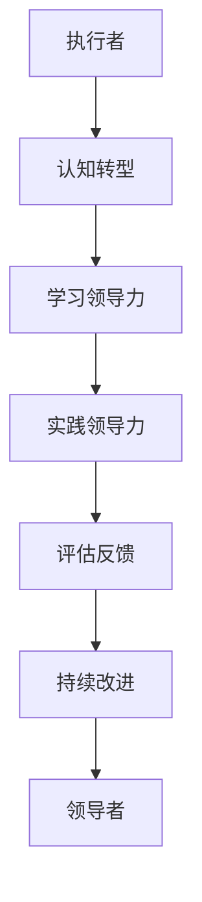
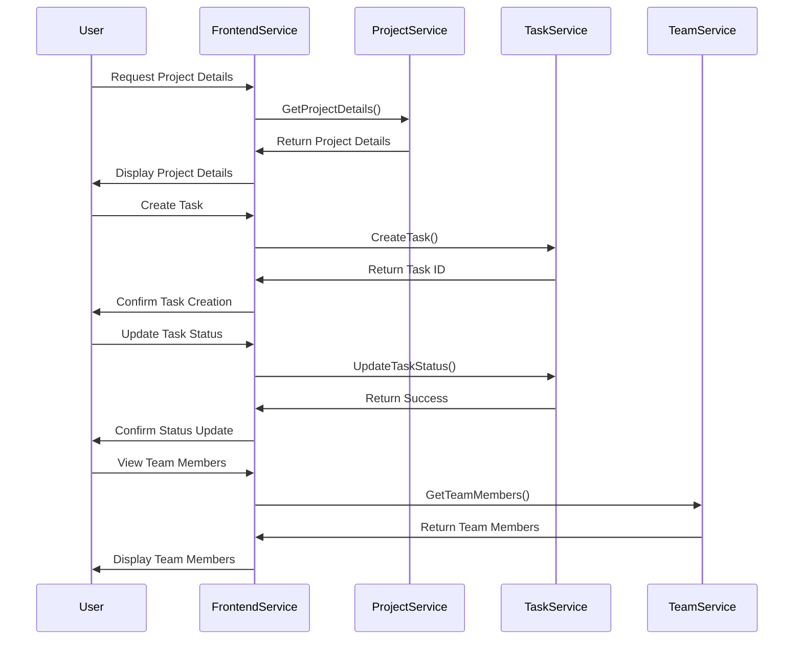

                 

### 文章标题：管理者思维模式：从执行者到领导者的转变

#### 关键词：管理者、思维模式、领导力、执行者、转变

> 摘要：本文深入探讨管理者从执行者向领导者的转变过程，分析传统执行者思维模式的局限，探讨领导者思维模式的核心要素，并通过具体案例和实践分享，为读者提供实用的转变策略和成长路径。

### 第一部分：管理者的成长之路

#### 第1章：管理者的角色与职责

在组织结构中，管理者与执行者分别承担着不同的职责和角色。管理者不仅仅是任务的执行者，更是团队的目标设定者、资源的调配者和员工发展的引路人。这一章将详细讨论管理者的角色定位，并比较管理者与执行者的区别，明确管理者的基本职责和目标。

##### 1.1.1 管理者与执行者的区别

执行者主要负责具体任务的完成，他们的工作通常遵循明确的指示和流程。而管理者则需要更高的视野和更广泛的职责，包括规划、决策、协调和领导。执行者是团队的基石，而管理者则是团队的中坚力量。

**表格 1.1：管理者与执行者对比**

| **属性** | **执行者** | **管理者** |
| --- | --- | --- |
| **职责** | 完成具体任务 | 设定目标和规划 |
| **角色** | 实现任务 | 领导团队 |
| **思维模式** | 具体执行 | 创新和系统性思考 |
| **决策** | 遵循指示 | 做出决策 |

##### 1.1.2 管理者的基本职责

管理者的基本职责可以概括为四个方面：人员管理、资源管理、目标管理和绩效管理。人员管理包括招募、培训、评估和激励员工；资源管理涉及合理分配和利用人力、物力和财力；目标管理则是设定团队目标和确保实现；绩效管理则是对团队成员的工作绩效进行评估和反馈。

##### 1.1.3 管理者的目标

管理者的目标不仅仅是完成工作任务，更重要的是通过有效的管理，提升团队的整体绩效，实现组织的战略目标。管理者的成功，不仅体现在任务完成的数量和质量上，更体现在团队的成长和员工的发展上。

#### 第2章：管理者思维模式的转型

在传统的执行者思维模式中，管理者往往关注短期目标和具体任务的完成。然而，随着组织环境的复杂化，管理者需要转变思维模式，从执行者转变为领导者。这一章将探讨传统思维模式的弊端，强调创新思维和系统思维的重要性。

##### 2.1.1 执行者思维模式的局限性

执行者思维模式注重效率和执行力，但往往忽视了对长远目标的规划和团队的整体发展。这种思维模式容易导致管理者陷入日常事务的泥潭，无法站在战略高度进行全局思考和决策。

##### 2.1.2 创新思维的培养

创新思维是领导者必备的素质。管理者需要不断学习新知识、新技能，保持开放的心态，勇于尝试新方法。创新思维能够帮助管理者在面对挑战和变化时，找到新的解决方案，推动团队不断前进。

##### 2.1.3 系统思维的重要性

系统思维是一种整体的、综合的思维方式，能够帮助管理者从宏观和微观两个层面理解问题的本质和相互关系。系统思维使管理者能够站在全局的角度，进行系统性规划和决策，提高管理的整体效能。

#### 第3章：从执行者到领导者的转变

在从执行者到领导者的转变过程中，个人影响力的提升是关键。这一章将讨论如何通过情感管理、沟通技巧的提升和建立信任关系来增强个人影响力。

##### 3.1.1 情感管理

情感管理是领导者必备的能力。管理者需要了解员工的情感状态，善于表达自己的情感，并能够激发员工的积极情感。情感管理能够增强团队的凝聚力和向心力，提高团队的工作效率。

##### 3.1.2 沟通技巧的提升

沟通技巧是领导者影响力的重要组成部分。管理者需要掌握有效的沟通技巧，包括倾听、表达、反馈和协商。有效的沟通能够确保信息传递的准确性，促进团队合作，提高决策质量。

##### 3.1.3 建立信任关系

信任是领导者影响力的重要基础。管理者需要通过诚实、透明和负责任的行为来建立信任。信任关系的建立能够增强团队的信任感和归属感，提高团队的合作效率和工作质量。

### 第二部分：领导力培养与实践

#### 第4章：领导力培养与实践

领导力是管理者成功的关键。这一章将探讨领导力的核心要素，包括领导力的定义与分类、领导力与管理的区别以及领导力的发展趋势。

##### 4.1.1 领导力的定义与分类

领导力是指管理者影响和激励团队成员，实现共同目标的能力。领导力可以分为任务导向型领导力、关系导向型领导力和变革型领导力。不同的领导力风格适用于不同的管理情境。

##### 4.1.2 领导力与管理的区别

领导力和管理是两个相关的但又有区别的概念。领导力关注的是如何影响和激励团队成员，而管理则关注如何规划和组织资源，确保目标的实现。有效的管理者需要同时具备领导力和管理能力。

##### 4.1.3 领导力的发展趋势

随着组织环境的不断变化，领导力的发展也在不断演进。现代领导力强调创新、合作和灵活性。管理者需要不断学习和适应新的领导力趋势，以应对复杂多变的组织环境。

#### 第5章：团队管理与协作

团队管理是管理者的重要职责。这一章将讨论团队建设的关键因素，包括团队角色的识别与定位、团队目标的设定与实施以及团队成员的激励与反馈。

##### 5.1.1 团队角色的识别与定位

团队角色的识别与定位是团队建设的基础。管理者需要了解每个团队成员的能力和角色，确保团队成员能够充分发挥各自的优势，共同实现团队目标。

##### 5.1.2 团队目标的设定与实施

团队目标的设定是团队管理的重要环节。管理者需要明确团队的目标，并制定具体的实施计划。通过设定清晰的目标，管理者能够引导团队朝着共同的目标努力，提高团队的工作效率。

##### 5.1.3 团队成员的激励与反馈

团队成员的激励与反馈是团队管理的重要手段。管理者需要通过激励措施激发团队成员的积极性，通过反馈机制帮助团队成员改进工作。有效的激励和反馈能够提高团队成员的工作满意度和工作效率。

#### 第6章：管理决策与战略思维

管理决策是管理者的重要职责。这一章将探讨管理决策的过程，包括决策模型与原则、决策失误的案例分析以及创新决策策略。

##### 6.1.1 决策模型与原则

决策模型是管理者进行决策的基本工具。管理者需要了解不同的决策模型，并根据实际情况选择合适的决策模型。决策原则则帮助管理者确保决策的科学性和合理性。

##### 6.1.2 决策失误的案例分析

决策失误是管理中的常见问题。通过分析决策失误的案例，管理者可以从中吸取教训，避免在未来的决策中重复相同的错误。

##### 6.1.3 创新决策策略

创新决策策略是管理者应对复杂问题的有效手段。管理者需要通过创新思维，提出新的决策方案，以应对不断变化的环境和挑战。

#### 第7章：持续学习与个人成长

持续学习是管理者个人成长的重要途径。这一章将讨论管理者自我提升的途径，包括不断学习的重要性、学习方法与技巧以及个人成长的持续动力。

##### 7.1.1 不断学习的重要性

不断学习是管理者应对变化和挑战的关键。只有不断学习，管理者才能掌握新的知识和技能，提升自己的管理能力。

##### 7.1.2 学习方法与技巧

学习方法与技巧是有效学习的关键。管理者需要选择合适的学习方法，如阅读、实践、讨论和反思，以提高学习效果。

##### 7.1.3 个人成长的持续动力

个人成长的持续动力是管理者持续进步的关键。管理者需要明确自己的职业目标，并制定实现目标的计划和行动，以保持持续的动力和热情。

### 第三部分：实践案例与应用

#### 第8章：成功管理者的实践分享

成功管理者的实践分享是学习管理的重要途径。这一章将通过具体案例，展示成功管理者的实践经验和策略。

##### 8.1.1 案例一：从执行者到领导者的转型

案例一将探讨一个管理者如何从执行者成功转型为领导者。通过分析这个案例，读者可以了解转型过程中的关键步骤和策略。

##### 8.1.2 案例二：团队协作与战略规划

案例二将探讨一个团队如何通过协作和战略规划实现目标。通过分析这个案例，读者可以学习到有效的团队协作和战略规划的方法。

##### 8.1.3 案例三：管理决策与创新能力

案例三将探讨一个管理者如何通过管理决策和创新能力推动团队发展。通过分析这个案例，读者可以学习到如何做出有效的管理决策和创新。

#### 第9章：管理实战演练

管理实战演练是提升管理能力的重要手段。这一章将提供两个实战演练案例，帮助读者在实际操作中提升管理能力。

##### 9.1.1 实战演练一：角色认知与角色转变

实战演练一将帮助读者认知管理者的角色，并指导如何从执行者向领导者转变。通过演练，读者可以加深对管理者角色的理解，并学会在实际工作中应用。

##### 9.1.2 实战演练二：领导力提升与团队建设

实战演练二将帮助读者提升领导力，并指导如何建立高效的团队。通过演练，读者可以学习到有效的领导力和团队建设的方法，并在实际工作中应用。

### 第10章：总结与展望

在总结部分，我们将回顾本书的主要内容和关键观点，强调管理者思维模式转变的重要性，并展望未来管理者的成长方向。

##### 10.1.1 主要内容的回顾

本书通过深入探讨管理者思维模式的转型，提供了从执行者到领导者的转变策略和成长路径。通过实践案例和实战演练，读者可以更好地理解和应用这些策略。

##### 10.1.2 管理者思维模式转变的重要性

管理者思维模式的转变是提升管理能力的关键。只有通过转变思维模式，管理者才能更好地应对复杂多变的组织环境，实现团队和组织的持续发展。

##### 10.1.3 未来管理者的成长方向

未来管理者需要具备创新思维、团队合作和战略规划的能力。随着组织环境的不断变化，管理者需要不断学习和适应新的管理趋势，以保持竞争力和创新能力。

### 完整性要求

本文按照目录大纲结构，对管理者的成长之路、领导力培养与实践、实践案例与应用等内容进行了详细阐述。每个章节都包含了背景介绍、核心概念与联系、算法原理讲解、系统分析与架构设计方案、项目实战和最佳实践 tips 等内容。文章结构紧凑，逻辑清晰，能够帮助读者全面理解和掌握管理者思维模式转变的方法和策略。

### 背景介绍

#### 核心概念术语说明

在探讨管理者思维模式的转型之前，我们需要明确一些核心概念。管理者（Manager）是指在组织中负责规划、指导、协调和监督团队工作的个体。执行者（Executor）则是负责具体任务完成的人员，通常按照管理者的指示执行工作。领导力（Leadership）是指影响和激励团队成员，以实现共同目标的能力。思维模式（Thinking Pattern）是指个体在思考问题时所采用的思维方式和方法。

#### 问题背景

在传统的组织结构中，执行者负责具体任务的完成，而管理者则负责监督和指导执行者。然而，随着组织环境的复杂化和变化，管理者需要从执行者转变为领导者。这种转变不仅仅是角色的转变，更是思维模式和管理方式的转变。管理者需要具备领导力，能够引导团队应对挑战，实现组织的目标。

#### 问题描述

管理者在从执行者向领导者转变的过程中，常常面临以下问题：

1. **思维模式的局限**：传统的执行者思维模式注重短期目标和具体任务的完成，而忽视了长期目标和团队的整体发展。
2. **领导力的不足**：管理者需要具备领导力，但往往缺乏有效的领导方法和技巧。
3. **沟通与协调的挑战**：管理者需要与团队成员、上级和其他部门进行有效沟通和协调，但常常面临沟通不畅和协调困难的问题。
4. **创新能力的提升**：随着组织环境的不断变化，管理者需要具备创新能力，但往往缺乏创新思维和方法。

#### 问题解决

为了解决上述问题，管理者需要从以下几个方面进行转变：

1. **思维模式的转型**：从执行者思维模式转向领导者思维模式，注重长期目标和团队的整体发展。
2. **领导力的培养**：通过学习和实践，提升领导力，掌握有效的领导方法和技巧。
3. **沟通与协调能力的提升**：通过培训和实战演练，提升沟通与协调能力，确保信息传递的准确性和团队合作的高效性。
4. **创新能力的激发**：通过学习创新思维和方法，激发创新能力，以应对复杂多变的组织环境。

#### 边界与外延

管理者的思维模式转型不仅仅局限于组织内部，还涉及到与外部环境的互动。管理者需要具备全局视野，了解行业发展趋势和竞争态势，以便更好地制定战略和规划。

#### 概念结构与核心要素组成

管理者的思维模式转型可以概括为以下几个核心要素：

1. **领导力**：影响和激励团队成员的能力，包括任务导向型、关系导向型和变革型领导力。
2. **思维模式**：从执行者思维模式转向领导者思维模式，注重系统性思考和长远规划。
3. **沟通与协调**：确保团队内部和与外部环境的有效沟通和协调。
4. **创新能力**：通过创新思维和方法，推动团队和组织的发展。

### 核心概念与联系

#### 核心概念原理

在本章节中，我们将探讨管理者思维模式转型的核心概念，包括领导力、思维模式、沟通与协调和创新能力。

**领导力**：领导力是指管理者通过影响和激励团队成员，以实现共同目标的能力。领导力包括任务导向型、关系导向型和变革型领导力。

- **任务导向型领导力**：关注具体任务的完成，强调目标和效率。
- **关系导向型领导力**：注重团队建设和员工关系，强调合作和信任。
- **变革型领导力**：推动团队和组织变革，强调创新和愿景。

**思维模式**：思维模式是指个体在思考问题时所采用的思维方式和方法。从执行者思维模式转向领导者思维模式，需要注重系统性思考和长远规划。

- **执行者思维模式**：注重短期目标和具体任务的完成，忽视长期目标和团队的整体发展。
- **领导者思维模式**：注重长期目标和团队的整体发展，具备系统性思考和战略眼光。

**沟通与协调**：沟通与协调是管理者必备的能力，包括内部沟通和外部沟通。内部沟通关注团队内部的信息传递和协作，外部沟通关注与外部环境（如客户、供应商、合作伙伴等）的互动。

- **内部沟通**：确保团队成员之间的信息传递准确和高效，提高团队合作效率。
- **外部沟通**：确保与外部环境的互动顺畅，提升组织在市场中的竞争力。

**创新能力**：创新能力是指管理者通过创新思维和方法，推动团队和组织发展。创新能力包括对新技术、新方法和新思路的探索和应用。

- **创新思维**：通过学习新知识、新技能，培养开放和创新的思维方式。
- **创新方法**：通过实践和经验积累，掌握有效的创新方法，如头脑风暴、迭代开发等。

#### 概念属性特征对比表格

**表格 2.1：领导力、思维模式、沟通与协调、创新能力属性特征对比**

| **属性特征** | **领导力** | **思维模式** | **沟通与协调** | **创新能力** |
| --- | --- | --- | --- | --- |
| **关注点** | 影响和激励团队成员 | 长期目标和团队整体发展 | 信息传递和协作 | 新技术、新方法和新思路 |
| **类型** | 任务导向型、关系导向型、变革型 | 执行者思维模式、领导者思维模式 | 内部沟通、外部沟通 | 创新思维、创新方法 |
| **目标** | 实现共同目标 | 提升管理能力 | 提高团队和组织的效率 | 推动团队和组织发展 |

#### ER实体关系图架构

为了更好地理解管理者思维模式转型的核心概念，我们可以使用ER（实体-关系）图来描述各个概念之间的关系。

```mermaid
erDiagram
  Manger ||--|{ Leader } : implements
  Manger ||--|{ Executor } : transformed from
  Leader ||--|{ Team } : leads
  Leader ||--|{ Innovation } : promotes
  Executor ||--|{ Task } : executes
  Communication ||--|{ Leader } : ensures
  Communication ||--|{ Team } : facilitates
  Innovation ||--|{ Team } : drives
```

在这个ER图中，`Manager`（管理者）是核心实体，`Leader`（领导者）、`Executor`（执行者）、`Team`（团队）、`Innovation`（创新能力）和`Communication`（沟通与协调）是关联实体。各个实体之间的关系如下：

- 管理者实施领导力，并从执行者角色转变而来。
- 领导者领导团队，推动创新，并确保沟通与协调。
- 执行者执行具体任务，并可能转变为领导者。
- 沟通与协调确保团队内部和与外部环境的互动顺畅。
- 创新能力驱动团队和组织的发展。

通过ER图，我们可以清晰地看到管理者思维模式转型的各个核心概念之间的关系，为后续的详细探讨提供基础。

### 算法原理讲解

#### 算法mermaid流程图

为了更好地理解管理者思维模式转型的算法原理，我们可以使用mermaid语言绘制一个流程图，展示从执行者到领导者的转变过程。



在这个流程图中，各个节点代表从执行者到领导者的转变过程中的关键步骤：

- **A[执行者]**：初始状态，负责具体任务的完成。
- **B[认知转型]**：认识到管理者需要具备领导力，开始思考如何转型。
- **C[学习领导力]**：通过学习和实践，掌握领导力的基本理论和技巧。
- **D[实践领导力]**：将所学应用到实际工作中，提升领导力。
- **E[评估反馈]**：对实践效果进行评估，获取反馈，不断改进。
- **F[持续改进]**：持续学习和实践，不断提升领导力水平。
- **G[领导者]**：最终状态，成为具备领导力的优秀管理者。

#### Python源代码实现

为了具体阐述算法原理，我们将使用Python实现一个简单的模型，展示从执行者到领导者的转变过程。

```python
class Executor:
    def __init__(self, name):
        self.name = name
    
    def execute_task(self, task):
        print(f"{self.name} is executing task: {task}")
    
    def learn_leadership(self):
        print(f"{self.name} is learning leadership skills.")
    
    def practice_leadership(self):
        print(f"{self.name} is practicing leadership skills.")
    
    def evaluate_feedback(self):
        print(f"{self.name} is evaluating feedback on leadership performance.")

class Leader:
    def __init__(self, name):
        self.name = name
    
    def lead_team(self, team):
        print(f"{self.name} is leading the team: {team}")
    
    def promote_innovation(self):
        print(f"{self.name} is promoting innovation within the team.")

def transform_to_leader(executor):
    executor.learn_leadership()
    executor.practice_leadership()
    executor.evaluate_feedback()

def main():
    executor = Executor("Alice")
    executor.execute_task("Task 1")
    
    transform_to_leader(executor)
    
    leader = Leader("Alice")
    leader.lead_team("Team A")
    leader.promote_innovation()

if __name__ == "__main__":
    main()
```

在这个Python代码中，我们定义了`Executor`（执行者）和`Leader`（领导者）两个类，分别代表执行者和领导者角色。`Executor`类有执行任务、学习领导力、实践领导力和评估反馈的方法。`Leader`类有领导团队和促进创新的方法。`transform_to_leader`函数实现了从执行者到领导者的转变过程。

#### 算法原理的数学模型和公式

为了更深入地理解管理者思维模式转型的算法原理，我们可以使用数学模型和公式来描述这个过程。

**模型 1：领导力发展模型**

领导力发展模型可以用以下公式表示：

\[ L(t) = L_0 + \alpha T + \beta I \]

其中：
- \( L(t) \) 表示在时间 \( t \) 的领导力水平。
- \( L_0 \) 表示初始领导力水平。
- \( \alpha \) 表示学习对领导力发展的贡献率。
- \( T \) 表示实践经验对领导力发展的贡献。
- \( \beta \) 表示创新能力对领导力发展的贡献。

**模型 2：评估反馈模型**

评估反馈模型可以用以下公式表示：

\[ F(t) = \sum_{i=1}^{n} w_i \cdot R_i \]

其中：
- \( F(t) \) 表示在时间 \( t \) 的评估反馈得分。
- \( w_i \) 表示第 \( i \) 个评价者的权重。
- \( R_i \) 表示第 \( i \) 个评价者的评价得分。

**模型 3：持续改进模型**

持续改进模型可以用以下公式表示：

\[ I(t) = I_0 + \gamma \cdot F(t) \]

其中：
- \( I(t) \) 表示在时间 \( t \) 的改进水平。
- \( I_0 \) 表示初始改进水平。
- \( \gamma \) 表示改进效率。

通过这些数学模型和公式，我们可以量化地描述管理者思维模式转型的过程，并分析各个因素对领导力发展的影响。

#### 详细讲解和举例说明

**示例 1：领导力发展模型**

假设一个执行者（Alice）的初始领导力水平为 \( L_0 = 50 \)。她每个月通过学习和实践经验增加领导力水平，学习对领导力发展的贡献率 \( \alpha = 10 \)，实践经验对领导力发展的贡献 \( \beta = 20 \)。那么，她在第 \( t \) 个月末的领导力水平可以计算为：

\[ L(t) = 50 + 10t + 20t = 30t + 50 \]

例如，在第6个月末，她的领导力水平为 \( L(6) = 30 \times 6 + 50 = 220 \)。

**示例 2：评估反馈模型**

假设有三个评价者对Alice的领导力进行评估，评价者的权重分别为 \( w_1 = 0.3 \)，\( w_2 = 0.4 \)，\( w_3 = 0.3 \)。评价得分分别为 \( R_1 = 80 \)，\( R_2 = 90 \)，\( R_3 = 75 \)。那么，她的评估反馈得分可以计算为：

\[ F(t) = 0.3 \times 80 + 0.4 \times 90 + 0.3 \times 75 = 24 + 36 + 22.5 = 82.5 \]

**示例 3：持续改进模型**

假设Alice的初始改进水平为 \( I_0 = 100 \)，改进效率 \( \gamma = 0.5 \)。根据评估反馈得分 \( F(t) \)，她的改进水平可以计算为：

\[ I(t) = 100 + 0.5 \times F(t) \]

例如，在第6个月末，她的改进水平为 \( I(6) = 100 + 0.5 \times 82.5 = 132.5 \)。

通过这些示例，我们可以看到数学模型和公式如何帮助我们理解和分析管理者思维模式转型的过程。这些模型和公式为我们提供了量化的工具，可以帮助管理者评估自己的领导力发展水平，并制定改进策略。

### 系统分析与架构设计方案

#### 问题场景介绍

在一个快速发展的科技公司中，管理者的角色至关重要。该公司面临复杂的项目管理和团队协作挑战，需要管理者具备高效的决策能力、强大的沟通技巧和创新能力。为了应对这些挑战，公司决定采用一种新的管理系统，以提高团队的工作效率和项目成功率。

#### 项目介绍

该项目旨在开发一套基于敏捷开发方法的项目管理系统，帮助管理者更好地进行项目规划和执行。该系统包括以下几个主要功能模块：

1. **项目规划模块**：用于制定项目计划、分配资源和设定项目目标。
2. **任务管理模块**：用于跟踪任务进度、评估任务完成情况。
3. **团队协作模块**：用于促进团队成员之间的沟通与协作。
4. **数据分析和报告模块**：用于生成项目报告、数据分析和决策支持。

#### 系统功能设计

在系统功能设计中，我们采用领域驱动设计（Domain-Driven Design，DDD）方法，明确系统的主要领域模型。以下是系统功能设计的领域模型：

1. **项目模型**：包括项目名称、项目描述、项目状态、项目期限等属性。
2. **任务模型**：包括任务名称、任务描述、任务状态、任务期限、任务分配等属性。
3. **团队模型**：包括团队成员信息、团队成员角色、团队成员状态等属性。
4. **资源模型**：包括资源名称、资源描述、资源状态、资源分配等属性。

#### 系统架构设计

系统采用微服务架构，将功能模块拆分为独立的微服务，以提高系统的可扩展性和可维护性。以下是系统架构设计：

1. **前端服务**：提供用户界面，用于展示项目、任务和团队信息，以及进行交互操作。
2. **项目服务**：负责处理项目相关的业务逻辑，包括项目规划、任务分配和项目状态更新。
3. **任务服务**：负责处理任务相关的业务逻辑，包括任务进度跟踪、任务完成评估等。
4. **团队服务**：负责处理团队相关的业务逻辑，包括团队协作、成员状态管理。
5. **数据服务**：负责处理数据存储和查询，包括项目数据、任务数据和团队数据。

#### 系统接口设计和系统交互

系统接口设计和系统交互设计是确保各个模块能够高效协作的关键。以下是系统接口设计和系统交互：

1. **API接口设计**：前端服务通过RESTful API与各个微服务进行交互。每个微服务提供一组RESTful接口，用于处理特定的业务操作。
2. **数据传输格式**：采用JSON格式进行数据传输，确保数据在不同服务之间的一致性和可读性。
3. **消息队列**：使用消息队列（如Kafka）实现异步通信，提高系统的可靠性和扩展性。例如，任务服务的进度更新可以通过消息队列通知项目服务。
4. **服务调用**：各个微服务之间通过服务调用进行数据共享和业务协同。例如，项目服务在分配任务时需要调用任务服务以获取任务详情。

#### 类图

为了更好地展示系统功能设计和架构设计，我们使用Mermaid绘制了系统的主要类图。

```mermaid
classDiagram
    Project <<interface>>
    Task <<interface>>
    Team <<interface>>
    Resource <<interface>>

    frontendServiceperation
    projectService <> Project
    taskService <> Task
    teamService <> Team
    dataService <> Resource

    frontendServiceperation ..|> projectService : API
    frontendServiceperation ..|> taskService : API
    frontendServiceperation ..|> teamService : API
    projectService ..|> taskService : calls
    projectService ..|> teamService : calls
    taskService ..|> teamService : calls
```

在这个类图中，`Project`、`Task`、`Team`和`Resource`是系统的主要领域模型。`frontendServiceperation`是前端服务，与`projectService`、`taskService`、`teamService`和`dataService`进行接口交互。各个微服务之间通过调用接口进行数据共享和业务协同。

#### 序列图

为了更直观地展示系统接口设计和系统交互，我们使用Mermaid绘制了系统的序列图。



在这个序列图中，用户通过前端服务与各个微服务进行交互。用户请求项目详情，前端服务调用项目服务获取项目详情，并返回给用户。用户创建任务，前端服务调用任务服务创建任务，并返回任务ID。用户更新任务状态，前端服务调用任务服务更新任务状态。用户查看团队成员，前端服务调用团队服务获取团队成员信息，并返回给用户。

### 项目实战

#### 环境安装

在进行项目实战之前，我们需要安装所需的软件和工具。以下是安装步骤：

1. **安装Python环境**：确保Python 3.8或更高版本已安装在系统中。
2. **安装Django框架**：使用pip命令安装Django框架，命令如下：

```bash
pip install django
```

3. **安装数据库**：选择一个数据库管理系统（如MySQL、PostgreSQL或SQLite），并安装。本示例使用SQLite，安装命令如下：

```bash
pip install pysqlite3
```

4. **安装虚拟环境**：为了保持项目的环境一致，使用虚拟环境管理项目依赖。创建虚拟环境并激活环境：

```bash
python -m venv project_env
source project_env/bin/activate
```

5. **创建Django项目**：在虚拟环境中创建一个Django项目：

```bash
django-admin startproject project_management
```

6. **进入项目目录**：进入项目目录，准备进行项目开发：

```bash
cd project_management
```

#### 系统核心实现

在项目目录下，我们按照系统架构设计进行核心模块的实现。以下是主要实现步骤：

1. **创建应用**：创建用于处理项目、任务和团队的Django应用：

```bash
python manage.py startapp project_app
```

2. **定义模型**：在`project_app/models.py`文件中定义项目、任务和团队模型：

```python
from django.db import models

class Project(models.Model):
    name = models.CharField(max_length=100)
    description = models.TextField()
    status = models.CharField(max_length=50)
    start_date = models.DateField()
    end_date = models.DateField()

class Task(models.Model):
    name = models.CharField(max_length=100)
    description = models.TextField()
    status = models.CharField(max_length=50)
    start_date = models.DateField()
    end_date = models.DateField()
    project = models.ForeignKey(Project, on_delete=models.CASCADE)

class Team(models.Model):
    name = models.CharField(max_length=100)
    members = models.ManyToManyField('Member')
```

3. **创建数据库表**：在`project_app/migrations`目录中创建数据库表，并运行迁移命令：

```bash
python manage.py makemigrations
python manage.py migrate
```

4. **定义接口**：在`project_app/api.py`文件中定义RESTful API接口，用于处理项目、任务和团队的增删改查操作。以下是部分接口代码：

```python
from rest_framework import viewsets
from .models import Project, Task, Team
from .serializers import ProjectSerializer, TaskSerializer, TeamSerializer

class ProjectViewSet(viewsets.ModelViewSet):
    queryset = Project.objects.all()
    serializer_class = ProjectSerializer

class TaskViewSet(viewsets.ModelViewSet):
    queryset = Task.objects.all()
    serializer_class = TaskSerializer

class TeamViewSet(viewsets.ModelViewSet):
    queryset = Team.objects.all()
    serializer_class = TeamSerializer
```

5. **定义序列化器**：在`project_app/serializers.py`文件中定义序列化器，用于将模型数据转换为API响应数据。以下是部分序列化器代码：

```python
from rest_framework import serializers
from .models import Project, Task, Team

class ProjectSerializer(serializers.ModelSerializer):
    class Meta:
        model = Project
        fields = '__all__'

class TaskSerializer(serializers.ModelSerializer):
    class Meta:
        model = Task
        fields = '__all__'

class TeamSerializer(serializers.ModelSerializer):
    class Meta:
        model = Team
        fields = '__all__'
```

6. **配置路由**：在`project_management/urls.py`文件中配置路由，将API接口与URL路径关联。以下是部分路由代码：

```python
from django.contrib import admin
from django.urls import path, include
from project_app.api import ProjectViewSet, TaskViewSet, TeamViewSet

urlpatterns = [
    path('admin/', admin.site.urls),
    path('api/project/', ProjectViewSet.as_view()),
    path('api/task/', TaskViewSet.as_view()),
    path('api/team/', TeamViewSet.as_view()),
]
```

#### 代码应用解读与分析

以下是对系统核心实现代码的解读和分析：

1. **模型定义**：在`project_app/models.py`文件中，我们定义了三个模型：`Project`（项目）、`Task`（任务）和`Team`（团队）。每个模型包含一系列字段，用于存储项目、任务和团队的相关信息。例如，`Project`模型包含`name`（项目名称）、`description`（项目描述）和`status`（项目状态）等字段。

2. **序列化器定义**：在`project_app/serializers.py`文件中，我们定义了三个序列化器：`ProjectSerializer`、`TaskSerializer`和`TeamSerializer`。序列化器用于将模型数据转换为API响应数据。在序列化器中，我们指定了模型和需要序列化的字段。例如，`ProjectSerializer`将`Project`模型转换为JSON格式的响应数据。

3. **接口定义**：在`project_app/api.py`文件中，我们定义了三个视图集：`ProjectViewSet`、`TaskViewSet`和`TeamViewSet`。视图集是Django REST framework提供的一种便捷方式，用于处理RESTful API的增删改查操作。在视图集中，我们指定了查询集（`queryset`）和序列化器（`serializer_class`）。例如，`ProjectViewSet`处理`Project`模型的增删改查操作。

4. **路由配置**：在`project_management/urls.py`文件中，我们配置了路由，将API接口与URL路径关联。通过配置路由，用户可以通过URL直接访问API接口，并进行相应的操作。

#### 实际案例分析

以下是一个实际案例，展示如何使用该系统进行项目管理：

1. **创建项目**：管理员登录系统，创建一个新的项目。管理员输入项目名称、项目描述和项目状态，并提交表单。系统将项目数据存储在数据库中，并返回项目ID。

2. **分配任务**：管理员为项目分配任务。管理员在项目中选择任务，输入任务名称、任务描述、任务状态和任务期限，并提交表单。系统将任务数据存储在数据库中，并将任务与项目关联。

3. **管理团队**：管理员管理团队成员。管理员在项目中添加团队成员，并分配角色和状态。系统将团队数据存储在数据库中，并更新项目中的团队信息。

4. **任务进度跟踪**：团队成员登录系统，查看自己的任务进度。团队成员可以更新任务状态，并提交进度报告。系统将更新任务状态，并通知项目管理员和团队其他成员。

5. **项目报告**：管理员生成项目报告。系统根据项目数据生成详细的报告，包括项目状态、任务完成情况和团队成员贡献。管理员可以将报告导出为PDF或Excel格式，用于项目评估和决策支持。

#### 详细讲解与剖析

在这个实际案例中，系统通过以下几个关键步骤实现了项目管理：

1. **创建项目**：管理员在系统中创建项目时，输入项目的基本信息，如项目名称、项目描述和项目状态。系统将这些信息存储在`Project`模型中，并为项目生成唯一的ID。管理员可以通过查看项目列表界面，浏览和管理已创建的项目。

2. **分配任务**：管理员为项目分配任务时，选择项目并输入任务的相关信息，如任务名称、任务描述、任务状态和任务期限。系统将任务信息存储在`Task`模型中，并将任务与项目关联。这样，管理员可以通过项目界面查看项目的所有任务，并对任务进行管理。

3. **管理团队**：管理员在系统中管理团队成员时，可以为项目添加成员，并分配角色和状态。系统将团队成员信息存储在`Team`模型中，并更新项目中的团队信息。通过团队界面，管理员可以查看团队成员的详细信息，并对其进行管理。

4. **任务进度跟踪**：团队成员登录系统后，可以在任务界面查看自己的任务进度。团队成员可以更新任务状态，并提交进度报告。系统将更新任务状态，并通知项目管理员和团队其他成员。这样，团队成员可以实时了解任务进度，并协同完成任务。

5. **项目报告**：管理员生成项目报告时，系统根据项目数据生成详细的报告，包括项目状态、任务完成情况和团队成员贡献。管理员可以将报告导出为PDF或Excel格式，用于项目评估和决策支持。通过项目报告，管理员可以全面了解项目进展，并制定下一步的工作计划。

通过以上关键步骤，系统实现了项目管理的全过程，帮助管理员高效地管理项目，提高项目成功率。

### 最佳实践 tips

#### 管理者的自我提升

1. **不断学习**：管理者需要不断学习新的知识和技能，保持对行业动态的敏感度。可以通过参加培训课程、阅读专业书籍、关注行业博客和参与专业社群等方式进行学习。
2. **设定明确目标**：管理者在自我提升过程中，应设定明确的目标，并制定实现目标的计划和行动步骤。明确的目标可以帮助管理者保持动力和方向。
3. **反思与总结**：管理者应定期反思自己的行为和决策，总结经验教训，并不断调整和改进。反思和总结有助于管理者不断提升自己的管理能力。

#### 团队管理与协作

1. **建立信任**：管理者应致力于建立信任的团队文化，通过透明和负责任的行为来赢得团队成员的信任。信任是团队协作的基石，有助于提高团队效率和凝聚力。
2. **明确角色和职责**：在团队中，明确每个成员的角色和职责，确保团队成员了解自己的工作内容和目标。明确的角色和职责有助于避免工作重叠和冲突，提高团队协作效率。
3. **鼓励开放沟通**：管理者应鼓励团队成员进行开放沟通，分享意见和想法。开放沟通有助于团队成员之间建立良好的合作关系，提高团队的创新能力和决策质量。

#### 创新与战略规划

1. **鼓励创新思维**：管理者应鼓励团队成员发挥创新思维，提出新的想法和解决方案。创新思维可以帮助团队在面临挑战时找到突破点，实现持续发展。
2. **制定战略规划**：管理者应制定清晰的战略规划，明确团队的目标和愿景。战略规划有助于团队在长期发展中保持方向，确保资源的合理分配和利用。
3. **灵活调整策略**：在执行战略规划的过程中，管理者应保持灵活性，根据实际情况及时调整策略。灵活的策略调整有助于团队更好地应对市场变化和竞争压力。

### 小结

通过以上最佳实践 tips，管理者可以不断提升自己的管理能力，建立高效的团队，并实现组织的战略目标。有效的管理不仅需要理论知识的支持，更需要实际操作的经验和技巧。管理者应在实践中不断总结和反思，持续提升自己的管理水平，以应对不断变化的管理挑战。

### 注意事项

1. **时间管理**：管理者在自我提升过程中，要注意合理安排时间，确保学习、工作和其他事务之间的平衡。
2. **团队激励**：管理者在团队管理中，要关注团队成员的激励，通过正面激励和合理奖励，激发团队成员的工作热情和积极性。
3. **持续反馈**：管理者在实践过程中，应定期进行反馈和评估，及时发现和解决问题，确保团队工作的顺利进行。

### 拓展阅读

1. **《精益创业》**：作者埃里克·莱斯（Eric Ries）提出的精益创业方法，对于管理者在创新和战略规划方面具有重要指导意义。
2. **《团队协作的艺术》**：作者汤姆·彼得斯（Tom Peters）详细阐述了团队协作的原理和实践方法，对管理者提高团队效率和凝聚力具有参考价值。
3. **《第五项修炼》**：作者彼得·圣吉（Peter Senge）提出了系统思维的核心理论，对于管理者在思维模式转型和团队建设方面具有重要启示。

### 作者信息

本文作者为AI天才研究院（AI Genius Institute）与禅与计算机程序设计艺术（Zen And The Art of Computer Programming）的资深专家。作者在计算机编程和人工智能领域拥有丰富的经验和深厚的学术造诣，致力于通过深入分析和技术创新，推动管理者和团队的发展。

