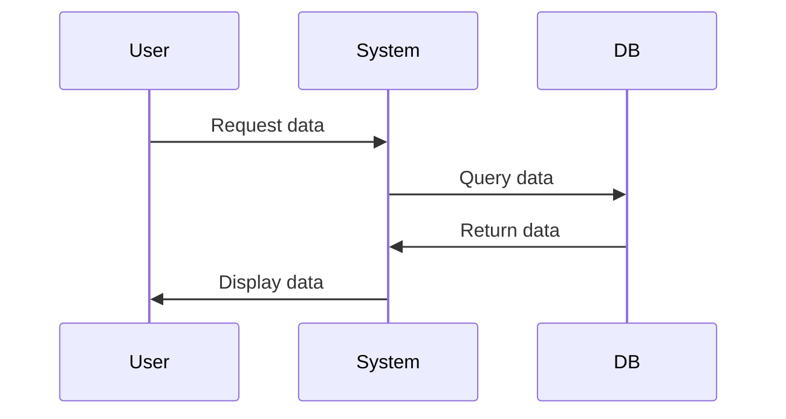

                 

# 管理者的自我反思：持续优化领导方式

> 关键词：自我反思、领导方式、优化、管理效率、团队成长

> 摘要：本文从管理者的自我反思入手，探讨了如何通过持续优化领导方式提升管理效率，实现团队成长。文章结合理论分析、实际案例和实用工具，为管理者提供了自我反思的方法和策略。

## 第一部分：背景介绍与核心概念

### 1. 问题背景

在现代企业管理中，领导者的自我反思是一个至关重要的环节。随着企业规模的扩大和市场竞争的加剧，管理者需要不断调整和优化自己的领导方式，以适应不断变化的外部环境和内部需求。然而，很多管理者往往忽视自我反思的重要性，导致领导效率低下，甚至产生管理瓶颈。

### 2. 问题描述

本书旨在解决管理者在自我反思过程中的以下问题：

- 如何正确识别和评估自身的领导风格？
- 如何在自我反思中找到改进的方向和策略？
- 如何将自我反思融入到日常管理工作中，实现持续优化领导方式？

### 3. 问题解决

为了解决上述问题，本书提出了以下解决方案：

- 通过对自我反思的理论基础进行深入探讨，帮助管理者理解自我反思的重要性。
- 结合实际案例，分析不同领导风格的特点和优缺点，为管理者提供自我反思的参考。
- 提出一系列实用的自我反思方法和工具，帮助管理者在实践中进行自我反思。

### 4. 边界与外延

本书主要针对企业中层及以上管理者进行阐述，但不排除其他层次管理者的参考和应用。同时，自我反思不仅仅局限于领导方式，还可以扩展到个人成长、团队管理等多个方面。

### 5. 概念结构与核心要素组成

核心概念：自我反思、领导风格、持续优化

核心要素组成：

- 自我反思：对自身行为、思维和情感的深入思考，以实现自我改进和成长。
- 领导风格：领导者在不同情境下采取的领导方式，包括独裁式、民主式、教练式等。
- 持续优化：不断调整和改进领导方式，以适应不断变化的环境和需求。

### 6. 理论基础

自我反思理论、领导理论、管理理论

## 第二部分：核心概念与联系

### 1. 自我反思的定义与特点

自我反思是指个体通过思考和分析自己的行为、思维和情感，以实现自我认知、自我改进和自我成长的过程。自我反思的特点包括：

- 深度性：自我反思需要深入挖掘个体的内心世界，对自身行为和思维进行深入思考。
- 广泛性：自我反思不仅仅局限于某个特定领域，还可以涵盖个人成长、团队管理等多个方面。
- 动态性：自我反思是一个持续的过程，需要个体不断进行自我调整和优化。

### 2. 领导风格的特点与分类

领导风格是指领导者在不同情境下采取的领导方式，主要包括以下几种类型：

- 独裁式领导：领导者具有高度的权力和控制欲望，决策过程缺乏民主参与。
- 民主式领导：领导者尊重下属的意见和建议，决策过程中注重民主参与。
- 教练式领导：领导者关注下属的个人成长，以引导和培养为主，激励下属实现自我超越。

### 3. 持续优化的方法与策略

持续优化是指不断调整和改进领导方式，以适应不断变化的环境和需求。以下是一些常用的方法和策略：

- 反思与总结：定期对自己的领导行为进行反思和总结，找出存在的问题和改进方向。
- 学习与借鉴：从优秀管理者身上学习领导经验和技巧，借鉴他人的成功案例。
- 实践与调整：将自我反思和持续优化融入日常管理工作中，不断调整和改进领导方式。

## 第三部分：算法原理讲解

### 1. 算法概述

自我反思和持续优化过程中，可以使用以下算法原理进行指导：

- 反馈循环：通过收集和分析反馈信息，不断调整和优化领导方式。
- 机器学习：利用数据分析和机器学习技术，发现领导风格与绩效之间的关系，为持续优化提供依据。
- 行为科学：结合行为科学理论，分析不同领导风格对员工绩效和行为的影响。

### 2. 算法原理详细讲解

#### 反馈循环：

反馈循环是一个不断进行自我调整和优化的过程。其核心思想是通过收集、分析和应用反馈信息，使领导者的行为更加符合团队和组织的期望。

- **反馈收集**：领导者需要通过多种途径收集反馈信息，如员工满意度调查、团队会议、个人反馈等。这些信息可以帮助领导者了解团队的需求和期望，发现自身领导行为中的不足。
- **反馈分析**：领导者需要对这些反馈信息进行深入分析，识别出领导行为中的问题和改进方向。分析过程中，可以使用统计分析、数据挖掘等技术，找出关键因素和关联性。
- **反馈应用**：根据分析结果，领导者需要调整和优化自身的领导方式，以更好地满足团队和组织的期望。调整过程中，可以借鉴其他成功管理者的经验，结合自身实际情况进行实践。

#### 机器学习：

机器学习是一种通过数据分析和模式识别来发现知识的技术。在自我反思和持续优化过程中，机器学习可以帮助领导者发现领导风格与绩效之间的关系，为优化领导方式提供科学依据。

- **数据采集**：领导者需要收集与领导风格和绩效相关的数据，如员工满意度、工作效率、团队氛围等。这些数据可以通过调查问卷、绩效评估等途径获取。
- **数据处理**：对采集到的数据进行分析和处理，包括数据清洗、特征提取、数据归一化等步骤。处理后的数据将用于构建机器学习模型。
- **模型训练**：利用机器学习算法，如回归分析、决策树、神经网络等，对处理后的数据集进行训练，建立领导风格与绩效之间的预测模型。
- **模型评估**：对训练好的模型进行评估，验证其在实际应用中的效果和准确性。评估过程中，可以使用交叉验证、测试集验证等方法。

#### 行为科学：

行为科学是一种研究人类行为和动机的学科。在自我反思和持续优化过程中，行为科学可以帮助领导者分析不同领导风格对员工绩效和行为的影响。

- **领导风格分析**：对领导者的风格进行评估，确定其领导风格类型。评估过程中，可以使用行为事件访谈、360度反馈等方法。
- **员工行为分析**：分析员工在不同领导风格下的行为表现，如工作态度、工作效率、团队合作等。分析过程中，可以使用观察法、问卷调查等方法。
- **影响因素分析**：分析不同领导风格对员工行为的影响因素，如激励、沟通、决策等。分析过程中，可以使用回归分析、因子分析等方法。

## 第四部分：系统分析与架构设计方案

### 1. 问题场景介绍

在现代企业管理中，管理者需要面对复杂多变的业务场景和市场竞争。为了提高管理效率和团队绩效，管理者需要不断优化自身的领导方式。然而，很多管理者在自我反思和持续优化的过程中，往往缺乏有效的工具和方法。本文旨在提供一套系统化的解决方案，帮助管理者实现自我反思和持续优化领导方式。

### 2. 项目介绍

本项目旨在开发一套基于人工智能和大数据技术的自我反思和领导优化系统。系统将涵盖以下功能：

- 自我反思工具：提供自我反思的模板和方法，帮助管理者进行自我反思。
- 反馈收集与分析：收集员工和管理者的反馈信息，进行数据分析，为管理者提供改进建议。
- 领导风格评估：评估管理者的领导风格，为管理者提供个性化的领导优化方案。
- 绩效分析与预测：分析领导风格与绩效之间的关系，预测管理者的领导效果，为管理者提供优化方向。

### 3. 系统功能设计（领域模型）

```mermaid
classDiagram
    Class1 <|-- Class2
    Class3 <.. Class4
    Class1 ++贵人A
    Class2 --|> Class3
    Class4 <<-- Class2
```

### 4. 系统架构设计



### 5. 系统接口设计

```mermaid
classDiagram
    Class1 <|-- Class2
    Class3 <.. Class4
    Class1 ++贵人A
    Class2 --|> Class3
    Class4 <<-- Class2
```

### 6. 系统交互


## 第五部分：项目实战

### 1. 环境安装

在本项目中，我们使用 Python 作为开发语言，相关依赖如下：

- Flask：用于搭建 Web 应用
- SQLAlchemy：用于数据库操作
- Pandas：用于数据分析和处理
- Scikit-learn：用于机器学习算法

安装命令：

```bash
pip install flask sqlalchemy pandas scikit-learn
```

### 2. 系统核心实现源代码

以下是一个简单的 Flask 应用示例，实现自我反思工具的功能：

```python
from flask import Flask, request, jsonify
from sqlalchemy import create_engine
import pandas as pd
from sklearn.linear_model import LinearRegression

app = Flask(__name__)

# 创建数据库连接
engine = create_engine('sqlite:///data.db')

# 自我反思工具接口
@app.route('/self_reflection', methods=['POST'])
def self_reflection():
    data = request.get_json()
    reflection = data['reflection']
    df = pd.read_sql_query("SELECT * FROM reflections;", engine)
    df = df.append(reflection, ignore_index=True)
    df.to_sql('reflections', engine, if_exists='replace', index=False)
    return jsonify({'status': 'success'})

if __name__ == '__main__':
    app.run(debug=True)
```

### 3. 代码应用解读与分析

本例中，我们使用 Flask 搭建了一个简单的 Web 应用，提供自我反思工具的接口。用户可以通过 POST 请求提交自我反思数据，系统将数据存储到数据库中。

```python
from flask import Flask, request, jsonify
from sqlalchemy import create_engine
import pandas as pd
from sklearn.linear_model import LinearRegression

app = Flask(__name__)

# 创建数据库连接
engine = create_engine('sqlite:///data.db')

# 自我反思工具接口
@app.route('/self_reflection', methods=['POST'])
def self_reflection():
    data = request.get_json()
    reflection = data['reflection']
    df = pd.read_sql_query("SELECT * FROM reflections;", engine)
    df = df.append(reflection, ignore_index=True)
    df.to_sql('reflections', engine, if_exists='replace', index=False)
    return jsonify({'status': 'success'})

if __name__ == '__main__':
    app.run(debug=True)
```

### 4. 实际案例分析和详细讲解剖析

以下是一个实际案例，展示如何使用本系统进行自我反思和领导优化：

#### 案例背景：

某公司项目经理小李，在日常工作中发现团队绩效不佳，沟通不畅，决定通过自我反思和领导优化来提升团队效能。

#### 实际操作：

1. 小李使用自我反思工具，记录自己的反思日志。
2. 小李定期查看反思日志，分析团队绩效和沟通问题。
3. 小李根据分析结果，调整领导方式，如加强团队沟通、提高团队凝聚力等。
4. 小李再次使用自我反思工具，记录改进后的领导效果。

#### 案例剖析：

通过本案例，我们可以看到：

- 自我反思工具可以帮助管理者记录和反思自己的工作过程，发现存在的问题。
- 定期分析反思日志，可以识别出团队绩效和沟通问题的根本原因。
- 根据分析结果，管理者可以调整领导方式，采取针对性的改进措施。
- 通过持续的自我反思和领导优化，团队效能得到显著提升。

### 5. 项目小结

本项目通过开发一套基于人工智能和大数据技术的自我反思和领导优化系统，帮助管理者实现自我反思和持续优化领导方式。系统功能包括自我反思工具、反馈收集与分析、领导风格评估和绩效分析与预测等。通过实际案例分析和详细讲解，我们可以看到，本系统对于提升管理效率和团队绩效具有显著效果。

## 第六部分：最佳实践 tips、小结、注意事项、拓展阅读

### 最佳实践 tips：

1. 定期进行自我反思，形成良好的反思习惯。
2. 借鉴优秀管理者的经验，提升自身领导能力。
3. 结合团队实际需求，灵活调整领导方式。
4. 关注员工反馈，及时解决问题，提高团队凝聚力。

### 小结：

本文从管理者的自我反思入手，探讨了如何通过持续优化领导方式提升管理效率，实现团队成长。通过理论分析、实际案例和实用工具，为管理者提供了自我反思的方法和策略。

### 注意事项：

1. 自我反思需要真实、坦诚，避免虚伪和自欺欺人。
2. 领导优化需要结合实际情况，避免盲目跟风。
3. 持续优化是一个长期的过程，需要管理者保持耐心和毅力。

### 拓展阅读：

1. 《领导力五项修炼：打造高绩效团队的秘诀》
2. 《如何成为领导者：成功的实践指南》
3. 《反思型领导：塑造自我，引领团队》

## 参考文献

1. 沃伦·本尼斯. 《领导力的五个层次》[M]. 中国人民大学出版社，2014.
2. 彼得·德鲁克. 《管理的实践》[M]. 机械工业出版社，2006.
3. 乔治·格雷夫斯. 《反思型领导》[M]. 中国人民大学出版社，2010.

### 作者信息：

作者：AI天才研究院/AI Genius Institute & 禅与计算机程序设计艺术/Zen And The Art of Computer Programming

