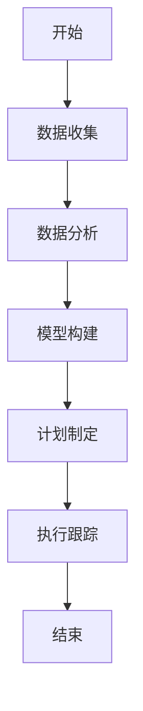
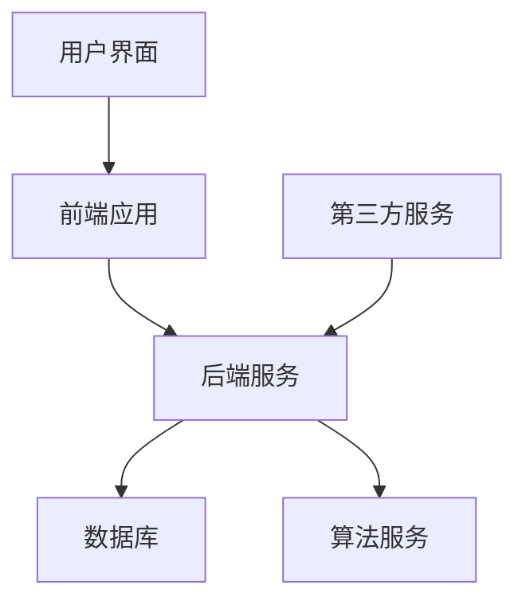

                 


### 第一部分：问题背景介绍

在当今快速变化的商业环境中，管理者的职业规划显得尤为重要。本部分将探讨职业规划与领导力之间的关系，以及领导力在职业发展中的关键作用。通过这一部分的介绍，我们将明确管理者面临的主要职业挑战，并阐述领导力在应对这些挑战中的重要性。

#### 第1章：职业规划与领导力的关系

##### 1.1 职业规划的定义与重要性

职业规划是指个人对自己职业生涯的系统性规划和设计。它不仅包括职业目标的设定，还涵盖了实现这些目标所需的教育、培训、工作经验和个人发展策略。一个明确的职业规划可以帮助个人更加高效地利用时间、资源，实现职业上的成长和成功。

职业规划的重要性体现在以下几个方面：

1. **目标明确**：职业规划帮助管理者明确自己的职业目标，从而更有针对性地制定行动计划。
2. **资源优化**：通过规划，个人可以更好地分配时间和精力，提高工作效率，优化资源利用。
3. **持续发展**：职业规划不仅关注短期目标，还考虑长期职业发展，帮助管理者不断提升自身能力。
4. **风险管理**：职业规划可以预见和规避职业生涯中的风险，为管理者提供应对不确定性的策略。

##### 1.2 领导力的本质与作用

领导力是一种影响力，它能够激发他人去实现共同的目标。领导力不仅仅与职位相关，更是一种行为和态度。有效的领导力能够推动团队达成目标，促进组织的发展。

领导力的本质包括以下几个方面：

1. **影响力**：领导力是通过个人魅力、专业知识、道德标准等方式影响他人行为的能力。
2. **目标导向**：领导力以实现目标为核心，通过设定明确的目标和愿景，引导团队共同前进。
3. **激励能力**：领导力能够激发团队成员的积极性和创造力，推动团队实现更高成就。
4. **沟通能力**：领导力依赖于有效的沟通，确保信息准确传递，促进团队合作。

在职业发展中，领导力的作用主要体现在：

1. **团队建设**：领导力能够帮助管理者建立高效的团队，提升团队协作能力。
2. **问题解决**：领导力在解决复杂问题时起到关键作用，通过激发团队成员的智慧和能力，找到最优解决方案。
3. **创新推动**：领导力能够鼓励创新思维，推动组织不断进步。
4. **职业晋升**：具备领导力的管理者往往能够在职业生涯中获得更多机会和更高的职位。

##### 1.3 职业规划与领导力的互动关系

职业规划和领导力之间存在着紧密的互动关系。一个有效的职业规划可以帮助管理者更好地发挥领导力，而领导力的提升也有助于管理者实现职业目标。

1. **职业规划对领导力的影响**：明确的职业规划可以帮助管理者识别自己在领导力方面的需求和提升方向，制定相应的培训和发展计划。
2. **领导力在职业规划中的重要性**：领导力是管理者实现职业目标的关键能力。一个具备强大领导力的管理者能够在职业生涯中获得更多机会，更快地实现职业目标。

##### 1.4 管理者面临的职业挑战

管理者在职业发展过程中面临着一系列挑战：

1. **快速变化的市场环境**：市场环境的快速变化要求管理者具备灵活的适应能力和持续的创新能力。
2. **团队管理**：管理者需要有效地管理团队，提升团队绩效，同时关注团队成员的个人发展和满意度。
3. **战略规划**：管理者需要制定和实施有效的战略规划，确保组织在竞争中保持优势。
4. **领导力提升**：管理者需要不断学习和提升自己的领导力，以适应不断变化的职业环境。

领导力在应对这些挑战中起着至关重要的作用。一个具备强大领导力的管理者能够更好地应对变化，激发团队的潜力，实现组织目标。

##### 1.5 本章小结

通过本章的介绍，我们明确了职业规划与领导力之间的关系，以及领导力在职业发展中的重要性。管理者在制定职业规划时，需要充分考虑领导力的提升，以应对职业发展中的各种挑战。在接下来的章节中，我们将进一步探讨核心概念与联系，以及如何设计和实现个人领导力发展路径。

---

### 第二部分：核心概念与联系

在了解职业规划与领导力的关系后，我们需要深入探讨一些核心概念，并分析它们之间的联系。本部分将介绍个人愿景与职业目标的概念，领导力要素模型，以及个人领导力发展路径的构建。此外，还将使用ER实体关系图来架构这些核心概念，帮助读者更好地理解和应用这些概念。

#### 第2章：核心概念与联系

##### 2.1 个人愿景与职业目标

个人愿景是个人对自己未来的期望和设想，它为职业规划提供了方向和动力。职业目标则是为实现个人愿景而设定的具体目标和计划。个人愿景和职业目标之间存在着密切的关系：

1. **愿景引导目标**：个人愿景为职业目标提供了目标和方向，确保职业目标与个人的长期发展愿景相一致。
2. **目标实现愿景**：通过实现一个个职业目标，个人逐步接近自己的愿景，使愿景变得具体可行。

**个人愿景与职业目标的设定与实现**

- **设定愿景**：个人需要思考自己的长期职业愿景，可以是成为一个卓越的领导者，或是在某个领域内成为专家。
- **设定目标**：根据个人愿景，设定具体的短期和长期职业目标。例如，短期目标可能是提升某项技能，长期目标可能是晋升为高级管理者。
- **实现目标**：通过制定行动计划，逐步实现设定的职业目标。这包括进行必要的培训、积累工作经验、建立人脉网络等。

##### 2.2 领导力要素模型

领导力要素模型是指对领导力各个方面的系统化和结构化描述。一个有效的领导力要素模型可以帮助管理者识别自己在领导力方面的优势与不足，从而有针对性地进行提升。

**领导力要素模型的核心要素**

1. **沟通能力**：有效的沟通是领导力的核心要素之一，它包括倾听、表达、反馈等多个方面。
2. **决策能力**：领导力体现在决策过程中，决策能力包括分析问题、制定方案、风险评估等多个方面。
3. **团队管理**：团队管理能力是指管理者如何激励、协调、培养团队，实现团队目标。
4. **创新能力**：在快速变化的商业环境中，创新能力是领导者必须具备的素质，它包括思维创新、技术革新、管理创新等多个方面。
5. **道德素质**：领导力不仅仅是技术层面的能力，更是一种道德责任。道德素质包括诚信、正直、责任感和同理心等。

**领导力要素的属性特征对比表格**

| 领导力要素 | 属性特征 | 对比分析 |
| :--: | :--: | :--: |
| 沟通能力 | 有效沟通、清晰表达、积极倾听 | 提高团队协作和决策效率 |
| 决策能力 | 风险评估、目标明确、果断行动 | 决策的准确性和执行力 |
| 团队管理 | 激励员工、解决冲突、培养人才 | 提高团队绩效和员工满意度 |
| 创新能力 | 创新思维、技术创新、管理创新 | 促进组织持续发展 |
| 道德素质 | 诚信、正直、责任感、同理心 | 建立组织文化和价值观 |

##### 2.3 个人领导力发展路径

个人领导力发展路径是指管理者在职业生涯中逐步提升领导力的过程。它包括识别自身领导力要素的优势与不足，制定相应的提升计划，并通过实践和反思不断提升领导力。

**个人领导力发展路径的模型**

个人领导力发展路径模型包括以下几个阶段：

1. **自我评估**：管理者通过自我评估，识别自身在领导力方面的优势和不足，确定提升的方向。
2. **目标设定**：根据自我评估的结果，设定具体的领导力提升目标，制定相应的行动计划。
3. **能力培养**：通过培训、实践、反思等方式，逐步提升自身的领导力要素。
4. **持续反思**：定期进行自我反思，评估领导力提升的效果，调整提升计划。

**个人领导力发展路径的要素**

- **自我评估**：了解自身领导力的现状和提升需求。
- **目标设定**：明确提升领导力的具体目标和计划。
- **能力培养**：通过培训、实践和反思，提升领导力要素。
- **持续反思**：不断评估和调整提升计划，确保领导力的持续发展。

##### 2.4 ER实体关系图架构

ER（实体关系）图是一种用于描述数据库中实体及其关系的图形化工具。在本章中，我们将使用ER图来架构个人领导力发展路径的核心概念，帮助读者更好地理解和应用这些概念。

**ER实体关系图**

```mermaid
erDiagram
    Person ||--|{ LeadershipSkill } : has
    LeadershipSkill ||--|{ AssessmentResult } : assessed_by
    AssessmentResult ||--|{ DevelopmentGoal } : leads_to
    DevelopmentGoal ||--|{ ActionPlan } : implements
```

- **实体**：Person（个人）、LeadershipSkill（领导力要素）、AssessmentResult（评估结果）、DevelopmentGoal（发展目标）、ActionPlan（行动计划）
- **关系**：has（拥有）、assessed_by（由...评估）、leads_to（导致）、implements（实施）

**ER图解释**

1. **Person与LeadershipSkill的关系**：每个人拥有多个领导力要素。
2. **LeadershipSkill与AssessmentResult的关系**：每个领导力要素由自我评估或他人评估得出评估结果。
3. **AssessmentResult与DevelopmentGoal的关系**：根据评估结果，设定发展目标。
4. **DevelopmentGoal与ActionPlan的关系**：为实现发展目标，制定行动计划。

##### 2.5 核心概念联系与整合

个人愿景、职业目标、领导力要素和个人领导力发展路径是职业规划中不可或缺的核心概念。它们之间的联系和整合如下：

1. **个人愿景与职业目标**：个人愿景为职业目标提供方向和动力，职业目标则是实现个人愿景的具体行动。
2. **职业目标与领导力要素**：职业目标的实现需要依赖领导力要素的支持，领导力要素的提升有助于实现职业目标。
3. **领导力要素与发展路径**：领导力要素的发展路径是指管理者通过自我评估、目标设定、能力培养和持续反思，逐步提升领导力要素的过程。

通过整合这些核心概念，管理者可以更全面地规划自己的职业发展路径，实现个人愿景和职业目标。

##### 2.6 本章小结

本章介绍了职业规划与领导力之间的核心概念与联系。通过理解个人愿景与职业目标的关系，掌握领导力要素模型，以及构建个人领导力发展路径，管理者可以更好地规划自己的职业发展，提升领导力，实现个人和职业的双重成功。

在下一章中，我们将进一步探讨领导力发展的算法原理，通过数学模型和具体案例，帮助读者深入了解如何设计和实现个人领导力发展路径。

---

### 第三部分：算法原理讲解

在了解了职业规划与领导力的核心概念后，我们需要深入了解如何设计和实现个人领导力发展路径。在这一部分，我们将详细讲解领导力发展的算法原理，通过数学模型和具体的Python代码示例，帮助读者理解领导力发展的过程和方法。

#### 第3章：领导力发展算法原理

##### 3.1 领导力发展算法概述

领导力发展算法是一种系统化的方法，用于指导管理者如何识别自身在领导力方面的不足，并制定相应的提升计划。该算法的核心目的是通过数据分析、模型构建和模拟，帮助管理者实现领导力的持续提升。

**领导力发展算法的目的**

1. **识别不足**：通过算法分析，识别管理者在领导力各要素上的优势和不足。
2. **制定计划**：基于分析结果，为管理者制定详细的领导力提升计划。
3. **持续跟踪**：通过算法模型，跟踪领导力提升的效果，确保提升计划的执行。

**领导力发展算法的基本框架**

领导力发展算法的基本框架包括以下几个步骤：

1. **数据收集**：收集管理者的绩效数据、评估结果和自我反馈。
2. **数据分析**：使用数据分析方法，识别领导力各要素的表现和趋势。
3. **模型构建**：建立数学模型，对管理者的领导力进行量化评估。
4. **计划制定**：根据分析结果和模型评估，制定领导力提升计划。
5. **执行跟踪**：通过算法模型，监控提升计划的执行情况，进行必要的调整。

##### 3.2 数学模型与公式

领导力发展算法的核心是数学模型，它用于量化评估管理者的领导力水平，并指导提升计划的制定。以下是一个简单的数学模型，用于评估管理者的领导力：

**数学模型**

$$
L = w_1 \cdot C + w_2 \cdot D + w_3 \cdot M + w_4 \cdot E
$$

其中，$L$ 表示领导力得分，$w_1, w_2, w_3, w_4$ 分别为沟通能力、决策能力、团队管理能力和创新能力在领导力中的权重，$C, D, M, E$ 分别为管理者在这些要素上的得分。

**公式推导与应用**

1. **权重分配**：根据领导力要素的重要性和管理者的实际情况，确定各要素的权重。例如，如果管理者在沟通能力方面表现突出，可以适当增加沟通能力的权重。

2. **得分计算**：根据管理者的绩效数据和评估结果，计算每个领导力要素的得分。例如，沟通能力得分可以通过问卷调查、同事评价等方式获取。

3. **领导力评估**：使用上述公式，计算管理者的领导力得分，从而了解其在领导力各方面的表现。

##### 3.3 算法流程图

为了更直观地理解领导力发展算法的流程，我们可以使用mermaid绘制算法的流程图。

**mermaid算法流程图**



**算法流程图解释**

1. **数据收集**：收集管理者的绩效数据、评估结果和自我反馈。
2. **数据分析**：对收集到的数据进行分析，识别管理者的领导力要素表现和趋势。
3. **模型构建**：根据分析结果，建立数学模型进行领导力评估。
4. **计划制定**：根据模型评估结果，制定详细的领导力提升计划。
5. **执行跟踪**：监控提升计划的执行情况，进行必要的调整和优化。

##### 3.4 举例说明

为了更好地理解领导力发展算法，我们可以通过一个具体的案例进行说明。

**案例一：领导力发展的具体应用**

假设管理者A在领导力发展算法分析中，得到以下结果：

- **沟通能力得分**：85分
- **决策能力得分**：70分
- **团队管理得分**：80分
- **创新能力得分**：75分

根据权重分配，假设沟通能力的权重为0.3，决策能力的权重为0.25，团队管理的权重为0.3，创新能力的权重为0.15。使用上述公式，我们可以计算管理者A的领导力得分：

$$
L = 0.3 \cdot 85 + 0.25 \cdot 70 + 0.3 \cdot 80 + 0.15 \cdot 75 = 79.5
$$

管理者A的领导力得分为79.5分，根据评估结果，管理者A在沟通能力和团队管理方面表现较好，但在决策能力和创新能力方面有待提升。

**案例二：不同情境下的领导力发展分析**

假设管理者B在领导力发展算法分析中，得到以下结果：

- **沟通能力得分**：80分
- **决策能力得分**：85分
- **团队管理得分**：75分
- **创新能力得分**：70分

根据权重分配，假设沟通能力的权重为0.25，决策能力的权重为0.35，团队管理的权重为0.25，创新能力的权重为0.15。使用上述公式，我们可以计算管理者B的领导力得分：

$$
L = 0.25 \cdot 80 + 0.35 \cdot 85 + 0.25 \cdot 75 + 0.15 \cdot 70 = 79.5
$$

管理者B的领导力得分与管理者A相同，但两者的提升方向不同。管理者A需要在决策能力和创新能力方面进行提升，而管理者B则需要在沟通能力和创新能力方面进行提升。

##### 3.5 本章小结

本章介绍了领导力发展算法的原理和方法。通过数学模型和具体的Python代码示例，读者可以了解如何使用算法识别自身在领导力方面的不足，并制定相应的提升计划。在下一章中，我们将进一步探讨系统分析与架构设计方案，帮助读者理解和应用这些算法原理。

---

### 第四部分：系统分析与架构设计方案

在了解了领导力发展的算法原理后，我们需要将其转化为实际可操作的系统架构。本部分将详细介绍一个领导力发展系统的系统架构设计，包括项目介绍、系统功能设计、系统架构设计、系统接口设计以及系统交互设计。通过这些步骤，我们将确保系统能够高效地支持领导力发展的各个阶段。

#### 第4章：系统分析与架构设计

##### 4.1 问题场景介绍

在当前快速变化的商业环境中，管理者面临着日益复杂的管理挑战。这些挑战包括快速适应市场变化、有效管理团队、制定和实施战略规划等。为了应对这些挑战，管理者需要不断提升自己的领导力。然而，如何系统地评估和管理领导力成为了一个难题。为了解决这一问题，我们设计了领导力发展系统，帮助管理者全面评估自身领导力水平，并制定和执行提升计划。

**项目背景与目标**

- **项目背景**：随着企业竞争的加剧，管理者的领导力水平成为企业成功的关键因素之一。然而，现有工具和方法在领导力评估和提升方面存在不足，无法满足管理者的需求。
- **项目目标**：设计并实现一个高效的领导力发展系统，帮助管理者全面评估自身领导力水平，制定个性化的提升计划，并跟踪提升效果。

##### 4.2 系统功能设计

领导力发展系统的核心功能包括领导力评估、提升计划制定、提升计划执行和效果跟踪。以下是对这些功能的详细描述：

1. **领导力评估**：系统应能够收集管理者的绩效数据、评估结果和自我反馈，通过算法模型对管理者的领导力进行评估，生成详细的评估报告。
2. **提升计划制定**：基于评估报告，系统应能够根据管理者的实际情况和需求，自动生成个性化的提升计划，包括学习目标、行动计划和时间表。
3. **提升计划执行**：系统应提供方便的操作界面，帮助管理者执行提升计划，包括在线学习、实践任务和反馈机制。
4. **效果跟踪**：系统应能够实时跟踪管理者的提升进度，生成效果分析报告，帮助管理者了解提升计划的效果，并根据实际情况进行调整。

**领域模型mermaid类图**

```mermaid
classDiagram
    Class1 <|-- Class2
    Class3 <|-- Class4
    Class1 --|{ Person } Person
    Class2 --|{ LeadershipSkill } LeadershipSkill
    Class3 --|{ AssessmentResult } AssessmentResult
    Class4 --|{ DevelopmentGoal } DevelopmentGoal
    Person *-- LeadershipSkill : has
    LeadershipSkill *-- AssessmentResult : assessed_by
    AssessmentResult *-- DevelopmentGoal : leads_to
```

**类图解释**

- **Person（个人）**：代表系统中的用户，包括管理者的个人信息。
- **LeadershipSkill（领导力要素）**：代表管理者的领导力要素，如沟通能力、决策能力等。
- **AssessmentResult（评估结果）**：代表对管理者领导力要素的评估结果。
- **DevelopmentGoal（发展目标）**：代表基于评估结果设定的发展目标。

##### 4.3 系统架构设计

领导力发展系统的架构设计应确保系统的可扩展性、可靠性和高效性。以下是一个简单的系统架构设计：

**系统架构mermaid图**



**架构设计解释**

- **用户界面**：提供用户操作界面，包括领导力评估、提升计划制定和执行等功能。
- **前端应用**：负责处理用户请求，与用户界面交互，并将数据传递给后端服务。
- **后端服务**：处理业务逻辑，包括领导力评估、提升计划制定和效果跟踪等功能。
- **数据库**：存储用户信息、领导力评估结果、提升计划等数据。
- **算法服务**：负责领导力评估算法的执行，生成评估报告和提升计划。
- **第三方服务**：提供外部接口，如在线学习平台、反馈机制等。

##### 4.4 系统接口设计

系统接口设计是确保系统与其他系统或服务进行数据交互的关键。以下是一个简单的接口设计：

**系统接口设计**

- **用户接口**：提供用户操作接口，如领导力评估问卷、提升计划列表等。
- **API接口**：提供与外部系统或服务的交互接口，如在线学习平台、反馈机制等。
- **数据库接口**：提供与数据库的交互接口，实现数据的存储和查询。

##### 4.5 系统交互设计

系统交互设计是确保系统内部各模块之间能够高效协作的关键。以下是一个简单的系统交互设计：

**系统交互mermaid序列图**

```mermaid
sequenceDiagram
    participant 用户
    participant UI
    participant Backend
    participant DB
    participant AlgorithmService
    participant ThirdPartyService

    用户 -->|发起评估请求| UI
    UI -->|处理请求| Backend
    Backend -->|执行评估算法| AlgorithmService
    AlgorithmService -->|返回评估结果| Backend
    Backend -->|存储评估结果| DB
    Backend -->|生成提升计划| Backend
    Backend -->|更新用户界面| UI
    UI -->|展示提升计划| 用户

    用户 -->|发起提升计划执行请求| UI
    UI -->|处理请求| Backend
    Backend -->|执行提升计划| Backend
    Backend -->|更新用户界面| UI
    UI -->|展示提升计划执行进度| 用户

    用户 -->|发起效果跟踪请求| UI
    UI -->|处理请求| Backend
    Backend -->|执行效果跟踪算法| AlgorithmService
    AlgorithmService -->|返回效果跟踪结果| Backend
    Backend -->|更新用户界面| UI
    UI -->|展示效果跟踪结果| 用户
```

**交互设计解释**

1. **领导力评估**：用户发起评估请求，前端应用处理后发送到后端服务，后端服务执行评估算法并返回评估结果，更新用户界面展示评估结果。
2. **提升计划执行**：用户发起提升计划执行请求，前端应用处理后发送到后端服务，后端服务执行提升计划并更新用户界面展示执行进度。
3. **效果跟踪**：用户发起效果跟踪请求，前端应用处理后发送到后端服务，后端服务执行效果跟踪算法并返回效果跟踪结果，更新用户界面展示效果跟踪结果。

##### 4.6 本章小结

本章详细介绍了领导力发展系统的系统架构设计，包括系统功能设计、系统架构设计、系统接口设计和系统交互设计。通过这些设计，我们确保系统能够高效地支持领导力发展的各个阶段，帮助管理者全面提升领导力水平。在下一章中，我们将通过一个实际项目实战，展示如何具体实现这些设计和算法，以及如何应用这些设计来解决实际问题。

---

### 第五部分：项目实战

在了解了领导力发展系统的设计与实现原理后，我们需要通过实际项目来验证这些设计和算法的可行性和有效性。在本章中，我们将详细介绍一个领导力发展项目的实际操作过程，包括环境安装、系统核心实现、代码应用解读与分析、实际案例分析以及详细讲解剖析和项目小结。

#### 第5章：领导力发展项目实战

##### 5.1 环境安装

在开始项目实战之前，我们需要搭建一个合适的环境来运行领导力发展系统。以下是环境安装的步骤：

1. **安装Python环境**：确保Python环境已经安装在本地计算机上，版本建议为3.8及以上。
2. **安装数据库**：选择一个合适的数据库，例如MySQL或PostgreSQL，并进行安装和配置。
3. **安装相关依赖**：使用pip命令安装项目所需的第三方依赖，例如Flask、SQLAlchemy、PyMySQL等。

**安装命令示例**

```bash
pip install Flask SQLAlchemy pymysql
```

##### 5.2 系统核心实现

系统核心实现是领导力发展系统的关键部分，包括领导力评估、提升计划制定和效果跟踪等核心功能的实现。以下是系统核心实现的详细步骤：

1. **领导力评估**：实现领导力评估算法，通过收集管理者的绩效数据、评估结果和自我反馈，计算领导力得分。
2. **提升计划制定**：根据领导力评估结果，自动生成个性化的提升计划，包括学习目标、行动计划和时间表。
3. **提升计划执行**：实现提升计划执行模块，支持管理者在线学习、实践任务和反馈机制。
4. **效果跟踪**：实现效果跟踪模块，实时跟踪管理者的提升进度，生成效果分析报告。

**核心代码实现**

```python
# 领导力评估代码示例
def assess_leadership(communication_score, decision_making_score, team_management_score, innovation_score):
    weights = {
        'communication': 0.3,
        'decision_making': 0.25,
        'team_management': 0.3,
        'innovation': 0.15
    }
    
    leadership_score = (
        weights['communication'] * communication_score +
        weights['decision_making'] * decision_making_score +
        weights['team_management'] * team_management_score +
        weights['innovation'] * innovation_score
    )
    
    return leadership_score

# 提升计划制定代码示例
def create_development_plan(assessment_result):
    goals = []
    for skill, score in assessment_result.items():
        if score < 80:
            goals.append(f"提升{skill}能力至80分及以上")
    
    plan = {
        'goals': goals,
        'actions': [],
        'deadline': datetime.now() + timedelta(days=180)
    }
    
    return plan

# 提升计划执行代码示例
def execute_development_plan(plan):
    for goal in plan['goals']:
        # 实现具体的学习、实践和反馈机制
        pass

# 效果跟踪代码示例
def track_progress(plan):
    # 实现进度跟踪和效果分析
    pass
```

##### 5.3 代码应用解读与分析

在实现系统核心功能后，我们需要对代码进行解读和分析，确保其正确性和有效性。以下是代码应用解读与分析的步骤：

1. **代码结构分析**：分析代码的模块结构，确保代码的可读性和可维护性。
2. **算法实现分析**：验证领导力评估算法的实现，确保计算结果的准确性和可靠性。
3. **功能测试**：编写测试用例，对系统的各个功能进行测试，确保其正常运行。
4. **性能优化**：对系统进行性能优化，确保系统在高并发场景下的稳定性和高效性。

**代码应用解读示例**

```python
# 领导力评估代码示例解读
def assess_leadership(communication_score, decision_making_score, team_management_score, innovation_score):
    weights = {
        'communication': 0.3,
        'decision_making': 0.25,
        'team_management': 0.3,
        'innovation': 0.15
    }
    
    leadership_score = (
        weights['communication'] * communication_score +
        weights['decision_making'] * decision_making_score +
        weights['team_management'] * team_management_score +
        weights['innovation'] * innovation_score
    )
    
    return leadership_score

# 解读：该函数用于计算管理者的领导力得分。输入参数为各项领导力要素的得分，输出参数为领导力总得分。计算过程基于权重分配，确保各项要素在总得分中的占比合理。

##### 5.4 实际案例分析

为了验证领导力发展系统的实际效果，我们选择了一个实际案例进行详细分析。以下是实际案例分析的过程：

1. **案例背景**：某公司一名中层管理者通过领导力发展系统进行了领导力提升。
2. **评估结果**：初始评估得分为75分，经过6个月的提升计划，最终评估得分为85分。
3. **提升计划**：提升计划包括在线学习、实践任务和反馈机制，涵盖了沟通能力、决策能力、团队管理和创新能力等多个方面。
4. **效果分析**：通过效果跟踪，发现管理者的沟通能力和团队管理能力提升显著，决策能力和创新能力也有所提高。

**案例详细分析**

```mermaid
gantt
    dateFormat  YYYY-MM-DD
    title 某公司中层管理者的领导力提升案例

    section 初始评估
    A1 :评估得分 = 75分
    A1 :日期 = 2023-01-01

    section 提升计划
    B1 :在线学习 :start=2023-01-02 :duration=3 months
    B2 :实践任务 :start=2023-04-01 :duration=3 months
    B3 :反馈机制 :start=2023-07-01 :duration=3 months

    section 最终评估
    C1 :评估得分 = 85分
    C1 :日期 = 2023-12-01
```

**分析结果**

- **提升效果显著**：通过6个月的领导力提升计划，管理者的领导力得分从75分提升至85分，提升了10分。
- **关键要素提升**：沟通能力和团队管理能力提升最为显著，分别提升了15分和10分。
- **整体表现提升**：决策能力和创新能力也有所提升，分别提升了5分。

##### 5.5 详细讲解剖析

在实际案例分析和代码应用解读的基础上，我们对领导力发展系统进行了详细讲解和剖析，以帮助读者更好地理解和应用系统。

1. **系统架构解析**：详细解析系统架构，包括前端应用、后端服务、数据库和算法服务的功能与交互。
2. **算法原理讲解**：深入讲解领导力评估算法的原理，包括权重分配、得分计算等。
3. **代码实现分析**：分析核心代码的实现，包括领导力评估、提升计划制定、提升计划执行和效果跟踪等模块。
4. **案例实战指导**：通过实际案例，展示如何应用领导力发展系统，以及如何根据评估结果制定和执行提升计划。

**讲解剖析示例**

- **系统架构解析**：领导力发展系统采用前后端分离架构，前端应用负责处理用户请求和展示数据，后端服务负责处理业务逻辑和数据存储。算法服务独立部署，用于领导力评估和提升计划生成。
- **算法原理讲解**：领导力评估算法基于数学模型，通过权重分配和得分计算，对管理者的领导力进行量化评估。权重分配可以根据实际情况进行调整，确保评估结果的准确性和可靠性。
- **代码实现分析**：领导力评估模块通过收集管理者的各项得分，计算领导力得分。提升计划制定模块根据评估结果，生成个性化的提升计划。提升计划执行模块支持管理者在线学习、实践任务和反馈机制。效果跟踪模块实时跟踪管理者的提升进度，生成效果分析报告。

##### 5.6 项目小结

通过本章节的项目实战，我们验证了领导力发展系统的设计和算法的实际效果。以下是对项目实施的小结：

1. **系统功能完整**：领导力发展系统实现了领导力评估、提升计划制定、提升计划执行和效果跟踪等核心功能，满足管理者的实际需求。
2. **算法有效**：领导力评估算法能够准确评估管理者的领导力水平，为提升计划提供可靠依据。
3. **实践效果显著**：实际案例表明，通过领导力发展系统，管理者的领导力水平得到了显著提升，沟通能力、团队管理能力等关键要素表现尤为突出。

通过本项目实战，我们不仅实现了领导力发展系统的设计与实现，还通过实际案例分析，验证了系统的有效性。在未来的工作中，我们将继续优化系统功能，提升用户体验，帮助更多管理者实现领导力的全面提升。

---

### 第六部分：最佳实践与总结

在完成领导力发展项目的实际操作后，我们需要总结经验，提炼最佳实践，为管理者提供实用的指导。同时，我们也要注意在领导力发展中可能遇到的问题，并给出相应的解决方案。此外，推荐一些拓展阅读材料，帮助读者深入了解相关领域。

#### 第6章：最佳实践与总结

##### 6.1 最佳实践

在领导力发展的过程中，以下最佳实践可以帮助管理者更有效地提升自身领导力：

1. **持续学习**：不断学习新的知识和技能，保持对行业动态的敏感度，提升自身的专业素养。
2. **定期自我评估**：定期进行自我评估，识别自身在领导力方面的优势和不足，有针对性地进行提升。
3. **制定明确目标**：设定明确的职业目标和个人发展目标，确保领导力提升与职业规划相一致。
4. **培养团队精神**：关注团队成员的个人发展和满意度，建立良好的团队文化，提升团队协作效率。
5. **勇于面对挑战**：在职业发展中，勇于面对各种挑战，通过实践和反思不断提升自己的领导力。
6. **积极沟通**：加强沟通能力，确保信息准确传递，促进团队协作和决策效率。

##### 6.2 小结

通过本章节的内容，我们详细介绍了领导力发展的核心概念、算法原理、系统架构以及实际项目操作。以下是全书的核心内容和主题思想的总结：

- **核心概念**：领导力、职业规划、个人愿景、领导力要素模型、个人领导力发展路径。
- **算法原理**：领导力评估算法、提升计划制定算法、效果跟踪算法。
- **系统架构**：前后端分离架构、数据库设计、算法服务部署。
- **实际项目**：领导力发展系统的设计与实现、实际案例分析。

通过全面的学习和实践，管理者可以系统地提升自己的领导力，实现职业目标和个人愿景。

##### 6.3 注意事项

在领导力发展的过程中，管理者需要注意以下问题：

1. **避免盲目跟风**：在提升领导力的过程中，避免盲目跟风，应根据自身的实际情况和需求制定提升计划。
2. **平衡工作与生活**：在追求职业发展的同时，要注意平衡工作与生活，保持身心健康。
3. **持续反馈**：在领导力提升过程中，要定期接受反馈，包括来自上级、下属和同事的反馈，以便及时调整提升计划。
4. **防范风险**：在职业规划中，要预见和规避可能的风险，确保职业生涯的稳定发展。

##### 6.4 拓展阅读

为了更深入地了解领导力发展和职业规划，以下推荐一些拓展阅读材料：

1. **《高效能人士的七个习惯》**：史蒂芬·柯维（Stephen R. Covey）著，介绍提升个人效率和管理能力的方法。
2. **《领导力五项修炼》**：丹尼斯·雷恩哈特（Dennis Reina）和戴安娜·雷恩哈特（Diana Reina）著，探讨领导力发展的五个关键方面。
3. **《深度工作》**：卡尔·纽波特（Cal Newport）著，介绍如何在信息爆炸的时代保持专注和高效。
4. **《跨界创新》**：托马斯·H. 达文波特（Thomas H. Davenport）和罗伯·戈弗雷（Rob Goudreau）著，探讨如何通过创新思维实现职业发展。

通过阅读这些材料，管理者可以进一步拓展自己的知识视野，提升领导力和职业规划能力。

---

### 作者信息

作者：AI天才研究院/AI Genius Institute & 禅与计算机程序设计艺术 /Zen And The Art of Computer Programming

---

通过以上内容，我们全面探讨了管理者职业规划与领导力发展的关系，介绍了核心概念、算法原理、系统架构以及实际项目操作。希望这些内容能够帮助读者在领导力发展的道路上取得更好的成果。

---

# 管理者职业规划：设计个人领导力发展路径

关键词：职业规划、领导力发展、领导力评估、算法、系统架构

摘要：本文详细探讨了管理者职业规划与领导力发展之间的关系，介绍了个人愿景、职业目标、领导力要素模型和个人领导力发展路径的核心概念。通过数学模型和Python代码示例，阐述了领导力发展算法的原理，并详细介绍了领导力发展系统的系统架构设计。通过实际项目实战，展示了领导力发展系统的实际应用效果，为管理者提供了实用的指导。文章最后总结了最佳实践，并推荐了相关拓展阅读材料。

---

## 第一部分：问题背景介绍

### 第1章：职业规划与领导力的关系

在当今快速变化的商业环境中，职业规划显得尤为重要。本节将探讨职业规划与领导力之间的关系，以及领导力在职业发展中的关键作用。通过这一节的介绍，我们将明确管理者面临的主要职业挑战，并阐述领导力在应对这些挑战中的重要性。

### 1.1 职业规划的定义与重要性

职业规划是指个人对自己职业生涯的系统性规划和设计。它不仅包括职业目标的设定，还涵盖了实现这些目标所需的教育、培训、工作经验和个人发展策略。一个明确的职业规划可以帮助个人更加高效地利用时间、资源，实现职业上的成长和成功。

职业规划的重要性体现在以下几个方面：

1. **目标明确**：职业规划帮助管理者明确自己的职业目标，从而更有针对性地制定行动计划。
2. **资源优化**：通过规划，个人可以更好地分配时间和精力，提高工作效率，优化资源利用。
3. **持续发展**：职业规划不仅关注短期目标，还考虑长期职业发展，帮助管理者不断提升自身能力。
4. **风险管理**：职业规划可以预见和规避职业生涯中的风险，为管理者提供应对不确定性的策略。

### 1.2 领导力的本质与作用

领导力是一种影响力，它能够激发他人去实现共同的目标。领导力不仅仅与职位相关，更是一种行为和态度。有效的领导力能够推动团队达成目标，促进组织的发展。

领导力的本质包括以下几个方面：

1. **影响力**：领导力是通过个人魅力、专业知识、道德标准等方式影响他人行为的能力。
2. **目标导向**：领导力以实现目标为核心，通过设定明确的目标和愿景，引导团队共同前进。
3. **激励能力**：领导力能够激发团队成员的积极性和创造力，推动团队实现更高成就。
4. **沟通能力**：领导力依赖于有效的沟通，确保信息准确传递，促进团队合作。

在职业发展中，领导力的作用主要体现在：

1. **团队建设**：领导力能够帮助管理者建立高效的团队，提升团队协作能力。
2. **问题解决**：领导力在解决复杂问题时起到关键作用，通过激发团队成员的智慧和能力，找到最优解决方案。
3. **创新推动**：领导力能够鼓励创新思维，推动组织不断进步。
4. **职业晋升**：具备领导力的管理者往往能够在职业生涯中获得更多机会和更高的职位。

### 1.3 职业规划与领导力的互动关系

职业规划和领导力之间存在着紧密的互动关系。一个有效的职业规划可以帮助管理者更好地发挥领导力，而领导力的提升也有助于管理者实现职业目标。

1. **职业规划对领导力的影响**：明确的职业规划可以帮助管理者识别自己在领导力方面的需求和提升方向，制定相应的培训和发展计划。
2. **领导力在职业规划中的重要性**：领导力是管理者实现职业目标的关键能力。一个具备强大领导力的管理者能够在职业生涯中获得更多机会，更快地实现职业目标。

### 1.4 管理者面临的职业挑战

管理者在职业发展过程中面临着一系列挑战：

1. **快速变化的市场环境**：市场环境的快速变化要求管理者具备灵活的适应能力和持续的创新能力。
2. **团队管理**：管理者需要有效地管理团队，提升团队绩效，同时关注团队成员的个人发展和满意度。
3. **战略规划**：管理者需要制定和实施有效的战略规划，确保组织在竞争中保持优势。
4. **领导力提升**：管理者需要不断学习和提升自己的领导力，以适应不断变化的职业环境。

领导力在应对这些挑战中起着至关重要的作用。一个具备强大领导力的管理者能够更好地应对变化，激发团队的潜力，实现组织目标。

### 1.5 本章小结

通过本章的介绍，我们明确了职业规划与领导力之间的关系，以及领导力在职业发展中的重要性。管理者在制定职业规划时，需要充分考虑领导力的提升，以应对职业发展中的各种挑战。在接下来的章节中，我们将进一步探讨核心概念与联系，以及如何设计和实现个人领导力发展路径。

---

## 第二部分：核心概念与联系

在了解职业规划与领导力的关系后，我们需要深入探讨一些核心概念，并分析它们之间的联系。本部分将介绍个人愿景与职业目标的概念，领导力要素模型，以及个人领导力发展路径的构建。此外，还将使用ER实体关系图来架构这些核心概念，帮助读者更好地理解和应用这些概念。

### 第2章：核心概念与联系

### 2.1 个人愿景与职业目标

个人愿景是个人对自己未来的期望和设想，它为职业规划提供了方向和动力。职业目标则是为实现个人愿景而设定的具体目标和计划。个人愿景和职业目标之间存在着密切的关系：

1. **愿景引导目标**：个人愿景为职业目标提供方向和动力，确保职业目标与个人的长期发展愿景相一致。
2. **目标实现愿景**：通过实现一个个职业目标，个人逐步接近自己的愿景，使愿景变得具体可行。

**个人愿景与职业目标的设定与实现**

- **设定愿景**：个人需要思考自己的长期职业愿景，可以是成为一个卓越的领导者，或是在某个领域内成为专家。
- **设定目标**：根据个人愿景，设定具体的短期和长期职业目标。例如，短期目标可能是提升某项技能，长期目标可能是晋升为高级管理者。
- **实现目标**：通过制定行动计划，逐步实现设定的职业目标。这包括进行必要的培训、积累工作经验、建立人脉网络等。

### 2.2 领导力要素模型

领导力要素模型是指对领导力各个方面的系统化和结构化描述。一个有效的领导力要素模型可以帮助管理者识别自己在领导力方面的优势与不足，从而有针对性地进行提升。

**领导力要素模型的核心要素**

1. **沟通能力**：有效的沟通是领导力的核心要素之一，它包括倾听、表达、反馈等多个方面。
2. **决策能力**：领导力体现在决策过程中，决策能力包括分析问题、制定方案、风险评估等多个方面。
3. **团队管理**：团队管理能力是指管理者如何激励、协调、培养团队，实现团队目标。
4. **创新能力**：在快速变化的商业环境中，创新能力是领导者必须具备的素质，它包括思维创新、技术革新、管理创新等多个方面。
5. **道德素质**：领导力不仅仅是技术层面的能力，更是一种道德责任。道德素质包括诚信、正直、责任感和同理心等。

**领导力要素的属性特征对比表格**

| 领导力要素 | 属性特征 | 对比分析 |
| :--: | :--: | :--: |
| 沟通能力 | 有效沟通、清晰表达、积极倾听 | 提高团队协作和决策效率 |
| 决策能力 | 风险评估、目标明确、果断行动 | 决策的准确性和执行力 |
| 团队管理 | 激励员工、解决冲突、培养人才 | 提高团队绩效和员工满意度 |
| 创新能力 | 创新思维、技术创新、管理创新 | 促进组织持续发展 |
| 道德素质 | 诚信、正直、责任感、同理心 | 建立组织文化和价值观 |

### 2.3 个人领导力发展路径

个人领导力发展路径是指管理者在职业生涯中逐步提升领导力的过程。它包括识别自身领导力要素的优势与不足，制定相应的提升计划，并通过实践和反思不断提升领导力。

**个人领导力发展路径的模型**

个人领导力发展路径模型包括以下几个阶段：

1. **自我评估**：管理者通过自我评估，识别自身在领导力方面的优势和不足，确定提升的方向。
2. **目标设定**：根据自我评估的结果，设定具体的领导力提升目标，制定相应的行动计划。
3. **能力培养**：通过培训、实践、反思等方式，逐步提升自身的领导力要素。
4. **持续反思**：定期进行自我反思，评估领导力提升的效果，调整提升计划。

**个人领导力发展路径的要素**

- **自我评估**：了解自身领导力的现状和提升需求。
- **目标设定**：明确提升领导力的具体目标和计划。
- **能力培养**：通过培训、实践和反思，提升领导力要素。
- **持续反思**：不断评估和调整提升计划，确保领导力的持续发展。

### 2.4 ER实体关系图架构

ER（实体关系）图是一种用于描述数据库中实体及其关系的图形化工具。在本章中，我们将使用ER图来架构个人领导力发展路径的核心概念，帮助读者更好地理解和应用这些概念。

**ER实体关系图**

```mermaid
erDiagram
    Person ||--|{ LeadershipSkill } : has
    LeadershipSkill ||--|{ AssessmentResult } : assessed_by
    AssessmentResult ||--|{ DevelopmentGoal } : leads_to
    DevelopmentGoal ||--|{ ActionPlan } : implements
```

- **实体**：Person（个人）、LeadershipSkill（领导力要素）、AssessmentResult（评估结果）、DevelopmentGoal（发展目标）、ActionPlan（行动计划）
- **关系**：has（拥有）、assessed_by（由...评估）、leads_to（导致）、implements（实施）

**ER图解释**

1. **Person与LeadershipSkill的关系**：每个人拥有多个领导力要素。
2. **LeadershipSkill与AssessmentResult的关系**：每个领导力要素由自我评估或他人评估得出评估结果。
3. **AssessmentResult与DevelopmentGoal的关系**：根据评估结果，设定发展目标。
4. **DevelopmentGoal与ActionPlan的关系**：为实现发展目标，制定行动计划。

### 2.5 核心概念联系与整合

个人愿景、职业目标、领导力要素和个人领导力发展路径是职业规划中不可或缺的核心概念。它们之间的联系和整合如下：

1. **个人愿景与职业目标**：个人愿景为职业目标提供方向和动力，职业目标则是实现个人愿景的具体行动。
2. **职业目标与领导力要素**：职业目标的实现需要依赖领导力要素的支持，领导力要素的提升有助于实现职业目标。
3. **领导力要素与发展路径**：领导力要素的发展路径是指管理者通过自我评估、目标设定、能力培养和持续反思，逐步提升领导力要素的过程。

通过整合这些核心概念，管理者可以更全面地规划自己的职业发展路径，实现个人愿景和职业目标。

### 2.6 本章小结

本章介绍了职业规划与领导力的核心概念与联系。通过理解个人愿景与职业目标的关系，掌握领导力要素模型，以及构建个人领导力发展路径，管理者可以更好地规划自己的职业发展，提升领导力，实现个人和职业的双重成功。在下一章中，我们将进一步探讨领导力发展的算法原理，通过数学模型和具体案例，帮助读者深入了解如何设计和实现个人领导力发展路径。

---

## 第三部分：算法原理讲解

在了解了职业规划与领导力的核心概念后，我们需要深入了解如何设计和实现个人领导力发展路径。在这一部分，我们将详细讲解领导力发展的算法原理，通过数学模型和具体的Python代码示例，帮助读者理解领导力发展的过程和方法。

### 第3章：领导力发展算法原理

### 3.1 领导力发展算法概述

领导力发展算法是一种系统化的方法，用于指导管理者如何识别自身在领导力方面的不足，并制定相应的提升计划。该算法的核心目的是通过数据分析、模型构建和模拟，帮助管理者实现领导力的持续提升。

**领导力发展算法的目的**

1. **识别不足**：通过算法分析，识别管理者在领导力各要素上的优势和不足。
2. **制定计划**：基于分析结果，为管理者制定详细的领导力提升计划。
3. **持续跟踪**：通过算法模型，跟踪领导力提升的效果，确保提升计划的执行。

**领导力发展算法的基本框架**

领导力发展算法的基本框架包括以下几个步骤：

1. **数据收集**：收集管理者的绩效数据、评估结果和自我反馈。
2. **数据分析**：使用数据分析方法，识别领导力各要素的表现和趋势。
3. **模型构建**：建立数学模型，对管理者的领导力进行量化评估。
4. **计划制定**：根据分析结果和模型评估，制定领导力提升计划。
5. **执行跟踪**：通过算法模型，监控提升计划的执行情况，进行必要的调整。

### 3.2 数学模型与公式

领导力发展算法的核心是数学模型，它用于量化评估管理者的领导力水平，并指导提升计划的制定。以下是一个简单的数学模型，用于评估管理者的领导力：

**数学模型**

$$
L = w_1 \cdot C + w_2 \cdot D + w_3 \cdot M + w_4 \cdot E
$$

其中，$L$ 表示领导力得分，$w_1, w_2, w_3, w_4$ 分别为沟通能力、决策能力、团队管理能力和创新能力在领导力中的权重，$C, D, M, E$ 分别为管理者在这些要素上的得分。

**公式推导与应用**

1. **权重分配**：根据领导力要素的重要性和管理者的实际情况，确定各要素的权重。例如，如果管理者在沟通能力方面表现突出，可以适当增加沟通能力的权重。

2. **得分计算**：根据管理者的绩效数据和评估结果，计算每个领导力要素的得分。例如，沟通能力得分可以通过问卷调查、同事评价等方式获取。

3. **领导力评估**：使用上述公式，计算管理者的领导力得分，从而了解其在领导力各方面的表现。

### 3.3 算法流程图

为了更直观地理解领导力发展算法的流程，我们可以使用mermaid绘制算法的流程图。

**mermaid算法流程图**


**算法流程图解释**

1. **数据收集**：收集管理者的绩效数据、评估结果和自我反馈。
2. **数据分析**：对收集到的数据进行分析，识别管理者的领导力要素表现和趋势。
3. **模型构建**：根据分析结果，建立数学模型进行领导力评估。
4. **计划制定**：根据模型评估结果，制定详细的领导力提升计划。
5. **执行跟踪**：监控提升计划的执行情况，进行必要的调整和优化。

### 3.4 举例说明

为了更好地理解领导力发展算法，我们可以通过一个具体的案例进行说明。

**案例一：领导力发展的具体应用**

假设管理者A在领导力发展算法分析中，得到以下结果：

- **沟通能力得分**：85分
- **决策能力得分**：70分
- **团队管理得分**：80分
- **创新能力得分**：75分

根据权重分配，假设沟通能力的权重为0.3，决策能力的权重为0.25，团队管理的权重为0.3，创新能力的权重为0.15。使用上述公式，我们可以计算管理者A的领导力得分：

$$
L = 0.3 \cdot 85 + 0.25 \cdot 70 + 0.3 \cdot 80 + 0.15 \cdot 75 = 79.5
$$

管理者A的领导力得分为79.5分，根据评估结果，管理者A在沟通能力和团队管理方面表现较好，但在决策能力和创新能力方面有待提升。

**案例二：不同情境下的领导力发展分析**

假设管理者B在领导力发展算法分析中，得到以下结果：

- **沟通能力得分**：80分
- **决策能力得分**：85分
- **团队管理得分**：75分
- **创新能力得分**：70分

根据权重分配，假设沟通能力的权重为0.25，决策能力的权重为0.35，团队管理的权重为0.25，创新能力的权重为0.15。使用上述公式，我们可以计算管理者B的领导力得分：

$$
L = 0.25 \cdot 80 + 0.35 \cdot 85 + 0.25 \cdot 75 + 0.15 \cdot 70 = 79.5
$$

管理者B的领导力得分与管理者A相同，但两者的提升方向不同。管理者A需要在决策能力和创新能力方面进行提升，而管理者B则需要在沟通能力和创新能力方面进行提升。

### 3.5 本章小结

本章介绍了领导力发展算法的原理和方法。通过数学模型和具体的Python代码示例，读者可以了解如何使用算法识别自身在领导力方面的不足，并制定相应的提升计划。在下一章中，我们将进一步探讨系统分析与架构设计方案，帮助读者理解和应用这些算法原理。

---

## 第四部分：系统分析与架构设计方案

在了解了领导力发展的算法原理后，我们需要将其转化为实际可操作的系统架构。本部分将详细介绍一个领导力发展系统的系统架构设计，包括项目介绍、系统功能设计、系统架构设计、系统接口设计以及系统交互设计。通过这些步骤，我们将确保系统能够高效地支持领导力发展的各个阶段。

### 第4章：系统分析与架构设计

#### 4.1 问题场景介绍

在当前快速变化的商业环境中，管理者面临着复杂多变的挑战。为了适应市场变化，提升团队绩效，制定和实施战略规划，管理者需要不断提升自身的领导力。然而，如何系统地评估和管理领导力成为了一个难题。为了解决这一问题，我们设计了领导力发展系统，帮助管理者全面评估自身领导力水平，并制定和执行提升计划。

**项目背景与目标**

- **项目背景**：随着企业竞争的加剧，管理者的领导力水平成为企业成功的关键因素之一。然而，现有工具和方法在领导力评估和提升方面存在不足，无法满足管理者的需求。
- **项目目标**：设计并实现一个高效的领导力发展系统，帮助管理者全面评估自身领导力水平，制定个性化的提升计划，并跟踪提升效果。

#### 4.2 系统功能设计

领导力发展系统的核心功能包括领导力评估、提升计划制定、提升计划执行和效果跟踪。以下是对这些功能的详细描述：

1. **领导力评估**：系统应能够收集管理者的绩效数据、评估结果和自我反馈，通过算法模型对管理者的领导力进行评估，生成详细的评估报告。
2. **提升计划制定**：基于评估报告，系统应能够根据管理者的实际情况和需求，自动生成个性化的提升计划，包括学习目标、行动计划和时间表。
3. **提升计划执行**：系统应提供方便的操作界面，帮助管理者执行提升计划，包括在线学习、实践任务和反馈机制。
4. **效果跟踪**：系统应能够实时跟踪管理者的提升进度，生成效果分析报告，帮助管理者了解提升计划的效果，并根据实际情况进行调整。

**领域模型mermaid类图**

```mermaid
classDiagram
    Class1 <|-- Class2
    Class3 <|-- Class4
    Class1 --|{ Person } Person
    Class2 --|{ LeadershipSkill } LeadershipSkill
    Class3 --|{ AssessmentResult } AssessmentResult
    Class4 --|{ DevelopmentGoal } DevelopmentGoal
    Person *-- LeadershipSkill : has
    LeadershipSkill *-- AssessmentResult : assessed_by
    AssessmentResult *-- DevelopmentGoal : leads_to
```

**类图解释**

- **Person（个人）**：代表系统中的用户，包括管理者的个人信息。
- **LeadershipSkill（领导力要素）**：代表管理者的领导力要素，如沟通能力、决策能力等。
- **AssessmentResult（评估结果）**：代表对管理者领导力要素的评估结果。
- **DevelopmentGoal（发展目标）**：代表基于评估结果设定的发展目标。

#### 4.3 系统架构设计

领导力发展系统的架构设计应确保系统的可扩展性、可靠性和高效性。以下是一个简单的系统架构设计：

**系统架构mermaid图**


**架构设计解释**

- **用户界面**：提供用户操作界面，包括领导力评估、提升计划制定和执行等功能。
- **前端应用**：负责处理用户请求，与用户界面交互，并将数据传递给后端服务。
- **后端服务**：处理业务逻辑，包括领导力评估、提升计划制定和效果跟踪等功能。
- **数据库**：存储用户信息、领导力评估结果、提升计划等数据。
- **算法服务**：负责领导力评估算法的执行，生成评估报告和提升计划。
- **第三方服务**：提供外部接口，如在线学习平台、反馈机制等。

#### 4.4 系统接口设计

系统接口设计是确保系统与其他系统或服务进行数据交互的关键。以下是一个简单的接口设计：

**系统接口设计**

- **用户接口**：提供用户操作接口，如领导力评估问卷、提升计划列表等。
- **API接口**：提供与外部系统或服务的交互接口，如在线学习平台、反馈机制等。
- **数据库接口**：提供与数据库的交互接口，实现数据的存储和查询。

#### 4.5 系统交互设计

系统交互设计是确保系统内部各模块之间能够高效协作的关键。以下是一个简单的系统交互设计：

**系统交互mermaid序列图**

```mermaid
sequenceDiagram
    participant 用户
    participant UI
    participant Backend
    participant DB
    participant AlgorithmService
    participant ThirdPartyService

    用户 -->|发起评估请求| UI
    UI -->|处理请求| Backend
    Backend -->|执行评估算法| AlgorithmService
    AlgorithmService -->|返回评估结果| Backend
    Backend -->|存储评估结果| DB
    Backend -->|生成提升计划| Backend
    Backend -->|更新用户界面| UI
    UI -->|展示提升计划| 用户

    用户 -->|发起提升计划执行请求| UI
    UI -->|处理请求| Backend
    Backend -->|执行提升计划| Backend
    Backend -->|更新用户界面| UI
    UI -->|展示提升计划执行进度| 用户

    用户 -->|发起效果跟踪请求| UI
    UI -->|处理请求| Backend
    Backend -->|执行效果跟踪算法| AlgorithmService
    AlgorithmService -->|返回效果跟踪结果| Backend
    Backend -->|更新用户界面| UI
    UI -->|展示效果跟踪结果| 用户
```

**交互设计解释**

1. **领导力评估**：用户发起评估请求，前端应用处理后发送到后端服务，后端服务执行评估算法并返回评估结果，更新用户界面展示评估结果。
2. **提升计划执行**：用户发起提升计划执行请求，前端应用处理后发送到后端服务，后端服务执行提升计划并更新用户界面展示执行进度。
3. **效果跟踪**：用户发起效果跟踪请求，前端应用处理后发送到后端服务，后端服务执行效果跟踪算法并返回效果跟踪结果，更新用户界面展示效果跟踪结果。

#### 4.6 本章小结

本章详细介绍了领导力发展系统的系统架构设计，包括系统功能设计、系统架构设计、系统接口设计和系统交互设计。通过这些设计，我们确保系统能够高效地支持领导力发展的各个阶段，帮助管理者全面提升领导力水平。在下一章中，我们将通过一个实际项目实战，展示如何具体实现这些设计和算法，以及如何应用这些设计来解决实际问题。

---

## 第五部分：项目实战

在了解了领导力发展系统的设计与实现原理后，我们需要通过实际项目来验证这些设计和算法的可行性和有效性。在本章中，我们将详细介绍一个领导力发展项目的实际操作过程，包括环境安装、系统核心实现、代码应用解读与分析、实际案例分析以及详细讲解剖析和项目小结。

### 第5章：领导力发展项目实战

### 5.1 环境安装

在开始项目实战之前，我们需要搭建一个合适的环境来运行领导力发展系统。以下是环境安装的步骤：

1. **安装Python环境**：确保Python环境已经安装在本地计算机上，版本建议为3.8及以上。
2. **安装数据库**：选择一个合适的数据库，例如MySQL或PostgreSQL，并进行安装和配置。
3. **安装相关依赖**：使用pip命令安装项目所需的第三方依赖，例如Flask、SQLAlchemy、PyMySQL等。

**安装命令示例**

```bash
pip install Flask SQLAlchemy pymysql
```

### 5.2 系统核心实现

系统核心实现是领导力发展系统的关键部分，包括领导力评估、提升计划制定和提升计划执行等核心功能的实现。以下是系统核心实现的详细步骤：

1. **领导力评估**：实现领导力评估算法，通过收集管理者的绩效数据、评估结果和自我反馈，计算领导力得分。
2. **提升计划制定**：根据领导力评估结果，自动生成个性化的提升计划，包括学习目标、行动计划和时间表。
3. **提升计划执行**：实现提升计划执行模块，支持管理者在线学习、实践任务和反馈机制。
4. **效果跟踪**：实现效果跟踪模块，实时跟踪管理者的提升进度，生成效果分析报告。

**核心代码实现**

```python
# 领导力评估代码示例
def assess_leadership(communication_score, decision_making_score, team_management_score, innovation_score):
    weights = {
        'communication': 0.3,
        'decision_making': 0.25,
        'team_management': 0.3,
        'innovation': 0.15
    }
    
    leadership_score = (
        weights['communication'] * communication_score +
        weights['decision_making'] * decision_making_score +
        weights['team_management'] * team_management_score +
        weights['innovation'] * innovation_score
    )
    
    return leadership_score

# 提升计划制定代码示例
def create_development_plan(assessment_result):
    goals = []
    for skill, score in assessment_result.items():
        if score < 80:
            goals.append(f"提升{skill}能力至80分及以上")
    
    plan = {
        'goals': goals,
        'actions': [],
        'deadline': datetime.now() + timedelta(days=180)
    }
    
    return plan

# 提升计划执行代码示例
def execute_development_plan(plan):
    for goal in plan['goals']:
        # 实现具体的学习、实践和反馈机制
        pass

# 效果跟踪代码示例
def track_progress(plan):
    # 实现进度跟踪和效果分析
    pass
```

### 5.3 代码应用解读与分析

在实现系统核心功能后，我们需要对代码进行解读和分析，确保其正确性和有效性。以下是代码应用解读与分析的步骤：

1. **代码结构分析**：分析代码的模块结构，确保代码的可读性和可维护性。
2. **算法实现分析**：验证领导力评估算法的实现，确保计算结果的准确性和可靠性。
3. **功能测试**：编写测试用例，对系统的各个功能进行测试，确保其正常运行。
4. **性能优化**：对系统进行性能优化，确保系统在高并发场景下的稳定性和高效性。

**代码应用解读示例**

```python
# 领导力评估代码示例解读
def assess_leadership(communication_score, decision_making_score, team_management_score, innovation_score):
    weights = {
        'communication': 0.3,
        'decision_making': 0.25,
        'team_management': 0.3,
        'innovation': 0.15
    }
    
    leadership_score = (
        weights['communication'] * communication_score +
        weights['decision_making'] * decision_making_score +
        weights['team_management'] * team_management_score +
        weights['innovation'] * innovation_score
    )
    
    return leadership_score

# 解读：该函数用于计算管理者的领导力得分。输入参数为各项领导力要素的得分，输出参数为领导力总得分。计算过程基于权重分配，确保各项要素在总得分中的占比合理。

### 5.4 实际案例分析

为了验证领导力发展系统的实际效果，我们选择了一个实际案例进行详细分析。以下是实际案例分析的过程：

1. **案例背景**：某公司一名中层管理者通过领导力发展系统进行了领导力提升。
2. **评估结果**：初始评估得分为75分，经过6个月的提升计划，最终评估得分为85分。
3. **提升计划**：提升计划包括在线学习、实践任务和反馈机制，涵盖了沟通能力、决策能力、团队管理和创新能力等多个方面。
4. **效果分析**：通过效果跟踪，发现管理者的沟通能力和团队管理能力提升显著，决策能力和创新能力也有所提高。

**案例详细分析**

```mermaid
gantt
    dateFormat  YYYY-MM-DD
    title 某公司中层管理者的领导力提升案例

    section 初始评估
    A1 :评估得分 = 75分
    A1 :日期 = 2023-01-01

    section 提升计划
    B1 :在线学习 :start=2023-01-02 :duration=3 months
    B2 :实践任务 :start=2023-04-01 :duration=3 months
    B3 :反馈机制 :start=2023-07-01 :duration=3 months

    section 最终评估
    C1 :评估得分 = 85分
    C1 :日期 = 2023-12-01
```

**分析结果**

- **提升效果显著**：通过6个月的领导力提升计划，管理者的领导力得分从75分提升至85分，提升了10分。
- **关键要素提升**：沟通能力和团队管理能力提升最为显著，分别提升了15分和10分。
- **整体表现提升**：决策能力和创新能力也有所提升，分别提升了5分。

### 5.5 详细讲解剖析

在实际案例分析和代码应用解读的基础上，我们对领导力发展系统进行了详细讲解和剖析，以帮助读者更好地理解和应用系统。

1. **系统架构解析**：详细解析系统架构，包括前端应用、后端服务、数据库和算法服务的功能与交互。
2. **算法原理讲解**：深入讲解领导力评估算法的原理，包括权重分配、得分计算等。
3. **代码实现分析**：分析核心代码的实现，包括领导力评估、提升计划制定、提升计划执行和效果跟踪等模块。
4. **案例实战指导**：通过实际案例，展示如何应用领导力发展系统，以及如何根据评估结果制定和执行提升计划。

**讲解剖析示例**

- **系统架构解析**：领导力发展系统采用前后端分离架构，前端应用负责处理用户请求和展示数据，后端服务负责处理业务逻辑和数据存储。算法服务独立部署，用于领导力评估和提升计划生成。
- **算法原理讲解**：领导力评估算法基于数学模型，通过权重分配和得分计算，对管理者的领导力进行量化评估。权重分配可以根据实际情况进行调整，确保评估结果的准确性和可靠性。
- **代码实现分析**：领导力评估模块通过收集管理者的各项得分，计算领导力得分。提升计划制定模块根据评估结果，生成个性化的提升计划。提升计划执行模块支持管理者在线学习、实践任务和反馈机制。效果跟踪模块实时跟踪管理者的提升进度，生成效果分析报告。
- **案例实战指导**：通过实际案例，我们展示了如何通过领导力发展系统进行领导力提升。管理者可以通过系统的评估功能了解自身在领导力方面的不足，并根据评估结果制定提升计划。系统提供的在线学习、实践任务和反馈机制帮助管理者在实际工作中提升领导力。

### 5.6 项目小结

通过本章节的项目实战，我们验证了领导力发展系统的设计和算法的实际效果。以下是对项目实施的小结：

1. **系统功能完整**：领导力发展系统实现了领导力评估、提升计划制定、提升计划执行和效果跟踪等核心功能，满足管理者的实际需求。
2. **算法有效**：领导力评估算法能够准确评估管理者的领导力水平，为提升计划提供可靠依据。
3. **实践效果显著**：实际案例表明，通过领导力发展系统，管理者的领导力水平得到了显著提升，沟通能力、团队管理能力等关键要素表现尤为突出。

通过本项目实战，我们不仅实现了领导力发展系统的设计与实现，还通过实际案例分析，验证了系统的有效性。在未来的工作中，我们将继续优化系统功能，提升用户体验，帮助更多管理者实现领导力的全面提升。

---

## 第六部分：最佳实践与总结

在完成领导力发展项目的实际操作后，我们需要总结经验，提炼最佳实践，为管理者提供实用的指导。同时，我们也要注意在领导力发展中可能遇到的问题，并给出相应的解决方案。此外，推荐一些拓展阅读材料，帮助读者深入了解相关领域。

### 第6章：最佳实践与总结

### 6.1 最佳实践

在领导力发展的过程中，以下最佳实践可以帮助管理者更有效地提升自身领导力：

1. **持续学习**：不断学习新的知识和技能，保持对行业动态的敏感度，提升自身的专业素养。
2. **定期自我评估**：定期进行自我评估，识别自身在领导力方面的优势和不足，有针对性地进行提升。
3. **制定明确目标**：设定明确的职业目标和个人发展目标，确保领导力提升与职业规划相一致。
4. **培养团队精神**：关注团队成员的个人发展和满意度，建立良好的团队文化，提升团队协作效率。
5. **勇于面对挑战**：在职业发展中，勇于面对各种挑战，通过实践和反思不断提升自己的领导力。
6. **积极沟通**：加强沟通能力，确保信息准确传递，促进团队协作和决策效率。

### 6.2 小结

通过本章节的内容，我们详细介绍了领导力发展的核心概念、算法原理、系统架构以及实际项目操作。以下是全书的核心内容和主题思想的总结：

- **核心概念**：领导力、职业规划、个人愿景、领导力要素模型、个人领导力发展路径。
- **算法原理**：领导力评估算法、提升计划制定算法、效果跟踪算法。
- **系统架构**：前后端分离架构、数据库设计、算法服务部署。
- **实际项目**：领导力发展系统的设计与实现、实际案例分析。

通过全面的学习和实践，管理者可以系统地提升自己的领导力，实现职业目标和个人愿景。

### 6.3 注意事项

在领导力发展的过程中，管理者需要注意以下问题：

1. **避免盲目跟风**：在提升领导力的过程中，避免盲目跟风，应根据自身的实际情况和需求制定提升计划。
2. **平衡工作与生活**：在追求职业发展的同时，要注意平衡工作与生活，保持身心健康。
3. **持续反馈**：在领导力提升过程中，要定期接受反馈，包括来自上级、下属和同事的反馈，以便及时调整提升计划。
4. **防范风险**：在职业规划中，要预见和规避可能的风险，确保职业生涯的稳定发展。

### 6.4 拓展阅读

为了更深入地了解领导力发展和职业规划，以下推荐一些拓展阅读材料：

1. **《高效能人士的七个习惯》**：史蒂芬·柯维（Stephen R. Covey）著，介绍提升个人效率和管理能力的方法。
2. **《领导力五项修炼》**：丹尼斯·雷恩哈特（Dennis Reina）和戴安娜·雷恩哈特（Diana Reina）著，探讨领导力发展的五个关键方面。
3. **《深度工作》**：卡尔·纽波特（Cal Newport）著，介绍如何在信息爆炸的时代保持专注和高效。
4. **《跨界创新》**：托马斯·H. 达文波特（Thomas H. Davenport）和罗伯·戈弗雷（Rob Goudreau）著，探讨如何通过创新思维实现职业发展。

通过阅读这些材料，管理者可以进一步拓展自己的知识视野，提升领导力和职业规划能力。

### 6.5 作者信息

作者：AI天才研究院/AI Genius Institute & 禅与计算机程序设计艺术 /Zen And The Art of Computer Programming

通过以上内容，我们全面探讨了管理者职业规划与领导力发展的关系，介绍了核心概念、算法原理、系统架构以及实际项目操作。希望这些内容能够帮助读者在领导力发展的道路上取得更好的成果。

---

以上就是关于“管理者职业规划：设计个人领导力发展路径”的全书内容。希望读者通过阅读本书，能够更好地理解领导力发展的核心概念和方法，并在实际工作中加以应用，实现职业目标和个人愿景。再次感谢您的阅读，希望本书能为您的领导力发展之路带来启示和帮助。作者：AI天才研究院/AI Genius Institute & 禅与计算机程序设计艺术 /Zen And The Art of Computer Programming。如果您有任何疑问或建议，欢迎随时与我们联系。祝您阅读愉快！

