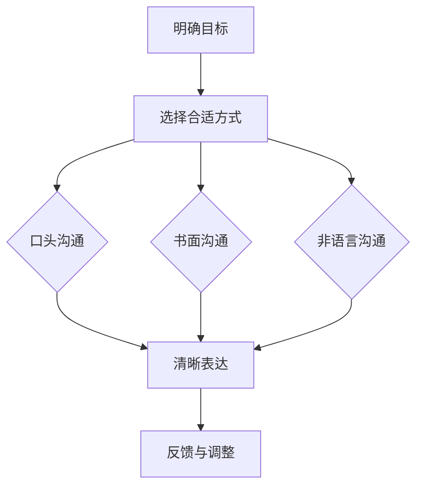
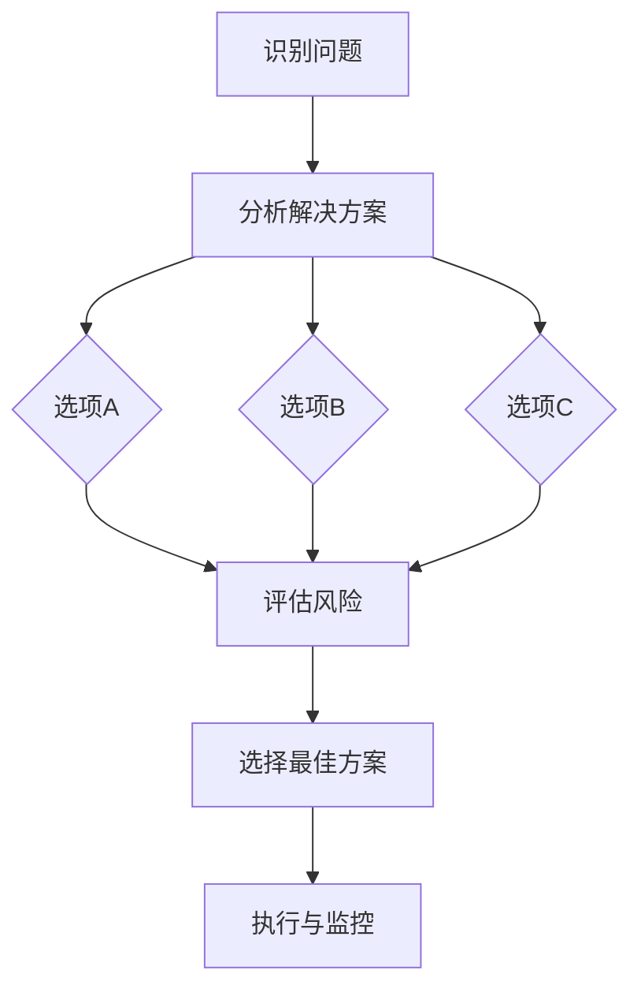
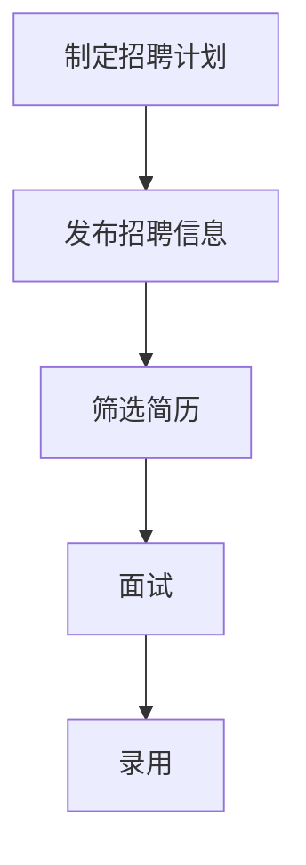
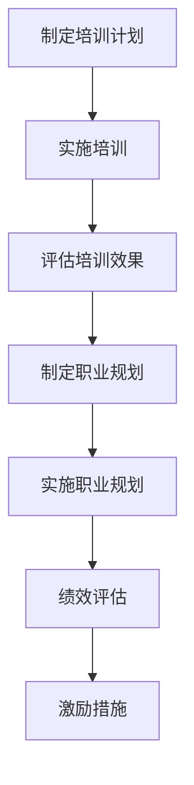
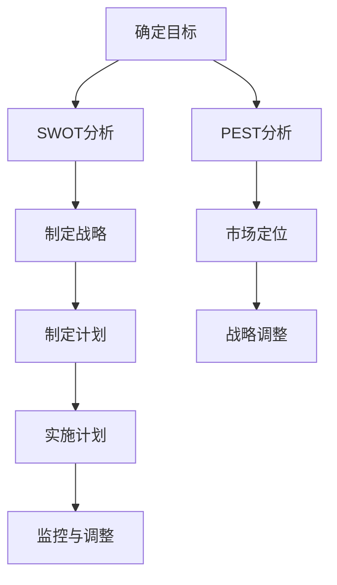
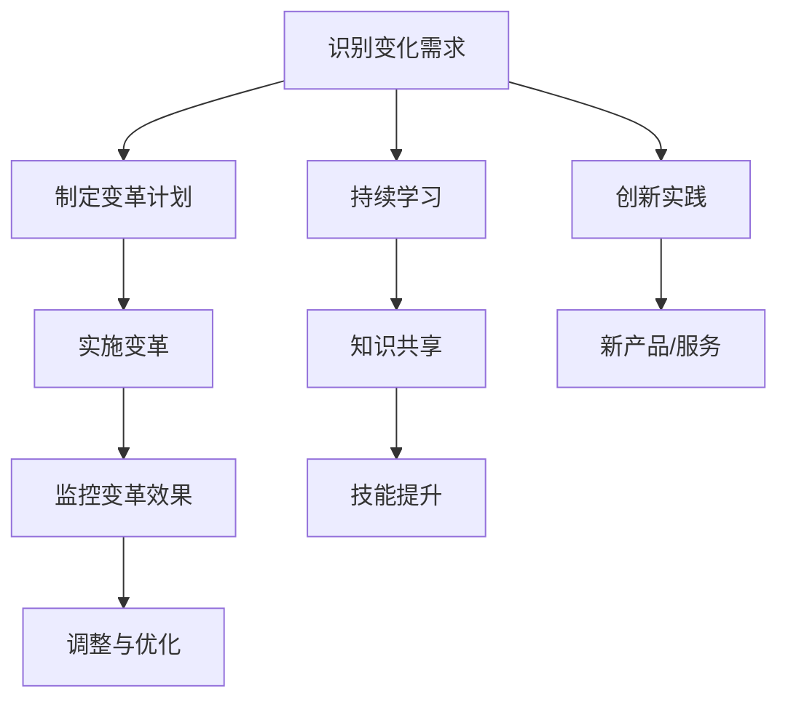
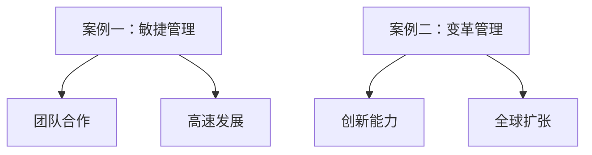
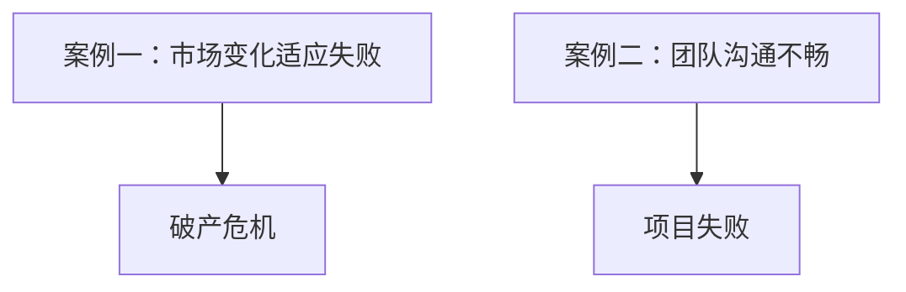
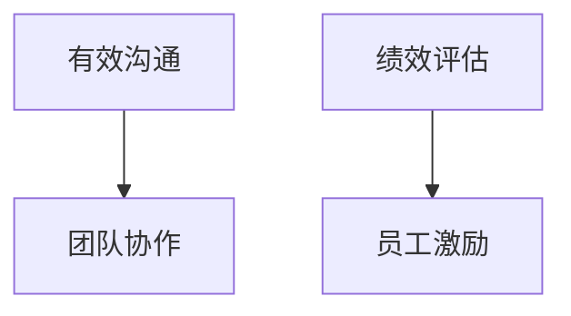
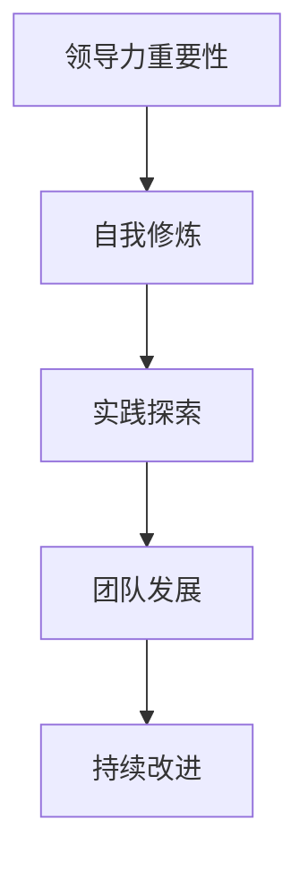

                 


### 管理者自我修炼：提升领导能力的习惯

关键词：领导力，管理者自我修炼，个人成长，领导能力，管理技能

摘要：本文将探讨管理者如何通过自我修炼提升领导能力，包括理解管理哲学、增强领导技能、建立强大团队、战略规划和执行，以及不断改进和适应。通过实际案例分析和反思，为管理者提供实用的指导和建议。

## 第1章 引言与概述

**核心概念介绍**

- 管理自我修炼的定义
- 领导能力的重要性
- 本书结构

## 第2章 理解管理哲学

**核心概念和关系**

- 管理理论概述
- 领导风格和特质分析

### 第2章 理解管理哲学

#### 2.1 管理理论概述

**核心概念原理**

管理理论是研究如何有效地组织和协调人力、物力和财力资源，以实现组织目标的学科。经典的管理理论包括科学管理、行为科学和系统理论。

**概念属性特征对比表格**

| 理论名称 | 核心思想 | 主要代表人物 |
|----------|----------|--------------|
| 科学管理 | 强调效率和标准化流程 | 泰勒 |
| 行为科学 | 关注人际关系和员工行为 | 马斯洛 |
| 系统理论 | 强调组织作为一个整体的动态平衡 | 巴纳德 |

**ER实体关系图架构**

```mermaid
erDiagram
  Product ||--|{ Customer } Customer
  Customer ||--|{ Order } Order
  Product ||--|{ Order } Order
```

#### 2.2 领导风格和特质分析

**核心概念原理**

领导风格是指领导者在领导过程中采取的行为方式，而领导特质则是指领导者天生具备的个性特点。常见的领导风格包括独裁式、民主式和放任式。

**概念属性特征对比表格**

| 领导风格 | 特点 | 适用场景 |
|----------|------|---------|
| 独裁式 | 决策权集中在领导者手中 | 紧急情况或需要快速决策 |
| 民主式 | 允许团队成员参与决策 | 团队合作和集体创造力 |
| 放任式 | 给予团队成员高度自主权 | 高度自我管理和创新能力的团队 |

**ER实体关系图架构**

```mermaid
erDiagram
  Leader ||--|{ LeadershipStyle } LeadershipStyle
  Leader ||--|{ LeadershipTrait } LeadershipTrait
```

### 第3章 增强领导技能

#### 3.1 沟通技能

**核心概念原理**

沟通技能是领导者成功的关键之一，包括清晰表达思想、倾听他人意见和有效传达信息。

**概念属性特征对比表格**

| 沟通技能 | 描述 | 适用场景 |
|----------|------|---------|
| 清晰表达 | 能准确传达意图和信息 | 演讲、汇报、会议 |
| 倾听他人 | 关注他人意见和感受 | 会议、团队讨论、员工反馈 |
| 有效传达 | 选择合适的方式和渠道 | 书面、口头、非语言 |

**mermaid 流程图**



#### 3.2 决策能力

**核心概念原理**

决策能力是领导者处理复杂问题并做出明智决策的能力。决策过程包括识别问题、分析解决方案、评估风险和选择最佳方案。

**概念属性特征对比表格**

| 决策能力 | 描述 | 适用场景 |
|----------|------|---------|
| 问题识别 | 准确识别问题的本质 | 风险评估、需求分析 |
| 分析解决方案 | 评估不同解决方案的优劣 | 选项分析、成本效益 |
| 风险评估 | 评估决策可能带来的风险 | 概率分析、影响分析 |
| 选择最佳方案 | 根据评估结果做出决策 | 综合考虑、权衡利弊 |

**mermaid 流程图**



### 第4章 建立强大团队

#### 4.1 招聘与选拔

**核心概念原理**

招聘和选拔是建立强大团队的第一步，涉及制定招聘计划、发布招聘信息、筛选简历、面试和录用。

**概念属性特征对比表格**

| 招聘与选拔 | 描述 | 适用场景 |
|------------|------|---------|
| 制定招聘计划 | 确定招聘目标和标准 | 人才需求分析、岗位设置 |
| 发布招聘信息 | 招聘渠道和宣传策略 | 网络招聘、猎头推荐、校园招聘 |
| 筛选简历 | 初步筛选应聘者 | 经验要求、技能匹配 |
| 面试 | 确认应聘者能力 | 结构化面试、情境模拟 |
| 录用 | 确定最终人选 | 综合评价、背景调查 |

**mermaid 流程图**



#### 4.2 员工发展

**核心概念原理**

员工发展是提高员工能力和绩效的过程，包括培训、职业规划、绩效评估和激励。

**概念属性特征对比表格**

| 员工发展 | 描述 | 适用场景 |
|----------|------|---------|
| 培训 | 增强员工技能和知识 | 新员工培训、专业技能培训 |
| 职业规划 | 帮助员工明确职业目标 | 职业生涯规划、职业路径设计 |
| 绩效评估 | 评估员工工作表现 | 目标设定、绩效指标、反馈与改进 |
| 激励 | 提高员工工作动力 | 薪酬激励、晋升机会、认可与奖励 |

**mermaid 流程图**



### 第5章 战略规划与执行

#### 5.1 战略规划模型

**核心概念原理**

战略规划是组织为了实现长期目标而制定的总体行动计划。常见的战略规划模型包括SWOT分析和PEST分析。

**概念属性特征对比表格**

| 战略规划模型 | 描述 | 适用场景 |
|--------------|------|---------|
| SWOT分析 | 评估组织的优势、劣势、机会和威胁 | 长期规划、竞争分析 |
| PEST分析 | 分析外部环境中的政治、经济、社会和技术因素 | 外部环境评估、市场定位 |

**mermaid 流程图**



### 第6章 持续改进与适应

#### 6.1 适应性策略

**核心概念原理**

持续改进和适应是组织长期成功的关键，涉及管理变革、持续学习和创新。

**概念属性特征对比表格**

| 适应性策略 | 描述 | 适用场景 |
|------------|------|---------|
| 变革管理 | 引导组织适应变化 | 面对市场波动、技术革新 |
| 持续学习 | 提高组织成员的知识和技能 | 面对新挑战、持续发展 |
| 创新 | 推动组织持续发展 | 开发新产品、新服务 |

**mermaid 流程图**



### 第7章 案例研究与实际应用

#### 7.1 成功案例

**核心概念原理**

通过分析成功的管理案例，可以了解优秀管理者的实践经验和关键成功因素。

**案例研究**

- 案例一：某互联网公司通过敏捷管理和团队合作实现高速发展。
- 案例二：某跨国公司通过变革管理和创新能力实现全球扩张。

**mermaid 流程图**



#### 7.2 挑战与教训

**核心概念原理**

通过分析失败的管理案例，可以了解常见的挑战和教训，避免重复错误。

**案例研究**

- 案例一：某传统企业因未能及时适应市场变化而面临破产。
- 案例二：某初创公司因团队沟通不畅导致项目失败。

**mermaid 流程图**



#### 7.3 实际应用

**核心概念原理**

将领导技能和管理理论应用于实际工作场景，提高管理效率和团队绩效。

**实际应用**

- 如何通过有效沟通提高团队协作效率？
- 如何进行有效的绩效评估和激励措施？

**mermaid 流程图**



### 第8章 结论与反思

**核心概念原理**

总结本书的核心内容，强调领导力的重要性，鼓励管理者在实践中不断探索和提升。

**总结**

- 领导力是管理者成功的关键。
- 通过自我修炼和实践，管理者可以不断提升领导能力。
- 领导者应关注团队成员的发展，推动组织持续改进和适应变化。

**mermaid 流程图**



### 附录：拓展阅读

- [1] 马克·麦克莱恩，《领导力：如何影响和激励他人》
- [2] 彼得·德鲁克，《管理的实践》
- [3] 约翰·肯尼斯·加百利，《领导力的五项修炼》

---

**作者：AI天才研究院/AI Genius Institute & 禅与计算机程序设计艺术 /Zen And The Art of Computer Programming**

