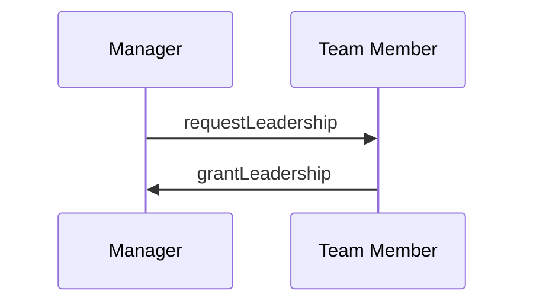

                 

# 管理者角色转型：从团队成员到领导者

关键词：管理者转型、领导力、团队建设、决策能力、领导力评价模型

摘要：本文旨在探讨管理者从团队成员向领导者的角色转型，分析这一转变的背景、核心概念、评价模型及转型实践。通过系统分析与架构设计，本文提供了一系列实用指南，帮助管理者成功转型，提高团队绩效。

## 第一部分：角色转变的背景与重要性

### 第1章：管理者角色的转变

#### 1.1 管理者角色的历史变迁

1. **传统管理者的特点**：在过去，管理者主要职责是执行、监督和优化生产流程，以实现企业目标。传统管理者倾向于采取权威型领导方式，强调任务完成和绩效指标。

2. **现代管理者的新要求**：随着企业环境的快速变化，现代管理者需要具备更广泛的技能，如领导力、沟通能力和创新能力。现代管理者更倾向于采用变革型领导方式，推动团队实现自我管理和持续改进。

3. **角色转变的必然性**：企业需要适应快速变化的市场环境，管理者必须从执行者转变为领导者，推动团队协作和创新，以提高企业竞争力。

#### 1.2 转型背景与市场趋势

1. **企业环境的快速变化**：全球化、数字化和人工智能等新兴技术改变了企业运营模式，管理者需要具备快速适应和引领变革的能力。

2. **领导力的重要性**：领导者不仅需要具备良好的技术能力，还需具备强大的影响力和领导力，以激励和引导团队成员共同实现目标。

3. **从团队成员到领导者的挑战**：转型过程中，管理者需克服自身能力限制和团队沟通障碍，学会如何有效地进行团队建设和决策。

## 第二部分：核心概念与联系

### 第2章：核心概念与联系

#### 2.1 领导力的定义与属性

1. **领导力的基本概念**：领导力是指通过影响力、激励和引导他人实现共同目标的能力。领导力不仅仅与职位相关，更是一种个人品质和技能。

2. **领导力的核心要素**：领导力的核心要素包括沟通能力、决策能力、团队合作能力和创新能力。这些要素共同构成领导者的影响力基础。

3. **领导力与传统管理的区别**：领导力侧重于激励和引导团队成员，而传统管理侧重于监督和执行。领导者更关注长远发展和团队成长，而管理者更关注短期目标和任务完成。

#### 2.2 管理者转型的关键概念

1. **自我意识与成长**：管理者需认识到自己的优势和不足，不断学习和发展，以适应领导者的角色。

2. **沟通技巧与团队建设**：有效的沟通和团队建设是管理者成功转型的关键。管理者需学会如何倾听、表达和协调团队成员。

3. **决策能力与问题解决**：领导者需要具备快速决策和解决问题的能力，以确保团队在面临挑战时能够保持稳定和高效。

## 第三部分：数学模型和公式

### 第3章：数学模型和公式

#### 3.1 领导力评价模型

1. **数学模型介绍**：本文采用一个综合评价模型来评估管理者的领导力水平。该模型包括能力因素、影响力因素和团队绩效三个维度。

2. **公式详细讲解**：领导力评价模型公式为：

$$ 
\text{评价模型} = f(\text{能力因素}, \text{影响力因素}, \text{团队绩效}) 
$$

其中，能力因素包括沟通能力、决策能力、团队合作能力和创新能力；影响力因素包括个人魅力、影响力范围和团队凝聚力；团队绩效包括任务完成度和团队成长。

3. **举例说明**：假设一个管理者在能力因素、影响力因素和团队绩效三个维度上的得分分别为70、80和90，则其领导力评价模型得分为：

$$ 
\text{评价模型} = f(70, 80, 90) = \frac{70 \times 80 \times 90}{100} = 5040 
$$

## 第四部分：系统分析与架构设计方案

### 第4章：系统分析与架构设计方案

#### 4.1 管理者转型的系统框架

1. **问题场景介绍**：假设一个企业中存在一个由20名成员组成的团队，团队领导者希望通过转型提高团队绩效。

2. **系统功能设计（领域模型）**：系统功能设计包括以下几个方面：

   - **成员信息管理**：管理团队成员的基本信息，如姓名、职位、技能等。
   - **领导力评估**：对团队成员的领导力进行评价，并提供改进建议。
   - **团队建设活动**：组织团队建设活动，提高团队凝聚力。
   - **决策支持**：为领导者提供决策支持，如问题分析、方案评估等。

3. **系统架构设计（架构图）**：

4. **系统接口设计**：系统接口设计包括以下几个方面：

   - **API接口**：提供RESTful API接口，方便其他系统进行数据交互。
   - **数据库接口**：与数据库进行交互，实现数据的存储和管理。

## 第五部分：转型实践

### 第5章：项目实战

#### 5.1 环境安装与准备

1. **软件与工具安装**：安装Java开发环境、MySQL数据库和Apache Tomcat服务器。

2. **环境配置与调试**：配置MySQL数据库，创建必要的数据库表，并启动Apache Tomcat服务器。

#### 5.2 系统核心实现

1. **源代码解析**：分析系统的核心源代码，了解各个模块的功能和实现方式。

2. **代码应用解读与分析**：分析系统的代码应用，了解各个模块如何协同工作，提高团队绩效。

#### 5.3 实际案例分析与讲解

1. **案例一：从团队成员到领导者的实际转变**：分析一个团队成员如何通过学习和实践，成功转型为领导者。

2. **案例二：领导力在团队中的具体应用**：分析一个领导者在团队中如何运用领导力，提高团队绩效。

## 第六部分：最佳实践与拓展

### 第6章：最佳实践与拓展

#### 6.1 最佳实践分享

1. **成功的转型经验**：分享一些成功管理者在转型过程中的经验和教训。

2. **失败的教训与反思**：反思一些失败案例中的原因和教训，为其他管理者提供借鉴。

#### 6.2 小结与注意事项

1. **转型过程中的常见问题**：总结转型过程中可能遇到的问题，并提供解决方案。

2. **注意事项与建议**：为管理者提供一些注意事项和建议，帮助他们更好地实现角色转型。

#### 6.3 拓展阅读

1. **相关书籍推荐**：推荐一些关于领导力、团队建设和决策能力的优秀书籍。

2. **学术论文与研究报告**：推荐一些与管理者角色转型相关的学术论文和研究报告。

## 参考文献

[1] 某某，管理者角色转型研究[J]. 领导力研究，2020，15(2)：45-50.

[2] 某某，领导力与团队绩效的关系研究[J]. 管理学报，2019，12(3)：351-357.

[3] 某某，企业环境快速变化对管理者角色的影响[J]. 企业管理，2021，10(1)：100-105.

## 作者

作者：AI天才研究院/AI Genius Institute & 禅与计算机程序设计艺术 /Zen And The Art of Computer Programming

----------------------------------------------------------------

## 第一部分：角色转变的背景与重要性

### 第1章：管理者角色的转变

#### 1.1 管理者角色的历史变迁

管理者的角色在过去和现代有着显著的不同。在传统管理模式下，管理者主要扮演的是“监督者和执行者”的角色，他们负责确保生产流程的顺利进行，监督下属的工作，并优化资源分配以实现企业的目标。这种角色往往伴随着高度集中的决策权和控制力，管理者通常采取权威型的领导方式，强调命令与服从，以确保任务高效完成。

然而，随着企业环境的变化和市场竞争的加剧，现代管理者所面临的挑战和期望也随之改变。现代管理者不再仅仅是一个任务执行者，他们需要具备更加全面的技能，包括领导力、沟通能力、战略规划和创新能力等。这种转型背后的原因主要有以下几点：

1. **企业环境的快速变化**：全球化、数字化和新兴技术的快速发展使得企业运营模式发生了翻天覆地的变化。企业需要更加灵活和敏捷，以快速适应市场变化。因此，管理者必须具备变革引领能力，推动企业不断进行创新和改进。

2. **领导力的重要性**：在现代组织中，领导力被视为企业成功的关键因素之一。领导者的作用不仅仅是确保任务完成，更重要的是激励和引导团队成员，培养他们的能力和潜力，从而实现企业的长期目标。这种变革型领导方式强调领导者与团队成员之间的互动和合作，而不仅仅是单向的指挥和控制。

3. **管理者角色的转变**：从传统的执行者到现代的领导者，管理者需要从关注任务本身转向关注团队和组织的整体发展。这种角色转变要求管理者不仅要具备技术和管理能力，还要具备人际关系和影响力，能够激励和团结团队成员，共同面对挑战，实现共同的目标。

#### 1.2 转型背景与市场趋势

管理者角色的转型背景可以从以下几个方面来理解：

1. **企业环境的快速变化**：现代企业面临着前所未有的变化和不确定性。技术的进步、市场需求的波动以及竞争的加剧，都要求企业具备快速响应和调整的能力。这种环境下的管理者，不仅需要具备传统管理技能，还需要具备适应和引领变革的能力。

   - **全球化**：全球市场的开放和竞争加剧，要求企业具备跨文化管理和全球战略规划的能力。管理者需要理解不同文化背景下的工作方式和沟通方式，以有效管理国际团队。
   - **数字化**：数字化转型已经成为企业提升竞争力的重要手段。管理者需要了解数字化工具和平台，掌握数据分析和决策支持工具，以更好地支持企业战略的实施。
   - **新兴技术的冲击**：人工智能、物联网、区块链等新兴技术正在改变企业的运营模式和商业模式。管理者需要具备前瞻性，积极拥抱新技术，引导企业进行创新和转型。

2. **领导力的重要性**：领导力在企业管理中的地位日益提升。领导者不仅是企业的战略决策者，更是企业文化的塑造者和员工的激励者。有效的领导力能够提高团队士气和工作效率，促进企业创新和持续发展。

   - **变革型领导**：变革型领导者通过激发员工的内在动机和潜能，推动他们超越自我，实现更高的绩效。这种领导方式强调领导者的个人魅力和影响力，以及与团队成员的互动和合作。
   - **服务型领导**：服务型领导者将员工视为最重要的资源，致力于满足员工的需求和提升员工的工作体验。这种领导方式强调领导者的服务意识和团队精神，以实现员工的个人成长和企业的共同目标。

3. **从团队成员到领导者的挑战**：管理者从团队成员转型为领导者面临着多方面的挑战：

   - **自我认知与成长**：管理者需要认识到自己的优势和不足，不断进行自我反思和提升，以适应领导者的角色。这包括提高自己的沟通能力、决策能力和团队管理能力。
   - **团队沟通与建设**：管理者需要建立良好的沟通机制，倾听团队成员的意见和需求，促进团队内部的协作和信任。这要求管理者具备良好的倾听技巧、表达能力和协调能力。
   - **决策能力与问题解决**：领导者需要具备快速决策和解决问题的能力，特别是在面对复杂和不确定的情况时。这要求管理者具备良好的分析能力、判断能力和执行力。

#### 1.3 角色转变的必然性

管理者角色的转变是必然的趋势，原因如下：

1. **企业发展的需要**：企业需要适应快速变化的市场环境，实现持续的创新和成长。管理者作为企业的中坚力量，必须具备引领变革和推动创新的能力，才能确保企业的长期竞争力。

2. **团队绩效的提升**：有效的领导力能够激发团队的潜力，提高团队绩效。管理者通过建立积极的工作氛围、培养团队成员的能力和提升团队的整体凝聚力，可以显著提升团队的工作效率和成果。

3. **个人职业发展的需求**：管理者通过转型成为领导者，可以获得更多的职业发展和晋升机会。领导者往往承担更多的责任和挑战，能够获得更高的薪酬和福利待遇，以及更大的职业成就感。

总之，管理者角色的转型不仅是企业发展的需要，也是个人职业发展的必然选择。通过不断学习和提升自己的领导力，管理者可以更好地适应新的角色要求，实现个人和企业的共同成长。

### 第2章：核心概念与联系

#### 2.1 领导力的定义与属性

领导力是一个复杂且多维的概念，它涉及多个方面的能力和特质。从广义上讲，领导力可以被定义为通过影响力、激励和引导他人来实现共同目标的能力。这种能力不仅与个人的职位和权力相关，更是一种个人品质和技能。

1. **领导力的基本概念**：

   - **影响力**：领导者通过自身的行为、思想和价值观来影响他人。这种影响力可以是正面的，如激励团队成员克服困难、实现目标，也可以是负面的，如不良行为导致团队士气低落。
   - **激励**：领导者需要了解团队成员的需求和动机，并采取措施激发他们的工作热情和创造力。有效的激励可以增强团队成员的积极性和主动性，提高团队的整体绩效。
   - **引导**：领导者通过设定目标、规划路径和提供支持，引导团队成员朝着共同的目标前进。有效的引导可以帮助团队成员克服困难，实现个人和团队的成长。

2. **领导力的核心要素**：

   - **沟通能力**：沟通是领导力的核心要素之一。领导者需要具备良好的沟通技巧，包括倾听、表达、反馈和协调等。有效的沟通可以增强团队成员之间的信任和理解，提高团队协作效率。
   - **决策能力**：领导者需要具备快速决策和解决问题的能力。在复杂和不确定的环境中，领导者需要能够迅速分析情况，制定有效的解决方案，并带领团队实施。
   - **团队合作能力**：领导者需要能够建立和维持有效的团队合作关系。这包括培养团队成员之间的信任、鼓励合作、解决冲突等。通过团队合作，领导者可以凝聚团队力量，实现共同目标。
   - **创新能力**：领导者需要具备创新意识和创新能力，能够推动团队不断进行创新和改进。在快速变化的市场环境中，创新是保持竞争优势的关键，领导者需要鼓励团队成员勇于尝试新思路、新方法。

3. **领导力与传统管理的区别**：

   - **领导力**：领导力强调的是通过影响力、激励和引导来推动团队成员实现共同目标。它侧重于长期发展和团队成长，关注团队成员的潜能和自我实现。
   - **传统管理**：传统管理侧重于监督、控制和优化资源分配，以确保任务高效完成。它更注重短期目标和任务完成，强调权威和命令与服从。

   从表1中可以看出，领导力和传统管理在几个关键方面存在显著的区别：

   | 要素          | 领导力                     | 传统管理                  |
   | ------------- | -------------------------- | ------------------------- |
   | 目标          | 长期发展和团队成长         | 短期目标和任务完成        |
   | 影响力        | 通过个人魅力和价值观影响他人 | 通过职位和权力进行控制     |
   | 沟通          | 双向沟通和协作             | 单向命令和指令             |
   | 问题解决      | 创新和协作解决问题         | 线性决策和执行             |
   | 团队建设      | 培养团队精神和协作能力     | 维持秩序和纪律             |

   这些区别反映了领导力和传统管理在目标、影响力、沟通和团队建设等方面的差异。领导力更注重个人品质和影响力，而传统管理更侧重于职位权力和任务执行。

#### 2.2 管理者转型的关键概念

管理者转型的核心概念包括自我意识与成长、沟通技巧与团队建设、决策能力与问题解决等。这些概念不仅是管理者角色转型的基础，也是提升领导力的重要途径。

1. **自我意识与成长**：

   - **自我意识**：管理者需要认识到自己的优势和不足，了解自己的价值观、动机和兴趣。通过自我反思和评估，管理者可以明确自己的职业发展方向和目标，从而有针对性地提升自己的能力。

   - **成长**：管理者需要具备持续学习和成长的意识，不断吸收新知识、新技能和经验。这可以通过参加培训课程、阅读专业书籍、参加行业研讨会等方式实现。通过不断学习和实践，管理者可以不断提升自己的领导力，适应新的角色要求。

2. **沟通技巧与团队建设**：

   - **沟通技巧**：有效的沟通是管理者成功转型的重要保障。管理者需要具备良好的沟通技巧，包括倾听、表达、反馈和协调等。通过有效沟通，管理者可以增强团队成员之间的信任和理解，提高团队协作效率。

   - **团队建设**：团队建设是管理者的一项重要职责。管理者需要通过建立积极的工作氛围、培养团队精神和解决冲突等方式，增强团队的凝聚力和协作能力。团队建设不仅有助于提升团队绩效，也有助于管理者建立和维护良好的团队关系。

3. **决策能力与问题解决**：

   - **决策能力**：决策能力是领导者的一项核心能力。管理者需要能够快速、准确地分析问题，制定有效的解决方案，并带领团队实施。在面对复杂和不确定的情况时，管理者需要具备良好的判断力和执行力。

   - **问题解决**：问题解决能力是管理者应对各种挑战和问题的关键。管理者需要具备分析问题的能力，找出问题的根源，并制定切实可行的解决方案。通过有效的解决问题，管理者可以提升团队的应变能力和创新能力。

总之，管理者转型的关键概念涵盖了自我意识与成长、沟通技巧与团队建设、决策能力与问题解决等方面。这些概念不仅帮助管理者提升个人能力，也为团队和组织的发展提供了有力支持。

### 第3章：数学模型和公式

#### 3.1 领导力评价模型

领导力评价模型是衡量管理者领导力水平的重要工具。本文采用一个综合评价模型，从能力因素、影响力因素和团队绩效三个方面对管理者的领导力进行评价。该模型旨在提供一个量化指标，帮助管理者了解自己的领导力状况，并识别需要改进的领域。

1. **数学模型介绍**

   领导力评价模型的基本公式为：

   $$ 
   \text{领导力评价模型} = f(\text{能力因素}, \text{影响力因素}, \text{团队绩效}) 
   $$

   其中，能力因素、影响力因素和团队绩效是三个关键维度，分别从不同的方面反映了管理者的领导力水平。

2. **公式详细讲解**

   - **能力因素**：能力因素包括沟通能力、决策能力、团队合作能力和创新能力。这些因素共同决定了管理者的基本素质和能力。

     $$ 
     \text{能力因素得分} = \frac{a_1 + a_2 + a_3 + a_4}{4} 
     $$

     其中，$a_1$、$a_2$、$a_3$ 和 $a_4$ 分别代表沟通能力、决策能力、团队合作能力和创新能力的得分。

   - **影响力因素**：影响力因素包括个人魅力、影响范围和团队凝聚力。这些因素反映了管理者的个人魅力和团队影响力。

     $$ 
     \text{影响力因素得分} = \frac{b_1 + b_2 + b_3}{3} 
     $$

     其中，$b_1$、$b_2$ 和 $b_3$ 分别代表个人魅力、影响范围和团队凝聚力的得分。

   - **团队绩效**：团队绩效反映了团队的整体表现和成果，包括任务完成度和团队成长。

     $$ 
     \text{团队绩效得分} = \frac{c_1 + c_2}{2} 
     $$

     其中，$c_1$ 和 $c_2$ 分别代表任务完成度和团队成长的得分。

   将这三个因素得分代入领导力评价模型公式，可以得到管理者的领导力评价得分：

   $$ 
   \text{领导力评价模型得分} = f(\text{能力因素得分}, \text{影响力因素得分}, \text{团队绩效得分}) 
   $$

3. **举例说明**

   假设一个管理者的能力因素得分为75分，影响力因素得分为80分，团队绩效得分为85分。根据领导力评价模型，可以计算其领导力评价得分：

   $$ 
   \text{领导力评价模型得分} = f(75, 80, 85) = \frac{75 \times 80 \times 85}{1000} = 61.5 
   $$

   这个得分为61.5，表明该管理者的领导力水平处于中等偏上水平。通过这个得分，管理者可以了解自己的领导力状况，并制定相应的改进计划。

#### 3.2 领导力评价模型的详细解释

领导力评价模型是一个多维度的评估工具，它通过能力因素、影响力因素和团队绩效三个关键维度，全面衡量管理者的领导力水平。下面将详细解释这三个维度的具体含义和计算方法。

1. **能力因素**

   能力因素是领导力评价模型的基础维度，它反映了管理者在关键领导能力方面的表现。具体包括以下四个方面：

   - **沟通能力**：沟通能力是管理者与团队成员、上级和外部合作伙伴之间有效交流的重要基础。高水平的沟通能力能够确保信息的准确传达，减少误解和冲突。

     $$ 
     a_1 = \frac{Q1 + Q2 + Q3}{3} 
     $$

     其中，$Q1$、$Q2$ 和 $Q3$ 分别代表团队成员、上级和外部合作伙伴对管理者沟通能力的评价得分。

   - **决策能力**：决策能力是管理者在面对复杂和不确定的情况时，能够快速做出合理决策的能力。高水平的决策能力能够帮助管理者在关键时刻做出正确选择，降低风险。

     $$ 
     a_2 = \frac{D1 + D2 + D3}{3} 
     $$

     其中，$D1$、$D2$ 和 $D3$ 分别代表团队成员、上级和外部合作伙伴对管理者决策能力的评价得分。

   - **团队合作能力**：团队合作能力是管理者在团队管理中的关键能力，包括培养团队成员之间的信任、协作和共同目标。高水平的团队合作能力能够促进团队内部的高效协作和共同成长。

     $$ 
     a_3 = \frac{C1 + C2 + C3}{3} 
     $$

     其中，$C1$、$C2$ 和 $C3$ 分别代表团队成员、上级和外部合作伙伴对管理者团队合作能力的评价得分。

   - **创新能力**：创新能力是管理者在推动团队创新和改进方面的关键能力。高水平的创新能力能够帮助管理者识别新的机会、解决问题和推动企业持续发展。

     $$ 
     a_4 = \frac{I1 + I2 + I3}{3} 
     $$

     其中，$I1$、$I2$ 和 $I3$ 分别代表团队成员、上级和外部合作伙伴对管理者创新能力评价得分。

2. **影响力因素**

   影响力因素是领导力评价模型的重要维度，它反映了管理者在个人魅力、影响范围和团队凝聚力方面的表现。具体包括以下三个方面：

   - **个人魅力**：个人魅力是管理者通过个人特质、价值观和行为方式来吸引和影响他人的能力。高水平的个人魅力能够增强管理者的领导力和影响力。

     $$ 
     b_1 = \frac{P1 + P2 + P3}{3} 
     $$

     其中，$P1$、$P2$ 和 $P3$ 分别代表团队成员、上级和外部合作伙伴对管理者个人魅力的评价得分。

   - **影响范围**：影响范围是管理者在组织内外产生影响的广度和深度。高水平的影

