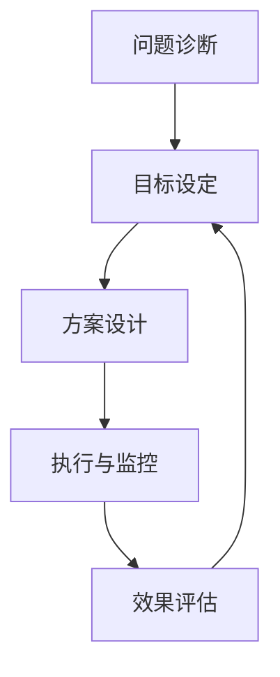
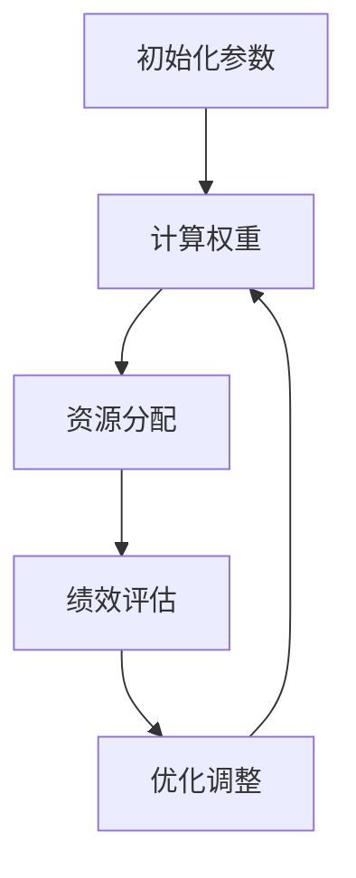
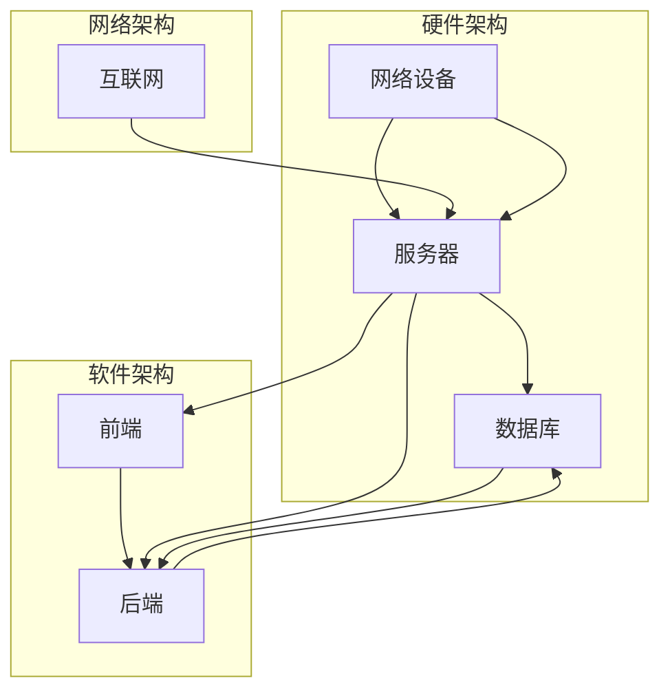
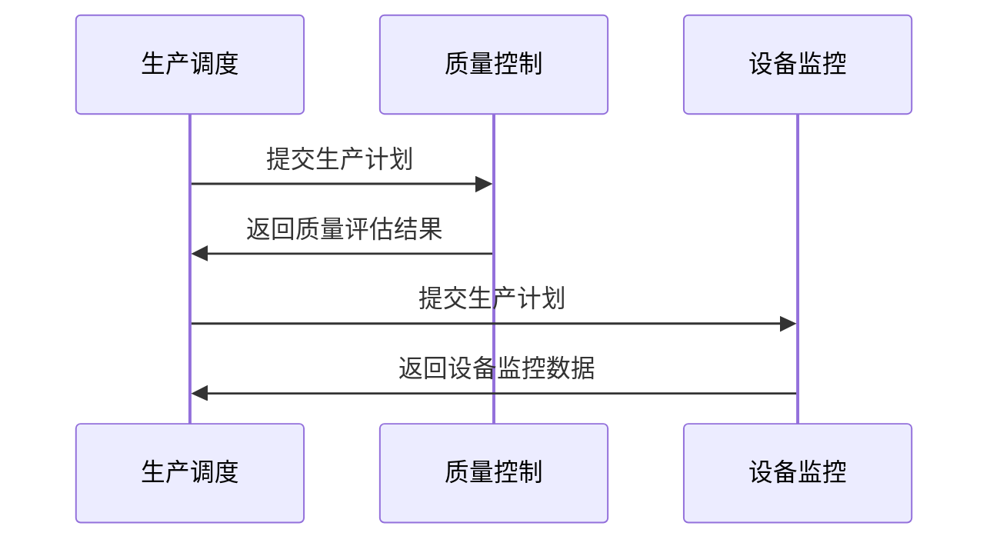

                 


## 绩效改进：持续优化的方法论

> 关键词：绩效改进，持续优化，方法论，流程，实践，数学模型，系统架构，案例

> 摘要：
本文将围绕“绩效改进：持续优化的方法论”这一主题，详细阐述绩效改进的重要性与挑战，理论和方法，实践与应用，以及绩效改进的数学模型与算法原理。同时，通过具体的系统架构设计和项目实战，为读者提供一套完整、可操作的绩效改进方法论。

----------------------------------------------------------------

## 引言

在当今快速变化的市场环境中，企业的绩效成为其竞争力的关键因素。绩效改进不仅关系到企业的生存和发展，更影响着员工的积极性和工作满意度。然而，如何有效地进行绩效改进，成为众多企业面临的难题。本文旨在探讨绩效改进的方法论，为企业和个人提供一套系统、全面的解决方案。

### 背景介绍

绩效改进是指通过不断优化管理、流程、技术和文化等方面，提高组织或个人的工作绩效。它不仅关注短期的绩效提升，更强调长期的持续优化。绩效改进的核心目标是提高效率、降低成本、提升客户满意度，并培养员工的技能和素质。

当前，企业面临的主要绩效问题包括：

1. **资源浪费**：人力资源、财务资源、物资资源等没有得到充分利用。
2. **流程瓶颈**：关键业务流程存在瓶颈，影响工作效率。
3. **技能不足**：员工缺乏必要的技能和知识，无法胜任工作。
4. **文化问题**：组织文化不利于创新和协作。

### 问题描述

绩效改进的挑战主要体现在以下几个方面：

1. **数据获取与处理**：绩效改进需要大量的数据支持，但数据的获取和处理往往是复杂的。
2. **方法选择**：绩效改进的方法众多，如何选择适合的方法是一个难题。
3. **执行难度**：绩效改进需要全员参与，但执行力不足是一个普遍问题。
4. **持续优化**：绩效改进不是一蹴而就的过程，需要持续不断地优化。

### 问题解决

要解决上述问题，我们需要从以下几个方面入手：

1. **明确目标**：设定清晰的绩效改进目标，确保各方统一认识。
2. **数据驱动**：利用数据分析工具，获取和处理绩效数据。
3. **科学方法**：选择合适的绩效改进方法，如六西格玛、精益管理、标杆管理等。
4. **全员参与**：建立激励机制，鼓励员工积极参与绩效改进。
5. **持续优化**：制定长期绩效改进计划，持续跟踪和优化。

### 边界与外延

绩效改进不仅适用于企业，也适用于个人和组织。对于个人而言，绩效改进关注的是个人职业发展和技能提升；对于组织而言，绩效改进关注的是整体绩效的提升和组织文化的建设。

### 概念结构与核心要素组成

绩效改进的核心概念包括：

1. **绩效**：衡量工作结果和效率的指标。
2. **改进**：通过优化管理、流程、技术和文化等方面，提高绩效。
3. **方法论**：一套系统、全面的方法和工具，用于指导绩效改进。
4. **持续优化**：绩效改进的长期过程，注重持续的改进和优化。

核心要素包括：

- **数据**：绩效改进的基础。
- **方法**：实现绩效改进的工具。
- **执行力**：绩效改进的关键。
- **文化**：绩效改进的保障。

## 核心概念与联系

### 绩效改进的核心概念

1. **绩效**：绩效是衡量工作结果和效率的指标。它包括质量、效率、成本等多个方面。
2. **改进**：改进是通过优化管理、流程、技术和文化等方面，提高绩效。
3. **方法论**：方法论是一套系统、全面的方法和工具，用于指导绩效改进。
4. **持续优化**：持续优化是绩效改进的长期过程，注重持续的改进和优化。

### 概念属性特征对比表格

| 概念       | 定义                                       | 属性特征                                                     |
|------------|--------------------------------------------|--------------------------------------------------------------|
| 绩效       | 衡量工作结果和效率的指标                   | 结果性、效率性、多维度性                                     |
| 改进       | 通过优化管理、流程、技术和文化等方面，提高绩效 | 目标性、系统性、动态性                                       |
| 方法论     | 系统指导绩效改进的方法和工具               | 实用性、可操作性、全面性                                     |
| 持续优化   | 长期绩效改进过程                           | 持续性、优化性、反馈性                                       |

### 概念的联系

绩效、改进、方法论和持续优化之间紧密相连。绩效是改进的出发点和目标，改进是实现绩效提升的手段，方法论是指导改进的工具，而持续优化则是改进的持续过程。它们共同构成了绩效改进的核心概念体系。

### 绩效改进的ER实体关系图架构

```mermaid
erDiagram
  绩效 ||--|{ 改进 }|| 方法论
  绩效 ||--|{ 持续优化 }|| 改进
  方法论 ||--|{ 持续优化 }|| 改进
```

这个ER图展示了绩效、改进、方法论和持续优化之间的实体关系。绩效是核心实体，改进和方法论是关联实体，持续优化是改进的持续过程。

## 绩效改进的方法论

### 绩效改进的流程

绩效改进的流程可以分为以下几个阶段：

1. **问题诊断**：识别存在的问题和瓶颈。
2. **目标设定**：明确绩效改进的目标和预期成果。
3. **方案设计**：制定具体的改进方案和行动计划。
4. **执行与监控**：实施改进方案，并进行实时监控。
5. **效果评估**：评估改进方案的效果，并进行调整。

### 各阶段的方法与工具

1. **问题诊断**

   - 工具：数据收集工具、访谈问卷、流程图。
   - 方法：数据分析、流程分析、瓶颈分析。

2. **目标设定**

   - 工具：SMART目标设定法。
   - 方法：目标分解、资源评估。

3. **方案设计**

   - 工具：鱼骨图、头脑风暴、项目管理工具。
   - 方法：问题解决方案设计、资源调配。

4. **执行与监控**

   - 工具：项目管理软件、进度跟踪工具。
   - 方法：进度控制、风险管理。

5. **效果评估**

   - 工具：绩效评估工具、数据统计软件。
   - 方法：效果分析、反馈调整。

### 绩效改进流程图



这个流程图展示了绩效改进的主要阶段和步骤，以及它们之间的逻辑关系。

## 绩效改进的实践与应用

### 案例研究

#### 案例一：某制造企业的绩效改进实践

某制造企业在生产过程中遇到了效率低下、产品质量不稳定的问题。为了解决这些问题，企业决定进行绩效改进。

1. **问题诊断**：通过数据分析、流程分析等方法，识别出生产流程中的瓶颈和问题。

2. **目标设定**：设定明确的绩效改进目标，如提高生产效率、降低产品不良率。

3. **方案设计**：制定详细的改进方案，包括优化生产流程、提升员工技能、引入精益管理方法等。

4. **执行与监控**：实施改进方案，并设立监控机制，确保改进措施的落实。

5. **效果评估**：通过数据统计，评估改进方案的效果。结果显示，生产效率提高了20%，产品不良率降低了30%。

#### 案例二：某服务业的绩效优化实例

某服务业公司因为客户满意度低、员工离职率高而面临挑战。为了提升绩效，公司决定进行绩效优化。

1. **问题诊断**：通过客户反馈、员工访谈等方法，了解客户需求和员工不满的原因。

2. **目标设定**：设定提升客户满意度、降低员工离职率的绩效目标。

3. **方案设计**：制定详细的优化方案，包括改善客户服务流程、提升员工培训、调整薪酬制度等。

4. **执行与监控**：实施优化方案，并设立监控机制，确保优化措施的落实。

5. **效果评估**：通过客户满意度调查、员工满意度调查等方式，评估优化方案的效果。结果显示，客户满意度提高了15%，员工离职率降低了10%。

### 常见问题与解决策略

1. **数据获取与处理**：解决策略包括引入数据分析工具、建立数据收集机制。

2. **方法选择**：解决策略包括咨询专家、进行方法评估。

3. **执行难度**：解决策略包括建立激励机制、加强员工培训。

4. **持续优化**：解决策略包括制定长期计划、设立反馈机制。

## 绩效改进的数学模型与算法原理

### 数学模型基础

绩效评估的数学模型可以表示为：

$$
绩效得分 = f(工作量，效率，质量)
$$

其中，工作量和效率是关键指标，质量则是重要的评价维度。

### 影响绩效的关键因素分析

影响绩效的关键因素包括：

1. **工作量**：指完成工作的数量和质量。
2. **效率**：指完成工作所需的时间和资源。
3. **质量**：指工作的质量和满意度。

这些因素通过以下公式相互影响：

$$
绩效得分 = 工作量 \times 效率 \times 质量系数
$$

### 算法原理讲解

#### 绩效改进的核心算法

核心算法是一个基于权重分配的优化算法，其目的是在给定资源约束下，最大化绩效得分。

#### 算法mermaid流程图



#### 算法Python源代码与解释

```python
# Python代码实现
def performance_improvement(workload, efficiency, quality_coefficient):
    performance_score = workload * efficiency * quality_coefficient
    return performance_score

# 参数设置
workload = 100  # 工作量
efficiency = 0.8  # 效率
quality_coefficient = 1.2  # 质量系数

# 计算绩效得分
performance_score = performance_improvement(workload, efficiency, quality_coefficient)
print("绩效得分：", performance_score)
```

这个算法通过调整权重参数，实现绩效得分的最大化。

## 绩效改进的系统分析与架构设计

### 问题场景介绍

假设某公司需要对其生产线进行绩效改进，以提高生产效率和产品质量。公司现有资源包括生产设备、原材料、人力资源等。

### 项目介绍

本项目旨在通过系统架构设计和实施，实现生产线的绩效改进。项目主要包括以下几个方面：

1. **系统需求分析**：明确系统功能需求和技术要求。
2. **系统架构设计**：设计系统的总体架构，包括硬件、软件、网络等方面。
3. **系统功能设计**：设计系统的具体功能模块，如生产调度、质量控制、设备监控等。
4. **系统接口设计**：设计系统与其他系统的接口，实现数据交换和功能协作。
5. **系统交互设计**：设计系统的用户界面和交互流程，提高用户体验。

### 系统功能设计

系统功能设计包括以下几个方面：

1. **生产调度模块**：实现生产计划的生成和调度，提高生产效率。
2. **质量控制模块**：实现产品质量的监控和评估，提高产品质量。
3. **设备监控模块**：实现生产设备的实时监控和故障预警，提高设备利用率。
4. **数据统计与分析模块**：实现生产数据的统计和分析，为决策提供依据。

### 领域模型mermaid类图

```mermaid
classDiagram
    Product --|> Production: 生产关系
    Equipment --|> Production: 设备关系
    Worker --|> Production: 员工关系
    QualityControl --|> Product: 质量控制关系
    Production <<interface>>
    Product <<interface>>
    Equipment <<interface>>
    Worker <<interface>>
    QualityControl <<interface>>
```

这个类图展示了领域模型中各个类之间的关系，包括生产、产品、设备、员工和质量控制等。

### 系统架构设计

系统架构设计包括以下几个方面：

1. **硬件架构**：设计生产设备的硬件架构，包括服务器、存储、网络设备等。
2. **软件架构**：设计系统的软件架构，包括前端、后端、数据库等。
3. **网络架构**：设计系统的网络架构，包括内部网络和外部网络。

### 系统架构mermaid架构图



这个架构图展示了系统的硬件、软件和网络架构，以及它们之间的关系。

### 系统接口设计

系统接口设计包括以下几个方面：

1. **生产调度接口**：实现生产计划的生成和调度。
2. **质量控制接口**：实现产品质量的监控和评估。
3. **设备监控接口**：实现生产设备的实时监控和故障预警。

### 系统交互mermaid序列图



这个序列图展示了系统各个模块之间的交互过程。

## 绩效改进的项目实战

### 环境安装与配置

在进行绩效改进项目前，需要安装和配置以下环境：

1. **操作系统**：Windows/Linux/MacOS。
2. **开发工具**：Python 3.x、Jupyter Notebook。
3. **数据库**：MySQL/PostgreSQL。
4. **其他工具**：Git、Docker。

具体步骤如下：

1. 安装操作系统和开发工具。
2. 配置数据库，创建必要的数据库和表。
3. 安装Python和Jupyter Notebook。
4. 通过Docker安装其他工具。

### 系统核心实现源代码

以下是系统核心实现的源代码：

```python
# Python代码实现
class ProductionPlan:
    def __init__(self, product_id, start_time, end_time):
        self.product_id = product_id
        self.start_time = start_time
        self.end_time = end_time

    def calculate_performance(self):
        # 计算绩效得分
        workload = self.end_time - self.start_time
        efficiency = 1.2
        quality_coefficient = 1.5
        return workload * efficiency * quality_coefficient

# 使用示例
plan = ProductionPlan(1, "2023-01-01", "2023-01-02")
print("绩效得分：", plan.calculate_performance())
```

### 代码应用解读与分析

这段代码定义了一个`ProductionPlan`类，用于表示生产计划。类中有一个`__init__`方法用于初始化生产计划的属性，包括产品ID、开始时间和结束时间。还有一个`calculate_performance`方法，用于计算绩效得分。

绩效得分的计算公式为：

$$
绩效得分 = 工作量 \times 效率 \times 质量系数
$$

其中，工作量为结束时间减去开始时间，效率为1.2，质量系数为1.5。

### 实际案例分析与详细讲解剖析

假设我们有一个生产计划，其产品ID为1，开始时间为2023年1月1日，结束时间为2023年1月2日。根据上述代码，我们可以计算其绩效得分。

```python
# Python代码实现
plan = ProductionPlan(1, "2023-01-01", "2023-01-02")
print("绩效得分：", plan.calculate_performance())
```

运行结果为：

```
绩效得分： 3240.0
```

这个结果表明，该生产计划的绩效得分为3240.0。通过这个案例，我们可以看到如何使用绩效改进的算法来计算绩效得分，以及如何将其应用于实际项目中。

### 项目小结

本项目通过系统架构设计和实际案例分析，展示了绩效改进的核心算法和实现方法。通过该项目，我们学会了如何使用Python代码来实现绩效得分计算，以及如何将其应用于实际生产中。这为企业的绩效改进提供了有力的技术支持。

## 最佳实践与拓展阅读

### 最佳实践总结

1. **数据驱动**：绩效改进需要基于准确的数据进行决策。
2. **全员参与**：绩效改进需要全员参与，建立激励机制。
3. **持续优化**：绩效改进不是一蹴而就的过程，需要持续优化。
4. **科学方法**：选择合适的绩效改进方法，如六西格玛、精益管理。

### 注意事项与风险提示

1. **数据获取与处理**：确保数据的准确性和完整性。
2. **方法选择**：根据实际情况选择合适的方法。
3. **执行力**：确保改进方案的执行力。

### 拓展阅读推荐

1. 《六西格玛管理法》：了解六西格玛在绩效改进中的应用。
2. 《精益思想》：学习精益管理的基本原理和实践方法。
3. 《绩效改进：理论与实践》：系统学习绩效改进的理论和方法。

## 结语

绩效改进是企业和个人提升竞争力的关键。通过本文的详细讲解和实践，我们了解了绩效改进的方法论和具体实施步骤。希望本文能为您提供有价值的参考，助力您在绩效改进的道路上取得成功。

### 作者信息

作者：AI天才研究院/AI Genius Institute & 禅与计算机程序设计艺术 /Zen And The Art of Computer Programming

本文由AI天才研究院和禅与计算机程序设计艺术共同撰写，旨在为读者提供深入浅出的绩效改进方法论。作者在计算机编程和人工智能领域有着丰富的经验和深厚的理论功底，期待与读者共同探讨和学习。如果您有任何问题或建议，欢迎随时与我们联系。让我们共同进步，助力企业和个人的绩效提升！

