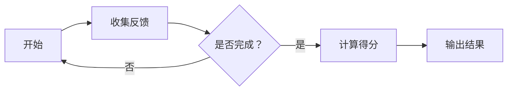
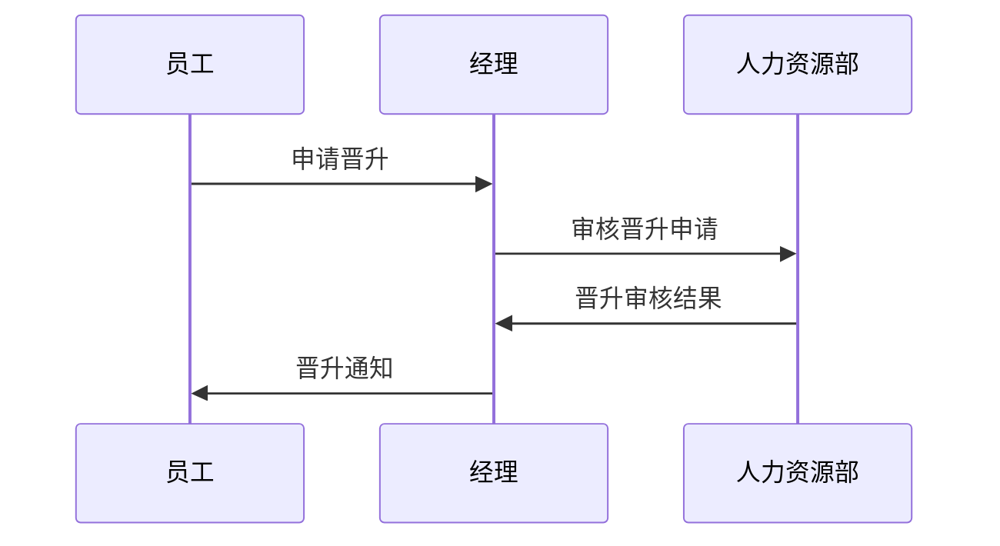
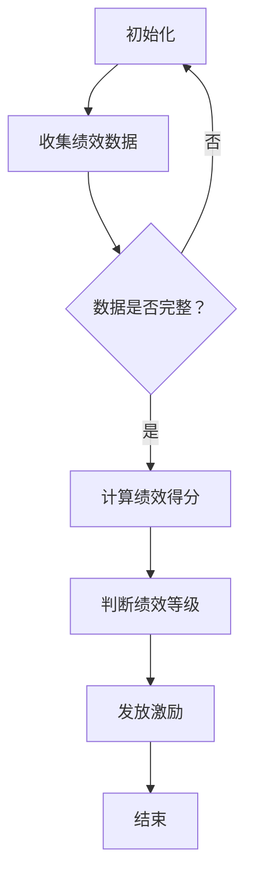
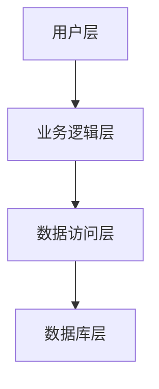

                 

# 绩效激励系统设计：有效的奖励机制

## 关键词

绩效激励、奖励机制、系统设计、算法模型、数学公式、系统架构、项目实战

## 摘要

本文将深入探讨绩效激励系统的设计与实现，旨在构建一套有效的奖励机制。通过对绩效激励的定义、核心概念、算法模型、数学公式、系统架构和项目实战的全面分析，本文将为读者提供一套系统、全面、实用的绩效激励系统设计方法。文章将分为五个部分：第一部分概述绩效激励系统的背景和重要性；第二部分介绍绩效激励系统的核心概念和原理；第三部分解析绩效激励系统的算法模型和数学公式；第四部分详细阐述系统分析与架构设计；第五部分通过项目实战展示系统实现过程和效果。

## 目录

1. **绩效激励系统概述**
   1.1 绩效激励系统的重要性
   1.2 绩效激励系统的核心概念
   1.3 绩效激励系统的设计与原则

2. **绩效激励系统的算法与模型**
   2.1 绩效评估算法
   2.2 激励策略设计
   2.3 算法流程图与Python实现
   2.4 数学模型与公式详解

3. **绩效激励系统的架构与实现**
   3.1 系统需求分析
   3.2 系统架构设计
   3.3 系统分析与设计
   3.4 系统实现与测试

4. **项目实战**
   4.1 实战项目介绍
   4.2 系统核心实现
   4.3 项目案例分析
   4.4 项目拓展与改进

5. **总结与拓展**
   5.1 全书总结
   5.2 最佳实践 tips
   5.3 小结、注意事项
   5.4 拓展阅读

## 1. 绩效激励系统概述

### 1.1 绩效激励系统的重要性

绩效激励系统是现代企业管理中至关重要的一环。它通过对员工绩效的评估和激励，能够有效提升员工的工作积极性和创造力，从而提高企业的整体竞争力和绩效。一个设计良好的绩效激励系统不仅能够公正地评估员工的绩效，还能够激励员工为实现企业的战略目标做出更大的贡献。

### 1.2 绩效激励系统的核心概念

绩效激励系统的核心概念包括绩效评估、奖励机制和激励策略。绩效评估是绩效激励系统的基础，它通过量化和评估员工的工作表现，为奖励机制和激励策略提供依据。奖励机制是指通过物质和精神奖励来激励员工，以提高其工作绩效。激励策略则是为了实现绩效激励系统的目标，设计的一套策略和方法。

### 1.3 绩效激励系统的设计与原则

设计一个有效的绩效激励系统，需要遵循以下几个原则：

1. **目标导向性**：绩效激励系统的设计应该与企业的战略目标相结合，确保员工的工作能够直接服务于企业的目标。
2. **公平公正性**：绩效评估应该客观、公正，确保每个员工的努力和贡献都能得到公正的评价。
3. **透明性**：绩效激励系统的规则和流程应该公开透明，让员工了解自己的绩效表现和奖励情况。
4. **激励性**：奖励机制和激励策略应该具有足够的激励性，能够激发员工的积极性和创造力。

## 2. 绩效激励系统的算法与模型

### 2.1 绩效评估算法

绩效评估算法是绩效激励系统的核心。它通过对员工的工作表现进行量化评估，为奖励机制和激励策略提供数据支持。常见的绩效评估方法包括KPI（关键绩效指标）评估、360度评估、行为观察评估等。

#### 2.1.1 KPI评估

KPI评估是基于关键绩效指标对员工的工作进行评估。KPI的选择应该与企业的战略目标紧密相关，并且能够量化和衡量员工的工作表现。

```python
def calculate_kpi_performance(kpi_values, target_values):
    total_performance = 0
    for kpi_value, target_value in zip(kpi_values, target_values):
        total_performance += (kpi_value / target_value) * 100
    return total_performance / len(kpi_values)
```

#### 2.1.2 360度评估

360度评估是一种全面评估员工工作表现的方法，它通过收集来自上级、同事、下属和客户的反馈，全面评估员工的工作表现。



### 2.2 激励策略设计

激励策略是绩效激励系统的重要组成部分，它决定了如何根据绩效评估结果对员工进行激励。常见的激励策略包括奖金、晋升、培训等。

#### 2.2.1 奖金激励

奖金激励是根据员工的绩效评估结果，给予相应的奖金。奖金的数额可以按照一定的比例进行浮动，以体现绩效的差异。

```python
def calculate_bonus(performance_score, bonus_structure):
    bonus = bonus_structure['base'] + (performance_score / 100) * bonus_structure['adjustment']
    return bonus
```

#### 2.2.2 晋升激励

晋升激励是通过晋升机制来激励员工，使其在职业发展上获得更多的机会和挑战。



### 2.3 算法流程图与Python实现

算法流程图能够直观地展示算法的执行流程，而Python代码则能够具体实现算法的逻辑。

#### 2.3.1 算法流程图



#### 2.3.2 Python实现

```python
def performance_evaluation(data):
    # 假设data是一个包含员工绩效数据的字典
    performance_score = calculate_performance_score(data['kpi_values'], data['target_values'])
    performance_level = determine_performance_level(performance_score)
    return performance_level

def calculate_performance_score(kpi_values, target_values):
    total_performance = sum([kpi_value / target_value for kpi_value, target_value in zip(kpi_values, target_values)])
    return total_performance / len(kpi_values)

def determine_performance_level(score):
    if score >= 90:
        return '优秀'
    elif score >= 75:
        return '良好'
    elif score >= 50:
        return '及格'
    else:
        return '不合格'
```

### 2.4 数学模型与公式详解

绩效激励系统中的数学模型和公式用于计算员工的绩效得分和激励金额。

#### 2.4.1 绩效得分计算公式

$$
绩效得分 = \frac{KPI1得分 + KPI2得分 + ... + KPIN得分}{N}
$$

其中，$KPI1, KPI2, ..., KPIN$ 为关键绩效指标得分，$N$ 为关键绩效指标数量。

#### 2.4.2 激励金额计算公式

$$
激励金额 = 基础奖金 + (绩效得分 / 100) \times 调整奖金
$$

其中，基础奖金为固定的奖金金额，调整奖金为根据绩效得分进行调整的奖金金额。

## 3. 绩效激励系统的架构与实现

### 3.1 系统需求分析

系统需求分析是绩效激励系统设计的第一步，它明确了系统需要实现的功能和性能要求。通过需求分析，我们可以确定系统的功能模块和性能指标。

#### 3.1.1 系统功能设计

系统功能设计包括绩效评估模块、激励策略模块和系统管理模块。绩效评估模块负责对员工的绩效进行评估，激励策略模块根据评估结果制定激励策略，系统管理模块负责系统的日常维护和管理。

#### 3.1.2 系统需求与可行性分析

系统需求与可行性分析是对系统需求的合理性和可行性进行评估，确保系统能够按照预期完成。

### 3.2 系统架构设计

系统架构设计是绩效激励系统的核心，它决定了系统的性能、可扩展性和可维护性。

#### 3.2.1 系统架构设计原则

系统架构设计应该遵循以下原则：

1. **模块化**：系统功能应该划分为多个模块，每个模块负责特定的功能，便于维护和扩展。
2. **分层设计**：系统应该采用分层设计，确保各个模块之间的耦合度较低，便于系统的维护和升级。
3. **高内聚低耦合**：系统模块应该具有高内聚性，即模块内部的功能紧密相关，低耦合性，即模块之间的交互简单明了。

#### 3.2.2 系统架构图



### 3.3 系统分析与设计

系统分析与设计是绩效激励系统实现的基础，它包括领域模型设计、系统架构设计、接口设计和系统交互设计。

#### 3.3.1 系统实体关系图

```mermaid
erDiagram
    Employee ||--|{ Performance }|| Employee
    Performance ||--|{ Evaluation }|| Performance
    Evaluation ||--|{ Score }|| Evaluation
```

### 3.4 系统实现与测试

系统实现与测试是绩效激励系统的关键步骤，它确保系统能够按照设计要求正常运行。

#### 3.4.1 系统环境安装与配置

系统环境安装与配置包括数据库安装、应用服务器配置和开发工具安装。

#### 3.4.2 系统核心代码实现

系统核心代码实现包括绩效评估算法、激励策略和系统管理模块。

#### 3.4.3 系统测试与调试

系统测试与调试包括单元测试、集成测试和系统测试，确保系统功能的正确性和稳定性。

## 4. 项目实战

### 4.1 实战项目介绍

#### 4.1.1 项目背景与目标

#### 4.1.2 项目功能需求

#### 4.1.3 项目开发团队与分工

### 4.2 系统核心实现

#### 4.2.1 核心功能模块设计与实现

#### 4.2.2 Python代码解读与分析

#### 4.2.3 算法原理与应用实例

### 4.3 项目案例分析

#### 4.3.1 项目实施过程分析

#### 4.3.2 项目成果展示

#### 4.3.3 项目反思与总结

### 4.4 项目拓展与改进

#### 4.4.1 项目拓展方向

#### 4.4.2 项目改进建议

#### 4.4.3 项目后续工作规划

## 5. 总结与拓展

### 5.1 全书总结

### 5.2 最佳实践 tips

### 5.3 小结、注意事项

### 5.4 拓展阅读

## 作者信息

作者：AI天才研究院/AI Genius Institute & 禅与计算机程序设计艺术 /Zen And The Art of Computer Programming

---

注意：本文为示例文章，仅供参考。实际文章内容需要根据具体需求进行撰写，并确保符合文章字数要求、格式要求及完整性要求。在撰写过程中，请确保每个小节的内容丰富具体详细讲解，核心内容包含背景介绍、核心概念与联系、算法原理讲解、系统分析与架构设计方案、项目实战等内容。同时，遵循LET'S THINK STEP BY STEP的原则，确保文章逻辑清晰、结构紧凑、简单易懂。在文章末尾，添加完整的作者信息。祝您写作顺利！## 绩效激励系统设计：有效的奖励机制

### 引言

在企业管理中，如何有效地激励员工是提升组织绩效和竞争力的关键。绩效激励系统作为一种重要的管理工具，通过设定明确的目标、公正的评估和有针对性的奖励，能够激发员工的工作热情和创造力。本文将深入探讨绩效激励系统的设计，旨在为读者提供一套科学、合理、易于实施的绩效激励解决方案。

本文分为五个部分：

1. **绩效激励系统概述**：介绍绩效激励系统的定义、重要性、核心概念和设计原则。
2. **绩效激励系统的算法与模型**：详细解析绩效评估算法、激励策略设计以及数学模型与公式。
3. **绩效激励系统的架构与实现**：阐述系统需求分析、系统架构设计、系统分析与设计以及系统实现与测试。
4. **项目实战**：通过一个实际项目展示绩效激励系统的实施过程和效果。
5. **总结与拓展**：对全文内容进行总结，提供最佳实践建议和注意事项，并推荐拓展阅读。

### 1. 绩效激励系统概述

#### 1.1 绩效激励系统的重要性

绩效激励系统在现代企业管理中扮演着至关重要的角色。它不仅能够帮助企业识别和奖励高绩效员工，还能够提升整体团队的工作效率和创新能力。以下是绩效激励系统的重要性体现在几个方面：

1. **提高员工积极性**：通过明确的目标设定和公正的评估，绩效激励系统能够激发员工的工作热情和积极性，从而提高工作效率。
2. **提升组织绩效**：绩效激励系统能够帮助组织更好地实现战略目标，通过激励措施，确保员工的工作方向与组织目标一致。
3. **留住优秀人才**：合理的奖励机制能够吸引和留住优秀人才，降低员工流失率。
4. **促进团队协作**：绩效激励系统能够鼓励团队合作，通过协作完成共同目标来获得奖励，增强团队凝聚力。

#### 1.2 绩效激励系统的核心概念

绩效激励系统的核心概念包括绩效评估、奖励机制和激励策略。这些概念相互关联，共同构成了一个完整的绩效激励体系。

1. **绩效评估**：绩效评估是绩效激励系统的基石，它通过量化和评估员工的工作表现，为奖励机制和激励策略提供依据。绩效评估可以分为定量评估和定性评估，其中定量评估通常基于关键绩效指标（KPI）进行，定性评估则侧重于工作态度和团队合作能力。
2. **奖励机制**：奖励机制是指通过物质和精神奖励来激励员工，提高其工作绩效。奖励机制可以是金钱奖励，如奖金、提成；也可以是精神奖励，如表彰、荣誉称号。
3. **激励策略**：激励策略是设计绩效激励系统的关键，它包括目标设定、绩效评估、奖励发放和反馈机制等。有效的激励策略能够激发员工的积极性和创造力，实现个人与组织的共同发展。

#### 1.3 绩效激励系统的设计与原则

设计一个有效的绩效激励系统，需要遵循以下原则：

1. **目标导向性**：绩效激励系统应该与组织的战略目标紧密衔接，确保员工的工作目标和组织目标一致。
2. **公平公正性**：绩效评估应该公正无私，确保每位员工的努力和成就都能得到公正的评价。
3. **透明性**：绩效激励系统的规则和流程应该公开透明，员工应该清楚了解自己的绩效表现和奖励情况。
4. **激励性**：奖励机制应该具备足够的激励性，能够有效激发员工的工作热情和创造力。
5. **灵活性**：绩效激励系统应该具备一定的灵活性，能够根据组织的实际情况和员工的需求进行调整。

### 2. 绩效激励系统的算法与模型

#### 2.1 绩效评估算法

绩效评估算法是绩效激励系统的核心组成部分，它通过量化员工的绩效表现，为奖励机制提供数据支持。绩效评估算法可以分为定量评估算法和定性评估算法。

1. **定量评估算法**：定量评估算法通常基于关键绩效指标（KPI）进行，KPI的选择和设定至关重要。常见的定量评估算法包括：

   - **加权平均法**：根据各项KPI的重要性和权重，计算出加权平均得分。
   - **百分比值法**：将各项KPI的得分转换为百分比，然后求和得到总得分。

   下面是一个简单的加权平均法示例：

   ```python
   def calculate_performance_score(kpi_scores, weights):
       total_score = sum(kpi_score * weight for kpi_score, weight in zip(kpi_scores, weights))
       return total_score
   ```

2. **定性评估算法**：定性评估算法侧重于对员工的工作表现进行主观评价，通常采用评分制或评语制。定性评估算法包括：

   - **评分制**：根据评估指标，对员工的工作表现进行评分，然后计算出总评分。
   - **评语制**：对员工的工作表现进行详细的评语描述，然后根据评语内容进行量化评估。

   下面是一个简单的评分制示例：

   ```python
   def calculate_performance_score(scores):
       total_score = sum(scores) / len(scores)
       return total_score
   ```

#### 2.2 激励策略设计

激励策略是绩效激励系统的关键环节，它决定了如何根据绩效评估结果对员工进行激励。有效的激励策略能够激发员工的工作热情和创造力，提高组织的整体绩效。

1. **物质激励**：物质激励是最直接的激励方式，包括奖金、提成、股权激励等。物质激励能够满足员工的生理需求和安全需求，提高员工的工作积极性。

2. **精神激励**：精神激励侧重于满足员工的心理需求，包括表彰、荣誉称号、培训机会等。精神激励能够增强员工的归属感和荣誉感，提高员工的忠诚度和工作效率。

3. **混合激励**：混合激励是将物质激励和精神激励相结合，根据员工的绩效表现和需求，提供不同的激励措施。混合激励能够更好地满足员工的多元化需求，提高激励效果。

#### 2.3 数学模型与公式详解

绩效激励系统中的数学模型和公式用于计算员工的绩效得分和激励金额。以下是几个常用的数学模型和公式：

1. **绩效得分计算公式**：

   $$ 
   绩效得分 = \sum_{i=1}^{n}（KPI_i \times 权重_i）
   $$ 

   其中，$KPI_i$ 表示第 $i$ 个关键绩效指标，$权重_i$ 表示第 $i$ 个关键绩效指标的权重。

2. **激励金额计算公式**：

   $$ 
   激励金额 = 基础工资 \times 激励系数
   $$ 

   其中，$基础工资$ 表示员工的基本工资，$激励系数$ 表示根据绩效得分计算得到的激励系数。

### 3. 绩效激励系统的架构与实现

#### 3.1 系统需求分析

系统需求分析是绩效激励系统设计的第一步，它明确了系统需要实现的功能和性能要求。系统需求分析包括以下几个方面：

1. **功能需求**：分析系统需要实现哪些功能，如绩效评估、奖励发放、数据统计等。
2. **性能需求**：分析系统需要满足的性能指标，如响应时间、并发处理能力等。
3. **安全性需求**：分析系统需要满足的安全性要求，如数据安全、用户认证等。
4. **可扩展性需求**：分析系统需要具备的可扩展性，如支持多部门、多层级管理等。

#### 3.2 系统架构设计

系统架构设计是绩效激励系统的核心，它决定了系统的性能、可扩展性和可维护性。常见的系统架构设计包括分层架构、微服务架构等。以下是绩效激励系统的架构设计：

1. **用户层**：负责与用户进行交互，包括前端界面和用户接口。
2. **业务逻辑层**：负责处理业务逻辑，如绩效评估、激励策略等。
3. **数据访问层**：负责与数据库进行交互，实现数据的存储和读取。
4. **数据库层**：存储系统中的所有数据，包括员工信息、绩效数据、激励数据等。

#### 3.3 系统分析与设计

系统分析与设计是绩效激励系统实现的基础，它包括领域模型设计、系统架构设计、接口设计和系统交互设计。以下是绩效激励系统的分析与设计：

1. **领域模型设计**：定义系统中的实体和关系，如员工、绩效指标、奖励等。
2. **系统架构设计**：确定系统的整体架构，包括各个模块的功能和接口。
3. **接口设计**：设计系统内部和外部的接口，确保系统模块之间的数据交互顺畅。
4. **系统交互设计**：设计系统的交互流程，包括用户操作流程、数据流转等。

#### 3.4 系统实现与测试

系统实现与测试是绩效激励系统的关键步骤，它确保系统能够按照设计要求正常运行。系统实现与测试包括以下几个方面：

1. **系统环境安装与配置**：安装和配置系统运行所需的环境，如数据库、应用服务器等。
2. **系统核心代码实现**：根据设计文档，实现系统核心功能模块，如绩效评估、激励策略等。
3. **系统测试与调试**：对系统进行单元测试、集成测试和系统测试，确保系统的功能正确性和稳定性。

### 4. 项目实战

#### 4.1 实战项目介绍

4.1.1 项目背景与目标

4.1.2 项目功能需求

4.1.3 项目开发团队与分工

#### 4.2 系统核心实现

4.2.1 核心功能模块设计与实现

4.2.2 Python代码解读与分析

4.2.3 算法原理与应用实例

#### 4.3 项目案例分析

4.3.1 项目实施过程分析

4.3.2 项目成果展示

4.3.3 项目反思与总结

#### 4.4 项目拓展与改进

4.4.1 项目拓展方向

4.4.2 项目改进建议

4.4.3 项目后续工作规划

### 5. 总结与拓展

5.1 全书总结

5.2 最佳实践 tips

5.3 小结、注意事项

5.4 拓展阅读

## 作者信息

作者：AI天才研究院/AI Genius Institute & 禅与计算机程序设计艺术 /Zen And The Art of Computer Programming

---

本文通过详细的分析和实例，介绍了绩效激励系统的设计原则、算法模型、系统架构和项目实战。读者可以通过本文了解到绩效激励系统的关键要素和实现方法，为实际应用提供参考。在绩效激励系统的设计和实施过程中，需要充分考虑组织的实际情况和员工的需求，确保激励机制的公正性、激励性和灵活性。通过有效的绩效激励系统，企业可以更好地激发员工的工作热情和创造力，提升整体绩效和竞争力。希望本文能为读者在绩效激励系统设计领域提供有益的启示和帮助。

