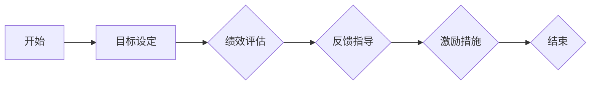
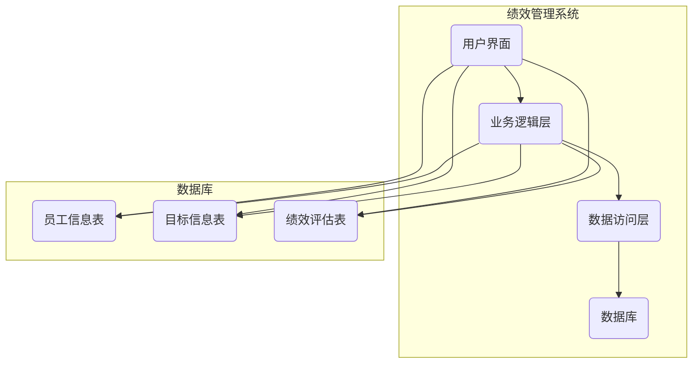
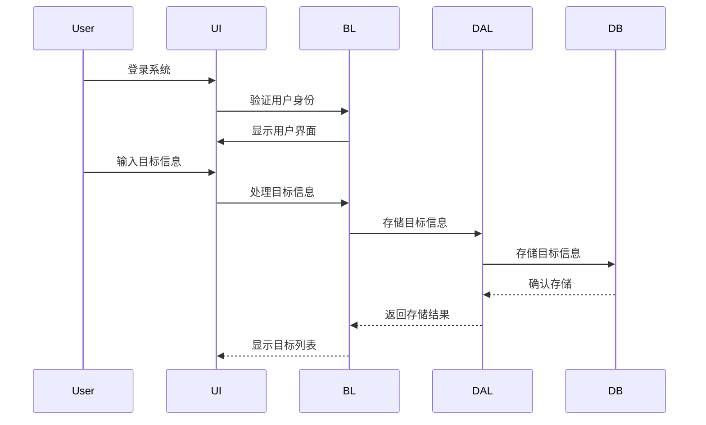

                 


### 第一步：背景介绍

#### 1.1 问题背景

在现代企业中，绩效管理是一项至关重要的活动，它不仅关乎员工的个人发展和满意度，更直接影响着团队的效能和整个组织的竞争力。然而，许多企业在实施绩效管理时面临着诸多挑战：

- **绩效指标不明确**：许多企业缺乏清晰的绩效指标，导致评价标准模糊，难以准确衡量员工的工作成果。
- **评估过程不透明**：绩效评估过程往往缺乏透明度，员工对评估结果缺乏信任，甚至产生抵触情绪。
- **反馈机制不完善**：有效的绩效管理需要及时、具体的反馈，但许多企业的反馈机制不够完善，导致问题得不到及时解决。
- **激励措施不足**：缺乏有效的激励措施，无法充分调动员工的积极性和创造力。

#### 1.2 问题描述

如何通过有效的绩效管理提升团队效能，成为现代企业管理者亟需解决的问题。这不仅仅是技术问题，更是管理哲学的体现。有效的绩效管理需要考虑以下几个方面：

- **明确目标和指标**：设定清晰的绩效目标，确保员工了解自己的工作方向和期望成果。
- **透明和公正的评估过程**：确保评估过程的公正性和透明度，增加员工的信任感。
- **及时的反馈和指导**：通过持续的沟通和反馈，帮助员工改进工作方法，提升绩效。
- **有效的激励措施**：结合物质和精神激励，激发员工的积极性和创造力。

#### 1.3 问题解决

绩效管理是一项系统工程，需要从以下几个方面进行优化：

- **制度建设**：建立完善的绩效管理制度，包括绩效指标体系、评估标准和流程等。
- **技术支持**：运用现代信息技术，如绩效管理系统，提高绩效管理的效率和准确性。
- **领导力培养**：管理者需要具备卓越的领导力，能够有效地推动绩效管理制度的实施。
- **员工参与**：鼓励员工积极参与绩效管理过程，提高员工的参与感和主动性。

#### 1.4 边界与外延

绩效管理与人力资源管理、组织发展等领域密切相关，但又有一定的独立性。在实施绩效管理时，需要充分考虑这些相关领域的特点和要求，确保绩效管理能够与其他管理活动相协调，共同推动组织的发展。

### 第二步：核心概念与联系

#### 2.1 核心概念

为了深入理解绩效管理，我们需要首先明确以下几个核心概念：

- **绩效**：绩效是指员工在工作过程中所表现出的工作成果、工作质量和工作态度。它包括三个层次：结果性绩效、行为性绩效和潜力性绩效。
- **绩效管理**：绩效管理是指通过设定目标、评估绩效、反馈指导、激励员工等环节，系统地管理和提升员工绩效的过程。它包括四个关键环节：目标设定、绩效评估、反馈指导、激励措施。
- **团队效能**：团队效能是指团队在实现组织目标过程中的综合表现，包括团队的整体效率、协作能力、创新能力和执行力。团队效能的提升需要从团队建设、沟通协作、目标管理等方面入手。

#### 2.2 概念属性特征对比表格

| 概念   | 定义                                                         | 关联性                                                     |
| ------ | ------------------------------------------------------------ | ---------------------------------------------------------- |
| 绩效   | 员工在工作过程中所表现出的工作成果、工作质量和工作态度。   | 绩效管理的基础，影响绩效评估和团队效能。                 |
| 绩效管理 | 通过设定目标、评估绩效、反馈指导、激励员工等环节，系统地管理和提升员工绩效的过程。 | 目标设定的依据，影响团队效能的提升。                     |
| 团队效能 | 团队在实现组织目标过程中的综合表现，包括团队的整体效率、协作能力、创新能力和执行力。 | 绩效管理的结果，影响组织的整体绩效。                     |

#### 2.3 ER实体关系图架构的 Mermaid 流程图

```mermaid
erDiagram
  绩效管理 ||--|{ 绩效 }|
  绩效管理 ||--|{ 团队效能 }|
  绩效 ||--|{ 绩效管理 }|
  绩效 ||--|{ 团队效能 }|
```

### 第三步：算法原理讲解

#### 3.1 算法 Mermaid 流程图



#### 3.2 Python 源代码

```python
# 绩效管理算法示例代码
def performance_management(target, assessment, feedback, incentive):
    """
    绩效管理函数
    :param target: 目标
    :param assessment: 评估结果
    :param feedback: 反馈
    :param incentive: 激励措施
    :return: 绩效管理结果
    """
    result = {
        'target': target,
        'assessment': assessment,
        'feedback': feedback,
        'incentive': incentive
    }
    return result

# 示例使用
performance_management('提高销售额', '优秀', '继续保持', '奖金')
```

#### 3.3 数学模型和公式

绩效评估的数学模型可以表示为：

$$
\text{绩效评估} = w_1 \times \text{结果性绩效} + w_2 \times \text{行为性绩效} + w_3 \times \text{潜力性绩效}
$$

其中，$w_1, w_2, w_3$ 分别是结果性绩效、行为性绩效、潜力性绩效的权重。

#### 3.4 详细讲解与举例说明

假设某员工的目标是“提高销售额”，其绩效评估结果为：结果性绩效90分，行为性绩效85分，潜力性绩效80分。根据上述数学模型，可以计算出该员工的绩效评估分数：

$$
\text{绩效评估} = 0.6 \times 90 + 0.3 \times 85 + 0.1 \times 80 = 88.2 \text{分}
$$

根据评估结果，可以给出反馈：“表现良好，继续保持”。同时，根据公司的激励措施，可以给予该员工一定的奖金。

### 第四步：系统分析与架构设计方案

#### 4.1 问题场景介绍

某企业希望通过引入绩效管理系统，实现以下目标：

- 明确员工的工作目标和绩效指标。
- 提高绩效评估的准确性和透明度。
- 提升团队的协作和创新能力。

#### 4.2 系统功能设计（领域模型 Mermaid 类图）

```mermaid
classDiagram
    ClassDef Employee
        +int id
        +string name
        +string role
        +list<Goal> goals
        +list<Performance> performances
    ClassDef Goal
        +int id
        +string description
        +datetime deadline
        +float target_value
    ClassDef Performance
        +int id
        +string type
        +float score
        +datetime date
    Employee "1" --* Goal: 设置目标
    Employee "1" --* Performance: 绩效评估
```

#### 4.3 系统架构设计（Mermaid 架构图）



#### 4.4 系统接口设计和系统交互（Mermaid 序列图）



### 第五步：项目实战

#### 5.1 环境安装

为了演示绩效管理系统，我们需要安装以下软件和工具：

- Python 3.8+
- Flask（Web框架）
- SQLAlchemy（ORM框架）
- SQLite（数据库）

安装步骤如下：

```bash
pip install flask sqlalchemy
```

#### 5.2 系统核心实现源代码

以下是一个简单的绩效管理系统实现：

```python
# app.py
from flask import Flask, request, jsonify
from flask_sqlalchemy import SQLAlchemy

app = Flask(__name__)
app.config['SQLALCHEMY_DATABASE_URI'] = 'sqlite:///performance_management.db'
db = SQLAlchemy(app)

class Employee(db.Model):
    id = db.Column(db.Integer, primary_key=True)
    name = db.Column(db.String(50), nullable=False)
    role = db.Column(db.String(50), nullable=False)

class Goal(db.Model):
    id = db.Column(db.Integer, primary_key=True)
    description = db.Column(db.String(255), nullable=False)
    deadline = db.Column(db.DateTime, nullable=False)
    target_value = db.Column(db.Float, nullable=False)
    employee_id = db.Column(db.Integer, db.ForeignKey('employee.id'), nullable=False)

class Performance(db.Model):
    id = db.Column(db.Integer, primary_key=True)
    type = db.Column(db.String(50), nullable=False)
    score = db.Column(db.Float, nullable=False)
    date = db.Column(db.DateTime, nullable=False)
    employee_id = db.Column(db.Integer, db.ForeignKey('employee.id'), nullable=False)

@app.route('/employees', methods=['POST'])
def create_employee():
    data = request.get_json()
    new_employee = Employee(name=data['name'], role=data['role'])
    db.session.add(new_employee)
    db.session.commit()
    return jsonify({'id': new_employee.id}), 201

@app.route('/goals', methods=['POST'])
def create_goal():
    data = request.get_json()
    new_goal = Goal(description=data['description'], deadline=data['deadline'], target_value=data['target_value'], employee_id=data['employee_id'])
    db.session.add(new_goal)
    db.session.commit()
    return jsonify({'id': new_goal.id}), 201

@app.route('/performances', methods=['POST'])
def create_performance():
    data = request.get_json()
    new_performance = Performance(type=data['type'], score=data['score'], date=data['date'], employee_id=data['employee_id'])
    db.session.add(new_performance)
    db.session.commit()
    return jsonify({'id': new_performance.id}), 201

if __name__ == '__main__':
    db.create_all()
    app.run(debug=True)
```

#### 5.3 代码应用解读与分析

这段代码首先导入了Flask和SQLAlchemy库，并创建了三个模型：`Employee`、`Goal` 和 `Performance`。每个模型都对应数据库中的一张表。

- `Employee` 模型表示员工，包含姓名和角色。
- `Goal` 模型表示目标，包含描述、截止日期、目标值和员工ID。
- `Performance` 模型表示绩效评估，包含类型、分数、日期和员工ID。

代码还定义了三个路由：`/employees`、`/goals` 和 `/performances`，分别用于创建员工、目标和绩效评估。

- `/employees` 路由接受一个包含员工信息的JSON对象，并将其存储在数据库中。
- `/goals` 路由接受一个包含目标信息的JSON对象，并将其存储在数据库中。
- `/performances` 路由接受一个包含绩效评估信息的JSON对象，并将其存储在数据库中。

#### 5.4 实际案例分析和详细讲解剖析

假设我们需要创建一名员工、一个目标和一次绩效评估，步骤如下：

1. 创建员工：

```bash
curl -X POST -H "Content-Type: application/json" -d '{"name": "Alice", "role": "Sales Manager"}' http://127.0.0.1:5000/employees
```

响应：

```json
{"id": 1}
```

2. 创建目标：

```bash
curl -X POST -H "Content-Type: application/json" -d '{"description": "Increase sales by 10%", "deadline": "2023-12-31", "target_value": 1000000.0, "employee_id": 1}' http://127.0.0.1:5000/goals
```

响应：

```json
{"id": 1}
```

3. 创建绩效评估：

```bash
curl -X POST -H "Content-Type: application/json" -d '{"type": "Quarterly", "score": 0.9, "date": "2023-09-30", "employee_id": 1}' http://127.0.0.1:5000/performances
```

响应：

```json
{"id": 1}
```

#### 5.5 项目小结

通过这个简单的示例，我们可以看到如何使用Flask和SQLAlchemy创建一个基本的绩效管理系统。尽管这个系统功能有限，但它提供了一个框架，可以在此基础上进一步开发和完善，以实现更复杂的业务需求。

### 第六步：最佳实践 tips、小结、注意事项、拓展阅读

#### 最佳实践 tips

1. **明确目标和指标**：确保目标和指标与组织的战略目标一致，并具体、可量化。
2. **透明和公正的评估过程**：制定明确的评估标准和流程，确保评估过程透明、公正。
3. **及时的反馈和指导**：定期给予员工反馈，帮助他们识别问题并改进。
4. **多样化的激励措施**：结合物质和精神激励，激发员工的积极性和创造力。

#### 小结

本文详细介绍了绩效管理的核心概念、算法原理、系统设计与实现，并通过实际案例进行了分析和讲解。通过有效的绩效管理，企业可以提升团队效能，实现组织目标。

#### 注意事项

1. 绩效管理需要持续改进，不断调整和完善。
2. 关注员工的反馈和需求，确保绩效管理符合员工的期望。
3. 结合组织的实际情况，选择适合的绩效管理方法和工具。

#### 拓展阅读

- 《绩效管理实战手册》
- 《团队效能提升策略》
- 《现代企业管理》

### 作者信息

作者：AI天才研究院/AI Genius Institute & 禅与计算机程序设计艺术 /Zen And The Art of Computer Programming

