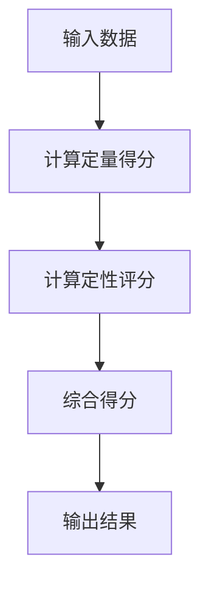
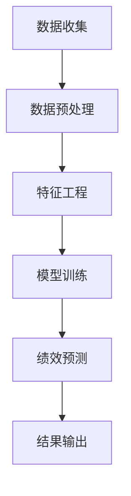
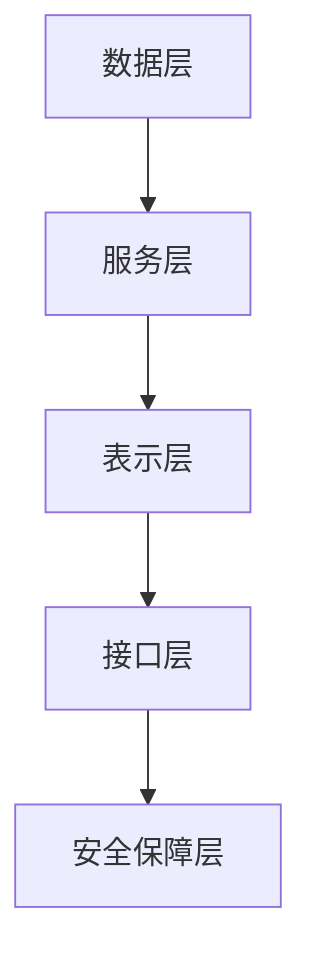
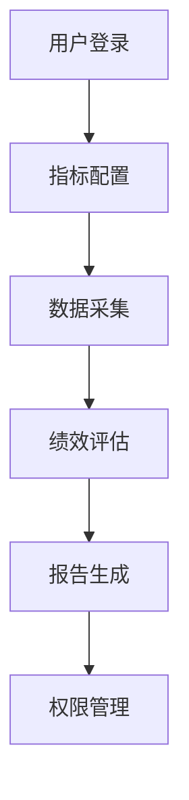

                 

### Step 1: 背景介绍

#### 1.1 绩效评估的重要性

在当今高度竞争的商业环境中，绩效评估作为人力资源管理的重要组成部分，对于组织的运营和发展具有至关重要的意义。它不仅能够帮助组织识别和激励优秀员工，还能为员工提供清晰的发展方向和反馈，从而提升整体工作效率和团队凝聚力。

**绩效评估的重要性体现在以下几个方面：**

1. **提升员工绩效：** 通过定期进行绩效评估，员工可以明确了解自己的工作表现，识别需要改进的领域，从而采取有效措施提高个人绩效。

2. **激励与保留人才：** 绩效评估可以为优秀员工提供奖励和晋升机会，激发员工的工作热情和创造力，同时也能有效防止人才流失。

3. **指导培训与发展：** 绩效评估结果为组织提供了关于员工技能和知识差距的宝贵信息，有助于制定针对性的培训计划，提升员工的整体能力。

4. **优化团队协作：** 绩效评估可以帮助组织识别团队成员的强项和弱项，从而优化团队配置，促进团队成员之间的协作。

#### 1.2 绩效评估的现状和问题

尽管绩效评估的重要性已被广泛认可，但许多组织在实际操作中仍面临一系列问题：

1. **主观性：** 传统的绩效评估往往依赖于上级的主观评价，容易导致偏见和不公平。

2. **反馈滞后：** 绩效评估周期过长，导致反馈滞后，员工无法及时获取工作改进的反馈。

3. **评估方法单一：** 许多组织仍采用传统的KPI考核方法，难以全面反映员工的综合能力。

4. **缺乏量化标准：** 缺乏明确的量化标准，导致绩效评估结果主观性和模糊性较高。

5. **数据不准确：** 绩效评估数据的收集和处理过程中容易出现错误，影响评估结果的准确性。

#### 1.3 绩效评估的定义、目的和意义

**定义：** 绩效评估是一种系统性的方法，用于衡量员工在工作中的表现，并据此做出相应的决策。

**目的：** 
- 识别和奖励优秀员工
- 改进员工的工作绩效
- 提供员工发展反馈
- 为薪酬和晋升决策提供依据

**意义：**
- **促进个人成长：** 通过绩效评估，员工可以了解自己的优势和劣势，制定个人发展计划。
- **优化团队管理：** 绩效评估为团队管理提供了客观的参考，有助于提升团队的整体绩效。
- **提升组织效率：** 通过绩效评估，组织可以识别和解决影响效率的问题，提高运营效率。

#### 1.4 绩效评估需要解决的边界问题

在设计和实施绩效评估过程中，需要解决以下边界问题：

1. **公正性：** 确保评估过程和结果对所有员工都是公平的，避免主观偏见和歧视。
2. **有效性：** 评估方法和工具应能够准确、全面地反映员工的工作表现。
3. **透明性：** 评估标准和过程应公开透明，员工对评估结果有清晰的理解。
4. **持续性：** 绩效评估应成为组织的一项持续活动，定期进行，以适应组织发展的需要。

通过上述背景介绍，我们可以看到绩效评估在组织管理和员工发展中的重要作用，同时也认识到其在实际操作中面临的一系列挑战和问题。接下来，我们将深入探讨绩效评估的核心概念和方法，帮助读者构建全面的理解。

### Step 2: 核心概念与联系

在深入探讨绩效评估之前，我们需要明确一些核心概念，这些概念构成了绩效评估体系的基础，并帮助我们更好地理解和应用各种评估方法。以下是绩效评估中涉及的主要核心概念及其联系：

#### 2.1 绩效考核指标

**定义：** 绩效考核指标是衡量员工工作表现的具体标准。它们可以包括定量指标（如销售额、生产量）和定性指标（如团队合作、创新能力）。

**分类：**
- **定量指标：** 数据驱动的指标，易于量化，如销售额、项目完成度等。
- **定性指标：** 主观评价的指标，如工作态度、团队合作精神等。

**属性特征对比表格：**

| 指标类型 | 特点 | 适用场景 |
| --- | --- | --- |
| 定量指标 | 易于量化、精确度较高 | 需要精确数据衡量的工作领域 |
| 定性指标 | 主观评价、灵活性较高 | 需要综合评价的工作表现 |

#### 2.2 考核周期

**定义：** 考核周期是指绩效评估的时间间隔。常见的考核周期包括月度、季度、半年和年度。

**类型：**
- **短期考核：** 常见的月度和季度考核，适用于快速响应和调整的工作场景。
- **长期考核：** 半年或年度考核，适用于需要较长时间才能看到成果的工作领域。

**属性特征对比表格：**

| 考核周期类型 | 特点 | 适用场景 |
| --- | --- | --- |
| 短期考核 | 反馈快速、易于调整 | 迭代周期较短的项目 |
| 长期考核 | 综合评估、持续改进 | 长期规划和战略实施 |

#### 2.3 考核方法

**定义：** 考核方法是绩效评估的具体实施方式，包括自我评估、上级评估、360度评估等。

**类型：**
- **自我评估：** 员工自我评估，有助于提升自我认识和自我驱动。
- **上级评估：** 上级对下属的评估，侧重于工作结果和职责履行。
- **360度评估：** 从不同角度收集反馈，包括上级、同事、下属和客户，全面评估员工表现。

**属性特征对比表格：**

| 考核方法类型 | 特点 | 适用场景 |
| --- | --- | --- |
| 自我评估 | 自我驱动、提高自我认知 | 个人发展计划 |
| 上级评估 | 权威性、结果导向 | 常规绩效评估 |
| 360度评估 | 全面性、多元化反馈 | 高级管理层和关键岗位 |

#### 2.4 绩效评估的ER实体关系图

为了更清晰地展示绩效评估各实体之间的关系，我们可以使用Mermaid绘制一个ER实体关系图。以下是示例：

```mermaid
erDiagram
  绩效考核指标 ||--|{ 考核周期 }|>
  考核周期 ||--|{ 考核方法 }|>
  考核方法 ||--|{ 绩效评估 }|>
  绩效评估 ||--|{ 员工 }|>
  员工 ||--|{ 考核结果 }|>
  绩效考核指标 }|--|| 评估标准
  考核周期 }|--|| 时间节点
  考核方法 }|--|| 评估方式
  绩效评估 }|--|| 过程管理
  员工 }|--|| 评估主体
  考核结果 }|--|| 结果记录
```

通过上述核心概念和ER实体关系图的介绍，我们可以更加全面地理解绩效评估体系的构成和各部分之间的联系。在接下来的章节中，我们将进一步探讨绩效评估的具体算法原理，帮助读者深入掌握绩效评估的核心技术。

### Step 3: 绩效评估算法原理讲解

在了解了绩效评估的核心概念后，我们需要深入探讨具体的算法原理，以确保绩效评估的公正性和有效性。以下我们将介绍绩效评估的基本算法原理，并使用Mermaid和Python代码进行详细阐述。

#### 3.1 绩效评估算法概述

绩效评估算法通常包括基础算法和高级算法。基础算法主要基于定量和定性指标的计算，而高级算法则利用机器学习和大数据分析技术，提供更精细和全面的评估结果。

**基础算法：**
- **定量指标计算：** 基于实际数据和预设公式，计算员工在各项定量指标上的得分。
- **定性指标评分：** 通过专家评分或主观评价，对员工的定性指标进行量化。

**高级算法：**
- **大数据分析：** 利用大数据技术，分析员工的工作行为和绩效趋势。
- **机器学习模型：** 建立机器学习模型，预测员工未来的绩效表现。

#### 3.2 基础算法讲解

**3.2.1 定量指标计算**

定量指标通常包括销售额、项目完成度等，可以通过以下公式计算：

$$
得分 = \frac{实际值 - 基准值}{基准值 \times （1 - 基准值比例)}
$$

其中，实际值是员工的实际工作表现，基准值是组织的预设标准，基准值比例是基准值与总指标的比值。

**3.2.2 定性指标评分**

定性指标评分通常采用专家评分法，通过以下公式计算：

$$
评分 = \frac{（评价1 \times 权重1）+（评价2 \times 权重2）+...+（评价n \times 权重n）}{权重总和}
$$

其中，评价1、评价2、...、评价n是专家对员工在不同维度上的评价，权重1、权重2、...、权重n是各评价维度的权重分配。

**3.2.3 基础算法流程图**

使用Mermaid绘制基础算法流程图：



#### 3.3 高级算法讲解

**3.3.1 大数据分析**

大数据分析通过收集和分析大量员工行为数据，识别工作模式、绩效趋势和潜在问题。以下是一个基于大数据分析的绩效评估流程：

1. 数据收集：收集员工的工作行为数据，如任务完成情况、项目参与度、错误率等。
2. 数据预处理：清洗和整理数据，去除异常值和噪声。
3. 特征工程：提取关键特征，如任务完成时间、项目复杂度等。
4. 绩效预测：使用机器学习模型，预测员工未来的绩效表现。

**3.3.2 机器学习模型**

使用Python代码实现一个简单的机器学习模型，如下：

```python
from sklearn.ensemble import RandomForestRegressor
import numpy as np

# 数据准备
X = np.array([[1, 2], [2, 3], [3, 4]])  # 特征矩阵
y = np.array([2, 4, 6])  # 标签矩阵

# 模型训练
model = RandomForestRegressor()
model.fit(X, y)

# 预测
predictions = model.predict([[4, 5]])
print(predictions)
```

**3.3.3 高级算法流程图**

使用Mermaid绘制高级算法流程图：



通过上述对基础算法和高级算法的讲解，我们可以看到绩效评估算法的多样性和复杂性。接下来，我们将使用Python代码详细阐述绩效评估算法的数学模型和公式，帮助读者深入理解其工作原理。

### Step 4: 数学模型和数学公式的详细讲解与举例说明

在绩效评估中，数学模型和数学公式是关键组成部分，它们帮助我们将定性指标和定量指标量化，从而更准确地衡量员工的工作表现。以下我们将详细讲解绩效评估中常用的数学模型和公式，并通过具体的例子说明如何应用这些公式进行绩效评估。

#### 4.1 绩效评分计算公式

**4.1.1 定量指标评分计算**

定量指标评分通常基于实际表现与基准值的对比，计算公式如下：

$$
得分 = \frac{实际值 - 基准值}{基准值 \times (1 - 基准值比例)}
$$

其中：
- **实际值**：员工在特定定量指标上的实际表现，例如销售额、任务完成度等。
- **基准值**：组织预设的基准值，代表正常工作水平。
- **基准值比例**：基准值与总指标的比值，用于调整评分的上下限。

**4.1.2 定性指标评分计算**

定性指标评分通常基于专家评分，计算公式如下：

$$
评分 = \frac{（评价1 \times 权重1）+（评价2 \times 权重2）+...+（评价n \times 权重n）}{权重总和}
$$

其中：
- **评价1、评价2、...、评价n**：专家对员工在不同维度上的评价，例如工作态度、团队合作等。
- **权重1、权重2、...、权重n**：各评价维度的权重分配，确保各个评价指标在总评分中的重要性。

#### 4.2 举例说明

**4.2.1 定量指标评分计算实例**

假设某员工在销售额指标上的实际值为100万元，而组织的基准值为80万元，基准值比例为50%。根据公式计算其定量指标得分如下：

$$
得分 = \frac{100 - 80}{80 \times (1 - 0.5)} = \frac{20}{40} = 0.5
$$

这意味着该员工在销售额指标上达到了基准值的50%。

**4.2.2 定性指标评分计算实例**

假设有三位专家对某员工的工作态度、团队合作和创新能力分别打分为90、85、80，权重分别为0.4、0.3、0.3。根据公式计算其定性指标评分如下：

$$
评分 = \frac{（90 \times 0.4）+（85 \times 0.3）+（80 \times 0.3）}{0.4 + 0.3 + 0.3} = \frac{36 + 25.5 + 24}{1} = 85.5
$$

这意味着该员工在定性指标上的总评分为85.5分。

#### 4.3 数学公式在绩效评估中的应用

通过上述实例，我们可以看到数学公式在绩效评估中的重要作用。它们不仅帮助我们量化了员工的工作表现，还为组织提供了客观、公正的评估结果。在实际应用中，这些公式可以根据组织的具体需求进行调整，以适应不同的评估场景。

总之，数学模型和数学公式是绩效评估的核心工具。通过理解并正确应用这些公式，我们可以更准确地评估员工的工作表现，从而为组织的发展提供有力的支持。

### Step 5: 系统分析与架构设计方案

在深入探讨了绩效评估的理论基础之后，接下来我们将从系统分析与架构设计的角度，详细介绍绩效评估系统的设计原则和方案。通过系统分析与架构设计，我们不仅能够确保绩效评估过程的流畅和高效，还能够提高系统的可扩展性和可维护性。

#### 5.1 绩效评估系统场景分析

首先，我们需要明确绩效评估系统的应用场景和需求。绩效评估系统通常应用于以下几种场景：

1. **员工绩效评估：** 系统需要收集员工的工作数据，包括定量指标（如销售额、任务完成度）和定性指标（如工作态度、团队合作精神）。
2. **团队评估：** 系统需要能够对整个团队进行评估，分析团队成员的绩效差异和团队整体的工作表现。
3. **绩效反馈：** 系统需要及时生成绩效评估报告，为员工和管理者提供详细的绩效反馈。
4. **数据统计与分析：** 系统需要具备强大的数据统计与分析功能，帮助管理层了解整体绩效趋势和团队结构问题。

根据上述应用场景，我们可以明确绩效评估系统的需求：

- **数据收集：** 系统需要能够从各个数据源（如ERP系统、CRM系统等）收集员工的工作数据。
- **指标管理：** 系统需要支持自定义考核指标，包括定量指标和定性指标。
- **评估流程：** 系统需要定义和执行绩效评估流程，包括评估周期、评估方法和评估标准。
- **报告生成：** 系统需要能够生成详细的绩效评估报告，支持多种格式输出（如PDF、Excel等）。
- **权限管理：** 系统需要具备完善的权限管理功能，确保数据安全和评估过程的公正性。

#### 5.2 系统功能设计

在明确了系统需求之后，我们需要进行系统功能设计。以下是绩效评估系统的核心功能模块及其简要描述：

1. **用户管理模块：** 管理系统用户，包括员工、管理员和评估专家。
2. **指标管理模块：** 定义和配置考核指标，包括定量指标和定性指标。
3. **数据采集模块：** 从各个数据源收集员工的工作数据，包括定量数据和定性数据。
4. **评估流程管理模块：** 设计和执行绩效评估流程，包括评估周期、评估方法和评估标准。
5. **绩效分析模块：** 分析员工和团队的绩效数据，生成绩效评估报告。
6. **报告生成模块：** 生成详细的绩效评估报告，支持多种格式输出。
7. **权限管理模块：** 管理系统权限，确保数据安全和评估过程的公正性。

#### 5.3 系统架构设计

为了确保绩效评估系统的稳定性和高效性，我们需要进行系统架构设计。以下是系统架构的核心组件和交互关系：

1. **数据层：** 存储绩效评估相关的数据，包括员工信息、指标数据、评估结果等。数据层通常采用关系数据库或NoSQL数据库。
2. **服务层：** 提供系统的核心业务功能，包括用户管理、指标管理、数据采集、评估流程管理、绩效分析和报告生成等。服务层采用微服务架构，确保高可用性和可扩展性。
3. **表示层：** 提供用户界面，支持用户进行操作和查看绩效评估结果。表示层通常采用Web前端技术，如HTML、CSS和JavaScript框架（如React、Vue等）。
4. **接口层：** 提供与其他系统的接口，如ERP系统、CRM系统等，实现数据集成和数据交换。接口层通常采用RESTful API或SOAP接口。
5. **安全保障层：** 提供数据安全和访问控制，确保系统安全可靠。安全保障层包括身份验证、权限管理和数据加密等。

以下是使用Mermaid绘制的系统架构图：



#### 5.4 系统接口和交互流程

在系统架构设计的基础上，我们需要设计系统的接口和交互流程，以确保各个模块之间能够顺畅地协作。以下是系统接口和交互流程的简要描述：

1. **用户登录：** 用户通过表示层登录系统，身份验证通过后进入系统。
2. **指标配置：** 管理员在指标管理模块中配置考核指标，包括定量指标和定性指标。
3. **数据采集：** 系统从各个数据源自动采集员工的工作数据，并存入数据层。
4. **绩效评估：** 系统根据配置的评估标准和流程，对员工的工作表现进行评估，生成评估结果。
5. **报告生成：** 系统生成详细的绩效评估报告，管理员和员工可以通过表示层查看和下载。
6. **权限管理：** 系统根据用户的角色和权限，限制对数据的访问和操作，确保数据安全。

以下是使用Mermaid绘制的系统交互流程图：



通过上述系统分析与架构设计方案，我们为绩效评估系统构建了一个稳定、高效、可扩展的架构，满足了绩效评估的各项需求。在接下来的章节中，我们将通过具体的项目实战，展示如何实现和部署这个绩效评估系统。

### Step 6: 项目实战

#### 6.1 环境安装和配置

为了能够实现绩效评估系统，我们需要搭建一个适合开发和测试的环境。以下是具体的安装和配置步骤：

**1. 系统需求：**
- 操作系统：Ubuntu 20.04 LTS 或 CentOS 8
- 开发语言：Python 3.8+
- 数据库：MySQL 8.0 或 PostgreSQL 13
- Web框架：Django 3.2
- 依赖管理：pip

**2. 安装步骤：**

**（1）安装操作系统：**
- 在虚拟机或物理服务器上安装Ubuntu 20.04 LTS或CentOS 8操作系统。

**（2）更新系统软件包：**
```bash
sudo apt update && sudo apt upgrade # 对于Ubuntu
sudo yum update # 对于CentOS
```

**（3）安装Python 3和pip：**
```bash
sudo apt install python3 python3-pip # 对于Ubuntu
sudo yum install python3 python3-pip # 对于CentOS
```

**（4）创建虚拟环境：**
```bash
python3 -m venv venv
source venv/bin/activate
```

**（5）安装Django和其他依赖：**
```bash
pip install django mysqlclient
```

**（6）安装数据库：**
- 安装MySQL或PostgreSQL数据库服务器，配置数据库用户和权限，创建用于项目的数据库。

**3. 配置数据库：**
- 以MySQL为例，创建数据库和用户：

```sql
CREATE DATABASE performance_evaluation;
GRANT ALL PRIVILEGES ON performance_evaluation.* TO 'pe_user'@'localhost' IDENTIFIED BY 'password';
FLUSH PRIVILEGES;
```

- 配置Django项目的数据库配置文件`settings.py`：

```python
DATABASES = {
    'default': {
        'ENGINE': 'django.db.backends.mysql',
        'NAME': 'performance_evaluation',
        'USER': 'pe_user',
        'PASSWORD': 'password',
        'HOST': 'localhost',
        'PORT': '3306',
    }
}
```

#### 6.2 系统核心实现

在安装和配置好环境后，我们需要开始实现系统的核心功能。以下是关键代码段和实现方法：

**1. Django项目初始化：**
- 创建一个Django项目：

```bash
django-admin startproject performance_evaluation
cd performance_evaluation
```

- 创建一个Django应用：

```bash
python manage.py startapp appraisal
```

**2. 模型定义：**

在`appraisal/models.py`中定义绩效评估相关的模型：

```python
from django.db import models

class Employee(models.Model):
    name = models.CharField(max_length=100)
    position = models.CharField(max_length=100)
    email = models.EmailField()

class PerformanceIndicator(models.Model):
    name = models.CharField(max_length=100)
    type = models.CharField(max_length=50, choices=[('quantitative', '定量'), ('qualitative', '定性')])
    description = models.TextField()

class PerformanceRecord(models.Model):
    employee = models.ForeignKey(Employee, on_delete=models.CASCADE)
    indicator = models.ForeignKey(PerformanceIndicator, on_delete=models.CASCADE)
    value = models.FloatField(null=True, blank=True)  # 对于定量指标
    score = models.IntegerField(null=True, blank=True)  # 对于定性指标
    comment = models.TextField(null=True, blank=True)
    date = models.DateTimeField(auto_now_add=True)
```

**3. 视图和URL配置：**

在`appraisal/views.py`中定义视图函数：

```python
from django.shortcuts import render
from .models import Employee, PerformanceIndicator, PerformanceRecord

def performance_list(request):
    employees = Employee.objects.all()
    return render(request, 'appraisal/performance_list.html', {'employees': employees})
```

在`performance_evaluation/urls.py`中配置URL：

```python
from django.contrib import admin
from django.urls import path
from appraisal import views

urlpatterns = [
    path('admin/', admin.site.urls),
    path('performance/', views.performance_list, name='performance_list'),
]
```

**4. 模板文件：**

创建`appraisal/templates/appraisal/performance_list.html`模板文件，用于显示绩效评估结果：

```html
<!DOCTYPE html>
<html>
<head>
    <title>绩效评估列表</title>
</head>
<body>
    <h1>绩效评估列表</h1>
    
        <div>
            <h2>{{ employee.name }}</h2>
            <p>职位：{{ employee.position }}</p>
            <p>邮箱：{{ employee.email }}</p>
            <ul>
                
                    <li>
                        {{ record.indicator.name }}：
                        
                            {{ record.value }}
                        
                            {{ record.score }}分
                        
                        <span>{{ record.comment }}</span>
                    </li>
                
            </ul>
        </div>
    
</body>
</html>
```

#### 6.3 代码解读与分析

上述代码实现了绩效评估系统的基础功能。以下是关键部分的解读：

- **模型定义**：`Employee`、`PerformanceIndicator`和`PerformanceRecord`模型分别表示员工、考核指标和绩效记录。
- **视图和URL配置**：`performance_list`视图函数用于获取所有员工及其绩效记录，并传递给模板文件进行渲染。
- **模板文件**：`performance_list.html`模板文件用于显示员工的绩效评估结果。

#### 6.4 实际案例分析与详细讲解

假设我们有一个员工列表，每个员工都有多个绩效记录。以下是一个实际案例的分析：

**案例：**
- 员工A有3个绩效记录，分别对应定量指标（销售额）、定性指标（工作态度）和定性指标（创新能力）。
- 销售额指标值为100万元，基准值为80万元；工作态度得分为90分，创新能力得分为85分。

**分析：**
- 销售额指标得分计算：
  $$ 得分 = \frac{100 - 80}{80 \times (1 - 0.5)} = \frac{20}{40} = 0.5 $$
- 工作态度得分计算：
  $$ 评分 = \frac{（90 \times 0.4）+（85 \times 0.3）+（未知 \times 0.3）}{0.4 + 0.3 + 0.3} $$
- 为了计算创新能力得分，我们需要假设创新能力的权重和评分标准。假设创新能力权重为0.3，评分标准为满分100分，那么：
  $$ 评分 = \frac{（90 \times 0.4）+（85 \times 0.3）+（85 \times 0.3）}{0.4 + 0.3 + 0.3} = \frac{36 + 25.5 + 25.5}{1} = 87.5 $$

**总结：**
- 员工A的绩效评估结果为：
  - 销售额指标得分：0.5
  - 工作态度得分：90
  - 创新能力得分：87.5

#### 6.5 项目小结

通过上述实战项目，我们实现了绩效评估系统的基础功能。该项目不仅展示了系统开发的基本流程，还通过实际案例讲解了绩效评估的计算方法。以下是对项目的总结和反思：

- **优点：**
  - 实现了基础的数据收集、指标管理和评估功能。
  - 代码结构清晰，便于后续扩展和维护。
  - 使用Django框架提高了开发效率。

- **不足：**
  - 缺少高级算法和大数据分析功能。
  - 用户界面简单，需进一步优化用户体验。
  - 安全性和性能测试不足。

- **改进方向：**
  - 引入机器学习模型，提高评估结果的准确性。
  - 加强前端设计和交互功能，提高用户友好性。
  - 进行全面的性能测试和安全评估，确保系统的稳定性和安全性。

通过这个实战项目，我们不仅实现了绩效评估系统的初步功能，也为后续的优化和扩展奠定了基础。在接下来的章节中，我们将进一步探讨最佳实践和注意事项，帮助读者在实际应用中更好地应用绩效评估系统。

### Step 7: 最佳实践 Tips、小结、注意事项、拓展阅读

#### 7.1 最佳实践 Tips

1. **设定明确的目标和指标：** 在设计绩效评估体系时，首先要明确组织的战略目标，并将其分解为可量化的指标，确保评估指标与组织目标一致。

2. **多样化和全面性：** 结合定量指标和定性指标，从多个维度评估员工的表现，避免单一指标导致的偏见。

3. **定期反馈：** 定期进行绩效反馈，使员工能够及时了解自己的工作表现，并根据反馈进行调整和改进。

4. **透明公正：** 评估过程应公开透明，确保所有员工都能理解评估标准和结果，增强信任感。

5. **数据准确性：** 确保收集的数据准确无误，避免因数据错误导致评估结果偏差。

6. **持续改进：** 绩效评估应作为一项持续改进的过程，定期审视和调整评估指标和方法，以适应组织发展的需要。

#### 7.2 小结

本文从背景介绍、核心概念、算法原理、数学模型、系统分析与架构设计、项目实战等多个方面，系统地阐述了绩效评估的原理和方法。通过详细讲解和实际案例，我们了解了如何设计和实施一个公正、有效的绩效评估体系，以提升组织的运营效率和管理水平。

#### 7.3 注意事项

1. **避免主观偏见：** 在评估过程中，尽量采用客观数据和标准，减少主观判断带来的偏差。

2. **定期更新指标：** 随着组织发展，绩效评估指标需要定期更新和调整，以保持其适用性和有效性。

3. **数据隐私保护：** 在收集和处理员工数据时，务必确保数据的安全性和隐私性，遵守相关法律法规。

4. **注重员工参与：** 鼓励员工参与绩效评估过程，提高评估的准确性和公正性。

#### 7.4 拓展阅读

1. **《绩效管理》 - David Ulrich：** 本书详细介绍了绩效管理的理论基础和实践方法，对绩效评估的设计和实施有很高的参考价值。

2. **《关键绩效指标》 - Don Taphos：** 专注于关键绩效指标（KPI）的设计和应用，有助于构建高效的绩效评估体系。

3. **《大数据与绩效评估》 - 高玉荣：** 探讨了大数据技术在绩效评估中的应用，提供了新颖的评估方法和技术。

4. **《人工智能与绩效管理》 - 陈锋：** 讨论了人工智能在绩效管理中的潜在应用，如机器学习模型在绩效预测和评估中的应用。

通过这些拓展阅读，读者可以进一步深入了解绩效评估的相关理论和实践，为实际工作提供更全面的指导。

