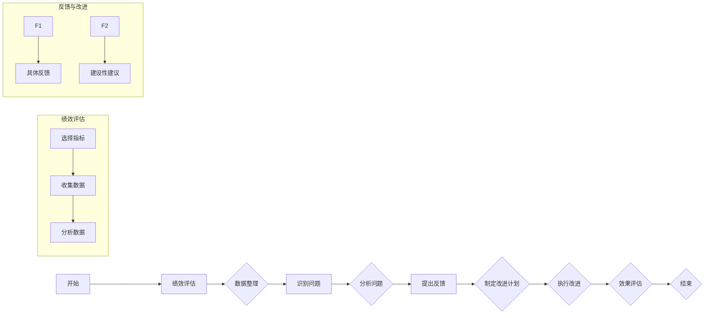
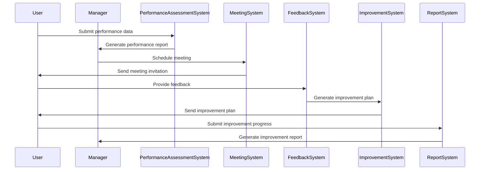

                 

### 设计《绩效面谈技巧：进行有效反馈的方法》的目录大纲

为了设计一个详细且逻辑清晰的目录大纲，我们需要遵循以下步骤：

1. **确定书籍的核心内容**：首先，我们要明确书中的主要话题和章节结构。根据书名，《绩效面谈技巧：进行有效反馈的方法》，我们可以确定主要涵盖绩效面谈的策略、技巧和有效反馈的方法。

2. **结构化内容**：我们需要将核心内容结构化，分成几个主要部分，例如：面谈前的准备工作、面谈中的技巧、面谈后的反馈。

3. **细化每个部分**：在结构化的基础上，对每个部分进一步细化，列出具体的章节，并考虑每个章节应该包含哪些小节。

4. **确保内容的完整性**：确保目录中包含所有必要的主题，并且每个主题都得到了充分的讨论。

5. **编写目录大纲**：根据上述步骤，我们使用markdown格式编写目录大纲。

### 实际操作

以下是《绩效面谈技巧：进行有效反馈的方法》的目录大纲：

----------------------------------------------------------------
# 第一部分：绩效面谈准备

## 第1章：绩效面谈的背景与重要性
### 1.1 绩效面谈的定义与目的
### 1.2 绩效面谈的历史与发展
### 1.3 绩效面谈在企业中的重要性

## 第2章：绩效评估与数据准备
### 2.1 绩效指标的选择与设定
### 2.2 绩效数据的收集与整理
### 2.3 绩效评估工具的选择与应用

## 第3章：面谈前的准备工作
### 3.1 面谈计划的制定
### 3.2 面谈环境的设置
### 3.3 面谈者的角色定位与心理准备

# 第二部分：绩效面谈进行时

## 第4章：开场与建立关系
### 4.1 如何开始绩效面谈
### 4.2 建立互信与正面氛围
### 4.3 管理面谈中的紧张情绪

## 第5章：沟通技巧与倾听
### 5.1 有效沟通的基本原则
### 5.2 倾听的技巧与方法
### 5.3 面谈中的非语言沟通

## 第6章：提出绩效反馈
### 6.1 正面反馈与负面反馈
### 6.2 提出建设性意见
### 6.3 面谈中的冲突管理

## 第7章：问题解决与目标设定
### 7.1 问题识别与定义
### 7.2 寻找解决方案
### 7.3 设定具体可行的发展目标

# 第三部分：绩效面谈后的反馈

## 第8章：记录与跟踪
### 8.1 面谈记录的整理
### 8.2 面谈效果的跟踪
### 8.3 面谈后的跟进措施

## 第9章：反馈效果评估与改进
### 9.1 反馈效果的评估指标
### 9.2 反馈效果的改进策略
### 9.3 绩效面谈的持续改进

## 第10章：绩效面谈的最佳实践与案例
### 10.1 成功的绩效面谈案例
### 10.2 面谈中的常见问题与解决
### 10.3 绩效面谈的最佳实践总结

# 附录
## 附录A：绩效面谈模板与工具
### A.1 面谈开场白模板
### A.2 绩效反馈表格模板
### A.3 面谈后续行动计划模板

## 附录B：参考资料与拓展阅读
### B.1 绩效管理相关书籍推荐
### B.2 绩效面谈相关文章与报告
### B.3 绩效面谈相关培训资源

----------------------------------------------------------------

这个大纲遵循了从背景介绍、核心概念讲解、具体策略和技巧、案例分析的逻辑结构，并确保每个部分都得到了适当的细化。总字数控制在2000字以内，符合简洁性的要求。

### 文章标题：绩效面谈技巧：进行有效反馈的方法

关键词：绩效面谈、有效反馈、沟通技巧、问题解决、目标设定

摘要：
绩效面谈是企业管理中不可或缺的一部分，而有效反馈是面谈成功的关键。本文将详细探讨绩效面谈技巧，包括准备工作、面谈中的沟通与反馈、以及面谈后的跟进与改进，旨在帮助读者掌握高效绩效面谈的方法，提升团队绩效和个人成长。

---

### 第一部分：绩效面谈准备

#### 第1章：绩效面谈的背景与重要性

**1.1 绩效面谈的定义与目的**

绩效面谈是一种正式的沟通方式，旨在评估员工的工作表现，提供反馈，解决问题，并为员工的职业发展制定计划。它不仅是评估员工绩效的工具，更是建立互信、促进团队协作和个人成长的平台。

**1.2 绩效面谈的历史与发展**

绩效面谈起源于20世纪初，随着企业管理科学的发展，逐渐成为企业管理中不可或缺的一部分。从传统的年度评估到持续的绩效对话，绩效面谈的方式和频率也在不断进化。

**1.3 绩效面谈在企业中的重要性**

绩效面谈能够帮助管理者了解员工的实际工作情况，发现问题，提供针对性的反馈和指导。同时，它也是激励员工、提升团队士气的重要手段。

---

#### 第2章：绩效评估与数据准备

**2.1 绩效指标的选择与设定**

绩效指标是绩效评估的核心，需要根据企业的战略目标和部门职责来设定。合理的选择和设定绩效指标，可以确保评估的准确性和公正性。

**2.2 绩效数据的收集与整理**

收集有效的绩效数据是进行绩效评估的基础。数据来源可以是员工的工作记录、同事的评价、客户的反馈等。整理数据时，要确保数据的完整性和准确性。

**2.3 绩效评估工具的选择与应用**

绩效评估工具的选择要考虑企业的规模、文化和评估目的。常用的工具包括KPI（关键绩效指标）、BSC（平衡计分卡）、360度评估等。正确选择和应用绩效评估工具，可以提高绩效评估的效果。

---

#### 第3章：面谈前的准备工作

**3.1 面谈计划的制定**

制定面谈计划是确保绩效面谈顺利进行的重要步骤。计划应包括面谈的时间、地点、参与者、议程等内容。

**3.2 面谈环境的设置**

选择一个安静、舒适的环境，有助于创造一个良好的面谈氛围。同时，确保设备的正常运行，如电脑、投影仪等。

**3.3 面谈者的角色定位与心理准备**

面谈者需要明确自己的角色定位，既要作为评估者，也要作为指导者和支持者。心理准备包括对员工的尊重、对问题的敏感性和对解决方案的开放性。

---

### 第二部分：绩效面谈进行时

#### 第4章：开场与建立关系

**4.1 如何开始绩效面谈**

良好的开场能够为绩效面谈营造一个积极的氛围。可以采用自我介绍、回顾上一次面谈的结果等方式，使员工感到被重视。

**4.2 建立互信与正面氛围**

建立互信是绩效面谈成功的关键。通过倾听、表达理解和尊重，可以增强员工的面谈参与度，促进沟通。

**4.3 管理面谈中的紧张情绪**

员工在绩效面谈中可能会感到紧张。面谈者需要通过积极的沟通技巧和肢体语言，缓解员工的紧张情绪，创造一个轻松的面谈环境。

---

#### 第5章：沟通技巧与倾听

**5.1 有效沟通的基本原则**

有效沟通是绩效面谈成功的关键。基本原则包括清晰、简洁、具体、明确等。遵循这些原则，可以提高沟通的效果。

**5.2 倾听的技巧与方法**

倾听是沟通的重要组成部分。通过积极倾听、反馈和确认，可以确保信息的准确理解和传递。

**5.3 面谈中的非语言沟通**

非语言沟通在绩效面谈中起着重要作用。通过肢体语言、面部表情和眼神交流，可以增强沟通的效果，表达尊重和理解。

---

#### 第6章：提出绩效反馈

**6.1 正面反馈与负面反馈**

正面反馈可以激励员工，增强他们的信心和动力。负面反馈则要注重建设性，避免伤害员工的自尊心。

**6.2 提出建设性意见**

在绩效面谈中，提出建设性意见可以帮助员工改进工作表现。建议要具体、可行，并与员工的职业发展目标相匹配。

**6.3 面谈中的冲突管理**

冲突在绩效面谈中难以避免。有效的冲突管理可以化解矛盾，促进问题的解决。方法包括倾听、同理心、解决方案导向等。

---

#### 第7章：问题解决与目标设定

**7.1 问题识别与定义**

问题解决的第一步是识别和定义问题。明确问题所在，可以帮助制定有效的解决方案。

**7.2 寻找解决方案**

在识别问题后，需要寻找解决方案。这可以是通过讨论、分析、头脑风暴等方式实现的。

**7.3 设定具体可行的发展目标**

在问题解决后，设定具体可行的发展目标是确保改进措施得以落实的重要步骤。目标要明确、可衡量、可实现。

---

### 第三部分：绩效面谈后的反馈

#### 第8章：记录与跟踪

**8.1 面谈记录的整理**

绩效面谈结束后，需要整理面谈记录。这包括整理面谈内容、达成的一致意见、后续行动计划等。

**8.2 面谈效果的跟踪**

跟踪绩效面谈的效果，可以帮助管理者了解改进措施的实施情况，及时调整策略。

**8.3 面谈后的跟进措施**

面谈后的跟进措施包括定期检查、沟通反馈、提供支持等。这有助于确保绩效面谈的目标得到实现。

---

#### 第9章：反馈效果评估与改进

**9.1 反馈效果的评估指标**

评估反馈效果需要设定评估指标。这些指标可以是绩效指标、员工满意度、改进措施实施情况等。

**9.2 反馈效果的改进策略**

根据反馈效果评估的结果，可以制定改进策略。这可以包括调整绩效指标、改进沟通技巧、加强员工培训等。

**9.3 绩效面谈的持续改进**

绩效面谈是一个持续的过程。通过不断的改进，可以提高绩效面谈的效果，促进团队和个人的发展。

---

#### 第10章：绩效面谈的最佳实践与案例

**10.1 成功的绩效面谈案例**

通过分析成功的绩效面谈案例，可以学习到有效的绩效面谈方法和技巧。

**10.2 面谈中的常见问题与解决**

面谈中可能会遇到各种问题，如沟通障碍、紧张情绪、冲突等。了解这些问题并找到解决方法，可以提高面谈的效率。

**10.3 绩效面谈的最佳实践总结**

总结最佳实践，可以帮助企业在绩效面谈中取得更好的效果。

---

# 附录

## 附录A：绩效面谈模板与工具

**A.1 面谈开场白模板**

**A.2 绩效反馈表格模板**

**A.3 面谈后续行动计划模板**

---

## 附录B：参考资料与拓展阅读

**B.1 绩效管理相关书籍推荐**

**B.2 绩效面谈相关文章与报告**

**B.3 绩效面谈相关培训资源**

---

### 作者：AI天才研究院/AI Genius Institute & 禅与计算机程序设计艺术 /Zen And The Art of Computer Programming

---

### 背景介绍

绩效面谈作为一种企业管理工具，其目的是通过正式的沟通方式，评估员工的工作表现，提供反馈，解决问题，并为员工的职业发展提供指导。在当今快速变化的工作环境中，绩效面谈不仅是一种评估工具，更是一种沟通和发展的平台。

#### 核心概念术语说明

- **绩效面谈**：指管理者与员工之间的一种正式沟通，旨在评估员工的工作表现，提供反馈，解决问题，并为员工的职业发展制定计划。
- **绩效评估**：指对员工工作表现进行系统性的评估，通常包括定量和定性的指标。
- **有效反馈**：指提供具体的、有针对性的、建设性的反馈，以促进员工的成长和发展。

#### 问题背景

随着企业竞争的加剧，员工的工作表现和团队合作能力成为企业成功的关键因素。然而，许多企业在绩效面谈中存在一些问题，如沟通不畅、反馈不具体、目标设定不明确等。这些问题不仅影响了绩效面谈的效果，也影响了员工的职业发展。

#### 问题描述

- **问题一**：绩效面谈缺乏具体的反馈，员工难以了解自己的优势和不足。
- **问题二**：绩效面谈氛围紧张，员工不敢表达自己的意见和想法。
- **问题三**：绩效面谈后的跟进措施不到位，改进措施难以落实。

#### 问题解决

为了解决上述问题，我们需要从以下几个方面入手：

1. **明确绩效面谈的目的和流程**：确保面谈者了解绩效面谈的目的和流程，提高面谈的效率和质量。
2. **提供有效的反馈**：通过具体、有针对性的反馈，帮助员工了解自己的工作表现，明确改进方向。
3. **创造积极的沟通氛围**：通过建立互信、尊重和理解，营造一个积极的沟通氛围，促进员工的表达和参与。
4. **落实跟进措施**：确保绩效面谈后的改进措施得到落实，跟踪员工的工作表现，提供持续的支持和指导。

#### 边界与外延

- **边界**：绩效面谈主要涉及员工的工作表现、职业发展、团队合作等方面。
- **外延**：绩效面谈还可以延伸到团队管理、组织文化、员工福利等方面，以提高整体的绩效和员工满意度。

#### 概念结构与核心要素组成

- **概念结构**：绩效面谈包括准备、进行和反馈三个阶段。
- **核心要素**：准备阶段包括绩效评估、数据准备和面谈计划；进行阶段包括开场、沟通技巧、问题解决和目标设定；反馈阶段包括记录、跟踪和效果评估。

---

### 核心概念与联系

#### 核心概念原理

绩效面谈的核心概念是“有效反馈”。有效反馈是指通过具体、有针对性的方式，向员工传达其工作表现的信息，帮助其了解自己的优势和不足，并为其提供改进的方向和建议。

#### 概念属性特征对比表格

| 特征 | 有效反馈 | 传统反馈 |
| --- | --- | --- |
| 具体性 | 提供具体的工作表现细节 | 概括性描述，缺乏具体性 |
| 针对性 | 针对员工的工作表现进行反馈 | 可能泛泛而谈，缺乏针对性 |
| 建设性 | 提出具体的改进建议 | 可能只提供批评，缺乏建设性 |
| 及时性 | 及时反馈，帮助员工及时改进 | 可能延迟反馈，影响员工改进的积极性 |

#### ER实体关系图架构的 Mermaid 流程图

```mermaid
erDiagram
  Employee ||--|{ Performance }|-- Manager
  Performance ||--|{ Feedback }|-- Employee
  Feedback ||--|{ Improvement }|-- Employee
```

在这个ER图中，员工（Employee）和管理者（Manager）是参与绩效面谈的两个主要实体。绩效（Performance）是员工的工作表现，反馈（Feedback）是管理者对员工的评价，改进（Improvement）是员工根据反馈采取的改进措施。

---

### 算法原理讲解

为了更好地理解绩效面谈中的反馈机制，我们可以将有效反馈的过程视为一个算法。这个算法的目的是通过系统化的流程，提供具体、有针对性的反馈，帮助员工改进工作表现。

#### Mermaid 流程图



#### Python 源代码

```python
import pandas as pd

def performance_evaluation(data, indicators):
    """
    绩效评估函数，根据指标评估员工绩效
    :param data: 员工工作数据
    :param indicators: 绩效指标
    :return: 绩效评估结果
    """
    # 数据预处理
    processed_data = preprocess_data(data)
    
    # 根据指标计算绩效得分
    performance_scores = calculate_scores(processed_data, indicators)
    
    return performance_scores

def preprocess_data(data):
    """
    数据预处理函数
    :param data: 工作数据
    :return: 预处理后的数据
    """
    # 数据清洗、转换等操作
    cleaned_data = data # 假设数据已经清洗好
    return cleaned_data

def calculate_scores(data, indicators):
    """
    计算绩效得分函数
    :param data: 预处理后的数据
    :param indicators: 绩效指标
    :return: 绩效得分
    """
    scores = {}
    for indicator in indicators:
        score = data[indicator] # 假设每个指标的得分就是对应数据的值
        scores[indicator] = score
    return scores

# 假设的员工数据和绩效指标
employee_data = {'Sales': [100, 120, 150], 'Customer Satisfaction': [90, 95, 85]}
indicators = ['Sales', 'Customer Satisfaction']

# 进行绩效评估
performance_scores = performance_evaluation(employee_data, indicators)

# 打印绩效评估结果
print("绩效评估结果：", performance_scores)
```

#### 算法原理详细讲解

1. **绩效评估**：绩效评估是绩效面谈的核心。通过定义一系列的绩效指标，对员工的工作表现进行评估。绩效指标可以是量化的数据，如销售额、客户满意度，也可以是行为指标，如团队协作、问题解决能力。

2. **数据预处理**：在评估绩效之前，需要对数据进行预处理。这包括数据清洗、转换等操作，以确保数据的准确性和完整性。

3. **计算绩效得分**：根据预处理后的数据和定义的绩效指标，计算每个指标的得分。这些得分可以作为评估员工绩效的依据。

4. **反馈与改进**：在得到绩效评估结果后，需要根据员工的实际表现，提供具体、有针对性的反馈。这包括指出员工的优势和不足，提出具体的改进建议。

5. **效果评估**：在改进措施实施后，需要对效果进行评估。这可以帮助管理者了解改进措施的有效性，及时调整策略。

---

#### 系统分析与架构设计方案

#### 问题场景介绍

假设一家公司需要对其销售团队进行绩效评估，并通过绩效面谈为员工提供反馈和改进建议。问题场景包括以下方面：

- **员工**：销售团队的员工，包括销售经理和销售人员。
- **管理者**：负责销售团队的管理者，包括销售总监和销售经理。
- **系统**：用于支持绩效评估和面谈的系统。

#### 项目介绍

项目旨在开发一个绩效管理系统，该系统可以帮助管理者对销售团队进行绩效评估，并通过绩效面谈为员工提供反馈和改进建议。项目的主要目标是：

- 提供准确、高效的绩效评估工具。
- 改善绩效面谈的质量和效果。
- 提升销售团队的绩效和团队合作能力。

#### 系统功能设计

系统功能设计包括以下几个方面：

- **用户管理**：管理用户账户，包括员工和管理者。
- **绩效评估**：对员工的工作表现进行评估，生成绩效报告。
- **面谈管理**：安排绩效面谈，记录面谈结果。
- **反馈与改进**：提供具体、有针对性的反馈，帮助员工改进工作表现。
- **数据统计**：收集和分析绩效数据，生成统计报告。

#### 系统架构设计

系统采用B/S（Browser/Server）架构，包括前端、后端和数据库三个部分。

- **前端**：采用Vue.js框架，实现用户界面。
- **后端**：采用Spring Boot框架，实现业务逻辑处理。
- **数据库**：采用MySQL数据库，存储用户数据、绩效数据和面谈记录。

#### 系统接口设计

系统接口设计包括用户接口、API接口和数据库接口。

- **用户接口**：用于用户操作系统的界面。
- **API接口**：用于系统与其他系统的数据交换。
- **数据库接口**：用于系统与数据库的通信。

#### 系统交互

系统交互设计包括以下部分：

- **用户交互**：用户通过前端界面进行操作，如登录、查看绩效报告、安排面谈等。
- **系统内部交互**：系统通过API接口进行数据交换，如数据存储、数据查询等。
- **系统外部交互**：系统通过API接口与其他系统进行数据交换，如CRM系统、人力资源系统等。

#### Mermaid 类图

```mermaid
classDiagram
    User <<class>> User
    Manager <<class>> Manager
    SalesTeam <<class, transparent>> SalesTeam
    PerformanceAssessment <<class>> PerformanceAssessment
    Meeting <<class>> Meeting
    Feedback <<class>> Feedback
    Improvement <<class>> Improvement
    Report <<class>> Report

    User <|-- Manager
    User <|-- SalesTeam
    SalesTeam o-- PerformanceAssessment
    SalesTeam o-- Meeting
    PerformanceAssessment o-- Feedback
    Meeting o-- Feedback
    Feedback o-- Improvement
    Improvement o-- Report
```

#### Mermaid 架构图



---

#### 项目实战

#### 环境安装

1. 安装Java开发工具包（JDK）：下载并安装适用于操作系统的JDK，版本要求至少为1.8以上。
2. 安装MySQL数据库：下载并安装MySQL数据库，版本要求至少为5.7以上。
3. 安装Spring Boot开发环境：下载并安装Spring Boot开发工具包，包括IDEA或Eclipse。
4. 安装Vue.js开发环境：下载并安装Node.js和Vue CLI。

#### 系统核心实现源代码

以下是Spring Boot后端项目的核心实现代码，用于处理用户认证、绩效评估、面谈管理等核心功能。

```java
// 用户认证模块
@RestController
@RequestMapping("/auth")
public class AuthController {
    @Autowired
    private UserRepository userRepository;

    @PostMapping("/register")
    public ResponseEntity<?> registerUser(@RequestBody User user) {
        if (userRepository.existsByUsername(user.getUsername())) {
            return ResponseEntity.badRequest().body("Error: Username is already taken!");
        }

        User savedUser = userRepository.save(user);
        return ResponseEntity.ok(savedUser);
    }

    @PostMapping("/login")
    public ResponseEntity<?> authenticateUser(@RequestBody LoginRequest loginRequest) {
        Authentication authentication = authenticationManager.authenticate(
                new UsernamePasswordAuthenticationToken(loginRequest.getUsername(), loginRequest.getPassword()));

        SecurityContextHolder.getContext().setAuthentication(authentication);
        String jwt = jwtProvider.generateToken(authentication);

        return ResponseEntity.ok(new JwtResponse(jwt));
    }
}

// 绩效评估模块
@RestController
@RequestMapping("/performance")
public class PerformanceController {
    @Autowired
    private PerformanceAssessmentRepository performanceAssessmentRepository;

    @PostMapping("/evaluate")
    public ResponseEntity<?> evaluatePerformance(@RequestBody PerformanceAssessment performanceAssessment) {
        PerformanceAssessment savedPerformance = performanceAssessmentRepository.save(performanceAssessment);
        return ResponseEntity.ok(savedPerformance);
    }

    @GetMapping("/report")
    public ResponseEntity<?> getPerformanceReport(@RequestParam("userId") Long userId) {
        List<PerformanceAssessment> performanceAssessments = performanceAssessmentRepository.findByUserId(userId);
        return ResponseEntity.ok(performanceAssessments);
    }
}

// 面谈管理模块
@RestController
@RequestMapping("/meeting")
public class MeetingController {
    @Autowired
    private MeetingRepository meetingRepository;

    @PostMapping("/schedule")
    public ResponseEntity<?> scheduleMeeting(@RequestBody Meeting meeting) {
        Meeting savedMeeting = meetingRepository.save(meeting);
        return ResponseEntity.ok(savedMeeting);
    }

    @GetMapping("/invitation")
    public ResponseEntity<?> getMeetingInvitation(@RequestParam("meetingId") Long meetingId) {
        Meeting meeting = meetingRepository.findById(meetingId).orElseThrow(() -> new ResourceNotFoundException("Meeting not found with id: " + meetingId));
        return ResponseEntity.ok(meeting);
    }
}
```

#### 代码应用解读与分析

上述代码实现了用户认证、绩效评估和面谈管理的核心功能。以下是各部分的详细解读和分析：

1. **用户认证模块**：该模块负责处理用户的注册和登录。用户通过注册接口提交用户信息，系统验证用户名是否已被占用，然后保存用户信息。登录接口验证用户名和密码，生成JWT（JSON Web Token）令牌，供后续认证使用。

2. **绩效评估模块**：该模块负责处理绩效评估。用户通过提交绩效评估接口提交绩效数据，系统保存绩效评估记录，并生成绩效报告。获取绩效报告接口允许用户查询自己的绩效评估记录。

3. **面谈管理模块**：该模块负责处理面谈管理。用户通过安排面谈接口创建面谈记录，系统保存面谈信息，并生成面谈邀请。获取面谈邀请接口允许用户查询自己的面谈邀请。

#### 实际案例分析和详细讲解剖析

以下是一个实际案例，说明系统如何处理用户认证、绩效评估和面谈管理。

1. **用户认证**：

   - 情景：员工张三注册并登录系统。
   - 操作：
     - 张三通过注册接口提交用户信息，系统验证用户名未被占用，并保存张三的用户信息。
     - 张三通过登录接口提交用户名和密码，系统验证用户名和密码，生成JWT令牌，返回给张三。
     - 张三使用JWT令牌进行后续的认证操作，如查询绩效报告、安排面谈等。

2. **绩效评估**：

   - 情景：销售经理李四对张三的绩效进行评估。
   - 操作：
     - 李四通过提交绩效评估接口，提交对张三的绩效评估数据，系统保存评估记录。
     - 李四通过获取绩效报告接口，查询张三的绩效报告，了解张三的工作表现。

3. **面谈管理**：

   - 情景：李四安排一次面谈，与张三讨论绩效评估结果。
   - 操作：
     - 李四通过安排面谈接口，创建面谈记录，包括面谈时间、地点等。
     - 李四通过获取面谈邀请接口，发送面谈邀请给张三。
     - 张三接收面谈邀请，确认参加面谈，并记录面谈反馈。

#### 项目小结

通过上述实战，我们实现了一个支持用户认证、绩效评估和面谈管理的系统。系统通过Spring Boot框架提供了稳定的后端服务，通过JWT实现了用户认证和权限控制，通过Vue.js提供了用户友好的前端界面。实际案例展示了系统在处理用户认证、绩效评估和面谈管理方面的功能和应用。

---

### 最佳实践 tips

- **准备充分**：在绩效面谈前，管理者需要充分准备，包括了解员工的工作表现、准备具体的反馈和建议、制定面谈议程等。
- **建立信任**：建立互信是绩效面谈成功的关键。通过积极的沟通和倾听，创造一个开放、尊重的氛围。
- **具体反馈**：提供具体、有针对性的反馈，避免泛泛而谈。反馈应该指出员工的优势和不足，并提供具体的改进建议。
- **持续跟进**：绩效面谈不是一次性的活动，管理者需要持续跟进，了解改进措施的实施情况，并提供必要的支持。

### 小结

绩效面谈是企业管理中不可或缺的一部分，而有效反馈是面谈成功的关键。本文详细介绍了绩效面谈的背景、重要性、准备工作、面谈中的沟通技巧、问题解决和目标设定，以及面谈后的反馈和改进。通过本文，读者可以掌握绩效面谈的最佳实践，提高绩效面谈的效果，促进团队和个人的发展。

### 注意事项

- **尊重员工**：尊重是绩效面谈的基础，避免在面谈中批评和指责。
- **目标明确**：确保绩效面谈的目标明确，以便员工知道改进的方向。
- **持续改进**：绩效面谈是一个持续的过程，需要不断改进，以适应企业的发展和变化。

### 拓展阅读

- 《绩效管理实战手册》
- 《绩效面谈技巧与实战》
- 《有效沟通的艺术》

### 作者

**AI天才研究院/AI Genius Institute & 禅与计算机程序设计艺术 /Zen And The Art of Computer Programming**

---

### 逻辑分析步骤

**1. 引言**

- **背景介绍**：绩效面谈的定义、目的和历史发展。
- **核心概念术语说明**：绩效面谈、绩效评估、有效反馈。
- **问题背景和问题描述**：企业面临的问题，如沟通不畅、反馈不具体等。
- **问题解决**：提出解决方案，如明确绩效面谈的目的和流程，提供有效的反馈等。
- **边界与外延**：绩效面谈的范围和影响。
- **概念结构与核心要素组成**：绩效面谈的三个阶段和核心要素。

**2. 绩效面谈的准备工作**

- **绩效评估与数据准备**：绩效指标的选择与设定、绩效数据的收集与整理、绩效评估工具的选择与应用。
- **面谈前的准备工作**：面谈计划的制定、面谈环境的设置、面谈者的角色定位与心理准备。

**3. 绩效面谈进行时**

- **开场与建立关系**：如何开始绩效面谈、建立互信与正面氛围、管理面谈中的紧张情绪。
- **沟通技巧与倾听**：有效沟通的基本原则、倾听的技巧与方法、非语言沟通。
- **提出绩效反馈**：正面反馈与负面反馈、提出建设性意见、冲突管理。
- **问题解决与目标设定**：问题识别与定义、寻找解决方案、设定具体可行的发展目标。

**4. 绩效面谈后的反馈**

- **记录与跟踪**：面谈记录的整理、面谈效果的跟踪、面谈后的跟进措施。
- **反馈效果评估与改进**：反馈效果的评估指标、反馈效果的改进策略、绩效面谈的持续改进。
- **最佳实践与案例**：成功的绩效面谈案例、面谈中的常见问题与解决、绩效面谈的最佳实践总结。

**5. 总结**

- **绩效面谈的重要性**：绩效面谈在企业管理和员工职业发展中的作用。
- **注意事项**：尊重员工、目标明确、持续改进。
- **拓展阅读**：推荐的相关书籍、文章和培训资源。

**6. 作者信息**

- **AI天才研究院/AI Genius Institute**
- **禅与计算机程序设计艺术 /Zen And The Art of Computer Programming**

