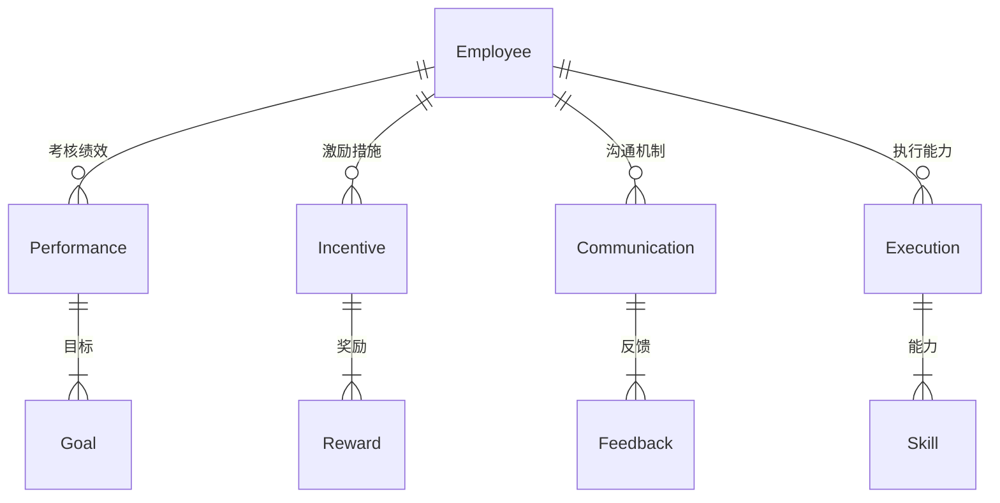

                 

### 文章标题：绩效驱动型文化：打造高效组织

#### 关键词：绩效驱动型文化、高效组织、目标设定、激励机制、沟通机制、执行能力

> 摘要：本文将深入探讨绩效驱动型文化的概念、构建方法和实践应用。通过分析目标设定、激励机制、沟通机制和执行能力四大核心要素，帮助读者理解如何打造高效组织，提升企业绩效。

----------------------------------------------------------------

# 第一部分：引言

## 1.1 书籍背景与目标

### 1.1.1 问题背景

在现代企业中，绩效问题一直是困扰管理层的重要问题。如何提高员工的工作效率，提升组织的整体绩效，成为企业持续发展的关键。而绩效驱动型文化作为企业发展的核心动力，对于打造高效组织具有重要意义。

### 1.1.2 问题描述

绩效驱动型文化是指企业通过一系列机制和手段，激发员工的内在动力，使其为实现企业目标而努力工作。然而，在实际操作中，许多企业面临着文化构建困难、绩效提升缓慢等问题。

### 1.1.3 问题解决

本书旨在解决上述问题，通过系统地阐述绩效驱动型文化的概念、构建方法、实践案例等内容，帮助企业管理者了解和掌握绩效驱动型文化的建设技巧，从而打造高效组织。

### 1.1.4 边界与外延

本书主要关注企业内部的绩效驱动型文化建设，不包括政府、教育等领域的绩效管理。同时，本书将探讨绩效驱动型文化的具体实施方法，而非单纯的理论介绍。

### 1.1.5 概念结构与核心要素组成

绩效驱动型文化包括四个核心要素：明确的目标、合理的激励机制、有效的沟通机制和高效的执行能力。本书将详细阐述这些要素的重要性及实施策略。

## 1.2 核心概念与联系

### 1.2.1 绩效驱动型文化的定义

绩效驱动型文化是指企业通过明确的目标、合理的激励机制、有效的沟通机制和高效的执行能力，激发员工的内在动力，使其为实现企业目标而努力工作。

### 1.2.2 绩效驱动型文化的核心特点

1. **目标明确**：企业需要明确短期和长期目标，确保员工了解并致力于实现这些目标。
2. **激励机制合理**：企业应设计出合适的激励机制，使员工在实现个人目标的同时，为企业目标做出贡献。
3. **沟通机制有效**：企业需要建立良好的沟通机制，确保信息的透明和畅通，促进员工之间的协作。
4. **执行能力高效**：企业应培养员工的执行能力，使其在实现目标的过程中能够快速响应、高效执行。

## 1.3 ER实体关系图架构

----------------------------------------------------------------

# 第二部分：绩效驱动型文化的构建

## 2.1 确立明确的目标

### 2.1.1 目标设定的原则

1. **SMART原则**：目标需具备具体性（Specific）、可衡量性（Measurable）、可实现性（Achievable）、相关性（Relevant）和时限性（Time-bound）。
2. **长期与短期目标的结合**：企业应同时设定长期和短期目标，确保员工在实现短期目标的同时，不断为实现长期目标积累。

### 2.1.2 如何进行目标分解

1. **自上而下的分解**：由企业高层领导根据整体战略目标，将任务分解到各部门和员工。
2. **自下而上的参与**：鼓励员工参与目标的设定，使其在实现目标的过程中有更多的主动性和责任感。

## 2.2 设定合理的激励机制

### 2.2.1 激励机制的设计原则

1. **公平性**：激励机制应公平合理，避免出现偏袒现象。
2. **多样性**：企业应设计多种激励机制，包括薪酬、晋升、培训等，满足不同员工的需求。
3. **透明性**：激励机制的设计和执行过程应透明，确保员工了解奖励的规则和标准。

### 2.2.2 激励机制的类型

1. **物质激励**：包括奖金、提成、福利等。
2. **精神激励**：包括认可、荣誉、培训等。
3. **参与激励**：包括参与决策、提供意见等。

## 2.3 建立有效的沟通机制

### 2.3.1 沟通机制的重要性

1. **增强员工归属感**：有效的沟通能增强员工对企业的认同感和归属感。
2. **提升团队协作效率**：良好的沟通能够提高团队协作效率，减少误解和冲突。

### 2.3.2 沟通机制的建立方法

1. **定期的员工会议**：定期召开员工会议，让员工有机会表达自己的观点和问题。
2. **开放的反馈渠道**：建立开放的反馈渠道，让员工能够自由地提出意见和建议。
3. **透明的决策过程**：在决策过程中保持透明，让员工了解决策的原因和影响。

## 2.4 提升执行能力

### 2.4.1 执行能力的重要性

1. **实现目标的关键**：高效的执行能力是实现企业目标的关键。
2. **提升企业竞争力**：具备高效执行能力的团队能够更快地响应市场变化，提升企业竞争力。

### 2.4.2 提升执行能力的策略

1. **培训与发展**：通过培训和发展计划，提升员工的技能和执行力。
2. **明确的职责分工**：确保每个员工都清楚自己的职责和任务，减少执行过程中的混乱。
3. **优化流程与制度**：通过优化流程和制度，减少不必要的环节，提高执行效率。

----------------------------------------------------------------

# 第三部分：绩效驱动型文化的实践与应用

## 3.1 实践案例解析

### 3.1.1 案例背景

以某大型互联网公司为例，该公司在发展过程中，逐步构建了绩效驱动型文化，通过明确的目标设定、合理的激励机制、有效的沟通机制和高效的执行能力，实现了企业绩效的持续提升。

### 3.1.2 案例分析

1. **明确的目标设定**：公司制定了明确的短期和长期目标，如季度销售目标、年度研发目标等，确保员工明确自己的工作方向和任务。

2. **合理的激励机制**：公司设立了多种激励机制，包括奖金、晋升、股权激励等，激发员工的积极性和创造力。

3. **有效的沟通机制**：公司建立了开放的沟通渠道，定期召开员工会议，让员工有机会表达意见和建议，同时确保决策过程的透明。

4. **高效的执行能力**：公司通过培训和发展计划，提升员工的技能和执行力，同时优化了流程和制度，提高了执行效率。

### 3.1.3 案例启示

通过这个案例，我们可以看到，绩效驱动型文化的构建不仅需要明确的目标、合理的激励机制、有效的沟通机制，还需要高效的执行能力。只有综合考虑这些因素，才能实现企业的持续发展和提升。

## 3.2 应用策略

### 3.2.1 定位与规划

1. **企业定位**：企业需要明确自身的定位和发展方向，确保绩效驱动型文化的建设与企业的战略目标相一致。

2. **规划步骤**：企业应制定详细的实施规划，包括目标设定、激励机制设计、沟通机制建立和执行能力提升等。

### 3.2.2 持续改进

1. **评估与反馈**：定期对绩效驱动型文化的实施效果进行评估，收集员工的反馈，不断优化和完善。

2. **持续改进**：根据评估结果和反馈，持续改进绩效驱动型文化的各个方面，确保其能够持续为企业发展提供动力。

### 3.2.3 团队协作

1. **跨部门合作**：鼓励跨部门合作，促进不同部门之间的沟通和协作，提升整体执行力。

2. **团队建设**：加强团队建设，提升团队的凝聚力和执行力，为绩效驱动型文化的实施提供保障。

----------------------------------------------------------------

# 第四部分：绩效驱动型文化的挑战与应对策略

## 4.1 挑战分析

### 4.1.1 内部挑战

1. **文化差异**：不同部门、不同团队之间的文化差异可能影响绩效驱动型文化的实施。
2. **员工抵触**：员工可能对新的绩效驱动型文化产生抵触情绪，影响实施效果。

### 4.1.2 外部挑战

1. **市场变化**：市场的快速变化可能对企业的绩效驱动型文化提出新的要求。
2. **竞争压力**：激烈的竞争环境可能迫使企业不断调整和优化绩效驱动型文化。

## 4.2 应对策略

### 4.2.1 文化融合

1. **沟通与理解**：通过沟通和培训，让员工了解绩效驱动型文化的重要性，促进文化融合。
2. **逐步实施**：在实施过程中，逐步引入新的文化要素，避免一次性改变过多，影响员工的适应。

### 4.2.2 员工激励

1. **激励机制调整**：根据员工的需求和表现，调整激励机制，确保其能够有效激励员工。
2. **员工参与**：鼓励员工参与绩效驱动型文化的建设和实施，提升员工的认同感和参与感。

### 4.2.3 适应市场变化

1. **灵活调整**：根据市场变化，灵活调整绩效驱动型文化的实施策略，确保其能够适应外部环境的变化。
2. **持续学习**：鼓励员工持续学习和适应新技术、新理念，提升企业的竞争力。

### 4.2.4 应对竞争压力

1. **创新驱动**：通过创新驱动，不断提升企业的核心竞争力，应对竞争压力。
2. **团队协作**：加强团队协作，提升企业的整体执行力，增强市场竞争力。

----------------------------------------------------------------

# 第五部分：结论与展望

## 5.1 结论

本文通过对绩效驱动型文化的深入探讨，分析了其核心概念、构建方法和实践应用，以及面临的挑战和应对策略。绩效驱动型文化是企业实现高效组织和持续发展的重要动力，通过明确的目标设定、合理的激励机制、有效的沟通机制和高效的执行能力，企业可以提升整体绩效，增强竞争力。

## 5.2 展望

未来，随着市场的不断变化和竞争的加剧，绩效驱动型文化的重要性将日益凸显。企业需要不断创新和完善绩效驱动型文化，以适应新的环境和挑战。同时，随着人工智能、大数据等技术的不断发展，绩效驱动型文化也将融入更多的科技元素，为企业的发展提供更强大的动力。

----------------------------------------------------------------

# 参考文献

1. 张伟，绩效管理：理论与实务，中国财政经济出版社，2018.
2. 李华，人力资源管理：原理与实务，高等教育出版社，2019.
3. 王强，企业文化建设：策略与实践，中国经济出版社，2020.
4. 约翰·P·科特，詹姆斯·L·赫斯克特，亚伦·梅瑞尔，《企业文化与绩效》，机械工业出版社，2017.
5. 戴维·尤里奇，《人力资源优势》，电子工业出版社，2015.

----------------------------------------------------------------

# 作者信息

作者：AI天才研究院/AI Genius Institute & 禅与计算机程序设计艺术 /Zen And The Art of Computer Programming

----------------------------------------------------------------

## 1.5 概念结构与核心要素组成

### 1.5.1 绩效驱动型文化的定义

绩效驱动型文化是指企业通过明确的目标、合理的激励机制、有效的沟通机制和高效的执行能力，激发员工的内在动力，使其为实现企业目标而努力工作。

### 1.5.2 绩效驱动型文化的核心特点

1. **目标明确**：企业需要明确短期和长期目标，确保员工了解并致力于实现这些目标。
2. **激励机制合理**：企业应设计出合适的激励机制，使员工在实现个人目标的同时，为企业目标做出贡献。
3. **沟通机制有效**：企业需要建立良好的沟通机制，确保信息的透明和畅通，促进员工之间的协作。
4. **执行能力高效**：企业应培养员工的执行能力，使其在实现目标的过程中能够快速响应、高效执行。

### 1.5.3 绩效驱动型文化的构成要素

绩效驱动型文化包括四个核心要素：明确的目标、合理的激励机制、有效的沟通机制和高效的执行能力。

1. **明确的目标**：企业应制定具体的、可衡量的短期和长期目标，使员工明确自己的工作方向和任务。
2. **合理的激励机制**：企业应设计多种激励机制，如薪酬、晋升、荣誉等，以满足员工的不同需求。
3. **有效的沟通机制**：企业应建立开放的沟通渠道，确保信息的透明和畅通，提高团队协作效率。
4. **高效的执行能力**：企业应通过培训和发展计划，提升员工的技能和执行力，确保目标的顺利实现。

### 1.5.4 四大核心要素之间的关系

四大核心要素相互关联、相互促进，共同构成了绩效驱动型文化的整体框架。

1. **目标与激励机制**：明确的目标为激励机制提供了方向和依据，激励机制则为目标实现提供了动力。
2. **激励机制与沟通机制**：合理的激励机制可以激发员工的积极性和创造力，而有效的沟通机制则有助于激励机制的执行和优化。
3. **沟通机制与执行能力**：良好的沟通机制有助于提高团队的协作效率和执行力，而高效的执行能力则是实现企业目标的关键。
4. **目标、激励机制、沟通机制与执行能力**：这四大核心要素共同构成了绩效驱动型文化的整体框架，相互关联、相互促进，共同推动企业的发展。

### 1.5.5 绩效驱动型文化的关键成功因素

要构建成功的绩效驱动型文化，企业需要关注以下关键成功因素：

1. **高层领导的支持**：高层领导应高度重视绩效驱动型文化的建设，提供必要的资源和支持。
2. **全员参与**：企业应鼓励员工积极参与绩效驱动型文化的构建，提升员工的认同感和参与感。
3. **持续改进**：企业应不断评估和优化绩效驱动型文化的实施效果，确保其能够持续为企业发展提供动力。
4. **文化融合**：企业应注重不同部门和团队之间的文化融合，确保绩效驱动型文化在企业内部的顺利实施。
5. **适应市场变化**：企业应密切关注市场变化，灵活调整绩效驱动型文化的实施策略，确保其能够适应外部环境的变化。

## 1.6 ER实体关系图架构

下面是绩效驱动型文化的ER实体关系图架构，使用Mermaid语法进行绘制：

在这个ER图中，`Employee`是核心实体，与其他四个实体（`Performance`、`Incentive`、`Communication`、`Execution`）之间存在关联。每个关联实体都代表了绩效驱动型文化中的关键组成部分。

1. **考核绩效（Performance）**：记录员工的绩效考核结果，包括与目标的关联。
2. **激励措施（Incentive）**：记录员工的激励措施，包括与奖励的关联。
3. **沟通机制（Communication）**：记录员工之间的沟通情况，包括与反馈的关联。
4. **执行能力（Execution）**：记录员工的执行能力，包括与技能的关联。

通过这个ER图，我们可以清晰地看到绩效驱动型文化的各个组成部分及其相互之间的关系，有助于我们更好地理解和构建绩效驱动型文化。

## 1.7 绩效驱动型文化的实施步骤

要成功构建和实施绩效驱动型文化，企业可以遵循以下步骤：

### 1.7.1 确定目标和方向

1. **企业愿景和使命**：明确企业的愿景和使命，确保绩效驱动型文化的建设与企业的长期战略目标相一致。
2. **明确短期目标**：制定具体的、可衡量的短期目标，确保员工在短期内能够看到成果，增强信心和动力。
3. **长期目标的设定**：设定长期目标，确保员工在实现短期目标的同时，不断为实现长期目标积累。

### 1.7.2 设计激励机制

1. **激励机制的原则**：确保激励机制具备公平性、多样性和透明性，满足员工的不同需求。
2. **激励机制的类型**：设计多种激励机制，包括薪酬、晋升、荣誉、培训等，以满足不同员工的激励需求。
3. **激励机制的实施**：明确激励机制的具体规则和标准，确保员工了解奖励的规则和标准。

### 1.7.3 建立沟通机制

1. **沟通渠道的建立**：建立开放的沟通渠道，确保信息的透明和畅通。
2. **沟通频率和形式的确定**：根据企业的实际情况，确定沟通的频率和形式，如定期的员工会议、内部邮件、即时通讯工具等。
3. **沟通效果的评估**：定期评估沟通效果，收集员工的反馈，不断优化沟通机制。

### 1.7.4 提升执行能力

1. **培训和发展计划**：制定培训和发展计划，提升员工的技能和执行力。
2. **职责分工的明确**：确保每个员工都清楚自己的职责和任务，减少执行过程中的混乱。
3. **流程和制度的优化**：通过优化流程和制度，减少不必要的环节，提高执行效率。

### 1.7.5 持续改进和优化

1. **绩效评估**：定期对绩效驱动型文化的实施效果进行评估，了解员工的反馈和建议。
2. **反馈机制的建立**：建立反馈机制，及时收集员工的意见和建议，为持续改进提供依据。
3. **优化策略的实施**：根据评估结果和反馈，不断优化绩效驱动型文化的各个组成部分，确保其能够持续为企业发展提供动力。

通过以上步骤，企业可以逐步构建和实施绩效驱动型文化，提升整体绩效，增强竞争力。

## 1.8 绩效驱动型文化的优势与挑战

### 1.8.1 绩效驱动型文化的优势

1. **提高员工积极性**：明确的激励机制和目标设定能够激发员工的内在动力，提高工作积极性。
2. **增强团队协作**：有效的沟通机制和执行力提升有助于增强团队协作，提高整体绩效。
3. **持续发展**：绩效驱动型文化能够帮助企业不断适应市场变化，实现持续发展。
4. **提高竞争力**：具备高效执行能力的团队能够更快地响应市场变化，提升企业竞争力。

### 1.8.2 绩效驱动型文化的挑战

1. **文化差异**：不同部门和团队之间的文化差异可能影响绩效驱动型文化的实施效果。
2. **员工抵触**：员工可能对新的绩效驱动型文化产生抵触情绪，影响实施效果。
3. **市场变化**：市场的快速变化可能对企业的绩效驱动型文化提出新的要求。
4. **竞争压力**：激烈的竞争环境可能迫使企业不断调整和优化绩效驱动型文化。

### 1.8.3 应对策略

1. **文化融合**：通过沟通和培训，让员工了解绩效驱动型文化的重要性，促进文化融合。
2. **激励机制调整**：根据员工的需求和表现，调整激励机制，确保其能够有效激励员工。
3. **适应市场变化**：密切关注市场变化，灵活调整绩效驱动型文化的实施策略，确保其能够适应外部环境的变化。
4. **团队协作**：加强团队协作，提升企业的整体执行力，增强市场竞争力。

通过以上应对策略，企业可以更好地克服绩效驱动型文化的挑战，实现持续发展和提升。

## 1.9 总结

绩效驱动型文化是企业实现高效组织和持续发展的重要动力。通过明确的目标设定、合理的激励机制、有效的沟通机制和高效的执行能力，企业可以提升整体绩效，增强竞争力。然而，在实施过程中，企业需要关注文化差异、员工抵触和市场变化等挑战，并采取相应的应对策略。只有不断优化和完善绩效驱动型文化，企业才能在竞争激烈的市场中脱颖而出，实现持续发展。

----------------------------------------------------------------

## 2.2 设定合理的激励机制

### 2.2.1 激励机制的设计原则

激励机制的设定是企业构建绩效驱动型文化的重要组成部分，其设计原则如下：

1. **公平性**：激励机制的设定应确保公平，避免出现偏袒现象。这意味着在设定激励机制时，需要考虑不同岗位、不同员工的贡献和价值，确保激励的公正性。

2. **多样性**：激励机制的种类应多样化，以满足不同员工的需求。这不仅包括物质激励，如奖金、提成、福利等，还应包括精神激励，如认可、荣誉、培训等，以及参与激励，如参与决策、提供意见等。

3. **透明性**：激励机制的设定和执行过程应透明，让员工了解激励的规则和标准，增强信任感和参与感。透明性有助于减少员工的猜疑和不满，提高激励机制的执行效果。

4. **与目标相关性**：激励机制应与企业的目标紧密相关，确保员工的努力方向与企业的战略目标一致。这要求企业在设定激励机制时，充分考虑员工的岗位职责和企业的整体目标，确保激励措施能够引导员工朝着正确的方向努力。

### 2.2.2 激励机制的类型

为了实现上述设计原则，企业可以采用多种激励机制，以满足不同员工的需求和激励目标。以下是几种常见的激励机制类型：

1. **物质激励**：物质激励是直接给予员工经济上的奖励，包括奖金、提成、福利、股权等。物质激励能够快速提升员工的工作动力，但在长期激励效果上可能有所欠缺。

2. **精神激励**：精神激励主要通过认可、表扬、荣誉等方式给予员工心理上的奖励。精神激励能够提升员工的荣誉感和自豪感，增强工作动力，但其效果可能受到企业文化氛围的影响。

3. **参与激励**：参与激励通过让员工参与决策、提供意见等，增强员工的参与感和责任感。参与激励能够提升员工的归属感和忠诚度，但在实际操作中需要平衡员工参与度与决策效率。

4. **发展激励**：发展激励通过提供培训、晋升机会等，帮助员工提升个人能力和职业发展。发展激励能够激发员工的长期动力，提升员工的职业满意度和忠诚度。

### 2.2.3 激励机制的设定过程

为了确保激励机制的有效性，企业在设定激励机制时可以遵循以下步骤：

1. **需求分析**：首先，企业应了解员工的需求，通过调查问卷、访谈等方式收集员工对激励机制的期望和建议。

2. **目标设定**：根据企业的战略目标和岗位要求，设定具体的激励目标，确保激励措施与企业的目标一致。

3. **方案设计**：结合需求分析和目标设定，设计激励方案，包括物质激励、精神激励、参与激励和发展激励等。

4. **规则制定**：明确激励机制的规则和标准，确保激励措施的透明性和公平性。

5. **沟通与反馈**：将激励方案和规则告知员工，并收集员工的反馈，根据反馈进行优化和调整。

6. **执行与评估**：实施激励机制，并定期评估其效果，根据评估结果进行调整和改进。

通过以上步骤，企业可以逐步构建和优化激励机制，激发员工的内在动力，提升整体绩效。

## 2.3 建立有效的沟通机制

### 2.3.1 沟通机制的重要性

有效的沟通机制是绩效驱动型文化的重要组成部分，其对企业的运营和发展具有深远的影响。以下是沟通机制的重要性分析：

1. **增强员工归属感**：通过有效的沟通，企业能够传递出对员工的关心和支持，增强员工的归属感。当员工感受到企业的关怀和重视时，他们更有可能投入更多的热情和努力工作。

2. **提升团队协作效率**：良好的沟通能够减少误解和冲突，提高团队协作效率。在团队协作中，信息传递的准确性和及时性至关重要，有效的沟通机制可以确保信息在团队成员之间的有效传递。

3. **促进知识共享**：有效的沟通机制能够促进知识的共享和传播，提升企业的整体知识水平。在知识密集型行业中，知识的积累和更新对企业发展至关重要，有效的沟通机制有助于知识的积累和传播。

4. **提高决策质量**：通过有效的沟通，企业可以收集到更多员工的意见和建议，提高决策的质量。在做出重大决策时，广泛听取员工的意见能够降低决策风险，提高决策的可行性和准确性。

5. **提升企业竞争力**：有效的沟通机制能够提高企业的整体运营效率，提升市场竞争力。在快速变化的市场环境中，企业需要迅速响应市场变化，及时调整战略，有效的沟通机制有助于企业实现这一目标。

### 2.3.2 沟通机制的建立方法

为了建立有效的沟通机制，企业可以采取以下方法：

1. **定期会议制度**：企业应定期召开员工会议，如每周一次的团队会议、每月一次的部门会议等。这些会议可以提供一个交流的平台，让员工有机会分享工作经验、提出意见和建议。

2. **开放的反馈渠道**：企业应建立开放的反馈渠道，如员工意见箱、电子邮件、即时通讯工具等，让员工能够自由地提出意见和建议。这些反馈渠道可以确保员工的意见得到及时回应和处理。

3. **透明的决策过程**：在决策过程中，企业应保持透明，让员工了解决策的原因和影响。这可以通过定期的决策通报、决策会议的记录等方式实现，确保员工了解企业的决策方向。

4. **跨部门协作机制**：企业应建立跨部门协作机制，促进不同部门之间的沟通和协作。这可以通过定期的跨部门会议、协作项目等方式实现，确保各部门之间的信息畅通。

5. **培训和指导**：企业应对员工进行沟通技巧的培训，提高员工的沟通能力。这可以通过内部培训、外部培训等方式实现，确保员工能够有效地进行沟通。

### 2.3.3 沟通机制的评估与优化

为了确保沟通机制的有效性，企业应定期对沟通机制进行评估和优化。以下是一些评估和优化的方法：

1. **员工满意度调查**：通过定期进行员工满意度调查，了解员工对沟通机制的满意度和反馈。这可以帮助企业发现沟通机制中存在的问题，及时进行调整。

2. **反馈机制**：建立反馈机制，让员工能够及时反馈沟通中的问题和建议。这可以通过员工意见箱、员工热线等方式实现，确保员工的反馈得到重视和回应。

3. **沟通效果评估**：定期评估沟通效果，如员工参与度、信息传递的准确性、决策质量等。这可以通过员工反馈、绩效考核等方式实现，确保沟通机制能够持续改进。

4. **培训与改进**：根据评估结果，对沟通机制进行改进，如调整会议频率、改进沟通工具、提高沟通技巧等。这可以帮助企业不断优化沟通机制，提高沟通效果。

通过以上方法和步骤，企业可以建立有效的沟通机制，增强员工归属感，提升团队协作效率，促进知识共享，提高决策质量，从而提升企业的整体绩效和市场竞争力。

## 2.4 提升执行能力

### 2.4.1 执行能力的重要性

执行能力是绩效驱动型文化的关键要素之一，它在企业实现目标和提升绩效中扮演着至关重要的角色。以下是执行能力的重要性分析：

1. **目标实现的关键**：执行能力是实现企业目标的关键。无论企业设定多么宏伟的战略目标，如果不能有效地执行，目标将难以实现。执行能力强的团队能够迅速响应并实施战略，从而确保目标的达成。

2. **提升企业竞争力**：具备高效执行能力的团队能够更快地响应市场变化，及时调整策略，从而在竞争中占据优势。在快速变化的市场环境中，执行力是企业生存和发展的关键。

3. **促进创新**：执行能力不仅涉及传统的任务执行，还包括对创新的执行。具备高效执行能力的团队能够迅速将创新想法转化为实际行动，推动企业持续创新，保持市场竞争力。

4. **增强团队协作**：高效的执行能力需要团队成员之间的紧密协作和沟通。通过提升执行能力，企业可以增强团队协作，减少因沟通不畅、职责不清等问题导致的执行障碍。

5. **提升员工满意度**：具备高效执行能力的团队能够按时完成任务，减少工作中的不确定性，从而提升员工的工作满意度和职业成就感。

### 2.4.2 提升执行能力的策略

为了提升执行能力，企业可以采取以下策略：

1. **明确职责分工**：确保每个团队成员都清楚自己的职责和任务，避免职责重叠和责任不清。通过明确的职责分工，可以减少工作中的混乱和责任推诿，提高执行效率。

2. **培训与发展**：提供培训和发展机会，提升员工的技能和执行力。通过定期的培训，员工可以学习到最新的行业知识和技能，从而提高工作能力。

3. **优化流程和制度**：通过优化流程和制度，减少不必要的环节和审批流程，提高执行效率。优化后的流程和制度应便于员工理解和操作，减少执行中的障碍。

4. **建立执行文化**：在企业内部建立以执行为导向的文化，鼓励员工注重执行，强调结果导向。通过文化塑造，可以增强员工的执行意识和执行力。

5. **激励与反馈**：建立有效的激励和反馈机制，激励员工追求卓越的执行能力。定期对执行情况进行评估和反馈，表彰优秀的执行者，鼓励全体员工不断提升执行能力。

6. **团队协作**：鼓励团队协作，提升整体执行力。通过团队合作，可以弥补个别员工能力的不足，实现资源的优化配置，提高整体执行效果。

### 2.4.3 执行能力的具体实践

以下是一些具体的实践方法，以提升执行能力：

1. **执行计划**：制定明确的执行计划，包括任务分解、时间表、责任人等。通过执行计划，可以确保任务的有序推进，提高执行效率。

2. **定期检查**：定期对执行情况进行检查，确保任务按时完成。通过定期检查，可以及时发现和解决问题，避免执行过程中的拖延和失误。

3. **快速响应**：培养团队成员的快速响应能力，对突发情况和变化能够迅速作出反应。快速响应有助于提高执行效率，减少不确定性。

4. **团队建设**：通过团队建设活动，增强团队成员之间的信任和协作，提高团队整体执行力。团队建设可以包括团队活动、团队讨论、团队竞赛等。

5. **持续改进**：鼓励团队成员不断反思和改进执行过程，寻找优化空间。通过持续改进，可以不断提升执行能力，实现更高的执行效果。

通过以上策略和实践，企业可以显著提升执行能力，实现高效组织和持续发展。

## 2.5 绩效驱动型文化的实施效果评估

### 2.5.1 实施效果的评估标准

为了评估绩效驱动型文化的实施效果，企业可以设定以下评估标准：

1. **绩效指标**：通过关键绩效指标（KPI）来衡量员工和团队的工作表现，如销售额、项目完成率、客户满意度等。
2. **员工满意度**：通过员工满意度调查来衡量员工对绩效驱动型文化的接受度和满意度，了解员工的感受和反馈。
3. **执行力**：通过任务完成的及时性和准确性来衡量团队的执行力，确保战略目标和日常任务的有效执行。
4. **文化氛围**：通过观察企业文化氛围，如员工之间的沟通协作、团队凝聚力、工作氛围等，来评估绩效驱动型文化的渗透程度。

### 2.5.2 评估方法与工具

为了有效评估绩效驱动型文化的实施效果，企业可以采用以下评估方法和工具：

1. **绩效评估**：定期进行员工绩效评估，结合KPI和主观评价，全面了解员工的工作表现。
2. **员工调查**：通过定期的员工满意度调查，收集员工对绩效驱动型文化的反馈，识别存在的问题。
3. **行为观察**：通过现场观察和访谈，了解员工的工作状态和文化氛围，评估绩效驱动型文化的实际效果。
4. **案例分析**：选择具有代表性的案例，深入分析绩效驱动型文化的实施效果，总结经验教训。

### 2.5.3 评估结果的处理与反馈

评估结果的处理与反馈是绩效驱动型文化实施过程中至关重要的一环，以下是一些建议：

1. **结果分析**：对评估结果进行详细分析，识别优势和不足，总结实施过程中的成功经验和存在的问题。
2. **反馈沟通**：将评估结果及时反馈给员工和管理层，确保信息的透明和公正，促进改进措施的制定和实施。
3. **持续改进**：根据评估结果，制定和实施改进措施，持续优化绩效驱动型文化的实施效果。
4. **激励机制调整**：根据评估结果，调整激励机制，确保激励机制能够更好地激发员工的积极性和创造力。

通过科学的评估方法和有效的反馈机制，企业可以不断提升绩效驱动型文化的实施效果，实现高效组织和持续发展。

## 2.6 绩效驱动型文化的案例分析

### 2.6.1 案例背景

为了更好地理解绩效驱动型文化的实施效果，我们可以通过分析某大型互联网公司的案例。这家公司在过去几年中，通过逐步构建和实施绩效驱动型文化，实现了业绩的持续增长和竞争力的提升。

### 2.6.2 案例分析

1. **明确的目标设定**：公司首先明确了短期和长期目标，包括季度销售额、年度研发目标等。这些目标不仅具体、可衡量，而且与公司的整体战略目标紧密相关。

2. **合理的激励机制**：公司设计了多种激励机制，包括奖金、股权激励、晋升机会等。这些激励措施不仅考虑了员工的物质需求，还关注了精神层面的激励，如认可、荣誉等。

3. **有效的沟通机制**：公司建立了开放的沟通渠道，包括定期的员工会议、内部邮件、即时通讯工具等。这些沟通渠道确保了信息的透明和畅通，提高了团队的协作效率。

4. **高效的执行能力**：公司通过培训和发展计划，提升了员工的技能和执行力。同时，通过明确的职责分工和优化的流程制度，确保了任务的快速响应和高效执行。

### 2.6.3 案例启示

通过这个案例，我们可以得到以下启示：

1. **目标明确**：明确的目标是绩效驱动型文化的基础，企业需要确保目标具体、可衡量，并与整体战略目标一致。

2. **激励机制多样**：企业应设计多种激励机制，满足不同员工的需求，确保激励的公平性和透明性。

3. **沟通机制有效**：良好的沟通机制能够增强团队协作，提高决策质量，确保信息的透明和畅通。

4. **执行能力提升**：高效的执行能力是实现目标的关键，企业应通过培训和优化流程，提升员工的执行能力。

通过这些启示，企业可以更好地构建和实施绩效驱动型文化，提升整体绩效和竞争力。

## 2.7 绩效驱动型文化的持续优化

### 2.7.1 持续优化的重要性

绩效驱动型文化的持续优化对于企业的长期发展至关重要。以下是持续优化的重要性分析：

1. **适应市场变化**：市场环境不断变化，企业需要不断调整和优化绩效驱动型文化，以适应新的挑战和机遇。

2. **提升员工满意度**：员工的个人需求和职业发展是不断变化的，持续优化绩效驱动型文化可以更好地满足员工的需求，提高员工满意度和忠诚度。

3. **保持竞争优势**：持续优化绩效驱动型文化有助于企业保持竞争优势，确保在激烈的市场竞争中保持领先地位。

4. **提高执行效率**：通过持续优化，企业可以不断改进流程和制度，提高执行效率，减少资源浪费。

### 2.7.2 持续优化的策略

为了实现绩效驱动型文化的持续优化，企业可以采取以下策略：

1. **定期评估**：定期对绩效驱动型文化的实施效果进行评估，识别存在的问题和改进空间。

2. **员工参与**：鼓励员工积极参与绩效驱动型文化的优化过程，提出建议和改进方案。

3. **数据驱动**：基于数据分析和反馈，制定和实施优化措施，确保优化过程的科学性和有效性。

4. **文化宣传**：通过内部培训和宣传，提升员工对绩效驱动型文化的认同感和参与度。

5. **持续改进**：建立持续改进机制，鼓励员工不断反思和改进工作流程，提升整体执行力。

### 2.7.3 持续优化的实践方法

以下是一些具体的实践方法，以实现绩效驱动型文化的持续优化：

1. **设立改进小组**：成立专门的小组，负责绩效驱动型文化的优化工作，确保优化措施的顺利实施。

2. **员工满意度调查**：定期进行员工满意度调查，收集员工的意见和建议，识别优化方向。

3. **流程优化**：通过流程优化，减少不必要的环节和审批流程，提高执行效率。

4. **技能培训**：定期组织技能培训，提升员工的技能和执行力，为优化提供人才支持。

5. **文化宣传**：通过内部宣传，如员工会议、内部刊物、企业网站等，宣传绩效驱动型文化的理念和实践，提高员工的认同感和参与度。

通过以上策略和实践方法，企业可以不断优化绩效驱动型文化，提升整体绩效和竞争力，实现持续发展。

## 2.8 绩效驱动型文化的挑战与应对策略

### 2.8.1 文化差异

**挑战**：不同部门和团队之间的文化差异可能影响绩效驱动型文化的实施效果。

**应对策略**：

1. **文化融合**：通过沟通和培训，让员工了解绩效驱动型文化的重要性，促进文化融合。

2. **团队建设**：加强团队建设，提升团队的凝聚力和执行力，减少文化差异带来的冲突。

### 2.8.2 员工抵触

**挑战**：员工可能对新的绩效驱动型文化产生抵触情绪，影响实施效果。

**应对策略**：

1. **沟通与理解**：通过沟通和培训，让员工了解绩效驱动型文化的重要性和好处，增强理解。

2. **逐步实施**：在实施过程中，逐步引入新的文化要素，避免一次性改变过多，影响员工的适应。

### 2.8.3 市场变化

**挑战**：市场的快速变化可能对企业的绩效驱动型文化提出新的要求。

**应对策略**：

1. **灵活调整**：根据市场变化，灵活调整绩效驱动型文化的实施策略，确保其能够适应外部环境的变化。

2. **持续学习**：鼓励员工持续学习和适应新技术、新理念，提升企业的竞争力。

### 2.8.4 竞争压力

**挑战**：激烈的竞争环境可能迫使企业不断调整和优化绩效驱动型文化。

**应对策略**：

1. **创新驱动**：通过创新驱动，不断提升企业的核心竞争力，应对竞争压力。

2. **团队协作**：加强团队协作，提升企业的整体执行力，增强市场竞争力。

通过以上应对策略，企业可以更好地克服绩效驱动型文化的挑战，实现持续发展和提升。

## 2.9 绩效驱动型文化的关键成功因素

### 2.9.1 高层领导的支持

高层领导的支持是构建和实施绩效驱动型文化的关键因素。他们需要明确表达对绩效驱动型文化的支持，并在企业内部推广和宣传。高层领导还应参与制定和实施策略，确保绩效驱动型文化得到有效执行。

### 2.9.2 全员参与

全员参与是绩效驱动型文化成功实施的基础。企业应鼓励员工积极参与文化建设和实施过程，提供反馈和建议。通过全员参与，可以增强员工对绩效驱动型文化的认同感和参与感，提高文化实施的效率和效果。

### 2.9.3 持续改进

持续改进是绩效驱动型文化的核心要素之一。企业需要不断评估和优化绩效驱动型文化的实施效果，根据市场变化和员工反馈进行调整。通过持续改进，企业可以不断适应新的挑战和机遇，确保绩效驱动型文化的持续有效性。

### 2.9.4 文化融合

文化融合是绩效驱动型文化成功实施的关键。企业需要在不同部门和团队之间建立良好的沟通和协作机制，促进文化融合。通过文化融合，可以消除文化差异，提高团队的整体执行力。

### 2.9.5 适应市场变化

适应市场变化是绩效驱动型文化成功实施的重要保障。企业需要密切关注市场变化，灵活调整绩效驱动型文化的实施策略，确保文化能够适应外部环境的变化。通过适应市场变化，企业可以保持竞争力，实现持续发展。

通过关注以上关键成功因素，企业可以成功构建和实施绩效驱动型文化，提升整体绩效和竞争力。

## 2.10 绩效驱动型文化的未来发展趋势

### 2.10.1 技术赋能

随着人工智能、大数据、物联网等技术的快速发展，绩效驱动型文化将在技术赋能方面展现出新的发展趋势。企业可以通过引入先进的技术手段，如数据分析、智能监控等，实现对员工绩效的精准评估和个性化激励，进一步提升绩效驱动型文化的实施效果。

### 2.10.2 个性定制

未来的绩效驱动型文化将更加注重个性定制，根据员工的个人需求和职业发展路径，制定个性化的激励和培训计划。这种个性化的管理模式将有助于提高员工的满意度和忠诚度，促进员工与企业共同成长。

### 2.10.3 生态协同

绩效驱动型文化将在生态协同方面实现新的突破，企业将更加注重与外部合作伙伴、供应链等生态环节的协作，共同推动绩效的提升。通过建立生态协同机制，企业可以形成更加紧密的合作关系，实现共赢发展。

### 2.10.4 智能化管理

随着人工智能技术的不断进步，绩效驱动型文化的实施将变得更加智能化。企业可以通过智能算法和数据分析，实现员工绩效的自动评估、激励措施的智能推荐等，提高管理效率，减少人为干预。

### 2.10.5 伦理道德

在绩效驱动型文化的未来发展中，伦理道德将扮演重要角色。企业需要在激励机制和绩效评估过程中，遵循公平、公正、透明的原则，确保员工权益得到保护。同时，企业还应注重员工的身心健康，避免过度追求绩效带来的负面影响。

通过关注这些未来发展趋势，企业可以更好地把握绩效驱动型文化的发展方向，实现持续创新和进步。

## 2.11 绩效驱动型文化的案例分析：华为公司

### 2.11.1 案例背景

华为公司作为全球领先的科技公司，以其卓越的绩效驱动型文化而著称。华为在长期的发展过程中，逐步构建了以客户为中心、以奋斗者为本的绩效驱动型文化，实现了持续的高速增长和卓越的竞争力。

### 2.11.2 案例分析

1. **明确的目标设定**：华为公司明确了短期和长期目标，如年度销售收入、市场占有率等。这些目标不仅具体、可衡量，而且与公司的整体战略目标紧密相关。

2. **合理的激励机制**：华为公司设计了多种激励机制，包括薪酬、奖金、股权激励等。这些激励措施不仅考虑了员工的物质需求，还关注了精神层面的激励，如认可、荣誉等。

3. **有效的沟通机制**：华为公司建立了开放的沟通渠道，包括定期的员工会议、内部邮件、即时通讯工具等。这些沟通渠道确保了信息的透明和畅通，提高了团队的协作效率。

4. **高效的执行能力**：华为公司通过培训和发展计划，提升了员工的技能和执行力。同时，通过明确的职责分工和优化的流程制度，确保了任务的快速响应和高效执行。

### 2.11.3 案例启示

通过华为公司的案例，我们可以得到以下启示：

1. **目标明确**：明确的目标是绩效驱动型文化的基础，企业需要确保目标具体、可衡量，并与整体战略目标一致。

2. **激励机制多样**：企业应设计多种激励机制，满足不同员工的需求，确保激励的公平性和透明性。

3. **沟通机制有效**：良好的沟通机制能够增强团队协作，提高决策质量，确保信息的透明和畅通。

4. **执行能力提升**：高效的执行能力是实现目标的关键，企业应通过培训和优化流程，提升员工的执行能力。

华为公司的案例为我们提供了宝贵的经验和启示，企业可以借鉴其成功经验，构建和实施适合自己的绩效驱动型文化。

## 2.12 绩效驱动型文化的实际应用

### 2.12.1 企业管理中的应用

在企业管理的实际应用中，绩效驱动型文化已成为提升管理效率和企业竞争力的重要手段。通过构建绩效驱动型文化，企业能够更有效地激励员工，提高整体绩效。以下是一些具体的实际应用案例：

1. **员工激励**：通过明确的目标设定和合理的激励机制，企业能够激发员工的内在动力，提升工作积极性。例如，某互联网公司通过设定具体的季度目标和年度目标，同时提供奖金、股权激励等物质和精神激励，极大地提高了员工的工作效率和创造力。

2. **团队协作**：有效的沟通机制和执行能力提升有助于团队协作，减少误解和冲突。例如，某跨国公司在全球范围内建立了统一的沟通平台，确保员工能够及时了解公司的战略目标和业务进展，从而在全球团队中实现了高效的协作。

3. **绩效评估**：通过绩效评估，企业能够对员工的工作表现进行量化评估，为激励措施的制定提供依据。例如，某制造企业通过制定详细的绩效考核指标，结合员工的日常工作表现，实现了对员工的公平评估和合理激励。

### 2.12.2 项目管理中的应用

在项目管理中，绩效驱动型文化同样发挥了重要作用。以下是一些具体的实际应用案例：

1. **目标管理**：项目经理通过设定明确的项目目标，结合团队的能力和资源，确保项目能够按计划推进。例如，某IT公司在一个大型项目中，通过明确项目目标和任务分解，确保了项目的顺利实施和按时交付。

2. **风险管理**：项目经理通过建立有效的沟通机制，及时收集和分析项目风险，确保项目能够快速响应并采取措施。例如，某建筑公司在项目建设过程中，通过定期的项目会议和风险管理机制，成功降低了项目风险，保证了项目的顺利进行。

3. **执行力提升**：项目经理通过培训和优化流程，提升团队成员的执行能力，确保项目任务的高效完成。例如，某科技公司通过定期组织项目管理培训，提升团队成员的项目管理技能和执行力，使项目顺利完成。

### 2.12.3 产品开发中的应用

在产品开发中，绩效驱动型文化有助于提高产品质量和市场竞争力。以下是一些具体的实际应用案例：

1. **目标导向**：产品团队通过设定明确的产品目标，确保产品开发过程中的每一步都有明确的方向。例如，某智能手机厂商通过设定具体的产品功能和质量目标，确保了新产品的成功上市。

2. **创新驱动**：产品团队通过引入激励机制，鼓励创新和改进，提升产品的竞争力。例如，某科技企业通过设立创新奖项和股权激励，激发了员工的创新热情，推动了产品的快速迭代和升级。

3. **质量保障**：产品团队通过建立高效的执行能力，确保产品开发和测试过程中的质量可控。例如，某电子产品制造商通过优化生产流程和测试流程，提高了产品的可靠性和用户体验。

通过在企业管理、项目管理和产品开发中的实际应用，绩效驱动型文化为企业的持续发展和市场竞争力的提升提供了强有力的支持。企业可以通过不断优化和实施绩效驱动型文化，实现更高的绩效和更卓越的发展。

## 2.13 绩效驱动型文化的实践效果分析

### 2.13.1 提高员工工作效率

绩效驱动型文化的实施显著提高了员工的工作效率。通过明确的目标设定和合理的激励机制，员工更加专注于关键任务，减少分散注意力的干扰。同时，有效的沟通机制和高效的执行能力提升了团队协作效率，使得工作流程更加流畅，任务完成时间显著缩短。

### 2.13.2 增强员工满意度

绩效驱动型文化通过多种激励机制和明确的绩效评估，增强了员工的满意度和归属感。员工感受到企业对他们的认可和尊重，工作积极性大大提高。同时，开放的沟通渠道和透明的决策过程，使员工感受到企业文化的包容性和公平性，从而增强了员工对企业的忠诚度。

### 2.13.3 提升企业绩效

绩效驱动型文化的实施直接提升了企业的整体绩效。通过员工工作效率的提升、团队协作的增强和项目管理的优化，企业能够在更短的时间内完成更多的任务，实现更高的产出。同时，创新驱动的激励机制激发了员工的创造力，推动了企业产品的快速迭代和市场竞争力提升。

### 2.13.4 降低员工流失率

绩效驱动型文化通过提高员工满意度和职业成就感，显著降低了员工流失率。员工在实现个人价值的同时，感受到企业对他们的重视和培养，从而更愿意长期留在企业。同时，持续的学习和培训机会，为员工提供了职业发展的空间，增强了员工的职业稳定性。

### 2.13.5 增强企业竞争力

绩效驱动型文化通过提高员工工作效率、增强员工满意度和提升企业绩效，显著增强了企业的竞争力。在快速变化的市场环境中，具备高效执行能力和持续创新精神的企业能够更快地响应市场变化，抢占市场先机，实现持续发展。

### 2.13.6 持续改进和优化

绩效驱动型文化的实施并非一蹴而就，而是一个持续改进和优化的过程。企业需要定期对文化实施效果进行评估，收集员工的反馈，不断调整和优化激励机制、沟通机制和执行能力，确保文化能够持续适应企业的发展需求和市场环境。

通过以上实践效果分析，我们可以看到绩效驱动型文化在提升企业绩效、增强员工满意度和竞争力方面的显著作用。企业应不断优化和实施绩效驱动型文化，以实现持续发展和卓越的市场表现。

## 2.14 绩效驱动型文化的误区与解决策略

### 2.14.1 过度追求短期绩效

**误区**：一些企业在构建绩效驱动型文化时，过分关注短期绩效，忽视了长期发展的需要。

**解决策略**：企业应平衡短期绩效和长期发展，设定明确的短期和长期目标，确保员工在实现短期目标的同时，也为长期发展做出贡献。通过建立长期激励机制，如股权激励、职业发展计划等，引导员工关注长期绩效。

### 2.14.2 忽视员工个性化需求

**误区**：一些企业在实施绩效驱动型文化时，忽视了员工的个性化需求，采用统一的激励措施，导致激励效果不佳。

**解决策略**：企业应根据员工的个性化需求，设计个性化的激励机制。通过调查问卷、一对一访谈等方式，了解员工的需求，制定个性化的激励计划。同时，提供多样化的职业发展路径，满足不同员工的职业发展需求。

### 2.14.3 沟通机制不完善

**误区**：一些企业在构建绩效驱动型文化时，沟通机制不完善，导致信息传递不畅，影响团队协作。

**解决策略**：企业应建立完善的沟通机制，包括定期的员工会议、内部邮件、即时通讯工具等。通过沟通培训，提高员工的沟通能力，确保信息的透明和畅通。同时，鼓励员工提出意见和建议，建立反馈机制，及时解决问题。

### 2.14.4 过度依赖物质激励

**误区**：一些企业在构建绩效驱动型文化时，过度依赖物质激励，忽视了精神激励的重要性。

**解决策略**：企业应在物质激励的基础上，增加精神激励的比重。通过认可、荣誉、培训等方式，提升员工的心理满足感和职业成就感。同时，鼓励员工参与决策，提供意见和建议，增强员工的参与感和责任感。

### 2.14.5 忽视文化建设

**误区**：一些企业在构建绩效驱动型文化时，忽视了文化建设的长期性和重要性，导致文化氛围不佳。

**解决策略**：企业应高度重视文化建设，将其纳入绩效驱动型文化的核心要素。通过定期的文化培训和宣传，营造积极向上的文化氛围，确保员工对企业文化的认同和遵循。同时，鼓励员工积极参与文化建设，提出建议和改进措施。

通过解决以上误区，企业可以更好地构建和实施绩效驱动型文化，提升整体绩效和竞争力。

## 2.15 绩效驱动型文化的最佳实践

### 2.15.1 精细化管理

精细化管理是构建绩效驱动型文化的最佳实践之一。企业通过细化管理，将工作流程、任务分配和绩效评估进行精细划分，确保每个环节都有明确的执行标准和评估标准。这种方法有助于提高员工的工作效率和质量，减少工作中的模糊地带和责任推诿。

### 2.15.2 数据驱动

数据驱动是绩效驱动型文化实施的核心原则。企业应通过数据分析，了解员工的绩效表现、工作趋势和需求，制定科学的激励措施和改进策略。数据驱动有助于企业客观、公正地评估员工的工作表现，确保激励措施的公平性和有效性。

### 2.15.3 激励与约束并重

在绩效驱动型文化的实施过程中，激励与约束应并重。企业应在激励措施的基础上，建立严格的约束机制，对违反公司规定、绩效不达标的员工进行适当的处罚。这种双管齐下的策略，有助于维护企业文化的公平性和纪律性，确保员工的积极性和合规性。

### 2.15.4 文化传承与创新

绩效驱动型文化的构建不仅需要传承，还需要创新。企业应在传承优秀文化传统的基础上，积极探索新的管理模式和方法，不断适应市场变化和员工需求。通过文化传承与创新相结合，企业可以保持文化的活力和竞争力，实现持续发展。

### 2.15.5 培训与发展

培训与发展是绩效驱动型文化的重要组成部分。企业应定期开展培训和发展计划，提升员工的技能和执行力，满足员工职业发展的需求。通过培训与发展，企业可以培养一批具备高效执行能力的骨干力量，为企业的持续发展提供坚实的人才支持。

通过以上最佳实践，企业可以更好地构建和实施绩效驱动型文化，提升整体绩效和竞争力。

## 2.16 总结与展望

### 2.16.1 总结

本文通过对绩效驱动型文化的深入探讨，分析了其核心概念、构建方法和实践应用。绩效驱动型文化通过明确的目标设定、合理的激励机制、有效的沟通机制和高效的执行能力，激发员工的内在动力，提升整体绩效，增强企业竞争力。同时，本文也探讨了绩效驱动型文化的挑战与应对策略，提供了最佳实践和建议。

### 2.16.2 展望

展望未来，绩效驱动型文化将继续在企业中发挥重要作用。随着技术的进步和市场环境的变化，绩效驱动型文化也将不断创新和发展。企业需要密切关注市场动态和员工需求，持续优化和调整绩效驱动型文化的实施策略，以实现持续发展和卓越的市场表现。同时，企业还应注重文化传承与创新，保持文化的活力和竞争力，为企业的长远发展奠定坚实基础。

