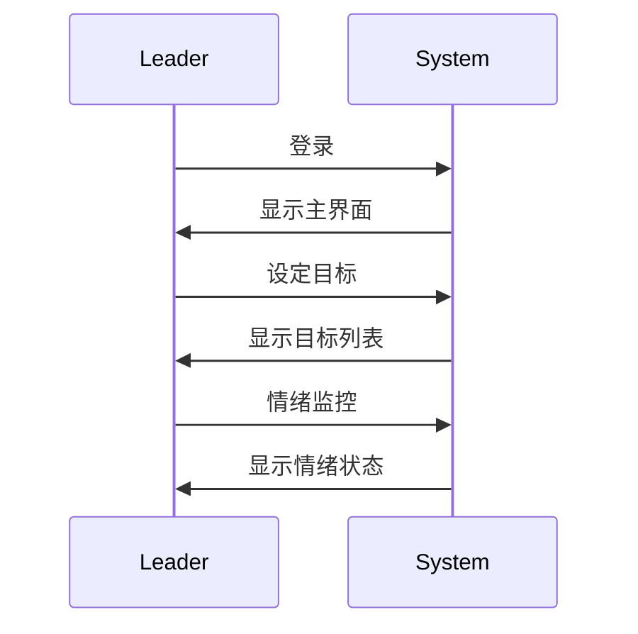

                 


### 自我管理：优秀领导者的第一步

> 关键词：自我管理，领导者，效能，目标设定，时间规划，情绪管理

> 摘要：
自我管理是成为优秀领导者的第一步。本文深入探讨了自我管理的多维度，包括心理、行为、时间管理到领导力的培养。通过科学的方法和实用的技巧，本文帮助读者理解并实践有效的自我管理策略，从而提升个人效能和领导力。

---

#### 引言

在现代社会，领导者的角色愈发重要。他们不仅需要具备出色的技术能力和商业洞察力，还需要能够有效管理自己和团队。然而，自我管理并不是一个容易达成的目标，它需要领导者具备强烈的自我意识、良好的时间管理能力和稳定的情绪状态。本文将围绕自我管理的核心概念、原理和实施步骤进行深入探讨，帮助读者成为更优秀的领导者。

---

#### 第一部分：背景介绍

##### 第1章：问题背景

在快节奏、高压力的现代工作环境中，领导者面临诸多挑战。例如，如何高效地管理时间、如何处理复杂的决策问题、如何应对情绪波动等。这些问题都直接影响到领导者的个人效能和团队绩效。因此，自我管理成为了领导者必须掌握的重要技能。

##### 第2章：问题解决

自我管理能够帮助领导者更好地应对这些挑战。通过科学的方法和实用的技巧，领导者可以提升个人效能，从而提高团队绩效。具体来说，自我管理包括以下几个方面：

1. **时间管理**：合理规划时间，提高工作效率。
2. **情绪管理**：控制情绪波动，保持心理平衡。
3. **目标设定**：确立明确的目标，提高实现率。
4. **决策能力**：提高决策质量，减少失误。

##### 第3章：边界与外延

自我管理不仅关乎个人的成长，还深刻影响着团队和组织的发展。例如，领导者的情绪管理能力会直接影响团队成员的情绪状态和工作效率；时间管理能力则决定了领导者在多大程度上能够完成重要任务和承担领导责任。

##### 第4章：概念结构与核心要素组成

自我管理是一个多维度的概念，其核心要素包括：

1. **时间管理**：合理规划时间，提高工作效率。
2. **情绪管理**：控制情绪波动，保持心理平衡。
3. **目标设定**：确立明确的目标，提高实现率。
4. **决策能力**：提高决策质量，减少失误。

这些核心要素相互关联，共同构成了自我管理的概念结构。

---

#### 第二部分：核心概念与联系

##### 第5章：核心概念原理

自我管理是指领导者通过认知、情感和行为层面的调节与控制，实现个人效能和团队绩效的提升。

##### 第6章：自我管理属性特征对比表格

| 特征         | 说明                                                         |
| ------------ | ------------------------------------------------------------ |
| **时间管理** | 合理规划时间，提高工作效率。                                   |
| **情绪管理** | 控制情绪波动，保持心理平衡。                                   |
| **目标设定** | 确立明确的目标，提高实现率。                                   |
| **决策能力** | 提高决策质量，减少失误。                                       |

---

#### 第三部分：算法原理讲解

##### 第7章：自我管理算法

自我管理算法是一个系统性的过程，包括以下几个步骤：

1. **目标设定**：确定明确的目标。
2. **时间规划**：制定合理的时间规划。
3. **情绪监控**：监控自身情绪状态。
4. **反馈调整**：根据反馈进行调整。
5. **效果评估**：评估自我管理效果。

下面是一个简单的Python实现示例：

```python
def self_management():
    print("设定目标...")
    print("时间规划...")
    print("情绪监控...")
    print("反馈调整...")
    print("效果评估...")

self_management()
```

##### 第8章：算法原理与数学模型

自我管理效率可以用以下数学模型表示：

$$
\text{自我管理效率} = f(\text{目标达成率}, \text{时间利用率}, \text{情绪稳定性})
$$

其中，目标达成率、时间利用率和情绪稳定性是自我管理效率的关键影响因素。

---

#### 第四部分：系统分析与架构设计

##### 第9章：系统功能设计

自我管理系统需要实现以下功能：

1. **目标管理**：帮助领导者设定和跟踪目标。
2. **时间管理**：提供时间规划工具。
3. **情绪管理**：提供情绪监控和调整工具。

以下是自我管理系统的类图：

```mermaid
classDiagram
    Leader <<class>> SelfManager
    Leader o-- TimeManager
    Leader o-- EmotionManager
```

##### 第10章：系统架构设计

自我管理系统采用分层架构，包括以下层次：

1. **表示层**：提供用户界面。
2. **业务逻辑层**：处理业务逻辑。
3. **数据访问层**：处理数据存储和访问。

以下是自我管理系统的架构图：



---

#### 第五部分：项目实战

##### 第11章：环境安装

在开始自我管理系统的开发之前，需要安装以下软件和环境：

1. **Python**：版本3.8及以上。
2. **Django**：一个Python Web框架。
3. **PostgreSQL**：一个关系型数据库。

安装命令如下：

```shell
pip install django
pip install psycopg2
```

##### 第12章：系统核心实现源代码

以下是自我管理系统的核心实现代码：

```python
# settings.py
DATABASES = {
    'default': {
        'ENGINE': 'django.db.backends.postgresql',
        'NAME': 'self_management',
        'USER': 'your_user',
        'PASSWORD': 'your_password',
        'HOST': 'localhost',
        'PORT': '5432',
    }
}

# views.py
from django.http import HttpResponse

def index(request):
    return HttpResponse("欢迎使用自我管理系统")
```

##### 第13章：代码应用解读与分析

以下是代码解读和分析：

1. **settings.py**：配置数据库连接信息。
2. **views.py**：定义了一个简单的首页视图。

##### 第14章：实际案例分析和详细讲解剖析

假设有一个领导者想要通过自我管理系统来管理自己的工作和情绪。他可以通过以下步骤来实现：

1. **设定目标**：在系统中设定目标，如每天完成10个任务。
2. **时间规划**：根据目标，规划每天的工作时间。
3. **情绪监控**：定期检查自己的情绪状态。
4. **反馈调整**：根据反馈调整目标和计划。

##### 第15章：项目小结

自我管理系统可以帮助领导者更好地管理自己的工作和情绪，提高个人效能和领导力。通过项目的开发和实施，读者可以了解如何设计和实现一个简单的自我管理系统。

---

#### 第六部分：最佳实践 tips、小结、注意事项、拓展阅读

##### 第16章：最佳实践 tips

1. **定期回顾**：定期回顾自己的目标、计划和情绪状态，及时进行调整。
2. **保持简洁**：避免过度复杂的目标和计划，保持简洁明了。
3. **情绪管理**：学会放松和调整自己的情绪，避免情绪波动影响到工作和生活。

##### 第17章：小结

自我管理是优秀领导者的第一步。通过有效的自我管理，领导者可以提高个人效能和领导力，从而推动团队和组织的发展。

##### 第18章：注意事项

1. **目标设定要具体**：避免设定模糊的目标，确保目标具有可衡量性。
2. **情绪管理要科学**：避免情绪失控，学会通过适当的方法来调节情绪。

##### 第19章：拓展阅读

1. **《高效能人士的七个习惯》**：史蒂芬·柯维（Stephen R. Covey）的经典著作，对自我管理提供了全面的指导。
2. **《情绪智力》**：丹尼尔·戈尔曼（Daniel Goleman）的著作，对情绪管理进行了深入探讨。

---

#### 附录

- **附录A：术语解释**：对文中提到的核心术语进行解释。
- **附录B：参考资料**：列出本文引用和参考的主要文献和资料。

---

### 结语

自我管理是领导者不可或缺的重要技能。通过本文的探讨，希望读者能够理解自我管理的重要性，并学会如何有效地进行自我管理。希望本文能够对读者的工作和生活有所帮助，成为更优秀的领导者。作者：AI天才研究院/AI Genius Institute & 禅与计算机程序设计艺术 /Zen And The Art of Computer Programming

