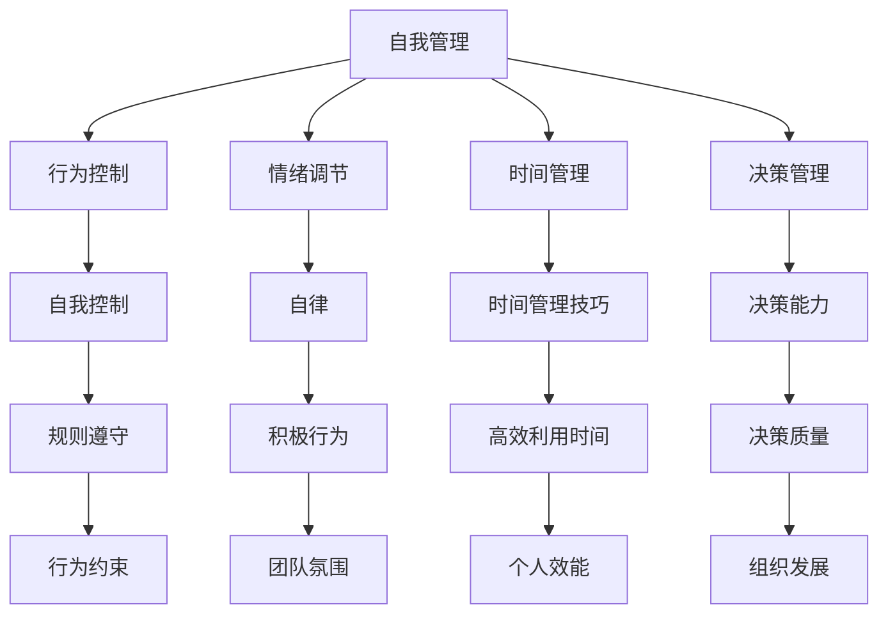
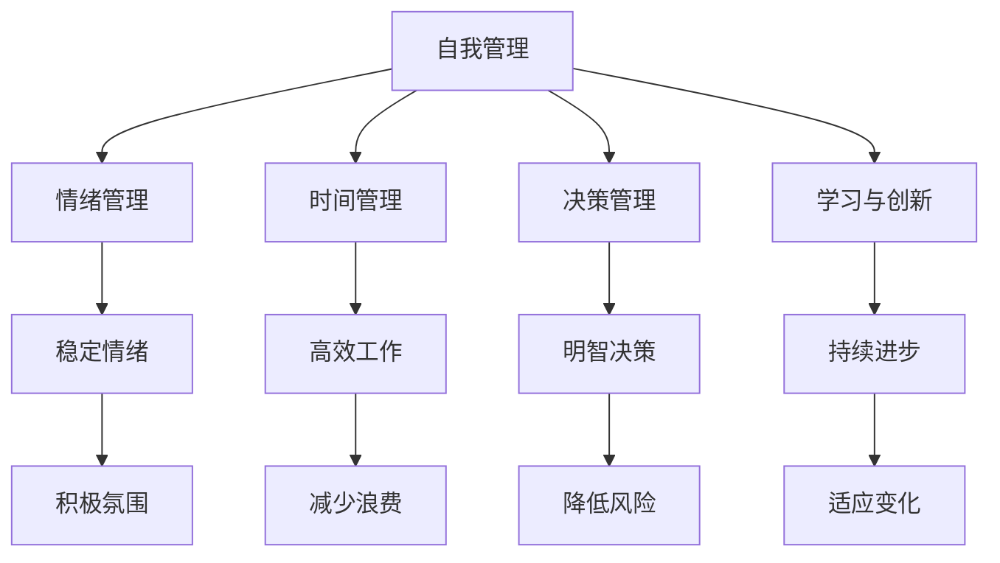
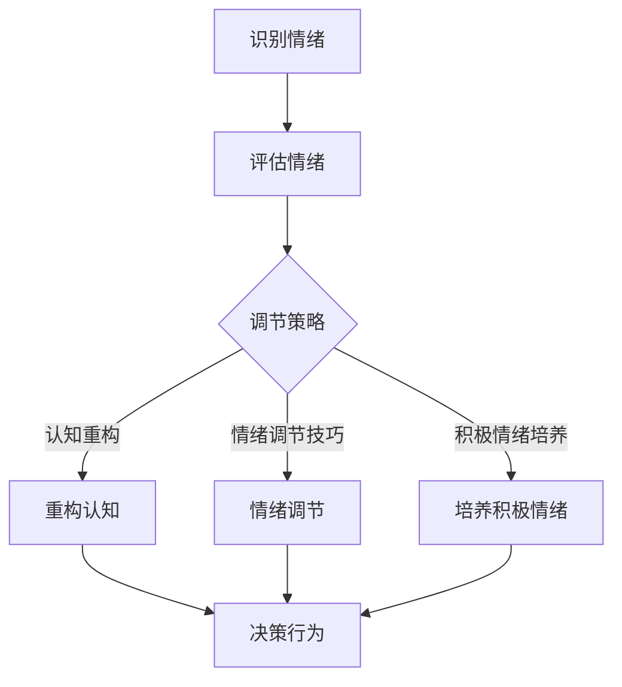
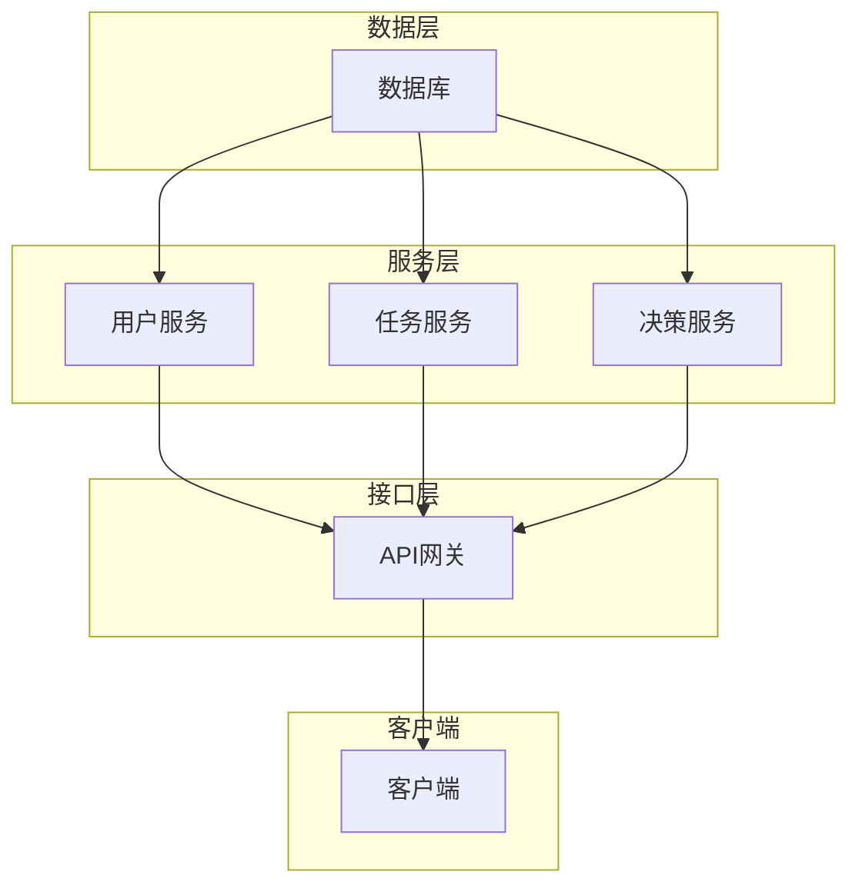
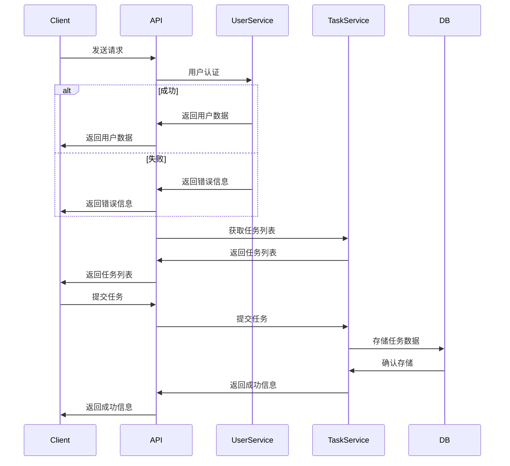

                 

### 引言

#### 自我管理的背景

自我管理，这个概念源于心理学和管理学，但它对于领导者尤其重要。自我管理，简单来说，是指个体对自己行为、情绪、时间和决策等方面的控制和调节。这一概念并非新出，早在古希腊时期，苏格拉底和柏拉图就已经提出过关于自我管理的思想。然而，随着社会的发展，特别是在信息时代，自我管理的重要性更加凸显。

在现代社会中，领导者面对着日益复杂的工作环境和快速变化的市场需求。他们不仅要处理日常的事务，还需要做出迅速且准确的决策，并具备持续学习和创新的能力。自我管理作为领导者的一项核心技能，正成为他们成功的关键因素。

#### 自我管理的目标

自我管理的目标在于帮助领导者更好地应对工作与生活的挑战，提高个人和团队的整体效能。具体来说，目标包括以下几个方面：

1. **提高工作效率**：通过自我管理，领导者可以更好地规划和管理时间，减少无意义的忙碌，从而提高工作效率。
2. **增强决策能力**：自我管理有助于领导者提升决策的质量和速度，避免因情绪波动导致的错误决策。
3. **培养情绪智力**：通过情绪管理，领导者可以更好地处理压力和挑战，建立积极的工作氛围。
4. **持续学习与成长**：自我管理鼓励领导者不断学习新知识、新技能，保持思维的开放性和创造性。

#### 自我管理的重要性

自我管理对于领导者的重要性不可忽视。以下是一些关键点：

1. **个人效能**：自我管理是提高个人效能的基础，它帮助领导者更加专注和高效地完成任务。
2. **团队效能**：领导者的自我管理直接影响团队的工作氛围和效率，良好的自我管理能够带动整个团队的发展。
3. **组织效能**：自我管理不仅影响个人的效能，还影响组织的整体效能。领导者的自我管理能力，对组织的战略决策和执行具有深远的影响。
4. **长期发展**：自我管理是领导者长期发展的关键，它帮助领导者建立坚韧的性格、高效的思维方式，为未来的挑战做好准备。

#### 总结

在本文中，我们将深入探讨自我管理的各个方面，包括领导者自我管理的要素、情绪管理、时间管理、决策管理和学习与创新等。通过逻辑清晰、结构紧凑的分析，我们希望能够帮助读者更好地理解和实践自我管理，成为卓越的领导者。接下来，我们将一步一步地解析这些关键要素，帮助读者深入理解自我管理的本质和实践方法。

---

**关键词：** 自我管理、领导者、情绪管理、时间管理、决策管理、学习与创新

**摘要：** 本文从自我管理的背景和目标出发，深入探讨了领导者自我管理的要素、情绪管理、时间管理、决策管理和学习与创新等内容。通过逻辑清晰的分析，帮助读者理解和实践自我管理，提升个人和团队效能，成为卓越的领导者。

---

## 第2章 自我管理的概念与意义

#### 核心定义

自我管理是指个体在行为、情绪、时间和决策等方面进行自我控制和调节的能力。这种能力不仅涉及内在的心理过程，还包括外在的行为表现。自我管理不仅仅是对个人行为的约束，更是对个人资源的合理配置和高效利用。

#### 意义

自我管理的意义主要体现在以下几个方面：

1. **提高个人效能**：自我管理有助于领导者更好地规划时间和任务，减少无效的工作时间，从而提高个人效能。
2. **增强决策能力**：通过自我管理，领导者可以更好地控制情绪，避免因情绪波动导致的错误决策，从而提高决策质量。
3. **建立积极的团队氛围**：领导者的自我管理能力对团队氛围有着深远的影响。一个能够有效自我管理的领导者，往往能够带动整个团队的积极性和合作精神。
4. **促进组织发展**：自我管理是组织发展的重要基石。领导者的自我管理能力直接影响组织的决策质量、执行效率和创新能力，从而推动组织实现长期目标。

#### 与其他概念的区分

尽管自我管理与其他概念如自我控制、自律、自我激励等密切相关，但它们之间仍存在一些区别：

1. **自我控制**：自我控制主要关注个体对行为的控制，包括抑制冲动、遵守规则等。自我管理则更加全面，不仅涉及行为控制，还包括情绪调节、时间管理等多个方面。
2. **自律**：自律是指个体主动遵守规则和规范，是一种积极的行为表现。自我管理则是实现自律的方法和途径，它不仅包括自律，还包括自我激励、自我监控等。
3. **自我激励**：自我激励是指个体通过内部动机和外部奖励来驱动自己实现目标。自我管理则强调如何通过自我控制和调节来实现自我激励，从而保持持续的高效状态。

#### 小结

自我管理作为一个核心概念，对于领导者而言至关重要。通过理解和实践自我管理，领导者不仅可以提高个人效能和决策能力，还能建立积极的团队氛围和推动组织发展。在接下来的章节中，我们将进一步探讨领导者自我管理的具体要素和实践方法，帮助读者深入理解并应用于实际工作。

---

**核心概念与联系：**

1. **核心概念原理**：自我管理是指个体在行为、情绪、时间和决策等方面进行自我控制和调节的能力。
2. **概念属性特征对比表格：**

| 概念 | 定义 | 关键属性 |
| --- | --- | --- |
| 自我管理 | 在行为、情绪、时间和决策等方面进行自我控制和调节 | 高效利用个人资源、提高个人和团队效能 |
| 自我控制 | 对行为进行控制，包括抑制冲动、遵守规则等 | 行为约束、规范遵守 |
| 自律 | 主动遵守规则和规范 | 积极行为表现 |
| 自我激励 | 通过内部动机和外部奖励驱动自己实现目标 | 内部动机、外部奖励 |

3. **ER实体关系图架构的Mermaid流程图：**



通过以上对比和关系图，我们可以更清晰地理解自我管理与其他相关概念的联系和区别，为后续章节的深入探讨奠定基础。

---

## 第3章 领导者自我管理的要素

领导者自我管理是卓越领导力的核心要素，它涵盖了多个方面，包括情绪管理、时间管理、决策管理和学习与创新等。理解这些要素及其相互关系，对于领导者提升自我管理能力至关重要。

#### 情绪管理

情绪管理是指领导者通过认知和行为调整来处理自己的情绪，使其不影响决策和行为。情绪管理不仅有助于领导者保持冷静和理智，还能增强团队的凝聚力和工作氛围。

**核心要素：**
1. **认知重构**：通过改变对事件的认知方式，减轻负面情绪的影响。
2. **情绪调节技巧**：如深呼吸、冥想和正念练习，帮助领导者迅速恢复情绪平衡。
3. **积极情绪培养**：通过培养乐观、自信和感恩等积极情绪，提升整体心理健康。

**关系与联系：**
情绪管理直接影响领导者的决策质量和团队氛围。情绪稳定的领导者能够更好地应对挑战，做出明智的决策，并带动团队保持积极的工作态度。

#### 时间管理

时间管理是指领导者通过合理安排时间，提高工作效率，确保任务按时完成。有效的时间管理不仅能够提升个人效能，还能为团队和组织的长远发展打下基础。

**核心要素：**
1. **优先级排序**：根据任务的重要性和紧急性进行排序，确保优先完成重要任务。
2. **时间块划分**：将工作时间划分为固定的“时间块”，专注于每个时间块内的任务。
3. **避免时间浪费**：通过减少会议时间、消除干扰和优化工作流程，减少不必要的耗时。

**关系与联系：**
时间管理直接影响领导者的工作效率和团队的整体效率。高效的时间管理能够帮助领导者更好地应对工作压力，减少疲劳，从而提升整体工作效能。

#### 决策管理

决策管理是指领导者通过科学的方法和工具，对决策过程进行管理和优化，以提高决策的质量和效率。有效的决策管理能够帮助领导者做出明智的决策，减少风险和损失。

**核心要素：**
1. **决策模型**：如SWOT分析、决策树模型等，帮助领导者系统地进行决策分析。
2. **数据驱动的决策**：通过收集和分析数据，为决策提供客观依据。
3. **风险评估**：对决策可能带来的风险进行评估，并制定相应的应对策略。

**关系与联系：**
决策管理直接影响领导者的决策质量和执行效果。科学的决策管理能够帮助领导者减少错误决策，降低风险，从而提高组织的竞争力。

#### 学习与创新

学习与创新是指领导者通过不断学习和创新，提升个人和组织的竞争力。学习与创新不仅包括对新知识、新技能的掌握，还包括对现有方法和流程的改进和创新。

**核心要素：**
1. **持续学习**：通过阅读、培训和实践，不断更新知识和技能。
2. **思维开放**：保持开放的心态，接受新的观点和方法。
3. **创新实践**：通过实验和尝试，探索新的解决方案和方法。

**关系与联系：**
学习与创新是领导者自我管理的重要组成部分。持续的学习和创新能力能够帮助领导者适应快速变化的环境，推动组织实现持续发展。

#### 小结

领导者自我管理的要素包括情绪管理、时间管理、决策管理和学习与创新。这些要素相互联系，共同构成领导者自我管理的核心框架。理解并实践这些要素，不仅能够提升领导者的个人效能，还能带动团队和组织的发展。在接下来的章节中，我们将深入探讨每个要素的具体实践方法和策略。

---

**核心概念原理：**
领导者自我管理是指领导者通过情绪管理、时间管理、决策管理和学习与创新等要素，对自身行为、情绪、时间和决策进行自我控制和调节，以提高个人和团队效能，推动组织发展。

**概念属性特征对比表格：**

| 要素 | 定义 | 关键属性 |
| --- | --- | --- |
| 情绪管理 | 处理和调节领导者自身情绪的能力 | 稳定的情绪、积极的氛围 |
| 时间管理 | 合理安排和利用时间的能力 | 高效的工作、减少浪费 |
| 决策管理 | 通过科学方法和工具进行决策的能力 | 明智的决策、减少风险 |
| 学习与创新 | 通过不断学习和创新提升个人和团队竞争力 | 持续进步、适应变化 |

**ER实体关系图架构的Mermaid流程图：**



通过以上对比和关系图，我们可以更清晰地理解领导者自我管理的要素及其相互关系，为后续章节的深入探讨奠定基础。

---

## 第4章 情绪管理

情绪管理是领导者自我管理的重要组成部分，它关乎领导者如何有效地处理和调节自身的情绪，以确保情绪不会影响决策和行为。情绪管理不仅关乎个人的心理健康，也直接影响团队氛围和整体效能。

### 情绪的类型

在情绪管理中，首先需要了解情绪的类型。情绪可以分为以下几种：

1. **积极情绪**：如喜悦、兴奋、满意等。这些情绪通常能够提升个人和团队的士气，促进合作和创新。
2. **消极情绪**：如焦虑、沮丧、愤怒等。这些情绪如果无法得到有效管理，可能会对个人和团队产生负面影响。

### 情绪管理的策略

为了有效地管理情绪，领导者可以采用以下策略：

1. **认知重构**：通过改变对事件的认知方式，减轻负面情绪的影响。例如，将“失败”重构为“学习机会”。
2. **情绪调节技巧**：如深呼吸、冥想、正念练习等，帮助领导者迅速恢复情绪平衡。
3. **积极情绪培养**：通过培养乐观、自信和感恩等积极情绪，提升整体心理健康。例如，每天记录三件值得感激的事情。
4. **情绪表达**：合理地表达情绪，避免压抑或过度发泄。例如，可以通过谈话、书写或运动等方式来表达情绪。

### 情绪管理的案例与实践

以下是一些情绪管理的实际案例与实践方法：

1. **案例一**：某公司领导者在面对重大市场挑战时，通过深呼吸和冥想练习来缓解紧张情绪，从而保持了冷静和理智，做出了正确的决策。

2. **案例二**：某团队领导者通过定期组织团队建设活动，如团建旅游、团队讨论等，来增强团队成员之间的信任和合作，从而营造了积极的工作氛围。

3. **实践方法**：领导者可以每天花5分钟进行情绪日记记录，分析情绪的变化和原因，从而找到有效的情绪调节方法。

### 小结

情绪管理是领导者自我管理的关键要素之一。通过认知重构、情绪调节技巧、积极情绪培养和情绪表达等策略，领导者可以有效管理自己的情绪，提升个人和团队的效能。在接下来的章节中，我们将继续探讨时间管理和决策管理的相关内容，帮助领导者进一步提升自我管理能力。

---

**算法原理讲解：**

情绪管理的核心在于如何识别、理解和调节情绪。我们可以使用以下算法原理来解释情绪管理的过程：

1. **情绪识别**：首先，领导者需要识别自己的情绪状态。这可以通过自我观察和反思来实现。一种简单的情绪识别方法是基于情绪词汇表，领导者可以使用这些词汇表来标记自己的情绪。

2. **情绪评估**：接下来，领导者需要评估情绪的强度和影响。这可以通过量化方法，如使用情绪量表来衡量情绪的强度。情绪量表通常包括一系列描述不同情绪强度的词汇，领导者可以根据这些词汇来评估自己的情绪状态。

3. **情绪调节**：一旦识别和评估了情绪，领导者需要采取适当的调节策略。这包括认知重构、情绪调节技巧和积极情绪培养等方法。例如，当领导者感到焦虑时，可以通过深呼吸和冥想来缓解情绪。

4. **情绪反馈**：最后，领导者需要对自己的情绪调节效果进行反馈。这可以通过自我反思和他人反馈来实现。例如，领导者可以定期回顾自己的情绪日记，分析情绪调节策略的有效性，并调整方法以适应新的情境。

以下是情绪管理过程的Mermaid流程图：



**Python源代码示例：**

```python
# 情绪识别和评估的Python示例

# 情绪词汇表
emotions = ["喜悦", "兴奋", "满意", "焦虑", "沮丧", "愤怒"]

# 识别情绪
def identify_emotion():
    print("请识别当前情绪：")
    for i, emotion in enumerate(emotions):
        print(f"{i+1}. {emotion}")
    choice = int(input("输入数字选择您的情绪："))
    return emotions[choice-1]

# 评估情绪强度
def assess_emotion():
    print("请评估当前情绪的强度（1-10，10为最强）：")
    intensity = int(input("输入情绪强度："))
    return intensity

# 主函数
def emotion_management():
    current_emotion = identify_emotion()
    emotion_intensity = assess_emotion()
    print(f"当前情绪：{current_emotion}，强度：{emotion_intensity}")
    # 根据情绪强度采取相应调节策略
    if emotion_intensity > 7:
        print("情绪较强，建议采取情绪调节策略。")
    else:
        print("情绪稳定，继续保持。")

# 运行主函数
emotion_management()
```

通过上述算法原理和Python源代码示例，我们可以看到情绪管理的具体实现方法。在实际应用中，领导者可以根据具体情况调整情绪管理策略，以达到最佳效果。

---

## 第5章 时间管理

时间管理是领导者自我管理的重要组成部分，它涉及到如何合理安排时间，提高工作效率，确保任务按时完成。有效的时间管理不仅能提升个人效能，还能为团队和组织的发展提供有力支持。

### 时间管理的原则

1. **优先级排序**：将任务根据重要性和紧急性进行排序，优先处理重要且紧急的任务。这种方法可以帮助领导者避免陷入事务性工作的泥潭，确保关键任务得到及时处理。

2. **时间块划分**：将工作时间划分为若干固定的时间块，每个时间块专注于处理一类任务。这种方法有助于领导者提高专注力，减少任务切换带来的时间浪费。

3. **避免时间浪费**：识别并减少无效时间消耗，如不必要的会议、网络浏览和社交媒体等。通过优化工作流程和减少干扰，提高整体工作效率。

4. **定期回顾和调整**：定期回顾时间管理效果，分析时间分配是否合理，并根据实际情况进行调整。这种方法可以帮助领导者不断优化时间管理策略，提高效能。

### 时间管理的技巧

1. **使用日程表**：合理安排每天的日程，确保重要任务得到优先处理。通过日程表，领导者可以清晰地了解自己的时间安排，避免时间冲突。

2. **设定截止日期**：为每个任务设定明确的截止日期，这有助于提高任务完成的紧迫感，确保任务按时完成。

3. **分解任务**：将大任务分解为小任务，逐步完成。这种方法有助于降低任务的难度和压力，提高完成的信心和效率。

4. **学会拒绝**：合理地拒绝不紧急或不重要的任务，保护自己的时间和精力。学会拒绝是有效时间管理的重要一环，有助于避免过多的负担。

### 时间管理的工具与应用

1. **日历应用**：如Google日历、Microsoft Outlook等，可以帮助领导者方便地安排日程和提醒重要事件。

2. **任务管理工具**：如Trello、Asana等，可以帮助领导者更好地管理和跟踪任务进度，确保任务按时完成。

3. **时间跟踪工具**：如Toggl、RescueTime等，可以帮助领导者了解自己的时间使用情况，识别时间浪费的环节，进行优化。

### 案例与实践

1. **案例一**：某公司领导者在项目高峰期，通过时间块划分和任务分解，将工作重点放在关键任务上，确保项目按期完成。

2. **案例二**：某团队领导者通过定期使用时间跟踪工具，识别出工作时间中的低效环节，并进行优化，显著提高了团队的工作效率。

3. **实践方法**：领导者可以每天花5分钟进行时间回顾，分析时间管理策略的执行情况，并根据实际情况进行调整。

### 小结

时间管理是领导者自我管理的关键要素之一。通过优先级排序、时间块划分、避免时间浪费和定期回顾等原则和技巧，领导者可以有效地管理时间，提高工作效率，为个人和团队的发展提供有力支持。在接下来的章节中，我们将继续探讨决策管理的相关内容，帮助领导者进一步提升自我管理能力。

---

**数学公式使用**

在时间管理中，数学公式可以帮助我们更科学地分析和优化时间分配。以下是一些常用的数学公式：

1. **优先级排序（Eisenhower矩阵）**：
   $$ \text{优先级} = \frac{\text{任务重要性} \times \text{任务紧急性}}{\text{时间可用性}} $$
   这个公式可以帮助领导者根据任务的重要性和紧急性进行优先级排序。

2. **时间块规划**：
   $$ \text{工作时间} = \sum_{i=1}^{n} (\text{时间块长度} \times \text{任务数量}) $$
   这个公式可以帮助领导者规划每天的工作时间块，确保任务得到合理分配。

3. **任务分解**：
   $$ \text{总工作量} = \sum_{i=1}^{n} (\text{任务工作量}) $$
   这个公式可以帮助领导者将大任务分解为小任务，逐步完成。

4. **时间浪费分析**：
   $$ \text{时间浪费率} = \frac{\text{浪费的时间}}{\text{总工作时间}} $$
   这个公式可以帮助领导者识别和减少无效时间消耗。

**示例**：

假设某领导者在一天内有4个任务，重要性分别为5、4、3、2，紧急性分别为4、3、2、1，时间可用性为8小时。

1. **优先级排序**：
   $$ \text{优先级} = \frac{5 \times 4}{8} + \frac{4 \times 3}{8} + \frac{3 \times 2}{8} + \frac{2 \times 1}{8} = 2.5 + 1.5 + 0.75 + 0.25 = 4.75 $$
   根据计算结果，任务1和任务2的优先级最高。

2. **时间块规划**：
   假设时间块长度为2小时，则：
   $$ \text{工作时间} = 2 \times (1 + 1) + 2 \times (1) + 2 \times (0.5) + 2 \times (0.5) = 4 + 2 + 1 + 1 = 8 \text{小时} $$
   这样，每个任务都有足够的时间来完成。

3. **任务分解**：
   假设任务3和任务4可以分别分解为两个小任务，则：
   $$ \text{总工作量} = 2 \times (2) + 2 \times (1) + 1 \times (1) + 1 \times (1) = 4 + 2 + 1 + 1 = 8 $$
   这样，领导者可以更轻松地管理任务。

通过上述数学公式，领导者可以更科学地规划和管理时间，提高工作效率。

---

## 第6章 决策管理

决策管理是领导者自我管理的重要组成部分，它关乎领导者如何通过科学的方法和工具进行决策，以最大化收益和最小化风险。有效的决策管理不仅能够提高决策的质量和速度，还能增强组织的适应能力和竞争力。

### 决策的类型

在决策管理中，首先需要了解决策的类型。根据决策情境的不同，决策可以分为以下几种：

1. **确定性决策**：在所有可能的结果和相应的概率已知的情况下做出的决策。
2. **风险型决策**：在多个可能的结果和相应的概率已知，但结果不确定的情境下做出的决策。
3. **不确定性决策**：在结果不确定，且概率未知的情况下做出的决策。

### 决策模型

决策模型是决策管理中常用的工具，可以帮助领导者系统地进行决策分析。以下是一些常用的决策模型：

1. **期望值模型**：通过计算各个结果的期望值，选择期望值最大的策略。
   $$ \text{期望值} = \sum_{i=1}^{n} (\text{结果}_i \times \text{概率}_i) $$
2. **决策树模型**：通过构建决策树，展示各个决策路径和相应的结果，帮助领导者直观地分析决策。
3. **SWOT分析**：通过对组织的优势、劣势、机会和威胁进行分析，帮助领导者制定决策策略。

### 决策分析与优化

决策分析与优化是决策管理的核心环节，主要包括以下步骤：

1. **明确问题**：明确决策的目标和约束条件，确保决策的针对性。
2. **收集数据**：收集与决策相关的数据和信息，确保数据的准确性和完整性。
3. **分析选项**：列出所有可能的决策选项，并对每个选项进行分析和评估。
4. **评估风险**：对每个选项可能带来的风险进行评估，并制定相应的应对策略。
5. **选择最优策略**：根据分析结果，选择最优的决策策略。

### 决策管理工具

在决策管理中，一些工具可以帮助领导者更有效地进行决策分析和优化。以下是一些常用的决策管理工具：

1. **数据分析工具**：如Excel、Python等，可以帮助领导者进行数据分析和可视化。
2. **决策支持系统**：如企业资源计划（ERP）系统、项目管理工具等，可以帮助领导者制定和实施决策策略。
3. **模拟工具**：如模拟退火算法、遗传算法等，可以帮助领导者进行复杂决策的模拟和优化。

### 案例与实践

以下是一些决策管理的实际案例与实践方法：

1. **案例一**：某公司面临是否进入新市场的决策，通过SWOT分析和决策树模型，帮助领导者明确进入新市场的优势和风险，最终做出明智的决策。

2. **案例二**：某团队在项目选择上采用期望值模型，通过对不同项目的收益和风险进行量化分析，选择最具潜力的项目，提高了项目的成功率。

3. **实践方法**：领导者可以定期进行决策回顾和反思，分析决策的执行效果，不断优化决策流程和策略。

### 小结

决策管理是领导者自我管理的重要组成部分，它关乎决策的质量和效率。通过了解决策的类型、使用决策模型和工具，进行决策分析与优化，领导者可以做出更加科学和有效的决策，提升组织的竞争力和发展潜力。在接下来的章节中，我们将继续探讨学习与创新的相关内容，帮助领导者进一步提升自我管理能力。

---

**系统分析与架构设计方案**

### 问题场景介绍

在现代企业中，决策管理是一个复杂且关键的过程，涉及到多个部门、团队和个体的协作。随着业务的发展和环境的不断变化，领导者需要做出快速而准确的决策，以应对市场挑战和抓住机遇。然而，传统的决策流程往往效率低下，信息不对称，难以满足快速决策的需求。

### 项目介绍

为了提升决策管理效率，我们设计并实现了一套基于大数据和人工智能的决策支持系统。该系统旨在通过数据分析和智能算法，提供高效、科学的决策支持，帮助领导者做出更加明智的决策。

### 系统功能设计（领域模型Mermaid类图）

```mermaid
classDiagram
    User <<类>> {
        姓名：String
        年龄：int
        角色：String
    }
    Task <<类>> {
        任务ID：int
        任务名称：String
        任务描述：String
        优先级：int
        截止日期：Date
    }
    Decision <<类>> {
        决策ID：int
        决策名称：String
        决策描述：String
        结果：String
        时间：Date
    }
    User "1" --|> "1..*" Task
    User "1" --|> "1..*" Decision
```

### 系统架构设计（Mermaid架构图）



### 系统接口设计和系统交互（Mermaid序列图）



### 实现细节

#### 环境安装

1. 安装Python环境：
   ```bash
   sudo apt-get update
   sudo apt-get install python3-pip
   pip3 install --user -r requirements.txt
   ```

2. 安装数据库（如MySQL）：
   ```bash
   sudo apt-get install mysql-server
   mysql -u root -p
   CREATE DATABASE decision_support_system;
   GRANT ALL PRIVILEGES ON decision_support_system.* TO 'user'@'localhost' IDENTIFIED BY 'password';
   FLUSH PRIVILEGES;
   ```

3. 初始化数据库：
   ```python
   # 初始化数据库表结构的Python脚本
   python3 init_db.py
   ```

#### 系统核心实现源代码

以下是一个简单的用户服务实现示例：

```python
# user_service.py

from flask import Flask, request, jsonify
from database import Database

app = Flask(__name__)
db = Database()

@app.route('/api/users', methods=['POST'])
def create_user():
    user_data = request.json
    user_id = db.insert_user(user_data)
    return jsonify({"id": user_id})

@app.route('/api/users/<int:user_id>', methods=['GET'])
def get_user(user_id):
    user_data = db.get_user(user_id)
    return jsonify(user_data)

if __name__ == '__main__':
    app.run(debug=True)
```

### 代码应用解读与分析

#### 用户创建接口

```python
@app.route('/api/users', methods=['POST'])
def create_user():
    user_data = request.json
    user_id = db.insert_user(user_data)
    return jsonify({"id": user_id})
```

这段代码定义了一个创建用户的接口，当客户端发送一个包含用户信息的POST请求时，接口会调用`db.insert_user`方法将用户数据存储到数据库中，并返回新创建的用户ID。

#### 用户获取接口

```python
@app.route('/api/users/<int:user_id>', methods=['GET'])
def get_user(user_id):
    user_data = db.get_user(user_id)
    return jsonify(user_data)
```

这段代码定义了一个获取用户信息的接口，通过用户ID查询数据库，返回对应的用户信息。

### 实际案例分析和详细讲解剖析

#### 案例一：用户创建流程

1. 客户端发送创建用户请求，包含用户信息。
2. API网关接收请求，并调用用户服务进行用户创建。
3. 用户服务将用户信息存储到数据库，并返回用户ID。
4. API网关将用户ID返回给客户端。

通过上述流程，我们实现了用户信息的存储和获取，为后续的决策管理提供了基础数据支持。

#### 案例二：决策数据存储

1. 客户端发送创建决策的请求，包含决策信息。
2. API网关接收请求，并调用决策服务进行决策存储。
3. 决策服务将决策信息存储到数据库，并返回决策ID。
4. API网关将决策ID返回给客户端。

通过上述流程，我们实现了决策数据的存储和获取，为领导者提供了决策分析的基础数据。

### 项目小结

本系统通过定义清晰的接口和数据库架构，实现了用户管理和决策管理的基本功能。在实际应用中，可以通过扩展接口和功能模块，进一步满足复杂决策管理的需求。通过实际案例的分析，我们可以看到，本系统在用户创建、决策存储等方面具有较高的灵活性和可扩展性，为企业的决策管理提供了有力支持。

---

## 第7章 学习与创新

学习与创新是领导者自我管理的核心要素之一，它关乎领导者在快速变化的环境中如何持续提升个人和组织的竞争力。有效的学习与创新不仅能够帮助领导者适应新形势，还能推动组织实现持续发展。

### 学习的方法

1. **主动学习**：主动学习是一种通过主动探索和尝试新知识、新技能的方法。领导者可以通过阅读书籍、参加培训课程和研讨会等方式，主动获取新知识。

2. **反思学习**：反思学习是一种通过回顾自己的经验和实践，从中学习和成长的方法。领导者可以通过定期进行自我反思，总结经验教训，不断提升自己。

3. **合作学习**：合作学习是一种通过与他人合作，共同学习和成长的方法。领导者可以通过与团队成员、行业专家和其他领导者进行交流，分享经验和见解。

4. **实践学习**：实践学习是一种通过实际操作和应用新知识、新技能的方法。领导者可以通过实际项目或实践场景，将所学知识应用到实际工作中，不断提升自己的实践能力。

### 创新的动力

创新的动力来源于领导者的内在动机和外部激励。以下是一些常见的创新动力：

1. **好奇心**：好奇心是创新的内在动力之一。领导者通过保持好奇心，不断探索新的领域和问题，激发创新的动力。

2. **挑战**：面对挑战和困难，领导者需要通过创新来找到解决方案。这种挑战性的环境能够激发领导者的创新潜力。

3. **激励**：外部激励，如奖金、荣誉和认可等，能够激发领导者的创新动力。适当的激励措施能够鼓励领导者不断创新。

4. **责任感**：领导者的责任感也是创新的动力之一。领导者通过承担更大的责任，推动组织实现更宏伟的目标，激发创新的动力。

### 创新的实践

1. **建立创新文化**：领导者需要营造一种鼓励创新、容忍失败的企业文化。通过激发员工的创造力和创新精神，推动组织实现持续创新。

2. **设立创新实验室**：领导者可以设立专门的创新实验室，为员工提供创新的空间和资源。通过实践和实验，不断探索新的解决方案。

3. **鼓励跨部门合作**：跨部门合作能够促进不同领域的知识和技能的交流，激发创新的火花。领导者可以通过组织跨部门项目，推动跨部门合作。

4. **持续学习和培训**：领导者需要持续学习和培训，不断提升自己的知识和技能。通过不断学习，领导者能够保持思维的活跃和开放，为创新提供源源不断的动力。

### 小结

学习与创新是领导者自我管理的重要组成部分，它关乎领导者在快速变化的环境中如何持续提升个人和组织的竞争力。通过主动学习、反思学习、合作学习和实践学习等方法，领导者可以不断提升自己的知识和技能。同时，通过建立创新文化、设立创新实验室、鼓励跨部门合作和持续学习和培训等措施，领导者可以推动组织实现持续创新。在接下来的章节中，我们将对自我管理的整体总结和最佳实践进行探讨。

---

**Python源代码示例：**

以下是一个简单的示例，展示如何通过Python实现一个基本的创新思维训练工具。这个工具可以帮助领导者识别和培养创新思维。

```python
# innovation_tool.py

import random

class InnovationMind:
    def __init__(self):
        self.prompt_library = [
            "想象一个全新的产品或服务，它将如何改变人们的生活方式？",
            "设想一个科技革命，它将如何影响未来的社会结构？",
            "设计一个环保解决方案，它将如何减少碳排放并提高资源利用效率？",
            "思考一个教育创新，它将如何提高学生的学习效果和兴趣？",
            "构建一个智能系统，它将如何改善城市交通和提升生活质量？"
        ]

    def generate_prompt(self):
        """生成一个创新思维挑战题"""
        return random.choice(self.prompt_library)

    def record_innovation(self, prompt, idea):
        """记录创新想法"""
        print(f"创新思维挑战题：{prompt}")
        print(f"创新想法：{idea}")

    def run(self):
        """运行创新思维训练工具"""
        prompt = self.generate_prompt()
        idea = input("请输入你的创新想法：")
        self.record_innovation(prompt, idea)

if __name__ == "__main__":
    mind = InnovationMind()
    mind.run()
```

**实际案例分析和详细讲解剖析：**

1. **案例一**：使用该工具，一位领导者收到了挑战题：“设计一个环保解决方案，它将如何减少碳排放并提高资源利用效率？”。他提出了一个创新的解决方案：利用智能农业技术，通过精准灌溉和自动调节温室环境，实现农业生产的能源效率和资源利用的最大化。

2. **案例二**：另一位领导者收到了挑战题：“构建一个智能系统，它将如何改善城市交通和提升生活质量？”。她提出了一个创新的智能交通系统方案：结合人工智能和大数据分析，实现实时交通流量监控和智能路线规划，减少拥堵和提升出行效率。

通过这两个案例，我们可以看到，这个简单的创新思维训练工具如何帮助领导者识别和培养创新思维。通过不断的挑战和练习，领导者可以提升自己的创新能力，为组织的持续发展提供强有力的支持。

---

## 总结

在本文中，我们深入探讨了领导者自我管理的核心要素，包括情绪管理、时间管理、决策管理和学习与创新。通过逻辑清晰的分析，我们帮助读者理解了自我管理的背景、目标、重要性及其与其他概念的区分。以下是本文的核心内容总结：

1. **自我管理的背景**：自我管理起源于心理学和管理学，对领导者尤其重要，它帮助领导者更好地应对复杂的工作环境和快速变化的市场需求。
   
2. **自我管理的目标**：自我管理的目标在于提高个人效能、增强决策能力、建立积极的团队氛围以及推动组织发展。

3. **领导者自我管理的要素**：领导者自我管理的要素包括情绪管理、时间管理、决策管理和学习与创新。这些要素相互联系，共同构成领导者自我管理的核心框架。

4. **情绪管理**：情绪管理涉及认知重构、情绪调节技巧、积极情绪培养和情绪表达。有效的情绪管理能够帮助领导者保持冷静和理智，做出明智的决策。

5. **时间管理**：时间管理原则包括优先级排序、时间块划分、避免时间浪费和定期回顾。时间管理技巧如使用日程表和任务管理工具，能够帮助领导者提高工作效率。

6. **决策管理**：决策管理包括决策模型和工具，如期望值模型、决策树模型和SWOT分析。有效的决策管理能够帮助领导者做出高质量和高效的决策。

7. **学习与创新**：学习与创新的方法包括主动学习、反思学习、合作学习和实践学习。创新的动力如好奇心、挑战、激励和责任感，能够激发领导者的创新思维。

通过本文的探讨，我们希望读者能够深入理解自我管理的本质和实践方法，并将其应用于实际工作中，成为卓越的领导者。自我管理不仅能够提升个人效能，还能带动团队和组织的发展，为个人和组织的成功奠定坚实基础。

---

**最佳实践 Tips：**

1. **定期自我反思**：定期进行自我反思，总结经验和教训，有助于持续提升自我管理能力。
2. **设定明确目标**：设定明确的目标和计划，有助于提高自我管理的效果。
3. **培养情绪调节能力**：通过冥想、深呼吸等技巧，培养情绪调节能力，保持冷静和理智。
4. **合理利用工具**：合理利用日程表、任务管理工具等，提高时间管理效率。
5. **持续学习和创新**：保持好奇心，持续学习和创新，提升个人和组织的竞争力。

**注意事项：**

1. **避免过度自我管理**：虽然自我管理很重要，但过度自我管理可能导致压力过大，影响身心健康。
2. **灵活调整**：根据实际情况，灵活调整自我管理策略和方法。
3. **保持平衡**：在追求个人和团队发展的同时，注意保持工作与生活的平衡。

**拓展阅读：**

1. **《禅与计算机程序设计艺术》**：Donald E. Knuth
2. **《原则》**：Ray Dalio
3. **《情绪智能》**：Daniel Goleman

---

**作者信息：**

作者：AI天才研究院/AI Genius Institute & 禅与计算机程序设计艺术 /Zen And The Art of Computer Programming

