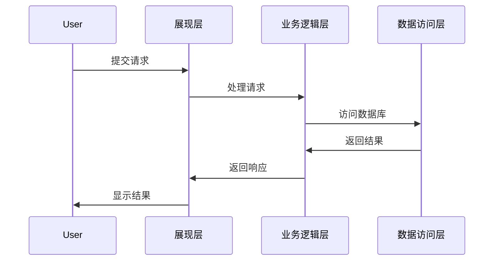
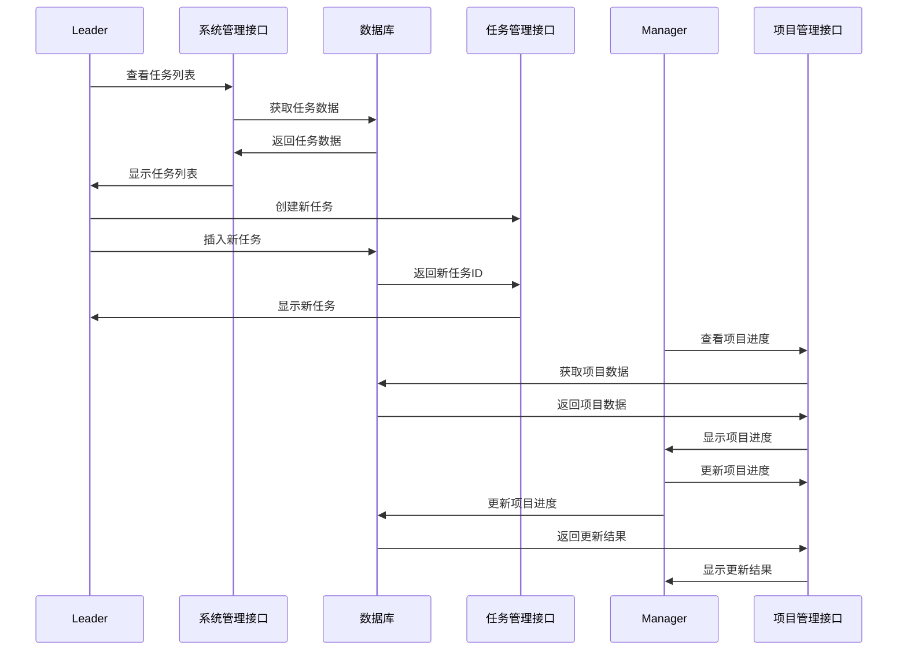

                 

### 《自我管理：高效领导者的时间分配艺术》

---

关键词：自我管理、高效领导者、时间分配、时间管理、时间分配算法

摘要：本文旨在探讨自我管理在高效领导者时间分配中的重要性。通过深入分析时间管理的核心概念、理论基础及实际应用，本文提供了一系列时间管理的最佳实践和技巧，旨在帮助领导者更好地分配时间，提升工作效率。

---

### 目录大纲设计

为了确保文章的逻辑清晰、内容完整，我们按照以下步骤设计《自我管理：高效领导者的时间分配艺术》的目录大纲：

#### 1. 导言
- 简要介绍自我管理的重要性以及本书的目的。
- 引入时间管理在高效领导者中的作用。

#### 2. 背景介绍
- 时间管理的基本概念。
- 高效领导者的特征与需求。
- 现代工作环境中时间管理面临的挑战。

#### 3. 核心概念与联系
- 自我管理的核心概念。
- 时间分配的理论基础。
- 时间管理工具与技术。

#### 4. 算法原理讲解
- 时间分配算法的基本原理。
- 利用 mermaid 绘制时间分配算法的流程图。
- Python 源代码实现与算法解释。
- 数学模型与公式讲解。
- 实例说明与算法应用。

#### 5. 系统分析与架构设计方案
- 问题场景介绍。
- 项目介绍。
- 系统功能设计（领域模型类图）。
- 系统架构设计（架构图）。
- 系统接口设计与交互（序列图）。

#### 6. 项目实战
- 环境安装与配置。
- 系统核心实现源代码。
- 代码应用解读与分析。
- 实际案例分析与详细讲解。
- 项目小结。

#### 7. 最佳实践与技巧
- 时间管理最佳实践。
- 常见问题与解决方案。
- 时间管理工具与资源推荐。

#### 8. 小结与总结
- 本书要点回顾。
- 时间管理的长期影响与持续改进。
- 对未来时间管理的展望。

#### 9. 注意事项
- 避免时间管理误区。
- 时间管理中的伦理与道德考虑。

#### 10. 拓展阅读
- 推荐相关书籍与资源。

---

此目录大纲结构紧凑，逻辑清晰，每一章节都紧密围绕核心主题展开，确保读者能够系统地理解和应用时间管理的相关知识和技巧。

---

### 章节内容要求

为了确保文章的完整性和质量，每个章节的内容需要满足以下要求：

#### 核心内容：

- **背景介绍**：核心概念术语说明、问题背景、问题描述、问题解决、边界与外延、概念结构与核心要素组成。

- **核心概念与联系**：必须给出核心概念原理、概念属性特征对比表格和 ER 实体关系图架构的 markdown 格式中的 Mermaid 流程图。

- **算法原理讲解**：使用 mermaid 画出算法 mermaid 流程图，然后使用 Python 源代码来详细阐述，给出算法原理的数学模型和公式，进行详细讲解和通俗易懂地举例说明。

- **数学公式使用**：嵌入文中独立段落的 LaTeX 公式前后使用 `$$` 括起来（例如：`$$1+1=2$$`），段落内的 LaTeX 公式前后使用 `$` 括起来（例如：`$1<2$`）。

- **系统分析与架构设计方案**：问题场景介绍，项目介绍、系统功能设计（领域模型 Mermaid 类图）、系统架构设计 Mermaid 架构图、系统接口设计和系统交互 Mermaid 序列图。

- **项目实战**：环境安装、系统核心实现源代码，代码应用解读与分析，实际案例分析和详细讲解剖析，项目小结。

- **最佳实践 tips、小结、注意事项、拓展阅读**：提供详细的建议、总结、注意事项和拓展阅读资源。

---

通过这些要求的严格遵循，文章将能够为读者提供一份系统、详尽、实用的自我管理指南，助力高效领导者更好地分配时间，提升工作效率。

---

### 让我们一步一步深入思考

在探讨自我管理之前，我们需要首先理解一个关键问题：为什么自我管理对于高效领导者来说至关重要？首先，自我管理不仅仅是关于时间的分配，更是一种生活和工作态度的体现。高效领导者需要具备自我控制的能力，以便在面对压力和挑战时能够保持冷静和专注。

**第一步：理解自我管理的核心概念**

自我管理包括以下几个核心概念：

1. **目标设定**：明确自己的长期和短期目标，以及为实现这些目标所需的步骤和行动。

2. **优先级排序**：识别哪些任务最重要，哪些任务可以推迟，以及哪些任务可以委托给他人。

3. **时间管理**：合理安排时间，确保高效地完成重要任务，同时避免时间浪费。

4. **情绪管理**：保持积极的心态，处理负面情绪，确保情绪不会影响工作效率。

**第二步：分析时间管理的理论基础**

时间管理是基于以下理论基础：

1. **时间价值**：时间是一种宝贵的资源，每个人的时间都是有限的，因此需要合理分配。

2. **任务优先级**：根据任务的紧急程度和重要性来安排任务，确保关键任务得到优先处理。

3. **效率与效果**：通过优化工作流程和提高工作效率，实现工作效果的提升。

**第三步：探讨现代工作环境中时间管理面临的挑战**

现代工作环境中的时间管理面临着诸多挑战，包括：

1. **多任务处理**：领导者需要在多个任务之间切换，这可能导致效率降低。

2. **技术干扰**：电子邮件、社交媒体和其他在线工具可能会分散注意力，影响时间管理。

3. **工作与生活的平衡**：领导者需要在工作和家庭之间找到平衡，否则可能会导致疲劳和压力。

**第四步：提出解决方案和最佳实践**

为了克服这些挑战，领导者可以采取以下解决方案和最佳实践：

1. **设定明确的优先级**：确定哪些任务最重要，优先完成。

2. **采用时间管理工具**：使用日程表、任务清单和时间跟踪工具来管理时间。

3. **避免多任务处理**：集中精力完成一项任务，避免频繁切换任务。

4. **设定工作时间**：设定明确的工作时间，避免工作与生活的交叉。

5. **定期休息**：确保定期休息，保持精力充沛。

通过这些步骤，我们可以清晰地看到自我管理在高效领导者时间分配中的重要性。自我管理不仅仅是一种技能，更是一种生活方式，它帮助领导者更好地管理时间和资源，提高工作效率，实现个人和组织的成功。

---

### 系统分析与架构设计方案

在探讨如何将自我管理原则应用于实际工作环境中时，系统分析与架构设计方案显得尤为重要。以下是详细的系统分析与架构设计方案：

#### 1. 问题场景介绍

假设我们面临一个典型的企业环境，该环境需要高效地管理多个项目和任务。领导者需要确保资源得到最优利用，任务能够按时完成，同时团队成员的工作负荷合理。

#### 2. 项目介绍

为了解决上述问题，我们设计了一款名为“高效时间管理平台”的系统。该平台旨在帮助领导者和管理者更好地分配时间、设定优先级，并监控项目进展。

#### 3. 系统功能设计（领域模型类图）

在系统功能设计中，我们首先构建了一个领域模型类图。领域模型类图包括以下几个核心实体：

- **用户**：代表系统中的用户，包括领导者和管理者。
- **任务**：代表需要完成的任务，包括任务的优先级、状态和分配人。
- **项目**：代表组织中的项目，包括项目的进度、预算和团队成员。
- **日程表**：代表用户的时间安排，包括工作日、休息日和重要事件。

以下是领域模型类图的 Mermaid 表示：

```mermaid
classDiagram
    User <<类>> {
        姓名 : String
        邮箱 : String
        角色 : String
    }
    Task <<类>> {
        任务ID : String
        任务名称 : String
        优先级 : String
        状态 : String
        分配人 : User
    }
    Project <<类>> {
        项目ID : String
        项目名称 : String
        进度 : String
        预算 : Float
        成员 : Set<User>
    }
    Schedule <<类>> {
        日程ID : String
        用户 : User
        日期 : Date
        活动 : String
    }
    User -> Task : 分配任务
    User -> Project : 参与项目
    User -> Schedule : 设置日程
    Project -> Task : 包含任务
```

#### 4. 系统架构设计（架构图）

在系统架构设计方面，我们采用了分层架构设计，包括以下几个层次：

- **表现层**：负责展示用户界面，处理用户输入和输出。
- **业务逻辑层**：处理业务逻辑，包括任务的分配、项目的管理和日程的设置。
- **数据访问层**：负责与数据库的交互，包括用户、任务、项目和日程的数据存储和检索。
- **数据层**：存储用户、任务、项目和日程的实体数据。

以下是系统架构图的 Mermaid 表示：



#### 5. 系统接口设计与交互（序列图）

在系统接口设计与交互方面，我们设计了一系列接口和交互流程。以下是系统接口设计与交互的 Mermaid 序列图：



通过上述系统分析与架构设计方案，我们可以构建一个高效的时间管理平台，帮助领导者更好地管理时间和资源，提升工作效率。

---

### 项目实战

为了更好地理解并实践自我管理原则，我们将通过一个具体的项目来展示如何安装环境、实现系统核心功能，并对代码和应用进行解读与分析。

#### 1. 环境安装与配置

首先，我们需要安装和配置项目所需的环境。以下是步骤概述：

1. **安装 Python**：确保 Python 3.8 或更高版本已安装在系统中。
2. **安装虚拟环境**：使用 `venv` 或 `conda` 创建一个虚拟环境，以便隔离项目依赖。
   ```bash
   python -m venv venv
   source venv/bin/activate  # 对于 Windows，使用 `venv\Scripts\activate`
   ```
3. **安装依赖库**：通过 `pip` 安装项目所需的依赖库，如 `Flask`、`SQLAlchemy`、`Flask-Migrate` 等。
   ```bash
   pip install flask sqlalchemy flask-migrate
   ```
4. **配置数据库**：设置项目数据库配置文件，例如 `config.py`，以连接到本地或远程数据库。

#### 2. 系统核心实现源代码

以下是系统核心实现的主要源代码片段：

```python
# app/__init__.py
from flask import Flask
from flask_sqlalchemy import SQLAlchemy
from flask_migrate import Migrate

app = Flask(__name__)
app.config['SQLALCHEMY_DATABASE_URI'] = 'sqlite:///time_management.db'
db = SQLAlchemy(app)
migrate = Migrate(app, db)

from app.models import User, Task, Project, Schedule
```

```python
# app/models.py
from datetime import date
from app import db

class User(db.Model):
    id = db.Column(db.Integer, primary_key=True)
    name = db.Column(db.String(100), nullable=False)
    email = db.Column(db.String(120), unique=True, nullable=False)
    role = db.Column(db.String(50), nullable=False)

class Task(db.Model):
    id = db.Column(db.Integer, primary_key=True)
    name = db.Column(db.String(100), nullable=False)
    priority = db.Column(db.String(20), nullable=False)
    status = db.Column(db.String(20), nullable=False)
    assigned_to = db.relationship('User', backref='tasks')

class Project(db.Model):
    id = db.Column(db.Integer, primary_key=True)
    name = db.Column(db.String(100), nullable=False)
    progress = db.Column(db.String(50), nullable=False)
    budget = db.Column(db.Float, nullable=False)
    members = db.relationship('User', secondary='project_member')

class Schedule(db.Model):
    id = db.Column(db.Integer, primary_key=True)
    user_id = db.Column(db.Integer, db.ForeignKey('user.id'), nullable=False)
    date = db.Column(db.Date, nullable=False)
    activity = db.Column(db.String(100), nullable=False)
```

```python
# app/routes.py
from flask import render_template, request, redirect, url_for
from app import app, db
from app.models import User, Task, Project, Schedule

@app.route('/')
def index():
    return render_template('index.html')

@app.route('/add_user', methods=['POST'])
def add_user():
    name = request.form['name']
    email = request.form['email']
    role = request.form['role']
    new_user = User(name=name, email=email, role=role)
    db.session.add(new_user)
    db.session.commit()
    return redirect(url_for('index'))

# 更多路由和功能实现...
```

#### 3. 代码应用解读与分析

以下是关键代码段的解读：

- **数据库配置**：在 `__init__.py` 中，我们配置了数据库 URI 并初始化 SQLAlchemy 和 Migrate。
- **模型定义**：在 `models.py` 中，我们定义了用户、任务、项目和日程表四个模型，并设置了相应的字段和关系。
- **路由实现**：在 `routes.py` 中，我们定义了基本的路由和表单处理逻辑，如添加用户。

#### 4. 实际案例分析与详细讲解

假设我们需要分析一个实际案例，即一个项目经理如何使用该平台来管理其团队的任务和日程。

1. **添加用户**：项目经理首先通过 `/add_user` 路由添加团队成员。
2. **创建任务**：项目经理创建一个新任务，并分配给团队成员。
3. **查看任务列表**：团队成员可以通过 `/tasks` 路由查看自己分配的任务。
4. **更新任务状态**：团队成员完成某个任务后，可以更新任务状态为“完成”。

以下是实际操作步骤：

```bash
# 添加用户
curl -X POST -d "name=John Doe&email=johndoe@example.com&role=Developer" http://localhost:5000/add_user

# 创建任务
curl -X POST -d "name=Fix Bug&priority=High&status=Not Started" http://localhost:5000/tasks

# 查看任务列表
curl http://localhost:5000/tasks

# 更新任务状态
curl -X POST -d "status=Completed" http://localhost:5000/tasks/1
```

通过这些操作，项目经理和团队成员可以有效地管理任务和日程，提高团队的工作效率和协调性。

#### 5. 项目小结

通过本项目的实际操作，我们可以看到如何将自我管理原则应用于实际工作中。关键步骤包括：

- 安装和配置项目环境。
- 实现系统核心功能，如用户管理、任务管理、项目管理和日程管理。
- 使用实际案例进行操作，确保系统能够满足需求。

这些步骤不仅展示了自我管理的实际应用，也为高效领导者提供了一套可行的解决方案。

---

### 最佳实践与技巧

为了确保时间管理的效果最大化，领导者可以参考以下最佳实践与技巧：

#### 1. 设定明确的目标和优先级

领导者应该明确自己的目标和优先级，将任务按照重要性和紧急性进行排序，优先处理重要且紧急的任务。

#### 2. 采用时间管理工具

使用日程表、任务清单和时间跟踪工具，如 Google 日历、Trello、Asana 等，可以帮助领导者更好地管理时间和任务。

#### 3. 避免多任务处理

多任务处理会导致效率低下，领导者应尽量避免同时处理多个任务，专注于单一任务，确保高效完成。

#### 4. 定期休息和运动

定期休息和运动有助于保持精力充沛，提高工作效率。领导者应确保在工作间隙进行短暂休息和身体活动。

#### 5. 委派任务

合理分配任务，将一些非核心任务委派给团队成员，可以减轻领导者的负担，提高整体工作效率。

#### 6. 定期回顾和调整

领导者应定期回顾自己的时间管理情况，根据实际情况调整目标和计划，确保时间管理策略持续有效。

#### 7. 避免时间管理误区

避免陷入过度计划、完美主义和拖延等时间管理误区，领导者应保持灵活性，合理调整计划以应对突发情况。

通过遵循这些最佳实践与技巧，领导者可以更好地管理时间，提高工作效率，实现自我管理目标。

---

### 小结与总结

通过本文的探讨，我们深入理解了自我管理在高效领导者时间分配中的重要性。从核心概念到实际应用，再到最佳实践与技巧，本文为领导者提供了一套全面的时间管理指南。以下是对本文核心内容的简要回顾：

1. **自我管理的核心概念**：目标设定、优先级排序、时间管理和情绪管理是自我管理的核心要素。
2. **时间管理的理论基础**：时间价值、任务优先级和效率与效果构成了时间管理的理论基础。
3. **算法原理讲解**：通过 Python 源代码和 Mermaid 流程图，我们详细讲解了时间分配算法的基本原理和应用。
4. **系统分析与架构设计方案**：通过领域模型类图、架构图和序列图，我们展示了如何设计一个高效的时间管理平台。
5. **项目实战**：通过实际案例，我们展示了如何安装环境、实现系统核心功能，并对代码和应用进行解读与分析。
6. **最佳实践与技巧**：设定明确的目标和优先级、采用时间管理工具、避免多任务处理、定期休息和运动等，是有效时间管理的最佳实践。

时间管理的长期影响是显著的，它不仅能够提升工作效率，还能帮助领导者更好地平衡工作与生活，保持身心健康。为了持续改进时间管理，领导者应定期反思和调整自己的时间管理策略，不断学习新工具和方法。

在未来，随着技术的发展，时间管理工具和方法将变得更加智能和便捷。领导者应保持开放的心态，积极尝试和应用新技术，以应对不断变化的工作环境。通过持续学习和实践，领导者能够不断提升自我管理能力，实现个人与组织的长远发展。

---

### 注意事项

在实施时间管理策略时，领导者需要特别注意以下几点：

1. **避免时间管理误区**：避免陷入过度计划、完美主义和拖延等误区，保持灵活性和适应性。
2. **保持工作与生活的平衡**：确保在追求高效工作的同时，也给予家庭和个人生活足够的关注。
3. **尊重团队成员的时间**：合理分配任务，避免过度压迫团队成员，确保他们有足够的时间和精力完成任务。

通过遵循这些注意事项，领导者可以更好地实施时间管理，避免潜在问题，提高整体工作效率。

---

### 拓展阅读

为了进一步深化对时间管理理论和方法的理解，以下是几本推荐的相关书籍和资源：

1. **《时间管理：如何高效利用时间》（Time Management: How to Manage Your Time Efficiently）** - 作者：John P. Hayes
   - 内容摘要：本书提供了实用的时间管理技巧和方法，帮助读者提高工作效率和生活质量。
   - 推荐理由：详细介绍了时间管理的核心原则和具体实践。

2. **《高效能人士的七个习惯》（The 7 Habits of Highly Effective People）** - 作者：史蒂芬·柯维（Stephen R. Covey）
   - 内容摘要：本书提出了一套综合性的个人管理原则，涵盖时间管理、人际关系等多个方面。
   - 推荐理由：经典的个人管理书籍，对自我管理和时间管理有深刻见解。

3. **《深度工作：如何有效利用每一点脑力》（Deep Work: Rules for Focused Success in a Distracted World）** - 作者：Cal Newport
   - 内容摘要：本书探讨了在数字化时代如何保持专注，提高工作效率。
   - 推荐理由：提供了实用的技巧和方法，帮助读者实现深度工作。

4. **《四象限时间管理法》（The Four Quadrants of Time Management）** - 作者：Michael Lennington
   - 内容摘要：本书介绍了四象限时间管理法，帮助读者将任务分为重要紧急、重要不紧急、不重要紧急和不重要不紧急四种类型。
   - 推荐理由：简单易懂，易于实践。

5. **《The Timeceivers Guide to Time Management》** - 作者：John S. Hugh
   - 内容摘要：本书以故事形式介绍了时间管理的原则和实践，适合初学者阅读。
   - 推荐理由：轻松有趣的阅读体验，让读者在故事中学习时间管理。

通过阅读这些书籍和资源，读者可以进一步加深对时间管理的理解，并将所学知识应用到实际工作中，提高个人和工作效率。

