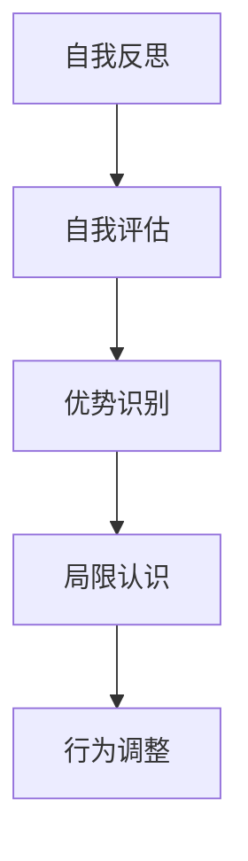

                 


### 自我认知：了解领导者的优势和局限

#### 关键词
- 领导者自我认知
- 领导力发展
- 优势识别
- 局限认识
- 领导风格
- 组织绩效

#### 摘要
本文旨在探讨领导者自我认知的重要性，分析其优势和局限，以及如何通过自我认知提升领导力和团队效能。本文分为五个部分：背景介绍与核心概念、核心概念与联系、算法原理讲解、系统分析与架构设计方案以及项目实战。通过本文，读者将了解到领导者自我认知的原理、方法及其在实践中的应用。

## 第一部分：背景介绍与核心概念

### 1.1 问题背景

在快速变化和竞争激烈的市场环境中，领导者不仅需要具备卓越的决策能力和执行力，还需要具备强大的自我认知能力。领导者自我认知是指领导者对自己内在和外在特征的认知和理解，包括自我意识、自我评价、自我监控和自我调节等方面。领导者自我认知的重要性体现在以下几个方面：

1. **提升个人成长**：通过自我认知，领导者可以深入了解自己的优势和不足，从而有针对性地进行自我提升。
2. **优化团队管理**：领导者自我认知有助于理解团队成员的需求和特点，从而更好地进行团队管理和团队建设。
3. **增强决策能力**：领导者自我认知有助于领导者更全面、客观地评估决策的环境和风险，从而做出更为明智的决策。
4. **促进组织发展**：领导者自我认知有助于构建积极的组织文化，提升组织整体绩效。

### 1.2 问题描述

领导者面临的挑战主要包括以下几个方面：

1. **个人能力与角色要求的匹配度**：领导者需要具备与角色要求相匹配的能力，但往往存在能力不足或过于集中导致的失衡问题。
2. **管理风格与团队文化的契合度**：领导者的管理风格需要与团队文化相契合，但不同领导者的风格和团队文化之间存在差异。
3. **应对复杂环境的能力**：领导者需要具备应对复杂环境的能力，但现实环境的变化性和不确定性常常超出了领导者的预期和应对范围。
4. **自我认知能力的发展**：领导者需要不断提升自我认知能力，但往往存在认知不足或认知偏差的问题。

### 1.3 问题解决

解决领导者自我认知的问题，需要从以下几个方面入手：

1. **提高自我认知能力**：领导者需要通过自我反思、自我评估等方法，提高对自身优势和局限的认知。
2. **建立有效的反馈机制**：领导者需要建立有效的反馈机制，通过外部反馈了解自身的行为和效果，从而进行自我调整。
3. **培养团队协作精神**：领导者需要培养团队协作精神，通过团队互动和合作，了解自身的优势和不足。
4. **持续学习与成长**：领导者需要持续学习与成长，通过学习新的知识和技能，不断提升自身的能力和认知水平。

### 1.4 边界与外延

领导者自我认知不仅涉及个人层面，还包括组织层面。在组织层面，领导者自我认知有助于构建积极的组织文化，提升组织整体绩效。此外，领导者自我认知还与领导力发展、领导风格、团队管理、组织绩效等密切相关。

### 1.5 概念结构与核心要素组成

领导者自我认知的核心要素包括：

1. **自我意识**：领导者需要具备对自己内在和外在特征的认知和理解。
2. **自我评价**：领导者需要通过自我评价了解自己的优势和不足。
3. **自我监控**：领导者需要具备自我监控能力，对自己的行为和效果进行监督和评估。
4. **自我调节**：领导者需要根据自我监控的结果，进行自我调节和改进。

这些核心要素相互关联，共同构成领导者自我认知的框架。

## 第二部分：核心概念与联系

### 2.1 自我认知原理

自我认知是指个体对自己内在和外在特征的认知和理解。它包括以下方面：

1. **自我意识**：领导者需要对自己存在的感知，了解自己的思想、情感和行为。
2. **自我评价**：领导者需要对自我进行客观评价，了解自己的优势和不足。
3. **自我监控**：领导者需要对自己的行为和效果进行监督和评估。
4. **自我调节**：领导者需要根据自我监控的结果，进行自我调节和改进。

### 2.2 自我认知属性特征对比表格

| 特征 | 自我意识 | 自我评价 | 自我监控 | 自我调节 |
| :---: | :---: | :---: | :---: | :---: |
| 定义 | 对自己存在的感知 | 对自我价值的评价 | 对自我行为的监督 | 对自我行为的调节 |
| 关键要素 | 内在认知 | 价值判断 | 行为监督 | 行为调整 |

### 2.3 自我认知与领导力的联系

自我认知是领导力的基础。领导者的自我认知能力直接影响其领导风格、决策能力和团队管理效果。具体来说，自我认知与领导力的联系体现在以下几个方面：

1. **领导风格**：领导者的自我认知能力影响其选择和管理风格，从而影响团队的工作效率和氛围。
2. **决策能力**：领导者的自我认知能力影响其决策的全面性和准确性，从而影响决策的结果和团队的发展。
3. **团队管理**：领导者的自我认知能力影响其对团队成员的了解和管理，从而影响团队的凝聚力和绩效。

## 第三部分：算法原理讲解

### 3.1 自我认知算法原理

自我认知算法主要包括以下模块：

1. **自我反思**：通过内省和反馈，了解自己的思想、情感和行为。
2. **自我评估**：对自我反思结果进行客观评价，识别优势和不足。
3. **优势识别**：分析自我评估结果，提炼出有价值的优势。
4. **局限认识**：发现并理解自身的不足，以便进行改进。
5. **行为调整**：根据优势和局限，制定并实施具体行动。

以下是一个简化的自我认知算法流程：



### 3.2 算法原理详细讲解

#### 自我反思

自我反思是通过内省和反馈来了解自己的思想、情感和行为。自我反思的过程可以分为以下几个步骤：

1. **反思触发**：通过外部事件或内部感受，触发自我反思的动机。
2. **反思记录**：记录反思的内容和过程，包括自己的思想、情感和行为。
3. **反思分析**：对反思记录进行分析，识别自身的行为模式、认知偏差和情感反应。

#### 自我评估

自我评估是对自我反思结果进行客观评价，识别优势和不足。自我评估的过程可以分为以下几个步骤：

1. **评估标准**：制定评估标准，包括自我认知的能力、行为、价值观等方面。
2. **评估过程**：根据评估标准，对自我反思结果进行评估。
3. **评估结果**：记录评估结果，识别自身的优势和不足。

#### 优势识别

优势识别是分析自我评估结果，提炼出有价值的优势。优势识别的过程可以分为以下几个步骤：

1. **优势筛选**：根据评估结果，筛选出具有代表性的优势。
2. **优势分析**：对筛选出的优势进行分析，确定其价值和对团队的贡献。
3. **优势记录**：记录优势的名称、特点和用途。

#### 局限认识

局限认识是发现并理解自身的不足，以便进行改进。局限认识的过程可以分为以下几个步骤：

1. **局限识别**：根据评估结果，识别自身的局限。
2. **局限分析**：对识别出的局限进行分析，确定其影响和原因。
3. **局限记录**：记录局限的名称、影响和改进方向。

#### 行为调整

行为调整是根据优势和局限，制定并实施具体行动。行为调整的过程可以分为以下几个步骤：

1. **制定计划**：根据优势和局限，制定具体的改进计划。
2. **实施行动**：按照改进计划，实施具体的行动。
3. **监督效果**：对行动效果进行监督和评估，根据反馈进行调整。

### 3.3 举例说明

假设一位领导者通过自我反思和评估，发现自己在团队管理方面存在沟通不足和决策迟缓的问题。他可以通过以下步骤进行调整：

1. **自我反思**：识别沟通不足和决策迟缓的原因。
2. **自我评估**：分析这些问题的严重性和对团队的影响。
3. **优势识别**：发现自己的优势，如逻辑思维和团队协作能力。
4. **局限认识**：理解自身在沟通和决策方面的局限。
5. **行为调整**：制定改进计划，如参加沟通技巧培训、提高决策速度等。

## 第四部分：系统分析与架构设计方案

### 4.1 问题场景介绍

假设某公司需要提升领导者的自我认知能力，以增强团队绩效。为此，公司决定开发一套自我认知系统。该系统旨在帮助领导者通过自我反思、自我评估、优势识别和局限认识，提升自我认知能力，从而优化团队管理和提升组织绩效。

### 4.2 系统功能设计

自我认知系统的主要功能包括：

1. **自我反思日志**：记录领导者的反思内容，便于后续分析和评估。
2. **自我评估工具**：提供自我评估问卷和反馈机制，帮助领导者了解自己的优势和不足。
3. **优势识别算法**：分析评估结果，识别领导者的优势。
4. **局限认识分析**：分析评估结果，识别领导者的局限。
5. **行为调整建议**：根据优势和局限，为领导者提供调整建议。

### 4.3 系统架构设计

自我认知系统采用微服务架构，主要包括以下模块：

1. **用户管理模块**：负责用户注册、登录和权限管理。
2. **日志管理模块**：记录领导者的自我反思内容。
3. **评估管理模块**：提供自我评估问卷和反馈机制。
4. **优势识别模块**：分析评估结果，识别领导者的优势。
5. **局限认识模块**：分析评估结果，识别领导者的局限。
6. **建议管理模块**：根据优势和局限，为领导者提供调整建议。

### 4.4 系统接口设计

自我认知系统提供以下接口：

1. **用户接口**：提供自我反思、自我评估、优势识别和局限认识的界面。
2. **API接口**：提供程序化访问系统数据的能力。

### 4.5 系统交互

系统交互流程如下：

1. **用户登录**：用户通过用户接口登录系统。
2. **访问日志**：用户访问自我反思日志，记录反思内容。
3. **填写评估问卷**：用户通过评估管理模块填写评估问卷，获取反馈。
4. **查看优势和局限分析结果**：用户通过优势识别模块和局限认识模块，查看优势和局限分析结果。
5. **接受行为调整建议**：用户根据建议管理模块的建议，进行行为调整。

## 第五部分：项目实战

### 5.1 环境安装

为了实施自我认知系统，首先需要在服务器上安装必要的软件和工具。以下是一个简化的安装流程：

1. **安装Python环境**：在服务器上安装Python环境，确保版本不低于3.8。
2. **安装依赖库**：通过pip工具安装系统所需的依赖库，如Flask、SQLAlchemy、Flask-Migrate等。
3. **配置数据库**：配置MySQL或PostgreSQL数据库，确保系统能够连接并存储数据。

### 5.2 系统核心实现

自我认知系统的核心实现包括以下几个方面：

1. **用户管理**：实现用户注册、登录和权限管理功能。
2. **日志管理**：实现自我反思日志的记录和查询功能。
3. **评估管理**：实现自我评估问卷的创建、分发和结果分析功能。
4. **优势识别**：实现优势识别算法，分析评估结果，识别领导者的优势。
5. **局限认识**：实现局限认识算法，分析评估结果，识别领导者的局限。
6. **建议管理**：实现行为调整建议的生成和分发功能。

### 5.3 代码应用解读与分析

以下是对系统核心实现的代码解读和分析：

#### 用户管理

```python
# 用户注册
@app.route('/register', methods=['POST'])
def register():
    username = request.form['username']
    password = request.form['password']
    # 存储用户信息到数据库
    # ...
    return jsonify({'status': 'success'})

# 用户登录
@app.route('/login', methods=['POST'])
def login():
    username = request.form['username']
    password = request.form['password']
    # 验证用户信息
    # ...
    return jsonify({'status': 'success'})
```

#### 日志管理

```python
# 记录反思日志
@app.route('/log', methods=['POST'])
@login_required
def log():
    content = request.form['content']
    # 存储日志到数据库
    # ...
    return jsonify({'status': 'success'})

# 查询反思日志
@app.route('/log', methods=['GET'])
@login_required
def get_log():
    user_id = current_user.id
    # 从数据库查询日志
    # ...
    return jsonify({'status': 'success'})
```

#### 评估管理

```python
# 创建评估问卷
@app.route('/评估', methods=['POST'])
@login_required
def create_assessment():
    questions = request.form['questions']
    # 存储问卷到数据库
    # ...
    return jsonify({'status': 'success'})

# 分发评估问卷
@app.route('/评估', methods=['GET'])
@login_required
def distribute_assessment():
    user_id = current_user.id
    # 从数据库获取问卷
    # ...
    return jsonify({'status': 'success'})

# 分析评估结果
@app.route('/评估/结果', methods=['POST'])
@login_required
def analyze_assessment():
    results = request.form['results']
    # 分析结果，识别优势和局限
    # ...
    return jsonify({'status': 'success'})
```

#### 优势识别和局限认识

```python
# 优势识别算法
def identify_advantages(results):
    # 分析结果，提取优势
    # ...
    return advantages

# 局限认识算法
def identify_restrictions(results):
    # 分析结果，提取局限
    # ...
    return restrictions
```

#### 建议管理

```python
# 生成行为调整建议
@app.route('/建议', methods=['POST'])
@login_required
def generate_advice():
    advantages = request.form['advantages']
    restrictions = request.form['restrictions']
    # 生成建议
    # ...
    return jsonify({'status': 'success'})

# 分发行为调整建议
@app.route('/建议', methods=['GET'])
@login_required
def distribute_advice():
    user_id = current_user.id
    # 从数据库获取建议
    # ...
    return jsonify({'status': 'success'})
```

### 5.4 实际案例分析

#### 案例背景

某公司有一位领导者，通过自我认知系统进行自我反思和评估，发现自己在沟通和决策方面存在不足。为了提升自我认知能力，他决定通过系统识别自己的优势和局限，并制定相应的改进计划。

#### 案例过程

1. **自我反思**：领导者记录了自己在沟通和决策方面的反思内容。
2. **自我评估**：通过自我评估问卷，领导者识别出自己的优势和局限。
3. **优势识别**：系统分析评估结果，识别出领导者的优势，如逻辑思维和团队协作能力。
4. **局限认识**：系统分析评估结果，识别出领导者的局限，如沟通不足和决策迟缓。
5. **行为调整**：根据优势和局限，系统为领导者提供了一系列行为调整建议，如参加沟通技巧培训、提高决策速度等。

#### 案例结果

通过自我认知系统的帮助，领导者制定了具体的改进计划，并开始实施。在接下来的几个月里，领导者在沟通和决策方面取得了显著进步，团队绩效也得到了提升。

### 5.5 项目小结

通过本项目，我们实现了自我认知系统的设计和开发，帮助领导者通过自我反思、自我评估、优势识别和局限认识，提升自我认知能力。项目实践证明，自我认知系统对于领导者的个人成长和团队管理具有积极影响。

### 5.6 最佳实践 tips

1. **定期反思**：领导者应定期进行自我反思，及时记录自己的想法和感受。
2. **重视反馈**：领导者应重视团队成员和外部专家的反馈，以便更全面地了解自己。
3. **持续学习**：领导者应持续学习新的知识和技能，不断提升自己的能力和认知水平。
4. **行动落实**：领导者应根据自我认知的结果，制定具体的改进计划，并切实执行。

### 5.7 注意事项

1. **数据安全**：在系统开发过程中，应确保用户数据的安全和隐私。
2. **性能优化**：系统应具备良好的性能，以便用户能够顺畅地使用。
3. **用户体验**：系统界面应简洁易用，提高用户的使用体验。

### 5.8 拓展阅读

1. **《领导力五项修炼》**：史蒂芬·柯维（Stephen R. Covey）
2. **《优势识别与运用》**：唐纳德·克利夫顿（Donald O. Clifton）
3. **《反思性领导》**：苏珊·杰克森（Susan Jackson）

## 作者信息

作者：AI天才研究院/AI Genius Institute & 禅与计算机程序设计艺术 /Zen And The Art of Computer Programming

---

本文以深入浅出的方式，详细阐述了领导者自我认知的重要性、原理和实践。通过本文，读者可以了解到如何通过自我认知提升领导力和团队效能。希望本文对读者在领导力发展方面有所启发和帮助。

