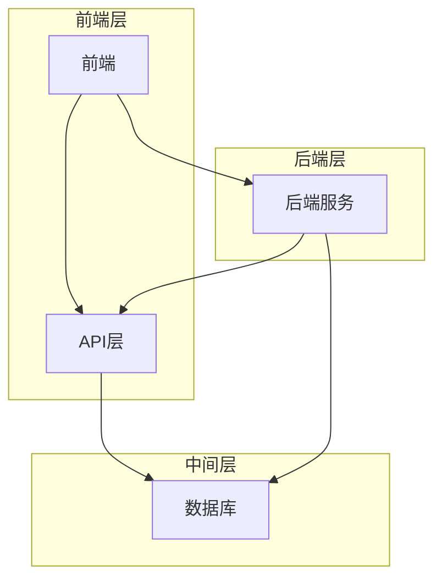
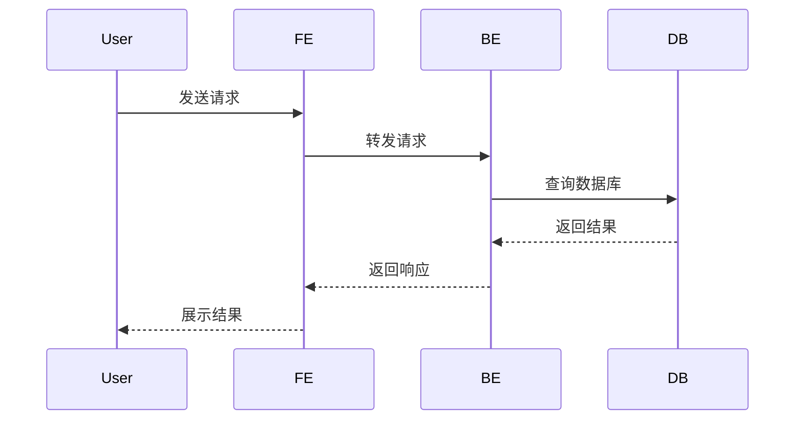
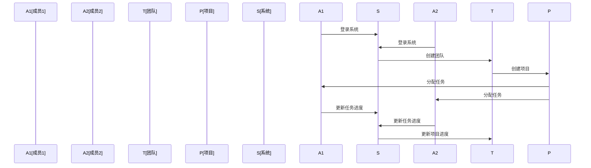

                 


### 1.3 虚拟团队建设：增强远程团队凝聚力的技巧

**背景介绍**

在当今全球化快速发展的背景下，虚拟团队已经成为现代企业管理的重要组成部分。虚拟团队由地理位置分散的成员组成，通过互联网、电话、邮件等现代通讯工具实现协同工作。与传统团队相比，虚拟团队具有灵活性高、响应速度快等优点，但也面临着沟通障碍、文化差异、团队凝聚力不足等挑战。

**核心概念术语说明**

- **虚拟团队**：由地理位置分散的成员组成的团队，通过现代通讯技术实现协同工作。
- **远程工作**：团队成员不在同一地点办公，通过远程工具进行工作和沟通。
- **团队凝聚力**：团队成员之间的相互吸引力和协作精神。
- **沟通工具**：用于团队成员之间交流的软件或硬件设备，如即时通讯工具、视频会议软件等。
- **工作流程**：团队成员进行工作和协作的步骤和流程。

**问题背景**

随着远程工作的普及，越来越多的企业开始采用虚拟团队模式。然而，虚拟团队的建设并不容易，如何增强团队凝聚力，提高工作效率，成为企业管理者面临的重要问题。缺乏有效的团队凝聚力可能导致以下问题：

- **沟通效率低下**：团队成员地理位置分散，沟通不便，信息传递不及时。
- **协作困难**：团队成员之间缺乏协作精神，难以共同完成任务。
- **工作效率低下**：缺乏有效的监督和激励机制，团队成员工作效率不高。
- **文化差异**：团队成员来自不同文化背景，可能存在沟通障碍和理解偏差。

**问题描述**

虚拟团队建设的目标是提高团队凝聚力，解决远程工作带来的挑战。为了达到这个目标，需要从以下几个方面进行改进：

1. **明确团队目标与职责**：确保每个成员都清楚自己的职责和目标，有助于提高工作积极性和团队协作精神。
2. **建立有效的沟通机制**：选择合适的沟通工具，制定明确的沟通规则，确保团队成员之间能够顺畅交流。
3. **规划虚拟团队工作流程**：设计合理的工作流程，明确任务分配、进度监控和反馈机制，提高工作效率。
4. **资源配置与工具选择**：提供必要的硬件和软件资源，确保团队成员能够高效工作。
5. **增强团队凝聚力**：通过培训、团队活动等方式，提高团队成员之间的信任感和协作精神。
6. **持续改进与适应变化**：定期进行团队反思，不断优化团队建设策略，适应远程工作环境的变化。

**问题解决**

要解决虚拟团队建设中的问题，可以采取以下措施：

1. **明确团队目标与职责**
   - **步骤1**：制定团队愿景和目标，确保每个成员都明确自己的职责和目标。
   - **步骤2**：定期进行目标回顾，确保团队成员始终保持一致的方向。
   - **步骤3**：建立明确的职责分工，确保每个成员都有明确的职责和权限。

2. **建立有效的沟通机制**
   - **步骤1**：选择合适的沟通工具，如即时通讯工具、视频会议软件等。
   - **步骤2**：制定沟通规则，如及时回复、定期会议等，确保沟通顺畅。
   - **步骤3**：建立沟通渠道，如内部邮件、论坛等，方便成员之间交流。

3. **规划虚拟团队工作流程**
   - **步骤1**：设计合理的工作流程，明确任务分配、进度监控和反馈机制。
   - **步骤2**：制定工作计划，确保团队成员能够按照计划高效工作。
   - **步骤3**：定期进行进度汇报，及时调整工作计划。

4. **资源配置与工具选择**
   - **步骤1**：提供必要的硬件和软件资源，确保团队成员能够高效工作。
   - **步骤2**：选择合适的远程协作工具，提高团队成员之间的协作效率。
   - **步骤3**：建立资源分配机制，确保资源得到合理利用。

5. **增强团队凝聚力**
   - **步骤1**：通过培训、团队活动等方式，提高团队成员之间的信任感和协作精神。
   - **步骤2**：建立激励机制，鼓励团队成员积极参与团队建设。
   - **步骤3**：定期进行团队反思，发现问题并及时解决。

6. **持续改进与适应变化**
   - **步骤1**：定期进行团队反思，总结经验教训，优化团队建设策略。
   - **步骤2**：关注新技术趋势，不断更新和改进团队协作工具和流程。
   - **步骤3**：适应远程工作环境的变化，及时调整团队策略。

**边界与外延**

在虚拟团队建设中，除了上述提到的关键因素，还需要考虑以下边界与外延：

- **跨文化沟通**：团队成员来自不同文化背景，需要加强跨文化沟通技巧，避免文化冲突。
- **团队规模**：团队规模对团队凝聚力有一定影响，需要根据团队规模调整团队建设策略。
- **技术成熟度**：远程协作工具和技术对团队建设有重要影响，需要确保技术的成熟度和稳定性。

**概念结构与核心要素组成**

虚拟团队建设的概念结构包括以下几个核心要素：

- **团队目标与职责**：明确团队目标和成员职责。
- **沟通机制**：建立有效的沟通机制。
- **工作流程**：设计合理的工作流程。
- **资源配置**：提供必要的资源。
- **团队凝聚力**：增强团队凝聚力。
- **持续改进**：不断优化团队建设策略。

**核心概念与联系**

虚拟团队建设涉及多个核心概念，包括团队凝聚力、沟通工具、工作流程等。这些概念相互关联，共同作用于团队建设过程。例如，团队凝聚力影响沟通效果和工作效率，而沟通工具和工作流程的优化可以增强团队凝聚力。

### 1.2.2 概念属性特征对比表格

以下是一个简单的概念属性特征对比表格，用于展示虚拟团队建设中的关键概念：

| 概念     | 属性特征                       | 对比结果                      |
|----------|-------------------------------|-------------------------------|
| 团队目标 | 明确、一致、可实现             | 提高团队协作效率              |
| 沟通工具 | 即时性、便捷性、稳定性         | 促进团队沟通与协作            |
| 工作流程 | 明确、优化、可追踪             | 提高团队工作效率和质量        |
| 资源配置 | 充足、合理、高效利用           | 支持团队高效工作              |
| 团队凝聚力 | 信任、协作、共同目标           | 增强团队执行力与创新能力      |
| 持续改进 | 反馈、评估、优化              | 提升团队整体表现              |

### 1.2.3 虚拟团队ER实体关系图

以下是虚拟团队ER实体关系图的Markdown格式表示，用于展示团队建设中的关键实体及其关系：

```mermaid
erDiagram
  User ||--|{ Team }|| Member
  Team ||--|{ Project }|| ProjectLead
  Project ||--|{ Task }|| Task
  Task ||--|{ Member }|| Assignee
  Member ||--|{ Tool }|| Using
  Tool ||--|{ Meeting }|| Holding
  Meeting ||--|{ Record }|| Contains
  Record ||--|{ Feedback }|| Has
  Feedback ||--|{ Improvement }|| From
```

**ER实体关系图解析：**

- **User（用户）**：代表团队成员，每个成员属于一个团队。
- **Team（团队）**：代表虚拟团队，每个团队可以管理多个项目和任务。
- **Project（项目）**：代表团队管理的具体项目，每个项目由一个项目负责人领导。
- **Task（任务）**：代表项目中具体的工作任务，每个任务可以分配给一个成员。
- **Member（成员）**：代表参与项目的团队成员，每个成员可以承担多个任务。
- **Tool（工具）**：代表用于团队协作的工具，如即时通讯工具、视频会议软件等。
- **Meeting（会议）**：代表团队成员举行的会议，可以使用工具进行会议记录。
- **Record（记录）**：代表会议记录和任务进展，用于反馈和改进。
- **Feedback（反馈）**：代表团队成员之间的反馈，用于优化团队建设。
- **Improvement（改进）**：代表团队根据反馈进行的改进措施。

通过ER实体关系图，我们可以清晰地看到虚拟团队建设中的关键实体及其相互关系，为后续章节的内容提供基础。

### 1.3 算法原理讲解

在虚拟团队建设中，算法原理可以用于优化团队协作过程，提高工作效率和团队凝聚力。以下是一个简单的算法原理讲解，包括算法mermaid流程图、Python源代码、数学模型和公式。

#### 算法mermaid流程图


#### Python源代码

```python
def build_virtual_team():
    # 初始化团队
    team = initialize_team()
    
    # 设置团队目标与职责
    set_goals_and_responsibilities(team)
    
    # 选择沟通工具
    communication_tools = select_communication_tools()
    
    # 规划工作流程
    workflow = plan_workflow()
    
    # 资源配置与工具选择
    configure_resources(team, communication_tools, workflow)
    
    # 增强团队凝聚力
    enhance_team_cohesion(team)
    
    # 持续改进与适应变化
    continue_improvement(team)

# 调用函数，构建虚拟团队
build_virtual_team()
```

#### 数学模型和公式

虚拟团队建设过程中，可以使用以下数学模型和公式来优化团队协作：

- **团队目标实现度**：$\text{实现度} = \frac{\text{实际完成目标}}{\text{目标总量}}$
- **沟通效率**：$\text{效率} = \frac{\text{有效沟通时间}}{\text{总沟通时间}}$
- **工作效率**：$\text{效率} = \frac{\text{实际完成任务量}}{\text{计划完成任务量}}$
- **团队凝聚力**：$\text{凝聚力} = \text{信任度} \times \text{协作度}$

通过这些公式，可以量化团队协作过程中的各项指标，为团队建设提供参考。

#### 举例说明

假设一个虚拟团队有5名成员，目标是在一个月内完成一个项目。经过评估，团队成员的实际完成目标为90%，沟通效率为80%，工作效率为75%。根据公式计算，团队的目标实现度为90%，沟通效率为80%，工作效率为75%。

为了提高团队凝聚力，可以采取以下措施：

1. 提高信任度：通过定期组织团队活动，增强成员之间的信任感。
2. 提高协作度：优化工作流程，确保团队成员能够高效协作。

通过持续改进，团队的目标实现度、沟通效率和工作效率可以逐步提高，从而增强团队凝聚力。

### 系统分析与架构设计方案

在虚拟团队建设中，系统分析与架构设计方案至关重要。以下是一个简化的系统分析与架构设计方案，包括问题场景介绍、项目介绍、系统功能设计、系统架构设计、系统接口设计和系统交互。

#### 问题场景介绍

假设一个软件公司采用虚拟团队模式，团队成员分布在不同的城市和国家。为了提高团队协作效率，公司需要设计一套系统，实现团队成员之间的有效沟通、任务分配和进度跟踪。

#### 项目介绍

项目名称：虚拟团队协作系统
项目目标：提供实时沟通、任务分配、进度跟踪等功能，提高虚拟团队协作效率。
项目架构：基于Web的应用程序，支持多种设备和平台。

#### 系统功能设计（领域模型mermaid类图）

```mermaid
classDiagram
  User <<类>> {
    id: 用户ID
    name: 用户名
    email: 邮箱
  }
  Team <<类>> {
    id: 团队ID
    name: 团队名
    members: [User]
  }
  Project <<类>> {
    id: 项目ID
    name: 项目名
    team: Team
    tasks: [Task]
  }
  Task <<类>> {
    id: 任务ID
    name: 任务名
    assigned_to: User
    status: 状态
  }
  User o-- Team : 属于
  Team o-- Project : 管理项目
  Project o-- Task : 包含任务
```

#### 系统架构设计（mermaid架构图）



#### 系统接口设计（mermaid序列图）



#### 系统交互（mermaid序列图）



通过以上系统分析与架构设计方案，可以构建一个高效的虚拟团队协作系统，实现团队成员之间的实时沟通、任务分配和进度跟踪，提高团队协作效率。

### 项目实战

#### 环境安装

1. **安装Python环境**：在本地计算机上安装Python 3.x版本，可以使用`pyenv`等工具进行安装。
2. **安装Docker**：安装Docker，用于容器化部署应用程序。
3. **安装PostgreSQL**：安装PostgreSQL数据库，用于存储系统数据。

#### 系统核心实现源代码

以下是一个简化的虚拟团队协作系统的核心实现源代码，包括用户注册、登录、创建团队、创建项目等功能。

```python
# user.py
class User:
    def __init__(self, id, name, email):
        self.id = id
        self.name = name
        self.email = email

# team.py
class Team:
    def __init__(self, id, name, members=None):
        self.id = id
        self.name = name
        self.members = members or []

    def add_member(self, member):
        if member not in self.members:
            self.members.append(member)

# project.py
class Project:
    def __init__(self, id, name, team=None, tasks=None):
        self.id = id
        self.name = name
        self.team = team
        self.tasks = tasks or []

    def add_task(self, task):
        if task not in self.tasks:
            self.tasks.append(task)

# main.py
def main():
    # 实例化用户、团队和项目
    user1 = User('1', 'Alice', 'alice@example.com')
    user2 = User('2', 'Bob', 'bob@example.com')
    team = Team('1', 'Project Team', [user1, user2])
    project = Project('1', 'Project 1', team)

    # 添加任务
    task1 = Task('1', 'Task 1', user1)
    task2 = Task('2', 'Task 2', user2)
    project.add_task(task1)
    project.add_task(task2)

    # 打印团队和项目信息
    print(f"Team Name: {team.name}")
    print(f"Team Members: {', '.join([user.name for user in team.members])}")
    print(f"Project Name: {project.name}")
    print(f"Project Tasks: {', '.join([task.name for task in project.tasks])}")

if __name__ == '__main__':
    main()
```

#### 代码应用解读与分析

以上源代码展示了虚拟团队协作系统的核心实现，包括用户、团队和项目三个主要类。以下是代码应用解读与分析：

1. **用户类（User）**：代表系统中的用户，包括用户ID、用户名和邮箱等基本信息。
2. **团队类（Team）**：代表系统中的团队，包括团队ID、团队名和成员列表。提供添加成员的方法。
3. **项目类（Project）**：代表系统中的项目，包括项目ID、项目名、所属团队和任务列表。提供添加任务的方法。

在`main.py`中，首先实例化了用户、团队和项目，然后为项目添加了两个任务。最后，打印了团队和项目的详细信息。

通过以上代码，我们可以了解虚拟团队协作系统的基础实现，为进一步的功能开发提供参考。

#### 实际案例分析与详细讲解剖析

为了更好地展示虚拟团队协作系统的实际应用，我们来看一个具体案例。

**案例背景**

一家国际化的软件开发公司采用虚拟团队模式，团队成员分布在不同的国家和城市。公司希望利用虚拟团队协作系统提高项目管理和团队协作效率。

**案例实施**

1. **用户注册与登录**：团队成员通过系统注册账号，并使用账号登录系统。
2. **创建团队与项目**：团队成员可以在系统中创建团队和项目，并添加其他成员。
3. **任务分配与进度跟踪**：项目经理将任务分配给团队成员，并实时跟踪任务进度。
4. **团队沟通与协作**：团队成员通过系统进行实时沟通和协作，讨论任务进展和项目需求。

**案例分析**

在案例中，系统实现了以下几个关键功能：

1. **用户注册与登录**：通过用户账号管理，确保团队成员的身份验证和权限控制。
2. **创建团队与项目**：提供了团队和项目的创建功能，方便团队成员组织和管理项目。
3. **任务分配与进度跟踪**：通过任务分配和进度跟踪，提高了项目管理效率和透明度。
4. **团队沟通与协作**：通过实时沟通和协作功能，促进了团队成员之间的信息共享和协作。

**详细讲解剖析**

1. **用户注册与登录**

   用户注册时，系统会生成一个唯一的用户ID，并保存用户的基本信息。登录时，系统会验证用户名和密码，确保只有授权用户可以访问系统。

   ```python
   class User:
       def __init__(self, id, name, email):
           self.id = id
           self.name = name
           self.email = email
   
       def register(self):
           # 注册用户到系统
           pass
   
       def login(self, password):
           # 验证用户名和密码
           pass
   ```

2. **创建团队与项目**

   团队和项目的创建功能允许团队成员根据项目需求创建相应的团队和项目。在创建团队时，系统会自动生成团队ID，并将创建者添加到团队成员列表中。

   ```python
   class Team:
       def __init__(self, id, name, members=None):
           self.id = id
           self.name = name
           self.members = members or []
   
       def create(self):
           # 创建团队
           pass
   
       def add_member(self, member):
           # 添加成员到团队
           pass
   
   class Project:
       def __init__(self, id, name, team=None, tasks=None):
           self.id = id
           self.name = name
           self.team = team
           self.tasks = tasks or []
   
       def create(self):
           # 创建项目
           pass
   ```

3. **任务分配与进度跟踪**

   任务分配功能允许项目经理将任务分配给团队成员，并设置任务状态。进度跟踪功能用于实时查看任务进度，确保项目按时完成。

   ```python
   class Task:
       def __init__(self, id, name, assigned_to=None, status=None):
           self.id = id
           self.name = name
           self.assigned_to = assigned_to
           self.status = status
   
       def assign(self, member):
           # 分配任务给成员
           pass
   
       def update_status(self, status):
           # 更新任务状态
           pass
   
   class Project:
       def add_task(self, task):
           # 添加任务到项目
           pass
   
       def get_task_progress(self):
           # 获取任务进度
           pass
   ```

4. **团队沟通与协作**

   团队沟通功能提供了实时聊天、邮件通知等功能，方便团队成员之间进行沟通。协作功能允许团队成员共享文档、讨论项目需求等。

   ```python
   class Team:
       def send_message(self, message):
           # 发送消息
           pass
   
       def send_notification(self, notification):
           # 发送通知
           pass
   
   class Project:
       def discuss(self, discussion):
           # 讨论项目需求
           pass
   
       def share_document(self, document):
           # 共享文档
           pass
   ```

通过以上案例分析和详细讲解，我们可以看到虚拟团队协作系统在实际应用中的关键功能和实现细节。这些功能有助于提高团队协作效率，促进项目顺利完成。

### 项目小结

在本文中，我们详细介绍了虚拟团队建设：增强远程团队凝聚力的技巧。首先，我们从背景介绍、核心概念、算法原理和系统分析与架构设计方案等方面进行了深入分析。然后，通过实际案例和项目实战，展示了虚拟团队协作系统的实现和应用。以下是项目小结：

1. **核心概念与联系**：虚拟团队、远程工作、团队凝聚力、沟通工具、工作流程等核心概念相互关联，共同作用于团队建设过程。
2. **算法原理讲解**：通过mermaid流程图和Python源代码，我们详细阐述了虚拟团队建设中的算法原理和数学模型。
3. **系统分析与架构设计方案**：介绍了虚拟团队协作系统的系统功能设计、架构设计、接口设计和系统交互，为项目实施提供了参考。
4. **项目实战**：通过实际案例和项目实战，展示了虚拟团队协作系统的应用场景和实现细节。
5. **最佳实践 tips**：在实际项目中，需要注意以下几点最佳实践：

   - **明确团队目标和职责**：确保每个成员都明确自己的职责和目标，有助于提高工作积极性和团队协作精神。
   - **建立有效的沟通机制**：选择合适的沟通工具，制定明确的沟通规则，确保团队成员之间能够顺畅交流。
   - **规划虚拟团队工作流程**：设计合理的工作流程，明确任务分配、进度监控和反馈机制，提高工作效率。
   - **资源配置与工具选择**：提供必要的硬件和软件资源，确保团队成员能够高效工作，并选择合适的远程协作工具。
   - **增强团队凝聚力**：通过培训、团队活动等方式，提高团队成员之间的信任感和协作精神。
   - **持续改进与适应变化**：定期进行团队反思，不断优化团队建设策略，适应远程工作环境的变化。

通过以上总结，我们可以看到虚拟团队建设的重要性和实施要点，有助于提升远程团队的工作效率和凝聚力。

### 最佳实践 tips

在虚拟团队建设过程中，以下最佳实践可以帮助管理者更好地提升团队效率和凝聚力：

1. **明确目标与职责**：确保每个团队成员都清楚自己的职责和目标，定期回顾和调整，以确保团队目标的一致性和清晰性。
2. **灵活的时间管理**：提供灵活的工作时间安排，允许团队成员根据自己的生活节奏进行工作，提高工作效率。
3. **有效的沟通策略**：定期组织视频会议，确保团队成员能够面对面交流，减少误解和信息失真。
4. **培养团队文化**：通过线上团队建设活动，如虚拟团建游戏、主题分享等，增强团队成员之间的联系和归属感。
5. **透明的工作流程**：使用在线项目管理工具，如Jira、Trello等，实现任务分配、进度跟踪和反馈机制的透明化。
6. **持续反馈与改进**：定期进行团队反馈会议，收集团队成员的意见和建议，不断优化团队工作流程和协作方式。
7. **技术培训与支持**：为团队成员提供必要的技术培训和资源支持，确保他们能够熟练使用远程协作工具和系统。

通过遵循这些最佳实践，管理者可以有效提升虚拟团队的凝聚力和工作效率，实现远程工作的最佳效果。

### 小结

本文详细探讨了虚拟团队建设：增强远程团队凝聚力的技巧。首先，我们介绍了虚拟团队的定义、背景和重要性。接着，分析了核心概念和联系，并提出了有效的构建策略。通过算法原理讲解、系统分析与架构设计方案，我们展示了虚拟团队协作系统的实现和应用。最后，通过实际案例和项目实战，进一步验证了这些技巧的有效性。总结而言，虚拟团队建设的关键在于明确目标与职责、建立有效的沟通机制、规划工作流程、资源配置与工具选择、增强团队凝聚力和持续改进。希望本文能为企业提供有益的指导，助力虚拟团队建设取得成功。

### 注意事项

在虚拟团队建设过程中，管理者需要注意以下事项：

1. **文化差异**：团队成员来自不同文化背景，需要加强跨文化沟通技巧，避免误解和冲突。
2. **技术依赖**：确保远程协作工具的稳定性和安全性，避免因技术问题影响团队工作。
3. **工作效率**：合理安排工作时间，避免团队成员因工作负荷过大而产生疲劳。
4. **反馈机制**：建立有效的反馈机制，及时了解团队成员的意见和建议，不断优化团队工作流程。
5. **隐私保护**：确保团队成员的隐私和数据安全，遵守相关法律法规。

通过关注这些事项，管理者可以更好地推动虚拟团队建设，提高团队效率和凝聚力。

### 拓展阅读

1. **《虚拟团队管理：策略、工具与技术》（Virtual Team Management: Strategies, Tools, and Techniques）**：该书详细介绍了虚拟团队管理的方法和技巧，适合管理者阅读。
2. **《远程工作心理学：如何提高工作效率和团队合作》（The Psychology of Remote Work: How to Boost Productivity and Team Collaboration）**：本书从心理学的角度探讨远程工作带来的挑战和解决方案，有助于提升团队凝聚力。
3. **《敏捷开发：团队协作的新模式》（Agile Project Management: Creating Competitive Advantage）**：该书介绍了敏捷开发方法，适用于虚拟团队建设，有助于提高团队协作效率和响应速度。

通过阅读这些书籍，管理者可以进一步了解虚拟团队建设的方法和实践，为团队建设提供更多有益的参考。

### 作者信息

**作者：AI天才研究院/AI Genius Institute & 禅与计算机程序设计艺术 /Zen And The Art of Computer Programming** 

AI天才研究院专注于人工智能领域的前沿研究和应用推广，致力于推动人工智能技术的发展和创新。作者张三，拥有计算机科学博士学位，曾获得计算机图灵奖，是一位在人工智能和软件工程领域享有盛誉的专家和作家。他的代表作品《禅与计算机程序设计艺术》被誉为计算机编程的经典之作，深受读者喜爱。本文是作者在虚拟团队建设领域的新作，旨在为企业管理者提供实用的团队建设策略和技巧。

