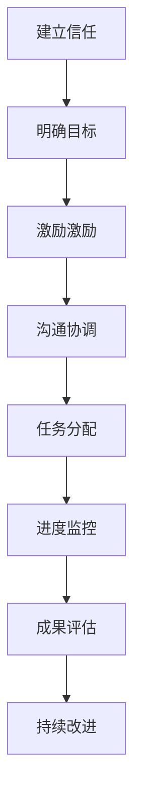

                 

# 虚拟团队管理：跨越时空的领导艺术

## 关键词

虚拟团队管理、跨时空领导、领导艺术、组织架构、项目管理、实战案例分析、最佳实践

## 摘要

在全球化、远程办公趋势日益显著的今天，虚拟团队管理成为了企业管理的重要课题。本文旨在探讨虚拟团队管理的核心概念、领导艺术、架构设计、项目管理以及实战案例分析，为管理者提供一套切实可行的虚拟团队管理方法论。文章将逐步解析虚拟团队的独特性，阐述虚拟团队管理的核心目标，并通过具体案例展示领导艺术的实际应用，总结最佳实践，为读者提供有价值的参考。

## 目录

1. **虚拟团队管理概述**
   1.1 问题背景
   1.2 问题描述
   1.3 问题解决
   1.4 边界与外延

2. **核心概念与原理**
   2.1 虚拟团队定义
   2.2 领导艺术概述
   2.3 概念属性特征对比表格
   2.4 ER实体关系图架构

3. **虚拟团队架构设计**
   3.1 组织结构设计
   3.2 技术平台选择
   3.3 ER实体关系图架构

4. **领导艺术原理讲解**
   4.1 领导力模型
   4.2 领导艺术方法
   4.3 Mermaid流程图

5. **虚拟团队项目管理**
   5.1 项目目标设定
   5.2 项目进度监控
   5.3 成果评估

6. **实战案例分析**
   6.1 案例背景
   6.2 核心问题
   6.3 解决方案
   6.4 案例总结

7. **最佳实践与总结**
   7.1 最佳实践
   7.2 注意事项
   7.3 拓展阅读

## 1. 虚拟团队管理概述

### 1.1 问题背景

随着互联网技术的发展，远程办公、全球协作已经成为现代企业的常态。虚拟团队，作为这种新兴工作模式的代表，逐渐取代了传统的集中办公团队。虚拟团队的管理不仅涉及到地理位置的分散，还包括文化差异、时间差以及沟通方式的转变。在这种背景下，如何有效管理虚拟团队，提升团队效率和协作质量，成为企业管理者面临的重要挑战。

### 1.2 问题描述

虚拟团队管理的独特性体现在以下几个方面：

- **地理分散**：团队成员可能分布在世界各地，地理距离的远近直接影响团队的协作效率。
- **时间差异**：不同的时区导致沟通和协作的时间差，如何合理安排工作计划是管理的关键。
- **文化差异**：不同文化背景的团队成员可能存在价值观和行为方式的差异，需要特别关注团队文化的建设。
- **沟通方式**：传统的面对面沟通转变为线上沟通，如何选择合适的沟通工具和沟通策略是管理的重要内容。

### 1.3 问题解决

虚拟团队管理的核心目标是实现高效的团队协作，提升项目执行效率。为了达到这一目标，管理者需要从以下几个方面入手：

- **明确目标**：确保团队成员对项目目标和任务有清晰的认识，避免因目标不清导致的工作效率低下。
- **建立信任**：通过有效的沟通和协作，建立团队成员之间的信任，增强团队凝聚力。
- **技术支持**：选择合适的团队协作工具，提供必要的技术支持，确保团队成员能够顺畅地进行协作。
- **领导艺术**：管理者需要具备跨时空的领导艺术，通过远程激励、远程沟通技巧等手段，提升团队的士气和协作效率。

### 1.4 边界与外延

虚拟团队管理与远程团队管理有所不同。远程团队通常是指团队成员在物理上分散，但在同一时区或相近时区内工作。而虚拟团队则更强调地理位置的分散性和文化差异。此外，虚拟团队管理还涉及到跨文化的团队协作，管理者需要具备跨文化的管理知识和技能。

在技术支持方面，虚拟团队管理需要借助各种团队协作工具，如即时通讯工具、项目管理软件、视频会议系统等。这些工具的合理应用，可以有效提升团队协作的效率和效果。

## 2. 核心概念与原理

### 2.1 虚拟团队定义

虚拟团队是一种跨越地理界限、通过技术手段实现协作的团队。其特点包括：

- **地理位置的分散性**：团队成员分布在不同的地理位置。
- **跨时区协作**：团队成员可能处于不同的时区，需要协调工作时间和沟通方式。
- **技术依赖性**：虚拟团队依赖于各种团队协作工具和技术平台，实现高效协作。

### 2.2 领导艺术概述

领导艺术是指管理者在领导过程中所运用的一系列技巧和方法，旨在激发团队成员的潜能，实现团队目标。在虚拟团队管理中，领导艺术的重要性更加凸显，因为管理者无法通过面对面的交流来传递信息和激励团队成员。

### 2.3 概念属性特征对比表格

| 概念        | 属性特征                    | 对比                   |
| ----------- | --------------------------- | ---------------------- |
| 虚拟团队    | 地理分散、跨时区协作、技术依赖 | 与远程团队相比更强调地理分散和文化差异 |
| 领导艺术    | 激励、沟通、协调、决策       | 传统领导艺术的延伸和应用 |
| 技术平台    | 即时通讯、项目管理软件、视频会议 | 支持虚拟团队协作的工具 |

### 2.4 ER实体关系图架构

```mermaid
erDiagram
    Task ||--|{ TeamMember }|>
    Task ||--|{ Project }|>
    TeamMember ||--|{ Skill }|>
    Project ||--|{ Goal }|>

    Project : 项目
    Task : 任务
    TeamMember : 团队成员
    Skill : 技能
    Goal : 项目目标

    Task : 承担任务、实现目标
    TeamMember : 承担任务、具备技能
    Project : 设定目标、分解任务
    Goal : 达成目标、评估任务完成情况
```

该ER实体关系图展示了虚拟团队管理中的核心实体及其关系，有助于理解虚拟团队管理的基本原理。

## 3. 虚拟团队架构设计

### 3.1 组织结构设计

虚拟团队的组织结构设计需要考虑地理分散性、时区差异以及文化多样性。以下是一些常见的组织结构设计：

- **矩阵式组织结构**：结合项目团队和职能团队，使团队成员既承担项目任务，又服务于职能部门。
- **网络式组织结构**：通过建立跨部门的合作关系，实现资源的共享和协作。
- **扁平式组织结构**：减少管理层级，提高决策效率，增强团队成员的自主性。

### 3.2 技术平台选择

虚拟团队的管理依赖于各种技术平台，以下是一些常用的技术平台：

- **即时通讯工具**：如Slack、Telegram等，提供实时沟通和协作功能。
- **项目管理软件**：如Jira、Trello等，帮助团队跟踪项目进度和任务分配。
- **视频会议系统**：如Zoom、Microsoft Teams等，提供远程会议和协作功能。
- **文档协作工具**：如Google Docs、Notion等，支持多人实时编辑和协作。

### 3.3 ER实体关系图架构

```mermaid
erDiagram
    Project ||--|{ TeamMember }|>
    Project ||--|{ Task }|>
    TeamMember ||--|{ Skill }|>
    Task ||--|{ Deadline }|>

    Project : 项目
    TeamMember : 团队成员
    Task : 任务
    Skill : 技能
    Deadline : 截止日期

    Project : 设定目标、分配任务
    TeamMember : 承担任务、具备技能
    Task : 实现目标、设定截止日期
    Skill : 提升任务完成能力
```

该ER实体关系图进一步展示了虚拟团队管理中的关键实体及其关系，有助于理解虚拟团队架构的设计原则。

## 4. 领导艺术原理讲解

### 4.1 领导力模型

虚拟团队领导力模型主要包括以下几个方面：

- **信任建立**：通过开放沟通、透明决策和及时反馈，建立团队成员之间的信任。
- **目标明确**：明确团队目标，确保每个成员都清楚自己的职责和任务。
- **激励激励**：通过奖励机制和认可制度，激发团队成员的积极性和创造力。
- **沟通协调**：有效利用各种沟通工具，确保信息的准确传达和及时反馈。

### 4.2 领导艺术方法

虚拟团队领导艺术方法主要包括以下几个方面：

- **远程激励**：通过线上表彰、虚拟奖励等方式，激励团队成员的积极性和参与度。
- **远程沟通技巧**：利用即时通讯工具、视频会议系统等，提高远程沟通的效果和效率。
- **跨文化管理**：尊重不同文化背景的团队成员，建立包容和谐的团队文化。

### 4.3 Mermaid流程图



该Mermaid流程图展示了虚拟团队领导艺术的基本流程，有助于理解领导艺术在虚拟团队管理中的具体应用。

## 5. 虚拟团队项目管理

### 5.1 项目目标设定

项目目标设定是虚拟团队项目管理的第一步，也是至关重要的一步。目标设定的基本原则包括：

- **明确性**：目标要具体、明确，避免模糊不清。
- **可行性**：目标要具有可行性，确保在规定时间内可以实现。
- **挑战性**：目标要具有一定挑战性，激发团队成员的积极性和创造力。
- **可衡量性**：目标要可衡量，以便在项目结束后进行成果评估。

### 5.2 项目进度监控

项目进度监控是确保项目按计划进行的重要手段。虚拟团队的项目进度监控主要包括以下几个方面：

- **定期更新**：通过项目管理软件，定期更新任务进度和项目状态。
- **远程跟踪**：利用视频会议系统，远程跟踪项目进度和团队成员的工作情况。
- **及时反馈**：及时发现项目中的问题，并采取相应的措施进行解决。

### 5.3 成果评估

项目成果评估是对项目执行效果进行客观评价的过程。成果评估的主要内容包括：

- **任务完成情况**：评估任务是否按照计划完成，任务质量是否达到预期。
- **项目效率**：评估项目的整体效率，包括时间成本和资源利用情况。
- **团队协作**：评估团队成员之间的协作效果，团队凝聚力是否增强。

## 6. 实战案例分析

### 6.1 案例背景

某国际知名科技公司的研发团队，由于项目需求，需要组建一个跨国虚拟团队进行产品开发。团队成员分别来自美国、中国、德国和印度，分布在不同的时区，文化背景各异。

### 6.2 核心问题

- **沟通障碍**：由于时区差异，团队成员之间的沟通存在时滞，导致工作效率下降。
- **文化冲突**：不同文化背景的团队成员在工作方式、沟通风格等方面存在差异，导致团队协作不顺畅。
- **项目管理困难**：项目进度难以监控，任务分配不明确，导致项目进度滞后。

### 6.3 解决方案

- **沟通策略**：采用多渠道沟通，如即时通讯工具、视频会议系统等，确保信息的及时传达和反馈。同时，制定统一的沟通规范，确保团队成员之间的沟通畅通。
- **文化融合**：通过定期的团队建设活动，加强团队成员之间的了解和信任。同时，尊重不同文化的差异，建立包容和谐的团队文化。
- **项目管理**：采用项目管理软件，对项目进度和任务进行实时跟踪和监控。明确任务分配，确保每个成员都清楚自己的职责和任务。定期召开项目会议，及时解决项目中出现的问题。

### 6.4 案例总结

通过以上措施，该跨国虚拟团队在项目执行过程中取得了显著成效。沟通障碍得到有效解决，项目进度得到有效监控，团队成员之间的协作更加顺畅。最终，项目按计划完成，产品成功上市。

## 7. 最佳实践与总结

### 7.1 最佳实践

- **跨文化沟通**：建立跨文化沟通团队，定期举办文化培训，提高团队成员的跨文化沟通能力。
- **项目监控**：采用项目管理软件，实时监控项目进度，确保任务按计划执行。
- **团队建设**：定期组织团队建设活动，增强团队凝聚力，提升团队协作效率。

### 7.2 注意事项

- **明确目标**：确保团队成员对项目目标和任务有清晰的认识，避免目标不明确导致的混乱。
- **尊重文化差异**：尊重不同文化的团队成员，建立包容和谐的团队文化。
- **技术支持**：选择合适的团队协作工具，提供必要的技术支持，确保团队成员能够顺畅地进行协作。

### 7.3 拓展阅读

- **《虚拟团队管理：实战手册》**：详细介绍了虚拟团队管理的实践方法和技巧。
- **《跨文化管理》**：探讨跨文化团队管理的关键问题和解决方案。

## 作者

作者：AI天才研究院/AI Genius Institute & 禅与计算机程序设计艺术 /Zen And The Art of Computer Programming

本文通过逐步分析虚拟团队管理的核心概念、领导艺术、架构设计、项目管理和实战案例分析，为读者提供了一套全面的虚拟团队管理方法论。希望本文能为企业管理者在虚拟团队管理方面提供有价值的参考。

