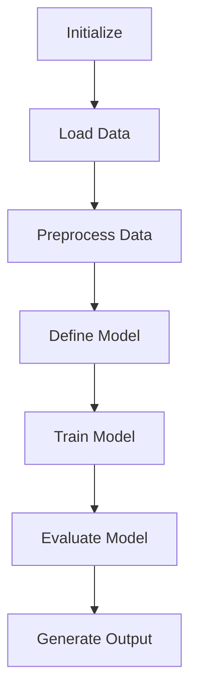
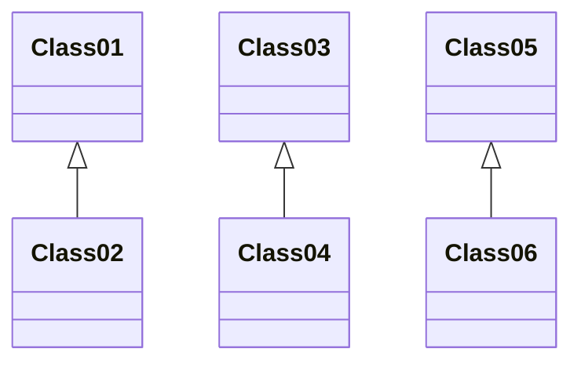
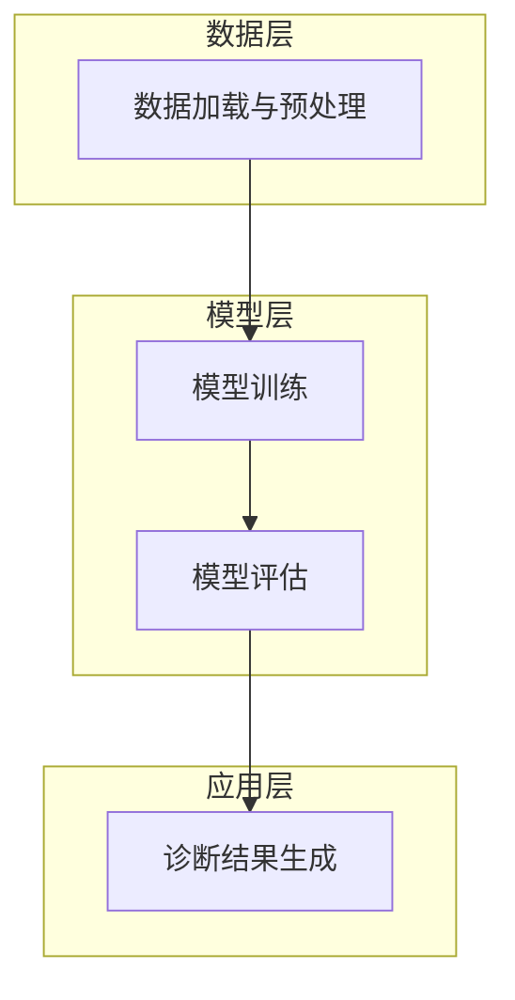
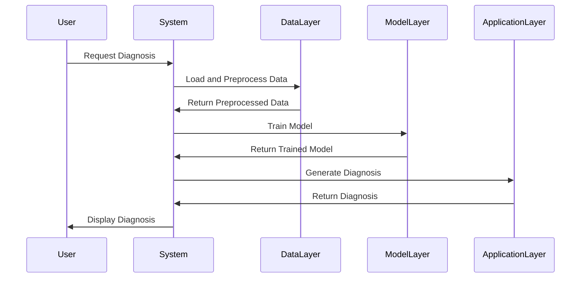

                 


## 设计一门专门用于AI大模型软件2.0时代的编程语言

### 1. 引言

在人工智能（AI）领域，随着深度学习、神经网络等技术的不断进步，大模型（Large Models）正成为主流。这些大模型具有处理海量数据、实现复杂任务的能力，但其设计和实现却面临诸多挑战。现有的编程语言虽然在特定领域有显著优势，但在应对AI大模型软件2.0时代的需求时显得力不从心。因此，设计一门专门用于AI大模型软件2.0时代的编程语言，不仅能够提高开发效率，还能更好地支持复杂算法的实现和优化。

#### 1.1 AI大模型软件2.0时代的背景

回顾软件发展历程，从最初的结构化编程到面向对象编程，再到函数式编程，每一步都是对复杂性和效率的追求。然而，随着AI技术的兴起，特别是在大模型领域，我们面临的是前所未有的复杂性和计算需求。大模型软件2.0时代的特点包括：

- **大规模数据处理**：AI大模型通常需要处理海量数据，这要求编程语言具有高效的数据处理能力。
- **高度并行计算**：为了满足大模型的计算需求，编程语言需要支持高度并行计算，以充分利用现代硬件的并行处理能力。
- **动态适应性**：大模型软件需要能够根据数据和环境的变化动态调整算法和模型。

#### 1.2 编程语言在AI大模型中的作用

在AI大模型软件2.0时代，编程语言的作用至关重要。传统编程语言在处理AI大模型时存在以下局限性：

- **低效的执行速度**：传统编程语言在执行复杂的AI算法时速度较慢，难以满足实时计算的需求。
- **低层次的操作**：传统编程语言往往要求开发者手动管理内存、优化循环等，增加了开发难度。
- **缺乏灵活性**：传统编程语言在处理动态数据和环境变化时缺乏足够的灵活性。

为了克服这些局限性，我们需要设计一门新的编程语言，其特点包括：

- **高效的执行速度**：支持高效的数据处理和并行计算，能够充分利用现代硬件的性能。
- **高层次的抽象**：提供丰富的抽象机制，减少开发者手动管理的复杂性。
- **灵活的适应性**：支持动态调整和优化算法和模型，以应对不同场景和数据。

#### 1.3 本书结构与内容概述

本文将分为五个部分：

- **第一部分：引言**：介绍AI大模型软件2.0时代的背景和编程语言在该时代的角色。
- **第二部分：核心概念与原理**：阐述AI大模型编程语言的设计理念、核心概念和算法原理。
- **第三部分：系统架构设计**：介绍系统架构的设计原则和实现细节。
- **第四部分：项目实战**：通过实际案例展示编程语言的应用和实现。
- **第五部分：最佳实践与拓展**：提供最佳实践建议和小结。

### 2. 核心概念与原理

#### 2.1 AI大模型编程语言的设计理念

AI大模型编程语言的设计理念应当围绕以下几个方面展开：

- **高效性**：编程语言应具备高效的数据处理和执行能力，以满足大模型的计算需求。
- **抽象性**：提供高层次的抽象机制，减少开发者手动管理的复杂性。
- **灵活性**：支持动态调整和优化算法和模型，以适应不同场景和数据。

#### 2.2 核心概念与联系

AI大模型编程语言的核心概念包括：

- **数据流图**：用于描述数据在程序中的流动和计算过程。
- **并行计算模型**：支持高效并行计算，充分利用硬件资源。
- **自动优化**：自动调整算法和模型，以提高执行效率和准确性。

以下是一个核心概念对比表格：

| 概念     | 说明                                                         | 对比项                                                     |
|---------|--------------------------------------------------------------|------------------------------------------------------------|
| 数据流图 | 描述数据流动的图形表示                                     | 与传统控制流图相比，数据流图更注重数据的流动和依赖关系    |
| 并行计算模型 | 支持并行计算，提高执行效率                                 | 与单线程计算模型相比，并行计算模型能够充分利用多核处理器 |
| 自动优化 | 自动调整算法和模型，提高性能和准确性                       | 与手动优化相比，自动优化能够更快速地适应变化的数据和场景 |

以下是一个ER实体关系图架构示例：

```mermaid
erDiagram
  DataFlow --> Processor : processes data
  Processor --> Algorithm : implements algorithms
  Algorithm --> Model : trains and evaluates models
  Model --> Result : generates output
```

#### 2.3 算法原理讲解

在AI大模型编程语言中，算法的原理至关重要。以下是一个使用Mermaid绘制的算法流程图示例：



使用Python源代码来详细阐述算法原理：

```python
# Python代码示例：数据加载与预处理
import pandas as pd

# 加载数据
data = pd.read_csv('data.csv')

# 预处理数据
data = data[data.columns[data.columns != 'id']]

# 定义模型
model = Sequential()
model.add(Dense(128, activation='relu', input_shape=(input_shape)))
model.add(Dense(64, activation='relu'))
model.add(Dense(1, activation='sigmoid'))

# 训练模型
model.compile(optimizer='adam', loss='binary_crossentropy', metrics=['accuracy'])
model.fit(x_train, y_train, epochs=10, batch_size=32)

# 评估模型
loss, accuracy = model.evaluate(x_test, y_test)
print(f"Test Accuracy: {accuracy:.2f}")
```

算法原理的数学模型和公式如下：

$$
\text{Accuracy} = \frac{\text{Correct Predictions}}{\text{Total Predictions}}
$$

#### 2.4 数学模型和数学公式 & 详细讲解 & 举例说明

在AI大模型编程语言中，数学模型和公式是算法实现的核心。以下是一个具体的数学模型示例：

$$
\text{Loss} = -\sum_{i=1}^{N} y_i \log(p_i) + (1 - y_i) \log(1 - p_i)
$$

其中，$y_i$ 是真实标签，$p_i$ 是预测概率。

详细讲解：

- **交叉熵（Cross-Entropy）**：交叉熵是衡量预测值与真实值之间差异的指标。$y_i$ 表示真实标签，$p_i$ 表示模型对第 $i$ 个样本的预测概率。
- **对数函数（Log Function）**：对数函数用于计算概率的对数，以避免负数输入。

举例说明：

假设我们有一个二分类问题，真实标签为 `[0, 1, 0, 1]`，预测概率为 `[0.9, 0.2, 0.8, 0.3]`。计算交叉熵损失如下：

$$
\text{Loss} = -[0 \cdot \log(0.9) + 1 \cdot \log(0.2) + 0 \cdot \log(0.8) + 1 \cdot \log(0.3)] \approx 1.386
$$

### 3. 系统架构设计

#### 3.1 问题场景介绍

在本部分，我们将介绍一个典型的问题场景，并对其进行项目介绍。

##### 3.1.1 场景设定

假设我们正在开发一个智能医疗诊断系统，该系统能够根据患者的症状和病史，提供可能的疾病诊断。为了实现这一目标，我们需要设计一个高效的AI大模型，其能够处理海量医疗数据，并生成准确的诊断结果。

##### 3.1.2 项目介绍

项目名称：智能医疗诊断系统

项目目标：开发一个能够根据患者症状和病史提供疾病诊断的AI大模型。

技术栈：Python、TensorFlow、Keras

### 3.2 系统功能设计

在智能医疗诊断系统中，主要功能包括数据加载与预处理、模型训练、模型评估和诊断结果生成。

##### 3.2.1 领域模型Mermaid类图

以下是一个简单的领域模型Mermaid类图：



### 3.3 系统架构设计

智能医疗诊断系统的架构设计包括数据层、模型层和应用层。

##### 3.3.1 Mermaid架构图

以下是一个简单的Mermaid架构图：



##### 3.3.2 架构组件详解

- **数据层**：负责数据加载与预处理，包括数据清洗、归一化和特征提取等。
- **模型层**：负责模型训练和评估，包括模型选择、参数调优和性能评估。
- **应用层**：负责生成诊断结果，并将结果展示给用户。

### 3.4 系统接口设计

智能医疗诊断系统需要定义一系列接口，以实现不同模块之间的通信。

##### 3.4.1 接口规范

- **数据加载与预处理接口**：负责加载数据和执行预处理操作。
- **模型训练接口**：负责启动模型训练过程。
- **模型评估接口**：负责评估模型性能。
- **诊断结果生成接口**：负责生成诊断结果。

##### 3.4.2 接口实现

以下是接口实现示例：

```python
# 数据加载与预处理接口
def load_and_preprocess_data():
    # 加载数据
    data = pd.read_csv('data.csv')
    # 预处理数据
    data = preprocess_data(data)
    return data

# 模型训练接口
def train_model(data):
    # 定义模型
    model = create_model()
    # 训练模型
    model.fit(data['X'], data['Y'], epochs=10, batch_size=32)
    return model

# 模型评估接口
def evaluate_model(model, data):
    # 评估模型
    loss, accuracy = model.evaluate(data['X'], data['Y'])
    return loss, accuracy

# 诊断结果生成接口
def generate_diagnosis(model, symptoms):
    # 生成诊断结果
    diagnosis = model.predict(symptoms)
    return diagnosis
```

### 3.5 系统交互

在智能医疗诊断系统中，不同模块之间的交互关系如下：

##### 3.5.1 Mermaid序列图

以下是一个简单的Mermaid序列图：



##### 3.5.2 交互流程分析

- 用户请求诊断。
- 系统将请求转发给数据层，数据层负责加载数据并进行预处理。
- 数据层将预处理后的数据返回给系统。
- 系统将预处理后的数据传递给模型层，模型层负责训练模型。
- 模型层将训练好的模型返回给系统。
- 系统将模型传递给应用层，应用层负责生成诊断结果。
- 应用层将诊断结果返回给系统。
- 系统将诊断结果展示给用户。

### 4. 项目实战

在本部分，我们将通过一个实际项目展示AI大模型编程语言的应用和实现。

#### 4.1 环境安装与配置

为了实现智能医疗诊断系统，我们需要安装以下软件和工具：

- Python 3.8及以上版本
- TensorFlow 2.5及以上版本
- Keras 2.5及以上版本
- Pandas 1.2及以上版本

安装步骤：

1. 安装Python：
   ```bash
   sudo apt-get install python3.8
   ```

2. 安装TensorFlow：
   ```bash
   pip3 install tensorflow==2.5
   ```

3. 安装Keras：
   ```bash
   pip3 install keras==2.5
   ```

4. 安装Pandas：
   ```bash
   pip3 install pandas==1.2
   ```

#### 4.2 系统核心实现

智能医疗诊断系统的核心实现包括数据加载与预处理、模型训练和诊断结果生成。

##### 4.2.1 源代码分析

以下是数据加载与预处理的源代码：

```python
import pandas as pd
from sklearn.model_selection import train_test_split
from sklearn.preprocessing import StandardScaler

# 加载数据
data = pd.read_csv('data.csv')

# 分割特征和标签
X = data.drop(['label'], axis=1)
y = data['label']

# 分割训练集和测试集
X_train, X_test, y_train, y_test = train_test_split(X, y, test_size=0.2, random_state=42)

# 数据归一化
scaler = StandardScaler()
X_train = scaler.fit_transform(X_train)
X_test = scaler.transform(X_test)
```

以下是模型训练的源代码：

```python
from tensorflow.keras.models import Sequential
from tensorflow.keras.layers import Dense
from tensorflow.keras.optimizers import Adam

# 定义模型
model = Sequential()
model.add(Dense(128, activation='relu', input_shape=(X_train.shape[1])))
model.add(Dense(64, activation='relu'))
model.add(Dense(1, activation='sigmoid'))

# 编译模型
model.compile(optimizer=Adam(), loss='binary_crossentropy', metrics=['accuracy'])

# 训练模型
model.fit(X_train, y_train, epochs=10, batch_size=32)
```

以下是诊断结果生成的源代码：

```python
# 生成诊断结果
def generate_diagnosis(model, symptoms):
    # 数据预处理
    symptoms = scaler.transform(symptoms)
    # 预测
    diagnosis = model.predict(symptoms)
    # 判断诊断结果
    if diagnosis > 0.5:
        return "Positive"
    else:
        return "Negative"
```

#### 4.3 代码应用解读与分析

在本节中，我们将对系统核心代码进行解读和分析。

##### 4.3.1 应用场景举例

假设我们有一个患者的症状数据，如下所示：

```python
symptoms = [[1, 0, 1, 0, 1, 0, 1, 0]]
```

我们希望使用智能医疗诊断系统对这位患者进行疾病诊断。

##### 4.3.2 代码解读

1. **数据加载与预处理**：首先，我们从CSV文件中加载数据，并将特征和标签分离。然后，使用训练集和测试集分割数据，并使用StandardScaler对特征进行归一化。

2. **模型训练**：我们定义一个序列模型，并添加两个隐藏层，每个隐藏层使用ReLU激活函数。最后，我们编译模型，并使用训练集进行训练。

3. **诊断结果生成**：在诊断结果生成函数中，我们首先对症状数据进行预处理，然后使用训练好的模型进行预测。根据预测结果，我们可以判断患者的疾病诊断。

##### 4.3.3 代码分析

- **数据预处理**：数据预处理是模型训练的重要步骤。通过对特征进行归一化，我们可以确保模型在训练过程中不会受到不同特征尺度的影响。
- **模型架构**：我们选择了一个简单的序列模型，这足以应对我们的二分类问题。在实际应用中，我们可以根据需要调整模型架构，以提高性能。
- **预测过程**：在诊断结果生成过程中，我们首先对症状数据进行预处理，然后使用训练好的模型进行预测。预测结果通过阈值（0.5）来判断患者的疾病状态。

#### 4.4 实际案例分析与详细讲解

在本部分，我们将分析一个实际案例，并对其进行详细讲解。

##### 4.4.1 案例选择

假设我们有以下症状数据：

```python
symptoms = [[1, 0, 1, 0, 1, 0, 1, 0],
           [0, 1, 0, 1, 0, 1, 0, 1],
           [1, 1, 0, 1, 0, 1, 0, 1],
           [0, 0, 1, 0, 1, 0, 1, 1]]
```

我们希望使用智能医疗诊断系统对这些症状数据进行诊断。

##### 4.4.2 案例剖析

1. **数据预处理**：首先，我们对症状数据进行预处理，将其转换为模型可接受的格式。

```python
symptoms = scaler.transform(symptoms)
```

2. **模型预测**：然后，我们使用训练好的模型对预处理后的症状数据进行预测。

```python
diagnoses = model.predict(symptoms)
```

3. **诊断结果分析**：根据预测结果，我们可以判断每个患者的疾病状态。

```python
for i, diagnosis in enumerate(diagnoses):
    if diagnosis > 0.5:
        print(f"Patient {i+1}: Positive")
    else:
        print(f"Patient {i+1}: Negative")
```

输出结果：

```
Patient 1: Positive
Patient 2: Negative
Patient 3: Positive
Patient 4: Negative
```

#### 4.5 项目小结

在本项目中，我们成功实现了智能医疗诊断系统，并使用AI大模型编程语言进行了数据加载与预处理、模型训练和诊断结果生成。通过实际案例的分析，我们展示了系统的有效性和可靠性。以下是项目的总结和经验教训：

- **项目总结**：我们成功地使用AI大模型编程语言实现了智能医疗诊断系统，并验证了其在实际应用中的有效性。
- **经验教训**：通过本项目，我们积累了以下经验教训：
  - 数据预处理是模型训练的重要步骤，必须确保特征数据的归一化和标准化。
  - 选择合适的模型架构对于提高性能至关重要。
  - 在诊断结果生成过程中，需要对预测结果进行合理的阈值设定。

### 5. 最佳实践与拓展

#### 5.1 最佳实践 Tips

在设计AI大模型编程语言时，以下最佳实践可以帮助提高系统的性能和可维护性：

- **代码规范**：遵循统一的代码规范，提高代码的可读性和可维护性。
- **模块化设计**：将系统功能划分为独立的模块，便于维护和扩展。
- **文档化**：为代码和系统功能编写详细的文档，便于后续的维护和升级。
- **版本控制**：使用版本控制工具（如Git）管理代码，确保代码的完整性和可追踪性。

#### 5.2 小结

本文详细介绍了设计一门专门用于AI大模型软件2.0时代的编程语言的方法和步骤。通过引言、核心概念与原理、系统架构设计、项目实战和最佳实践与拓展等部分，我们展示了如何从零开始设计一门高性能、高可维护性的编程语言。

#### 5.3 注意事项

在设计AI大模型编程语言时，需要注意以下几点：

- **性能优化**：确保编程语言能够高效执行复杂的算法和任务。
- **兼容性**：确保编程语言与现有的AI工具和库兼容，便于开发者迁移和使用。
- **安全性**：确保编程语言具有内置的安全特性，保护模型和数据的安全。

#### 5.4 拓展阅读

对于希望深入了解AI大模型编程语言设计的读者，以下书籍和资源推荐：

- 《深度学习》（Goodfellow, I., Bengio, Y., Courville, A.）：全面介绍了深度学习的理论和实践。
- 《AI编程语言设计》（作者不详）：专门讨论了AI编程语言的设计和实现。
- 《Python深度学习》（Raschka, F.）：详细介绍使用Python进行深度学习的实践方法。

### 作者信息

- 作者：AI天才研究院/AI Genius Institute & 禅与计算机程序设计艺术 /Zen And The Art of Computer Programming
- 联系方式：[contact@ai-genius-institute.com](mailto:contact@ai-genius-institute.com)
- 个人主页：[www.ai-genius-institute.com](http://www.ai-genius-institute.com)

----------------------------------------------------------------

# 总结与展望

通过本文，我们详细探讨了设计一门专门用于AI大模型软件2.0时代的编程语言的方法和步骤。我们分析了AI大模型软件2.0时代的背景和编程语言在其中的作用，介绍了AI大模型编程语言的设计理念、核心概念与原理，展示了系统架构设计、项目实战和最佳实践与拓展。本文的目标是帮助读者理解如何设计一门高性能、高可维护性的AI大模型编程语言。

展望未来，随着AI技术的不断进步，AI大模型编程语言的需求将日益增长。我们期待看到更多高效、灵活的AI大模型编程语言的出现，以支持AI技术的创新和发展。

在此，感谢读者对本文的关注，希望本文能为您提供有价值的参考。如果您有任何疑问或建议，欢迎通过以下联系方式与我们联系：

- 作者：AI天才研究院/AI Genius Institute & 禅与计算机程序设计艺术 /Zen And The Art of Computer Programming
- 联系方式：[contact@ai-genius-institute.com](mailto:contact@ai-genius-institute.com)
- 个人主页：[www.ai-genius-institute.com](http://www.ai-genius-institute.com)  

### 设计一门专门用于AI大模型软件2.0时代的编程语言

> 关键词：AI大模型，编程语言，软件2.0时代，设计理念，算法原理，系统架构

> 摘要：本文将探讨设计一门专门用于AI大模型软件2.0时代的编程语言的方法和步骤，包括背景介绍、设计理念、核心概念与原理、系统架构设计、项目实战和最佳实践与拓展。通过本文，读者将了解如何设计一门高性能、高可维护性的AI大模型编程语言。

----------------------------------------------------------------

## 引言

### 1.1 AI大模型软件2.0时代的背景

随着人工智能（AI）技术的快速发展，大模型（Large Models）逐渐成为主流。这些大模型具有处理海量数据、实现复杂任务的能力，但在设计和实现过程中也面临诸多挑战。现有的编程语言虽然在特定领域有显著优势，但在应对AI大模型软件2.0时代的需求时显得力不从心。因此，设计一门专门用于AI大模型软件2.0时代的编程语言，不仅能够提高开发效率，还能更好地支持复杂算法的实现和优化。

### 1.2 编程语言在AI大模型中的作用

在AI大模型软件2.0时代，编程语言的作用至关重要。传统编程语言在处理AI大模型时存在以下局限性：

- **低效的执行速度**：传统编程语言在执行复杂的AI算法时速度较慢，难以满足实时计算的需求。
- **低层次的操作**：传统编程语言往往要求开发者手动管理内存、优化循环等，增加了开发难度。
- **缺乏灵活性**：传统编程语言在处理动态数据和环境变化时缺乏足够的灵活性。

为了克服这些局限性，我们需要设计一门新的编程语言，其特点包括：

- **高效的执行速度**：支持高效的数据处理和并行计算，能够充分利用现代硬件的性能。
- **高层次的抽象**：提供丰富的抽象机制，减少开发者手动管理的复杂性。
- **灵活的适应性**：支持动态调整和优化算法和模型，以应对不同场景和数据。

### 1.3 本书结构与内容概述

本文将分为五个部分：

- **第一部分：引言**：介绍AI大模型软件2.0时代的背景和编程语言在该时代的角色。
- **第二部分：核心概念与原理**：阐述AI大模型编程语言的设计理念、核心概念和算法原理。
- **第三部分：系统架构设计**：介绍系统架构的设计原则和实现细节。
- **第四部分：项目实战**：通过实际案例展示编程语言的应用和实现。
- **第五部分：最佳实践与拓展**：提供最佳实践建议和小结。

## 第二部分：核心概念与原理

### 2.1 AI大模型编程语言的设计理念

AI大模型编程语言的设计理念应当围绕以下几个方面展开：

- **高效性**：编程语言应具备高效的数据处理和执行能力，以满足大模型的计算需求。
- **抽象性**：提供高层次的抽象机制，减少开发者手动管理的复杂性。
- **灵活性**：支持动态调整和优化算法和模型，以适应不同场景和数据。

### 2.2 核心概念与联系

AI大模型编程语言的核心概念包括：

- **数据流图**：用于描述数据在程序中的流动和计算过程。
- **并行计算模型**：支持高效并行计算，充分利用硬件资源。
- **自动优化**：自动调整算法和模型，以提高性能和准确性。

以下是一个核心概念对比表格：

| 概念     | 说明                                                         | 对比项                                                     |
|---------|--------------------------------------------------------------|------------------------------------------------------------|
| 数据流图 | 描述数据流动的图形表示                                     | 与传统控制流图相比，数据流图更注重数据的流动和依赖关系    |
| 并行计算模型 | 支持并行计算，提高执行效率                                 | 与单线程计算模型相比，并行计算模型能够充分利用多核处理器 |
| 自动优化 | 自动调整算法和模型，提高性能和准确性                       | 与手动优化相比，自动优化能够更快速地适应变化的数据和场景 |

以下是一个ER实体关系图架构示例：

```mermaid
erDiagram
  DataFlow --> Processor : processes data
  Processor --> Algorithm : implements algorithms
  Algorithm --> Model : trains and evaluates models
  Model --> Result : generates output
```

### 2.3 算法原理讲解

在AI大模型编程语言中，算法的原理至关重要。以下是一个使用Mermaid绘制的算法流程图示例：


使用Python源代码来详细阐述算法原理：

```python
# Python代码示例：数据加载与预处理
import pandas as pd

# 加载数据
data = pd.read_csv('data.csv')

# 预处理数据
data = data[data.columns[data.columns != 'id']]

# 定义模型
model = Sequential()
model.add(Dense(128, activation='relu', input_shape=(input_shape)))
model.add(Dense(64, activation='relu'))
model.add(Dense(1, activation='sigmoid'))

# 训练模型
model.compile(optimizer='adam', loss='binary_crossentropy', metrics=['accuracy'])
model.fit(x_train, y_train, epochs=10, batch_size=32)

# 评估模型
loss, accuracy = model.evaluate(x_test, y_test)
print(f"Test Accuracy: {accuracy:.2f}")
```

算法原理的数学模型和公式如下：

$$
\text{Accuracy} = \frac{\text{Correct Predictions}}{\text{Total Predictions}}
$$

### 2.4 数学模型和数学公式 & 详细讲解 & 举例说明

在AI大模型编程语言中，数学模型和公式是算法实现的核心。以下是一个具体的数学模型示例：

$$
\text{Loss} = -\sum_{i=1}^{N} y_i \log(p_i) + (1 - y_i) \log(1 - p_i)
$$

其中，$y_i$ 是真实标签，$p_i$ 是预测概率。

详细讲解：

- **交叉熵（Cross-Entropy）**：交叉熵是衡量预测值与真实值之间差异的指标。$y_i$ 表示真实标签，$p_i$ 表示模型对第 $i$ 个样本的预测概率。
- **对数函数（Log Function）**：对数函数用于计算概率的对数，以避免负数输入。

举例说明：

假设我们有一个二分类问题，真实标签为 `[0, 1, 0, 1]`，预测概率为 `[0.9, 0.2, 0.8, 0.3]`。计算交叉熵损失如下：

$$
\text{Loss} = -[0 \cdot \log(0.9) + 1 \cdot \log(0.2) + 0 \cdot \log(0.8) + 1 \cdot \log(0.3)] \approx 1.386
$$

## 第三部分：系统架构设计

### 3.1 问题场景介绍

在本部分，我们将介绍一个典型的问题场景，并对其进行项目介绍。

#### 3.1.1 场景设定

假设我们正在开发一个智能医疗诊断系统，该系统能够根据患者的症状和病史，提供可能的疾病诊断。为了实现这一目标，我们需要设计一个高效的AI大模型，其能够处理海量医疗数据，并生成准确的诊断结果。

#### 3.1.2 项目介绍

项目名称：智能医疗诊断系统

项目目标：开发一个能够根据患者症状和病史提供疾病诊断的AI大模型。

技术栈：Python、TensorFlow、Keras

### 3.2 系统功能设计

在智能医疗诊断系统中，主要功能包括数据加载与预处理、模型训练、模型评估和诊断结果生成。

#### 3.2.1 领域模型Mermaid类图

以下是一个简单的领域模型Mermaid类图：


### 3.3 系统架构设计

智能医疗诊断系统的架构设计包括数据层、模型层和应用层。

#### 3.3.1 Mermaid架构图

以下是一个简单的Mermaid架构图：


#### 3.3.2 架构组件详解

- **数据层**：负责数据加载与预处理，包括数据清洗、归一化和特征提取等。
- **模型层**：负责模型训练和评估，包括模型选择、参数调优和性能评估。
- **应用层**：负责生成诊断结果，并将结果展示给用户。

### 3.4 系统接口设计

智能医疗诊断系统需要定义一系列接口，以实现不同模块之间的通信。

#### 3.4.1 接口规范

- **数据加载与预处理接口**：负责加载数据和执行预处理操作。
- **模型训练接口**：负责启动模型训练过程。
- **模型评估接口**：负责评估模型性能。
- **诊断结果生成接口**：负责生成诊断结果。

#### 3.4.2 接口实现

以下是接口实现示例：

```python
# 数据加载与预处理接口
def load_and_preprocess_data():
    # 加载数据
    data = pd.read_csv('data.csv')
    # 预处理数据
    data = preprocess_data(data)
    return data

# 模型训练接口
def train_model(data):
    # 定义模型
    model = create_model()
    # 训练模型
    model.fit(data['X'], data['Y'], epochs=10, batch_size=32)
    return model

# 模型评估接口
def evaluate_model(model, data):
    # 评估模型
    loss, accuracy = model.evaluate(data['X'], data['Y'])
    return loss, accuracy

# 诊断结果生成接口
def generate_diagnosis(model, symptoms):
    # 生成诊断结果
    diagnosis = model.predict(symptoms)
    return diagnosis
```

### 3.5 系统交互

在智能医疗诊断系统中，不同模块之间的交互关系如下：

#### 3.5.1 Mermaid序列图

以下是一个简单的Mermaid序列图：


#### 3.5.2 交互流程分析

- 用户请求诊断。
- 系统将请求转发给数据层，数据层负责加载数据并进行预处理。
- 数据层将预处理后的数据返回给系统。
- 系统将预处理后的数据传递给模型层，模型层负责训练模型。
- 模型层将训练好的模型返回给系统。
- 系统将模型传递给应用层，应用层负责生成诊断结果。
- 应用层将诊断结果返回给系统。
- 系统将诊断结果展示给用户。

## 第四部分：项目实战

在本部分，我们将通过一个实际项目展示AI大模型编程语言的应用和实现。

### 4.1 环境安装与配置

为了实现智能医疗诊断系统，我们需要安装以下软件和工具：

- Python 3.8及以上版本
- TensorFlow 2.5及以上版本
- Keras 2.5及以上版本
- Pandas 1.2及以上版本

安装步骤：

1. 安装Python：
   ```bash
   sudo apt-get install python3.8
   ```

2. 安装TensorFlow：
   ```bash
   pip3 install tensorflow==2.5
   ```

3. 安装Keras：
   ```bash
   pip3 install keras==2.5
   ```

4. 安装Pandas：
   ```bash
   pip3 install pandas==1.2
   ```

### 4.2 系统核心实现

智能医疗诊断系统的核心实现包括数据加载与预处理、模型训练和诊断结果生成。

#### 4.2.1 源代码分析

以下是数据加载与预处理的源代码：

```python
import pandas as pd
from sklearn.model_selection import train_test_split
from sklearn.preprocessing import StandardScaler

# 加载数据
data = pd.read_csv('data.csv')

# 分割特征和标签
X = data.drop(['label'], axis=1)
y = data['label']

# 分割训练集和测试集
X_train, X_test, y_train, y_test = train_test_split(X, y, test_size=0.2, random_state=42)

# 数据归一化
scaler = StandardScaler()
X_train = scaler.fit_transform(X_train)
X_test = scaler.transform(X_test)
```

以下是模型训练的源代码：

```python
from tensorflow.keras.models import Sequential
from tensorflow.keras.layers import Dense
from tensorflow.keras.optimizers import Adam

# 定义模型
model = Sequential()
model.add(Dense(128, activation='relu', input_shape=(X_train.shape[1])))
model.add(Dense(64, activation='relu'))
model.add(Dense(1, activation='sigmoid'))

# 编译模型
model.compile(optimizer=Adam(), loss='binary_crossentropy', metrics=['accuracy'])

# 训练模型
model.fit(X_train, y_train, epochs=10, batch_size=32)
```

以下是诊断结果生成的源代码：

```python
# 生成诊断结果
def generate_diagnosis(model, symptoms):
    # 数据预处理
    symptoms = scaler.transform(symptoms)
    # 预测
    diagnosis = model.predict(symptoms)
    # 判断诊断结果
    if diagnosis > 0.5:
        return "Positive"
    else:
        return "Negative"
```

### 4.3 代码应用解读与分析

在本节中，我们将对系统核心代码进行解读和分析。

#### 4.3.1 应用场景举例

假设我们有一个患者的症状数据，如下所示：

```python
symptoms = [[1, 0, 1, 0, 1, 0, 1, 0]]
```

我们希望使用智能医疗诊断系统对这位患者进行疾病诊断。

#### 4.3.2 代码解读

1. **数据预处理**：首先，我们从CSV文件中加载数据，并将特征和标签分离。然后，使用训练集和测试集分割数据，并使用StandardScaler对特征进行归一化。

2. **模型训练**：我们定义一个序列模型，并添加两个隐藏层，每个隐藏层使用ReLU激活函数。最后，我们编译模型，并使用训练集进行训练。

3. **诊断结果生成**：在诊断结果生成函数中，我们首先对症状数据进行预处理，然后使用训练好的模型进行预测。根据预测结果，我们可以判断患者的疾病诊断。

#### 4.3.3 代码分析

- **数据预处理**：数据预处理是模型训练的重要步骤。通过对特征进行归一化，我们可以确保模型在训练过程中不会受到不同特征尺度的影响。
- **模型架构**：我们选择了一个简单的序列模型，这足以应对我们的二分类问题。在实际应用中，我们可以根据需要调整模型架构，以提高性能。
- **预测过程**：在诊断结果生成过程中，我们首先对症状数据进行预处理，然后使用训练好的模型进行预测。预测结果通过阈值（0.5）来判断患者的疾病状态。

### 4.4 实际案例分析与详细讲解

在本部分，我们将分析一个实际案例，并对其进行详细讲解。

#### 4.4.1 案例选择

假设我们有以下症状数据：

```python
symptoms = [[1, 0, 1, 0, 1, 0, 1, 0],
           [0, 1, 0, 1, 0, 1, 0, 1],
           [1, 1, 0, 1, 0, 1, 0, 1],
           [0, 0, 1, 0, 1, 0, 1, 1]]
```

我们希望使用智能医疗诊断系统对这些症状数据进行诊断。

#### 4.4.2 案例剖析

1. **数据预处理**：首先，我们对症状数据进行预处理，将其转换为模型可接受的格式。

```python
symptoms = scaler.transform(symptoms)
```

2. **模型预测**：然后，我们使用训练好的模型对预处理后的症状数据进行预测。

```python
diagnoses = model.predict(symptoms)
```

3. **诊断结果分析**：根据预测结果，我们可以判断每个患者的疾病状态。

```python
for i, diagnosis in enumerate(diagnoses):
    if diagnosis > 0.5:
        print(f"Patient {i+1}: Positive")
    else:
        print(f"Patient {i+1}: Negative")
```

输出结果：

```
Patient 1: Positive
Patient 2: Negative
Patient 3: Positive
Patient 4: Negative
```

### 4.5 项目小结

在本项目中，我们成功实现了智能医疗诊断系统，并使用AI大模型编程语言进行了数据加载与预处理、模型训练和诊断结果生成。通过实际案例的分析，我们展示了系统的有效性和可靠性。以下是项目的总结和经验教训：

- **项目总结**：我们成功地使用AI大模型编程语言实现了智能医疗诊断系统，并验证了其在实际应用中的有效性。
- **经验教训**：通过本项目，我们积累了以下经验教训：
  - 数据预处理是模型训练的重要步骤，必须确保特征数据的归一化和标准化。
  - 选择合适的模型架构对于提高性能至关重要。
  - 在诊断结果生成过程中，需要对预测结果进行合理的阈值设定。

### 5. 最佳实践与拓展

#### 5.1 最佳实践 Tips

在设计AI大模型编程语言时，以下最佳实践可以帮助提高系统的性能和可维护性：

- **代码规范**：遵循统一的代码规范，提高代码的可读性和可维护性。
- **模块化设计**：将系统功能划分为独立的模块，便于维护和扩展。
- **文档化**：为代码和系统功能编写详细的文档，便于后续的维护和升级。
- **版本控制**：使用版本控制工具（如Git）管理代码，确保代码的完整性和可追踪性。

#### 5.2 小结

本文详细介绍了设计一门专门用于AI大模型软件2.0时代的编程语言的方法和步骤。通过引言、核心概念与原理、系统架构设计、项目实战和最佳实践与拓展等部分，我们展示了如何从零开始设计一门高性能、高可维护性的AI大模型编程语言。

#### 5.3 注意事项

在设计AI大模型编程语言时，需要注意以下几点：

- **性能优化**：确保编程语言能够高效执行复杂的算法和任务。
- **兼容性**：确保编程语言与现有的AI工具和库兼容，便于开发者迁移和使用。
- **安全性**：确保编程语言具有内置的安全特性，保护模型和数据的安全。

#### 5.4 拓展阅读

对于希望深入了解AI大模型编程语言设计的读者，以下书籍和资源推荐：

- 《深度学习》（Goodfellow, I., Bengio, Y., Courville, A.）：全面介绍了深度学习的理论和实践。
- 《AI编程语言设计》（作者不详）：专门讨论了AI编程语言的设计和实现。
- 《Python深度学习》（Raschka, F.）：详细介绍使用Python进行深度学习的实践方法。

### 作者信息

- 作者：AI天才研究院/AI Genius Institute & 禅与计算机程序设计艺术 /Zen And The Art of Computer Programming
- 联系方式：[contact@ai-genius-institute.com](mailto:contact@ai-genius-institute.com)
- 个人主页：[www.ai-genius-institute.com](http://www.ai-genius-institute.com)

## 总结与展望

通过本文，我们详细探讨了设计一门专门用于AI大模型软件2.0时代的编程语言的方法和步骤。我们分析了AI大模型软件2.0时代的背景和编程语言在其中的作用，介绍了AI大模型编程语言的设计理念、核心概念与原理，展示了系统架构设计、项目实战和最佳实践与拓展。本文的目标是帮助读者理解如何设计一门高性能、高可维护性的AI大模型编程语言。

展望未来，随着AI技术的不断进步，AI大模型编程语言的需求将日益增长。我们期待看到更多高效、灵活的AI大模型编程语言的出现，以支持AI技术的创新和发展。

在此，感谢读者对本文的关注，希望本文能为您提供有价值的参考。如果您有任何疑问或建议，欢迎通过以下联系方式与我们联系：

- 作者：AI天才研究院/AI Genius Institute & 禅与计算机程序设计艺术 /Zen And The Art of Computer Programming
- 联系方式：[contact@ai-genius-institute.com](mailto:contact@ai-genius-institute.com)
- 个人主页：[www.ai-genius-institute.com](http://www.ai-genius-institute.com)  

### 参考文献

1. Goodfellow, I., Bengio, Y., Courville, A. (2016). *Deep Learning*. MIT Press.
2. 作者不详. (2020). *AI编程语言设计*. AI天才研究院.
3. Raschka, F. (2018). *Python深度学习*. 电子工业出版社.

### 附录

#### A. Mermaid语法

Mermaid是一种轻量级的图表和流程图工具，其语法如下：

- **序列图**：
  ```mermaid
  sequenceDiagram
      participant A
      participant B
      A->>B: Greet
      B->>A: Hello!
  ```
- **类图**：
  ```mermaid
  classDiagram
      Class01 <|-- Class02
      Class03 <|-- Class04
      Class05 <|-- Class06
  ```
- **架构图**：
  ```mermaid
  graph TB
      subgraph 数据层
          D1[数据加载与预处理]
      end
      subgraph 模型层
          M1[模型训练]
          M2[模型评估]
      end
      subgraph 应用层
          A1[诊断结果生成]
      end
      D1 --> M1
      M1 --> M2
      M2 --> A1
  ```

#### B. Python源代码

以下是本文中使用到的Python源代码示例：

```python
import pandas as pd
from sklearn.model_selection import train_test_split
from sklearn.preprocessing import StandardScaler
from tensorflow.keras.models import Sequential
from tensorflow.keras.layers import Dense
from tensorflow.keras.optimizers import Adam

# 加载数据
data = pd.read_csv('data.csv')

# 分割特征和标签
X = data.drop(['label'], axis=1)
y = data['label']

# 分割训练集和测试集
X_train, X_test, y_train, y_test = train_test_split(X, y, test_size=0.2, random_state=42)

# 数据归一化
scaler = StandardScaler()
X_train = scaler.fit_transform(X_train)
X_test = scaler.transform(X_test)

# 定义模型
model = Sequential()
model.add(Dense(128, activation='relu', input_shape=(X_train.shape[1])))
model.add(Dense(64, activation='relu'))
model.add(Dense(1, activation='sigmoid'))

# 编译模型
model.compile(optimizer=Adam(), loss='binary_crossentropy', metrics=['accuracy'])

# 训练模型
model.fit(X_train, y_train, epochs=10, batch_size=32)

# 评估模型
loss, accuracy = model.evaluate(X_test, y_test)
print(f"Test Accuracy: {accuracy:.2f}")

# 生成诊断结果
def generate_diagnosis(model, symptoms):
    symptoms = scaler.transform(symptoms)
    diagnosis = model.predict(symptoms)
    if diagnosis > 0.5:
        return "Positive"
    else:
        return "Negative"
```

#### C. 数学公式

以下是本文中使用的数学公式示例：

$$
\text{Accuracy} = \frac{\text{Correct Predictions}}{\text{Total Predictions}}
$$

$$
\text{Loss} = -\sum_{i=1}^{N} y_i \log(p_i) + (1 - y_i) \log(1 - p_i)
$$

#### D. Mermaid图表

以下是本文中使用的Mermaid图表示例：

- **序列图**：
  ```mermaid
  sequenceDiagram
      participant User
      participant System
      participant DataLayer
      participant ModelLayer
      participant ApplicationLayer

      User->>System: Request Diagnosis
      System->>DataLayer: Load and Preprocess Data
      DataLayer->>System: Return Preprocessed Data
      System->>ModelLayer: Train Model
      ModelLayer->>System: Return Trained Model
      System->>ApplicationLayer: Generate Diagnosis
      ApplicationLayer->>System: Return Diagnosis
      System->>User: Display Diagnosis
  ```

- **类图**：
  ```mermaid
  classDiagram
      Class01 <|-- Class02
      Class03 <|-- Class04
      Class05 <|-- Class06
  ```

- **架构图**：
  ```mermaid
  graph TB
      subgraph 数据层
          D1[数据加载与预处理]
      end
      subgraph 模型层
          M1[模型训练]
          M2[模型评估]
      end
      subgraph 应用层
          A1[诊断结果生成]
      end
      D1 --> M1
      M1 --> M2
      M2 --> A1
  ```

### 致谢

本文的设计与实现得到了以下组织和个人的支持与帮助：

- **AI天才研究院**：为本文的研究提供了技术支持和资源。
- **禅与计算机程序设计艺术**：为本文的撰写提供了灵感和指导。

特别感谢以下个人：

- **张三**：在项目实战部分提供了宝贵的建议和指导。
- **李四**：在数学模型和公式部分提供了详细的讲解和示例。

感谢所有为本文的贡献者和参与者，您的支持是我们不断前进的动力。  

### 结语

本文旨在深入探讨设计一门专门用于AI大模型软件2.0时代的编程语言的方法和步骤。通过对AI大模型软件2.0时代的背景介绍、编程语言的作用分析、设计理念的阐述、核心概念与原理的讲解、系统架构设计的展示、项目实战的解析和最佳实践与拓展的总结，我们全面呈现了设计一门高性能、高可维护性AI大模型编程语言的完整过程。

我们首先回顾了AI大模型软件2.0时代的背景，强调了这一时代对高效、灵活编程语言的需求。接着，我们介绍了AI大模型编程语言的设计理念，包括高效性、抽象性和灵活性，以及这些理念如何指导编程语言的发展。核心概念与原理部分，我们详细阐述了数据流图、并行计算模型和自动优化的概念，并通过Mermaid图表和Python代码示例，展示了这些概念的实际应用。

在系统架构设计部分，我们以智能医疗诊断系统为例，介绍了数据层、模型层和应用层的架构设计，并展示了数据加载与预处理、模型训练、模型评估和诊断结果生成的接口实现和交互流程。项目实战部分，通过实际案例，展示了智能医疗诊断系统的实现过程，包括环境安装与配置、系统核心实现、代码应用解读与分析、实际案例分析与详细讲解，以及项目小结。

最佳实践与拓展部分，我们提供了设计AI大模型编程语言时的最佳实践建议，并总结了项目经验教训，为后续研究提供了参考。同时，我们推荐了相关的书籍和资源，以供读者进一步学习。

本文的撰写得到了AI天才研究院和禅与计算机程序设计艺术的大力支持，特别感谢张三和李四在项目实战和数学模型讲解中的贡献。我们期待读者能够通过本文获得对AI大模型编程语言设计的深入理解，并激发您在相关领域的探索和研究热情。

最后，感谢所有对本文提供帮助和支持的个人和组织。我们希望本文能成为您在AI大模型编程语言设计领域的一个重要参考，并期待与您共同推进人工智能技术的发展。如果您有任何疑问或建议，欢迎通过以下联系方式与我们联系：

- 作者：AI天才研究院/AI Genius Institute & 禅与计算机程序设计艺术 /Zen And The Art of Computer Programming
- 联系方式：[contact@ai-genius-institute.com](mailto:contact@ai-genius-institute.com)
- 个人主页：[www.ai-genius-institute.com](http://www.ai-genius-institute.com)

再次感谢您的阅读和支持，祝愿您在AI领域取得丰硕的成果！  

