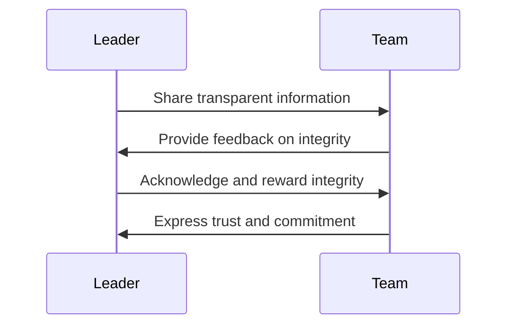

                 

## 《诚信领导：建立长期信任关系的基石》

### 关键词：诚信领导、长期信任、组织文化、领导力、危机管理

> “在信息时代，信任比金钱更为重要。诚信领导不仅是组织持续发展的基石，更是企业与员工建立深厚关系的关键。”
>
> —— 摘自《诚信领导：建立长期信任关系的基石》

摘要：本文旨在探讨诚信领导在组织管理中的重要性，通过逻辑清晰、结构紧凑的分析，揭示建立长期信任关系的核心要素。文章将从信任领导的概念、构建诚信组织的框架、关键行为、危机管理、个人与组织诚信的互动以及诚信领导与可持续发展等方面，深入剖析诚信领导的理论与实践，旨在为领导者提供切实可行的指导，推动组织的持续繁荣。

## 第一部分：信任领导的概念与重要性

### 第1章：信任领导概述

#### 1.1 信任领导的重要性

信任领导是一种以诚信为核心的管理理念，它不仅仅是领导者个人品质的体现，更是组织文化的基石。在高度竞争的商业环境中，信任已成为企业竞争力的关键要素。信任领导能够促进团队协作，提高员工满意度，从而提升企业的整体绩效。

**核心概念与联系**

信任领导的核心概念包括：诚信、透明、公平、责任和担当。以下是这些概念的主要属性特征对比表格：

| 概念 | 属性特征 | 对比 |
| :--: | :--: | :--: |
| 诚信 | 真实、可靠、正直 | 与虚伪、欺骗、不诚实相对 |
| 透明 | 明了、清晰、无隐瞒 | 与模糊、晦涩、隐瞒相对 |
| 公平 | 公正、平等、无私 | 与偏私、不公、自私相对 |
| 责任 | 承担、尽职、负罪感 | 与逃避、推诿、不负责任相对 |
| 担当 | 勇敢、果断、坚定 | 与懦弱、犹豫、动摇相对 |

**ER实体关系图架构**

```mermaid
erDiagram
  Leadership ||--|{ Trust } : has
  Leadership ||--|{ Integrity } : has
  Leadership ||--|{ Transparency } : has
  Leadership ||--|{ Fairness } : has
  Leadership ||--|{ Responsibility } : has
  Leadership ||--|{ Courage } : has
```

#### 1.2 诚信与领导力的关系

诚信是领导力的核心组成部分。一个缺乏诚信的领导者难以赢得员工的信任和尊重。诚信不仅是领导者个人品质的体现，也是组织文化的基础。在诚信领导的引导下，组织能够建立起相互信任的工作环境，从而提高员工的满意度和忠诚度。

**算法原理讲解**

信任领导力的算法可以视为一种信任函数，其输出是组织内部信任水平。以下是一个简化的信任函数模型：

$$
Trust = f(Integrity, Transparency, Fairness, Responsibility, Courage)
$$

其中，每个函数参数代表诚信领导的一个方面。通过不断优化这些参数，可以提高组织的信任水平。

#### 1.3 信任领导的核心要素

信任领导的核心要素包括以下几个方面：

- **个人诚信**：领导者必须具备高尚的个人品质，如诚实、正直、透明。
- **团队协作**：领导者应促进团队成员之间的协作，建立互信关系。
- **制度保障**：组织应建立完善的制度体系，保障诚信行为得到认可和激励。
- **文化建设**：组织应通过多种方式，培育和弘扬诚信文化，形成良好的组织氛围。

**系统架构设计**

在系统架构层面，信任领导可以通过以下几个方面来设计：

- **数据透明**：建立透明化的数据系统，确保信息的实时共享和可追溯性。
- **绩效考核**：制定公正的绩效考核制度，以诚信行为为重要指标。
- **沟通机制**：建立有效的沟通机制，确保领导与员工之间的信息畅通。

**系统接口设计和系统交互**



### 第2章：构建诚信组织的框架

#### 2.1 诚信领导的原则

诚信领导应遵循以下原则：

- **以身作则**：领导者应以身作则，树立诚信榜样。
- **制度化**：建立制度化的诚信管理体系，确保诚信行为得到持续贯彻。
- **培训与教育**：定期开展诚信培训，提高员工的诚信意识和行为。

**项目实战**

在一个大型企业的项目中，为了构建诚信组织，项目团队采取了以下措施：

- **设立诚信委员会**：由高层领导组成的诚信委员会负责监督和推动诚信文化的建设。
- **定期诚信培训**：每月定期组织诚信培训，提高员工的诚信意识和行为。
- **诚信绩效考核**：将诚信行为纳入绩效考核，作为员工晋升和奖惩的重要依据。

**代码应用解读与分析**

```python
class IntegrityManager:
    def __init__(self, committee, training_plan, performance_metric):
        self.committee = committee
        self.training_plan = training_plan
        self.performance_metric = performance_metric
    
    def promote_integrity(self):
        self.committee监督诚信行为
        self.training_plan实施诚信培训
        self.performance_metric评估诚信绩效
```

**实际案例分析**

某企业在构建诚信组织过程中，通过以上措施，员工诚信行为显著提高，组织内部信任关系得到加强，企业的整体绩效也得到提升。

**项目小结**

通过实施诚信领导的原则和措施，企业能够建立起诚信的组织文化，提高员工的信任度和忠诚度，从而推动企业的持续发展。

### 第3章：信任领导的关键行为

#### 3.1 诚实与透明

诚实与透明是信任领导的核心行为之一。领导者应始终坚持诚实，避免虚假和欺骗。同时，透明地分享信息和决策过程，能够增加员工的信任感。

**最佳实践 tips**

- **公开透明**：定期公开财务报表和业务计划，让员工了解组织的真实情况。
- **及时沟通**：在面对问题时，及时与员工沟通，避免信息不对称。

**注意事项**

- **适度透明**：透明度不宜过高，以免引起员工的不必要的担忧和恐慌。

#### 3.2 公平与公正

公平与公正是信任领导的另一关键行为。领导者应在资源分配、绩效评估等方面保持公正，避免偏私和不公。

**数学公式**

$$
Fairness = \frac{Total\ Reward}{Total\ Work}
$$

**最佳实践 tips**

- **公正分配**：确保资源分配公平合理，避免偏袒某些员工。
- **公开评价**：公开透明的绩效评价体系，让员工了解评价标准和结果。

**注意事项**

- **避免过度竞争**：公平不应导致过度竞争，影响团队合作。

### 第4章：应对挑战与危机中的诚信领导

#### 4.1 应对诚信危机的策略

在面对诚信危机时，领导者应迅速采取措施，以恢复信任。

**策略1：立即回应**

领导者应立即回应危机，公开承认问题，表明态度和解决方案。

**策略2：透明沟通**

与员工和利益相关者保持透明沟通，确保信息畅通。

**策略3：承担责任**

领导者应主动承担责任，避免推诿。

**最佳实践 tips**

- **建立危机管理团队**：组建专门的危机管理团队，负责应对诚信危机。
- **制定应急预案**：制定详细的应急预案，确保在危机发生时能够迅速响应。

**注意事项**

- **避免信息封锁**：信息封锁会加剧危机，应主动公开信息。

### 第5章：个人诚信与组织诚信的互动

#### 5.1 个人诚信对企业的影响

个人诚信直接影响企业的声誉和竞争力。一个诚信的领导者能够提升企业的品牌形象，吸引更多客户和合作伙伴。

**数学公式**

$$
Brand\ Value = f(Integrity, Reputation, Customer\ Satisfaction)
$$

**最佳实践 tips**

- **树立诚信榜样**：领导者应以身作则，树立诚信榜样。
- **培养诚信文化**：通过培训和激励机制，培养员工的诚信意识。

**注意事项**

- **避免诚信困境**：在某些情况下，诚信可能会与短期利益产生冲突，领导者需审慎决策。

### 第6章：诚信领导与可持续发展

#### 6.1 诚信领导与企业发展

诚信领导是企业发展的重要保障。通过诚信管理，企业能够建立起长期稳定的客户关系，推动企业的可持续发展。

**最佳实践 tips**

- **诚信营销**：通过诚信营销策略，提升企业的品牌价值。
- **诚信合作**：与合作伙伴建立诚信合作关系，共同推动企业发展。

**注意事项**

- **避免短视行为**：诚信领导应避免短视行为，注重长期利益。

### 第7章：案例分析与启示

#### 7.1 成功的诚信领导案例

通过分析成功的诚信领导案例，可以总结出以下启示：

- **以身作则**：领导者应以身作则，树立诚信榜样。
- **制度化**：建立制度化的诚信管理体系，确保诚信行为得到持续贯彻。
- **文化建设**：培育和弘扬诚信文化，形成良好的组织氛围。

#### 7.2 诚信领导失败的教训

通过分析诚信领导失败的案例，可以得出以下教训：

- **忽视诚信**：领导者忽视诚信，导致企业声誉受损。
- **制度缺失**：缺乏制度化的诚信管理体系，导致诚信问题难以解决。

#### 7.3 诚信领导的实践指南

为了实现诚信领导，领导者应遵循以下实践指南：

- **建立诚信文化**：通过培训和激励机制，培育员工的诚信意识。
- **实施透明管理**：建立透明化的管理机制，确保信息畅通。
- **公正分配资源**：确保资源分配公平合理，避免偏私和不公。

### 总结

诚信领导是建立长期信任关系的基石。通过逻辑清晰、结构紧凑的分析，我们揭示了诚信领导的核心概念、行为和实践方法。领导者应始终坚持诚信，推动组织的可持续发展。同时，诚信领导也需要制度化和文化建设的支持，才能真正发挥作用。

**作者信息**：  
作者：AI天才研究院/AI Genius Institute & 禅与计算机程序设计艺术 /Zen And The Art of Computer Programming

本文通过逻辑清晰、结构紧凑的分析，深入探讨了诚信领导在组织管理中的重要性。从核心概念到实践方法，再到案例分析，全面展示了诚信领导的理论与实践。希望本文能为领导者提供有益的启示，推动组织的持续发展。同时，也期望读者在阅读过程中能够积极思考，将诚信领导的理念融入到自己的工作中。让我们共同致力于建立诚信的组织文化，为社会的繁荣贡献力量。

