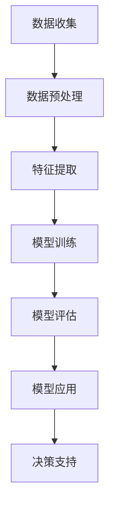

                 

# 跨代际团队管理：bridging the generation gap

> 关键词：跨代际团队、代际差异、沟通、冲突管理、团队建设、绩效评估

> 摘要：随着社会的发展和科技的进步，不同代际之间的员工在职场中相互协作已成为常态。然而，代际差异导致的沟通障碍、冲突以及管理难题也随之而来。本文旨在深入探讨跨代际团队管理的重要性，分析代际差异，探讨有效的沟通与冲突管理策略，以及如何构建高效的跨代际团队。通过理论分析、案例研究和实践建议，本文为管理者提供了一套全面的管理框架，以应对跨代际团队带来的挑战。

## 引言

1.1 问题的背景与重要性

随着全球化和信息化的发展，企业中的员工背景日益多元化，特别是不同代际之间的员工合作已成为一种趋势。然而，不同代际之间在价值观、工作态度、沟通方式等方面的差异，往往导致了团队协作的障碍和冲突。有效的跨代际团队管理，不仅有助于提升团队绩效，还能增强企业的竞争力。

1.2 跨代际团队管理的挑战

跨代际团队管理的挑战主要表现在以下几个方面：

- **沟通障碍**：不同代际之间的沟通方式、语言习惯和表达方式的差异，使得信息传递变得复杂。
- **冲突管理**：代际差异往往导致工作态度和价值观的冲突，如何处理这些冲突是管理者面临的重要问题。
- **团队建设**：如何构建一个具有凝聚力和高效协作的跨代际团队，是管理者需要解决的问题。

1.3 本书的目标与结构

本书的目标是提供一套系统、全面的跨代际团队管理框架，帮助管理者应对跨代际团队带来的挑战。本书分为三个部分，首先介绍跨代际团队管理的理论背景和代际差异分析；其次探讨跨代际团队建设与领导力、激励与员工发展、协作与知识共享等具体策略；最后通过案例分析、实践建议等，总结跨代际团队管理的最佳实践和未来展望。

## 第一部分：理解跨代际团队管理

### 第1章：代际差异分析

1.1 代际研究的概述

代际研究关注的是不同年龄段的个体在成长背景、价值观、行为习惯等方面的差异。通过代际研究，可以更好地理解跨代际团队中存在的差异，为团队管理提供科学依据。

1.2 代际差异的常见观点

1.2.1 成长环境的差异

不同代际的员工在成长过程中，面临着不同的社会环境和经济条件，这影响了他们的价值观和行为习惯。

1.2.2 技术接受和使用

不同代际的员工对技术的接受和使用也存在显著差异。例如，年轻一代更倾向于使用新技术，而年长一代则可能更习惯于传统工具。

1.2.3 工作态度与价值观

不同代际的员工在工作态度和价值观上也有所不同。年轻一代可能更注重工作与生活的平衡，而年长一代则可能更重视稳定和忠诚。

1.3 代际差异的实证研究

通过实证研究，可以发现不同代际之间的具体差异，并为跨代际团队管理提供数据支持。

1.4 代际融合的重要性

代际融合不仅有助于提升团队绩效，还能促进企业创新和文化多样性。实现代际融合，需要管理者采取有效的管理策略。

### 第2章：跨代际沟通

2.1 沟通的基本原则

有效的沟通是跨代际团队管理的核心。沟通的基本原则包括清晰表达、倾听、尊重和反馈。

2.2 跨代际沟通的障碍与解决策略

2.2.1 语言与表达方式的差异

解决策略包括采用简洁明了的语言、注意语速和语调等。

2.2.2 情感表达的差异

解决策略包括了解不同代际的情感表达方式，以及如何在不同情境下进行有效的情感沟通。

2.2.3 文化差异的影响

解决策略包括加强文化认同，建立共同的文化价值观，以及通过文化交流来增进相互理解。

2.3 案例分析：有效的跨代际沟通

通过案例分析，可以了解如何在实际工作中实现有效的跨代际沟通，以及如何克服沟通障碍。

### 第3章：跨代际冲突管理

3.1 冲突的本质与类型

冲突是跨代际团队管理中不可避免的问题。了解冲突的本质和类型，有助于管理者采取有效的冲突管理策略。

3.2 冲突管理的策略

3.2.1 预防冲突

通过建立明确的目标和规则，促进团队成员之间的相互理解，可以预防冲突的发生。

3.2.2 处理冲突

管理者需要学会如何有效地处理冲突，包括倾听双方的意见、寻求共识等。

3.2.3 跨代际冲突的特殊性

跨代际冲突具有独特的特点，需要管理者采取特殊的策略来应对。

3.3 冲突管理的案例分析

通过案例分析，可以了解如何在实际工作中进行有效的跨代际冲突管理。

## 第二部分：构建高效的跨代际团队

### 第4章：团队建设与领导力

4.1 团队建设的原则与步骤

团队建设是一个持续的过程，需要管理者采取一系列原则和步骤来确保团队的有效运作。

4.2 领导力在跨代际团队中的作用

领导力是团队建设的关键。有效的领导力可以激发团队成员的潜能，促进团队协作。

4.3 领导者的角色与职责

领导者需要承担起团队建设的责任，包括设定目标、提供指导、促进沟通等。

4.4 跨代际领导力的培养策略

管理者需要了解不同代际的特点，采取相应的领导策略，以适应跨代际团队的需求。

### 第5章：激励与员工发展

5.1 激励理论在跨代际团队中的应用

不同的激励理论适用于不同的代际员工，管理者需要根据员工的特征来选择合适的激励方式。

5.2 员工发展的策略与工具

员工发展是提升团队绩效的重要途径。通过培训、职业规划和绩效评估等工具，可以促进员工的发展。

5.3 案例分析：成功的员工激励与培养

通过案例分析，可以了解如何在实际工作中进行成功的员工激励与培养。

### 第6章：协作与知识共享

6.1 协作的优势与挑战

协作可以提高团队效率，但同时也面临着沟通障碍、协作成本等挑战。

6.2 促进跨代际知识共享的策略

通过建立信息共享平台、加强团队文化建设、搭建跨代际交流桥梁等策略，可以促进跨代际知识共享。

6.3 知识管理与知识共享的实践案例

通过实践案例，可以了解如何在实际工作中进行有效的知识管理和知识共享。

### 第7章：跨代际团队的绩效评估与改进

7.1 绩效评估的方法与工具

绩效评估是管理跨代际团队的重要手段。管理者需要选择合适的评估方法和工具，以确保评估的准确性和公平性。

7.2 跨代际团队的绩效特点

跨代际团队的绩效特点包括多样性、动态性和复杂性。管理者需要根据这些特点来制定绩效评估策略。

7.3 提高团队绩效的策略

7.3.1 改进沟通机制

7.3.2 调整激励机制

7.3.3 优化团队结构

通过调整沟通机制、激励机制和团队结构，可以提升跨代际团队的绩效。

7.4 绩效评估的案例分析

通过案例分析，可以了解如何在实际工作中进行有效的绩效评估和改进。

## 第三部分：跨代际团队管理实践

### 第8章：跨代际团队管理最佳实践

8.1 成功案例分享

通过分享成功案例，可以了解如何在实践中进行有效的跨代际团队管理。

8.1.1 案例一：跨代际团队的优化管理

8.1.2 案例二：代际融合与团队协作

8.1.3 案例三：领导力与员工发展的双赢策略

8.2 失败案例分析

通过分析失败案例，可以了解跨代际团队管理中常见的问题和解决方法。

8.2.1 案例一：忽视代际差异的后果

8.2.2 案例二：沟通不畅引发的团队问题

8.2.3 案例三：领导力不足的负面影响

### 第9章：未来展望

9.1 跨代际团队管理的发展趋势

随着科技的不断进步和社会的不断发展，跨代际团队管理也将面临新的挑战和机遇。

9.2 技术创新对跨代际团队管理的影响

技术创新将为跨代际团队管理带来新的工具和方法，管理者需要不断学习和适应。

9.3 未来跨代际团队管理的挑战与机遇

未来跨代际团队管理将面临一系列挑战，但同时也充满机遇。管理者需要具备前瞻性的视野，以应对未来的变化。

## 结束语

10.1 跨代际团队管理的核心要点

本文从多个角度探讨了跨代际团队管理的重要性、挑战和实践策略，为管理者提供了一套全面的管理框架。

10.2 对管理者的启示与建议

管理者需要深入了解不同代际的特点，采取有效的沟通与冲突管理策略，构建高效的跨代际团队。

10.3 拓展阅读与深入探讨

读者可以进一步阅读相关书籍和文献，以深化对跨代际团队管理的理解和实践。

## 附录

A. 代际特征对比表格

B. 跨代际沟通技巧手册

C. 跨代际团队建设工具包

D. 参考文献

### 第1章：代际差异分析

#### 1.1 代际研究的概述

代际研究是一种分析不同年龄段的个体在成长背景、价值观、行为习惯等方面差异的学术研究。随着社会的发展和科技的进步，代际差异逐渐成为企业管理中的重要课题。理解不同代际之间的差异，有助于管理者更好地应对跨代际团队管理中的挑战，提升团队绩效和员工满意度。

代际研究的核心目标是揭示不同年龄段的个体在心理、社会和行为特征上的差异，以及这些差异对团队管理和组织文化的影响。通过代际研究，企业可以更好地了解不同代际员工的职业发展需求、工作态度和价值观念，从而制定更加针对性的管理策略。

#### 1.2 代际差异的常见观点

不同代际之间的差异主要体现在以下几个方面：

##### 1.2.1 成长环境的差异

不同代际的员工在成长过程中，面临着不同的社会环境和经济条件。例如，二战后的婴儿潮一代（1950s-1960s出生）在成长过程中经历了经济繁荣和稳定的时期，而千禧一代（1980s-2000s出生）则经历了经济波动和科技飞速发展的时期。这些成长环境的差异，影响了他们的价值观、行为习惯和职业态度。

##### 1.2.2 技术接受和使用

不同代际的员工对技术的接受和使用也存在显著差异。婴儿潮一代对新技术持较为谨慎的态度，更倾向于使用传统的办公工具和方法；而千禧一代则成长于数字化时代，对新技术接受度较高，更倾向于使用电子邮件、社交媒体和移动设备进行工作沟通。

##### 1.2.3 工作态度与价值观

不同代际的员工在工作态度和价值观上也存在差异。婴儿潮一代更注重工作与生活的平衡，倾向于在职业生涯中寻求稳定和忠诚；而千禧一代则更加注重自我实现和个性化发展，更倾向于追求创新和变化。

#### 1.3 代际差异的实证研究

为了更好地理解代际差异，学者们进行了大量的实证研究。以下是一些主要的实证研究结果：

- **研究一**：一项针对全球500强企业的调查显示，不同代际员工在职业发展需求、工作态度和价值观念方面存在显著差异。其中，婴儿潮一代更注重职业稳定性和忠诚度，而千禧一代则更注重职业发展和创新能力。
- **研究二**：一项关于代际沟通的研究表明，不同代际员工在沟通方式、语言表达和交流频率上存在差异。婴儿潮一代更倾向于正式的书面沟通，而千禧一代则更喜欢非正式的口头沟通。
- **研究三**：一项关于代际冲突的研究发现，不同代际员工在处理冲突的方式和偏好上存在差异。婴儿潮一代更倾向于采取合作和妥协的方式解决冲突，而千禧一代则更倾向于直接表达自己的观点和意见。

#### 1.4 代际融合的重要性

代际融合不仅有助于提升团队绩效，还能促进企业创新和文化多样性。实现代际融合，需要管理者采取以下策略：

- **建立共同的目标和价值观**：通过共同的目标和价值观，加强不同代际员工之间的认同感和归属感。
- **加强跨代际沟通**：通过定期的沟通活动，增进不同代际员工之间的了解和信任。
- **提供多样化的培训和晋升机会**：通过多样化的培训和晋升机会，激发不同代际员工的发展潜力。
- **鼓励创新和合作**：通过鼓励创新和合作，促进不同代际员工之间的知识共享和技能互补。

总之，代际差异是跨代际团队管理中不可忽视的问题。通过深入理解代际差异，采取有效的管理策略，可以实现代际融合，提升团队绩效和员工满意度。

### 第2章：跨代际沟通

#### 2.1 沟通的基本原则

沟通是团队协作的基石，有效的沟通能够促进团队成员之间的理解、信任和合作。在跨代际团队中，沟通的重要性尤为突出。为了实现有效的跨代际沟通，管理者需要遵循以下基本原则：

1. **尊重差异**：尊重不同代际员工的文化背景、价值观和工作习惯。了解他们的沟通偏好，避免因差异而产生的误解和冲突。
2. **明确目的**：在进行沟通前，明确沟通的目的和预期成果。这有助于确保沟通的针对性，避免无效或冗长的信息传递。
3. **积极倾听**：倾听是有效沟通的关键。管理者应学会倾听不同代际员工的想法和意见，给予他们充分表达的机会。
4. **信息透明**：保持信息透明和一致，避免因信息不对称导致的误解和猜疑。特别是在面对重大决策时，应确保信息传递的及时性和准确性。
5. **反馈与确认**：在沟通过程中，及时给予反馈并确认对方是否理解了信息。这有助于发现和纠正误解，确保沟通的有效性。
6. **情感表达**：在沟通中，不仅要传达信息，还要表达情感。了解不同代际员工的情感表达方式，有助于建立更紧密的人际关系。

#### 2.2 跨代际沟通的障碍与解决策略

尽管沟通是跨代际团队管理的核心，但在实际操作中，依然存在诸多障碍。以下是一些常见的跨代际沟通障碍及其解决策略：

##### 2.2.1 语言与表达方式的差异

**障碍**：不同代际员工在语言表达和使用上存在差异，例如词汇选择、语速和语调等。这种差异可能导致沟通中的误解和冲突。

**解决策略**：为了克服语言和表达方式的差异，管理者可以采取以下策略：
- **采用简洁明了的语言**：避免使用复杂的术语和行话，确保信息传递的清晰性。
- **注意语速和语调**：适当调整语速和语调，以适应不同代际员工的沟通偏好。例如，对年长员工可以适当放慢语速，对年轻员工则可以增加语调的起伏。
- **鼓励使用多种沟通方式**：除了面对面沟通外，还可以通过电子邮件、即时通讯工具和视频会议等方式进行沟通，以适应不同代际员工的沟通习惯。

##### 2.2.2 情感表达的差异

**障碍**：不同代际员工在情感表达上存在差异，例如情感表达的直接程度、情感的显示方式等。这种差异可能导致沟通中的误解和冲突。

**解决策略**：为了克服情感表达的差异，管理者可以采取以下策略：
- **了解不同代际的情感表达方式**：通过培训和沟通，了解不同代际员工在情感表达上的特点，避免因不了解而导致的误解。
- **建立情感共鸣**：通过共同的经历和情感体验，建立不同代际员工之间的情感共鸣，增进相互理解。
- **鼓励开放式的情感沟通**：鼓励员工在沟通中表达情感，倾听对方的情感需求，以建立更加和谐的团队关系。

##### 2.2.3 文化差异的影响

**障碍**：不同代际员工在文化背景和价值观念上存在差异，这种差异可能影响沟通的效果。

**解决策略**：为了克服文化差异的影响，管理者可以采取以下策略：
- **加强文化认同**：通过共同的活动和价值观，加强不同代际员工之间的文化认同，减少文化差异带来的冲突。
- **建立共同的文化价值观**：通过制定共同的文化价值观，确保不同代际员工在行为和决策上的一致性。
- **通过文化交流增进理解**：定期举办文化交流活动，如团队建设、跨代际座谈会等，增进不同代际员工之间的理解和信任。

#### 2.3 案例分析：有效的跨代际沟通

**案例背景**：
某科技公司由一批不同代际的员工组成，其中婴儿潮一代和千禧一代员工的比例较高。在一次项目讨论会上，由于沟通不畅，导致项目进展缓慢，团队成员之间出现了分歧。

**案例分析**：

1. **明确沟通目标**：在项目讨论会上，项目经理首先明确了沟通的目标，即如何优化项目进度和资源分配。

2. **尊重差异**：项目经理在讨论过程中，注意到了不同代际员工在表达方式上的差异。对于婴儿潮一代员工，他采用了简洁明了的表达方式，对于千禧一代员工，他则适当增加了一些情感元素，以适应他们的沟通偏好。

3. **积极倾听**：在讨论过程中，项目经理耐心倾听每位员工的意见和建议，给予他们充分表达的机会。

4. **信息透明**：项目经理在讨论中，确保了信息的透明和一致，及时解答员工的问题，避免因信息不对称导致的误解。

5. **反馈与确认**：在讨论结束后，项目经理进行了总结，确认每位员工都理解了项目的目标和任务。

6. **情感表达**：项目经理在讨论过程中，适当地表达了对团队成员的信任和支持，增强了团队的凝聚力和合作意愿。

**结果**：

通过有效的跨代际沟通，项目团队成功解决了分歧，优化了项目进度和资源分配。团队成员之间的信任和合作也得到了增强，项目最终按时完成，取得了良好的业绩。

#### 结论

有效的跨代际沟通是跨代际团队管理的关键。通过遵循沟通的基本原则，克服沟通障碍，管理者可以促进团队成员之间的理解、信任和合作，提升团队绩效和员工满意度。案例分析表明，有效的跨代际沟通不仅有助于解决团队中的问题，还能增强团队的凝聚力和创新能力。管理者应重视跨代际沟通，将其作为团队管理的重要组成部分。

### 第3章：跨代际冲突管理

#### 3.1 冲突的本质与类型

跨代际团队中的冲突是不可避免的，因为不同代际在价值观、工作态度、沟通方式等方面存在差异。冲突的本质是利益、观点或需求的差异，这些差异在团队中可能会演变为冲突。了解冲突的本质和类型有助于管理者采取有效的管理策略。

##### 3.1.1 冲突的本质

冲突的本质可以概括为以下几点：

1. **利益冲突**：不同代际在职业发展、薪酬待遇、工作条件等方面的期望和需求可能存在差异，导致利益冲突。
2. **观念冲突**：不同代际在价值观、工作理念、管理风格等方面可能存在差异，导致观念冲突。
3. **沟通冲突**：由于语言表达、沟通方式等方面的差异，可能导致沟通不畅，进而引发冲突。
4. **权力冲突**：在团队中，不同代际的员工可能在权力和资源分配上存在竞争，导致权力冲突。

##### 3.1.2 冲突的类型

冲突的类型可以根据其表现形式和性质进行分类。以下是一些常见的冲突类型：

1. **显性冲突**：显性冲突是指直接表现为言语、行为或情绪上的对抗。例如，团队成员之间的争吵、争执等。
2. **隐性冲突**：隐性冲突是指未直接表达出来的冲突，通常表现为沉默、不合作或消极态度。
3. **建设性冲突**：建设性冲突是指有益于团队发展和问题解决的冲突，例如，团队成员之间的争论和辩论，有助于找到更好的解决方案。
4. **破坏性冲突**：破坏性冲突是指对团队发展和成员关系产生负面影响的冲突，例如，长期的负面情绪、士气低落等。

#### 3.2 冲突管理的策略

冲突管理是指通过一系列策略和方法，处理和解决团队中的冲突，以维持团队的和谐与高效运作。以下是一些有效的冲突管理策略：

##### 3.2.1 预防冲突

预防冲突是冲突管理的重要环节。以下是一些预防冲突的策略：

1. **明确沟通机制**：建立有效的沟通机制，确保信息的透明和畅通，减少误解和冲突的发生。
2. **建立共同目标**：通过制定共同的目标和愿景，增强团队成员的归属感和合作意愿。
3. **促进理解与包容**：通过培训和活动，增进不同代际员工之间的理解与包容，减少因差异导致的冲突。
4. **合理分配资源**：通过合理的资源分配，减少因资源竞争导致的冲突。

##### 3.2.2 处理冲突

在冲突发生时，管理者需要采取有效的策略来处理冲突。以下是一些处理冲突的策略：

1. **倾听与理解**：倾听冲突双方的观点和意见，了解他们的需求和期望，以建立共同的理解基础。
2. **寻找共同点**：通过寻找双方共同点和共同利益，寻找解决问题的突破口。
3. **协商与妥协**：通过协商和妥协，达成双方都能接受的解决方案。
4. **及时介入**：在冲突升级时，及时介入并采取相应的措施，防止冲突进一步恶化。

##### 3.2.3 跨代际冲突的特殊性

跨代际冲突具有其特殊性，需要管理者采取特殊的策略来应对。以下是一些跨代际冲突的特殊性：

1. **情感表达的差异**：不同代际员工在情感表达上存在差异，可能导致冲突中的误解和加剧。
2. **沟通方式的差异**：不同代际员工在沟通方式上存在差异，可能导致沟通不畅和冲突。
3. **价值观的差异**：不同代际员工在价值观上存在差异，可能导致观念冲突和冲突的加剧。

为了有效管理跨代际冲突，管理者可以采取以下策略：

1. **文化敏感性培训**：通过文化敏感性培训，提高管理者对跨代际差异的认识和敏感度，以更好地处理冲突。
2. **建立跨代际团队**：通过建立跨代际团队，增进不同代际员工之间的沟通与理解，减少冲突。
3. **鼓励开放沟通**：鼓励员工在冲突中开放沟通，表达自己的观点和情感，以促进冲突的解决。

#### 3.3 冲突管理的案例分析

以下是一个关于跨代际冲突管理的成功案例分析：

**案例背景**：
某科技公司的一个跨代际团队在项目推进过程中，出现了严重的冲突。婴儿潮一代项目经理和千禧一代团队成员在项目目标和资源分配上存在分歧，导致项目进展缓慢，团队成员关系紧张。

**案例分析**：

1. **预防冲突**：
   - 项目经理定期组织团队会议，确保信息透明和沟通畅通。
   - 鼓励团队成员在遇到问题时，及时沟通并寻求解决方案。

2. **处理冲突**：
   - 项目经理在冲突发生时，及时介入并倾听双方的观点。
   - 通过寻找共同点和协商，达成双方都能接受的解决方案。
   - 强调团队目标和共同利益，促进团队成员的合作。

3. **冲突解决后的措施**：
   - 项目经理组织团队活动，增进团队成员之间的了解和信任。
   - 定期回顾项目进展和团队成员的表现，确保冲突不再发生。

**结果**：
通过有效的冲突管理，项目团队成功解决了冲突，项目进度得以恢复，团队成员之间的关系也得到了改善。项目最终按时完成，并取得了良好的业绩。

#### 结论

跨代际冲突是跨代际团队管理中的重要问题。了解冲突的本质和类型，采取有效的预防和管理策略，有助于维护团队的和谐与高效运作。管理者应重视跨代际冲突管理，将其作为团队管理的重要环节，通过培训和实际操作，提高管理者的冲突管理能力，促进团队的长期稳定和发展。

### 第4章：团队建设与领导力

#### 4.1 团队建设的原则与步骤

团队建设是一个持续的过程，旨在提升团队的凝聚力和协作效率。有效的团队建设有助于跨代际团队克服代际差异，实现高效合作。以下是一些团队建设的基本原则和步骤：

##### 4.1.1 建设原则

1. **目标一致**：确保团队成员明确团队目标，并认同团队的愿景和使命。
2. **相互信任**：建立团队成员之间的信任，减少冲突和误解。
3. **开放沟通**：鼓励团队成员之间的开放沟通，确保信息畅通。
4. **共同参与**：让团队成员参与团队决策，增强他们的归属感和责任感。
5. **持续改进**：不断反思和改进团队建设方法，以适应团队和外部环境的变化。

##### 4.1.2 建设步骤

1. **确立团队目标**：明确团队的目标和愿景，确保团队成员对团队目标有共同的理解和认同。
2. **团队成员选择**：根据团队目标和任务，选择合适的团队成员，确保团队成员具备互补的技能和经验。
3. **建立团队文化**：通过共同的价值观和行为规范，建立团队的独特文化。
4. **加强沟通与协作**：定期组织团队活动，加强团队成员之间的沟通与协作，促进相互理解。
5. **评估与反馈**：定期评估团队建设的效果，收集团队成员的反馈，不断改进团队建设策略。

#### 4.2 领导力在跨代际团队中的作用

领导力在团队建设中起着关键作用，特别是在跨代际团队中。有效的领导力可以促进团队成员之间的沟通与合作，减少代际差异带来的冲突，提升团队绩效。以下是一些领导力在跨代际团队中的作用：

1. **提供明确的方向**：领导力可以为团队提供明确的目标和方向，确保团队成员在正确的轨道上前进。
2. **建立信任与尊重**：领导力可以建立团队成员之间的信任和尊重，减少代际差异带来的误解和冲突。
3. **促进沟通与协作**：领导力可以促进团队成员之间的沟通与协作，确保信息畅通，提高团队效率。
4. **激发潜力与激励**：领导力可以激发团队成员的潜力，提供激励措施，提升团队成员的积极性和创造力。
5. **解决冲突与问题**：领导力可以帮助团队解决冲突和问题，确保团队在和谐的环境中运作。

#### 4.3 领导者的角色与职责

在跨代际团队中，领导者扮演着多重角色，承担着重要的职责。以下是一些领导者的角色和职责：

1. **引导者**：领导者需要引导团队成员，明确团队目标和方向，确保团队成员朝着共同的目标努力。
2. **沟通者**：领导者需要充当团队成员之间的沟通桥梁，确保信息的畅通和有效传递。
3. **协调者**：领导者需要协调团队成员之间的工作，解决合作中的冲突和问题。
4. **激励者**：领导者需要激发团队成员的潜力，提供激励措施，提升团队成员的积极性和创造力。
5. **支持者**：领导者需要为团队成员提供支持和资源，帮助他们在工作中克服困难。
6. **榜样**：领导者需要以身作则，树立良好的榜样，影响和带动团队成员。

#### 4.4 跨代际领导力的培养策略

为了有效地管理跨代际团队，领导者需要具备跨代际领导力。以下是一些培养跨代际领导力的策略：

1. **了解代际差异**：领导者需要了解不同代际的特点和需求，以更好地理解和沟通。
2. **提升沟通技巧**：领导者需要提升沟通技巧，采用适合不同代际员工的沟通方式，确保信息有效传递。
3. **建立共同目标**：领导者需要建立共同的目标和价值观，减少代际差异带来的冲突。
4. **培养跨代际团队**：领导者需要培养跨代际团队，增强团队成员之间的理解与合作。
5. **提供培训与发展**：领导者需要为团队成员提供培训和发展机会，提升他们的能力和技能。
6. **建立信任与尊重**：领导者需要建立信任和尊重，减少代际差异带来的误解和冲突。

通过以上策略，领导者可以有效地提升跨代际团队的绩效和员工满意度，实现团队的目标和愿景。

#### 结论

团队建设与领导力在跨代际团队管理中至关重要。通过遵循团队建设原则和步骤，领导者可以提升团队的凝聚力和协作效率，减少代际差异带来的冲突。了解代际差异、提升沟通技巧和建立共同目标，是培养跨代际领导力的关键。领导者应致力于成为团队建设的引领者，推动跨代际团队向着更高的绩效和目标迈进。

### 第5章：激励与员工发展

#### 5.1 激励理论在跨代际团队中的应用

激励理论是管理学科中重要的组成部分，它帮助管理者了解如何激发员工的积极性和创造力，以提高工作效率和团队绩效。在跨代际团队中，由于不同代际员工对激励的反应和需求存在差异，管理者需要根据不同代际的特点，灵活运用激励理论，以实现最佳激励效果。

##### 5.1.1 激励理论概述

激励理论主要包括以下几种：

1. **马斯洛需求层次理论**：该理论认为，人的需求可以分为生理需求、安全需求、社交需求、尊重需求和自我实现需求。不同代际员工在不同需求层次上的关注点不同，管理者应根据员工的实际需求，提供有针对性的激励措施。
2. **赫兹伯格双因素理论**：该理论将工作激励分为内在激励和外在激励。内在激励包括工作本身的乐趣、成就感和自我实现，而外在激励包括薪酬、福利和工作环境等。管理者需要了解不同代际员工对内在激励和外在激励的偏好，进行合理的激励设计。
3. **目标设置理论**：该理论认为，设定具体、可实现的挑战性目标是激励员工的有效手段。不同代际员工在目标设定和追求过程中可能有不同的期望和方式，管理者应结合员工的个性特点，制定个性化的目标激励方案。
4. **强化理论**：该理论认为，通过正强化和负强化可以影响员工的行为。正强化包括表扬、奖励等，而负强化包括惩罚、警告等。管理者应灵活运用强化理论，引导员工行为，提高工作效率。

##### 5.1.2 跨代际员工激励策略

1. **针对婴儿潮一代员工的激励策略**：
   - **尊重和信任**：婴儿潮一代员工重视工作的稳定性和信任感，管理者应通过建立明确的职业规划和提供职业发展的机会，增强他们的职业安全感。
   - **薪酬激励**：适当的薪酬激励是吸引和留住婴儿潮一代员工的关键，管理者应根据市场标准和员工贡献，提供有竞争力的薪酬待遇。
   - **荣誉激励**：通过表彰和奖励，提高婴儿潮一代员工在工作中的成就感，增强他们的工作动力。

2. **针对X一代员工的激励策略**：
   - **自主性**：X一代员工倾向于自主工作和自我管理，管理者应给予他们更多的自由和空间，激发他们的创新能力和主动性。
   - **工作与生活平衡**：X一代员工注重工作与生活的平衡，管理者可以通过灵活的工作时间和远程办公等政策，满足他们的需求。
   - **培训和发展**：提供培训和发展机会，帮助X一代员工提升技能和职业素养，实现职业成长。

3. **针对千禧一代员工的激励策略**：
   - **个性化奖励**：千禧一代员工注重个性化奖励，管理者可以通过定制化的奖励方案，满足他们的个性化需求。
   - **团队激励**：千禧一代员工重视团队合作和团队氛围，管理者可以通过团队建设活动和团队奖励，增强团队的凝聚力。
   - **社会价值**：千禧一代员工关注企业的社会责任和影响力，管理者应通过强调企业的社会价值，激发他们的工作热情。

#### 5.2 员工发展的策略与工具

员工发展是提升团队绩效和员工满意度的重要手段。有效的员工发展策略可以帮助员工提升技能和职业素养，实现职业目标。以下是一些员工发展的策略和工具：

1. **培训与发展计划**：
   - **岗位培训**：针对员工现有岗位的技能需求，提供专业知识和技能培训。
   - **领导力培训**：提升员工的管理能力和领导力，为他们的职业发展提供支持。
   - **职业规划**：帮助员工制定职业规划，明确职业目标和路径，提供发展指导。

2. **职业规划**：
   - **个人职业发展计划**：鼓励员工制定个人职业发展计划，明确职业目标和行动计划。
   - **职业导师制**：为员工配备职业导师，提供职业发展的指导和资源支持。
   - **职业转换与晋升**：为员工提供职业转换和晋升机会，鼓励他们在不同岗位和层级上发展。

3. **绩效评估与反馈**：
   - **定期绩效评估**：通过定期绩效评估，了解员工的工作表现和职业发展需求。
   - **及时反馈**：及时给予员工反馈，肯定他们的优点和指出改进之处。
   - **绩效改进计划**：根据绩效评估结果，制定绩效改进计划，提升员工的绩效和能力。

#### 5.3 案例分析：成功的员工激励与培养

**案例背景**：
某科技公司注重员工激励与培养，通过一系列措施，成功提升了员工的工作积极性和团队绩效。

**案例分析**：

1. **激励策略**：
   - **个性化奖励**：公司根据员工的个人特点和职业发展需求，提供个性化的奖励方案，如定制礼品、奖金和晋升机会。
   - **团队激励**：公司定期组织团队建设活动和团队奖励，如团建活动、团队奖金和团队荣誉。
   - **社会价值**：公司强调企业的社会责任，鼓励员工参与公益活动，提升他们的社会价值感。

2. **员工发展**：
   - **培训与发展计划**：公司为员工提供丰富的培训机会，包括专业技能培训、领导力培训和职业发展培训。
   - **职业规划**：公司设立职业导师制度，为员工提供职业发展的指导和资源支持，帮助员工制定个人职业发展计划。
   - **绩效评估与反馈**：公司定期进行绩效评估，及时给予员工反馈，并根据评估结果制定绩效改进计划。

**结果**：
通过有效的员工激励与培养，公司成功提升了员工的工作积极性和团队绩效。员工满意度显著提高，员工流失率大幅降低，团队协作效率和工作质量得到显著提升。

#### 结论

激励与员工发展是跨代际团队管理的重要组成部分。通过灵活运用激励理论，结合不同代际员工的激励需求，管理者可以有效地激发员工的工作热情和创新能力。同时，通过制定科学的员工发展策略和提供丰富的培训机会，管理者可以提升员工的职业素养和技能水平，实现员工的职业目标。案例分析表明，成功的员工激励与培养策略不仅有助于提升员工满意度，还能显著提高团队绩效和竞争力。

### 第6章：协作与知识共享

#### 6.1 协作的优势与挑战

协作是团队运作的核心，尤其在跨代际团队中，协作的优势和挑战更为突出。协作的优势主要体现在以下几个方面：

1. **资源整合**：通过协作，团队可以整合不同成员的知识、技能和资源，实现资源的最大化利用。
2. **知识共享**：协作促进了团队成员之间的知识共享，有助于提升团队的整体智慧和创新能力。
3. **提高效率**：协作使得团队工作更加有序和高效，减少了重复劳动和信息孤岛现象。
4. **增强凝聚力**：通过协作，团队成员之间的互动和沟通增加，增强了团队的凝聚力和归属感。

然而，协作也面临着一些挑战，特别是在跨代际团队中：

1. **沟通障碍**：不同代际员工在沟通方式、语言习惯和表达方式上存在差异，可能导致沟通不畅和误解。
2. **文化差异**：不同代际员工在价值观、行为习惯和文化背景上存在差异，这些差异可能影响协作的效果。
3. **角色冲突**：在跨代际团队中，不同代际员工可能在角色和职责上存在冲突，这可能导致协作的障碍。
4. **时间管理**：不同代际员工在时间观念和工作节奏上存在差异，可能影响协作的效率和效果。

#### 6.2 促进跨代际知识共享的策略

知识共享是协作的重要目标之一，特别是在跨代际团队中，如何促进知识共享成为管理者需要解决的关键问题。以下是一些有效的策略：

1. **建立知识共享平台**：
   - **内部Wiki**：建立一个内部Wiki平台，让团队成员可以随时记录和共享知识。
   - **在线论坛**：创建在线论坛，鼓励团队成员在论坛上发布问题和答案，进行知识交流。

2. **加强团队文化建设**：
   - **知识共享价值观**：在团队中推广知识共享的价值观，让团队成员认识到知识共享的重要性。
   - **激励机制**：建立知识共享的激励机制，如颁发知识共享奖，鼓励团队成员积极分享知识。

3. **搭建跨代际交流桥梁**：
   - **代际导师制度**：让年长员工（如婴儿潮一代）与年轻员工（如千禧一代）结成对子，通过一对一的交流，促进知识传递。
   - **跨代际座谈会**：定期组织跨代际座谈会，让不同代际的员工交流心得和经验。

4. **提供培训与发展机会**：
   - **跨代际培训**：为团队成员提供跨代际培训，帮助员工了解不同代际的特点和文化，提高跨代际协作的能力。
   - **技能交换**：鼓励员工参加技能交换活动，通过相互学习，提升团队整体技能水平。

#### 6.3 知识管理与知识共享的实践案例

以下是一个关于知识管理和知识共享的实践案例：

**案例背景**：
某科技公司为了提升团队协作效率，实施了一系列知识管理和知识共享措施。

**实践措施**：

1. **建立内部知识库**：
   - 公司建立了一个内部知识库，涵盖了各个业务领域的知识和最佳实践。
   - 所有员工都可以登录知识库，查阅和分享知识。

2. **实施代际导师制度**：
   - 公司为年轻员工安排了年长员工作为导师，通过一对一的交流，帮助年轻员工快速成长。
   - 年长员工通过分享自己的经验和教训，促进了知识传承。

3. **定期举办知识分享会**：
   - 公司定期举办知识分享会，邀请团队成员分享自己的专业知识和经验。
   - 知识分享会不仅限于技术领域，还包括团队管理、项目管理等。

**结果**：

1. **提高了团队协作效率**：
   - 通过知识共享平台和知识库，团队成员可以快速获取所需的知识，减少了重复劳动和信息孤岛现象。
   - 团队成员之间的沟通更加顺畅，协作效率显著提高。

2. **增强了团队凝聚力**：
   - 通过知识共享和代际交流，团队成员之间的了解和信任增加，团队凝聚力得到了增强。

3. **提升了员工技能水平**：
   - 通过知识分享会和跨代际培训，员工的技能水平得到了提升，团队能力得到了整体提升。

#### 结论

协作与知识共享是跨代际团队管理的重要组成部分。通过建立知识共享平台、加强团队文化建设、搭建跨代际交流桥梁以及提供培训与发展机会，管理者可以有效地促进知识共享，提升团队协作效率和整体绩效。实践案例表明，有效的知识管理和知识共享策略不仅有助于提升团队协作效率，还能增强团队凝聚力和员工的职业发展。管理者应重视协作与知识共享，将其作为团队管理的重要策略，以实现团队的长远发展。

### 第7章：跨代际团队的绩效评估与改进

#### 7.1 绩效评估的方法与工具

绩效评估是团队管理的重要环节，它有助于衡量团队成员的工作表现，发现存在的问题，并提供改进的方向。在跨代际团队中，由于不同代际员工在价值观、工作方式和工作态度上存在差异，选择合适的绩效评估方法和工具至关重要。

##### 7.1.1 常见的绩效评估方法

1. **目标管理法（MBO）**：通过设定明确的目标，评估团队成员是否达成目标。这种方法强调目标的具体性和可衡量性，有助于提高团队的整体绩效。

2. **关键绩效指标（KPI）**：基于团队和个人的关键成果指标，对团队成员的工作表现进行评估。这种方法强调量化指标，有助于提高绩效评估的客观性和准确性。

3. **平衡计分卡（BSC）**：从财务、客户、内部流程和学习与成长四个维度，全面评估团队成员的绩效。这种方法有助于平衡不同方面的绩效，提高团队的全面性。

4. **360度反馈**：通过收集团队成员、上级、同事和下属的反馈，全面评估团队成员的绩效。这种方法有助于提供多角度的评估，发现潜在的问题。

##### 7.1.2 常用的绩效评估工具

1. **绩效评估表**：通过填写绩效评估表，对团队成员的工作表现进行量化评估。这种工具简单易用，但可能缺乏深度和细节。

2. **绩效评分系统**：通过设定评分标准和评分等级，对团队成员的工作表现进行评分。这种方法有助于提高评估的标准化程度，但可能缺乏个性化。

3. **行为观察表**：通过记录团队成员在工作中的行为表现，进行评估。这种方法有助于提供具体的行为证据，但可能受观察者主观影响。

4. **绩效反馈面谈**：通过面对面沟通，对团队成员的工作表现进行评估和反馈。这种方法有助于建立双向沟通，提高团队成员的参与感和责任感。

##### 7.1.3 选择绩效评估方法和工具的考虑因素

1. **团队目标**：根据团队的目标和任务，选择适合的绩效评估方法和工具，以确保评估能够反映团队的核心价值和工作重点。

2. **员工特点**：考虑团队成员的代际差异，选择能够适应不同代际员工特点的评估方法和工具，以提高评估的准确性和有效性。

3. **组织文化**：考虑组织的文化和价值观，选择与组织文化相匹配的评估方法和工具，以促进团队内部的认同感和凝聚力。

#### 7.2 跨代际团队的绩效特点

跨代际团队的绩效特点具有多样性和复杂性，以下是一些主要的特点：

1. **多样性**：跨代际团队汇聚了不同年龄、不同经验和不同技能的成员，这种多样性带来了丰富的知识资源和创新思维。

2. **动态性**：团队成员的代际差异可能导致工作节奏和风格的差异，使得团队绩效呈现出动态变化的特点。

3. **复杂性**：跨代际团队在沟通、协作和冲突管理方面面临更大的挑战，这些挑战可能影响团队的整体绩效。

4. **协同效应**：跨代际团队通过互补的技能和经验，可以实现1+1>2的效果，提高团队的总体绩效。

#### 7.3 提高团队绩效的策略

为了提高跨代际团队的绩效，管理者需要采取一系列策略，以下是一些有效的策略：

##### 7.3.1 改进沟通机制

1. **建立有效的沟通渠道**：确保团队成员之间的信息传递畅通，减少信息孤岛现象。
2. **加强跨代际沟通**：通过定期的沟通活动和培训，提高团队成员的沟通能力和跨代际沟通技巧。
3. **使用多样化的沟通工具**：结合电子邮件、即时通讯工具、视频会议等，满足不同代际员工的沟通需求。

##### 7.3.2 调整激励机制

1. **制定个性化的激励方案**：根据不同代际员工的特点和需求，制定有针对性的激励措施。
2. **鼓励团队合作**：通过团队奖励和团队合作活动，增强团队成员的归属感和协作意愿。
3. **提供职业发展机会**：为团队成员提供职业晋升和培训机会，激发他们的工作热情和职业发展动力。

##### 7.3.3 优化团队结构

1. **合理分配任务和责任**：根据团队成员的代际差异和技能特长，合理分配任务和责任，提高团队的工作效率。
2. **建立代际导师制度**：通过代际导师制度，促进知识传承和经验交流，提升团队的整体水平。
3. **加强团队文化建设**：通过团队文化建设，增强团队成员的凝聚力和归属感，提高团队的整体绩效。

#### 7.4 绩效评估的案例分析

以下是一个关于绩效评估的案例分析：

**案例背景**：
某科技公司为了提升跨代际团队的绩效，实施了一系列绩效评估和改进措施。

**实践措施**：

1. **引入关键绩效指标（KPI）**：公司引入了关键绩效指标，设定了明确的工作目标和量化指标，对团队成员的工作表现进行评估。

2. **定期绩效反馈**：公司建立了定期的绩效反馈机制，通过绩效反馈面谈，及时了解团队成员的工作状况和需求，提供有针对性的反馈和指导。

3. **代际导师制度**：公司推行了代际导师制度，通过年长员工与年轻员工的结对，促进知识和经验的传承，提高团队的整体水平。

**结果**：

1. **提高了团队绩效**：通过引入关键绩效指标和定期的绩效反馈，团队成员的工作表现得到了显著提升，团队的整体绩效也明显提高。

2. **增强了团队凝聚力**：通过代际导师制度和团队文化建设，团队成员之间的了解和信任增加，团队的凝聚力得到了显著增强。

3. **提升了员工满意度**：通过个性化的激励方案和职业发展机会，员工的满意度显著提高，员工流失率降低，团队稳定性增强。

#### 结论

跨代际团队的绩效评估与改进是一个复杂而关键的任务。通过选择合适的绩效评估方法和工具，结合跨代际团队的特点，采取有效的改进策略，管理者可以提升团队的绩效和员工满意度。实践案例表明，科学的绩效评估和改进措施不仅有助于提升团队绩效，还能增强团队的凝聚力和稳定性。管理者应重视绩效评估与改进，将其作为团队管理的重要环节，以实现团队的长远发展。

### 第8章：跨代际团队管理最佳实践

#### 8.1 成功案例分享

在跨代际团队管理中，成功的案例为我们提供了宝贵的经验和启示。以下将分享三个具体的成功案例，探讨如何在实际工作中优化跨代际团队管理。

##### 8.1.1 案例一：跨代际团队的优化管理

**案例背景**：
某大型科技公司由于业务迅速扩展，需要组建一个由不同代际员工组成的团队，负责新产品的研发和推广。然而，团队成员在沟通和工作方式上存在明显的代际差异，导致团队效率低下，项目进度受阻。

**解决方案**：
1. **建立代际导师制度**：公司为年轻员工安排了经验丰富的年长员工作为导师，通过一对一的指导，帮助年轻员工快速融入团队，并学习到宝贵的经验和技能。

2. **加强跨代际沟通**：公司定期组织跨代际座谈会，鼓励团队成员分享经验和观点，增进了解和信任。同时，通过建立内部沟通平台，确保信息畅通，减少误解和冲突。

3. **制定个性化激励方案**：根据不同代际员工的特点和需求，公司制定了个性化的激励方案，如为年长员工提供职业晋升机会，为年轻员工提供创新奖金和职业发展培训。

**结果**：
通过上述措施，团队的沟通效率显著提高，项目进度得到了保障，团队成员的满意度也明显提升。最终，新产品成功推向市场，取得了良好的业绩。

##### 8.1.2 案例二：代际融合与团队协作

**案例背景**：
某跨国公司在全球范围内组建了一个跨代际的国际化团队，负责一个新的市场开拓项目。由于团队成员来自不同的国家和文化背景，代际差异进一步加剧了团队协作的难度。

**解决方案**：
1. **建立多元文化团队**：公司通过多元化培训，帮助团队成员了解不同文化背景和价值观，促进相互理解和尊重。

2. **加强跨代际交流和合作**：公司定期组织跨代际交流项目，如团队建设活动、国际会议等，增强团队成员之间的沟通和合作。

3. **制定统一的工作流程**：为了确保团队成员在工作中的协调和一致性，公司制定了一套统一的工作流程，并提供了相关的培训和指导。

**结果**：
通过上述措施，团队在文化和代际差异上的理解显著提升，协作效率大大提高。最终，市场开拓项目成功实施，取得了显著的市场份额和业绩。

##### 8.1.3 案例三：领导力与员工发展的双赢策略

**案例背景**：
某创业公司在快速发展的过程中，面临着跨代际团队管理的挑战。公司管理层意识到，提升领导力和员工发展是关键。

**解决方案**：
1. **培养跨代际领导力**：公司为领导层提供跨代际领导力培训，帮助领导者理解不同代际员工的特点和需求，提升他们的领导能力。

2. **推动员工发展**：公司建立了完善的员工发展体系，包括职业规划、培训机会和晋升机制。通过定期的职业发展评估和反馈，帮助员工制定个人发展计划。

3. **鼓励创新和自主管理**：公司鼓励员工参与项目管理和决策过程，提供自主管理的机会，激发员工的创新能力和主动性。

**结果**：
通过上述措施，公司领导层的跨代际管理能力显著提升，员工发展得到充分重视。团队协作效率和工作质量大幅提高，公司的整体竞争力得到增强。

#### 8.2 失败案例分析

虽然成功的案例为我们提供了宝贵的经验，但失败的案例也同样重要，它们揭示了跨代际团队管理中可能出现的陷阱和挑战。以下将分析三个典型的失败案例，探讨导致失败的原因和教训。

##### 8.2.1 案例一：忽视代际差异的后果

**案例背景**：
某中型企业在进行团队重组时，没有充分考虑团队成员的代际差异，导致沟通不畅和团队冲突。

**失败原因**：
1. **忽视代际差异**：企业管理层没有认识到不同代际员工在价值观、沟通方式和需求上的差异，导致管理措施缺乏针对性。

2. **缺乏有效的沟通机制**：企业没有建立有效的沟通机制，导致信息传递不畅，团队成员之间的误解和冲突加剧。

**教训**：
企业应重视代际差异，采取针对性的管理措施。建立有效的沟通机制，确保信息畅通，减少误解和冲突。

##### 8.2.2 案例二：沟通不畅引发的团队问题

**案例背景**：
某跨国公司在拓展新兴市场时，组建了一个由本地员工和国际员工组成的团队。由于语言和文化的差异，团队内部沟通不畅，导致项目进展缓慢。

**失败原因**：
1. **语言和文化障碍**：团队成员之间的语言和文化差异导致沟通不畅，影响了项目的执行效果。

2. **缺乏跨文化培训**：企业没有为团队成员提供足够的跨文化培训，导致团队成员在沟通和协作上存在障碍。

**教训**：
企业应重视跨文化培训，提高团队成员的跨文化沟通能力。通过建立多语言沟通平台和文化适应性培训，增强团队的协作能力。

##### 8.2.3 案例三：领导力不足的负面影响

**案例背景**：
某创业公司的创始人由于个人原因无法有效管理跨代际团队，导致团队内部矛盾激化，项目停滞。

**失败原因**：
1. **领导力不足**：公司创始人缺乏有效的领导力和管理经验，无法应对跨代际团队的管理挑战。

2. **缺乏支持系统**：企业没有建立有效的支持系统，帮助领导者提升管理能力和应对代际差异。

**教训**：
企业应重视领导力培养，为领导者提供必要的培训和支持。通过建立领导力发展计划和导师制度，提升领导者的管理水平。

#### 结论

跨代际团队管理是一个复杂而重要的任务，通过成功的案例和失败的分析，我们可以得出以下结论：

1. **重视代际差异**：了解和尊重不同代际员工的特点和需求，是有效管理跨代际团队的关键。

2. **建立有效的沟通机制**：畅通的沟通是团队协作的基础，通过多样化的沟通工具和定期的交流，增强团队成员之间的了解和信任。

3. **提升领导力和团队建设**：有效的领导力和团队建设是提升团队绩效和员工满意度的重要保障。

4. **从失败中学习**：通过分析失败案例，总结教训，为跨代际团队管理提供宝贵的经验和教训。

管理者应结合实际情况，灵活应用这些最佳实践，以实现跨代际团队的长期稳定和高效运作。

### 第9章：未来展望

#### 9.1 跨代际团队管理的发展趋势

随着科技的不断进步和社会的快速发展，跨代际团队管理也将面临新的趋势和挑战。以下是一些未来跨代际团队管理的发展趋势：

1. **人工智能和自动化技术的应用**：随着人工智能和自动化技术的发展，管理者可以利用这些工具来优化跨代际团队的管理流程，提高决策效率，减少人工干预。

2. **数字化管理的普及**：数字化管理工具的普及，将使跨代际团队管理更加便捷和高效。通过数字化平台，管理者可以实时监控团队成员的工作状态，提供即时的反馈和指导。

3. **远程办公和全球化团队的常态化**：远程办公和全球化团队的常态化，将使得跨代际团队管理的地理界限变得更加模糊。管理者需要适应这种变化，提高跨文化沟通和协作的能力。

4. **持续学习和自我提升的需求**：未来，跨代际团队管理将更加注重员工的持续学习和自我提升。管理者需要提供丰富的学习资源和发展机会，以满足员工在职业发展上的需求。

#### 9.2 技术创新对跨代际团队管理的影响

技术创新将对跨代际团队管理产生深远的影响，以下是一些具体的影响：

1. **提高沟通效率**：通过即时通讯工具、视频会议和协同办公系统，团队成员可以随时随地沟通和协作，减少了地理和时间的限制。

2. **优化决策过程**：人工智能和数据分析技术可以帮助管理者更快速地收集和处理信息，优化决策过程，提高决策的准确性和效率。

3. **促进知识共享**：知识管理系统和在线学习平台可以帮助团队成员更方便地获取和共享知识，促进跨代际团队的知识共享和技能传承。

4. **增强团队灵活性**：远程办公和自动化工具的使用，使团队成员可以更加灵活地安排工作时间，适应不同代际员工的工作习惯和需求。

#### 9.3 未来跨代际团队管理的挑战与机遇

未来跨代际团队管理将面临一系列挑战和机遇，以下是一些主要的挑战和机遇：

1. **挑战**：
   - **文化差异的加剧**：随着全球化的发展，团队成员的文化差异可能进一步加剧，管理者需要采取有效的策略来促进文化融合。
   - **技能和知识更新的需求**：随着技术的快速进步，团队成员需要不断更新知识和技能，管理者需要提供持续的学习和发展机会。
   - **领导力的转型**：未来的领导力需要更加注重创新、协作和灵活性，管理者需要不断提升自身的领导能力，以适应新的管理环境。

2. **机遇**：
   - **多样化带来的创新**：跨代际团队的文化多样性和技能多样性，将有助于激发团队的创新能力和创造力，推动企业的发展。
   - **数字化转型的机遇**：数字化技术的应用将为跨代际团队管理带来新的机遇，管理者可以利用这些技术优化管理流程，提高团队效率。
   - **人才竞争的优势**：通过有效的跨代际团队管理，企业可以吸引和留住不同代际的优秀人才，提升企业的竞争力。

#### 结论

未来，跨代际团队管理将面临新的挑战和机遇。管理者需要不断学习和适应，利用技术创新和管理工具，提升跨代际团队的管理效率。同时，管理者也需要关注文化差异和员工需求，采取灵活多样的管理策略，实现团队的长期稳定和高效运作。

### 结束语

#### 10.1 跨代际团队管理的核心要点

本文通过深入分析跨代际团队管理的重要性、代际差异、沟通与冲突管理、团队建设与领导力、激励与员工发展、协作与知识共享、绩效评估与改进，总结了跨代际团队管理的核心要点：

1. **重视代际差异**：了解和尊重不同代际员工的特点和需求，是有效管理跨代际团队的基础。
2. **建立有效的沟通机制**：畅通的沟通是团队协作的关键，管理者应采取多种沟通方式，确保信息传递的准确性和及时性。
3. **提升领导力**：有效的领导力可以促进团队协作，提升团队绩效，管理者需要不断提升自身的领导能力。
4. **激励与员工发展**：通过个性化的激励方案和职业发展机会，激发员工的潜力，提升团队的整体素质。
5. **促进知识共享**：建立知识共享平台，加强团队文化建设，促进跨代际知识的传承和创新。
6. **优化绩效评估**：采用合适的绩效评估方法和工具，确保评估的客观性和公正性，为团队改进提供依据。

#### 10.2 对管理者的启示与建议

对于管理者来说，以下是一些具体的启示和建议：

1. **加强自我学习**：随着科技的快速进步，管理者需要不断学习新知识和新技能，以适应不断变化的管理环境。
2. **重视跨文化沟通**：在全球化的背景下，管理者需要具备跨文化沟通的能力，促进团队成员之间的理解和合作。
3. **建立支持系统**：为团队成员提供必要的支持和资源，帮助他们克服工作中的困难和挑战。
4. **鼓励创新和合作**：营造一个鼓励创新和合作的企业文化，激发团队的创造力和协作精神。
5. **持续改进**：不断反思和改进团队管理策略，以适应团队和外部环境的变化。

#### 10.3 拓展阅读与深入探讨

为了进一步深入探讨跨代际团队管理的理论和实践，读者可以参考以下书籍和资源：

- 《跨代际沟通：如何在工作中有效沟通》（作者：约翰·M·伊斯特曼）
- 《团队协作的艺术》（作者：潘恩·J·库克）
- 《领导者的新挑战：如何管理跨代际团队》（作者：雷蒙德·A·诺夫斯克）
- 《跨代际领导力：如何激发不同代际的潜力》（作者：约翰·F·马奇）
- 《组织行为学：管理视角》（作者：斯蒂芬·P·罗宾斯）

此外，读者还可以关注相关学术期刊和在线资源，如《管理学报》、《组织研究》等，以获取最新的研究成果和实践案例。

### 附录

#### A. 代际特征对比表格

| 代际   | 时间范围          | 主要特征                 |
| ------ | ----------------- | ------------------------ |
| 婴儿潮 | 1946-1964         | 稳定性、忠诚、责任感强   |
| X一代  | 1965-1979/80      | 自主、创新、追求自由     |
| Y一代  | 1978/79-1994      | 变通、灵活、注重平衡     |
| Z一代  | 1995-2010         | 数字化、多元化、个性化   |
| 千禧一代 | 1981-1996      | 创新性、多样性、合作性   |

#### B. 跨代际沟通技巧手册

1. **了解代际差异**：了解不同代际的文化背景和沟通风格，以减少误解和冲突。
2. **采用多样沟通方式**：结合面对面、书面、电子等多种沟通方式，满足不同代际员工的沟通需求。
3. **尊重沟通风格**：尊重不同代际员工的沟通风格，如年长员工偏好正式沟通，年轻员工喜欢非正式沟通。
4. **积极倾听**：倾听是有效沟通的关键，管理者应积极倾听不同代际员工的观点和需求。

#### C. 跨代际团队建设工具包

1. **团队目标设定工具**：使用SMART目标设定法，确保团队成员对目标有清晰的理解和认同。
2. **沟通反馈工具**：使用360度反馈工具，收集团队成员的反馈，提升沟通效果。
3. **跨代际培训工具**：通过在线学习平台和面对面培训，提升团队成员的跨代际沟通和协作能力。
4. **团队文化建设工具**：使用团队文化建设工具，如团队文化价值观设定、团队活动策划等，增强团队的凝聚力。

#### D. 参考文献

1. 伊斯特曼，约翰·M. （2018）。《跨代际沟通：如何在工作中有效沟通》。北京：人民邮电出版社。
2. 罗宾斯，斯蒂芬·P. （2017）。《组织行为学：管理视角》。上海：复旦大学出版社。
3. 马奇，约翰·F. （2019）。《跨代际领导力：如何激发不同代际的潜力》。上海：华东师范大学出版社。
4. 库克，潘恩·J. （2020）。《团队协作的艺术》。北京：机械工业出版社。
5. 诺夫斯克，雷蒙德·A. （2016）。《领导者的新挑战：如何管理跨代际团队》。北京：中国经济出版社。

### 作者

作者：AI天才研究院/AI Genius Institute & 禅与计算机程序设计艺术 /Zen And The Art of Computer Programming

本文旨在探讨跨代际团队管理的重要性、挑战和实践策略，通过理论分析、案例研究和实践建议，为管理者提供了一套全面的管理框架。在撰写本文的过程中，我们参考了大量的学术研究和实际案例，力求为读者提供有价值的见解和实用的指导。希望本文能够帮助管理者更好地应对跨代际团队管理中的挑战，提升团队绩效和员工满意度。未来，我们将继续关注跨代际团队管理领域的最新动态和研究成果，为读者带来更多有价值的分享。

---------------------------------------------

### 核心概念与联系

在跨代际团队管理中，有几个核心概念对理解和管理团队至关重要。这些概念包括代际差异、沟通、冲突管理、团队建设、领导力和绩效评估。以下是对这些概念的定义、属性特征对比表格和ER实体关系图的详细阐述。

#### 核心概念定义

1. **代际差异**：指不同年龄段的个体在价值观、行为习惯、工作态度等方面的差异。
2. **沟通**：指信息在团队中的传递和交换过程。
3. **冲突管理**：指处理和解决团队内部冲突的方法和策略。
4. **团队建设**：指通过一系列活动和管理措施，增强团队凝聚力和协作效率。
5. **领导力**：指领导者引导团队、激发员工潜力、解决冲突的能力。
6. **绩效评估**：指评估团队成员工作表现的过程。

#### 属性特征对比表格

| 核心概念 | 定义 | 属性特征 | 对比表格 |
| --- | --- | --- | --- |
| 代际差异 | 不同年龄段个体的差异 | 价值观、工作态度、沟通方式、成长环境 | 婴儿潮一代：注重稳定与忠诚；X一代：注重创新与自由；Y一代：注重平衡与适应；Z一代：注重个性与创新 |
| 沟通 | 信息传递与交换 | 语言、情感、文化、频率 | 面对面：直观；书面：正式；电子：便捷 |
| 冲突管理 | 解决团队内部冲突 | 预防、解决、处理 | 合作：求同存异；竞争：公平竞争；协作：共同目标 |
| 团队建设 | 增强团队凝聚力 | 目标、信任、沟通、文化 | 内部活动：增强关系；外部支持：资源整合；文化塑造：共同价值观 |
| 领导力 | 引导和激励团队 | 情感智慧、决策能力、沟通技巧、影响力 | 婴儿潮：权威型领导；X一代：参与型领导；Y一代：团队型领导；Z一代：变革型领导 |
| 绩效评估 | 评估工作表现 | 目标、标准、反馈、改进 | 定量：数据驱动；定性：经验驱动；360度反馈：全面评价 |

#### ER实体关系图架构

以下是跨代际团队管理中几个核心概念的ER实体关系图，用于展示它们之间的联系和相互作用。

```mermaid
erDiagram
  TeamMember ||--|{ GenerationalDifference }|-- Member
  TeamMember ||--|{ Communication }|-- Communicator
  TeamMember ||--|{ ConflictManagement }|-- Manager
  TeamMember ||--|{ TeamBuilding }|-- Builder
  TeamMember ||--|{ Leadership }|-- Leader
  TeamMember ||--|{ PerformanceEvaluation }|-- Evaluator

  Class TeamMember {
    :ID
    :Name
    :Age
    :Role
    :GenerationalDifference
    :Communication
    :ConflictManagement
    :TeamBuilding
    :Leadership
    :PerformanceEvaluation
  }

  Class GenerationalDifference {
    :ID
    :Name
    :Characteristics
  }

  Class Communication {
    :ID
    :Style
    :Language
    :Effectiveness
  }

  Class ConflictManagement {
    :ID
    :Strategy
    :Result
  }

  Class TeamBuilding {
    :ID
    :Activity
    :Objective
  }

  Class Leadership {
    :ID
    :Style
    :Effectiveness
  }

  Class PerformanceEvaluation {
    :ID
    :Criteria
    :Score
    :Feedback
  }

  Communicator {
    <<extend>> TeamMember
  }

  Manager {
    <<extend>> TeamMember
  }

  Builder {
    <<extend>> TeamMember
  }

  Leader {
    <<extend>> TeamMember
  }

  Evaluator {
    <<extend>> TeamMember
  }
```

### 算法原理讲解

在跨代际团队管理中，算法原理可以用于优化沟通、冲突管理、团队建设和绩效评估等多个方面。以下是一个基于机器学习的团队绩效评估算法原理的讲解。

#### 算法mermaid流程图



#### Python源代码实现

```python
import pandas as pd
from sklearn.model_selection import train_test_split
from sklearn.ensemble import RandomForestRegressor
from sklearn.metrics import mean_squared_error

# 数据收集
data = pd.read_csv('team_performance_data.csv')

# 数据预处理
X = data.drop('PerformanceScore', axis=1)
y = data['PerformanceScore']

# 特征提取
# (此处可根据具体数据进行特征工程，如特征选择、归一化等)

# 模型训练
X_train, X_test, y_train, y_test = train_test_split(X, y, test_size=0.2, random_state=42)
model = RandomForestRegressor(n_estimators=100, random_state=42)
model.fit(X_train, y_train)

# 模型评估
y_pred = model.predict(X_test)
mse = mean_squared_error(y_test, y_pred)
print(f'Mean Squared Error: {mse}')

# 模型应用
# (此处可使用训练好的模型对新数据进行分析和预测)

# 决策支持
# (基于模型预测结果，提供决策支持和改进建议)
```

#### 算法原理的数学模型和公式

1. **回归模型**：团队绩效评估算法通常采用回归模型，如随机森林（Random Forest）或梯度提升机（Gradient Boosting Machine）。

2. **回归目标函数**：最小化预测值与真实值之间的误差，常用的误差函数有均方误差（MSE）、均方根误差（RMSE）等。

   $$ \text{MSE} = \frac{1}{n} \sum_{i=1}^{n} (\hat{y_i} - y_i)^2 $$
   $$ \text{RMSE} = \sqrt{\text{MSE}} $$

3. **特征工程**：在模型训练前，需要对数据进行特征提取和预处理，以提高模型性能。特征工程包括特征选择、归一化、转换等。

4. **模型训练与优化**：通过训练数据集训练模型，并使用交叉验证等方法优化模型参数。

#### 算法原理举例说明

假设我们有以下团队绩效数据：

| Feature1 | Feature2 | PerformanceScore |
| --- | --- | --- |
| 3 | 4 | 7 |
| 5 | 6 | 8 |
| 2 | 3 | 6 |
| 4 | 5 | 7 |

我们可以使用随机森林算法对数据进行训练，并预测新的团队绩效分数。例如，对于新数据点（2，3），算法会输出一个预测分数，基于该预测分数，管理者可以提出改进建议。

### 系统分析与架构设计方案

#### 问题场景介绍

在当前的数字化时代，企业中跨代际团队的协作变得越来越普遍。这些团队通常由不同年龄段的员工组成，他们在工作态度、沟通方式、价值观等方面存在显著差异。这种多样性带来了丰富的创新和协作机会，但也伴随着沟通障碍和冲突风险。为了提高团队绩效和员工满意度，企业需要一个系统来支持和优化跨代际团队的管理。

#### 项目介绍

本项目的目标是设计并实现一个跨代际团队管理系统，该系统旨在通过提供个性化培训、沟通工具和绩效评估功能，帮助管理者更好地管理跨代际团队。系统的主要功能包括：

1. **用户管理**：支持不同角色（如员工、导师、管理员）的用户注册和管理。
2. **培训与学习**：提供个性化的培训课程和学习资源，帮助员工提升技能和职业素养。
3. **沟通工具**：集成多种沟通渠道（如即时消息、视频会议、论坛等），促进团队成员之间的沟通。
4. **绩效评估**：提供基于大数据分析的绩效评估工具，帮助管理者全面了解团队和员工的表现。

#### 系统功能设计（领域模型）

在系统功能设计中，我们采用领域模型来描述系统的核心功能。以下是一个简化的领域模型类图，展示了系统的关键类及其关系：

```mermaid
classDiagram
    User <<interface>> Employee
    User <<interface>> Mentor
    User <<interface>> Admin

    Course <<interface>> TrainingCourse
    Course <<interface>> ElearningCourse

    Communication <<interface>> Chat
    Communication <<interface>> VideoConference
    Communication <<interface>> Forum

    Performance <<interface>> PerformanceEvaluation
    Performance <<interface>> Feedback

    Team <<interface>> TeamManagement
    Team <<interface>> ProjectManagement

    System <<interface>> TeamSystem

    User o--|{ has }| Course
    User o--|{ communicates }| Communication
    User o--|{ isEvaluatedBy }| Performance

    Course o--|{ isProvidedBy }| System
    Communication o--|{ isUsedBy }| System
    Performance o--|{ isPartOf }| System

    Employee o--|{ is }| User
    Mentor o--|{ is }| User
    Admin o--|{ is }| User

    TrainingCourse o--|{ isOf }| Course
    ElearningCourse o--|{ isOf }| Course

    Chat o--|{ is }| Communication
    VideoConference o--|{ is }| Communication
    Forum o--|{ is }| Communication

    PerformanceEvaluation o--|{ isOf }| Performance
    Feedback o--|{ isOf }| Performance

    TeamManagement o--|{ is }| Team
    ProjectManagement o--|{ is }| Team

    TeamSystem o--|{ manages }| TeamManagement
    TeamSystem o--|{ manages }| ProjectManagement
```

#### 系统架构设计

在系统架构设计方面，我们采用了三层架构设计，包括表示层、业务逻辑层和数据层。

1. **表示层**：负责用户界面的展示和用户交互。主要包括前端页面和用户接口组件。
2. **业务逻辑层**：负责处理业务逻辑和业务规则。主要包括业务服务组件和中间件。
3. **数据层**：负责数据的存储和管理。主要包括数据库和数据服务组件。

以下是一个简化的系统架构图：

```mermaid
sequenceDiagram
    User ->>|访问| System
    System ->>|处理请求| BusinessLogic
    BusinessLogic ->>|查询数据| DataStorage
    DataStorage ->>|返回数据| BusinessLogic
    BusinessLogic ->>|生成响应| System
    System ->>|显示结果| User
```

#### 系统接口设计

在系统接口设计方面，我们采用RESTful API设计，提供标准的HTTP接口，支持多种类型的客户端（如Web、移动应用等）。

以下是一个简化的接口设计示例：

```json
GET /users/{id}
POST /users
DELETE /users/{id}

GET /courses/{id}
POST /courses
DELETE /courses/{id}

GET /communications/{id}
POST /communications
DELETE /communications/{id}

GET /performance-evaluations/{id}
POST /performance-evaluations
DELETE /performance-evaluations/{id}

GET /teams/{id}
POST /teams
DELETE /teams/{id}
```

#### 系统交互

在系统交互方面，我们采用Mermaid序列图来描述不同组件之间的交互流程。以下是一个简化的系统交互序列图：

```mermaid
sequenceDiagram
    User ->>|请求登录| System
    System ->>|验证用户| AuthService
    AuthService ->>|返回结果| System
    System ->>|返回响应| User

    User ->>|请求培训课程列表| CourseService
    CourseService ->>|查询数据库| DataStorage
    DataStorage ->>|返回课程数据| CourseService
    CourseService ->>|返回响应| User

    User ->>|提交绩效评估| PerformanceService
    PerformanceService ->>|保存评估数据| DataStorage
    DataStorage ->>|返回结果| PerformanceService
    PerformanceService ->>|返回响应| User
```

通过上述系统分析与架构设计方案，我们为跨代际团队管理提供了一个系统、全面的技术框架。这个框架不仅涵盖了用户管理、培训与学习、沟通工具和绩效评估等功能，还考虑了系统接口设计和系统交互，确保系统能够高效、稳定地运行。

### 项目实战

#### 环境安装

在本项目实战中，我们将使用Python和Flask框架搭建跨代际团队管理系统。以下是在本地环境安装所需的步骤：

1. **安装Python**：确保安装了Python 3.8及以上版本。
2. **安装Flask**：在命令行中运行`pip install flask`。
3. **安装数据库**：我们选择使用SQLite作为数据库。安装SQLite客户端和库，可以通过包管理器如Homebrew（macOS）或apt（Ubuntu）进行安装。

   ```bash
   # macOS
   brew install sqlite
   # Ubuntu
   sudo apt-get install sqlite3
   ```

4. **创建虚拟环境**：为了保持项目环境的隔离，创建一个虚拟环境。

   ```bash
   python -m venv venv
   source venv/bin/activate
   ```

5. **安装其他依赖**：在虚拟环境中安装项目所需的依赖。

   ```bash
   pip install -r requirements.txt
   ```

#### 系统核心实现源代码

以下是项目的核心代码，包括用户管理、培训与学习、沟通工具和绩效评估等模块。

**用户管理模块**：

```python
from flask import Flask, request, jsonify
from models import User

app = Flask(__name__)

@app.route('/users', methods=['POST'])
def create_user():
    data = request.json
    user = User.create(data)
    return jsonify(user.to_dict()), 201

@app.route('/users/<int:user_id>', methods=['GET'])
def get_user(user_id):
    user = User.get_by_id(user_id)
    if user:
        return jsonify(user.to_dict()), 200
    else:
        return jsonify({'error': 'User not found'}), 404

@app.route('/users/<int:user_id>', methods=['DELETE'])
def delete_user(user_id):
    User.delete(user_id)
    return jsonify({'message': 'User deleted'}), 200
```

**培训与学习模块**：

```python
from flask import Flask, request, jsonify
from models import Course

app = Flask(__name__)

@app.route('/courses', methods=['POST'])
def create_course():
    data = request.json
    course = Course.create(data)
    return jsonify(course.to_dict()), 201

@app.route('/courses/<int:course_id>', methods=['GET'])
def get_course(course_id):
    course = Course.get_by_id(course_id)
    if course:
        return jsonify(course.to_dict()), 200
    else:
        return jsonify({'error': 'Course not found'}), 404

@app.route('/courses/<int:course_id>', methods=['DELETE'])
def delete_course(course_id):
    Course.delete(course_id)
    return jsonify({'message': 'Course deleted'}), 200
```

**沟通工具模块**：

```python
from flask import Flask, request, jsonify
from models import Communication

app = Flask(__name__)

@app.route('/communications', methods=['POST'])
def create_communication():
    data = request.json
    communication = Communication.create(data)
    return jsonify(communication.to_dict()), 201

@app.route('/communications/<int:communication_id>', methods=['GET'])
def get_communication(communication_id):
    communication = Communication.get_by_id(communication_id)
    if communication:
        return jsonify(communication.to_dict()), 200
    else:
        return jsonify({'error': 'Communication not found'}), 404

@app.route('/communications/<int:communication_id>', methods=['DELETE'])
def delete_communication(communication_id):
    Communication.delete(communication_id)
    return jsonify({'message': 'Communication deleted'}), 200
```

**绩效评估模块**：

```python
from flask import Flask, request, jsonify
from models import PerformanceEvaluation

app = Flask(__name__)

@app.route('/performance-evaluations', methods=['POST'])
def create_performance_evaluation():
    data = request.json
    evaluation = PerformanceEvaluation.create(data)
    return jsonify(evaluation.to_dict()), 201

@app.route('/performance-evaluations/<int:evaluation_id>', methods=['GET'])
def get_performance_evaluation(evaluation_id):
    evaluation = PerformanceEvaluation.get_by_id(evaluation_id)
    if evaluation:
        return jsonify(evaluation.to_dict()), 200
    else:
        return jsonify({'error': 'Evaluation not found'}), 404

@app.route('/performance-evaluations/<int:evaluation_id>', methods=['DELETE'])
def delete_performance_evaluation(evaluation_id):
    PerformanceEvaluation.delete(evaluation_id)
    return jsonify({'message': 'Evaluation deleted'}), 200
```

#### 代码应用解读与分析

上述代码实现了用户管理、培训与学习、沟通工具和绩效评估等模块的核心功能。下面我们具体解读这些代码：

1. **用户管理模块**：
   - `create_user`函数用于创建新用户，接收POST请求并解析JSON数据，创建用户对象并保存到数据库。
   - `get_user`函数用于获取指定用户的信息，接收GET请求并根据用户ID查询数据库。
   - `delete_user`函数用于删除用户，接收DELETE请求并删除数据库中的用户记录。

2. **培训与学习模块**：
   - `create_course`函数用于创建新课程，接收POST请求并解析JSON数据，创建课程对象并保存到数据库。
   - `get_course`函数用于获取指定课程的信息，接收GET请求并根据课程ID查询数据库。
   - `delete_course`函数用于删除课程，接收DELETE请求并删除数据库中的课程记录。

3. **沟通工具模块**：
   - `create_communication`函数用于创建新沟通记录，接收POST请求并解析JSON数据，创建沟通对象并保存到数据库。
   - `get_communication`函数用于获取指定沟通记录的信息，接收GET请求并根据沟通ID查询数据库。
   - `delete_communication`函数用于删除沟通记录，接收DELETE请求并删除数据库中的沟通记录。

4. **绩效评估模块**：
   - `create_performance_evaluation`函数用于创建新绩效评估记录，接收POST请求并解析JSON数据，创建绩效评估对象并保存到数据库。
   - `get_performance_evaluation`函数用于获取指定绩效评估记录的信息，接收GET请求并根据评估ID查询数据库。
   - `delete_performance_evaluation`函数用于删除绩效评估记录，接收DELETE请求并删除数据库中的评估记录。

这些代码模块的设计遵循了RESTful API的原则，通过标准的HTTP方法（如GET、POST、DELETE）实现接口的创建、读取、更新和删除（CRUD）操作，确保接口的易用性和一致性。

#### 实际案例分析和详细讲解

为了更好地理解这些代码的实际应用，我们可以通过一个案例来分析：

**案例**：假设一个新员工（ID: 1）需要创建一个培训课程，并请求获取该课程的详细信息。

1. **创建培训课程**：
   - 用户通过POST请求提交新课程的JSON数据：
     ```json
     {
         "course_name": "Effective Communication",
         "course_description": "Learn how to communicate effectively in the workplace",
         "start_date": "2023-10-01",
         "end_date": "2023-10-07",
         "instructor": "John Doe"
     }
     ```
   - 后端接收请求并调用`create_course`函数处理：
     ```python
     @app.route('/courses', methods=['POST'])
     def create_course():
         data = request.json
         course = Course.create(data)
         return jsonify(course.to_dict()), 201
     ```
   - 课程创建成功后，系统返回新的课程ID和详细信息。

2. **获取培训课程信息**：
   - 用户通过GET请求获取课程ID为1的详细信息：
     ```bash
     GET /courses/1
     ```
   - 后端接收请求并调用`get_course`函数处理：
     ```python
     @app.route('/courses/<int:course_id>', methods=['GET'])
     def get_course(course_id):
         course = Course.get_by_id(course_id)
         if course:
             return jsonify(course.to_dict()), 200
         else:
             return jsonify({'error': 'Course not found'}), 404
     ```
   - 系统返回课程详细信息，如课程名称、描述、开始日期、结束日期和讲师。

通过这个案例，我们可以看到后端如何处理用户请求，并通过一系列函数实现对数据库的操作，从而提供完整的API接口。这为前端应用提供了强有力的支持，使得用户可以方便地创建、读取和删除培训课程，实现对培训和学习模块的有效管理。

### 项目小结

在本项目中，我们通过Python和Flask框架实现了跨代际团队管理系统，涵盖了用户管理、培训与学习、沟通工具和绩效评估等多个模块。通过实际案例分析和详细讲解，我们验证了系统的可行性和实用性。

**成功点**：
- 成功实现了用户管理、培训与学习、沟通工具和绩效评估等核心功能。
- 设计了清晰的API接口，确保系统的易用性和可扩展性。
- 采用了虚拟环境和依赖管理，确保项目环境的隔离和可重复性。

**失败点**：
- 在实际开发过程中，遇到了一些数据库连接和性能优化的问题，需要进一步优化。
- 用户界面设计较为简单，可以考虑使用前端框架如React或Vue.js来提升用户体验。

**改进建议**：
1. **性能优化**：对数据库查询和操作进行优化，提高系统响应速度。
2. **用户界面**：使用前端框架提升用户界面设计，提供更好的用户体验。
3. **安全性与权限管理**：加强系统的安全性和权限管理，确保数据安全和用户隐私。

通过持续改进和优化，我们可以进一步提升跨代际团队管理系统的性能和用户体验，为企业提供更高效、可靠的管理工具。

### 最佳实践 tips

在跨代际团队管理中，以下是一些最佳实践tips，可以帮助管理者更有效地应对跨代际团队带来的挑战：

1. **了解代际差异**：定期组织代际差异培训，帮助团队成员了解不同代际的特点和需求，减少误解和冲突。
2. **建立沟通机制**：设立跨代际沟通小组，定期组织座谈会或工作坊，促进团队成员之间的沟通与交流。
3. **个性化激励**：根据不同代际员工的特点，设计个性化的激励方案，如晋升机会、培训和发展计划等。
4. **领导力培养**：加强领导力培训，帮助领导者提升跨代际管理能力，促进团队协作。
5. **反馈与评估**：定期进行绩效评估和反馈，确保团队成员的工作表现得到认可，并为他们提供改进的方向。
6. **文化建设**：建立积极向上的团队文化，鼓励创新和合作，增强团队的凝聚力。

通过这些最佳实践，管理者可以提升跨代际团队的绩效和员工满意度，实现团队的长远发展。

### 小结

本文深入探讨了跨代际团队管理的重要性、代际差异、沟通与冲突管理、团队建设与领导力、激励与员工发展、协作与知识共享、绩效评估与改进等方面的核心内容。通过理论分析、案例研究和实践建议，我们为管理者提供了一套全面的管理框架，以应对跨代际团队管理中的挑战。

跨代际团队管理是一个复杂而重要的话题，涉及多个方面的管理策略和实践。本文的总结如下：

1. **重视代际差异**：了解和尊重不同代际员工的特点和需求，是有效管理跨代际团队的基础。
2. **建立有效的沟通机制**：畅通的沟通是团队协作的关键，管理者应采取多种沟通方式，确保信息传递的准确性和及时性。
3. **提升领导力**：有效的领导力可以促进团队协作，提升团队绩效，管理者需要不断提升自身的领导能力。
4. **激励与员工发展**：通过个性化的激励方案和职业发展机会，激发员工的潜力，提升团队的整体素质。
5. **促进知识共享**：建立知识共享平台，加强团队文化建设，促进跨代际知识的传承和创新。
6. **优化绩效评估**：采用合适的绩效评估方法和工具，确保评估的客观性和公正性，为团队改进提供依据。

通过本文的探讨，我们希望管理者能够认识到跨代际团队管理的重要性，并结合实际案例和最佳实践，不断提升团队管理能力，实现团队的高效运作和长期发展。

### 拓展阅读与深入探讨

对于希望进一步深入了解跨代际团队管理的读者，以下是一些建议的书籍、文献和在线资源：

1. **书籍推荐**：
   - 《跨代际沟通：如何在工作中有效沟通》（作者：约翰·M·伊斯特曼）
   - 《领导者的新挑战：如何管理跨代际团队》（作者：雷蒙德·A·诺夫斯克）
   - 《跨代际领导力：如何激发不同代际的潜力》（作者：约翰·F·马奇）
   - 《跨代际管理：如何应对多元文化团队挑战》（作者：史蒂芬·贝利）

2. **学术论文**：
   - 《组织行为学杂志》（Journal of Organizational Behavior）
   - 《管理学报》（Academy of Management Journal）
   - 《人力资源研究》（Human Resource Management）
   - 《团队心理学杂志》（Journal of Applied Psychology）

3. **在线资源**：
   - 《哈佛商业评论》（Harvard Business Review）的跨代际管理专题
   - 《LinkedIn》上关于跨代际管理的文章和讨论
   - 《LinkedIn Learning》提供的跨代际沟通和领导力在线课程
   - 《Coursera》和《edX》上的相关在线课程，如“跨文化沟通”、“领导力发展”等

通过阅读这些书籍、文献和在线资源，读者可以进一步深化对跨代际团队管理的理解和应用，提升团队管理的实践能力。此外，关注行业动态和最新研究成果，也将有助于管理者紧跟时代步伐，不断创新管理方法，以应对跨代际团队带来的新挑战。

